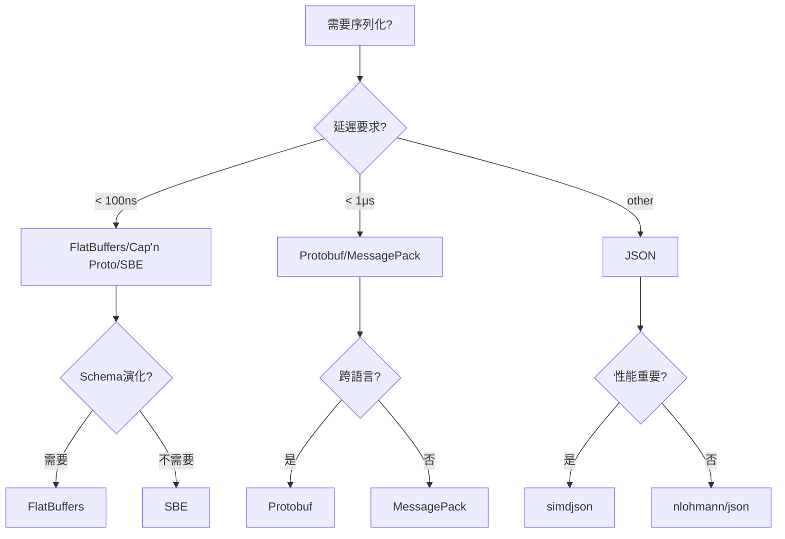

# 序列化庫

> **優先級**: ⭐⭐⭐ 必看
> **適用場景**: HFT、網路通信、數據持久化
> **前置知識**: 內存佈局、網路協議、二進制編碼

## 目錄

- [核心概念](#核心概念)
- [FlatBuffers - 零拷貝序列化](#flatbuffers---零拷貝序列化)
- [Protocol Buffers](#protocol-buffers)
- [JSON庫對比](#json庫對比)
- [Cap'n Proto](#capn-proto)
- [MessagePack](#messagepack)
- [SBE - 金融專用](#sbe---金融專用)
- [性能對比](#性能對比)
- [HFT應用場景](#hft應用場景)
- [最佳實踐](#最佳實踐)
- [參考資料](#參考資料)

---

## 核心概念

### 序列化基礎

**序列化(Serialization)** 是將內存中的數據結構轉換為字節流的過程,以便:
- 網路傳輸
- 磁盤存儲
- 進程間通信

**類比:**
- **對象**: 組裝好的樂高模型(有結構、有指針引用)
- **序列化**: 拆成積木塊並寫下說明書(扁平字節流)
- **反序列化**: 根據說明書重新組裝

### HFT序列化要求

| 特性       | 傳統序列化(JSON) | HFT要求(FlatBuffers) |
| ---------- | ---------------- | -------------------- |
| 延遲       | ~1-5 μs          | < 100 ns             |
| 零拷貝     | ❌               | ✅                   |
| Schema演化 | ❌               | ✅                   |
| 可讀性     | 高               | 低(二進制)           |
| 大小       | 大               | 小                   |

---

## FlatBuffers - 零拷貝序列化

### 核心原理

FlatBuffers採用**零拷貝(Zero-Copy)**設計:
- 序列化數據可直接訪問,無需解析
- 數據按內存佈局存儲,訪問即指針偏移
- 延遲 < 10ns,適合極低延遲場景

**優勢:**
- **極低延遲**: 訪問延遲 < 10ns
- **無額外分配**: 直接在原始緩衝區操作
- **向後兼容**: Schema可演化
- **跨語言**: C++/Python/Java/Go等

### 安裝配置

```bash
# Ubuntu/Debian
sudo apt-get install flatbuffers-compiler libflatbuffers-dev

# 從源碼編譯
git clone https://github.com/google/flatbuffers.git
cd flatbuffers
cmake -G "Unix Makefiles" -DCMAKE_BUILD_TYPE=Release
make -j$(nproc)
sudo make install

# 驗證安裝
flatc --version
```

**CMake集成:**

```cmake
find_package(flatbuffers REQUIRED)

# 編譯Schema
add_custom_command(
    OUTPUT ${CMAKE_CURRENT_BINARY_DIR}/order_generated.h
    COMMAND flatc --cpp -o ${CMAKE_CURRENT_BINARY_DIR} 
            ${CMAKE_CURRENT_SOURCE_DIR}/order.fbs
    DEPENDS ${CMAKE_CURRENT_SOURCE_DIR}/order.fbs
)

target_include_directories(myapp PRIVATE 
    ${FLATBUFFERS_INCLUDE_DIR}
    ${CMAKE_CURRENT_BINARY_DIR})
```

### Schema定義

```flatbuffers
// order.fbs
namespace Trading;

enum Side : byte { Buy = 0, Sell = 1 }
enum OrderType : byte { Market = 0, Limit = 1, Stop = 2 }
enum OrderStatus : byte { New = 0, PartiallyFilled = 1, Filled = 2, Cancelled = 3 }

table Order {
    order_id: ulong;
    symbol: string;
    side: Side;
    type: OrderType;
    price: double;
    quantity: uint;
    filled_quantity: uint = 0;
    status: OrderStatus = New;
    timestamp: ulong;
    client_id: string;
}

table MarketData {
    symbol_id: uint;
    bid_price: double;
    bid_size: uint;
    ask_price: double;
    ask_size: uint;
    last_price: double;
    last_size: uint;
    timestamp: ulong;
}

table ExecutionReport {
    order_id: ulong;
    exec_id: ulong;
    symbol: string;
    side: Side;
    exec_price: double;
    exec_quantity: uint;
    leaves_quantity: uint;
    cum_quantity: uint;
    status: OrderStatus;
    timestamp: ulong;
}

root_type Order;
```

**編譯Schema:**

```bash
flatc --cpp order.fbs
# 生成: order_generated.h
```

### 基本使用

```cpp
#include "order_generated.h"
#include <flatbuffers/flatbuffers.h>
#include <iostream>

// 創建FlatBuffer
std::vector<uint8_t> create_order(uint64_t order_id, const std::string& symbol,
                                  Trading::Side side, double price, uint32_t quantity) {
    flatbuffers::FlatBufferBuilder builder(1024);
    
    // 創建字符串
    auto symbol_str = builder.CreateString(symbol);
    auto client_id_str = builder.CreateString("CLIENT-001");
    
    // 創建Order對象
    auto order = Trading::CreateOrder(builder,
        order_id,                           // order_id
        symbol_str,                         // symbol
        side,                               // side
        Trading::OrderType_Limit,           // type
        price,                              // price
        quantity,                           // quantity
        0,                                  // filled_quantity
        Trading::OrderStatus_New,           // status
        get_timestamp_ns(),                 // timestamp
        client_id_str                       // client_id
    );
    
    builder.Finish(order);
    
    // 獲取緩衝區
    uint8_t* buf = builder.GetBufferPointer();
    int size = builder.GetSize();
    
    return std::vector<uint8_t>(buf, buf + size);
}

// 讀取FlatBuffer (零拷貝!)
void read_order(const std::vector<uint8_t>& buffer) {
    // 直接訪問,無需解析!
    auto order = Trading::GetOrder(buffer.data());
    
    std::cout << "Order ID: " << order->order_id() << "\n";
    std::cout << "Symbol: " << order->symbol()->str() << "\n";
    std::cout << "Side: " << (order->side() == Trading::Side_Buy ? "Buy" : "Sell") << "\n";
    std::cout << "Price: " << order->price() << "\n";
    std::cout << "Quantity: " << order->quantity() << "\n";
    std::cout << "Status: " << static_cast<int>(order->status()) << "\n";
}

// 輔助函數
uint64_t get_timestamp_ns() {
    return std::chrono::duration_cast<std::chrono::nanoseconds>(
        std::chrono::high_resolution_clock::now().time_since_epoch()).count();
}
```

### 高級特性

#### 1. 向量和嵌套表

```flatbuffers
// advanced.fbs
namespace Trading;

table PriceLevel {
    price: double;
    quantity: uint;
}

table OrderBook {
    symbol: string;
    bids: [PriceLevel];  // 向量
    asks: [PriceLevel];
    timestamp: ulong;
}
```

```cpp
#include "advanced_generated.h"

std::vector<uint8_t> create_order_book(const std::string& symbol) {
    flatbuffers::FlatBufferBuilder builder(4096);
    
    // 創建買單價格等級
    std::vector<flatbuffers::Offset<Trading::PriceLevel>> bids;
    bids.push_back(Trading::CreatePriceLevel(builder, 150.00, 100));
    bids.push_back(Trading::CreatePriceLevel(builder, 149.99, 200));
    bids.push_back(Trading::CreatePriceLevel(builder, 149.98, 150));
    
    // 創建賣單價格等級
    std::vector<flatbuffers::Offset<Trading::PriceLevel>> asks;
    asks.push_back(Trading::CreatePriceLevel(builder, 150.01, 150));
    asks.push_back(Trading::CreatePriceLevel(builder, 150.02, 200));
    asks.push_back(Trading::CreatePriceLevel(builder, 150.03, 100));
    
    auto symbol_str = builder.CreateString(symbol);
    auto bids_vec = builder.CreateVector(bids);
    auto asks_vec = builder.CreateVector(asks);
    
    auto order_book = Trading::CreateOrderBook(builder,
        symbol_str,
        bids_vec,
        asks_vec,
        get_timestamp_ns()
    );
    
    builder.Finish(order_book);
    
    uint8_t* buf = builder.GetBufferPointer();
    return std::vector<uint8_t>(buf, buf + builder.GetSize());
}

void read_order_book(const std::vector<uint8_t>& buffer) {
    auto order_book = Trading::GetOrderBook(buffer.data());
    
    std::cout << "Symbol: " << order_book->symbol()->str() << "\n";
    
    std::cout << "Bids:\n";
    for (auto bid : *order_book->bids()) {
        std::cout << "  " << bid->price() << " x " << bid->quantity() << "\n";
    }
    
    std::cout << "Asks:\n";
    for (auto ask : *order_book->asks()) {
        std::cout << "  " << ask->price() << " x " << ask->quantity() << "\n";
    }
}
```

#### 2. Union類型

```flatbuffers
namespace Trading;

table NewOrder { order_id: ulong; /* ... */ }
table CancelOrder { order_id: ulong; }
table ModifyOrder { order_id: ulong; new_price: double; }

union OrderAction { NewOrder, CancelOrder, ModifyOrder }

table Message {
    action: OrderAction;
    timestamp: ulong;
}
```

#### 3. 內存池優化

```cpp
class FlatBuffersPool {
public:
    FlatBuffersPool(size_t initial_capacity = 4096)
        : builder_(initial_capacity) {}
    
    // 重用builder,避免重複分配
    template<typename CreateFunc>
    const uint8_t* serialize(CreateFunc&& create_func) {
        builder_.Clear();  // 重用緩衝區
        
        create_func(builder_);
        
        return builder_.GetBufferPointer();
    }
    
    size_t size() const { return builder_.GetSize(); }
    
private:
    flatbuffers::FlatBufferBuilder builder_;
};

// 使用示例
FlatBuffersPool pool;

const uint8_t* buffer = pool.serialize([&](auto& builder) {
    auto symbol = builder.CreateString("AAPL");
    auto order = Trading::CreateOrder(builder, 
        12345, symbol, Trading::Side_Buy, Trading::OrderType_Limit,
        150.50, 100, 0, Trading::OrderStatus_New, get_timestamp_ns(), 0);
    builder.Finish(order);
});
```

### HFT市場數據應用

```cpp
#include "order_generated.h"
#include <boost/lockfree/spsc_queue.hpp>

class MarketDataSerializer {
public:
    MarketDataSerializer() : builder_(4096) {}
    
    // 序列化市場數據 (重用builder)
    const uint8_t* serialize_tick(uint32_t symbol_id, 
                                  double bid, uint32_t bid_size,
                                  double ask, uint32_t ask_size,
                                  double last, uint32_t last_size) {
        builder_.Clear();
        
        auto md = Trading::CreateMarketData(builder_,
            symbol_id, bid, bid_size, ask, ask_size,
            last, last_size, get_timestamp_ns());
        
        builder_.Finish(md);
        return builder_.GetBufferPointer();
    }
    
    size_t size() const { return builder_.GetSize(); }
    
private:
    flatbuffers::FlatBufferBuilder builder_;
};

// 網路接收線程
void network_thread() {
    MarketDataSerializer serializer;
    
    while (running) {
        // 接收原始數據
        RawMarketData raw = receive_from_exchange();
        
        // 序列化 (極快, ~50ns)
        const uint8_t* buffer = serializer.serialize_tick(
            raw.symbol_id, raw.bid, raw.bid_size,
            raw.ask, raw.ask_size, raw.last, raw.last_size);
        
        // 傳遞給處理線程 (零拷貝發送指針)
        send_to_processor(buffer, serializer.size());
    }
}

// 處理線程
void processor_thread() {
    while (running) {
        const uint8_t* buffer = receive_from_network();
        
        // 零拷貝訪問 (< 10ns)
        auto md = Trading::GetMarketData(buffer);
        
        // 直接使用,無需複製!
        update_order_book(md->symbol_id(), md->bid_price(), md->ask_price());
    }
}
```

---

## Protocol Buffers

### 核心特性

**優勢:**
- 行業標準,廣泛採用
- 強大的Schema演化
- 優秀的跨語言支持
- 豐富的生態系統

**劣勢:**
- 需要解析,延遲較高(~100-500ns)
- 無零拷貝支持
- 不適合極端延遲敏感場景

### 安裝配置

```bash
# Ubuntu/Debian
sudo apt-get install protobuf-compiler libprotobuf-dev

# 驗證
protoc --version

# CMake集成
find_package(Protobuf REQUIRED)

add_custom_command(
    OUTPUT order.pb.cc order.pb.h
    COMMAND protoc --cpp_out=. ${CMAKE_CURRENT_SOURCE_DIR}/order.proto
    DEPENDS order.proto
)

target_link_libraries(myapp ${Protobuf_LIBRARIES})
```

### Schema定義

```protobuf
// order.proto
syntax = "proto3";

package trading;

enum Side {
    BUY = 0;
    SELL = 1;
}

enum OrderType {
    MARKET = 0;
    LIMIT = 1;
    STOP = 2;
}

enum OrderStatus {
    NEW = 0;
    PARTIALLY_FILLED = 1;
    FILLED = 2;
    CANCELLED = 3;
}

message Order {
    uint64 order_id = 1;
    string symbol = 2;
    Side side = 3;
    OrderType type = 4;
    double price = 5;
    uint32 quantity = 6;
    uint32 filled_quantity = 7;
    OrderStatus status = 8;
    uint64 timestamp = 9;
    string client_id = 10;
}

message MarketData {
    uint32 symbol_id = 1;
    double bid_price = 2;
    uint32 bid_size = 3;
    double ask_price = 4;
    uint32 ask_size = 5;
    double last_price = 6;
    uint32 last_size = 7;
    uint64 timestamp = 8;
}

message OrderBook {
    string symbol = 1;
    
    message PriceLevel {
        double price = 1;
        uint32 quantity = 2;
    }
    
    repeated PriceLevel bids = 2;
    repeated PriceLevel asks = 3;
    uint64 timestamp = 4;
}
```

**編譯:**

```bash
protoc --cpp_out=. order.proto
# 生成: order.pb.h, order.pb.cc
```

### 使用示例

```cpp
#include "order.pb.h"
#include <iostream>
#include <fstream>

// 創建消息
void create_order_pb() {
    trading::Order order;
    order.set_order_id(12345);
    order.set_symbol("AAPL");
    order.set_side(trading::Side::BUY);
    order.set_type(trading::OrderType::LIMIT);
    order.set_price(150.50);
    order.set_quantity(100);
    order.set_filled_quantity(0);
    order.set_status(trading::OrderStatus::NEW);
    order.set_timestamp(get_timestamp_ns());
    order.set_client_id("CLIENT-001");
    
    // 序列化到字符串
    std::string serialized;
    order.SerializeToString(&serialized);
    
    std::cout << "Serialized size: " << serialized.size() << " bytes\n";
    
    // 序列化到文件
    std::ofstream output("order.bin", std::ios::binary);
    order.SerializeToOstream(&output);
}

// 反序列化
void read_order_pb(const std::string& serialized) {
    trading::Order order;
    order.ParseFromString(serialized);
    
    std::cout << "Order ID: " << order.order_id() << "\n";
    std::cout << "Symbol: " << order.symbol() << "\n";
    std::cout << "Side: " << (order.side() == trading::Side::BUY ? "Buy" : "Sell") << "\n";
    std::cout << "Price: " << order.price() << "\n";
    std::cout << "Quantity: " << order.quantity() << "\n";
}

// 處理嵌套消息
void create_order_book_pb() {
    trading::OrderBook book;
    book.set_symbol("AAPL");
    book.set_timestamp(get_timestamp_ns());
    
    // 添加買單
    for (int i = 0; i < 5; ++i) {
        auto* bid = book.add_bids();
        bid->set_price(150.00 - i * 0.01);
        bid->set_quantity(100 + i * 50);
    }
    
    // 添加賣單
    for (int i = 0; i < 5; ++i) {
        auto* ask = book.add_asks();
        ask->set_price(150.01 + i * 0.01);
        ask->set_quantity(100 + i * 50);
    }
    
    // 序列化
    std::string serialized;
    book.SerializeToString(&serialized);
    
    // 反序列化
    trading::OrderBook book2;
    book2.ParseFromString(serialized);
    
    std::cout << "Symbol: " << book2.symbol() << "\n";
    std::cout << "Bids:\n";
    for (const auto& bid : book2.bids()) {
        std::cout << "  " << bid.price() << " x " << bid.quantity() << "\n";
    }
}
```

### Arena分配器(性能優化)

```cpp
#include "order.pb.h"
#include <google/protobuf/arena.h>

void arena_optimization() {
    // 使用Arena減少分配
    google::protobuf::Arena arena;
    
    // 在Arena上創建消息
    trading::Order* order = google::protobuf::Arena::CreateMessage<trading::Order>(&arena);
    
    order->set_order_id(12345);
    order->set_symbol("AAPL");
    order->set_price(150.50);
    
    // Arena析構時自動釋放所有消息
}
```

---

## JSON庫對比

### nlohmann/json

**優勢:**
- Header-only,易集成
- 現代C++ API
- 類型安全

```cpp
#include <nlohmann/json.hpp>

using json = nlohmann::json;

void nlohmann_json_example() {
    // 創建JSON
    json order = {
        {"order_id", 12345},
        {"symbol", "AAPL"},
        {"side", "Buy"},
        {"price", 150.50},
        {"quantity", 100}
    };
    
    // 序列化
    std::string serialized = order.dump();
    
    // 反序列化
    json order2 = json::parse(serialized);
    
    // 類型安全訪問
    uint64_t order_id = order2["order_id"].get<uint64_t>();
    std::string symbol = order2["symbol"].get<std::string>();
    double price = order2["price"].get<double>();
}

// 自定義類型綁定
struct Order {
    uint64_t order_id;
    std::string symbol;
    double price;
    uint32_t quantity;
};

void to_json(json& j, const Order& o) {
    j = json{
        {"order_id", o.order_id},
        {"symbol", o.symbol},
        {"price", o.price},
        {"quantity", o.quantity}
    };
}

void from_json(const json& j, Order& o) {
    j.at("order_id").get_to(o.order_id);
    j.at("symbol").get_to(o.symbol);
    j.at("price").get_to(o.price);
    j.at("quantity").get_to(o.quantity);
}
```

### simdjson - SIMD優化

**優勢:**
- 極快解析速度(GB/s)
- SIMD指令優化
- 適合大量JSON處理

```cpp
#include <simdjson.h>

void simdjson_example() {
    simdjson::dom::parser parser;
    
    std::string json_str = R"({
        "order_id": 12345,
        "symbol": "AAPL",
        "price": 150.50,
        "quantity": 100
    })";
    
    // 解析
    simdjson::dom::element doc = parser.parse(json_str);
    
    // 訪問字段
    uint64_t order_id = doc["order_id"];
    std::string_view symbol = doc["symbol"];
    double price = doc["price"];
    
    std::cout << "Order: " << order_id << ", " << symbol << " @ " << price << "\n";
}

// 流式解析(大文件)
void simdjson_streaming() {
    simdjson::dom::parser parser;
    simdjson::dom::element doc = parser.load("large_orders.json");
    
    for (simdjson::dom::element order : doc["orders"]) {
        uint64_t id = order["order_id"];
        std::string_view symbol = order["symbol"];
        // 處理訂單...
    }
}
```

---

## Cap'n Proto

### 核心特性

類似FlatBuffers,但設計更激進:
- **無編碼階段**: 直接在內存中構建消息
- **極致性能**: 比FlatBuffers更快
- **RPC支持**: 內建RPC框架

```bash
# 安裝
sudo apt-get install capnproto libcapnp-dev
```

```capnp
# order.capnp
@0x8f3c4e5d6a7b9c1e;

struct Order {
    orderId @0 :UInt64;
    symbol @1 :Text;
    side @2 :Side;
    price @3 :Float64;
    quantity @4 :UInt32;
}

enum Side {
    buy @0;
    sell @1;
}
```

---

## MessagePack

### 核心特性

高效的二進制JSON替代方案:
- 比JSON小,比Protobuf快
- 無需Schema
- 支持動態類型

```cpp
#include <msgpack.hpp>
#include <vector>

struct Order {
    uint64_t order_id;
    std::string symbol;
    double price;
    uint32_t quantity;
    
    MSGPACK_DEFINE(order_id, symbol, price, quantity);
};

void messagepack_example() {
    Order order{12345, "AAPL", 150.50, 100};
    
    // 序列化
    msgpack::sbuffer buffer;
    msgpack::pack(buffer, order);
    
    // 反序列化
    msgpack::object_handle oh = msgpack::unpack(buffer.data(), buffer.size());
    msgpack::object obj = oh.get();
    
    Order order2;
    obj.convert(order2);
    
    std::cout << "Order: " << order2.order_id << ", " 
              << order2.symbol << " @ " << order2.price << "\n";
}
```

---

## SBE - 金融專用

### Simple Binary Encoding

**特點:**
- 金融行業標準(FIX/FAST演進)
- 固定長度編碼,可預測性能
- CME, ICE等交易所使用

```xml
<!-- order.xml -->
<sbe:messageSchema package="trading" id="1">
    <types>
        <type name="OrderID" primitiveType="uint64"/>
        <type name="Price" primitiveType="double"/>
    </types>
    
    <sbe:message name="NewOrder" id="1">
        <field name="orderId" id="1" type="OrderID"/>
        <field name="symbol" id="2" type="char" length="8"/>
        <field name="price" id="3" type="Price"/>
        <field name="quantity" id="4" type="uint32"/>
    </sbe:message>
</sbe:messageSchema>
```

---

## 性能對比

### 延遲對比

| 庫          | 序列化(ns) | 反序列化(ns) | 大小(bytes) | HFT推薦    |
| ----------- | ---------- | ------------ | ----------- | ---------- |
| FlatBuffers | ~50        | ~5 (零拷貝)  | 80          | ⭐⭐⭐⭐⭐ |
| Cap'n Proto | ~30        | ~3 (零拷貝)  | 72          | ⭐⭐⭐⭐⭐ |
| SBE         | ~20        | ~10          | 64          | ⭐⭐⭐⭐⭐ |
| Protobuf    | ~200       | ~300         | 60          | ⭐⭐⭐     |
| MessagePack | ~150       | ~250         | 68          | ⭐⭐⭐     |
| simdjson    | -          | ~200         | 120         | ⭐⭐⭐⭐   |
| nlohmann    | ~1000      | ~2000        | 120         | ⭐⭐       |

### Benchmark代碼

```cpp
#include <benchmark/benchmark.h>
#include "order_generated.h"  // FlatBuffers
#include "order.pb.h"          // Protobuf

static void BM_FlatBuffers_Serialize(benchmark::State& state) {
    for (auto _ : state) {
        flatbuffers::FlatBufferBuilder builder(1024);
        auto symbol = builder.CreateString("AAPL");
        auto order = Trading::CreateOrder(builder, 12345, symbol, 
            Trading::Side_Buy, Trading::OrderType_Limit, 150.50, 100,
            0, Trading::OrderStatus_New, get_timestamp_ns(), 0);
        builder.Finish(order);
        benchmark::DoNotOptimize(builder.GetBufferPointer());
    }
}
BENCHMARK(BM_FlatBuffers_Serialize);

static void BM_FlatBuffers_Deserialize(benchmark::State& state) {
    auto buffer = create_order_flatbuffers();
    for (auto _ : state) {
        auto order = Trading::GetOrder(buffer.data());
        benchmark::DoNotOptimize(order->order_id());
    }
}
BENCHMARK(BM_FlatBuffers_Deserialize);

static void BM_Protobuf_Serialize(benchmark::State& state) {
    for (auto _ : state) {
        trading::Order order;
        order.set_order_id(12345);
        order.set_symbol("AAPL");
        order.set_price(150.50);
        order.set_quantity(100);
        
        std::string serialized;
        order.SerializeToString(&serialized);
        benchmark::DoNotOptimize(serialized);
    }
}
BENCHMARK(BM_Protobuf_Serialize);

BENCHMARK_MAIN();
```

---

## HFT應用場景

### 場景1: 市場數據分發

```cpp
#include "order_generated.h"
#include <boost/lockfree/spsc_queue.hpp>

// 零拷貝市場數據管線
class MarketDataPipeline {
public:
    void on_market_data_received(const uint8_t* raw_data, size_t size) {
        // 零拷貝: 直接訪問FlatBuffer
        auto md = Trading::GetMarketData(raw_data);
        
        // 更新訂單簿 (< 100ns)
        update_order_book(md->symbol_id(), md->bid_price(), 
                         md->bid_size(), md->ask_price(), md->ask_size());
        
        // 觸發策略
        strategy_callback(md);
    }
    
private:
    void update_order_book(uint32_t symbol_id, double bid, uint32_t bid_size,
                          double ask, uint32_t ask_size) {
        // 訂單簿更新邏輯
    }
    
    void strategy_callback(const Trading::MarketData* md) {
        // 策略決策
    }
};
```

### 場景2: 訂單持久化

```cpp
#include "order.pb.h"
#include <fstream>

class OrderPersistence {
public:
    // 持久化訂單 (使用Protobuf,支持Schema演化)
    void persist_order(const trading::Order& order) {
        std::ofstream ofs("orders/" + std::to_string(order.order_id()) + ".pb",
                         std::ios::binary);
        order.SerializeToOstream(&ofs);
    }
    
    // 加載訂單
    std::optional<trading::Order> load_order(uint64_t order_id) {
        std::ifstream ifs("orders/" + std::to_string(order_id) + ".pb",
                         std::ios::binary);
        if (!ifs) return std::nullopt;
        
        trading::Order order;
        if (order.ParseFromIstream(&ifs)) {
            return order;
        }
        return std::nullopt;
    }
};
```

---

## 最佳實踐

### 1. 庫選擇決策樹



### 2. HFT推薦配置

```cpp
// ✅ 關鍵路徑: FlatBuffers (零拷貝)
FlatBuffersPool fb_pool;
auto market_data = fb_pool.serialize([](auto& builder) {
    // 序列化市場數據
});

// ✅ 持久化: Protobuf (Schema演化)
trading::Order order;
order.SerializeToOstream(&file);

// ✅ 配置文件: JSON (可讀性)
json config = json::parse(std::ifstream("config.json"));

// ❌ 避免: 關鍵路徑使用JSON
// json market_data = {{"price", 150.50}};  // 太慢!
```

### 3. 內存管理

```cpp
// ✅ 重用FlatBufferBuilder
class ReusableSerializer {
    flatbuffers::FlatBufferBuilder builder_{4096};
public:
    const uint8_t* serialize_order(/* params */) {
        builder_.Clear();  // 重用緩衝區
        // ... 創建消息
        return builder_.GetBufferPointer();
    }
};

// ✅ Protobuf Arena
google::protobuf::Arena arena;
auto* order = google::protobuf::Arena::CreateMessage<trading::Order>(&arena);

// ❌ 避免: 每次創建新builder
void bad_serialize() {
    flatbuffers::FlatBufferBuilder builder(1024);  // 重複分配!
    // ...
}
```

### 4. 錯誤處理

```cpp
// ✅ 驗證FlatBuffer
bool verify_flatbuffer(const uint8_t* buffer, size_t size) {
    flatbuffers::Verifier verifier(buffer, size);
    return Trading::VerifyOrderBuffer(verifier);
}

// ✅ Protobuf錯誤處理
bool safe_parse(const std::string& data, trading::Order& order) {
    if (!order.ParseFromString(data)) {
        spdlog::error("Failed to parse order");
        return false;
    }
    
    // 驗證必填字段
    if (!order.has_order_id() || !order.has_symbol()) {
        spdlog::error("Missing required fields");
        return false;
    }
    
    return true;
}
```

---

## 參考資料

1. **FlatBuffers**
   - [官方文檔](https://google.github.io/flatbuffers/)
   - [Performance Benchmarks](https://google.github.io/flatbuffers/flatbuffers_benchmarks.html)
   - [C++ Tutorial](https://google.github.io/flatbuffers/flatbuffers_guide_tutorial.html)

2. **Protocol Buffers**
   - [Language Guide](https://developers.google.com/protocol-buffers/docs/proto3)
   - [C++ Tutorial](https://developers.google.com/protocol-buffers/docs/cpptutorial)
   - [Encoding](https://developers.google.com/protocol-buffers/docs/encoding)

3. **JSON Libraries**
   - [nlohmann/json](https://github.com/nlohmann/json)
   - [simdjson](https://github.com/simdjson/simdjson)
   - [RapidJSON](https://github.com/Tencent/rapidjson)

4. **Other Formats**
   - [Cap'n Proto](https://capnproto.org/)
   - [MessagePack](https://msgpack.org/)
   - [SBE](https://github.com/real-logic/simple-binary-encoding)

5. **Performance Analysis**
   - 《Designing Data-Intensive Applications》- Martin Kleppmann
   - 《High Performance Browser Networking》- Ilya Grigorik
   - [Serialization Benchmarks](https://github.com/thekvs/cpp-serializers)
