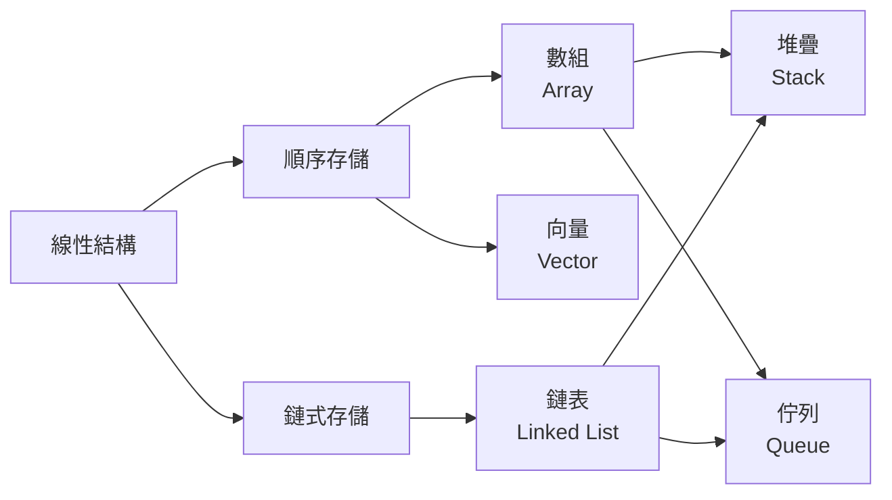
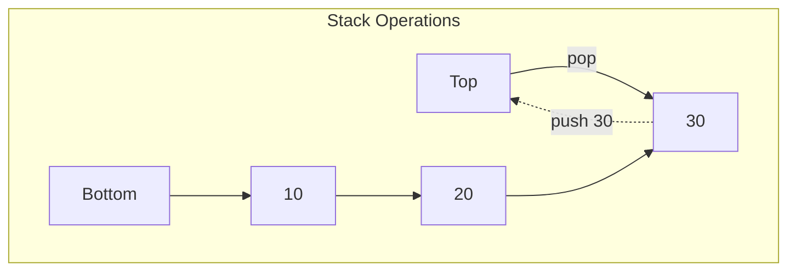
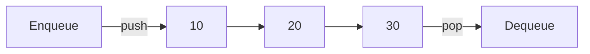

# 線性結構

> **優先級**: ⭐⭐⭐ 必看
>
> **適用場景**: 通用開發 / 演算法基礎 / 面試必考
>
> **前置知識**: C++ 基礎語法、指針、RAII、智能指針

---

## 目錄

1. [核心概念](#1-核心概念)
2. [動態數組](#2-動態數組-dynamic-array)
3. [鏈表](#3-鏈表-linked-list)
4. [堆疊](#4-堆疊-stack)
5. [佇列](#5-佇列-queue)
6. [實戰案例](#6-實戰案例)
7. [性能對比](#7-性能對比)
8. [常見陷阱](#8-常見陷阱)
9. [參考資料](#參考資料)

---

## 1. 核心概念

### 1.1 什麼是線性結構?

**線性結構 (Linear Data Structure)** 是指數據元素之間存在一對一的線性關係的數據結構。

**特徵**:
- 每個元素最多只有一個前驅和一個後繼
- 數據元素按順序排列
- 可以順序存取或隨機存取

**常見線性結構**:



### 1.2 順序存儲 vs 鏈式存儲

| 特性 | 順序存儲 (Array) | 鏈式存儲 (Linked List) |
|------|-----------------|----------------------|
| **記憶體佈局** | 連續 | 非連續 |
| **隨機存取** | O(1) | O(n) |
| **插入/刪除** | O(n) (需移動元素) | O(1) (已知位置) |
| **Cache 友好** | ✅ 優秀 | ❌ 較差 |
| **記憶體開銷** | 低 (僅存數據) | 高 (需存指針) |
| **擴容策略** | 需重新分配 | 按需分配 |

---

## 2. 動態數組 (Dynamic Array)

### 2.1 核心概念

動態數組支持在運行時動態調整大小,是 `std::vector` 的底層實現原理。

**時間複雜度**:

| 操作 | 平均 | 最壞 |
|------|------|------|
| 訪問 | O(1) | O(1) |
| 插入 (尾部) | O(1) 均攤 | O(n) (擴容時) |
| 插入 (中間) | O(n) | O(n) |
| 刪除 (尾部) | O(1) | O(1) |
| 刪除 (中間) | O(n) | O(n) |

### 2.2 C 風格實現

```cpp
#include <cstdlib>
#include <cstring>
#include <iostream>

// C 風格動態數組
typedef struct {
    int* data;       // 數據指針
    size_t size;     // 當前元素數量
    size_t capacity; // 容量
} DynamicArray;

// 初始化
DynamicArray* array_create(size_t initial_capacity) {
    DynamicArray* arr = (DynamicArray*)malloc(sizeof(DynamicArray));
    arr->data = (int*)malloc(sizeof(int) * initial_capacity);
    arr->size = 0;
    arr->capacity = initial_capacity;
    return arr;
}

// 擴容 (1.5 倍增長策略)
void array_grow(DynamicArray* arr) {
    size_t new_capacity = arr->capacity + arr->capacity / 2;
    int* new_data = (int*)realloc(arr->data, sizeof(int) * new_capacity);
    
    if (!new_data) {
        fprintf(stderr, "Memory allocation failed\n");
        exit(1);
    }
    
    arr->data = new_data;
    arr->capacity = new_capacity;
}

// 尾部插入
void array_push_back(DynamicArray* arr, int value) {
    if (arr->size == arr->capacity) {
        array_grow(arr);
    }
    arr->data[arr->size++] = value;
}

// 訪問元素
int array_get(const DynamicArray* arr, size_t index) {
    if (index >= arr->size) {
        fprintf(stderr, "Index out of bounds\n");
        exit(1);
    }
    return arr->data[index];
}

// 銷毀
void array_destroy(DynamicArray* arr) {
    free(arr->data);
    free(arr);
}

// 使用範例
void example_c_array() {
    DynamicArray* arr = array_create(4);
    
    for (int i = 0; i < 10; ++i) {
        array_push_back(arr, i * 10);
        printf("Size: %zu, Capacity: %zu\n", arr->size, arr->capacity);
    }
    
    for (size_t i = 0; i < arr->size; ++i) {
        printf("%d ", array_get(arr, i));
    }
    printf("\n");
    
    array_destroy(arr);  // ⚠️ 必須手動釋放!
}
```

**關鍵點**:
- 使用 `realloc` 擴容,數據會自動拷貝
- 需手動管理記憶體 (`malloc`/`free`)
- 容易發生記憶體洩漏

### 2.3 現代 C++ 實現

```cpp
#include <iostream>
#include <memory>
#include <stdexcept>
#include <algorithm>

// 現代 C++ 動態數組 (模擬 std::vector)
template<typename T>
class Vector {
private:
    std::unique_ptr<T[]> data_;  // 智能指針管理記憶體
    size_t size_;
    size_t capacity_;

    void grow() {
        size_t new_capacity = capacity_ + capacity_ / 2;
        auto new_data = std::make_unique<T[]>(new_capacity);
        
        // 移動舊數據到新記憶體
        for (size_t i = 0; i < size_; ++i) {
            new_data[i] = std::move(data_[i]);
        }
        
        data_ = std::move(new_data);
        capacity_ = new_capacity;
    }

public:
    // 建構函式
    explicit Vector(size_t initial_capacity = 4)
        : data_(std::make_unique<T[]>(initial_capacity))
        , size_(0)
        , capacity_(initial_capacity) {}

    // 尾部插入
    void push_back(const T& value) {
        if (size_ == capacity_) {
            grow();
        }
        data_[size_++] = value;
    }

    void push_back(T&& value) {  // 移動版本
        if (size_ == capacity_) {
            grow();
        }
        data_[size_++] = std::move(value);
    }

    // 訪問元素
    T& operator[](size_t index) {
        return data_[index];  // 不檢查邊界 (與 std::vector 一致)
    }

    const T& operator[](size_t index) const {
        return data_[index];
    }

    // 安全訪問
    T& at(size_t index) {
        if (index >= size_) {
            throw std::out_of_range("Index out of bounds");
        }
        return data_[index];
    }

    // 尾部刪除
    void pop_back() {
        if (size_ > 0) {
            --size_;
        }
    }

    // Getters
    size_t size() const { return size_; }
    size_t capacity() const { return capacity_; }
    bool empty() const { return size_ == 0; }

    // 迭代器支持
    T* begin() { return data_.get(); }
    T* end() { return data_.get() + size_; }
    const T* begin() const { return data_.get(); }
    const T* end() const { return data_.get() + size_; }
};

// 使用範例
void example_modern_vector() {
    Vector<int> vec;
    
    for (int i = 0; i < 10; ++i) {
        vec.push_back(i * 10);
        std::cout << "Size: " << vec.size() 
                  << ", Capacity: " << vec.capacity() << "\n";
    }
    
    // Range-based for loop
    for (const auto& val : vec) {
        std::cout << val << " ";
    }
    std::cout << "\n";
    
    // 自動釋放記憶體 (RAII)
}
```

**優勢**:
- ✅ 自動記憶體管理 (RAII)
- ✅ 移動語義優化性能
- ✅ 異常安全
- ✅ 支持泛型 (模板)

### 2.4 std::vector 原理剖析

```cpp
#include <vector>
#include <iostream>

void analyze_vector_growth() {
    std::vector<int> v;
    size_t prev_capacity = 0;

    for (int i = 0; i < 20; ++i) {
        v.push_back(i);
        
        if (v.capacity() != prev_capacity) {
            std::cout << "Size: " << v.size() 
                      << ", Capacity: " << v.capacity() 
                      << ", Growth: " << (prev_capacity ? 
                         static_cast<double>(v.capacity()) / prev_capacity : 0.0)
                      << "x\n";
            prev_capacity = v.capacity();
        }
    }
}

// GCC/Clang 輸出: 1 -> 2 -> 4 -> 8 -> 16 (2 倍增長)
// MSVC 輸出: 1 -> 2 -> 3 -> 4 -> 6 -> 9 (1.5 倍增長)
```

**最佳實踐**:
```cpp
// ✅ 預分配容量
std::vector<int> vec;
vec.reserve(1000);  // 避免多次擴容

// ✅ 使用 emplace_back (就地構造)
vec.emplace_back(42);  // 比 push_back 更高效

// ❌ 避免頻繁插入到中間
vec.insert(vec.begin(), 99);  // O(n) 操作!
```

---

## 3. 鏈表 (Linked List)

### 3.1 單向鏈表 (Singly Linked List)

#### 核心概念

單向鏈表中每個節點包含數據和指向下一個節點的指針。


**時間複雜度**:

| 操作 | 平均 | 最壞 |
|------|------|------|
| 訪問 | O(n) | O(n) |
| 搜尋 | O(n) | O(n) |
| 插入 (頭部) | O(1) | O(1) |
| 插入 (尾部) | O(n) 無尾指針 | O(1) 有尾指針 |
| 刪除 (頭部) | O(1) | O(1) |
| 刪除 (已知節點) | O(1) | O(1) |

#### C 風格實現

```cpp
#include <cstdlib>
#include <iostream>

// 節點定義
struct Node {
    int data;
    Node* next;
};

// 鏈表定義
struct LinkedList {
    Node* head;
    size_t size;
};

// 初始化
LinkedList* list_create() {
    LinkedList* list = (LinkedList*)malloc(sizeof(LinkedList));
    list->head = nullptr;
    list->size = 0;
    return list;
}

// 頭部插入 O(1)
void list_push_front(LinkedList* list, int value) {
    Node* new_node = (Node*)malloc(sizeof(Node));
    new_node->data = value;
    new_node->next = list->head;
    list->head = new_node;
    list->size++;
}

// 尾部插入 O(n)
void list_push_back(LinkedList* list, int value) {
    Node* new_node = (Node*)malloc(sizeof(Node));
    new_node->data = value;
    new_node->next = nullptr;

    if (!list->head) {
        list->head = new_node;
    } else {
        Node* current = list->head;
        while (current->next) {
            current = current->next;
        }
        current->next = new_node;
    }
    list->size++;
}

// 刪除頭部 O(1)
void list_pop_front(LinkedList* list) {
    if (!list->head) return;
    
    Node* temp = list->head;
    list->head = list->head->next;
    free(temp);
    list->size--;
}

// 搜尋
Node* list_find(LinkedList* list, int value) {
    Node* current = list->head;
    while (current) {
        if (current->data == value) {
            return current;
        }
        current = current->next;
    }
    return nullptr;
}

// 打印
void list_print(const LinkedList* list) {
    Node* current = list->head;
    while (current) {
        printf("%d -> ", current->data);
        current = current->next;
    }
    printf("NULL\n");
}

// 銷毀 (必須逐個釋放節點)
void list_destroy(LinkedList* list) {
    Node* current = list->head;
    while (current) {
        Node* next = current->next;
        free(current);
        current = next;
    }
    free(list);
}

// 使用範例
void example_c_linked_list() {
    LinkedList* list = list_create();
    
    list_push_front(list, 30);
    list_push_front(list, 20);
    list_push_front(list, 10);
    list_push_back(list, 40);
    
    list_print(list);  // 10 -> 20 -> 30 -> 40 -> NULL
    
    list_pop_front(list);
    list_print(list);  // 20 -> 30 -> 40 -> NULL
    
    list_destroy(list);  // ⚠️ 必須手動釋放每個節點!
}
```

**常見錯誤**:
```cpp
// ❌ 記憶體洩漏
void bad_destroy(LinkedList* list) {
    free(list);  // 只釋放了結構體,節點記憶體洩漏!
}

// ❌ 野指針
Node* current = list->head;
free(current);
printf("%d\n", current->data);  // 未定義行為!
```

#### 現代 C++ 實現

```cpp
#include <iostream>
#include <memory>
#include <optional>

// 現代 C++ 單向鏈表
template<typename T>
class LinkedList {
private:
    struct Node {
        T data;
        std::unique_ptr<Node> next;
        
        Node(const T& value) : data(value), next(nullptr) {}
        Node(T&& value) : data(std::move(value)), next(nullptr) {}
    };

    std::unique_ptr<Node> head_;
    size_t size_;

public:
    LinkedList() : head_(nullptr), size_(0) {}

    // 頭部插入 O(1)
    void push_front(const T& value) {
        auto new_node = std::make_unique<Node>(value);
        new_node->next = std::move(head_);
        head_ = std::move(new_node);
        ++size_;
    }

    void push_front(T&& value) {
        auto new_node = std::make_unique<Node>(std::move(value));
        new_node->next = std::move(head_);
        head_ = std::move(new_node);
        ++size_;
    }

    // 尾部插入 O(n)
    void push_back(const T& value) {
        auto new_node = std::make_unique<Node>(value);
        
        if (!head_) {
            head_ = std::move(new_node);
        } else {
            Node* current = head_.get();
            while (current->next) {
                current = current->next.get();
            }
            current->next = std::move(new_node);
        }
        ++size_;
    }

    // 刪除頭部 O(1)
    void pop_front() {
        if (!head_) return;
        head_ = std::move(head_->next);  // 自動釋放舊頭節點
        --size_;
    }

    // 搜尋
    std::optional<T> find(const T& value) const {
        Node* current = head_.get();
        while (current) {
            if (current->data == value) {
                return current->data;
            }
            current = current->next.get();
        }
        return std::nullopt;
    }

    // 訪問頭部
    std::optional<T> front() const {
        if (!head_) return std::nullopt;
        return head_->data;
    }

    // Getters
    size_t size() const { return size_; }
    bool empty() const { return size_ == 0; }

    // 打印 (需要 T 支持 <<)
    void print(std::ostream& os = std::cout) const {
        Node* current = head_.get();
        while (current) {
            os << current->data << " -> ";
            current = current->next.get();
        }
        os << "NULL\n";
    }

    // 析構函式自動遞迴釋放 (unique_ptr 鏈式銷毀)
    ~LinkedList() = default;
};

// 使用範例
void example_modern_linked_list() {
    LinkedList<int> list;
    
    list.push_front(30);
    list.push_front(20);
    list.push_front(10);
    list.push_back(40);
    
    list.print();  // 10 -> 20 -> 30 -> 40 -> NULL
    
    list.pop_front();
    list.print();  // 20 -> 30 -> 40 -> NULL
    
    auto result = list.find(30);
    if (result) {
        std::cout << "Found: " << *result << "\n";
    }
    
    // 自動釋放記憶體 (RAII)
}
```

**優勢**:
- ✅ 自動記憶體管理 (`unique_ptr` 鏈式銷毀)
- ✅ 異常安全
- ✅ 移動語義優化
- ✅ 使用 `std::optional` 表達無值狀態

### 3.2 雙向鏈表 (Doubly Linked List)

#### 核心概念

每個節點包含指向前驅和後繼的指針,支持雙向遍歷。


#### C 風格實現

```cpp
#include <cstdlib>
#include <iostream>

// 雙向鏈表節點
struct DNode {
    int data;
    DNode* prev;
    DNode* next;
};

// 雙向鏈表
struct DoublyLinkedList {
    DNode* head;
    DNode* tail;
    size_t size;
};

// 初始化
DoublyLinkedList* dlist_create() {
    DoublyLinkedList* list = (DoublyLinkedList*)malloc(sizeof(DoublyLinkedList));
    list->head = nullptr;
    list->tail = nullptr;
    list->size = 0;
    return list;
}

// 頭部插入 O(1)
void dlist_push_front(DoublyLinkedList* list, int value) {
    DNode* new_node = (DNode*)malloc(sizeof(DNode));
    new_node->data = value;
    new_node->prev = nullptr;
    new_node->next = list->head;

    if (list->head) {
        list->head->prev = new_node;
    } else {
        list->tail = new_node;  // 第一個節點同時是尾部
    }
    
    list->head = new_node;
    list->size++;
}

// 尾部插入 O(1)
void dlist_push_back(DoublyLinkedList* list, int value) {
    DNode* new_node = (DNode*)malloc(sizeof(DNode));
    new_node->data = value;
    new_node->prev = list->tail;
    new_node->next = nullptr;

    if (list->tail) {
        list->tail->next = new_node;
    } else {
        list->head = new_node;  // 第一個節點同時是頭部
    }
    
    list->tail = new_node;
    list->size++;
}

// 刪除指定節點 O(1)
void dlist_remove(DoublyLinkedList* list, DNode* node) {
    if (!node) return;

    if (node->prev) {
        node->prev->next = node->next;
    } else {
        list->head = node->next;  // 刪除頭部
    }

    if (node->next) {
        node->next->prev = node->prev;
    } else {
        list->tail = node->prev;  // 刪除尾部
    }

    free(node);
    list->size--;
}

// 正向打印
void dlist_print_forward(const DoublyLinkedList* list) {
    DNode* current = list->head;
    printf("Forward: ");
    while (current) {
        printf("%d <-> ", current->data);
        current = current->next;
    }
    printf("NULL\n");
}

// 反向打印
void dlist_print_backward(const DoublyLinkedList* list) {
    DNode* current = list->tail;
    printf("Backward: ");
    while (current) {
        printf("%d <-> ", current->data);
        current = current->prev;
    }
    printf("NULL\n");
}

// 銷毀
void dlist_destroy(DoublyLinkedList* list) {
    DNode* current = list->head;
    while (current) {
        DNode* next = current->next;
        free(current);
        current = next;
    }
    free(list);
}
```

#### 現代 C++ 實現

```cpp
#include <iostream>
#include <memory>

// 現代 C++ 雙向鏈表
template<typename T>
class DoublyLinkedList {
private:
    struct Node {
        T data;
        Node* prev;  // 使用裸指針 (不擁有所有權)
        std::unique_ptr<Node> next;  // 擁有後繼節點

        Node(const T& value) : data(value), prev(nullptr), next(nullptr) {}
        Node(T&& value) : data(std::move(value)), prev(nullptr), next(nullptr) {}
    };

    std::unique_ptr<Node> head_;
    Node* tail_;  // 裸指針指向尾部
    size_t size_;

public:
    DoublyLinkedList() : head_(nullptr), tail_(nullptr), size_(0) {}

    // 頭部插入 O(1)
    void push_front(const T& value) {
        auto new_node = std::make_unique<Node>(value);
        new_node->next = std::move(head_);

        if (new_node->next) {
            new_node->next->prev = new_node.get();
        } else {
            tail_ = new_node.get();
        }

        head_ = std::move(new_node);
        ++size_;
    }

    // 尾部插入 O(1)
    void push_back(const T& value) {
        auto new_node = std::make_unique<Node>(value);
        new_node->prev = tail_;

        if (tail_) {
            tail_->next = std::move(new_node);
            tail_ = tail_->next.get();
        } else {
            tail_ = new_node.get();
            head_ = std::move(new_node);
        }
        ++size_;
    }

    // 刪除頭部 O(1)
    void pop_front() {
        if (!head_) return;

        head_ = std::move(head_->next);
        if (head_) {
            head_->prev = nullptr;
        } else {
            tail_ = nullptr;
        }
        --size_;
    }

    // 刪除尾部 O(1)
    void pop_back() {
        if (!tail_) return;

        if (tail_->prev) {
            tail_ = tail_->prev;
            tail_->next.reset();
        } else {
            head_.reset();
            tail_ = nullptr;
        }
        --size_;
    }

    // 正向打印
    void print_forward(std::ostream& os = std::cout) const {
        os << "Forward: ";
        Node* current = head_.get();
        while (current) {
            os << current->data << " <-> ";
            current = current->next.get();
        }
        os << "NULL\n";
    }

    // 反向打印
    void print_backward(std::ostream& os = std::cout) const {
        os << "Backward: ";
        Node* current = tail_;
        while (current) {
            os << current->data << " <-> ";
            current = current->prev;
        }
        os << "NULL\n";
    }

    size_t size() const { return size_; }
    bool empty() const { return size_ == 0; }
};

// 使用範例
void example_modern_doubly_linked_list() {
    DoublyLinkedList<int> list;
    
    list.push_back(10);
    list.push_back(20);
    list.push_back(30);
    list.push_front(5);
    
    list.print_forward();   // Forward: 5 <-> 10 <-> 20 <-> 30 <-> NULL
    list.print_backward();  // Backward: 30 <-> 20 <-> 10 <-> 5 <-> NULL
    
    list.pop_front();
    list.pop_back();
    
    list.print_forward();   // Forward: 10 <-> 20 <-> NULL
}
```

**關鍵設計**:
- `next` 使用 `unique_ptr` (擁有所有權)
- `prev` 使用裸指針 (僅觀察)
- 尾指針使用裸指針 (由前驅節點的 `next` 管理)

### 3.3 std::list 與 std::forward_list

```cpp
#include <list>
#include <forward_list>
#include <iostream>

void example_std_list() {
    // std::list - 雙向鏈表
    std::list<int> lst = {10, 20, 30};
    
    lst.push_front(5);
    lst.push_back(40);
    
    // 雙向迭代器
    for (auto it = lst.rbegin(); it != lst.rend(); ++it) {
        std::cout << *it << " ";  // 40 30 20 10 5
    }
    std::cout << "\n";

    // std::forward_list - 單向鏈表 (更省記憶體)
    std::forward_list<int> flist = {10, 20, 30};
    
    flist.push_front(5);
    // flist.push_back(40);  // ❌ 不支持!
    
    // 僅前向迭代器
    for (const auto& val : flist) {
        std::cout << val << " ";  // 5 10 20 30
    }
    std::cout << "\n";
}
```

---

## 4. 堆疊 (Stack)

### 4.1 核心概念

**堆疊 (Stack)** 是一種後進先出 (Last In First Out, LIFO) 的線性結構。



**時間複雜度**:

| 操作 | 時間複雜度 |
|------|-----------|
| push | O(1) |
| pop | O(1) |
| top | O(1) |
| empty | O(1) |

### 4.2 C 風格實現 (基於數組)

```cpp
#include <cstdlib>
#include <iostream>

#define STACK_MAX_SIZE 100

// 固定大小堆疊
typedef struct {
    int data[STACK_MAX_SIZE];
    int top;  // 棧頂索引
} Stack;

// 初始化
Stack* stack_create() {
    Stack* s = (Stack*)malloc(sizeof(Stack));
    s->top = -1;  // 空棧
    return s;
}

// 入棧
int stack_push(Stack* s, int value) {
    if (s->top >= STACK_MAX_SIZE - 1) {
        fprintf(stderr, "Stack overflow\n");
        return 0;
    }
    s->data[++s->top] = value;
    return 1;
}

// 出棧
int stack_pop(Stack* s, int* value) {
    if (s->top < 0) {
        fprintf(stderr, "Stack underflow\n");
        return 0;
    }
    *value = s->data[s->top--];
    return 1;
}

// 查看棧頂
int stack_top(const Stack* s, int* value) {
    if (s->top < 0) {
        return 0;
    }
    *value = s->data[s->top];
    return 1;
}

// 檢查是否為空
int stack_is_empty(const Stack* s) {
    return s->top < 0;
}

// 銷毀
void stack_destroy(Stack* s) {
    free(s);
}

// 使用範例
void example_c_stack() {
    Stack* s = stack_create();
    
    stack_push(s, 10);
    stack_push(s, 20);
    stack_push(s, 30);
    
    int value;
    while (!stack_is_empty(s)) {
        stack_pop(s, &value);
        printf("%d ", value);  // 30 20 10 (LIFO)
    }
    printf("\n");
    
    stack_destroy(s);
}
```

### 4.3 現代 C++ 實現 (基於 vector)

```cpp
#include <iostream>
#include <vector>
#include <stdexcept>

// 現代 C++ 堆疊
template<typename T>
class Stack {
private:
    std::vector<T> data_;

public:
    // 入棧
    void push(const T& value) {
        data_.push_back(value);
    }

    void push(T&& value) {
        data_.push_back(std::move(value));
    }

    // 出棧
    void pop() {
        if (empty()) {
            throw std::underflow_error("Stack underflow");
        }
        data_.pop_back();
    }

    // 查看棧頂
    T& top() {
        if (empty()) {
            throw std::underflow_error("Stack is empty");
        }
        return data_.back();
    }

    const T& top() const {
        if (empty()) {
            throw std::underflow_error("Stack is empty");
        }
        return data_.back();
    }

    // 檢查是否為空
    bool empty() const {
        return data_.empty();
    }

    size_t size() const {
        return data_.size();
    }
};

// 使用範例
void example_modern_stack() {
    Stack<int> s;
    
    s.push(10);
    s.push(20);
    s.push(30);
    
    while (!s.empty()) {
        std::cout << s.top() << " ";  // 30 20 10
        s.pop();
    }
    std::cout << "\n";
}
```

### 4.4 std::stack

```cpp
#include <stack>
#include <iostream>

void example_std_stack() {
    std::stack<int> s;  // 默認底層容器為 std::deque
    
    s.push(10);
    s.push(20);
    s.push(30);
    
    std::cout << "Size: " << s.size() << "\n";
    std::cout << "Top: " << s.top() << "\n";
    
    while (!s.empty()) {
        std::cout << s.top() << " ";
        s.pop();
    }
    std::cout << "\n";
    
    // 自定義底層容器
    std::stack<int, std::vector<int>> vec_stack;
}
```

---

## 5. 佇列 (Queue)

### 5.1 核心概念

**佇列 (Queue)** 是一種先進先出 (First In First Out, FIFO) 的線性結構。



**時間複雜度**:

| 操作 | 時間複雜度 |
|------|-----------|
| enqueue | O(1) |
| dequeue | O(1) |
| front | O(1) |
| empty | O(1) |

### 5.2 C 風格實現 (環形佇列)

```cpp
#include <cstdlib>
#include <iostream>

#define QUEUE_MAX_SIZE 100

// 環形佇列 (避免假溢出)
typedef struct {
    int data[QUEUE_MAX_SIZE];
    int front;  // 隊首索引
    int rear;   // 隊尾索引
    int size;   // 當前元素數量
} CircularQueue;

// 初始化
CircularQueue* queue_create() {
    CircularQueue* q = (CircularQueue*)malloc(sizeof(CircularQueue));
    q->front = 0;
    q->rear = 0;
    q->size = 0;
    return q;
}

// 入隊
int queue_enqueue(CircularQueue* q, int value) {
    if (q->size >= QUEUE_MAX_SIZE) {
        fprintf(stderr, "Queue overflow\n");
        return 0;
    }
    q->data[q->rear] = value;
    q->rear = (q->rear + 1) % QUEUE_MAX_SIZE;  // 環形索引
    q->size++;
    return 1;
}

// 出隊
int queue_dequeue(CircularQueue* q, int* value) {
    if (q->size == 0) {
        fprintf(stderr, "Queue underflow\n");
        return 0;
    }
    *value = q->data[q->front];
    q->front = (q->front + 1) % QUEUE_MAX_SIZE;
    q->size--;
    return 1;
}

// 查看隊首
int queue_front(const CircularQueue* q, int* value) {
    if (q->size == 0) {
        return 0;
    }
    *value = q->data[q->front];
    return 1;
}

// 檢查是否為空
int queue_is_empty(const CircularQueue* q) {
    return q->size == 0;
}

// 銷毀
void queue_destroy(CircularQueue* q) {
    free(q);
}

// 使用範例
void example_c_queue() {
    CircularQueue* q = queue_create();
    
    queue_enqueue(q, 10);
    queue_enqueue(q, 20);
    queue_enqueue(q, 30);
    
    int value;
    while (!queue_is_empty(q)) {
        queue_dequeue(q, &value);
        printf("%d ", value);  // 10 20 30 (FIFO)
    }
    printf("\n");
    
    queue_destroy(q);
}
```

### 5.3 現代 C++ 實現 (基於 deque)

```cpp
#include <iostream>
#include <deque>
#include <stdexcept>

// 現代 C++ 佇列
template<typename T>
class Queue {
private:
    std::deque<T> data_;

public:
    // 入隊
    void enqueue(const T& value) {
        data_.push_back(value);
    }

    void enqueue(T&& value) {
        data_.push_back(std::move(value));
    }

    // 出隊
    void dequeue() {
        if (empty()) {
            throw std::underflow_error("Queue underflow");
        }
        data_.pop_front();
    }

    // 查看隊首
    T& front() {
        if (empty()) {
            throw std::underflow_error("Queue is empty");
        }
        return data_.front();
    }

    const T& front() const {
        if (empty()) {
            throw std::underflow_error("Queue is empty");
        }
        return data_.front();
    }

    // 查看隊尾
    T& back() {
        if (empty()) {
            throw std::underflow_error("Queue is empty");
        }
        return data_.back();
    }

    // 檢查是否為空
    bool empty() const {
        return data_.empty();
    }

    size_t size() const {
        return data_.size();
    }
};

// 使用範例
void example_modern_queue() {
    Queue<int> q;
    
    q.enqueue(10);
    q.enqueue(20);
    q.enqueue(30);
    
    while (!q.empty()) {
        std::cout << q.front() << " ";  // 10 20 30
        q.dequeue();
    }
    std::cout << "\n";
}
```

### 5.4 std::queue 與 std::deque

```cpp
#include <queue>
#include <deque>
#include <iostream>

void example_std_queue() {
    // std::queue - 佇列適配器
    std::queue<int> q;
    
    q.push(10);
    q.push(20);
    q.push(30);
    
    std::cout << "Front: " << q.front() << "\n";
    std::cout << "Back: " << q.back() << "\n";
    
    while (!q.empty()) {
        std::cout << q.front() << " ";
        q.pop();
    }
    std::cout << "\n";

    // std::deque - 雙端佇列 (直接使用)
    std::deque<int> dq;
    
    dq.push_back(10);   // 尾部插入
    dq.push_front(5);   // 頭部插入
    dq.push_back(20);
    
    std::cout << "Front: " << dq.front() << "\n";  // 5
    std::cout << "Back: " << dq.back() << "\n";    // 20
    
    dq.pop_front();
    dq.pop_back();
    
    std::cout << "After pop: " << dq.front() << "\n";  // 10
}
```

---

## 6. 實戰案例

### 6.1 括號匹配 (堆疊應用)

```cpp
#include <iostream>
#include <stack>
#include <string>
#include <unordered_map>

bool is_valid_parentheses(const std::string& s) {
    std::stack<char> stk;
    std::unordered_map<char, char> pairs = {
        {')', '('},
        {']', '['},
        {'}', '{'}
    };

    for (char ch : s) {
        if (ch == '(' || ch == '[' || ch == '{') {
            stk.push(ch);  // 左括號入棧
        } else {
            if (stk.empty() || stk.top() != pairs[ch]) {
                return false;  // 不匹配
            }
            stk.pop();
        }
    }

    return stk.empty();  // 所有括號都匹配
}

void example_parentheses_matching() {
    std::cout << std::boolalpha;
    std::cout << is_valid_parentheses("()[]{}") << "\n";     // true
    std::cout << is_valid_parentheses("([{}])") << "\n";     // true
    std::cout << is_valid_parentheses("(]") << "\n";         // false
    std::cout << is_valid_parentheses("([)]") << "\n";       // false
    std::cout << is_valid_parentheses("{[]}") << "\n";       // true
}
```

### 6.2 LRU Cache (雙向鏈表 + 雜湊表)

```cpp
#include <iostream>
#include <list>
#include <unordered_map>

// LRU Cache 實現
template<typename K, typename V>
class LRUCache {
private:
    size_t capacity_;
    std::list<std::pair<K, V>> cache_list_;  // 雙向鏈表 (最近使用在前)
    std::unordered_map<K, typename std::list<std::pair<K, V>>::iterator> cache_map_;

public:
    explicit LRUCache(size_t capacity) : capacity_(capacity) {}

    V get(const K& key) {
        auto it = cache_map_.find(key);
        if (it == cache_map_.end()) {
            throw std::runtime_error("Key not found");
        }

        // 移動到鏈表頭部 (最近使用)
        cache_list_.splice(cache_list_.begin(), cache_list_, it->second);
        return it->second->second;
    }

    void put(const K& key, const V& value) {
        auto it = cache_map_.find(key);

        // 已存在,更新值並移到頭部
        if (it != cache_map_.end()) {
            it->second->second = value;
            cache_list_.splice(cache_list_.begin(), cache_list_, it->second);
            return;
        }

        // 容量已滿,移除最久未使用的 (尾部)
        if (cache_list_.size() >= capacity_) {
            auto last = cache_list_.back();
            cache_map_.erase(last.first);
            cache_list_.pop_back();
        }

        // 插入到頭部
        cache_list_.emplace_front(key, value);
        cache_map_[key] = cache_list_.begin();
    }

    void print() const {
        std::cout << "Cache: ";
        for (const auto& [k, v] : cache_list_) {
            std::cout << "(" << k << ":" << v << ") ";
        }
        std::cout << "\n";
    }
};

void example_lru_cache() {
    LRUCache<int, std::string> cache(3);

    cache.put(1, "A");
    cache.put(2, "B");
    cache.put(3, "C");
    cache.print();  // (3:C) (2:B) (1:A)

    cache.get(1);   // 訪問 1
    cache.print();  // (1:A) (3:C) (2:B)

    cache.put(4, "D");  // 移除最久未使用的 2
    cache.print();  // (4:D) (1:A) (3:C)
}
```

### 6.3 訊息佇列 (Queue 應用)

```cpp
#include <iostream>
#include <queue>
#include <string>
#include <chrono>
#include <thread>

struct Message {
    int id;
    std::string content;
    std::chrono::system_clock::time_point timestamp;

    Message(int i, std::string c)
        : id(i), content(std::move(c)), timestamp(std::chrono::system_clock::now()) {}
};

class MessageQueue {
private:
    std::queue<Message> queue_;
    size_t max_size_;

public:
    explicit MessageQueue(size_t max_size = 100) : max_size_(max_size) {}

    bool send(const Message& msg) {
        if (queue_.size() >= max_size_) {
            std::cerr << "Queue is full\n";
            return false;
        }
        queue_.push(msg);
        std::cout << "Sent: [" << msg.id << "] " << msg.content << "\n";
        return true;
    }

    bool receive(Message& msg) {
        if (queue_.empty()) {
            return false;
        }
        msg = queue_.front();
        queue_.pop();
        std::cout << "Received: [" << msg.id << "] " << msg.content << "\n";
        return true;
    }

    size_t size() const { return queue_.size(); }
    bool empty() const { return queue_.empty(); }
};

void example_message_queue() {
    MessageQueue mq(5);

    // 生產者
    mq.send(Message(1, "Order: Buy 100 shares"));
    mq.send(Message(2, "Order: Sell 50 shares"));
    mq.send(Message(3, "Market Data Update"));

    // 消費者
    Message msg(0, "");
    while (mq.receive(msg)) {
        std::this_thread::sleep_for(std::chrono::milliseconds(100));
    }
}
```

---

## 7. 性能對比

### 7.1 Vector vs LinkedList

```cpp
#include <vector>
#include <list>
#include <chrono>
#include <iostream>

void benchmark_insert() {
    constexpr int N = 100000;

    // Vector 尾部插入
    {
        auto start = std::chrono::high_resolution_clock::now();
        std::vector<int> vec;
        vec.reserve(N);
        for (int i = 0; i < N; ++i) {
            vec.push_back(i);
        }
        auto end = std::chrono::high_resolution_clock::now();
        auto duration = std::chrono::duration_cast<std::chrono::microseconds>(end - start);
        std::cout << "Vector push_back: " << duration.count() << " μs\n";
    }

    // List 尾部插入
    {
        auto start = std::chrono::high_resolution_clock::now();
        std::list<int> lst;
        for (int i = 0; i < N; ++i) {
            lst.push_back(i);
        }
        auto end = std::chrono::high_resolution_clock::now();
        auto duration = std::chrono::duration_cast<std::chrono::microseconds>(end - start);
        std::cout << "List push_back: " << duration.count() << " μs\n";
    }

    // Vector 頭部插入 (最壞情況)
    {
        auto start = std::chrono::high_resolution_clock::now();
        std::vector<int> vec;
        for (int i = 0; i < 10000; ++i) {  // 減少數量避免太慢
            vec.insert(vec.begin(), i);
        }
        auto end = std::chrono::high_resolution_clock::now();
        auto duration = std::chrono::duration_cast<std::chrono::milliseconds>(end - start);
        std::cout << "Vector insert(begin): " << duration.count() << " ms\n";
    }

    // List 頭部插入
    {
        auto start = std::chrono::high_resolution_clock::now();
        std::list<int> lst;
        for (int i = 0; i < 100000; ++i) {
            lst.push_front(i);
        }
        auto end = std::chrono::high_resolution_clock::now();
        auto duration = std::chrono::duration_cast<std::chrono::microseconds>(end - start);
        std::cout << "List push_front: " << duration.count() << " μs\n";
    }
}

// 典型輸出:
// Vector push_back: 1500 μs      ✅ 快 (連續記憶體)
// List push_back: 8000 μs        ⚠️ 慢 (記憶體分配開銷)
// Vector insert(begin): 450 ms   ❌ 極慢 (O(n²))
// List push_front: 7500 μs       ✅ 快 (O(1))
```

### 7.2 選擇指南

| 使用場景 | 推薦結構 | 原因 |
|---------|---------|------|
| 頻繁隨機訪問 | `std::vector` | O(1) 隨機訪問 |
| 頻繁尾部插入/刪除 | `std::vector` | O(1) 均攤,Cache 友好 |
| 頻繁頭部插入/刪除 | `std::deque` 或 `std::list` | O(1) 操作 |
| 頻繁中間插入/刪除 | `std::list` | O(1) (已知位置) |
| 需要雙向迭代 | `std::list` | 支持反向迭代器 |
| 記憶體受限 | `std::vector` | 無額外指針開銷 |
| HFT 低延遲 | `std::vector` | Cache 友好,預分配 |

---

## 8. 常見陷阱

### 8.1 Vector 迭代器失效

```cpp
#include <vector>
#include <iostream>

void pitfall_vector_iterator() {
    std::vector<int> vec = {1, 2, 3, 4, 5};

    // ❌ 錯誤: 刪除時迭代器失效
    for (auto it = vec.begin(); it != vec.end(); ++it) {
        if (*it % 2 == 0) {
            vec.erase(it);  // it 失效!
            // ++it;        // 未定義行為!
        }
    }

    // ✅ 正確: erase 返回下一個有效迭代器
    for (auto it = vec.begin(); it != vec.end(); ) {
        if (*it % 2 == 0) {
            it = vec.erase(it);  // 更新迭代器
        } else {
            ++it;
        }
    }
}
```

### 8.2 LinkedList 記憶體洩漏

```cpp
// ❌ 錯誤: C 風格鏈表忘記釋放
void pitfall_memory_leak() {
    Node* head = (Node*)malloc(sizeof(Node));
    head->data = 10;
    head->next = (Node*)malloc(sizeof(Node));
    head->next->data = 20;
    head->next->next = nullptr;

    // ... 使用後忘記釋放
    // 記憶體洩漏!
}

// ✅ 正確: 逐個釋放
void correct_destroy(Node* head) {
    while (head) {
        Node* next = head->next;
        free(head);
        head = next;
    }
}

// ✅ 更好: 使用現代 C++ (自動管理)
void best_practice() {
    auto head = std::make_unique<Node>();
    head->data = 10;
    head->next = std::make_unique<Node>();
    head->next->data = 20;
    // 自動釋放
}
```

### 8.3 Stack/Queue 下溢出

```cpp
#include <stack>
#include <iostream>

void pitfall_underflow() {
    std::stack<int> s;

    // ❌ 錯誤: 未檢查空棧
    // int val = s.top();  // 未定義行為!
    // s.pop();

    // ✅ 正確: 檢查後操作
    if (!s.empty()) {
        int val = s.top();
        s.pop();
        std::cout << val << "\n";
    }
}
```

---

## 參考資料

1. **Cormen, Thomas H., et al.** _Introduction to Algorithms (4th Edition)_. MIT Press, 2022.
   - Chapter 10: Elementary Data Structures

2. **Stroustrup, Bjarne.** _A Tour of C++ (3rd Edition)_. Addison-Wesley, 2022.
   - Chapter 11: Containers

3. **Meyers, Scott.** _Effective STL_. Addison-Wesley, 2001.
   - Item 2: Beware the illusion of container-independent code

4. [C++ Reference - Containers](https://en.cppreference.com/w/cpp/container)

5. [CppCon 2014: Chandler Carruth - Efficiency with Algorithms, Performance with Data Structures](https://www.youtube.com/watch?v=fHNmRkzxHWs)

6. **Knuth, Donald E.** _The Art of Computer Programming, Volume 1: Fundamental Algorithms_. Addison-Wesley, 1997.
   - Section 2.2: Linear Lists

7. [LeetCode - Linked List Problems](https://leetcode.com/tag/linked-list/)

8. [Google C++ Style Guide - Containers](https://google.github.io/styleguide/cppguide.html#Containers)
