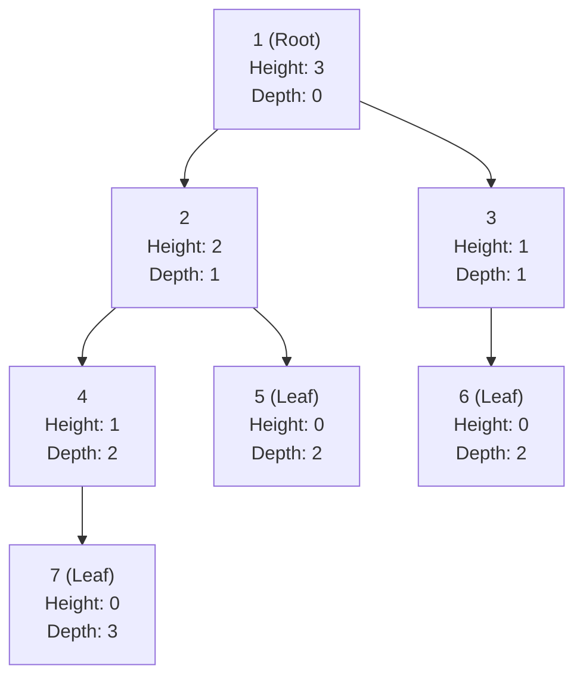
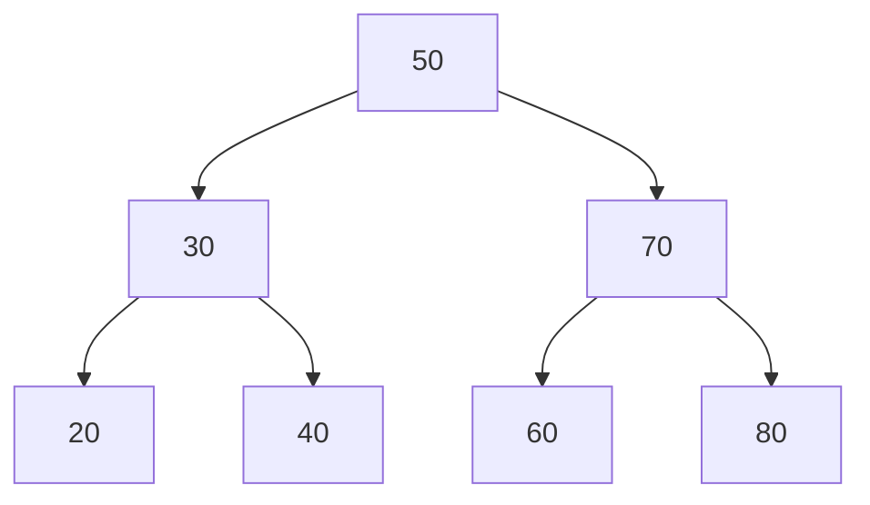
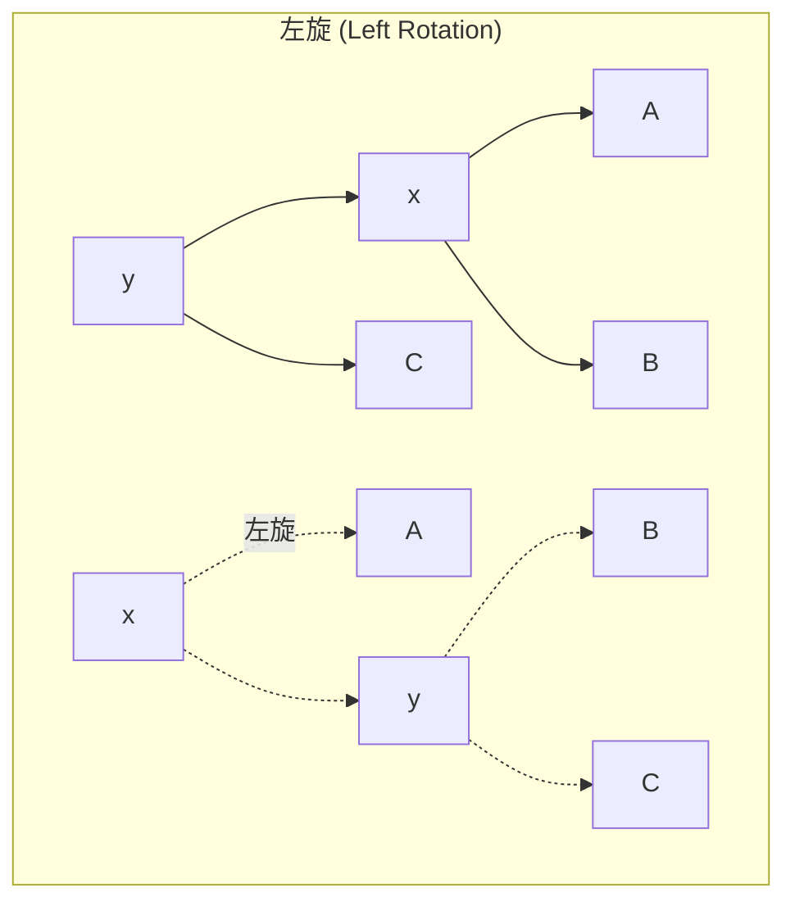

# 樹狀結構

> **優先級**: ⭐⭐⭐ 必看
>
> **適用場景**: 階層式數據 / 搜尋優化 / 演算法進階
>
> **前置知識**: 遞迴、指針、線性結構

---

## 目錄

1. [核心概念](#1-核心概念)
2. [二元樹](#2-二元樹-binary-tree)
3. [二元搜尋樹](#3-二元搜尋樹-binary-search-tree)
4. [AVL樹](#4-avl樹-自平衡二元搜尋樹)
5. [實戰案例](#5-實戰案例)
6. [性能對比](#6-性能對比)
7. [常見陷阱](#7-常見陷阱)
8. [參考資料](#參考資料)

---

## 1. 核心概念

### 1.1 什麼是樹?

**樹 (Tree)** 是一種非線性數據結構,模擬階層式關係。

**基本術語**:
- **節點 (Node)**: 樹的基本單元,包含數據和子節點指針
- **根節點 (Root)**: 樹的頂端節點
- **葉節點 (Leaf)**: 沒有子節點的節點
- **深度 (Depth)**: 從根到某節點的路徑長度
- **高度 (Height)**: 從某節點到葉節點的最長路徑長度
- **子樹 (Subtree)**: 由某節點及其後代組成的樹



### 1.2 二元樹的性質

**二元樹 (Binary Tree)**: 每個節點最多有兩個子節點(左子節點、右子節點)。

**重要性質**:
1. **第 i 層最多有** $2^i$ **個節點** (根為第 0 層)
2. **深度為 k 的二元樹最多有** $2^{k+1} - 1$ **個節點**
3. **葉節點數 = 度為 2 的節點數 + 1**

**特殊二元樹**:

| 類型 | 定義 | 特性 |
|------|------|------|
| **滿二元樹** | 每層都填滿 | 節點數 = $2^{h+1} - 1$ |
| **完全二元樹** | 除最後一層外都填滿,最後一層靠左 | 可用數組高效存儲 |
| **平衡二元樹** | 左右子樹高度差 ≤ 1 | 搜尋效率 O(log n) |
| **退化二元樹** | 每個節點只有一個子節點 | 退化為鏈表 O(n) |

---

## 2. 二元樹 (Binary Tree)

### 2.1 時間複雜度

| 操作 | 平均 | 最壞 |
|------|------|------|
| 搜尋 | O(n) | O(n) |
| 插入 | O(log n) 平衡時 | O(n) 退化時 |
| 刪除 | O(log n) 平衡時 | O(n) 退化時 |
| 遍歷 | O(n) | O(n) |

### 2.2 C++ 裸指針實現

```cpp
#include <iostream>
#include <queue>

// 節點定義
struct TreeNode {
    int data;
    TreeNode* left;
    TreeNode* right;
    
    // 建構函式
    TreeNode(int val) : data(val), left(nullptr), right(nullptr) {}
};

// 二元樹類別 (使用裸指針)
class BinaryTree {
private:
    TreeNode* root_;

    // 後序遍歷銷毀 (遞迴)
    void destroy(TreeNode* node) {
        if (!node) return;
        destroy(node->left);
        destroy(node->right);
        delete node;  // 使用 delete 而非 free
    }

    // 前序遍歷輔助
    void preorder_helper(TreeNode* node) const {
        if (!node) return;
        std::cout << node->data << " ";
        preorder_helper(node->left);
        preorder_helper(node->right);
    }

    // 中序遍歷輔助
    void inorder_helper(TreeNode* node) const {
        if (!node) return;
        inorder_helper(node->left);
        std::cout << node->data << " ";
        inorder_helper(node->right);
    }

    // 後序遍歷輔助
    void postorder_helper(TreeNode* node) const {
        if (!node) return;
        postorder_helper(node->left);
        postorder_helper(node->right);
        std::cout << node->data << " ";
    }

    // 計算高度
    int height_helper(TreeNode* node) const {
        if (!node) return -1;
        int left_h = height_helper(node->left);
        int right_h = height_helper(node->right);
        return 1 + std::max(left_h, right_h);
    }

    // 計算節點數
    int size_helper(TreeNode* node) const {
        if (!node) return 0;
        return 1 + size_helper(node->left) + size_helper(node->right);
    }

public:
    BinaryTree() : root_(nullptr) {}

    // 解構函式 - 手動釋放記憶體
    ~BinaryTree() {
        destroy(root_);
    }

    // 禁止拷貝 (避免雙重釋放)
    BinaryTree(const BinaryTree&) = delete;
    BinaryTree& operator=(const BinaryTree&) = delete;

    // 層序插入 (構造完全二元樹)
    void insert_level_order(int value) {
        TreeNode* new_node = new TreeNode(value);
        
        if (!root_) {
            root_ = new_node;
            return;
        }
        
        std::queue<TreeNode*> q;
        q.push(root_);
        
        while (!q.empty()) {
            TreeNode* node = q.front();
            q.pop();
            
            if (!node->left) {
                node->left = new_node;
                return;
            } else {
                q.push(node->left);
            }
            
            if (!node->right) {
                node->right = new_node;
                return;
            } else {
                q.push(node->right);
            }
        }
    }

    // 前序遍歷: Root -> Left -> Right
    void preorder() const {
        preorder_helper(root_);
        std::cout << "\n";
    }

    // 中序遍歷: Left -> Root -> Right
    void inorder() const {
        inorder_helper(root_);
        std::cout << "\n";
    }

    // 後序遍歷: Left -> Right -> Root
    void postorder() const {
        postorder_helper(root_);
        std::cout << "\n";
    }

    // 層序遍歷: 逐層從左到右
    void level_order() const {
        if (!root_) return;
        
        std::queue<TreeNode*> q;
        q.push(root_);
        
        while (!q.empty()) {
            TreeNode* node = q.front();
            q.pop();
            std::cout << node->data << " ";
            
            if (node->left) q.push(node->left);
            if (node->right) q.push(node->right);
        }
        std::cout << "\n";
    }

    // 高度
    int height() const {
        return height_helper(root_);
    }

    // 節點數
    int size() const {
        return size_helper(root_);
    }
};

// 使用範例
void example_raw_pointer_binary_tree() {
    BinaryTree tree;
    
    // 構造完全二元樹
    //       1
    //      / \
    //     2   3
    //    / \  /
    //   4  5 6
    tree.insert_level_order(1);
    tree.insert_level_order(2);
    tree.insert_level_order(3);
    tree.insert_level_order(4);
    tree.insert_level_order(5);
    tree.insert_level_order(6);
    
    std::cout << "Preorder: ";
    tree.preorder();  // 1 2 4 5 3 6
    
    std::cout << "Inorder: ";
    tree.inorder();   // 4 2 5 1 6 3
    
    std::cout << "Postorder: ";
    tree.postorder(); // 4 5 2 6 3 1
    
    std::cout << "Level-order: ";
    tree.level_order(); // 1 2 3 4 5 6
    
    std::cout << "Height: " << tree.height() << "\n";  // 2
    std::cout << "Size: " << tree.size() << "\n";      // 6
    
    // 析構函式自動釋放記憶體
}
```


### 2.3 現代 C++ 實現 (智能指針)

```cpp
#include <iostream>
#include <memory>
#include <queue>
#include <functional>

// 現代 C++ 二元樹
template<typename T>
class BinaryTree {
private:
    struct Node {
        T data;
        std::unique_ptr<Node> left;
        std::unique_ptr<Node> right;
        
        explicit Node(const T& value) 
            : data(value), left(nullptr), right(nullptr) {}
        
        explicit Node(T&& value) 
            : data(std::move(value)), left(nullptr), right(nullptr) {}
    };

    std::unique_ptr<Node> root_;

    // 遞迴輔助函數
    void preorder_helper(const Node* node, const std::function<void(const T&)>& visit) const {
        if (!node) return;
        visit(node->data);
        preorder_helper(node->left.get(), visit);
        preorder_helper(node->right.get(), visit);
    }

    void inorder_helper(const Node* node, const std::function<void(const T&)>& visit) const {
        if (!node) return;
        inorder_helper(node->left.get(), visit);
        visit(node->data);
        inorder_helper(node->right.get(), visit);
    }

    void postorder_helper(const Node* node, const std::function<void(const T&)>& visit) const {
        if (!node) return;
        postorder_helper(node->left.get(), visit);
        postorder_helper(node->right.get(), visit);
        visit(node->data);
    }

    int height_helper(const Node* node) const {
        if (!node) return -1;
        return 1 + std::max(height_helper(node->left.get()), 
                           height_helper(node->right.get()));
    }

    size_t size_helper(const Node* node) const {
        if (!node) return 0;
        return 1 + size_helper(node->left.get()) + size_helper(node->right.get());
    }

public:
    BinaryTree() : root_(nullptr) {}

    // 層序插入 (構造完全二元樹)
    void insert_level_order(const T& value) {
        auto new_node = std::make_unique<Node>(value);
        
        if (!root_) {
            root_ = std::move(new_node);
            return;
        }
        
        std::queue<Node*> q;
        q.push(root_.get());
        
        while (!q.empty()) {
            Node* node = q.front();
            q.pop();
            
            if (!node->left) {
                node->left = std::move(new_node);
                return;
            } else {
                q.push(node->left.get());
            }
            
            if (!node->right) {
                node->right = std::move(new_node);
                return;
            } else {
                q.push(node->right.get());
            }
        }
    }

    // 前序遍歷
    void preorder(const std::function<void(const T&)>& visit) const {
        preorder_helper(root_.get(), visit);
    }

    // 中序遍歷
    void inorder(const std::function<void(const T&)>& visit) const {
        inorder_helper(root_.get(), visit);
    }

    // 後序遍歷
    void postorder(const std::function<void(const T&)>& visit) const {
        postorder_helper(root_.get(), visit);
    }

    // 層序遍歷
    void level_order(const std::function<void(const T&)>& visit) const {
        if (!root_) return;
        
        std::queue<Node*> q;
        q.push(root_.get());
        
        while (!q.empty()) {
            Node* node = q.front();
            q.pop();
            visit(node->data);
            
            if (node->left) q.push(node->left.get());
            if (node->right) q.push(node->right.get());
        }
    }

    // 高度
    int height() const {
        return height_helper(root_.get());
    }

    // 節點數
    size_t size() const {
        return size_helper(root_.get());
    }

    bool empty() const {
        return root_ == nullptr;
    }

    // 析構函式自動釋放 (unique_ptr 遞迴銷毀)
};

// 使用範例
void example_modern_binary_tree() {
    BinaryTree<int> tree;
    
    // 構造完全二元樹
    tree.insert_level_order(1);
    tree.insert_level_order(2);
    tree.insert_level_order(3);
    tree.insert_level_order(4);
    tree.insert_level_order(5);
    tree.insert_level_order(6);
    
    std::cout << "Preorder: ";
    tree.preorder([](const int& val) { std::cout << val << " "; });
    std::cout << "\n";
    
    std::cout << "Inorder: ";
    tree.inorder([](const int& val) { std::cout << val << " "; });
    std::cout << "\n";
    
    std::cout << "Postorder: ";
    tree.postorder([](const int& val) { std::cout << val << " "; });
    std::cout << "\n";
    
    std::cout << "Level-order: ";
    tree.level_order([](const int& val) { std::cout << val << " "; });
    std::cout << "\n";
    
    std::cout << "Height: " << tree.height() << "\n";
    std::cout << "Size: " << tree.size() << "\n";
    
    // 自動釋放記憶體
}
```

**優勢**:
- ✅ 自動記憶體管理 (`unique_ptr` 遞迴銷毀)
- ✅ Lambda 表達式實現訪問者模式
- ✅ 異常安全
- ✅ 泛型支持

---

## 3. 二元搜尋樹 (Binary Search Tree)

### 3.1 核心概念

**二元搜尋樹 (BST)** 滿足以下性質:
- 左子樹所有節點值 < 根節點值
- 右子樹所有節點值 > 根節點值
- 左右子樹也是 BST



**時間複雜度**:

| 操作 | 平均 (平衡) | 最壞 (退化) |
|------|------------|------------|
| 搜尋 | O(log n) | O(n) |
| 插入 | O(log n) | O(n) |
| 刪除 | O(log n) | O(n) |

### 3.2 C++ 裸指針實現

```cpp
#include <iostream>

struct BSTNode {
    int data;
    BSTNode* left;
    BSTNode* right;
    
    BSTNode(int val) : data(val), left(nullptr), right(nullptr) {}
};

class BST {
private:
    BSTNode* root_;

    // 插入輔助 (遞迴)
    BSTNode* insert_helper(BSTNode* node, int value) {
        if (!node) {
            return new BSTNode(value);
        }
        
        if (value < node->data) {
            node->left = insert_helper(node->left, value);
        } else if (value > node->data) {
            node->right = insert_helper(node->right, value);
        }
        // 相等則不插入
        
        return node;
    }

    // 搜尋 (迭代,更高效)
    BSTNode* search_helper(BSTNode* node, int value) const {
        while (node && node->data != value) {
            if (value < node->data) {
                node = node->left;
            } else {
                node = node->right;
            }
        }
        return node;
    }

    // 查找最小值節點
    BSTNode* find_min(BSTNode* node) const {
        while (node && node->left) {
            node = node->left;
        }
        return node;
    }

    // 刪除節點
    BSTNode* delete_helper(BSTNode* node, int value) {
        if (!node) return nullptr;
        
        if (value < node->data) {
            node->left = delete_helper(node->left, value);
        } else if (value > node->data) {
            node->right = delete_helper(node->right, value);
        } else {
            // 找到要刪除的節點
            
            // 情況 1: 葉節點或只有一個子節點
            if (!node->left) {
                BSTNode* temp = node->right;
                delete node;
                return temp;
            } else if (!node->right) {
                BSTNode* temp = node->left;
                delete node;
                return temp;
            }
            
            // 情況 2: 有兩個子節點
            // 找到右子樹的最小值節點(中序後繼)
            BSTNode* temp = find_min(node->right);
            
            // 用後繼節點值替換當前節點值
            node->data = temp->data;
            
            // 刪除後繼節點
            node->right = delete_helper(node->right, temp->data);
        }
        
        return node;
    }

    // 中序遍歷
    void inorder_helper(BSTNode* node) const {
        if (!node) return;
        inorder_helper(node->left);
        std::cout << node->data << " ";
        inorder_helper(node->right);
    }

    // 銷毀樹
    void destroy(BSTNode* node) {
        if (!node) return;
        destroy(node->left);
        destroy(node->right);
        delete node;
    }

public:
    BST() : root_(nullptr) {}

    ~BST() {
        destroy(root_);
    }

    // 禁止拷貝
    BST(const BST&) = delete;
    BST& operator=(const BST&) = delete;

    // 插入
    void insert(int value) {
        root_ = insert_helper(root_, value);
    }

    // 搜尋
    bool search(int value) const {
        return search_helper(root_, value) != nullptr;
    }

    // 刪除
    void remove(int value) {
        root_ = delete_helper(root_, value);
    }

    // 中序遍歷 (BST 中序遍歷結果為升序)
    void inorder() const {
        inorder_helper(root_);
        std::cout << "\n";
    }

    // 查找最小值
    int find_min_value() const {
        BSTNode* min_node = find_min(root_);
        if (!min_node) {
            throw std::runtime_error("Tree is empty");
        }
        return min_node->data;
    }

    // 查找最大值
    int find_max_value() const {
        BSTNode* node = root_;
        while (node && node->right) {
            node = node->right;
        }
        if (!node) {
            throw std::runtime_error("Tree is empty");
        }
        return node->data;
    }
};

// 使用範例
void example_raw_pointer_bst() {
    BST bst;
    
    // 插入
    bst.insert(50);
    bst.insert(30);
    bst.insert(70);
    bst.insert(20);
    bst.insert(40);
    bst.insert(60);
    bst.insert(80);
    
    std::cout << "Inorder: ";
    bst.inorder();  // 20 30 40 50 60 70 80 (升序)
    
    // 搜尋
    std::cout << "Search 40: " << std::boolalpha << bst.search(40) << "\n";
    std::cout << "Search 99: " << bst.search(99) << "\n";
    
    // 最小/最大值
    std::cout << "Min: " << bst.find_min_value() << "\n";
    std::cout << "Max: " << bst.find_max_value() << "\n";
    
    // 刪除
    bst.remove(30);
    std::cout << "After delete 30: ";
    bst.inorder();  // 20 40 50 60 70 80
}
```

### 3.3 現代 C++ 實現 (智能指針)

```cpp
#include <iostream>
#include <memory>
#include <optional>
#include <functional>

// 現代 C++ BST
template<typename T>
class BST {
private:
    struct Node {
        T data;
        std::unique_ptr<Node> left;
        std::unique_ptr<Node> right;
        
        explicit Node(const T& value)
            : data(value), left(nullptr), right(nullptr) {}
        
        explicit Node(T&& value)
            : data(std::move(value)), left(nullptr), right(nullptr) {}
    };

    std::unique_ptr<Node> root_;

    // 插入輔助函數
    Node* insert_helper(std::unique_ptr<Node>& node, const T& value) {
        if (!node) {
            node = std::make_unique<Node>(value);
            return node.get();
        }
        
        if (value < node->data) {
            return insert_helper(node->left, value);
        } else if (value > node->data) {
            return insert_helper(node->right, value);
        }
        
        return node.get();  // 已存在,不插入
    }

    // 搜尋輔助函數
    Node* search_helper(Node* node, const T& value) const {
        while (node && node->data != value) {
            if (value < node->data) {
                node = node->left.get();
            } else {
                node = node->right.get();
            }
        }
        return node;
    }

    // 刪除輔助函數
    std::unique_ptr<Node> delete_helper(std::unique_ptr<Node> node, const T& value) {
        if (!node) return nullptr;
        
        if (value < node->data) {
            node->left = delete_helper(std::move(node->left), value);
        } else if (value > node->data) {
            node->right = delete_helper(std::move(node->right), value);
        } else {
            // 找到要刪除的節點
            
            if (!node->left) {
                return std::move(node->right);
            } else if (!node->right) {
                return std::move(node->left);
            }
            
            // 兩個子節點都存在
            // 找右子樹最小值
            Node* min_node = find_min_helper(node->right.get());
            node->data = min_node->data;
            node->right = delete_helper(std::move(node->right), min_node->data);
        }
        
        return node;
    }

    // 查找最小值
    Node* find_min_helper(Node* node) const {
        while (node && node->left) {
            node = node->left.get();
        }
        return node;
    }

    // 中序遍歷輔助
    void inorder_helper(const Node* node, const std::function<void(const T&)>& visit) const {
        if (!node) return;
        inorder_helper(node->left.get(), visit);
        visit(node->data);
        inorder_helper(node->right.get(), visit);
    }

public:
    BST() : root_(nullptr) {}

    // 插入
    void insert(const T& value) {
        insert_helper(root_, value);
    }

    void insert(T&& value) {
        if (!root_) {
            root_ = std::make_unique<Node>(std::move(value));
        } else {
            insert_helper(root_, value);
        }
    }

    // 搜尋
    bool search(const T& value) const {
        return search_helper(root_.get(), value) != nullptr;
    }

    std::optional<T> find(const T& value) const {
        Node* node = search_helper(root_.get(), value);
        if (node) {
            return node->data;
        }
        return std::nullopt;
    }

    // 刪除
    void remove(const T& value) {
        root_ = delete_helper(std::move(root_), value);
    }

    // 最小值
    std::optional<T> find_min() const {
        Node* min_node = find_min_helper(root_.get());
        if (min_node) {
            return min_node->data;
        }
        return std::nullopt;
    }

    // 最大值
    std::optional<T> find_max() const {
        Node* node = root_.get();
        while (node && node->right) {
            node = node->right.get();
        }
        if (node) {
            return node->data;
        }
        return std::nullopt;
    }

    // 中序遍歷
    void inorder(const std::function<void(const T&)>& visit) const {
        inorder_helper(root_.get(), visit);
    }

    bool empty() const {
        return root_ == nullptr;
    }
};

// 使用範例
void example_modern_bst() {
    BST<int> bst;
    
    // 插入
    bst.insert(50);
    bst.insert(30);
    bst.insert(70);
    bst.insert(20);
    bst.insert(40);
    bst.insert(60);
    bst.insert(80);
    
    std::cout << "Inorder: ";
    bst.inorder([](const int& val) { std::cout << val << " "; });
    std::cout << "\n";
    
    // 搜尋
    std::cout << "Search 40: " << std::boolalpha << bst.search(40) << "\n";
    std::cout << "Search 99: " << bst.search(99) << "\n";
    
    // 最小/最大值
    auto min_val = bst.find_min();
    auto max_val = bst.find_max();
    if (min_val && max_val) {
        std::cout << "Min: " << *min_val << ", Max: " << *max_val << "\n";
    }
    
    // 刪除
    bst.remove(30);
    std::cout << "After delete 30: ";
    bst.inorder([](const int& val) { std::cout << val << " "; });
    std::cout << "\n";
}
```

---

## 4. AVL樹 (自平衡二元搜尋樹)

### 4.1 核心概念

**AVL樹** 是一種自平衡的 BST,保證任何節點的左右子樹高度差 ≤ 1。

**平衡因子 (Balance Factor)**:
```
BF(node) = Height(left subtree) - Height(right subtree)
```

AVL 樹要求: `-1 ≤ BF ≤ 1`

**旋轉操作**:



### 4.2 C++ 裸指針實現

```cpp
#include <iostream>
#include <algorithm>

struct AVLNode {
    int data;
    int height;
    AVLNode* left;
    AVLNode* right;
    
    AVLNode(int val) : data(val), height(1), left(nullptr), right(nullptr) {}
};

class AVLTree {
private:
    AVLNode* root_;

    // 獲取高度
    int height(AVLNode* node) const {
        return node ? node->height : 0;
    }

    // 獲取平衡因子
    int balance_factor(AVLNode* node) const {
        return node ? height(node->left) - height(node->right) : 0;
    }

    // 更新高度
    void update_height(AVLNode* node) {
        node->height = 1 + std::max(height(node->left), height(node->right));
    }

    // 右旋
    //       y                    x
    //      / \                  / \
    //     x   C   右旋(y)       A   y
    //    / \      ------->        / \
    //   A   B                    B   C
    AVLNode* rotate_right(AVLNode* y) {
        AVLNode* x = y->left;
        AVLNode* B = x->right;
        
        // 旋轉
        x->right = y;
        y->left = B;
        
        // 更新高度
        update_height(y);
        update_height(x);
        
        return x;  // 新根節點
    }

    // 左旋
    //     x                      y
    //    / \                    / \
    //   A   y    左旋(x)        x   C
    //      / \   ------->     / \
    //     B   C              A   B
    AVLNode* rotate_left(AVLNode* x) {
        AVLNode* y = x->right;
        AVLNode* B = y->left;
        
        // 旋轉
        y->left = x;
        x->right = B;
        
        // 更新高度
        update_height(x);
        update_height(y);
        
        return y;  // 新根節點
    }

    // 插入並自平衡
    AVLNode* insert_helper(AVLNode* node, int value) {
        // 1. 標準 BST 插入
        if (!node) {
            return new AVLNode(value);
        }
        
        if (value < node->data) {
            node->left = insert_helper(node->left, value);
        } else if (value > node->data) {
            node->right = insert_helper(node->right, value);
        } else {
            return node;  // 不允許重複
        }
        
        // 2. 更新高度
        update_height(node);
        
        // 3. 檢查平衡因子並旋轉
        int bf = balance_factor(node);
        
        // Left-Left Case (LL)
        if (bf > 1 && value < node->left->data) {
            return rotate_right(node);
        }
        
        // Right-Right Case (RR)
        if (bf < -1 && value > node->right->data) {
            return rotate_left(node);
        }
        
        // Left-Right Case (LR)
        if (bf > 1 && value > node->left->data) {
            node->left = rotate_left(node->left);
            return rotate_right(node);
        }
        
        // Right-Left Case (RL)
        if (bf < -1 && value < node->right->data) {
            node->right = rotate_right(node->right);
            return rotate_left(node);
        }
        
        return node;
    }

    // 中序遍歷
    void inorder_helper(AVLNode* node) const {
        if (!node) return;
        inorder_helper(node->left);
        std::cout << node->data << " ";
        inorder_helper(node->right);
    }

    // 銷毀樹
    void destroy(AVLNode* node) {
        if (!node) return;
        destroy(node->left);
        destroy(node->right);
        delete node;
    }

public:
    AVLTree() : root_(nullptr) {}

    ~AVLTree() {
        destroy(root_);
    }

    // 禁止拷貝
    AVLTree(const AVLTree&) = delete;
    AVLTree& operator=(const AVLTree&) = delete;

    // 插入
    void insert(int value) {
        root_ = insert_helper(root_, value);
    }

    // 中序遍歷
    void inorder() const {
        inorder_helper(root_);
        std::cout << "\n";
    }

    // 獲取高度
    int get_height() const {
        return height(root_);
    }

    // 獲取根節點值
    int get_root_value() const {
        if (!root_) {
            throw std::runtime_error("Tree is empty");
        }
        return root_->data;
    }
};

// 使用範例
void example_raw_pointer_avl() {
    AVLTree avl;
    
    // 插入序列會導致普通 BST 退化,但 AVL 自動平衡
    avl.insert(10);
    avl.insert(20);
    avl.insert(30);  // 觸發左旋
    avl.insert(40);
    avl.insert(50);  // 觸發左旋
    avl.insert(25);
    
    std::cout << "AVL Inorder: ";
    avl.inorder();  // 10 20 25 30 40 50
    
    std::cout << "Root: " << avl.get_root_value() << "\n";
    std::cout << "Height: " << avl.get_height() << "\n";
}
```

### 4.3 現代 C++ 實現 (智能指針)

```cpp
#include <iostream>
#include <memory>
#include <algorithm>

template<typename T>
class AVLTree {
private:
    struct Node {
        T data;
        int height;
        std::unique_ptr<Node> left;
        std::unique_ptr<Node> right;
        
        explicit Node(const T& value)
            : data(value), height(1), left(nullptr), right(nullptr) {}
    };

    std::unique_ptr<Node> root_;

    int height(const Node* node) const {
        return node ? node->height : 0;
    }

    int balance_factor(const Node* node) const {
        return node ? height(node->left.get()) - height(node->right.get()) : 0;
    }

    void update_height(Node* node) {
        node->height = 1 + std::max(height(node->left.get()), height(node->right.get()));
    }

    // 右旋
    std::unique_ptr<Node> rotate_right(std::unique_ptr<Node> y) {
        auto x = std::move(y->left);
        y->left = std::move(x->right);
        
        update_height(y.get());
        update_height(x.get());
        
        x->right = std::move(y);
        return x;
    }

    // 左旋
    std::unique_ptr<Node> rotate_left(std::unique_ptr<Node> x) {
        auto y = std::move(x->right);
        x->right = std::move(y->left);
        
        update_height(x.get());
        update_height(y.get());
        
        y->left = std::move(x);
        return y;
    }

    // 插入
    std::unique_ptr<Node> insert_helper(std::unique_ptr<Node> node, const T& value) {
        if (!node) {
            return std::make_unique<Node>(value);
        }
        
        if (value < node->data) {
            node->left = insert_helper(std::move(node->left), value);
        } else if (value > node->data) {
            node->right = insert_helper(std::move(node->right), value);
        } else {
            return node;
        }
        
        update_height(node.get());
        
        int bf = balance_factor(node.get());
        
        // LL
        if (bf > 1 && value < node->left->data) {
            return rotate_right(std::move(node));
        }
        
        // RR
        if (bf < -1 && value > node->right->data) {
            return rotate_left(std::move(node));
        }
        
        // LR
        if (bf > 1 && value > node->left->data) {
            node->left = rotate_left(std::move(node->left));
            return rotate_right(std::move(node));
        }
        
        // RL
        if (bf < -1 && value < node->right->data) {
            node->right = rotate_right(std::move(node->right));
            return rotate_left(std::move(node));
        }
        
        return node;
    }

    void inorder_helper(const Node* node, const std::function<void(const T&)>& visit) const {
        if (!node) return;
        inorder_helper(node->left.get(), visit);
        visit(node->data);
        inorder_helper(node->right.get(), visit);
    }

public:
    AVLTree() : root_(nullptr) {}

    void insert(const T& value) {
        root_ = insert_helper(std::move(root_), value);
    }

    void inorder(const std::function<void(const T&)>& visit) const {
        inorder_helper(root_.get(), visit);
    }

    int get_height() const {
        return height(root_.get());
    }

    bool empty() const {
        return root_ == nullptr;
    }
};

void example_modern_avl() {
    AVLTree<int> avl;
    
    avl.insert(10);
    avl.insert(20);
    avl.insert(30);
    avl.insert(40);
    avl.insert(50);
    avl.insert(25);
    
    std::cout << "AVL Inorder: ";
    avl.inorder([](const int& val) { std::cout << val << " "; });
    std::cout << "\n";
    
    std::cout << "Height: " << avl.get_height() << "\n";
}
```

---

## 5. 實戰案例

### 5.1 表達式樹 (Expression Tree)

```cpp
#include <iostream>
#include <memory>
#include <string>
#include <stack>
#include <cctype>

// 表達式樹節點
struct ExprNode {
    std::string value;
    std::unique_ptr<ExprNode> left;
    std::unique_ptr<ExprNode> right;
    
    explicit ExprNode(const std::string& val)
        : value(val), left(nullptr), right(nullptr) {}
};

// 判斷是否為運算符
bool is_operator(const std::string& s) {
    return s == "+" || s == "-" || s == "*" || s == "/";
}

// 從後綴表達式構造表達式樹
std::unique_ptr<ExprNode> build_expr_tree(const std::vector<std::string>& postfix) {
    std::stack<std::unique_ptr<ExprNode>> stk;
    
    for (const auto& token : postfix) {
        auto node = std::make_unique<ExprNode>(token);
        
        if (is_operator(token)) {
            // 運算符節點
            node->right = std::move(stk.top()); stk.pop();
            node->left = std::move(stk.top()); stk.pop();
        }
        // 操作數節點不需要子節點
        
        stk.push(std::move(node));
    }
    
    return std::move(stk.top());
}

// 計算表達式樹
int evaluate_expr_tree(const ExprNode* root) {
    if (!root) return 0;
    
    // 葉節點 (操作數)
    if (!root->left && !root->right) {
        return std::stoi(root->value);
    }
    
    // 內部節點 (運算符)
    int left_val = evaluate_expr_tree(root->left.get());
    int right_val = evaluate_expr_tree(root->right.get());
    
    if (root->value == "+") return left_val + right_val;
    if (root->value == "-") return left_val - right_val;
    if (root->value == "*") return left_val * right_val;
    if (root->value == "/") return left_val / right_val;
    
    return 0;
}

void example_expression_tree() {
    // 後綴表達式: "2 3 + 5 *" 表示 (2 + 3) * 5 = 25
    std::vector<std::string> postfix = {"2", "3", "+", "5", "*"};
    
    auto tree = build_expr_tree(postfix);
    int result = evaluate_expr_tree(tree.get());
    
    std::cout << "Result: " << result << "\n";  // 25
}
```

### 5.2 檔案系統樹

```cpp
#include <iostream>
#include <memory>
#include <string>
#include <vector>

struct FileNode {
    std::string name;
    bool is_directory;
    std::vector<std::unique_ptr<FileNode>> children;
    
    FileNode(const std::string& n, bool is_dir)
        : name(n), is_directory(is_dir) {}
    
    void add_child(std::unique_ptr<FileNode> child) {
        children.push_back(std::move(child));
    }
    
    void print(int depth = 0) const {
        for (int i = 0; i < depth; ++i) std::cout << "  ";
        std::cout << (is_directory ? "[DIR] " : "[FILE] ") << name << "\n";
        
        for (const auto& child : children) {
            child->print(depth + 1);
        }
    }
};

void example_file_system() {
    auto root = std::make_unique<FileNode>("root", true);
    
    auto home = std::make_unique<FileNode>("home", true);
    home->add_child(std::make_unique<FileNode>("user1", true));
    home->add_child(std::make_unique<FileNode>("user2", true));
    
    auto etc = std::make_unique<FileNode>("etc", true);
    etc->add_child(std::make_unique<FileNode>("config.txt", false));
    
    root->add_child(std::move(home));
    root->add_child(std::move(etc));
    
    root->print();
}
```

---

## 6. 性能對比

### 6.1 BST vs AVL

| 特性 | 普通 BST | AVL 樹 |
|------|---------|--------|
| 插入 (平均) | O(log n) | O(log n) |
| 插入 (最壞) | O(n) 退化 | O(log n) |
| 搜尋 (平均) | O(log n) | O(log n) |
| 搜尋 (最壞) | O(n) | O(log n) |
| 平衡維護 | 無 | 每次插入/刪除 |
| 記憶體開銷 | 低 | 中 (存高度) |
| 旋轉次數 | 0 | 最多 2 次 (插入) |

---

## 7. 常見陷阱

### 7.1 BST 刪除節點記憶體洩漏

```cpp
// ❌ 錯誤: 記憶體洩漏
BSTNode* bad_delete(BSTNode* root, int value) {
    if (root->data == value) {
        if (!root->left && !root->right) {
            return nullptr;  // 忘記 delete root!
        }
    }
    return root;
}

// ✅ 正確
BSTNode* correct_delete(BSTNode* root, int value) {
    if (root->data == value) {
        if (!root->left && !root->right) {
            delete root;
            return nullptr;
        }
    }
    return root;
}
```

### 7.2 遞迴深度過大

```cpp
// ❌ 退化 BST 導致棧溢出
BST bst;
for (int i = 0; i < 1000000; ++i) {
    bst.insert(i);  // 插入升序數據,退化為鏈表
}
// 遞迴深度 100 萬,棧溢出!

// ✅ 使用 AVL 或隨機化插入順序
AVLTree avl;
for (int i = 0; i < 1000000; ++i) {
    avl.insert(i);  // 自動平衡,深度約 20
}
```

### 7.3 忘記禁止拷貝

```cpp
// ❌ 危險: 裸指針類別允許拷貝
class BST {
    BSTNode* root_;
public:
    // 默認拷貝建構函式: 淺拷貝!
};

BST bst1;
bst1.insert(10);
BST bst2 = bst1;  // 淺拷貝,兩者共享 root_
// bst1 析構,bst2 持有懸空指針!

// ✅ 正確: 禁止拷貝或實現深拷貝
class BST {
    BSTNode* root_;
public:
    BST(const BST&) = delete;
    BST& operator=(const BST&) = delete;
};
```

---

## 參考資料

1. **Cormen, Thomas H., et al.** _Introduction to Algorithms (4th Edition)_. MIT Press, 2022.
   - Chapter 12: Binary Search Trees
   - Chapter 13: Red-Black Trees (基礎)

2. **Knuth, Donald E.** _The Art of Computer Programming, Volume 3: Sorting and Searching_. Addison-Wesley, 1998.
   - Section 6.2.3: Balanced Trees

3. **Weiss, Mark Allen.** _Data Structures and Algorithm Analysis in C++_. Pearson, 2013.
   - Chapter 4: Trees

4. [Visualgo - Binary Search Tree Visualization](https://visualgo.net/en/bst)

5. [AVL Tree - GeeksforGeeks](https://www.geeksforgeeks.org/avl-tree-set-1-insertion/)

6. [LeetCode - Tree Problems](https://leetcode.com/tag/tree/)

7. **Sedgewick, Robert & Wayne, Kevin.** _Algorithms (4th Edition)_. Addison-Wesley, 2011.
   - Chapter 3.2: Binary Search Trees
