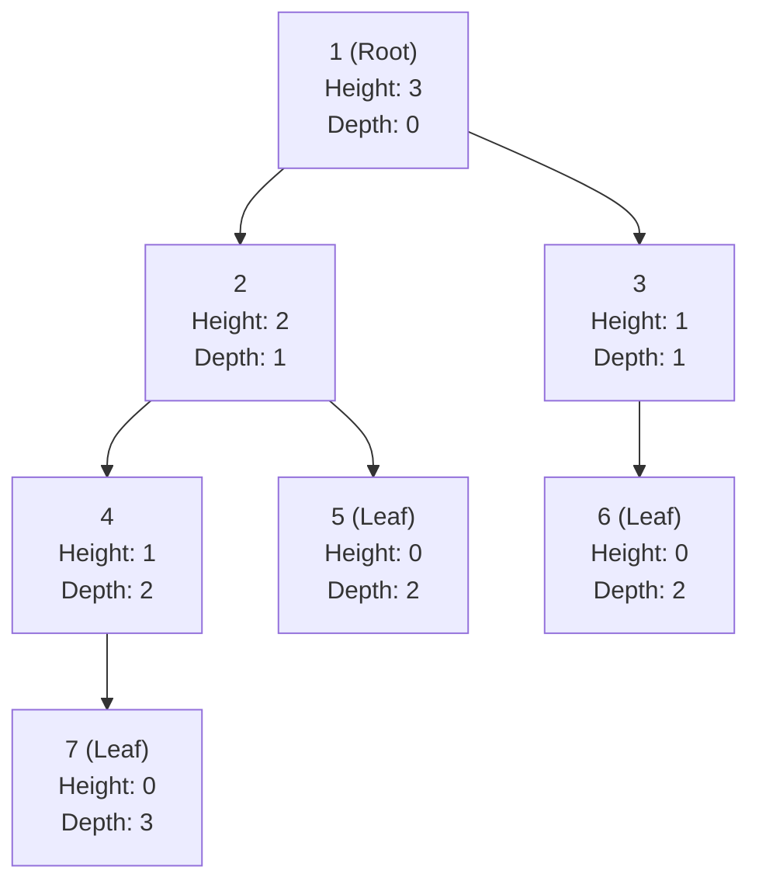
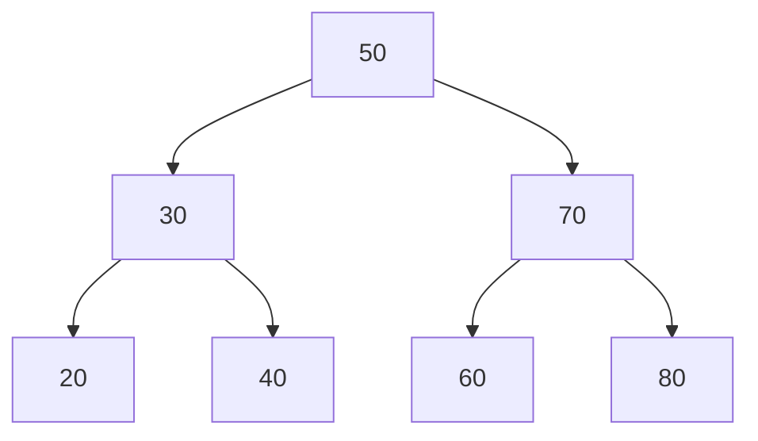
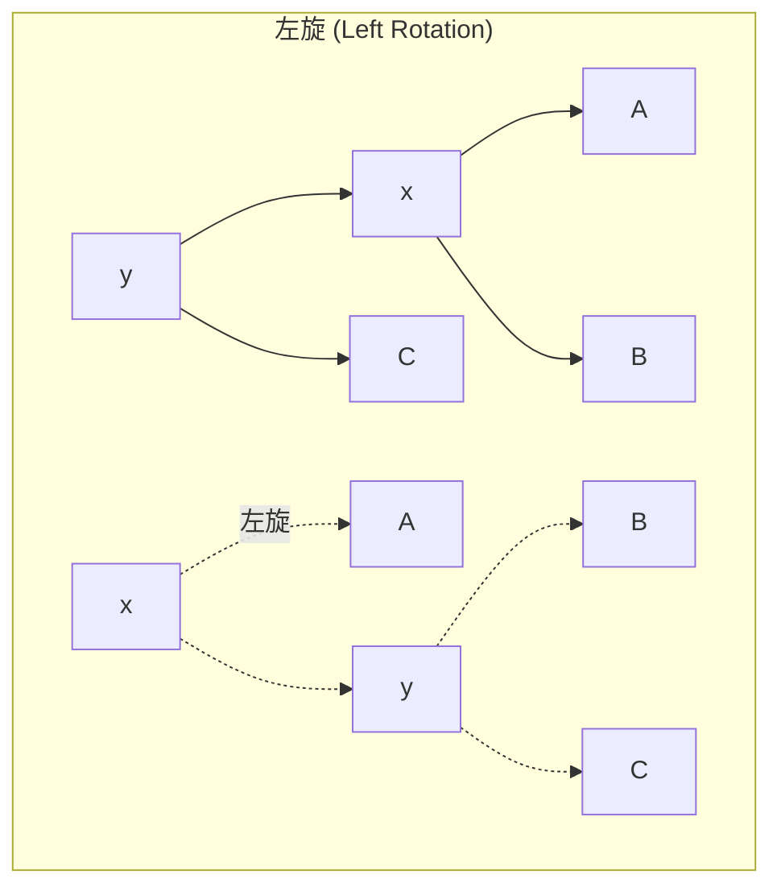

# 樹狀結構

> **優先級**: ⭐⭐⭐ 必看
>
> **適用場景**: 階層式數據 / 搜尋優化 / 演算法進階
>
> **前置知識**: 遞迴、指針、線性結構

---

## 目錄

1. [核心概念](#1-核心概念)
2. [二元樹](#2-二元樹-binary-tree)
3. [二元搜尋樹](#3-二元搜尋樹-binary-search-tree)
4. [AVL樹](#4-avl樹-自平衡二元搜尋樹)
5. [實戰案例](#5-實戰案例)
6. [性能對比](#6-性能對比)
7. [常見陷阱](#7-常見陷阱)
8. [參考資料](#參考資料)

---

## 1. 核心概念

### 1.1 什麼是樹?

**樹 (Tree)** 是一種非線性數據結構,模擬階層式關係。

**基本術語**:
- **節點 (Node)**: 樹的基本單元,包含數據和子節點指針
- **根節點 (Root)**: 樹的頂端節點
- **葉節點 (Leaf)**: 沒有子節點的節點
- **深度 (Depth)**: 從根到某節點的路徑長度
- **高度 (Height)**: 從某節點到葉節點的最長路徑長度
- **子樹 (Subtree)**: 由某節點及其後代組成的樹



### 1.2 二元樹的性質

**二元樹 (Binary Tree)**: 每個節點最多有兩個子節點(左子節點、右子節點)。

**重要性質**:
1. **第 i 層最多有** $2^i$ **個節點** (根為第 0 層)
2. **深度為 k 的二元樹最多有** $2^{k+1} - 1$ **個節點**
3. **葉節點數 = 度為 2 的節點數 + 1**

**特殊二元樹**:

| 類型 | 定義 | 特性 |
|------|------|------|
| **滿二元樹** | 每層都填滿 | 節點數 = $2^{h+1} - 1$ |
| **完全二元樹** | 除最後一層外都填滿,最後一層靠左 | 可用數組高效存儲 |
| **平衡二元樹** | 左右子樹高度差 ≤ 1 | 搜尋效率 O(log n) |
| **退化二元樹** | 每個節點只有一個子節點 | 退化為鏈表 O(n) |

---

## 2. 二元樹 (Binary Tree)

### 2.1 時間複雜度

| 操作 | 平均 | 最壞 |
|------|------|------|
| 搜尋 | O(n) | O(n) |
| 插入 | O(log n) 平衡時 | O(n) 退化時 |
| 刪除 | O(log n) 平衡時 | O(n) 退化時 |
| 遍歷 | O(n) | O(n) |

### 2.2 C 風格實現

```cpp
#include <cstdlib>
#include <iostream>
#include <queue>

// 節點定義
struct TreeNode {
    int data;
    TreeNode* left;
    TreeNode* right;
};

// 創建節點
TreeNode* create_node(int value) {
    TreeNode* node = (TreeNode*)malloc(sizeof(TreeNode));
    node->data = value;
    node->left = nullptr;
    node->right = nullptr;
    return node;
}

// 插入節點 (層序插入,構造完全二元樹)
TreeNode* insert_level_order(TreeNode* root, int value) {
    TreeNode* new_node = create_node(value);
    
    if (!root) {
        return new_node;
    }
    
    std::queue<TreeNode*> q;
    q.push(root);
    
    while (!q.empty()) {
        TreeNode* temp = q.front();
        q.pop();
        
        if (!temp->left) {
            temp->left = new_node;
            break;
        } else {
            q.push(temp->left);
        }
        
        if (!temp->right) {
            temp->right = new_node;
            break;
        } else {
            q.push(temp->right);
        }
    }
    
    return root;
}

// 前序遍歷 (Pre-order): Root -> Left -> Right
void preorder_traversal(TreeNode* root) {
    if (!root) return;
    
    printf("%d ", root->data);
    preorder_traversal(root->left);
    preorder_traversal(root->right);
}

// 中序遍歷 (In-order): Left -> Root -> Right
void inorder_traversal(TreeNode* root) {
    if (!root) return;
    
    inorder_traversal(root->left);
    printf("%d ", root->data);
    inorder_traversal(root->right);
}

// 後序遍歷 (Post-order): Left -> Right -> Root
void postorder_traversal(TreeNode* root) {
    if (!root) return;
    
    postorder_traversal(root->left);
    postorder_traversal(root->right);
    printf("%d ", root->data);
}

// 層序遍歷 (Level-order): 逐層從左到右
void level_order_traversal(TreeNode* root) {
    if (!root) return;
    
    std::queue<TreeNode*> q;
    q.push(root);
    
    while (!q.empty()) {
        TreeNode* node = q.front();
        q.pop();
        printf("%d ", node->data);
        
        if (node->left) q.push(node->left);
        if (node->right) q.push(node->right);
    }
}

// 計算高度
int tree_height(TreeNode* root) {
    if (!root) return -1;  // 空樹高度為 -1
    
    int left_height = tree_height(root->left);
    int right_height = tree_height(root->right);
    
    return 1 + (left_height > right_height ? left_height : right_height);
}

// 計算節點數
int tree_size(TreeNode* root) {
    if (!root) return 0;
    return 1 + tree_size(root->left) + tree_size(root->right);
}

// 銷毀樹 (後序遍歷釋放)
void destroy_tree(TreeNode* root) {
    if (!root) return;
    
    destroy_tree(root->left);
    destroy_tree(root->right);
    free(root);
}

// 使用範例
void example_c_binary_tree() {
    TreeNode* root = nullptr;
    
    // 構造完全二元樹
    //       1
    //      / \
    //     2   3
    //    / \  /
    //   4  5 6
    root = insert_level_order(root, 1);
    root = insert_level_order(root, 2);
    root = insert_level_order(root, 3);
    root = insert_level_order(root, 4);
    root = insert_level_order(root, 5);
    root = insert_level_order(root, 6);
    
    printf("Preorder: ");
    preorder_traversal(root);  // 1 2 4 5 3 6
    printf("\n");
    
    printf("Inorder: ");
    inorder_traversal(root);  // 4 2 5 1 6 3
    printf("\n");
    
    printf("Postorder: ");
    postorder_traversal(root);  // 4 5 2 6 3 1
    printf("\n");
    
    printf("Level-order: ");
    level_order_traversal(root);  // 1 2 3 4 5 6
    printf("\n");
    
    printf("Height: %d\n", tree_height(root));  // 2
    printf("Size: %d\n", tree_size(root));      // 6
    
    destroy_tree(root);  // ⚠️ 必須手動釋放!
}
```

**關鍵點**:
- 遞迴是處理樹的自然方式
- 必須手動釋放記憶體(後序遍歷)
- 容易發生記憶體洩漏

### 2.3 現代 C++ 實現

```cpp
#include <iostream>
#include <memory>
#include <queue>
#include <functional>
#include <optional>

// 現代 C++ 二元樹
template<typename T>
class BinaryTree {
private:
    struct Node {
        T data;
        std::unique_ptr<Node> left;
        std::unique_ptr<Node> right;
        
        explicit Node(const T& value) 
            : data(value), left(nullptr), right(nullptr) {}
        
        explicit Node(T&& value) 
            : data(std::move(value)), left(nullptr), right(nullptr) {}
    };

    std::unique_ptr<Node> root_;

    // 遞迴輔助函數
    void preorder_helper(const Node* node, const std::function<void(const T&)>& visit) const {
        if (!node) return;
        visit(node->data);
        preorder_helper(node->left.get(), visit);
        preorder_helper(node->right.get(), visit);
    }

    void inorder_helper(const Node* node, const std::function<void(const T&)>& visit) const {
        if (!node) return;
        inorder_helper(node->left.get(), visit);
        visit(node->data);
        inorder_helper(node->right.get(), visit);
    }

    void postorder_helper(const Node* node, const std::function<void(const T&)>& visit) const {
        if (!node) return;
        postorder_helper(node->left.get(), visit);
        postorder_helper(node->right.get(), visit);
        visit(node->data);
    }

    int height_helper(const Node* node) const {
        if (!node) return -1;
        return 1 + std::max(height_helper(node->left.get()), 
                           height_helper(node->right.get()));
    }

    size_t size_helper(const Node* node) const {
        if (!node) return 0;
        return 1 + size_helper(node->left.get()) + size_helper(node->right.get());
    }

public:
    BinaryTree() : root_(nullptr) {}

    // 層序插入 (構造完全二元樹)
    void insert_level_order(const T& value) {
        auto new_node = std::make_unique<Node>(value);
        
        if (!root_) {
            root_ = std::move(new_node);
            return;
        }
        
        std::queue<Node*> q;
        q.push(root_.get());
        
        while (!q.empty()) {
            Node* node = q.front();
            q.pop();
            
            if (!node->left) {
                node->left = std::move(new_node);
                return;
            } else {
                q.push(node->left.get());
            }
            
            if (!node->right) {
                node->right = std::move(new_node);
                return;
            } else {
                q.push(node->right.get());
            }
        }
    }

    // 前序遍歷
    void preorder(const std::function<void(const T&)>& visit) const {
        preorder_helper(root_.get(), visit);
    }

    // 中序遍歷
    void inorder(const std::function<void(const T&)>& visit) const {
        inorder_helper(root_.get(), visit);
    }

    // 後序遍歷
    void postorder(const std::function<void(const T&)>& visit) const {
        postorder_helper(root_.get(), visit);
    }

    // 層序遍歷
    void level_order(const std::function<void(const T&)>& visit) const {
        if (!root_) return;
        
        std::queue<Node*> q;
        q.push(root_.get());
        
        while (!q.empty()) {
            Node* node = q.front();
            q.pop();
            visit(node->data);
            
            if (node->left) q.push(node->left.get());
            if (node->right) q.push(node->right.get());
        }
    }

    // 高度
    int height() const {
        return height_helper(root_.get());
    }

    // 節點數
    size_t size() const {
        return size_helper(root_.get());
    }

    bool empty() const {
        return root_ == nullptr;
    }

    // 析構函式自動釋放 (unique_ptr 遞迴銷毀)
};

// 使用範例
void example_modern_binary_tree() {
    BinaryTree<int> tree;
    
    // 構造完全二元樹
    tree.insert_level_order(1);
    tree.insert_level_order(2);
    tree.insert_level_order(3);
    tree.insert_level_order(4);
    tree.insert_level_order(5);
    tree.insert_level_order(6);
    
    std::cout << "Preorder: ";
    tree.preorder([](const int& val) { std::cout << val << " "; });
    std::cout << "\n";
    
    std::cout << "Inorder: ";
    tree.inorder([](const int& val) { std::cout << val << " "; });
    std::cout << "\n";
    
    std::cout << "Postorder: ";
    tree.postorder([](const int& val) { std::cout << val << " "; });
    std::cout << "\n";
    
    std::cout << "Level-order: ";
    tree.level_order([](const int& val) { std::cout << val << " "; });
    std::cout << "\n";
    
    std::cout << "Height: " << tree.height() << "\n";
    std::cout << "Size: " << tree.size() << "\n";
    
    // 自動釋放記憶體
}
```

**優勢**:
- ✅ 自動記憶體管理 (`unique_ptr` 遞迴銷毀)
- ✅ Lambda 表達式實現訪問者模式
- ✅ 異常安全
- ✅ 泛型支持

---

## 3. 二元搜尋樹 (Binary Search Tree)

### 3.1 核心概念

**二元搜尋樹 (BST)** 滿足以下性質:
- 左子樹所有節點值 < 根節點值
- 右子樹所有節點值 > 根節點值
- 左右子樹也是 BST



**時間複雜度**:

| 操作 | 平均 (平衡) | 最壞 (退化) |
|------|------------|------------|
| 搜尋 | O(log n) | O(n) |
| 插入 | O(log n) | O(n) |
| 刪除 | O(log n) | O(n) |

### 3.2 C 風格實現

```cpp
#include <cstdlib>
#include <iostream>

struct BSTNode {
    int data;
    BSTNode* left;
    BSTNode* right;
};

// 創建節點
BSTNode* bst_create_node(int value) {
    BSTNode* node = (BSTNode*)malloc(sizeof(BSTNode));
    node->data = value;
    node->left = nullptr;
    node->right = nullptr;
    return node;
}

// 插入 (遞迴)
BSTNode* bst_insert(BSTNode* root, int value) {
    if (!root) {
        return bst_create_node(value);
    }
    
    if (value < root->data) {
        root->left = bst_insert(root->left, value);
    } else if (value > root->data) {
        root->right = bst_insert(root->right, value);
    }
    // 相等則不插入 (避免重複)
    
    return root;
}

// 搜尋
BSTNode* bst_search(BSTNode* root, int value) {
    if (!root || root->data == value) {
        return root;
    }
    
    if (value < root->data) {
        return bst_search(root->left, value);
    } else {
        return bst_search(root->right, value);
    }
}

// 搜尋 (迭代版本,更高效)
BSTNode* bst_search_iterative(BSTNode* root, int value) {
    while (root && root->data != value) {
        if (value < root->data) {
            root = root->left;
        } else {
            root = root->right;
        }
    }
    return root;
}

// 查找最小值節點
BSTNode* bst_find_min(BSTNode* root) {
    while (root && root->left) {
        root = root->left;
    }
    return root;
}

// 查找最大值節點
BSTNode* bst_find_max(BSTNode* root) {
    while (root && root->right) {
        root = root->right;
    }
    return root;
}

// 刪除節點
BSTNode* bst_delete(BSTNode* root, int value) {
    if (!root) return nullptr;
    
    if (value < root->data) {
        root->left = bst_delete(root->left, value);
    } else if (value > root->data) {
        root->right = bst_delete(root->right, value);
    } else {
        // 找到要刪除的節點
        
        // 情況 1: 葉節點或只有一個子節點
        if (!root->left) {
            BSTNode* temp = root->right;
            free(root);
            return temp;
        } else if (!root->right) {
            BSTNode* temp = root->left;
            free(root);
            return temp;
        }
        
        // 情況 2: 有兩個子節點
        // 找到右子樹的最小值節點(中序後繼)
        BSTNode* temp = bst_find_min(root->right);
        
        // 用後繼節點值替換當前節點值
        root->data = temp->data;
        
        // 刪除後繼節點
        root->right = bst_delete(root->right, temp->data);
    }
    
    return root;
}

// 中序遍歷 (BST 中序遍歷結果為升序)
void bst_inorder(BSTNode* root) {
    if (!root) return;
    bst_inorder(root->left);
    printf("%d ", root->data);
    bst_inorder(root->right);
}

// 銷毀
void bst_destroy(BSTNode* root) {
    if (!root) return;
    bst_destroy(root->left);
    bst_destroy(root->right);
    free(root);
}

// 使用範例
void example_c_bst() {
    BSTNode* root = nullptr;
    
    // 插入
    root = bst_insert(root, 50);
    root = bst_insert(root, 30);
    root = bst_insert(root, 70);
    root = bst_insert(root, 20);
    root = bst_insert(root, 40);
    root = bst_insert(root, 60);
    root = bst_insert(root, 80);
    
    printf("Inorder: ");
    bst_inorder(root);  // 20 30 40 50 60 70 80 (升序)
    printf("\n");
    
    // 搜尋
    BSTNode* found = bst_search(root, 40);
    if (found) {
        printf("Found: %d\n", found->data);
    }
    
    // 刪除
    root = bst_delete(root, 30);
    printf("After delete 30: ");
    bst_inorder(root);  // 20 40 50 60 70 80
    printf("\n");
    
    bst_destroy(root);
}
```

### 3.3 現代 C++ 實現

```cpp
#include <iostream>
#include <memory>
#include <optional>
#include <functional>

// 現代 C++ BST
template<typename T>
class BST {
private:
    struct Node {
        T data;
        std::unique_ptr<Node> left;
        std::unique_ptr<Node> right;
        
        explicit Node(const T& value)
            : data(value), left(nullptr), right(nullptr) {}
        
        explicit Node(T&& value)
            : data(std::move(value)), left(nullptr), right(nullptr) {}
    };

    std::unique_ptr<Node> root_;

    // 插入輔助函數
    Node* insert_helper(std::unique_ptr<Node>& node, const T& value) {
        if (!node) {
            node = std::make_unique<Node>(value);
            return node.get();
        }
        
        if (value < node->data) {
            return insert_helper(node->left, value);
        } else if (value > node->data) {
            return insert_helper(node->right, value);
        }
        
        return node.get();  // 已存在,不插入
    }

    // 搜尋輔助函數
    Node* search_helper(Node* node, const T& value) const {
        while (node && node->data != value) {
            if (value < node->data) {
                node = node->left.get();
            } else {
                node = node->right.get();
            }
        }
        return node;
    }

    // 刪除輔助函數
    std::unique_ptr<Node> delete_helper(std::unique_ptr<Node> node, const T& value) {
        if (!node) return nullptr;
        
        if (value < node->data) {
            node->left = delete_helper(std::move(node->left), value);
        } else if (value > node->data) {
            node->right = delete_helper(std::move(node->right), value);
        } else {
            // 找到要刪除的節點
            
            if (!node->left) {
                return std::move(node->right);
            } else if (!node->right) {
                return std::move(node->left);
            }
            
            // 兩個子節點都存在
            // 找右子樹最小值
            Node* min_node = find_min_helper(node->right.get());
            node->data = min_node->data;
            node->right = delete_helper(std::move(node->right), min_node->data);
        }
        
        return node;
    }

    // 查找最小值
    Node* find_min_helper(Node* node) const {
        while (node && node->left) {
            node = node->left.get();
        }
        return node;
    }

    // 中序遍歷輔助
    void inorder_helper(const Node* node, const std::function<void(const T&)>& visit) const {
        if (!node) return;
        inorder_helper(node->left.get(), visit);
        visit(node->data);
        inorder_helper(node->right.get(), visit);
    }

public:
    BST() : root_(nullptr) {}

    // 插入
    void insert(const T& value) {
        insert_helper(root_, value);
    }

    void insert(T&& value) {
        if (!root_) {
            root_ = std::make_unique<Node>(std::move(value));
        } else {
            insert_helper(root_, value);
        }
    }

    // 搜尋
    bool search(const T& value) const {
        return search_helper(root_.get(), value) != nullptr;
    }

    std::optional<T> find(const T& value) const {
        Node* node = search_helper(root_.get(), value);
        if (node) {
            return node->data;
        }
        return std::nullopt;
    }

    // 刪除
    void remove(const T& value) {
        root_ = delete_helper(std::move(root_), value);
    }

    // 最小值
    std::optional<T> find_min() const {
        Node* min_node = find_min_helper(root_.get());
        if (min_node) {
            return min_node->data;
        }
        return std::nullopt;
    }

    // 最大值
    std::optional<T> find_max() const {
        Node* node = root_.get();
        while (node && node->right) {
            node = node->right.get();
        }
        if (node) {
            return node->data;
        }
        return std::nullopt;
    }

    // 中序遍歷
    void inorder(const std::function<void(const T&)>& visit) const {
        inorder_helper(root_.get(), visit);
    }

    bool empty() const {
        return root_ == nullptr;
    }
};

// 使用範例
void example_modern_bst() {
    BST<int> bst;
    
    // 插入
    bst.insert(50);
    bst.insert(30);
    bst.insert(70);
    bst.insert(20);
    bst.insert(40);
    bst.insert(60);
    bst.insert(80);
    
    std::cout << "Inorder: ";
    bst.inorder([](const int& val) { std::cout << val << " "; });
    std::cout << "\n";
    
    // 搜尋
    std::cout << "Search 40: " << std::boolalpha << bst.search(40) << "\n";
    std::cout << "Search 99: " << bst.search(99) << "\n";
    
    // 最小/最大值
    auto min_val = bst.find_min();
    auto max_val = bst.find_max();
    if (min_val && max_val) {
        std::cout << "Min: " << *min_val << ", Max: " << *max_val << "\n";
    }
    
    // 刪除
    bst.remove(30);
    std::cout << "After delete 30: ";
    bst.inorder([](const int& val) { std::cout << val << " "; });
    std::cout << "\n";
}
```

---

## 4. AVL樹 (自平衡二元搜尋樹)

### 4.1 核心概念

**AVL樹** 是一種自平衡的 BST,保證任何節點的左右子樹高度差 ≤ 1。

**平衡因子 (Balance Factor)**:
```
BF(node) = Height(left subtree) - Height(right subtree)
```

AVL 樹要求: `-1 ≤ BF ≤ 1`

**旋轉操作**:



### 4.2 C 風格實現

```cpp
#include <cstdlib>
#include <iostream>

struct AVLNode {
    int data;
    int height;
    AVLNode* left;
    AVLNode* right;
};

// 獲取高度
int avl_height(AVLNode* node) {
    return node ? node->height : 0;
}

// 獲取平衡因子
int avl_balance_factor(AVLNode* node) {
    return node ? avl_height(node->left) - avl_height(node->right) : 0;
}

// 更新高度
void avl_update_height(AVLNode* node) {
    int left_h = avl_height(node->left);
    int right_h = avl_height(node->right);
    node->height = 1 + (left_h > right_h ? left_h : right_h);
}

// 創建節點
AVLNode* avl_create_node(int value) {
    AVLNode* node = (AVLNode*)malloc(sizeof(AVLNode));
    node->data = value;
    node->height = 1;
    node->left = nullptr;
    node->right = nullptr;
    return node;
}

// 右旋
//       y                    x
//      / \                  / \
//     x   C   右旋(y)       A   y
//    / \      ------->        / \
//   A   B                    B   C
AVLNode* avl_rotate_right(AVLNode* y) {
    AVLNode* x = y->left;
    AVLNode* B = x->right;
    
    // 旋轉
    x->right = y;
    y->left = B;
    
    // 更新高度
    avl_update_height(y);
    avl_update_height(x);
    
    return x;  // 新根節點
}

// 左旋
//     x                      y
//    / \                    / \
//   A   y    左旋(x)        x   C
//      / \   ------->     / \
//     B   C              A   B
AVLNode* avl_rotate_left(AVLNode* x) {
    AVLNode* y = x->right;
    AVLNode* B = y->left;
    
    // 旋轉
    y->left = x;
    x->right = B;
    
    // 更新高度
    avl_update_height(x);
    avl_update_height(y);
    
    return y;  // 新根節點
}

// 插入並自平衡
AVLNode* avl_insert(AVLNode* node, int value) {
    // 1. 標準 BST 插入
    if (!node) {
        return avl_create_node(value);
    }
    
    if (value < node->data) {
        node->left = avl_insert(node->left, value);
    } else if (value > node->data) {
        node->right = avl_insert(node->right, value);
    } else {
        return node;  // 不允許重複
    }
    
    // 2. 更新高度
    avl_update_height(node);
    
    // 3. 檢查平衡因子並旋轉
    int bf = avl_balance_factor(node);
    
    // Left-Left Case (LL)
    if (bf > 1 && value < node->left->data) {
        return avl_rotate_right(node);
    }
    
    // Right-Right Case (RR)
    if (bf < -1 && value > node->right->data) {
        return avl_rotate_left(node);
    }
    
    // Left-Right Case (LR)
    if (bf > 1 && value > node->left->data) {
        node->left = avl_rotate_left(node->left);
        return avl_rotate_right(node);
    }
    
    // Right-Left Case (RL)
    if (bf < -1 && value < node->right->data) {
        node->right = avl_rotate_right(node->right);
        return avl_rotate_left(node);
    }
    
    return node;
}

// 中序遍歷
void avl_inorder(AVLNode* root) {
    if (!root) return;
    avl_inorder(root->left);
    printf("%d ", root->data);
    avl_inorder(root->right);
}

// 銷毀
void avl_destroy(AVLNode* root) {
    if (!root) return;
    avl_destroy(root->left);
    avl_destroy(root->right);
    free(root);
}

// 使用範例
void example_c_avl() {
    AVLNode* root = nullptr;
    
    // 插入序列會導致普通 BST 退化,但 AVL 自動平衡
    root = avl_insert(root, 10);
    root = avl_insert(root, 20);
    root = avl_insert(root, 30);  // 觸發左旋
    root = avl_insert(root, 40);
    root = avl_insert(root, 50);  // 觸發左旋
    root = avl_insert(root, 25);
    
    printf("AVL Inorder: ");
    avl_inorder(root);  // 10 20 25 30 40 50
    printf("\n");
    
    printf("Root: %d (Height: %d)\n", root->data, root->height);
    
    avl_destroy(root);
}
```

### 4.3 現代 C++ 實現

```cpp
#include <iostream>
#include <memory>
#include <algorithm>

template<typename T>
class AVLTree {
private:
    struct Node {
        T data;
        int height;
        std::unique_ptr<Node> left;
        std::unique_ptr<Node> right;
        
        explicit Node(const T& value)
            : data(value), height(1), left(nullptr), right(nullptr) {}
    };

    std::unique_ptr<Node> root_;

    int height(const Node* node) const {
        return node ? node->height : 0;
    }

    int balance_factor(const Node* node) const {
        return node ? height(node->left.get()) - height(node->right.get()) : 0;
    }

    void update_height(Node* node) {
        node->height = 1 + std::max(height(node->left.get()), height(node->right.get()));
    }

    // 右旋
    std::unique_ptr<Node> rotate_right(std::unique_ptr<Node> y) {
        auto x = std::move(y->left);
        y->left = std::move(x->right);
        
        update_height(y.get());
        update_height(x.get());
        
        x->right = std::move(y);
        return x;
    }

    // 左旋
    std::unique_ptr<Node> rotate_left(std::unique_ptr<Node> x) {
        auto y = std::move(x->right);
        x->right = std::move(y->left);
        
        update_height(x.get());
        update_height(y.get());
        
        y->left = std::move(x);
        return y;
    }

    // 插入
    std::unique_ptr<Node> insert_helper(std::unique_ptr<Node> node, const T& value) {
        if (!node) {
            return std::make_unique<Node>(value);
        }
        
        if (value < node->data) {
            node->left = insert_helper(std::move(node->left), value);
        } else if (value > node->data) {
            node->right = insert_helper(std::move(node->right), value);
        } else {
            return node;
        }
        
        update_height(node.get());
        
        int bf = balance_factor(node.get());
        
        // LL
        if (bf > 1 && value < node->left->data) {
            return rotate_right(std::move(node));
        }
        
        // RR
        if (bf < -1 && value > node->right->data) {
            return rotate_left(std::move(node));
        }
        
        // LR
        if (bf > 1 && value > node->left->data) {
            node->left = rotate_left(std::move(node->left));
            return rotate_right(std::move(node));
        }
        
        // RL
        if (bf < -1 && value < node->right->data) {
            node->right = rotate_right(std::move(node->right));
            return rotate_left(std::move(node));
        }
        
        return node;
    }

    void inorder_helper(const Node* node, const std::function<void(const T&)>& visit) const {
        if (!node) return;
        inorder_helper(node->left.get(), visit);
        visit(node->data);
        inorder_helper(node->right.get(), visit);
    }

public:
    AVLTree() : root_(nullptr) {}

    void insert(const T& value) {
        root_ = insert_helper(std::move(root_), value);
    }

    void inorder(const std::function<void(const T&)>& visit) const {
        inorder_helper(root_.get(), visit);
    }

    int get_height() const {
        return height(root_.get());
    }

    bool empty() const {
        return root_ == nullptr;
    }
};

void example_modern_avl() {
    AVLTree<int> avl;
    
    avl.insert(10);
    avl.insert(20);
    avl.insert(30);
    avl.insert(40);
    avl.insert(50);
    avl.insert(25);
    
    std::cout << "AVL Inorder: ";
    avl.inorder([](const int& val) { std::cout << val << " "; });
    std::cout << "\n";
    
    std::cout << "Height: " << avl.get_height() << "\n";
}
```

---

## 5. 實戰案例

### 5.1 表達式樹 (Expression Tree)

```cpp
#include <iostream>
#include <memory>
#include <string>
#include <cctype>

// 表達式樹節點
struct ExprNode {
    std::string value;
    std::unique_ptr<ExprNode> left;
    std::unique_ptr<ExprNode> right;
    
    explicit ExprNode(const std::string& val)
        : value(val), left(nullptr), right(nullptr) {}
};

// 構造表達式樹 (簡化版,僅支持後綴表達式)
std::unique_ptr<ExprNode> build_expr_tree(const std::string& postfix) {
    // 實現略,需要使用堆疊
    // 例: "23+" -> 
    //      +
    //     / \
    //    2   3
    return nullptr;
}

// 計算表達式樹
int evaluate_expr_tree(const ExprNode* root) {
    if (!root) return 0;
    
    // 葉節點 (操作數)
    if (!root->left && !root->right) {
        return std::stoi(root->value);
    }
    
    // 內部節點 (運算符)
    int left_val = evaluate_expr_tree(root->left.get());
    int right_val = evaluate_expr_tree(root->right.get());
    
    if (root->value == "+") return left_val + right_val;
    if (root->value == "-") return left_val - right_val;
    if (root->value == "*") return left_val * right_val;
    if (root->value == "/") return left_val / right_val;
    
    return 0;
}
```

### 5.2 檔案系統樹

```cpp
#include <iostream>
#include <memory>
#include <string>
#include <vector>

struct FileNode {
    std::string name;
    bool is_directory;
    std::vector<std::unique_ptr<FileNode>> children;
    
    FileNode(const std::string& n, bool is_dir)
        : name(n), is_directory(is_dir) {}
    
    void add_child(std::unique_ptr<FileNode> child) {
        children.push_back(std::move(child));
    }
    
    void print(int depth = 0) const {
        for (int i = 0; i < depth; ++i) std::cout << "  ";
        std::cout << (is_directory ? "[DIR] " : "[FILE] ") << name << "\n";
        
        for (const auto& child : children) {
            child->print(depth + 1);
        }
    }
};

void example_file_system() {
    auto root = std::make_unique<FileNode>("root", true);
    
    auto home = std::make_unique<FileNode>("home", true);
    home->add_child(std::make_unique<FileNode>("user1", true));
    home->add_child(std::make_unique<FileNode>("user2", true));
    
    auto etc = std::make_unique<FileNode>("etc", true);
    etc->add_child(std::make_unique<FileNode>("config.txt", false));
    
    root->add_child(std::move(home));
    root->add_child(std::move(etc));
    
    root->print();
}
```

---

## 6. 性能對比

### 6.1 BST vs AVL

| 特性 | 普通 BST | AVL 樹 |
|------|---------|--------|
| 插入 (平均) | O(log n) | O(log n) |
| 插入 (最壞) | O(n) 退化 | O(log n) |
| 搜尋 (平均) | O(log n) | O(log n) |
| 搜尋 (最壞) | O(n) | O(log n) |
| 平衡維護 | 無 | 每次插入/刪除 |
| 記憶體開銷 | 低 | 中 (存高度) |
| 旋轉次數 | 0 | 最多 2 次 (插入) |

---

## 7. 常見陷阱

### 7.1 BST 刪除節點錯誤

```cpp
// ❌ 錯誤: 記憶體洩漏
BSTNode* bad_delete(BSTNode* root, int value) {
    if (root->data == value) {
        if (!root->left && !root->right) {
            return nullptr;  // 忘記 free(root)!
        }
    }
    return root;
}

// ✅ 正確
BSTNode* correct_delete(BSTNode* root, int value) {
    if (root->data == value) {
        if (!root->left && !root->right) {
            free(root);
            return nullptr;
        }
    }
    return root;
}
```

### 7.2 遞迴深度過大

```cpp
// ❌ 退化 BST 導致棧溢出
BST bst;
for (int i = 0; i < 1000000; ++i) {
    bst.insert(i);  // 插入升序數據,退化為鏈表
}
// 遞迴深度 100 萬,棧溢出!

// ✅ 使用 AVL 或隨機化插入順序
```

---

## 參考資料

1. **Cormen, Thomas H., et al.** _Introduction to Algorithms (4th Edition)_. MIT Press, 2022.
   - Chapter 12: Binary Search Trees
   - Chapter 13: Red-Black Trees (基礎)

2. **Knuth, Donald E.** _The Art of Computer Programming, Volume 3: Sorting and Searching_. Addison-Wesley, 1998.
   - Section 6.2.3: Balanced Trees

3. **Weiss, Mark Allen.** _Data Structures and Algorithm Analysis in C++_. Pearson, 2013.
   - Chapter 4: Trees

4. [Visualgo - Binary Search Tree Visualization](https://visualgo.net/en/bst)

5. [AVL Tree - GeeksforGeeks](https://www.geeksforgeeks.org/avl-tree-set-1-insertion/)

6. [LeetCode - Tree Problems](https://leetcode.com/tag/tree/)

7. **Sedgewick, Robert & Wayne, Kevin.** _Algorithms (4th Edition)_. Addison-Wesley, 2011.
   - Chapter 3.2: Binary Search Trees
