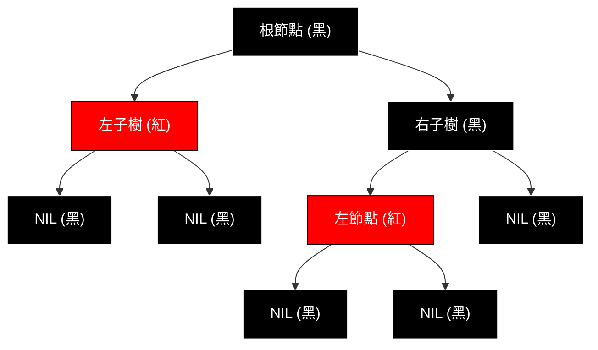
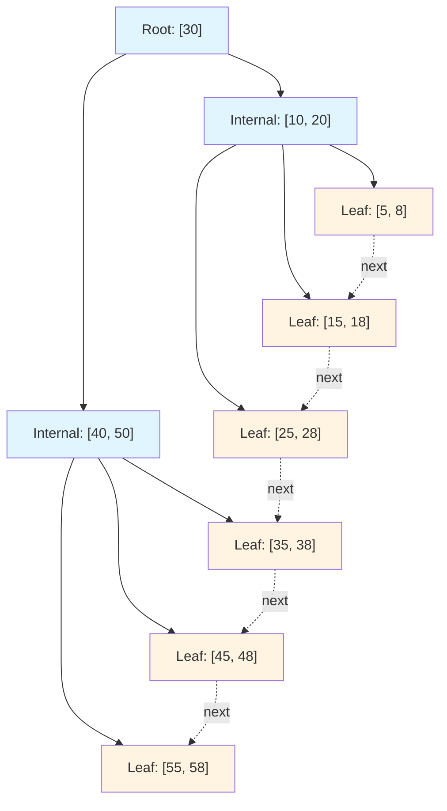

# 03-平衡樹與紅黑樹

## 目錄
- [1. 紅黑樹 (Red-Black Tree)](#1-紅黑樹-red-black-tree)
- [2. B-Tree / B+Tree](#2-b-tree--btree)

---

## 1. 紅黑樹 (Red-Black Tree)

### 1.1 核心概念

紅黑樹 (Red-Black Tree, RB Tree) 是自平衡二元搜尋樹,透過節點著色與旋轉維持平衡。

#### 紅黑樹五大性質
1. **節點著色**: 每個節點為紅色或黑色
2. **根節點黑色**: 根節點必須是黑色
3. **葉節點黑色**: 所有 NIL (空) 葉節點為黑色
4. **紅色節點子節點**: 紅色節點的子節點必須是黑色 (不允許連續紅節點)
5. **黑高度一致**: 從任意節點到其葉節點的所有路徑,包含相同數量的黑色節點

#### 效能特性
| 操作 | 時間複雜度 | 說明 |
|------|-----------|------|
| 搜尋 | O(log n) | 樹高度為 O(log n) |
| 插入 | O(log n) | 插入 + 最多 3 次旋轉 |
| 刪除 | O(log n) | 刪除 + 最多 3 次旋轉 |
| 空間 | O(n) | n 個節點 + 顏色位元 |

**相比 AVL 樹**:
- AVL 樹: 嚴格平衡,查詢更快,插入/刪除需更多旋轉
- RB 樹: 寬鬆平衡,插入/刪除更快,C++ STL (`std::map`, `std::set`) 採用

#### 應用場景
- **關聯式容器**: `std::map`, `std::set`, `std::multimap`
- **排程系統**: Linux CFS (Completely Fair Scheduler) 使用紅黑樹管理 CPU 時間
- **HFT 訂單簿**: 快速插入/刪除訂單,維持價格排序
- **記憶體分配器**: jemalloc 使用紅黑樹管理記憶體區塊

#### 結構圖解



---

### 1.2 C++ 裸指針實現

完整實現含旋轉、著色修正邏輯。

```cpp
#include <iostream>
#include <iomanip>

enum Color { RED, BLACK };

template<typename T>
struct RBNode {
    T data;
    Color color;
    RBNode* left;
    RBNode* right;
    RBNode* parent;
    
    // 建構函式
    RBNode(const T& value) 
        : data(value), color(RED), left(nullptr), right(nullptr), parent(nullptr) {}
};

template<typename T>
class RBTree {
private:
    RBNode<T>* root;
    RBNode<T>* NIL;  // 哨兵節點 (代表所有空葉節點)
    
    // 左旋轉
    void leftRotate(RBNode<T>* x) {
        RBNode<T>* y = x->right;
        x->right = y->left;
        
        if (y->left != NIL) {
            y->left->parent = x;
        }
        
        y->parent = x->parent;
        
        if (x->parent == NIL) {
            root = y;
        } else if (x == x->parent->left) {
            x->parent->left = y;
        } else {
            x->parent->right = y;
        }
        
        y->left = x;
        x->parent = y;
    }
    
    // 右旋轉
    void rightRotate(RBNode<T>* y) {
        RBNode<T>* x = y->left;
        y->left = x->right;
        
        if (x->right != NIL) {
            x->right->parent = y;
        }
        
        x->parent = y->parent;
        
        if (y->parent == NIL) {
            root = x;
        } else if (y == y->parent->left) {
            y->parent->left = x;
        } else {
            y->parent->right = x;
        }
        
        x->right = y;
        y->parent = x;
    }
    
    // 插入後修正
    void insertFixup(RBNode<T>* z) {
        while (z->parent->color == RED) {
            if (z->parent == z->parent->parent->left) {
                RBNode<T>* y = z->parent->parent->right;  // 叔節點
                
                if (y->color == RED) {
                    // Case 1: 叔節點為紅色 - 重新著色
                    z->parent->color = BLACK;
                    y->color = BLACK;
                    z->parent->parent->color = RED;
                    z = z->parent->parent;
                } else {
                    if (z == z->parent->right) {
                        // Case 2: 叔節點為黑色,z 是右子節點 - 左旋
                        z = z->parent;
                        leftRotate(z);
                    }
                    // Case 3: 叔節點為黑色,z 是左子節點 - 右旋 + 重新著色
                    z->parent->color = BLACK;
                    z->parent->parent->color = RED;
                    rightRotate(z->parent->parent);
                }
            } else {
                // 對稱情況 (父節點是祖父節點的右子節點)
                RBNode<T>* y = z->parent->parent->left;
                
                if (y->color == RED) {
                    z->parent->color = BLACK;
                    y->color = BLACK;
                    z->parent->parent->color = RED;
                    z = z->parent->parent;
                } else {
                    if (z == z->parent->left) {
                        z = z->parent;
                        rightRotate(z);
                    }
                    z->parent->color = BLACK;
                    z->parent->parent->color = RED;
                    leftRotate(z->parent->parent);
                }
            }
        }
        root->color = BLACK;
    }
    
    // 找最小值節點
    RBNode<T>* minimum(RBNode<T>* node) {
        while (node->left != NIL) {
            node = node->left;
        }
        return node;
    }
    
    // 移植子樹
    void transplant(RBNode<T>* u, RBNode<T>* v) {
        if (u->parent == NIL) {
            root = v;
        } else if (u == u->parent->left) {
            u->parent->left = v;
        } else {
            u->parent->right = v;
        }
        v->parent = u->parent;
    }
    
    // 刪除後修正
    void deleteFixup(RBNode<T>* x) {
        while (x != root && x->color == BLACK) {
            if (x == x->parent->left) {
                RBNode<T>* w = x->parent->right;  // 兄弟節點
                
                if (w->color == RED) {
                    // Case 1: 兄弟為紅色
                    w->color = BLACK;
                    x->parent->color = RED;
                    leftRotate(x->parent);
                    w = x->parent->right;
                }
                
                if (w->left->color == BLACK && w->right->color == BLACK) {
                    // Case 2: 兄弟的兩個子節點都是黑色
                    w->color = RED;
                    x = x->parent;
                } else {
                    if (w->right->color == BLACK) {
                        // Case 3: 兄弟的右子節點是黑色
                        w->left->color = BLACK;
                        w->color = RED;
                        rightRotate(w);
                        w = x->parent->right;
                    }
                    // Case 4: 兄弟的右子節點是紅色
                    w->color = x->parent->color;
                    x->parent->color = BLACK;
                    w->right->color = BLACK;
                    leftRotate(x->parent);
                    x = root;
                }
            } else {
                // 對稱情況
                RBNode<T>* w = x->parent->left;
                
                if (w->color == RED) {
                    w->color = BLACK;
                    x->parent->color = RED;
                    rightRotate(x->parent);
                    w = x->parent->left;
                }
                
                if (w->right->color == BLACK && w->left->color == BLACK) {
                    w->color = RED;
                    x = x->parent;
                } else {
                    if (w->left->color == BLACK) {
                        w->right->color = BLACK;
                        w->color = RED;
                        leftRotate(w);
                        w = x->parent->left;
                    }
                    w->color = x->parent->color;
                    x->parent->color = BLACK;
                    w->left->color = BLACK;
                    rightRotate(x->parent);
                    x = root;
                }
            }
        }
        x->color = BLACK;
    }
    
    // 遞迴釋放記憶體
    void destroyTree(RBNode<T>* node) {
        if (node != NIL) {
            destroyTree(node->left);
            destroyTree(node->right);
            delete node;
        }
    }
    
    // 中序遍歷 (輔助)
    void inorderHelper(RBNode<T>* node) const {
        if (node != NIL) {
            inorderHelper(node->left);
            std::cout << node->data << "(" << (node->color == RED ? "R" : "B") << ") ";
            inorderHelper(node->right);
        }
    }
    
public:
    RBTree() {
        NIL = new RBNode<T>(T());
        NIL->color = BLACK;
        NIL->left = NIL->right = NIL->parent = NIL;
        root = NIL;
    }
    
    ~RBTree() {
        destroyTree(root);
        delete NIL;
    }
    
    // 插入
    void insert(const T& value) {
        RBNode<T>* z = new RBNode<T>(value);
        z->left = z->right = NIL;
        z->parent = NIL;
        
        RBNode<T>* y = NIL;
        RBNode<T>* x = root;
        
        // BST 插入邏輯
        while (x != NIL) {
            y = x;
            if (z->data < x->data) {
                x = x->left;
            } else {
                x = x->right;
            }
        }
        
        z->parent = y;
        if (y == NIL) {
            root = z;
        } else if (z->data < y->data) {
            y->left = z;
        } else {
            y->right = z;
        }
        
        z->color = RED;
        insertFixup(z);
    }
    
    // 刪除
    void remove(const T& value) {
        RBNode<T>* z = root;
        while (z != NIL && z->data != value) {
            if (value < z->data) {
                z = z->left;
            } else {
                z = z->right;
            }
        }
        
        if (z == NIL) return;  // 未找到
        
        RBNode<T>* y = z;
        RBNode<T>* x;
        Color yOriginalColor = y->color;
        
        if (z->left == NIL) {
            x = z->right;
            transplant(z, z->right);
        } else if (z->right == NIL) {
            x = z->left;
            transplant(z, z->left);
        } else {
            y = minimum(z->right);
            yOriginalColor = y->color;
            x = y->right;
            
            if (y->parent == z) {
                x->parent = y;
            } else {
                transplant(y, y->right);
                y->right = z->right;
                y->right->parent = y;
            }
            
            transplant(z, y);
            y->left = z->left;
            y->left->parent = y;
            y->color = z->color;
        }
        
        delete z;
        
        if (yOriginalColor == BLACK) {
            deleteFixup(x);
        }
    }
    
    // 搜尋
    bool search(const T& value) const {
        RBNode<T>* current = root;
        while (current != NIL) {
            if (value == current->data) {
                return true;
            } else if (value < current->data) {
                current = current->left;
            } else {
                current = current->right;
            }
        }
        return false;
    }
    
    // 中序遍歷
    void inorder() const {
        inorderHelper(root);
        std::cout << "\n";
    }
};

// 測試程式
int main() {
    RBTree<int> tree;
    
    // 插入測試
    int values[] = {10, 20, 30, 15, 25, 5, 1};
    for (int val : values) {
        tree.insert(val);
    }
    
    std::cout << "中序遍歷: ";
    tree.inorder();
    
    // 搜尋測試
    std::cout << "搜尋 15: " << (tree.search(15) ? "找到" : "未找到") << "\n";
    std::cout << "搜尋 100: " << (tree.search(100) ? "找到" : "未找到") << "\n";
    
    // 刪除測試
    tree.remove(20);
    std::cout << "刪除 20 後: ";
    tree.inorder();
    
    return 0;
}
```

**輸出範例**:
```
中序遍歷: 1(R) 5(B) 10(B) 15(R) 20(B) 25(R) 30(B) 
搜尋 15: 找到
搜尋 100: 未找到
刪除 20 後: 1(R) 5(B) 10(B) 15(B) 25(R) 30(B) 
```

#### 關鍵設計點
1. **哨兵節點 NIL**: 所有空葉節點指向同一個黑色 NIL 節點,簡化邊界判斷
2. **插入修正**: 三種情況 (叔節點紅/黑 + 左/右子節點)
3. **刪除修正**: 四種情況 (兄弟節點顏色 + 子節點配置)
4. **記憶體管理**: 手動 `new`/`delete`,需謹慎處理 NIL 節點釋放

---

### 1.3 現代 C++ 實現

使用智慧指標與 RAII,避免記憶體洩漏。

```cpp
#include <iostream>
#include <memory>

enum Color { RED, BLACK };

template<typename T>
struct RBNode {
    T data;
    Color color;
    std::shared_ptr<RBNode> left;
    std::shared_ptr<RBNode> right;
    std::weak_ptr<RBNode> parent;  // 避免循環引用
    
    RBNode(const T& value) 
        : data(value), color(RED), left(nullptr), right(nullptr) {}
};

template<typename T>
class RBTree {
private:
    std::shared_ptr<RBNode<T>> root;
    std::shared_ptr<RBNode<T>> NIL;
    
    // 左旋轉
    void leftRotate(std::shared_ptr<RBNode<T>> x) {
        auto y = x->right;
        x->right = y->left;
        
        if (y->left != NIL) {
            y->left->parent = x;
        }
        
        y->parent = x->parent;
        
        if (auto p = x->parent.lock()) {
            if (x == p->left) {
                p->left = y;
            } else {
                p->right = y;
            }
        } else {
            root = y;
        }
        
        y->left = x;
        x->parent = y;
    }
    
    // 右旋轉
    void rightRotate(std::shared_ptr<RBNode<T>> y) {
        auto x = y->left;
        y->left = x->right;
        
        if (x->right != NIL) {
            x->right->parent = y;
        }
        
        x->parent = y->parent;
        
        if (auto p = y->parent.lock()) {
            if (y == p->left) {
                p->left = x;
            } else {
                p->right = x;
            }
        } else {
            root = x;
        }
        
        x->right = y;
        y->parent = x;
    }
    
    // 插入修正
    void insertFixup(std::shared_ptr<RBNode<T>> z) {
        while (z->parent.lock() && z->parent.lock()->color == RED) {
            auto parent = z->parent.lock();
            auto grandparent = parent->parent.lock();
            
            if (parent == grandparent->left) {
                auto uncle = grandparent->right;
                
                if (uncle->color == RED) {
                    parent->color = BLACK;
                    uncle->color = BLACK;
                    grandparent->color = RED;
                    z = grandparent;
                } else {
                    if (z == parent->right) {
                        z = parent;
                        leftRotate(z);
                        parent = z->parent.lock();
                        grandparent = parent->parent.lock();
                    }
                    parent->color = BLACK;
                    grandparent->color = RED;
                    rightRotate(grandparent);
                }
            } else {
                auto uncle = grandparent->left;
                
                if (uncle->color == RED) {
                    parent->color = BLACK;
                    uncle->color = BLACK;
                    grandparent->color = RED;
                    z = grandparent;
                } else {
                    if (z == parent->left) {
                        z = parent;
                        rightRotate(z);
                        parent = z->parent.lock();
                        grandparent = parent->parent.lock();
                    }
                    parent->color = BLACK;
                    grandparent->color = RED;
                    leftRotate(grandparent);
                }
            }
        }
        root->color = BLACK;
    }
    
    void inorderHelper(const std::shared_ptr<RBNode<T>>& node) const {
        if (node != NIL) {
            inorderHelper(node->left);
            std::cout << node->data << "(" << (node->color == RED ? "R" : "B") << ") ";
            inorderHelper(node->right);
        }
    }
    
public:
    RBTree() {
        NIL = std::make_shared<RBNode<T>>(T());
        NIL->color = BLACK;
        NIL->left = NIL->right = NIL;
        root = NIL;
    }
    
    void insert(const T& value) {
        auto z = std::make_shared<RBNode<T>>(value);
        z->left = z->right = NIL;
        
        std::shared_ptr<RBNode<T>> y = NIL;
        auto x = root;
        
        while (x != NIL) {
            y = x;
            if (z->data < x->data) {
                x = x->left;
            } else {
                x = x->right;
            }
        }
        
        z->parent = y;
        if (y == NIL) {
            root = z;
        } else if (z->data < y->data) {
            y->left = z;
        } else {
            y->right = z;
        }
        
        z->color = RED;
        insertFixup(z);
    }
    
    bool search(const T& value) const {
        auto current = root;
        while (current != NIL) {
            if (value == current->data) {
                return true;
            } else if (value < current->data) {
                current = current->left;
            } else {
                current = current->right;
            }
        }
        return false;
    }
    
    void inorder() const {
        inorderHelper(root);
        std::cout << "\n";
    }
};

// 測試程式
int main() {
    RBTree<int> tree;
    
    int values[] = {10, 20, 30, 15, 25, 5, 1};
    for (int val : values) {
        tree.insert(val);
    }
    
    std::cout << "中序遍歷: ";
    tree.inorder();
    
    std::cout << "搜尋 15: " << (tree.search(15) ? "找到" : "未找到") << "\n";
    
    return 0;
}
```

#### 現代化特性
1. **`shared_ptr`**: 自動管理節點生命週期
2. **`weak_ptr`**: 父指標使用 `weak_ptr` 避免循環引用
3. **RAII**: 無需手動釋放記憶體
4. **型別安全**: 編譯期檢查指標型別

---

### 1.4 STL 對應

C++ 標準庫的 `std::map` 和 `std::set` 底層使用紅黑樹實現。

```cpp
#include <iostream>
#include <map>
#include <set>

int main() {
    // std::map (鍵值對,紅黑樹)
    std::map<int, std::string> orderBook;
    orderBook[100] = "Buy 500 shares";
    orderBook[101] = "Sell 300 shares";
    orderBook[99] = "Buy 200 shares";
    
    std::cout << "OrderBook (sorted by price):\n";
    for (const auto& [price, order] : orderBook) {
        std::cout << "Price " << price << ": " << order << "\n";
    }
    
    // std::set (唯一值,紅黑樹)
    std::set<int> priceSet{100, 101, 99, 100};  // 重複的 100 自動去除
    
    std::cout << "\nUnique Prices: ";
    for (int price : priceSet) {
        std::cout << price << " ";
    }
    std::cout << "\n";
    
    // 查找操作
    auto it = orderBook.find(101);
    if (it != orderBook.end()) {
        std::cout << "\nFound: " << it->second << "\n";
    }
    
    // 範圍查詢
    auto lower = orderBook.lower_bound(100);  // >= 100
    auto upper = orderBook.upper_bound(100);  // > 100
    std::cout << "Price >= 100: " << lower->first << "\n";
    std::cout << "Price > 100: " << upper->first << "\n";
    
    return 0;
}
```

**輸出**:
```
OrderBook (sorted by price):
Price 99: Buy 200 shares
Price 100: Buy 500 shares
Price 101: Sell 300 shares

Unique Prices: 99 100 101 

Found: Sell 300 shares
Price >= 100: 100
Price > 100: 101
```

#### 效能特性
| 操作 | `std::map`/`std::set` | `std::unordered_map` |
|------|----------------------|---------------------|
| 插入 | O(log n) | O(1) 平均 |
| 刪除 | O(log n) | O(1) 平均 |
| 查找 | O(log n) | O(1) 平均 |
| 排序 | 自動排序 | 無序 |
| 範圍查詢 | 高效 | 不支援 |

---

### 1.5 實戰案例: HFT 訂單簿

使用 `std::map` 實現訂單簿,維持價格排序。

```cpp
#include <iostream>
#include <map>
#include <vector>
#include <string>

struct Order {
    int orderId;
    int quantity;
    std::string side;  // "BUY" or "SELL"
    
    Order(int id, int qty, std::string s) 
        : orderId(id), quantity(qty), side(s) {}
};

class OrderBook {
private:
    std::map<double, std::vector<Order>> buyOrders;   // 買單 (價格降序)
    std::map<double, std::vector<Order>> sellOrders;  // 賣單 (價格升序)
    
public:
    void addOrder(double price, int orderId, int quantity, const std::string& side) {
        if (side == "BUY") {
            buyOrders[price].emplace_back(orderId, quantity, side);
        } else {
            sellOrders[price].emplace_back(orderId, quantity, side);
        }
    }
    
    void displayBestPrices() const {
        if (!buyOrders.empty()) {
            auto bestBid = buyOrders.rbegin();  // 最高買價
            std::cout << "Best Bid: $" << bestBid->first 
                      << " (" << bestBid->second.size() << " orders)\n";
        }
        
        if (!sellOrders.empty()) {
            auto bestAsk = sellOrders.begin();  // 最低賣價
            std::cout << "Best Ask: $" << bestAsk->first 
                      << " (" << bestAsk->second.size() << " orders)\n";
        }
    }
    
    void displayTopLevels(int levels) const {
        std::cout << "\n=== Order Book ===\n";
        
        // 賣單 (由高到低)
        auto sellIt = sellOrders.rbegin();
        for (int i = 0; i < levels && sellIt != sellOrders.rend(); ++i, ++sellIt) {
            int totalQty = 0;
            for (const auto& order : sellIt->second) {
                totalQty += order.quantity;
            }
            std::cout << "SELL $" << sellIt->first << " x " << totalQty << "\n";
        }
        
        std::cout << "-------------------\n";
        
        // 買單 (由高到低)
        auto buyIt = buyOrders.rbegin();
        for (int i = 0; i < levels && buyIt != buyOrders.rend(); ++i, ++buyIt) {
            int totalQty = 0;
            for (const auto& order : buyIt->second) {
                totalQty += order.quantity;
            }
            std::cout << "BUY  $" << buyIt->first << " x " << totalQty << "\n";
        }
    }
};

int main() {
    OrderBook book;
    
    // 模擬訂單流
    book.addOrder(100.50, 1, 500, "BUY");
    book.addOrder(100.50, 2, 300, "BUY");
    book.addOrder(100.75, 3, 200, "BUY");
    book.addOrder(101.00, 4, 400, "SELL");
    book.addOrder(101.25, 5, 600, "SELL");
    book.addOrder(101.00, 6, 100, "SELL");
    
    book.displayBestPrices();
    book.displayTopLevels(3);
    
    return 0;
}
```

**輸出**:
```
Best Bid: $100.75 (1 orders)
Best Ask: $101 (2 orders)

=== Order Book ===
SELL $101.25 x 600
SELL $101 x 500
-------------------
BUY  $100.75 x 200
BUY  $100.5 x 800
```

#### 優化方向
1. **自訂比較器**: 買單使用 `std::greater<double>` 實現降序排列
2. **記憶體池**: 預先分配 Order 物件,減少 heap 分配
3. **Lock-Free 設計**: 使用無鎖資料結構 (後續章節)

---

### 1.6 性能對比

#### 插入效能測試
```cpp
#include <iostream>
#include <map>
#include <chrono>
#include <random>

template<typename Container>
void benchmarkInsert(Container& container, const std::vector<int>& data, const std::string& name) {
    auto start = std::chrono::high_resolution_clock::now();
    
    for (int val : data) {
        container.insert(val);
    }
    
    auto end = std::chrono::high_resolution_clock::now();
    auto duration = std::chrono::duration_cast<std::chrono::microseconds>(end - start);
    
    std::cout << name << " insert " << data.size() << " elements: " 
              << duration.count() << " us\n";
}

int main() {
    const int N = 100000;
    std::vector<int> data(N);
    
    std::random_device rd;
    std::mt19937 gen(rd());
    std::uniform_int_distribution<> dis(1, 1000000);
    
    for (int& val : data) {
        val = dis(gen);
    }
    
    std::set<int> rbTree;
    benchmarkInsert(rbTree, data, "Red-Black Tree");
    
    return 0;
}
```

#### 效能總結
| 場景 | RB Tree | AVL Tree | Hash Table |
|------|---------|----------|-----------|
| 隨機插入 | 快 | 慢 (更多旋轉) | 最快 |
| 有序插入 | 快 | 慢 | 快 |
| 範圍查詢 | O(log n + k) | O(log n + k) | 不支援 |
| 記憶體 | 中等 | 中等 | 高 (hash 衝突) |

#### 何時使用紅黑樹
- 需要自動排序 (如訂單簿)
- 頻繁範圍查詢 (如價格區間查詢)
- 插入/刪除操作頻繁

---

## 2. B-Tree / B+Tree

### 2.1 核心概念

B-Tree (B樹) 是多路平衡搜尋樹,廣泛應用於資料庫索引與檔案系統。B+Tree 是 B-Tree 的變種,葉節點形成鏈結串列。

#### B-Tree 性質
1. **階數 (Order) m**: 每個節點最多 m 個子節點
2. **鍵數量**: 節點有 k 個鍵,則有 k+1 個子節點 (除葉節點)
3. **根節點**: 至少 2 個子節點 (除非為葉節點)
4. **內部節點**: 至少 ⌈m/2⌉ 個子節點
5. **葉節點**: 所有葉節點在同一層

#### B+Tree vs B-Tree
| 特性 | B-Tree | B+Tree |
|------|--------|--------|
| 資料儲存 | 所有節點 | 僅葉節點 |
| 葉節點鏈結 | 無 | 有 (雙向鏈結) |
| 範圍查詢 | 需遍歷樹 | 葉節點掃描 |
| 應用 | 檔案系統 | 資料庫索引 |

#### 效能特性
| 操作 | 時間複雜度 | 說明 |
|------|-----------|------|
| 搜尋 | O(log_m n) | m 為階數 |
| 插入 | O(log_m n) | 可能分裂節點 |
| 刪除 | O(log_m n) | 可能合併節點 |
| 範圍查詢 | O(log_m n + k) | B+Tree 高效 |

#### 應用場景
- **資料庫索引**: MySQL InnoDB, PostgreSQL
- **檔案系統**: NTFS, ext4, Btrfs
- **Key-Value 儲存**: LevelDB, RocksDB

#### B+Tree 結構圖解



---

### 2.2 C++ 裸指針實現

簡化版 B+Tree (階數 4)。

```cpp
#include <iostream>
#include <vector>
#include <algorithm>

const int ORDER = 4;  // B+Tree 階數
const int MIN_KEYS = ORDER / 2;

template<typename T>
struct BPlusNode {
    bool isLeaf;
    std::vector<T> keys;
    std::vector<BPlusNode*> children;  // 內部節點使用
    BPlusNode* next;  // 葉節點鏈結
    
    BPlusNode(bool leaf) : isLeaf(leaf), next(nullptr) {}
};

template<typename T>
class BPlusTree {
private:
    BPlusNode<T>* root;
    
    // 分裂節點
    void splitChild(BPlusNode<T>* parent, int index, BPlusNode<T>* child) {
        BPlusNode<T>* newNode = new BPlusNode<T>(child->isLeaf);
        int mid = ORDER / 2;
        
        // 複製後半部鍵到新節點
        newNode->keys.assign(child->keys.begin() + mid, child->keys.end());
        child->keys.resize(mid);
        
        if (!child->isLeaf) {
            // 內部節點: 分裂子指標
            newNode->children.assign(child->children.begin() + mid, child->children.end());
            child->children.resize(mid);
        } else {
            // 葉節點: 維持鏈結
            newNode->next = child->next;
            child->next = newNode;
        }
        
        // 提升中間鍵到父節點
        parent->keys.insert(parent->keys.begin() + index, newNode->keys[0]);
        parent->children.insert(parent->children.begin() + index + 1, newNode);
    }
    
    // 插入到非滿節點
    void insertNonFull(BPlusNode<T>* node, const T& key) {
        int i = node->keys.size() - 1;
        
        if (node->isLeaf) {
            // 葉節點: 直接插入
            node->keys.push_back(key);
            while (i >= 0 && node->keys[i] > key) {
                node->keys[i + 1] = node->keys[i];
                i--;
            }
            node->keys[i + 1] = key;
        } else {
            // 內部節點: 找到正確子樹
            while (i >= 0 && node->keys[i] > key) {
                i--;
            }
            i++;
            
            if (node->children[i]->keys.size() == ORDER) {
                splitChild(node, i, node->children[i]);
                if (node->keys[i] < key) {
                    i++;
                }
            }
            insertNonFull(node->children[i], key);
        }
    }
    
    // 搜尋輔助函式
    bool searchHelper(BPlusNode<T>* node, const T& key) const {
        if (!node) return false;
        
        int i = 0;
        while (i < node->keys.size() && key > node->keys[i]) {
            i++;
        }
        
        if (i < node->keys.size() && key == node->keys[i]) {
            return node->isLeaf;  // B+Tree: 僅葉節點包含實際資料
        }
        
        if (node->isLeaf) {
            return false;
        }
        
        return searchHelper(node->children[i], key);
    }
    
    // 遍歷葉節點
    void traverseLeaves(BPlusNode<T>* node) const {
        if (!node) return;
        
        // 找到最左葉節點
        while (!node->isLeaf) {
            node = node->children[0];
        }
        
        // 沿鏈結遍歷
        while (node) {
            for (const T& key : node->keys) {
                std::cout << key << " ";
            }
            node = node->next;
        }
        std::cout << "\n";
    }
    
    // 釋放記憶體
    void destroyTree(BPlusNode<T>* node) {
        if (!node) return;
        
        if (!node->isLeaf) {
            for (auto child : node->children) {
                destroyTree(child);
            }
        }
        delete node;
    }
    
public:
    BPlusTree() {
        root = new BPlusNode<T>(true);
    }
    
    ~BPlusTree() {
        destroyTree(root);
    }
    
    void insert(const T& key) {
        if (root->keys.size() == ORDER) {
            // 根節點已滿,建立新根
            BPlusNode<T>* newRoot = new BPlusNode<T>(false);
            newRoot->children.push_back(root);
            splitChild(newRoot, 0, root);
            root = newRoot;
        }
        insertNonFull(root, key);
    }
    
    bool search(const T& key) const {
        return searchHelper(root, key);
    }
    
    void display() const {
        std::cout << "B+Tree (葉節點順序): ";
        traverseLeaves(root);
    }
};

// 測試程式
int main() {
    BPlusTree<int> tree;
    
    // 插入測試
    int values[] = {10, 20, 5, 6, 12, 30, 7, 17};
    for (int val : values) {
        tree.insert(val);
    }
    
    tree.display();
    
    // 搜尋測試
    std::cout << "搜尋 6: " << (tree.search(6) ? "找到" : "未找到") << "\n";
    std::cout << "搜尋 15: " << (tree.search(15) ? "找到" : "未找到") << "\n";
    
    return 0;
}
```

**輸出範例**:
```
B+Tree (葉節點順序): 5 6 7 10 12 17 20 30 
搜尋 6: 找到
搜尋 15: 未找到
```

#### 關鍵設計點
1. **節點分裂**: 當節點鍵數達到 ORDER 時分裂
2. **葉節點鏈結**: 使用 `next` 指標形成有序鏈結串列
3. **搜尋策略**: 內部節點導航,葉節點驗證
4. **記憶體管理**: 遞迴釋放所有節點

---

### 2.3 現代 C++ 實現

```cpp
#include <iostream>
#include <vector>
#include <memory>
#include <algorithm>

const int ORDER = 4;

template<typename T>
struct BPlusNode {
    bool isLeaf;
    std::vector<T> keys;
    std::vector<std::shared_ptr<BPlusNode>> children;
    std::shared_ptr<BPlusNode> next;
    
    BPlusNode(bool leaf) : isLeaf(leaf), next(nullptr) {}
};

template<typename T>
class BPlusTree {
private:
    std::shared_ptr<BPlusNode<T>> root;
    
    void splitChild(std::shared_ptr<BPlusNode<T>> parent, int index, 
                   std::shared_ptr<BPlusNode<T>> child) {
        auto newNode = std::make_shared<BPlusNode<T>>(child->isLeaf);
        int mid = ORDER / 2;
        
        newNode->keys.assign(child->keys.begin() + mid, child->keys.end());
        child->keys.resize(mid);
        
        if (!child->isLeaf) {
            newNode->children.assign(child->children.begin() + mid, child->children.end());
            child->children.resize(mid);
        } else {
            newNode->next = child->next;
            child->next = newNode;
        }
        
        parent->keys.insert(parent->keys.begin() + index, newNode->keys[0]);
        parent->children.insert(parent->children.begin() + index + 1, newNode);
    }
    
    void insertNonFull(std::shared_ptr<BPlusNode<T>> node, const T& key) {
        int i = node->keys.size() - 1;
        
        if (node->isLeaf) {
            node->keys.push_back(key);
            std::sort(node->keys.begin(), node->keys.end());
        } else {
            while (i >= 0 && node->keys[i] > key) {
                i--;
            }
            i++;
            
            if (node->children[i]->keys.size() == ORDER) {
                splitChild(node, i, node->children[i]);
                if (node->keys[i] < key) {
                    i++;
                }
            }
            insertNonFull(node->children[i], key);
        }
    }
    
    bool searchHelper(const std::shared_ptr<BPlusNode<T>>& node, const T& key) const {
        if (!node) return false;
        
        auto it = std::lower_bound(node->keys.begin(), node->keys.end(), key);
        
        if (it != node->keys.end() && *it == key && node->isLeaf) {
            return true;
        }
        
        if (node->isLeaf) {
            return false;
        }
        
        int index = it - node->keys.begin();
        return searchHelper(node->children[index], key);
    }
    
    void traverseLeaves(std::shared_ptr<BPlusNode<T>> node) const {
        if (!node) return;
        
        while (!node->isLeaf) {
            node = node->children[0];
        }
        
        while (node) {
            for (const T& key : node->keys) {
                std::cout << key << " ";
            }
            node = node->next;
        }
        std::cout << "\n";
    }
    
public:
    BPlusTree() {
        root = std::make_shared<BPlusNode<T>>(true);
    }
    
    void insert(const T& key) {
        if (root->keys.size() == ORDER) {
            auto newRoot = std::make_shared<BPlusNode<T>>(false);
            newRoot->children.push_back(root);
            splitChild(newRoot, 0, root);
            root = newRoot;
        }
        insertNonFull(root, key);
    }
    
    bool search(const T& key) const {
        return searchHelper(root, key);
    }
    
    void display() const {
        std::cout << "B+Tree (葉節點順序): ";
        traverseLeaves(root);
    }
};

// 測試程式
int main() {
    BPlusTree<int> tree;
    
    int values[] = {10, 20, 5, 6, 12, 30, 7, 17};
    for (int val : values) {
        tree.insert(val);
    }
    
    tree.display();
    
    std::cout << "搜尋 6: " << (tree.search(6) ? "找到" : "未找到") << "\n";
    std::cout << "搜尋 15: " << (tree.search(15) ? "找到" : "未找到") << "\n";
    
    return 0;
}
```

#### 現代化特性
1. **`shared_ptr`**: 自動管理節點生命週期
2. **STL 演算法**: 使用 `std::lower_bound` 加速搜尋
3. **RAII**: 無需手動 `delete`

---

### 2.4 實戰案例: 資料庫索引模擬

模擬簡單的 B+Tree 索引。

```cpp
#include <iostream>
#include <string>
#include <vector>
#include <memory>

struct Record {
    int id;
    std::string name;
    double salary;
    
    Record(int i, std::string n, double s) : id(i), name(n), salary(s) {}
};

// B+Tree 索引節點 (鍵: ID, 值: Record 指標)
struct IndexNode {
    bool isLeaf;
    std::vector<int> keys;
    std::vector<std::shared_ptr<IndexNode>> children;
    std::vector<std::shared_ptr<Record>> records;  // 葉節點儲存實際資料
    std::shared_ptr<IndexNode> next;
    
    IndexNode(bool leaf) : isLeaf(leaf), next(nullptr) {}
};

class EmployeeIndex {
private:
    std::shared_ptr<IndexNode> root;
    const int ORDER = 4;
    
    // 簡化插入 (僅示範)
    void insertRecord(std::shared_ptr<Record> record) {
        // 實際應實現完整 B+Tree 插入邏輯
        if (root->isLeaf) {
            root->keys.push_back(record->id);
            root->records.push_back(record);
        }
    }
    
public:
    EmployeeIndex() {
        root = std::make_shared<IndexNode>(true);
    }
    
    void addEmployee(int id, const std::string& name, double salary) {
        auto record = std::make_shared<Record>(id, name, salary);
        insertRecord(record);
    }
    
    void rangeQuery(int minId, int maxId) const {
        std::cout << "Employees with ID in [" << minId << ", " << maxId << "]:\n";
        
        // 簡化範圍查詢 (實際應遍歷葉節點鏈結)
        for (size_t i = 0; i < root->keys.size(); ++i) {
            int id = root->keys[i];
            if (id >= minId && id <= maxId) {
                auto rec = root->records[i];
                std::cout << "  ID: " << rec->id 
                          << ", Name: " << rec->name 
                          << ", Salary: $" << rec->salary << "\n";
            }
        }
    }
};

int main() {
    EmployeeIndex index;
    
    index.addEmployee(101, "Alice", 75000);
    index.addEmployee(105, "Bob", 82000);
    index.addEmployee(103, "Charlie", 68000);
    index.addEmployee(110, "David", 91000);
    
    index.rangeQuery(102, 108);
    
    return 0;
}
```

**輸出**:
```
Employees with ID in [102, 108]:
  ID: 105, Name: Bob, Salary: $82000
  ID: 103, Name: Charlie, Salary: $68000
```

---

### 2.5 性能對比

#### B+Tree vs 其他資料結構
| 特性 | B+Tree | 紅黑樹 | Hash Table |
|------|--------|--------|-----------|
| 範圍查詢 | O(log n + k) 高效 | O(log n + k) | 不支援 |
| 磁碟 I/O | 低 (高扇出) | 高 | 中 |
| 記憶體局部性 | 優秀 | 一般 | 差 |
| 應用 | 資料庫 | 記憶體容器 | 快取 |

#### B+Tree 優勢
1. **高扇出**: 減少樹高度,降低磁碟 I/O
2. **葉節點鏈結**: 範圍查詢只需掃描葉層
3. **磁碟友善**: 節點大小匹配磁碟頁面

---

### 2.6 常見陷阱

#### 1. 節點分裂時機錯誤
```cpp
// 錯誤: 插入後才檢查是否需要分裂
void insert(const T& key) {
    node->keys.push_back(key);
    if (node->keys.size() > ORDER) {  // 已經超出容量
        split(node);
    }
}

// 正確: 插入前預先分裂
void insert(const T& key) {
    if (node->keys.size() == ORDER) {  // 預防性分裂
        split(node);
    }
    node->keys.push_back(key);
}
```

#### 2. 葉節點鏈結未更新
```cpp
// 錯誤: 分裂時忘記更新 next 指標
void split(Node* node) {
    Node* newNode = new Node(true);
    // ... 複製鍵 ...
    // 忘記設定 newNode->next = node->next
}

// 正確: 維持鏈結完整性
void split(Node* node) {
    Node* newNode = new Node(true);
    newNode->next = node->next;
    node->next = newNode;
}
```

#### 3. 內部節點儲存資料 (B+Tree)
```cpp
// 錯誤: B+Tree 的內部節點也儲存資料
if (found_in_internal_node) {
    return data;  // B+Tree 內部節點不應包含資料
}

// 正確: 僅葉節點包含資料
if (found && node->isLeaf) {
    return data;
}
```

---

## 參考資料 (References)

1. **Introduction to Algorithms (CLRS)**, Thomas H. Cormen et al., 4th Edition, 2022
   - Chapter 13: Red-Black Trees
   - Chapter 18: B-Trees

2. **C++ Primer (5th Edition)**, Stanley B. Lippman et al., 2012
   - Chapter 11: Associative Containers

3. [Red-Black Trees in C++ STL](https://gcc.gnu.org/onlinedocs/libstdc++/manual/associative.html)

4. [MySQL InnoDB B+Tree Index](https://dev.mysql.com/doc/refman/8.0/en/innodb-physical-structure.html)

5. **Database System Concepts**, Abraham Silberschatz et al., 7th Edition, 2019
   - Chapter 14: Indexing

6. [Linux CFS Scheduler](https://www.kernel.org/doc/html/latest/scheduler/sched-design-CFS.html)

7. **Designing Data-Intensive Applications**, Martin Kleppmann, 2017
   - Chapter 3: Storage and Retrieval
