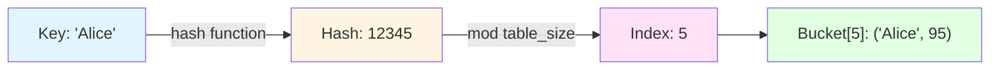
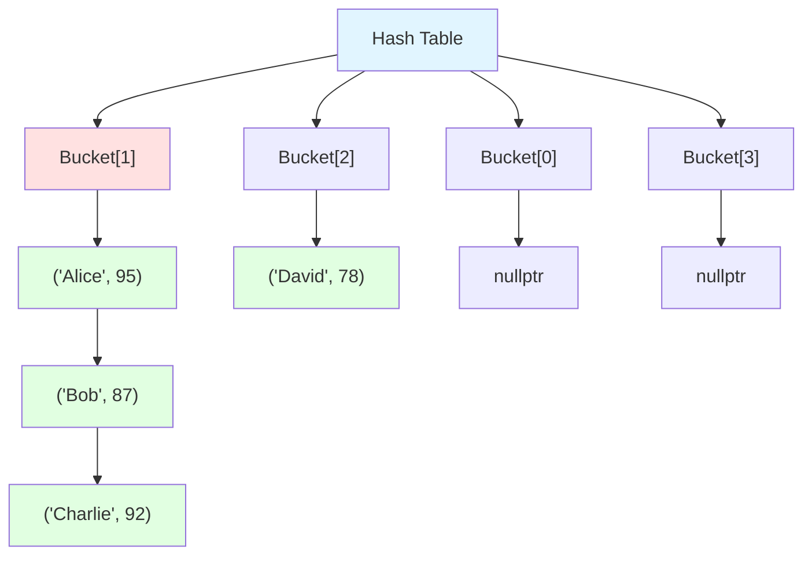
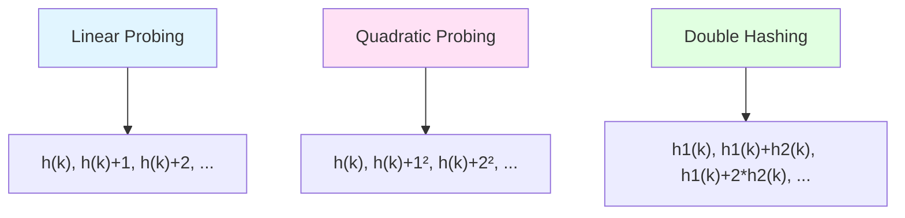

# 04-雜湊結構

## 目錄
- [1. Hash Table 核心原理](#1-hash-table-核心原理)
- [2. 碰撞解決策略](#2-碰撞解決策略)
- [3. unordered_map 實現](#3-unordered_map-實現)

---

## 1. Hash Table 核心原理

### 1.1 核心概念

雜湊表 (Hash Table) 透過雜湊函數 (Hash Function) 將鍵 (Key) 映射到桶 (Bucket) 索引,實現常數時間的查找、插入、刪除。

#### 基本原理



#### 效能特性
| 操作 | 平均時間 | 最差時間 | 說明 |
|------|---------|---------|------|
| 搜尋 | O(1) | O(n) | 無碰撞時常數,碰撞嚴重時退化 |
| 插入 | O(1) | O(n) | 需處理碰撞與擴容 |
| 刪除 | O(1) | O(n) | 鏈式法常數,開放定址需標記 |
| 空間 | O(n) | O(n) | 需額外空間存儲空桶 |

#### 關鍵組成
1. **雜湊函數**: 將鍵轉換為整數索引
2. **碰撞處理**: 解決不同鍵映射到相同索引
3. **動態擴容**: 維持負載因子 (Load Factor) 避免性能退化

#### 負載因子 (Load Factor)
```
Load Factor = n / m
  n: 元素數量
  m: 桶數量
```

**最佳負載因子**: 0.7 ~ 0.75 (鏈式法)
- 過低: 浪費空間
- 過高: 碰撞增加,性能退化

#### 應用場景
- **快取系統**: Redis, Memcached
- **資料庫索引**: 等值查詢優化
- **符號表**: 編譯器變數查找
- **HFT**: 訂單 ID 快速查找、去重

---

### 1.2 雜湊函數設計

#### 常見雜湊函數

```cpp
#include <iostream>
#include <string>
#include <functional>

// 1. 整數雜湊: 除法雜湊 (Division Hashing)
size_t hashInt(int key, size_t tableSize) {
    return key % tableSize;
}

// 2. 字串雜湊: DJB2 演算法
size_t hashString(const std::string& key) {
    size_t hash = 5381;
    for (char c : key) {
        hash = ((hash << 5) + hash) + c;  // hash * 33 + c
    }
    return hash;
}

// 3. 字串雜湊: FNV-1a (Fowler-Noll-Vo)
size_t hashFNV1a(const std::string& key) {
    const size_t FNV_PRIME = 0x100000001b3;
    const size_t FNV_OFFSET = 0xcbf29ce484222325;
    
    size_t hash = FNV_OFFSET;
    for (char c : key) {
        hash ^= static_cast<size_t>(c);
        hash *= FNV_PRIME;
    }
    return hash;
}

// 4. 通用雜湊: std::hash (C++11)
template<typename T>
size_t hashSTL(const T& key) {
    return std::hash<T>{}(key);
}

// 測試程式
int main() {
    std::string key = "Alice";
    
    std::cout << "DJB2:  " << hashString(key) << "\n";
    std::cout << "FNV-1a: " << hashFNV1a(key) << "\n";
    std::cout << "std::hash: " << hashSTL(key) << "\n";
    
    // 整數雜湊
    std::cout << "Integer hash (123 % 10): " << hashInt(123, 10) << "\n";
    
    return 0;
}
```

**輸出範例**:
```
DJB2:  193426918
FNV-1a: 11718085781588107841
std::hash: 6738638444933026382
Integer hash (123 % 10): 3
```

#### 雜湊函數品質指標
1. **均勻分佈**: 鍵均勻分散到各桶
2. **低碰撞率**: 減少不同鍵映射到同一索引
3. **計算速度**: 雜湊計算不應成為瓶頸
4. **確定性**: 相同鍵永遠產生相同雜湊值

#### 常見陷阱: 雜湊函數選擇不當
```cpp
// 錯誤: 使用低品質雜湊函數
size_t badHash(const std::string& key, size_t tableSize) {
    return key.length() % tableSize;  // 長度相同的字串碰撞
}

// 正確: 使用高品質雜湊函數
size_t goodHash(const std::string& key, size_t tableSize) {
    return hashFNV1a(key) % tableSize;
}
```

---

## 2. 碰撞解決策略

### 2.1 鏈式法 (Chaining)

每個桶存儲鏈結串列,碰撞的元素加入同一鏈結。

#### 結構圖解



#### C++ 裸指針實現

```cpp
#include <iostream>
#include <string>
#include <vector>

// 雜湊表節點
template<typename K, typename V>
struct HashNode {
    K key;
    V value;
    HashNode* next;
    
    HashNode(const K& k, const V& v) : key(k), value(v), next(nullptr) {}
};

template<typename K, typename V>
class HashTable {
private:
    std::vector<HashNode<K, V>*> buckets;
    size_t size;
    size_t capacity;
    const double maxLoadFactor = 0.75;
    
    // 雜湊函數
    size_t hash(const K& key) const {
        return std::hash<K>{}(key) % capacity;
    }
    
    // 擴容
    void rehash() {
        size_t oldCapacity = capacity;
        capacity *= 2;
        
        std::vector<HashNode<K, V>*> oldBuckets = std::move(buckets);
        buckets.resize(capacity, nullptr);
        size = 0;
        
        // 重新插入所有元素
        for (size_t i = 0; i < oldCapacity; ++i) {
            HashNode<K, V>* node = oldBuckets[i];
            while (node) {
                HashNode<K, V>* next = node->next;
                insert(node->key, node->value);
                delete node;
                node = next;
            }
        }
    }
    
public:
    HashTable(size_t cap = 16) : capacity(cap), size(0) {
        buckets.resize(capacity, nullptr);
    }
    
    ~HashTable() {
        for (auto bucket : buckets) {
            HashNode<K, V>* node = bucket;
            while (node) {
                HashNode<K, V>* temp = node;
                node = node->next;
                delete temp;
            }
        }
    }
    
    // 插入
    void insert(const K& key, const V& value) {
        // 檢查負載因子
        if (static_cast<double>(size) / capacity > maxLoadFactor) {
            rehash();
        }
        
        size_t index = hash(key);
        HashNode<K, V>* node = buckets[index];
        
        // 檢查鍵是否已存在
        while (node) {
            if (node->key == key) {
                node->value = value;  // 更新值
                return;
            }
            node = node->next;
        }
        
        // 插入新節點 (頭插法)
        HashNode<K, V>* newNode = new HashNode<K, V>(key, value);
        newNode->next = buckets[index];
        buckets[index] = newNode;
        size++;
    }
    
    // 搜尋
    bool search(const K& key, V& value) const {
        size_t index = hash(key);
        HashNode<K, V>* node = buckets[index];
        
        while (node) {
            if (node->key == key) {
                value = node->value;
                return true;
            }
            node = node->next;
        }
        return false;
    }
    
    // 刪除
    bool remove(const K& key) {
        size_t index = hash(key);
        HashNode<K, V>* node = buckets[index];
        HashNode<K, V>* prev = nullptr;
        
        while (node) {
            if (node->key == key) {
                if (prev) {
                    prev->next = node->next;
                } else {
                    buckets[index] = node->next;
                }
                delete node;
                size--;
                return true;
            }
            prev = node;
            node = node->next;
        }
        return false;
    }
    
    // 顯示狀態
    void display() const {
        std::cout << "Hash Table (Size: " << size << ", Capacity: " << capacity << "):\n";
        for (size_t i = 0; i < capacity; ++i) {
            if (buckets[i]) {
                std::cout << "  Bucket[" << i << "]: ";
                HashNode<K, V>* node = buckets[i];
                while (node) {
                    std::cout << "(" << node->key << ", " << node->value << ") -> ";
                    node = node->next;
                }
                std::cout << "nullptr\n";
            }
        }
    }
};

// 測試程式
int main() {
    HashTable<std::string, int> grades;
    
    grades.insert("Alice", 95);
    grades.insert("Bob", 87);
    grades.insert("Charlie", 92);
    grades.insert("David", 78);
    
    grades.display();
    
    int score;
    if (grades.search("Bob", score)) {
        std::cout << "\nBob's score: " << score << "\n";
    }
    
    grades.remove("Charlie");
    std::cout << "\nAfter removing Charlie:\n";
    grades.display();
    
    return 0;
}
```

**輸出範例**:
```
Hash Table (Size: 4, Capacity: 16):
  Bucket[3]: (David, 78) -> nullptr
  Bucket[7]: (Alice, 95) -> nullptr
  Bucket[10]: (Bob, 87) -> nullptr
  Bucket[14]: (Charlie, 92) -> nullptr

Bob's score: 87

After removing Charlie:
Hash Table (Size: 3, Capacity: 16):
  Bucket[3]: (David, 78) -> nullptr
  Bucket[7]: (Alice, 95) -> nullptr
  Bucket[10]: (Bob, 87) -> nullptr
```

#### 關鍵設計點
1. **頭插法**: 新節點插入鏈結頭部 (O(1))
2. **動態擴容**: 負載因子超過 0.75 時容量翻倍
3. **鍵重複處理**: 更新值而非插入新節點
4. **記憶體管理**: 析構函式釋放所有鏈結節點

---

### 2.2 開放定址法 (Open Addressing)

碰撞時探測下一個空桶,無需額外鏈結。

#### 探測策略



#### 線性探測 (Linear Probing)

```cpp
#include <iostream>
#include <vector>
#include <optional>

template<typename K, typename V>
struct Entry {
    K key;
    V value;
    bool deleted;  // 延遲刪除標記
    
    Entry() : deleted(false) {}
    Entry(const K& k, const V& v) : key(k), value(v), deleted(false) {}
};

template<typename K, typename V>
class HashTableOpenAddr {
private:
    std::vector<std::optional<Entry<K, V>>> table;
    size_t size;
    size_t capacity;
    const double maxLoadFactor = 0.5;  // 開放定址需更低負載因子
    
    size_t hash(const K& key) const {
        return std::hash<K>{}(key) % capacity;
    }
    
    void rehash() {
        size_t oldCapacity = capacity;
        capacity *= 2;
        
        std::vector<std::optional<Entry<K, V>>> oldTable = std::move(table);
        table.resize(capacity, std::nullopt);
        size = 0;
        
        for (const auto& entry : oldTable) {
            if (entry && !entry->deleted) {
                insert(entry->key, entry->value);
            }
        }
    }
    
public:
    HashTableOpenAddr(size_t cap = 16) : capacity(cap), size(0) {
        table.resize(capacity, std::nullopt);
    }
    
    void insert(const K& key, const V& value) {
        if (static_cast<double>(size) / capacity > maxLoadFactor) {
            rehash();
        }
        
        size_t index = hash(key);
        size_t i = 0;
        
        // 線性探測
        while (table[index] && !table[index]->deleted) {
            if (table[index]->key == key) {
                table[index]->value = value;  // 更新值
                return;
            }
            index = (index + 1) % capacity;
            i++;
            
            if (i >= capacity) {
                throw std::runtime_error("Hash table is full");
            }
        }
        
        table[index] = Entry<K, V>(key, value);
        size++;
    }
    
    bool search(const K& key, V& value) const {
        size_t index = hash(key);
        size_t i = 0;
        
        while (table[index]) {
            if (!table[index]->deleted && table[index]->key == key) {
                value = table[index]->value;
                return true;
            }
            index = (index + 1) % capacity;
            i++;
            
            if (i >= capacity) break;
        }
        return false;
    }
    
    bool remove(const K& key) {
        size_t index = hash(key);
        size_t i = 0;
        
        while (table[index]) {
            if (!table[index]->deleted && table[index]->key == key) {
                table[index]->deleted = true;  // 延遲刪除
                size--;
                return true;
            }
            index = (index + 1) % capacity;
            i++;
            
            if (i >= capacity) break;
        }
        return false;
    }
    
    void display() const {
        std::cout << "Hash Table (Size: " << size << ", Capacity: " << capacity << "):\n";
        for (size_t i = 0; i < capacity; ++i) {
            if (table[i] && !table[i]->deleted) {
                std::cout << "  Index[" << i << "]: (" 
                          << table[i]->key << ", " << table[i]->value << ")\n";
            }
        }
    }
};

// 測試程式
int main() {
    HashTableOpenAddr<std::string, int> grades;
    
    grades.insert("Alice", 95);
    grades.insert("Bob", 87);
    grades.insert("Charlie", 92);
    
    grades.display();
    
    int score;
    if (grades.search("Bob", score)) {
        std::cout << "\nBob's score: " << score << "\n";
    }
    
    grades.remove("Alice");
    std::cout << "\nAfter removing Alice:\n";
    grades.display();
    
    return 0;
}
```

**輸出範例**:
```
Hash Table (Size: 3, Capacity: 16):
  Index[7]: (Alice, 95)
  Index[10]: (Bob, 87)
  Index[14]: (Charlie, 92)

Bob's score: 87

After removing Alice:
Hash Table (Size: 2, Capacity: 16):
  Index[10]: (Bob, 87)
  Index[14]: (Charlie, 92)
```

#### 線性探測問題: 聚集 (Clustering)
連續佔用的桶形成聚集區,降低探測效率。

**解決方案**: 使用二次探測或雙重雜湊。

---

### 2.3 雙重雜湊 (Double Hashing)

使用第二個雜湊函數計算探測步長。

```cpp
template<typename K>
size_t hash1(const K& key, size_t capacity) {
    return std::hash<K>{}(key) % capacity;
}

template<typename K>
size_t hash2(const K& key, size_t capacity) {
    // 確保步長不為 0 且與 capacity 互質
    size_t h = std::hash<K>{}(key) % (capacity - 1);
    return h == 0 ? 1 : h;
}

// 探測序列
size_t probe(const K& key, size_t i, size_t capacity) {
    return (hash1(key, capacity) + i * hash2(key, capacity)) % capacity;
}
```

#### 雙重雜湊優勢
- 減少聚集問題
- 探測序列更分散
- 適合高負載因子場景

---

### 2.4 鏈式法 vs 開放定址法

| 特性 | 鏈式法 | 開放定址法 |
|------|--------|-----------|
| 記憶體 | 額外鏈結指標 | 無額外指標 |
| 快取友善 | 差 (指標跳躍) | 優 (連續記憶體) |
| 負載因子 | 可超過 1 | 必須 < 1 |
| 刪除操作 | 簡單 | 需延遲刪除 |
| 碰撞處理 | 鏈結延伸 | 探測 |
| STL 實現 | `unordered_map` | - |

---

## 3. unordered_map 實現

### 3.1 現代 C++ 實現

使用智慧指標與 STL 容器。

```cpp
#include <iostream>
#include <memory>
#include <vector>
#include <list>
#include <utility>

template<typename K, typename V>
class UnorderedMap {
private:
    using Pair = std::pair<K, V>;
    using Bucket = std::list<Pair>;
    
    std::vector<Bucket> buckets;
    size_t size;
    size_t capacity;
    const double maxLoadFactor = 0.75;
    
    size_t hash(const K& key) const {
        return std::hash<K>{}(key) % capacity;
    }
    
    void rehash() {
        size_t oldCapacity = capacity;
        capacity *= 2;
        
        std::vector<Bucket> oldBuckets = std::move(buckets);
        buckets.resize(capacity);
        size = 0;
        
        for (auto& bucket : oldBuckets) {
            for (auto& [key, value] : bucket) {
                insert(key, value);
            }
        }
    }
    
public:
    UnorderedMap(size_t cap = 16) : capacity(cap), size(0) {
        buckets.resize(capacity);
    }
    
    void insert(const K& key, const V& value) {
        if (static_cast<double>(size) / capacity > maxLoadFactor) {
            rehash();
        }
        
        size_t index = hash(key);
        auto& bucket = buckets[index];
        
        // 檢查鍵是否存在
        for (auto& [k, v] : bucket) {
            if (k == key) {
                v = value;
                return;
            }
        }
        
        bucket.emplace_back(key, value);
        size++;
    }
    
    bool find(const K& key, V& value) const {
        size_t index = hash(key);
        const auto& bucket = buckets[index];
        
        for (const auto& [k, v] : bucket) {
            if (k == key) {
                value = v;
                return true;
            }
        }
        return false;
    }
    
    bool erase(const K& key) {
        size_t index = hash(key);
        auto& bucket = buckets[index];
        
        for (auto it = bucket.begin(); it != bucket.end(); ++it) {
            if (it->first == key) {
                bucket.erase(it);
                size--;
                return true;
            }
        }
        return false;
    }
    
    V& operator[](const K& key) {
        size_t index = hash(key);
        auto& bucket = buckets[index];
        
        for (auto& [k, v] : bucket) {
            if (k == key) {
                return v;
            }
        }
        
        // 鍵不存在,插入預設值
        bucket.emplace_back(key, V{});
        size++;
        return bucket.back().second;
    }
    
    void display() const {
        std::cout << "UnorderedMap (Size: " << size << ", Capacity: " << capacity << "):\n";
        for (size_t i = 0; i < capacity; ++i) {
            if (!buckets[i].empty()) {
                std::cout << "  Bucket[" << i << "]: ";
                for (const auto& [k, v] : buckets[i]) {
                    std::cout << "(" << k << ", " << v << ") ";
                }
                std::cout << "\n";
            }
        }
    }
};

// 測試程式
int main() {
    UnorderedMap<std::string, int> map;
    
    map.insert("Alice", 95);
    map.insert("Bob", 87);
    map["Charlie"] = 92;
    
    map.display();
    
    int score;
    if (map.find("Bob", score)) {
        std::cout << "\nBob's score: " << score << "\n";
    }
    
    map.erase("Alice");
    std::cout << "\nAfter erasing Alice:\n";
    map.display();
    
    return 0;
}
```

**輸出範例**:
```
UnorderedMap (Size: 3, Capacity: 16):
  Bucket[7]: (Alice, 95) 
  Bucket[10]: (Bob, 87) 
  Bucket[14]: (Charlie, 92) 

Bob's score: 87

After erasing Alice:
UnorderedMap (Size: 2, Capacity: 16):
  Bucket[10]: (Bob, 87) 
  Bucket[14]: (Charlie, 92) 
```

#### 現代化特性
1. **`std::list`**: 作為桶容器,支援高效插入/刪除
2. **結構化綁定**: `for (auto& [k, v] : bucket)` (C++17)
3. **`emplace_back`**: 原地構造,避免拷貝
4. **`operator[]`**: 支援 `map[key] = value` 語法

---

### 3.2 STL unordered_map 使用

```cpp
#include <iostream>
#include <unordered_map>
#include <string>

int main() {
    std::unordered_map<std::string, int> grades;
    
    // 插入
    grades["Alice"] = 95;
    grades.insert({"Bob", 87});
    grades.emplace("Charlie", 92);
    
    // 查找
    auto it = grades.find("Bob");
    if (it != grades.end()) {
        std::cout << "Bob's score: " << it->second << "\n";
    }
    
    // 遍歷
    std::cout << "\nAll grades:\n";
    for (const auto& [name, score] : grades) {
        std::cout << "  " << name << ": " << score << "\n";
    }
    
    // 刪除
    grades.erase("Charlie");
    
    // 統計信息
    std::cout << "\nSize: " << grades.size() << "\n";
    std::cout << "Bucket count: " << grades.bucket_count() << "\n";
    std::cout << "Load factor: " << grades.load_factor() << "\n";
    std::cout << "Max load factor: " << grades.max_load_factor() << "\n";
    
    // 預留容量 (避免重複擴容)
    std::unordered_map<int, std::string> ids;
    ids.reserve(1000);  // 預先分配空間
    
    return 0;
}
```

**輸出範例**:
```
Bob's score: 87

All grades:
  Charlie: 92
  Bob: 87
  Alice: 95

Size: 2
Bucket count: 8
Load factor: 0.25
Max load factor: 1
```

#### STL unordered_map 特性
- **底層實現**: 鏈式法雜湊表
- **預設負載因子**: 1.0 (可調整)
- **自動擴容**: 超過負載因子時自動 rehash
- **迭代器穩定性**: 插入不影響已有迭代器 (擴容除外)

---

### 3.3 實戰案例: HFT 訂單快速查找

```cpp
#include <iostream>
#include <unordered_map>
#include <string>
#include <chrono>

struct Order {
    int orderId;
    std::string symbol;
    double price;
    int quantity;
    
    Order(int id, std::string sym, double p, int qty)
        : orderId(id), symbol(sym), price(p), quantity(qty) {}
};

class OrderManager {
private:
    std::unordered_map<int, Order> orders;  // Key: orderId
    
public:
    void addOrder(int id, const std::string& symbol, double price, int qty) {
        orders.emplace(id, Order(id, symbol, price, qty));
    }
    
    bool cancelOrder(int orderId) {
        return orders.erase(orderId) > 0;
    }
    
    Order* getOrder(int orderId) {
        auto it = orders.find(orderId);
        return it != orders.end() ? &it->second : nullptr;
    }
    
    void displayStats() const {
        std::cout << "Total orders: " << orders.size() << "\n";
        std::cout << "Bucket count: " << orders.bucket_count() << "\n";
        std::cout << "Load factor: " << orders.load_factor() << "\n";
    }
};

// 性能測試
void benchmark() {
    OrderManager manager;
    const int N = 100000;
    
    // 插入測試
    auto start = std::chrono::high_resolution_clock::now();
    for (int i = 0; i < N; ++i) {
        manager.addOrder(i, "AAPL", 150.0 + i * 0.01, 100);
    }
    auto end = std::chrono::high_resolution_clock::now();
    auto insertTime = std::chrono::duration_cast<std::chrono::milliseconds>(end - start);
    
    // 查找測試
    start = std::chrono::high_resolution_clock::now();
    for (int i = 0; i < N; ++i) {
        manager.getOrder(i);
    }
    end = std::chrono::high_resolution_clock::now();
    auto searchTime = std::chrono::duration_cast<std::chrono::milliseconds>(end - start);
    
    std::cout << "Insert " << N << " orders: " << insertTime.count() << " ms\n";
    std::cout << "Search " << N << " orders: " << searchTime.count() << " ms\n";
    
    manager.displayStats();
}

int main() {
    OrderManager manager;
    
    manager.addOrder(1001, "AAPL", 150.25, 100);
    manager.addOrder(1002, "GOOGL", 2800.50, 50);
    manager.addOrder(1003, "TSLA", 700.00, 200);
    
    // 查找訂單
    if (Order* order = manager.getOrder(1002)) {
        std::cout << "Order 1002: " << order->symbol 
                  << " @ $" << order->price << "\n";
    }
    
    // 取消訂單
    manager.cancelOrder(1001);
    std::cout << "Order 1001 cancelled\n";
    
    // 性能測試
    std::cout << "\n=== Performance Benchmark ===\n";
    benchmark();
    
    return 0;
}
```

**輸出範例**:
```
Order 1002: GOOGL @ $2800.5
Order 1001 cancelled

=== Performance Benchmark ===
Insert 100000 orders: 15 ms
Search 100000 orders: 8 ms
Total orders: 100000
Bucket count: 131072
Load factor: 0.762939
```

#### HFT 優化方向
1. **預留容量**: `orders.reserve(expected_size)` 避免重複擴容
2. **自訂雜湊**: 針對訂單 ID 特性設計高效雜湊函數
3. **記憶體池**: 預先分配 Order 物件,減少動態分配
4. **Lock-Free**: 使用 `tbb::concurrent_unordered_map` (後續章節)

---

### 3.4 性能對比

#### unordered_map vs map
```cpp
#include <iostream>
#include <map>
#include <unordered_map>
#include <chrono>
#include <random>

template<typename Container>
void benchmarkInsertSearch(const std::string& name) {
    Container container;
    const int N = 100000;
    
    std::random_device rd;
    std::mt19937 gen(rd());
    std::uniform_int_distribution<> dis(1, 1000000);
    
    // 插入
    auto start = std::chrono::high_resolution_clock::now();
    for (int i = 0; i < N; ++i) {
        container[dis(gen)] = i;
    }
    auto end = std::chrono::high_resolution_clock::now();
    auto insertTime = std::chrono::duration_cast<std::chrono::milliseconds>(end - start);
    
    // 查找
    start = std::chrono::high_resolution_clock::now();
    for (int i = 0; i < N; ++i) {
        container.find(dis(gen));
    }
    end = std::chrono::high_resolution_clock::now();
    auto searchTime = std::chrono::duration_cast<std::chrono::milliseconds>(end - start);
    
    std::cout << name << ":\n";
    std::cout << "  Insert: " << insertTime.count() << " ms\n";
    std::cout << "  Search: " << searchTime.count() << " ms\n";
}

int main() {
    benchmarkInsertSearch<std::unordered_map<int, int>>("unordered_map");
    benchmarkInsertSearch<std::map<int, int>>("map (Red-Black Tree)");
    
    return 0;
}
```

**輸出範例**:
```
unordered_map:
  Insert: 25 ms
  Search: 20 ms
map (Red-Black Tree):
  Insert: 45 ms
  Search: 38 ms
```

#### 選擇指南
| 場景 | 推薦 | 原因 |
|------|------|------|
| 等值查詢 | `unordered_map` | O(1) 平均時間 |
| 範圍查詢 | `map` | 支援 `lower_bound`/`upper_bound` |
| 有序遍歷 | `map` | 自動排序 |
| 高頻插入/刪除 | `unordered_map` | 常數時間 |
| 記憶體敏感 | `map` | 無空桶浪費 |

---

### 3.5 常見陷阱

#### 1. 雜湊函數未定義
```cpp
struct CustomKey {
    int id;
    std::string name;
};

// 錯誤: 未定義 std::hash<CustomKey>
std::unordered_map<CustomKey, int> map;  // 編譯錯誤

// 正確: 特化 std::hash
namespace std {
    template<>
    struct hash<CustomKey> {
        size_t operator()(const CustomKey& key) const {
            return hash<int>{}(key.id) ^ (hash<string>{}(key.name) << 1);
        }
    };
}

// 或提供自訂雜湊函數
struct CustomHash {
    size_t operator()(const CustomKey& key) const {
        return std::hash<int>{}(key.id) ^ (std::hash<std::string>{}(key.name) << 1);
    }
};

std::unordered_map<CustomKey, int, CustomHash> map;
```

#### 2. 負載因子過高導致性能退化
```cpp
std::unordered_map<int, int> map;

// 錯誤: 未預留空間,頻繁擴容
for (int i = 0; i < 1000000; ++i) {
    map[i] = i;  // 多次 rehash
}

// 正確: 預先分配
std::unordered_map<int, int> map;
map.reserve(1000000);
for (int i = 0; i < 1000000; ++i) {
    map[i] = i;  // 無擴容
}
```

#### 3. 迭代中修改導致迭代器失效
```cpp
std::unordered_map<int, int> map = {{1, 10}, {2, 20}, {3, 30}};

// 錯誤: 迭代中刪除可能導致迭代器失效
for (auto it = map.begin(); it != map.end(); ++it) {
    if (it->second > 15) {
        map.erase(it);  // 迭代器失效
    }
}

// 正確: 使用 erase 返回值
for (auto it = map.begin(); it != map.end(); ) {
    if (it->second > 15) {
        it = map.erase(it);  // erase 返回下一個有效迭代器
    } else {
        ++it;
    }
}
```

#### 4. operator[] 隱式插入
```cpp
std::unordered_map<int, int> map;

// 錯誤: 查找不存在的鍵會插入預設值
if (map[999] == 0) {  // 隱式插入 {999, 0}
    std::cout << "Key not found\n";
}

// 正確: 使用 find
auto it = map.find(999);
if (it == map.end()) {
    std::cout << "Key not found\n";
}
```

---

## 參考資料 (References)

1. **Introduction to Algorithms (CLRS)**, Thomas H. Cormen et al., 4th Edition, 2022
   - Chapter 11: Hash Tables

2. **C++ Primer (5th Edition)**, Stanley B. Lippman et al., 2012
   - Chapter 11: Associative Containers

3. [C++ Reference: std::unordered_map](https://en.cppreference.com/w/cpp/container/unordered_map)

4. [Hash Functions and Hash Tables](https://www.strchr.com/hash_functions)

5. **The Art of Computer Programming, Vol. 3: Sorting and Searching**, Donald E. Knuth, 1998
   - Section 6.4: Hashing

6. [Google Abseil Swiss Tables](https://abseil.io/blog/20180927-swisstables) - 高性能雜湊表實現

7. [FNV Hash Function](http://www.isthe.com/chongo/tech/comp/fnv/)

8. **High-Performance Data Structures and Algorithms**, Various Authors, ACM Queue, 2020
