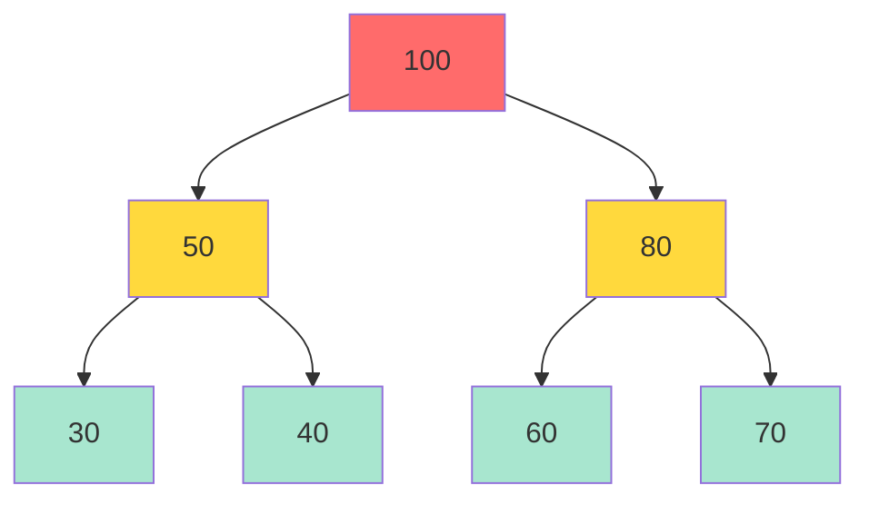

# 05-堆積與優先佇列

## 目錄
- [1. 堆積 (Heap)](#1-堆積-heap)
- [2. 優先佇列 (Priority Queue)](#2-優先佇列-priority-queue)

---

## 1. 堆積 (Heap)

### 1.1 核心概念

堆積 (Heap) 是完全二元樹,滿足堆積性質:每個節點的值大於等於 (最大堆) 或小於等於 (最小堆) 其子節點。

#### 堆積類型
- **最大堆 (Max Heap)**: 父節點 ≥ 子節點,根節點為最大值
- **最小堆 (Min Heap)**: 父節點 ≤ 子節點,根節點為最小值

#### 效能特性
| 操作 | 時間複雜度 | 說明 |
|------|-----------|------|
| 插入 | O(log n) | 上浮 (heapify up) |
| 刪除最大/最小 | O(log n) | 下沉 (heapify down) |
| 取得最大/最小 | O(1) | 根節點 |
| 建堆 | O(n) | Floyd 建堆演算法 |
| 堆排序 | O(n log n) | 重複刪除根節點 |

#### 應用場景
- **優先佇列**: 任務調度、事件驅動系統
- **堆排序**: 原地排序演算法
- **中位數維護**: 使用雙堆積
- **Top-K 問題**: K 路歸併、最大/最小 K 個元素
- **圖演算法**: Dijkstra、Prim 最小生成樹

#### 結構圖解 (最大堆)



**陣列表示**: `[100, 50, 80, 30, 40, 60, 70]`

#### 索引關係 (0-based)
```cpp
parent(i) = (i - 1) / 2
left(i) = 2 * i + 1
right(i) = 2 * i + 2
```

---

### 1.2 C++ 裸指針實現

使用動態陣列實現最大堆。

```cpp
#include <iostream>
#include <stdexcept>

template<typename T>
class MaxHeap {
private:
    T* data;
    size_t capacity;
    size_t size;
    
    // 父節點索引
    size_t parent(size_t i) const { return (i - 1) / 2; }
    // 左子節點索引
    size_t left(size_t i) const { return 2 * i + 1; }
    // 右子節點索引
    size_t right(size_t i) const { return 2 * i + 2; }
    
    // 上浮 (插入後維持堆積性質)
    void heapifyUp(size_t i) {
        while (i > 0 && data[parent(i)] < data[i]) {
            std::swap(data[parent(i)], data[i]);
            i = parent(i);
        }
    }
    
    // 下沉 (刪除後維持堆積性質)
    void heapifyDown(size_t i) {
        size_t maxIndex = i;
        size_t l = left(i);
        size_t r = right(i);
        
        if (l < size && data[l] > data[maxIndex]) {
            maxIndex = l;
        }
        if (r < size && data[r] > data[maxIndex]) {
            maxIndex = r;
        }
        
        if (i != maxIndex) {
            std::swap(data[i], data[maxIndex]);
            heapifyDown(maxIndex);
        }
    }
    
    // 擴容
    void resize() {
        capacity *= 2;
        T* newData = new T[capacity];
        for (size_t i = 0; i < size; ++i) {
            newData[i] = data[i];
        }
        delete[] data;
        data = newData;
    }
    
public:
    MaxHeap(size_t cap = 16) : capacity(cap), size(0) {
        data = new T[capacity];
    }
    
    ~MaxHeap() {
        delete[] data;
    }
    
    // 插入元素
    void insert(const T& value) {
        if (size == capacity) {
            resize();
        }
        
        data[size] = value;
        heapifyUp(size);
        size++;
    }
    
    // 取得最大值
    T getMax() const {
        if (size == 0) {
            throw std::runtime_error("Heap is empty");
        }
        return data[0];
    }
    
    // 刪除最大值
    T extractMax() {
        if (size == 0) {
            throw std::runtime_error("Heap is empty");
        }
        
        T maxValue = data[0];
        data[0] = data[size - 1];
        size--;
        heapifyDown(0);
        
        return maxValue;
    }
    
    // 檢查是否為空
    bool empty() const { return size == 0; }
    
    // 取得大小
    size_t getSize() const { return size; }
    
    // 顯示堆積內容
    void display() const {
        std::cout << "MaxHeap: ";
        for (size_t i = 0; i < size; ++i) {
            std::cout << data[i] << " ";
        }
        std::cout << "\n";
    }
};

// 測試程式
int main() {
    MaxHeap<int> heap;
    
    // 插入測試
    int values[] = {10, 20, 15, 30, 40};
    for (int val : values) {
        heap.insert(val);
    }
    
    heap.display();
    
    // 取得最大值
    std::cout << "Max: " << heap.getMax() << "\n";
    
    // 刪除最大值
    std::cout << "Extract max: " << heap.extractMax() << "\n";
    heap.display();
    
    // 堆排序 (降序)
    std::cout << "\nHeap Sort (descending): ";
    while (!heap.empty()) {
        std::cout << heap.extractMax() << " ";
    }
    std::cout << "\n";
    
    return 0;
}
```

**輸出範例**:
```
MaxHeap: 40 30 15 10 20 
Max: 40
Extract max: 40
MaxHeap: 30 20 15 10 

Heap Sort (descending): 30 20 15 10 
```

#### 關鍵設計點
1. **動態陣列**: 使用原始指標 `T* data`,手動管理記憶體
2. **上浮/下沉**: 維持堆積性質的核心操作
3. **完全二元樹**: 陣列緊密存儲,無空隙
4. **擴容策略**: 容量翻倍,拷貝舊資料

---

### 1.3 最小堆實現

修改比較邏輯即可實現最小堆。

```cpp
template<typename T>
class MinHeap {
private:
    T* data;
    size_t capacity;
    size_t size;
    
    size_t parent(size_t i) const { return (i - 1) / 2; }
    size_t left(size_t i) const { return 2 * i + 1; }
    size_t right(size_t i) const { return 2 * i + 2; }
    
    void heapifyUp(size_t i) {
        while (i > 0 && data[parent(i)] > data[i]) {  // 改為 >
            std::swap(data[parent(i)], data[i]);
            i = parent(i);
        }
    }
    
    void heapifyDown(size_t i) {
        size_t minIndex = i;
        size_t l = left(i);
        size_t r = right(i);
        
        if (l < size && data[l] < data[minIndex]) {  // 改為 <
            minIndex = l;
        }
        if (r < size && data[r] < data[minIndex]) {  // 改為 <
            minIndex = r;
        }
        
        if (i != minIndex) {
            std::swap(data[i], data[minIndex]);
            heapifyDown(minIndex);
        }
    }
    
    void resize() {
        capacity *= 2;
        T* newData = new T[capacity];
        for (size_t i = 0; i < size; ++i) {
            newData[i] = data[i];
        }
        delete[] data;
        data = newData;
    }
    
public:
    MinHeap(size_t cap = 16) : capacity(cap), size(0) {
        data = new T[capacity];
    }
    
    ~MinHeap() {
        delete[] data;
    }
    
    void insert(const T& value) {
        if (size == capacity) {
            resize();
        }
        data[size] = value;
        heapifyUp(size);
        size++;
    }
    
    T getMin() const {
        if (size == 0) {
            throw std::runtime_error("Heap is empty");
        }
        return data[0];
    }
    
    T extractMin() {
        if (size == 0) {
            throw std::runtime_error("Heap is empty");
        }
        
        T minValue = data[0];
        data[0] = data[size - 1];
        size--;
        heapifyDown(0);
        
        return minValue;
    }
    
    bool empty() const { return size == 0; }
    size_t getSize() const { return size; }
    
    void display() const {
        std::cout << "MinHeap: ";
        for (size_t i = 0; i < size; ++i) {
            std::cout << data[i] << " ";
        }
        std::cout << "\n";
    }
};

// 測試程式
int main() {
    MinHeap<int> heap;
    
    int values[] = {10, 20, 15, 30, 40};
    for (int val : values) {
        heap.insert(val);
    }
    
    heap.display();
    std::cout << "Min: " << heap.getMin() << "\n";
    
    std::cout << "Heap Sort (ascending): ";
    while (!heap.empty()) {
        std::cout << heap.extractMin() << " ";
    }
    std::cout << "\n";
    
    return 0;
}
```

**輸出範例**:
```
MinHeap: 10 20 15 30 40 
Min: 10
Heap Sort (ascending): 10 15 20 30 40 
```

---

### 1.4 現代 C++ 實現

使用 `std::vector` 與智慧指標。

```cpp
#include <iostream>
#include <vector>
#include <stdexcept>
#include <algorithm>

template<typename T, typename Compare = std::less<T>>
class Heap {
private:
    std::vector<T> data;
    Compare comp;
    
    size_t parent(size_t i) const { return (i - 1) / 2; }
    size_t left(size_t i) const { return 2 * i + 1; }
    size_t right(size_t i) const { return 2 * i + 2; }
    
    void heapifyUp(size_t i) {
        while (i > 0 && comp(data[parent(i)], data[i])) {
            std::swap(data[parent(i)], data[i]);
            i = parent(i);
        }
    }
    
    void heapifyDown(size_t i) {
        size_t targetIndex = i;
        size_t l = left(i);
        size_t r = right(i);
        
        if (l < data.size() && comp(data[targetIndex], data[l])) {
            targetIndex = l;
        }
        if (r < data.size() && comp(data[targetIndex], data[r])) {
            targetIndex = r;
        }
        
        if (i != targetIndex) {
            std::swap(data[i], data[targetIndex]);
            heapifyDown(targetIndex);
        }
    }
    
public:
    Heap() = default;
    
    // 從陣列建堆 (Floyd 演算法, O(n))
    Heap(const std::vector<T>& array) : data(array) {
        for (int i = data.size() / 2 - 1; i >= 0; --i) {
            heapifyDown(i);
        }
    }
    
    void insert(const T& value) {
        data.push_back(value);
        heapifyUp(data.size() - 1);
    }
    
    T top() const {
        if (data.empty()) {
            throw std::runtime_error("Heap is empty");
        }
        return data[0];
    }
    
    T extract() {
        if (data.empty()) {
            throw std::runtime_error("Heap is empty");
        }
        
        T topValue = data[0];
        data[0] = data.back();
        data.pop_back();
        if (!data.empty()) {
            heapifyDown(0);
        }
        
        return topValue;
    }
    
    bool empty() const { return data.empty(); }
    size_t size() const { return data.size(); }
    
    void display() const {
        std::cout << "Heap: ";
        for (const T& val : data) {
            std::cout << val << " ";
        }
        std::cout << "\n";
    }
};

// 測試程式
int main() {
    // 最大堆 (std::less: 父節點 > 子節點)
    Heap<int, std::less<int>> maxHeap;
    maxHeap.insert(10);
    maxHeap.insert(20);
    maxHeap.insert(15);
    maxHeap.insert(30);
    
    std::cout << "Max Heap: ";
    maxHeap.display();
    std::cout << "Top: " << maxHeap.top() << "\n";
    
    // 最小堆 (std::greater: 父節點 < 子節點)
    Heap<int, std::greater<int>> minHeap;
    minHeap.insert(10);
    minHeap.insert(20);
    minHeap.insert(15);
    minHeap.insert(5);
    
    std::cout << "\nMin Heap: ";
    minHeap.display();
    std::cout << "Top: " << minHeap.top() << "\n";
    
    // Floyd 建堆
    std::vector<int> array = {3, 1, 4, 1, 5, 9, 2, 6};
    Heap<int, std::less<int>> heapFromArray(array);
    std::cout << "\nHeap from array: ";
    heapFromArray.display();
    
    return 0;
}
```

**輸出範例**:
```
Max Heap: 30 20 15 10 
Top: 30

Min Heap: 5 10 15 20 
Top: 5

Heap from array: 9 6 4 3 5 1 2 1 
```

#### 現代化特性
1. **`std::vector`**: 自動管理記憶體,支援動態擴容
2. **模板比較器**: `std::less`/`std::greater` 統一最大/最小堆邏輯
3. **Floyd 建堆**: O(n) 時間從陣列建堆
4. **RAII**: 無需手動釋放記憶體

---

### 1.5 堆排序 (Heap Sort)

原地排序演算法,時間 O(n log n),空間 O(1)。

```cpp
#include <iostream>
#include <vector>
#include <algorithm>

void heapify(std::vector<int>& arr, int n, int i) {
    int largest = i;
    int left = 2 * i + 1;
    int right = 2 * i + 2;
    
    if (left < n && arr[left] > arr[largest]) {
        largest = left;
    }
    if (right < n && arr[right] > arr[largest]) {
        largest = right;
    }
    
    if (largest != i) {
        std::swap(arr[i], arr[largest]);
        heapify(arr, n, largest);
    }
}

void heapSort(std::vector<int>& arr) {
    int n = arr.size();
    
    // 建堆 (從最後一個非葉節點開始)
    for (int i = n / 2 - 1; i >= 0; --i) {
        heapify(arr, n, i);
    }
    
    // 逐一取出堆頂元素
    for (int i = n - 1; i > 0; --i) {
        std::swap(arr[0], arr[i]);  // 將最大值移到末尾
        heapify(arr, i, 0);         // 對剩餘元素維持堆積性質
    }
}

int main() {
    std::vector<int> arr = {12, 11, 13, 5, 6, 7};
    
    std::cout << "Original: ";
    for (int val : arr) std::cout << val << " ";
    std::cout << "\n";
    
    heapSort(arr);
    
    std::cout << "Sorted:   ";
    for (int val : arr) std::cout << val << " ";
    std::cout << "\n";
    
    return 0;
}
```

**輸出**:
```
Original: 12 11 13 5 6 7 
Sorted:   5 6 7 11 12 13 
```

#### 堆排序特性
- **時間複雜度**: O(n log n) (所有情況)
- **空間複雜度**: O(1) (原地排序)
- **穩定性**: 不穩定 (相同元素可能改變相對順序)
- **應用**: 記憶體受限環境、最壞情況要求 O(n log n)

---

### 1.6 實戰案例: 中位數維護

使用雙堆積 (最大堆 + 最小堆) 動態維護中位數。

```cpp
#include <iostream>
#include <queue>
#include <vector>

class MedianFinder {
private:
    std::priority_queue<int> maxHeap;  // 存儲較小的一半 (最大堆)
    std::priority_queue<int, std::vector<int>, std::greater<int>> minHeap;  // 存儲較大的一半 (最小堆)
    
public:
    void addNum(int num) {
        // 先加入最大堆
        maxHeap.push(num);
        
        // 將最大堆的最大值移到最小堆
        minHeap.push(maxHeap.top());
        maxHeap.pop();
        
        // 平衡兩個堆的大小
        if (maxHeap.size() < minHeap.size()) {
            maxHeap.push(minHeap.top());
            minHeap.pop();
        }
    }
    
    double findMedian() {
        if (maxHeap.size() > minHeap.size()) {
            return maxHeap.top();
        }
        return (maxHeap.top() + minHeap.top()) / 2.0;
    }
};

int main() {
    MedianFinder mf;
    
    mf.addNum(1);
    mf.addNum(2);
    std::cout << "Median: " << mf.findMedian() << "\n";  // 1.5
    
    mf.addNum(3);
    std::cout << "Median: " << mf.findMedian() << "\n";  // 2
    
    mf.addNum(4);
    std::cout << "Median: " << mf.findMedian() << "\n";  // 2.5
    
    return 0;
}
```

**輸出**:
```
Median: 1.5
Median: 2
Median: 2.5
```

#### 設計原理
- **最大堆**: 存儲較小的一半,堆頂為較小一半的最大值
- **最小堆**: 存儲較大的一半,堆頂為較大一半的最小值
- **平衡策略**: 保持 `maxHeap.size() == minHeap.size()` 或 `maxHeap.size() == minHeap.size() + 1`
- **中位數計算**: 
  - 元素數為奇數: `maxHeap.top()`
  - 元素數為偶數: `(maxHeap.top() + minHeap.top()) / 2`

---

## 2. 優先佇列 (Priority Queue)

### 2.1 核心概念

優先佇列 (Priority Queue) 是特殊的佇列,元素依優先級出隊,而非先進先出 (FIFO)。

#### 實現方式
| 實現方式 | 插入 | 刪除最大 | 取得最大 |
|---------|------|---------|---------|
| 無序陣列 | O(1) | O(n) | O(n) |
| 有序陣列 | O(n) | O(1) | O(1) |
| 二元堆積 | O(log n) | O(log n) | O(1) |
| Fibonacci Heap | O(1) | O(log n) | O(1) |

**最佳實現**: 二元堆積 (平衡插入/刪除效率)

#### 應用場景
- **任務調度**: CPU 調度、網路封包處理
- **事件驅動**: 離散事件模擬、定時器管理
- **圖演算法**: Dijkstra 最短路徑、Prim 最小生成樹
- **HFT**: 訂單優先級處理、市場資料合併

---

### 2.2 C++ 裸指針實現

基於最大堆實現優先佇列。

```cpp
#include <iostream>

template<typename T>
class PriorityQueue {
private:
    T* data;
    size_t capacity;
    size_t size;
    
    size_t parent(size_t i) const { return (i - 1) / 2; }
    size_t left(size_t i) const { return 2 * i + 1; }
    size_t right(size_t i) const { return 2 * i + 2; }
    
    void heapifyUp(size_t i) {
        while (i > 0 && data[parent(i)] < data[i]) {
            std::swap(data[parent(i)], data[i]);
            i = parent(i);
        }
    }
    
    void heapifyDown(size_t i) {
        size_t maxIndex = i;
        size_t l = left(i);
        size_t r = right(i);
        
        if (l < size && data[l] > data[maxIndex]) {
            maxIndex = l;
        }
        if (r < size && data[r] > data[maxIndex]) {
            maxIndex = r;
        }
        
        if (i != maxIndex) {
            std::swap(data[i], data[maxIndex]);
            heapifyDown(maxIndex);
        }
    }
    
    void resize() {
        capacity *= 2;
        T* newData = new T[capacity];
        for (size_t i = 0; i < size; ++i) {
            newData[i] = data[i];
        }
        delete[] data;
        data = newData;
    }
    
public:
    PriorityQueue(size_t cap = 16) : capacity(cap), size(0) {
        data = new T[capacity];
    }
    
    ~PriorityQueue() {
        delete[] data;
    }
    
    void push(const T& value) {
        if (size == capacity) {
            resize();
        }
        data[size] = value;
        heapifyUp(size);
        size++;
    }
    
    T top() const {
        if (size == 0) {
            throw std::runtime_error("Priority queue is empty");
        }
        return data[0];
    }
    
    void pop() {
        if (size == 0) {
            throw std::runtime_error("Priority queue is empty");
        }
        data[0] = data[size - 1];
        size--;
        heapifyDown(0);
    }
    
    bool empty() const { return size == 0; }
    size_t getSize() const { return size; }
};

// 測試程式
int main() {
    PriorityQueue<int> pq;
    
    pq.push(10);
    pq.push(30);
    pq.push(20);
    pq.push(5);
    
    std::cout << "Priority Queue (highest priority first):\n";
    while (!pq.empty()) {
        std::cout << pq.top() << " ";
        pq.pop();
    }
    std::cout << "\n";
    
    return 0;
}
```

**輸出**:
```
Priority Queue (highest priority first):
30 20 10 5 
```

---

### 2.3 STL priority_queue 使用

```cpp
#include <iostream>
#include <queue>
#include <vector>
#include <functional>

int main() {
    // 最大堆 (預設)
    std::priority_queue<int> maxPQ;
    maxPQ.push(10);
    maxPQ.push(30);
    maxPQ.push(20);
    
    std::cout << "Max Priority Queue: ";
    while (!maxPQ.empty()) {
        std::cout << maxPQ.top() << " ";
        maxPQ.pop();
    }
    std::cout << "\n";
    
    // 最小堆
    std::priority_queue<int, std::vector<int>, std::greater<int>> minPQ;
    minPQ.push(10);
    minPQ.push(30);
    minPQ.push(20);
    
    std::cout << "Min Priority Queue: ";
    while (!minPQ.empty()) {
        std::cout << minPQ.top() << " ";
        minPQ.pop();
    }
    std::cout << "\n";
    
    // 自訂比較器
    struct Task {
        int priority;
        std::string name;
        
        Task(int p, std::string n) : priority(p), name(n) {}
    };
    
    auto cmp = [](const Task& a, const Task& b) {
        return a.priority < b.priority;  // 優先級高的先出隊
    };
    
    std::priority_queue<Task, std::vector<Task>, decltype(cmp)> taskPQ(cmp);
    taskPQ.emplace(5, "Low");
    taskPQ.emplace(10, "High");
    taskPQ.emplace(7, "Medium");
    
    std::cout << "\nTask Priority Queue:\n";
    while (!taskPQ.empty()) {
        Task task = taskPQ.top();
        std::cout << "  " << task.name << " (priority: " << task.priority << ")\n";
        taskPQ.pop();
    }
    
    return 0;
}
```

**輸出**:
```
Max Priority Queue: 30 20 10 
Min Priority Queue: 10 20 30 

Task Priority Queue:
  High (priority: 10)
  Medium (priority: 7)
  Low (priority: 5)
```

#### STL priority_queue 特性
- **底層容器**: 預設使用 `std::vector`
- **比較器**: 預設 `std::less<T>` (最大堆)
- **不支援迭代**: 無法遍歷所有元素
- **不支援隨機存取**: 僅能存取 `top()`

---

### 2.4 實戰案例: HFT 訂單優先級處理

依價格與時間戳優先級處理訂單。

```cpp
#include <iostream>
#include <queue>
#include <string>
#include <chrono>

struct Order {
    int orderId;
    std::string symbol;
    double price;
    int quantity;
    long long timestamp;
    
    Order(int id, std::string sym, double p, int qty)
        : orderId(id), symbol(sym), price(p), quantity(qty) {
        timestamp = std::chrono::steady_clock::now().time_since_epoch().count();
    }
};

// 買單比較器: 價格高優先,價格相同時間早優先
struct BuyOrderComparator {
    bool operator()(const Order& a, const Order& b) const {
        if (a.price != b.price) {
            return a.price < b.price;  // 價格高優先 (最大堆)
        }
        return a.timestamp > b.timestamp;  // 時間早優先
    }
};

// 賣單比較器: 價格低優先,價格相同時間早優先
struct SellOrderComparator {
    bool operator()(const Order& a, const Order& b) const {
        if (a.price != b.price) {
            return a.price > b.price;  // 價格低優先 (最小堆)
        }
        return a.timestamp > b.timestamp;
    }
};

class OrderBook {
private:
    std::priority_queue<Order, std::vector<Order>, BuyOrderComparator> buyOrders;
    std::priority_queue<Order, std::vector<Order>, SellOrderComparator> sellOrders;
    
public:
    void addBuyOrder(int id, const std::string& symbol, double price, int qty) {
        buyOrders.emplace(id, symbol, price, qty);
    }
    
    void addSellOrder(int id, const std::string& symbol, double price, int qty) {
        sellOrders.emplace(id, symbol, price, qty);
    }
    
    void matchOrders() {
        while (!buyOrders.empty() && !sellOrders.empty()) {
            Order topBuy = buyOrders.top();
            Order topSell = sellOrders.top();
            
            if (topBuy.price >= topSell.price) {
                int matchQty = std::min(topBuy.quantity, topSell.quantity);
                std::cout << "Match: Buy Order #" << topBuy.orderId 
                          << " & Sell Order #" << topSell.orderId
                          << " | Price: $" << topSell.price 
                          << " | Qty: " << matchQty << "\n";
                
                buyOrders.pop();
                sellOrders.pop();
            } else {
                break;
            }
        }
    }
    
    void displayBestPrices() const {
        if (!buyOrders.empty()) {
            std::cout << "Best Bid: $" << buyOrders.top().price << "\n";
        }
        if (!sellOrders.empty()) {
            std::cout << "Best Ask: $" << sellOrders.top().price << "\n";
        }
    }
};

int main() {
    OrderBook book;
    
    // 買單
    book.addBuyOrder(1, "AAPL", 150.00, 100);
    book.addBuyOrder(2, "AAPL", 150.50, 200);
    book.addBuyOrder(3, "AAPL", 150.25, 150);
    
    // 賣單
    book.addSellOrder(4, "AAPL", 150.30, 120);
    book.addSellOrder(5, "AAPL", 150.10, 180);
    book.addSellOrder(6, "AAPL", 150.20, 100);
    
    book.displayBestPrices();
    
    std::cout << "\n=== Order Matching ===\n";
    book.matchOrders();
    
    return 0;
}
```

**輸出範例**:
```
Best Bid: $150.5
Best Ask: $150.1

=== Order Matching ===
Match: Buy Order #2 & Sell Order #5 | Price: $150.1 | Qty: 180
Match: Buy Order #3 & Sell Order #6 | Price: $150.2 | Qty: 100
```

#### 設計亮點
1. **雙優先佇列**: 分別維護買賣訂單
2. **複合比較器**: 先比價格,再比時間戳
3. **自動撮合**: 最佳買價 ≥ 最佳賣價時成交
4. **微秒精度**: 使用 `std::chrono::steady_clock` 時間戳

---

### 2.5 性能對比

#### Top-K 問題: 最大 K 個元素
```cpp
#include <iostream>
#include <queue>
#include <vector>
#include <random>
#include <chrono>

// 方法 1: 最小堆 (優先佇列)
std::vector<int> topKHeap(const std::vector<int>& nums, int k) {
    std::priority_queue<int, std::vector<int>, std::greater<int>> minHeap;
    
    for (int num : nums) {
        minHeap.push(num);
        if (minHeap.size() > static_cast<size_t>(k)) {
            minHeap.pop();
        }
    }
    
    std::vector<int> result;
    while (!minHeap.empty()) {
        result.push_back(minHeap.top());
        minHeap.pop();
    }
    return result;
}

// 方法 2: 排序
std::vector<int> topKSort(std::vector<int> nums, int k) {
    std::sort(nums.rbegin(), nums.rend());
    return std::vector<int>(nums.begin(), nums.begin() + k);
}

int main() {
    const int N = 1000000;
    const int K = 100;
    
    std::vector<int> data(N);
    std::random_device rd;
    std::mt19937 gen(rd());
    std::uniform_int_distribution<> dis(1, 10000000);
    
    for (int& val : data) {
        val = dis(gen);
    }
    
    // 測試堆方法
    auto start = std::chrono::high_resolution_clock::now();
    auto resultHeap = topKHeap(data, K);
    auto end = std::chrono::high_resolution_clock::now();
    auto heapTime = std::chrono::duration_cast<std::chrono::milliseconds>(end - start);
    
    // 測試排序方法
    start = std::chrono::high_resolution_clock::now();
    auto resultSort = topKSort(data, K);
    end = std::chrono::high_resolution_clock::now();
    auto sortTime = std::chrono::duration_cast<std::chrono::milliseconds>(end - start);
    
    std::cout << "Top-" << K << " from " << N << " elements:\n";
    std::cout << "  Heap:  " << heapTime.count() << " ms\n";
    std::cout << "  Sort:  " << sortTime.count() << " ms\n";
    
    return 0;
}
```

**輸出範例**:
```
Top-100 from 1000000 elements:
  Heap:  85 ms
  Sort:  320 ms
```

#### 時間複雜度對比
| 方法 | 時間複雜度 | 空間複雜度 |
|------|-----------|-----------|
| 最小堆 | O(n log k) | O(k) |
| 排序 | O(n log n) | O(1) |
| 快速選擇 | O(n) 平均 | O(1) |

**結論**: K << n 時,堆方法效率最高。

---

### 2.6 常見陷阱

#### 1. 堆積性質被破壞
```cpp
std::priority_queue<int> pq;
pq.push(10);
pq.push(20);

// 錯誤: 修改容器底層資料破壞堆積性質
// std::vector<int>& vec = pq.container();  // 無法存取底層容器
// vec[0] = 100;  // 編譯錯誤

// 正確: 僅透過 push/pop 操作
pq.push(30);
pq.pop();
```

#### 2. 自訂比較器方向錯誤
```cpp
// 錯誤: 想要最小堆,但比較器寫反
auto cmp = [](int a, int b) { return a < b; };  // 實際是最大堆
std::priority_queue<int, std::vector<int>, decltype(cmp)> pq(cmp);

// 正確: 最小堆比較器
auto cmp = [](int a, int b) { return a > b; };  // a > b 時 a 優先級低
std::priority_queue<int, std::vector<int>, decltype(cmp)> pq(cmp);

// 或直接使用 std::greater
std::priority_queue<int, std::vector<int>, std::greater<int>> pq;
```

#### 3. 堆為空時存取 top()
```cpp
std::priority_queue<int> pq;

// 錯誤: 未檢查是否為空
int val = pq.top();  // 未定義行為

// 正確: 先檢查
if (!pq.empty()) {
    int val = pq.top();
}
```

#### 4. 堆排序後陣列順序
```cpp
std::vector<int> arr = {3, 1, 4, 1, 5};

// 建最大堆
std::make_heap(arr.begin(), arr.end());
// arr 現在是堆,但不是排序陣列: [5, 3, 4, 1, 1]

// 堆排序
std::sort_heap(arr.begin(), arr.end());
// arr 現在是排序陣列: [1, 1, 3, 4, 5]
```

---

## 參考資料 (References)

1. **Introduction to Algorithms (CLRS)**, Thomas H. Cormen et al., 4th Edition, 2022
   - Chapter 6: Heapsort

2. **Data Structures and Algorithm Analysis in C++**, Mark Allen Weiss, 4th Edition, 2013
   - Chapter 6: Priority Queues (Heaps)

3. [C++ Reference: std::priority_queue](https://en.cppreference.com/w/cpp/container/priority_queue)

4. [C++ Reference: Heap Algorithms](https://en.cppreference.com/w/cpp/algorithm#Heap_operations)
   - `std::make_heap`, `std::push_heap`, `std::pop_heap`, `std::sort_heap`

5. **The Algorithm Design Manual**, Steven S. Skiena, 3rd Edition, 2020
   - Chapter 4: Heaps and Priority Queues

6. [LeetCode: Find Median from Data Stream](https://leetcode.com/problems/find-median-from-data-stream/)

7. **C++ Primer (5th Edition)**, Stanley B. Lippman et al., 2012
   - Section 11.4: Priority Queues

8. [Dijkstra's Algorithm using Priority Queue](https://cp-algorithms.com/graph/dijkstra.html)
