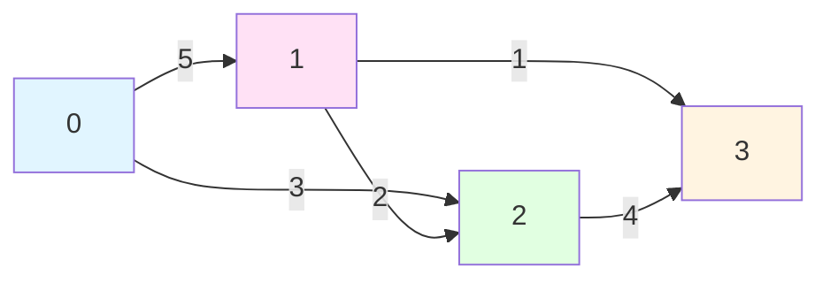
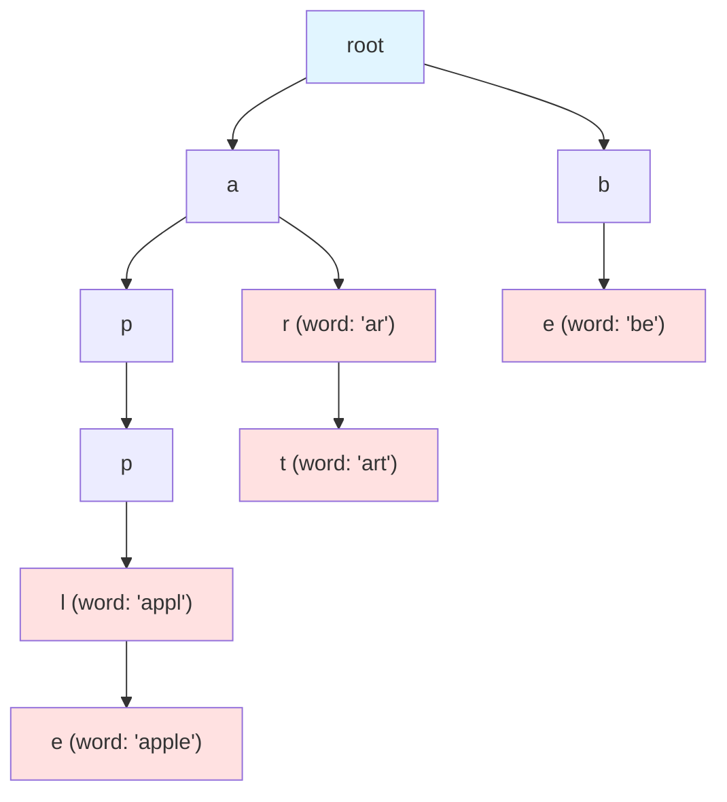
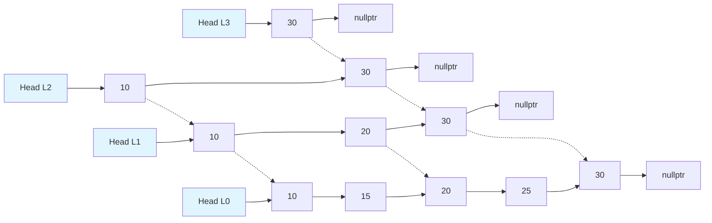

# 06-圖與高級結構

## 目錄
- [1. 圖 (Graph)](#1-圖-graph)
- [2. 字典樹 (Trie)](#2-字典樹-trie)
- [3. 跳表 (Skip List)](#3-跳表-skip-list)
- [4. 並查集 (Disjoint Set / Union-Find)](#4-並查集-disjoint-set--union-find)

---

## 1. 圖 (Graph)

### 1.1 核心概念

圖 (Graph) 由頂點 (Vertex) 和邊 (Edge) 組成,用於表示節點間的關係。

#### 圖的分類
- **有向圖 (Directed Graph)**: 邊有方向,A → B ≠ B → A
- **無向圖 (Undirected Graph)**: 邊無方向,A - B = B - A
- **加權圖 (Weighted Graph)**: 邊帶權重 (如距離、成本)
- **連通圖 (Connected Graph)**: 任意兩頂點間存在路徑

#### 效能特性
| 表示方式 | 空間複雜度 | 查邊 | 遍歷所有邊 | 適用場景 |
|---------|-----------|------|-----------|---------|
| 鄰接矩陣 | O(V²) | O(1) | O(V²) | 稠密圖 |
| 鄰接表 | O(V + E) | O(degree) | O(V + E) | 稀疏圖 |

**符號說明**: V = 頂點數, E = 邊數

#### 應用場景
- **社交網路**: 好友關係、推薦系統
- **地圖導航**: 最短路徑 (Dijkstra, A*)
- **網路拓撲**: 路由器連接、網路流
- **金融系統**: 交易網路、風險傳播分析
- **依賴解析**: 套件管理、編譯順序

#### 結構圖解



---

### 1.2 鄰接表實現 (C++ 裸指針)

```cpp
#include <iostream>
#include <vector>

// 邊節點
struct Edge {
    int dest;      // 目標頂點
    int weight;    // 權重
    Edge* next;    // 下一條邊
    
    Edge(int d, int w) : dest(d), weight(w), next(nullptr) {}
};

// 鄰接表圖
class Graph {
private:
    int numVertices;
    Edge** adjList;  // 鄰接表陣列
    
public:
    Graph(int vertices) : numVertices(vertices) {
        adjList = new Edge*[numVertices];
        for (int i = 0; i < numVertices; ++i) {
            adjList[i] = nullptr;
        }
    }
    
    ~Graph() {
        for (int i = 0; i < numVertices; ++i) {
            Edge* current = adjList[i];
            while (current) {
                Edge* temp = current;
                current = current->next;
                delete temp;
            }
        }
        delete[] adjList;
    }
    
    // 新增有向邊
    void addEdge(int src, int dest, int weight = 1) {
        Edge* newEdge = new Edge(dest, weight);
        newEdge->next = adjList[src];
        adjList[src] = newEdge;
    }
    
    // 新增無向邊
    void addUndirectedEdge(int v1, int v2, int weight = 1) {
        addEdge(v1, v2, weight);
        addEdge(v2, v1, weight);
    }
    
    // 深度優先搜尋 (DFS)
    void DFS(int vertex, bool* visited) {
        visited[vertex] = true;
        std::cout << vertex << " ";
        
        Edge* current = adjList[vertex];
        while (current) {
            if (!visited[current->dest]) {
                DFS(current->dest, visited);
            }
            current = current->next;
        }
    }
    
    void DFS(int startVertex) {
        bool* visited = new bool[numVertices]();
        DFS(startVertex, visited);
        std::cout << "\n";
        delete[] visited;
    }
    
    // 廣度優先搜尋 (BFS)
    void BFS(int startVertex) {
        bool* visited = new bool[numVertices]();
        int* queue = new int[numVertices];
        int front = 0, rear = 0;
        
        visited[startVertex] = true;
        queue[rear++] = startVertex;
        
        while (front < rear) {
            int vertex = queue[front++];
            std::cout << vertex << " ";
            
            Edge* current = adjList[vertex];
            while (current) {
                if (!visited[current->dest]) {
                    visited[current->dest] = true;
                    queue[rear++] = current->dest;
                }
                current = current->next;
            }
        }
        
        std::cout << "\n";
        delete[] visited;
        delete[] queue;
    }
    
    // 顯示圖
    void display() {
        for (int i = 0; i < numVertices; ++i) {
            std::cout << "Vertex " << i << ": ";
            Edge* current = adjList[i];
            while (current) {
                std::cout << "-> " << current->dest << "(" << current->weight << ") ";
                current = current->next;
            }
            std::cout << "\n";
        }
    }
};

// 測試程式
int main() {
    Graph g(4);
    
    g.addEdge(0, 1, 5);
    g.addEdge(0, 2, 3);
    g.addEdge(1, 2, 2);
    g.addEdge(1, 3, 1);
    g.addEdge(2, 3, 4);
    
    std::cout << "Graph Adjacency List:\n";
    g.display();
    
    std::cout << "\nDFS from vertex 0: ";
    g.DFS(0);
    
    std::cout << "BFS from vertex 0: ";
    g.BFS(0);
    
    return 0;
}
```

**輸出範例**:
```
Graph Adjacency List:
Vertex 0: -> 2(3) -> 1(5) 
Vertex 1: -> 3(1) -> 2(2) 
Vertex 2: -> 3(4) 
Vertex 3: 

DFS from vertex 0: 0 2 3 1 
BFS from vertex 0: 0 2 1 3 
```

#### 關鍵設計點
1. **鄰接表陣列**: `Edge** adjList` 儲存每個頂點的邊鏈結
2. **頭插法**: 新邊插入鏈結頭部 (O(1))
3. **DFS 遞迴**: 使用 `visited` 陣列避免重複訪問
4. **BFS 佇列**: 手動實現佇列 (陣列 + 雙指標)

---

### 1.3 現代 C++ 實現

使用 `std::vector` 與 STL 容器。

```cpp
#include <iostream>
#include <vector>
#include <queue>
#include <unordered_set>

struct Edge {
    int dest;
    int weight;
    
    Edge(int d, int w) : dest(d), weight(w) {}
};

class Graph {
private:
    int numVertices;
    std::vector<std::vector<Edge>> adjList;
    
public:
    Graph(int vertices) : numVertices(vertices) {
        adjList.resize(vertices);
    }
    
    void addEdge(int src, int dest, int weight = 1) {
        adjList[src].emplace_back(dest, weight);
    }
    
    void addUndirectedEdge(int v1, int v2, int weight = 1) {
        adjList[v1].emplace_back(v2, weight);
        adjList[v2].emplace_back(v1, weight);
    }
    
    // DFS 遞迴
    void DFSUtil(int vertex, std::unordered_set<int>& visited) {
        visited.insert(vertex);
        std::cout << vertex << " ";
        
        for (const auto& edge : adjList[vertex]) {
            if (visited.find(edge.dest) == visited.end()) {
                DFSUtil(edge.dest, visited);
            }
        }
    }
    
    void DFS(int startVertex) {
        std::unordered_set<int> visited;
        DFSUtil(startVertex, visited);
        std::cout << "\n";
    }
    
    // BFS
    void BFS(int startVertex) {
        std::unordered_set<int> visited;
        std::queue<int> q;
        
        visited.insert(startVertex);
        q.push(startVertex);
        
        while (!q.empty()) {
            int vertex = q.front();
            q.pop();
            std::cout << vertex << " ";
            
            for (const auto& edge : adjList[vertex]) {
                if (visited.find(edge.dest) == visited.end()) {
                    visited.insert(edge.dest);
                    q.push(edge.dest);
                }
            }
        }
        std::cout << "\n";
    }
    
    void display() {
        for (int i = 0; i < numVertices; ++i) {
            std::cout << "Vertex " << i << ": ";
            for (const auto& edge : adjList[i]) {
                std::cout << "-> " << edge.dest << "(" << edge.weight << ") ";
            }
            std::cout << "\n";
        }
    }
};

// 測試程式
int main() {
    Graph g(4);
    
    g.addEdge(0, 1, 5);
    g.addEdge(0, 2, 3);
    g.addEdge(1, 2, 2);
    g.addEdge(1, 3, 1);
    g.addEdge(2, 3, 4);
    
    std::cout << "Graph Adjacency List:\n";
    g.display();
    
    std::cout << "\nDFS from vertex 0: ";
    g.DFS(0);
    
    std::cout << "BFS from vertex 0: ";
    g.BFS(0);
    
    return 0;
}
```

#### 現代化特性
1. **`std::vector<std::vector<Edge>>`**: 動態鄰接表,自動管理記憶體
2. **`std::unordered_set`**: 高效查找已訪問節點
3. **`std::queue`**: STL 佇列實現 BFS
4. **Range-based for**: 簡潔遍歷邊

---

### 1.4 實戰案例: Dijkstra 最短路徑

使用優先佇列優化的 Dijkstra 演算法。

```cpp
#include <iostream>
#include <vector>
#include <queue>
#include <limits>

struct Edge {
    int dest;
    int weight;
    Edge(int d, int w) : dest(d), weight(w) {}
};

class Graph {
private:
    int numVertices;
    std::vector<std::vector<Edge>> adjList;
    
public:
    Graph(int vertices) : numVertices(vertices) {
        adjList.resize(vertices);
    }
    
    void addEdge(int src, int dest, int weight) {
        adjList[src].emplace_back(dest, weight);
    }
    
    void addUndirectedEdge(int v1, int v2, int weight) {
        adjList[v1].emplace_back(v2, weight);
        adjList[v2].emplace_back(v1, weight);
    }
    
    // Dijkstra 最短路徑
    std::vector<int> dijkstra(int source) {
        const int INF = std::numeric_limits<int>::max();
        std::vector<int> dist(numVertices, INF);
        std::vector<bool> visited(numVertices, false);
        
        // 優先佇列: (距離, 頂點)
        using Pair = std::pair<int, int>;
        std::priority_queue<Pair, std::vector<Pair>, std::greater<Pair>> pq;
        
        dist[source] = 0;
        pq.emplace(0, source);
        
        while (!pq.empty()) {
            auto [d, u] = pq.top();
            pq.pop();
            
            if (visited[u]) continue;
            visited[u] = true;
            
            for (const auto& edge : adjList[u]) {
                int v = edge.dest;
                int weight = edge.weight;
                
                if (!visited[v] && dist[u] + weight < dist[v]) {
                    dist[v] = dist[u] + weight;
                    pq.emplace(dist[v], v);
                }
            }
        }
        
        return dist;
    }
};

int main() {
    Graph g(5);
    
    g.addUndirectedEdge(0, 1, 4);
    g.addUndirectedEdge(0, 2, 1);
    g.addUndirectedEdge(2, 1, 2);
    g.addUndirectedEdge(1, 3, 1);
    g.addUndirectedEdge(2, 3, 5);
    g.addUndirectedEdge(3, 4, 3);
    
    int source = 0;
    auto distances = g.dijkstra(source);
    
    std::cout << "Shortest distances from vertex " << source << ":\n";
    for (int i = 0; i < distances.size(); ++i) {
        std::cout << "  To vertex " << i << ": " << distances[i] << "\n";
    }
    
    return 0;
}
```

**輸出**:
```
Shortest distances from vertex 0:
  To vertex 0: 0
  To vertex 1: 3
  To vertex 2: 1
  To vertex 3: 4
  To vertex 4: 7
```

#### Dijkstra 時間複雜度
- **優先佇列版本**: O((V + E) log V)
- **簡單版本**: O(V²)
- **適用**: 非負權重圖

---

## 2. 字典樹 (Trie)

### 2.1 核心概念

字典樹 (Trie, Prefix Tree) 是樹狀結構,用於高效儲存與檢索字串集合。

#### 效能特性
| 操作 | 時間複雜度 | 說明 |
|------|-----------|------|
| 插入 | O(m) | m 為字串長度 |
| 搜尋 | O(m) | m 為字串長度 |
| 前綴搜尋 | O(m) | 找到前綴後遍歷子樹 |
| 刪除 | O(m) | 需遞迴清理空節點 |
| 空間 | O(ALPHABET_SIZE * N * M) | N 為字串數,M 為平均長度 |

#### 應用場景
- **自動完成**: 搜尋引擎、IDE 程式碼補全
- **拼寫檢查**: 字典查詢、拼寫建議
- **IP 路由**: 最長前綴匹配
- **金融系統**: 交易代碼快速查找、交易所符號匹配

#### 結構圖解



**儲存的字串**: "appl", "apple", "ar", "art", "be"

---

### 2.2 C++ 裸指針實現

```cpp
#include <iostream>
#include <string>
#include <vector>

const int ALPHABET_SIZE = 26;

struct TrieNode {
    TrieNode* children[ALPHABET_SIZE];
    bool isEndOfWord;
    
    TrieNode() : isEndOfWord(false) {
        for (int i = 0; i < ALPHABET_SIZE; ++i) {
            children[i] = nullptr;
        }
    }
};

class Trie {
private:
    TrieNode* root;
    
    // 遞迴刪除節點
    void destroyTrie(TrieNode* node) {
        if (!node) return;
        
        for (int i = 0; i < ALPHABET_SIZE; ++i) {
            if (node->children[i]) {
                destroyTrie(node->children[i]);
            }
        }
        delete node;
    }
    
    // 遞迴收集以某前綴開始的所有字串
    void collectWords(TrieNode* node, std::string prefix, std::vector<std::string>& results) {
        if (!node) return;
        
        if (node->isEndOfWord) {
            results.push_back(prefix);
        }
        
        for (int i = 0; i < ALPHABET_SIZE; ++i) {
            if (node->children[i]) {
                collectWords(node->children[i], prefix + char('a' + i), results);
            }
        }
    }
    
public:
    Trie() {
        root = new TrieNode();
    }
    
    ~Trie() {
        destroyTrie(root);
    }
    
    // 插入字串
    void insert(const std::string& word) {
        TrieNode* node = root;
        
        for (char c : word) {
            int index = c - 'a';
            if (!node->children[index]) {
                node->children[index] = new TrieNode();
            }
            node = node->children[index];
        }
        
        node->isEndOfWord = true;
    }
    
    // 搜尋完整字串
    bool search(const std::string& word) {
        TrieNode* node = root;
        
        for (char c : word) {
            int index = c - 'a';
            if (!node->children[index]) {
                return false;
            }
            node = node->children[index];
        }
        
        return node->isEndOfWord;
    }
    
    // 搜尋前綴
    bool startsWith(const std::string& prefix) {
        TrieNode* node = root;
        
        for (char c : prefix) {
            int index = c - 'a';
            if (!node->children[index]) {
                return false;
            }
            node = node->children[index];
        }
        
        return true;
    }
    
    // 自動完成 (返回所有以 prefix 開始的字串)
    std::vector<std::string> autoComplete(const std::string& prefix) {
        std::vector<std::string> results;
        TrieNode* node = root;
        
        // 移動到前綴末尾
        for (char c : prefix) {
            int index = c - 'a';
            if (!node->children[index]) {
                return results;  // 前綴不存在
            }
            node = node->children[index];
        }
        
        // 收集所有後綴
        collectWords(node, prefix, results);
        return results;
    }
};

// 測試程式
int main() {
    Trie trie;
    
    // 插入字串
    std::vector<std::string> words = {"apple", "app", "application", "apply", "banana", "band"};
    for (const auto& word : words) {
        trie.insert(word);
    }
    
    // 搜尋測試
    std::cout << "Search 'apple': " << (trie.search("apple") ? "Found" : "Not found") << "\n";
    std::cout << "Search 'app': " << (trie.search("app") ? "Found" : "Not found") << "\n";
    std::cout << "Search 'appl': " << (trie.search("appl") ? "Found" : "Not found") << "\n";
    
    // 前綴測試
    std::cout << "\nStarts with 'app': " << (trie.startsWith("app") ? "Yes" : "No") << "\n";
    std::cout << "Starts with 'ban': " << (trie.startsWith("ban") ? "Yes" : "No") << "\n";
    
    // 自動完成
    std::cout << "\nAuto-complete 'app':\n";
    auto suggestions = trie.autoComplete("app");
    for (const auto& word : suggestions) {
        std::cout << "  " << word << "\n";
    }
    
    std::cout << "\nAuto-complete 'ban':\n";
    suggestions = trie.autoComplete("ban");
    for (const auto& word : suggestions) {
        std::cout << "  " << word << "\n";
    }
    
    return 0;
}
```

**輸出**:
```
Search 'apple': Found
Search 'app': Found
Search 'appl': Not found

Starts with 'app': Yes
Starts with 'ban': Yes

Auto-complete 'app':
  app
  apple
  application
  apply

Auto-complete 'ban':
  banana
  band
```

#### 關鍵設計點
1. **固定大小陣列**: `children[ALPHABET_SIZE]` 儲存子節點
2. **字串結束標記**: `isEndOfWord` 區分前綴與完整字串
3. **遞迴收集**: DFS 遍歷子樹收集所有字串
4. **記憶體管理**: 遞迴釋放所有節點

---

### 2.3 現代 C++ 實現

使用 `std::unordered_map` 動態儲存子節點。

```cpp
#include <iostream>
#include <string>
#include <memory>
#include <unordered_map>
#include <vector>

struct TrieNode {
    std::unordered_map<char, std::unique_ptr<TrieNode>> children;
    bool isEndOfWord;
    
    TrieNode() : isEndOfWord(false) {}
};

class Trie {
private:
    std::unique_ptr<TrieNode> root;
    
    void collectWords(TrieNode* node, const std::string& prefix, std::vector<std::string>& results) {
        if (!node) return;
        
        if (node->isEndOfWord) {
            results.push_back(prefix);
        }
        
        for (const auto& [c, child] : node->children) {
            collectWords(child.get(), prefix + c, results);
        }
    }
    
public:
    Trie() : root(std::make_unique<TrieNode>()) {}
    
    void insert(const std::string& word) {
        TrieNode* node = root.get();
        
        for (char c : word) {
            if (node->children.find(c) == node->children.end()) {
                node->children[c] = std::make_unique<TrieNode>();
            }
            node = node->children[c].get();
        }
        
        node->isEndOfWord = true;
    }
    
    bool search(const std::string& word) {
        TrieNode* node = root.get();
        
        for (char c : word) {
            auto it = node->children.find(c);
            if (it == node->children.end()) {
                return false;
            }
            node = it->second.get();
        }
        
        return node->isEndOfWord;
    }
    
    bool startsWith(const std::string& prefix) {
        TrieNode* node = root.get();
        
        for (char c : prefix) {
            auto it = node->children.find(c);
            if (it == node->children.end()) {
                return false;
            }
            node = it->second.get();
        }
        
        return true;
    }
    
    std::vector<std::string> autoComplete(const std::string& prefix) {
        std::vector<std::string> results;
        TrieNode* node = root.get();
        
        for (char c : prefix) {
            auto it = node->children.find(c);
            if (it == node->children.end()) {
                return results;
            }
            node = it->second.get();
        }
        
        collectWords(node, prefix, results);
        return results;
    }
};

// 測試程式
int main() {
    Trie trie;
    
    trie.insert("apple");
    trie.insert("app");
    trie.insert("application");
    
    std::cout << "Search 'app': " << (trie.search("app") ? "Found" : "Not found") << "\n";
    
    auto suggestions = trie.autoComplete("app");
    std::cout << "Auto-complete 'app':\n";
    for (const auto& word : suggestions) {
        std::cout << "  " << word << "\n";
    }
    
    return 0;
}
```

#### 現代化特性
1. **`std::unordered_map`**: 動態子節點,節省空間 (稀疏 Trie)
2. **`std::unique_ptr`**: 自動管理記憶體,避免洩漏
3. **RAII**: 無需手動 `delete`

---

### 2.4 實戰案例: 交易符號匹配

```cpp
#include <iostream>
#include <string>
#include <unordered_map>
#include <memory>
#include <vector>

struct SymbolNode {
    std::unordered_map<char, std::unique_ptr<SymbolNode>> children;
    bool isSymbol;
    std::string fullSymbol;
    
    SymbolNode() : isSymbol(false) {}
};

class SymbolMatcher {
private:
    std::unique_ptr<SymbolNode> root;
    
    void collectSymbols(SymbolNode* node, std::vector<std::string>& results) {
        if (!node) return;
        
        if (node->isSymbol) {
            results.push_back(node->fullSymbol);
        }
        
        for (const auto& [c, child] : node->children) {
            collectSymbols(child.get(), results);
        }
    }
    
public:
    SymbolMatcher() : root(std::make_unique<SymbolNode>()) {}
    
    void addSymbol(const std::string& symbol) {
        SymbolNode* node = root.get();
        
        for (char c : symbol) {
            if (node->children.find(c) == node->children.end()) {
                node->children[c] = std::make_unique<SymbolNode>();
            }
            node = node->children[c].get();
        }
        
        node->isSymbol = true;
        node->fullSymbol = symbol;
    }
    
    std::vector<std::string> matchSymbols(const std::string& prefix) {
        std::vector<std::string> results;
        SymbolNode* node = root.get();
        
        for (char c : prefix) {
            auto it = node->children.find(c);
            if (it == node->children.end()) {
                return results;
            }
            node = it->second.get();
        }
        
        collectSymbols(node, results);
        return results;
    }
};

int main() {
    SymbolMatcher matcher;
    
    // 新增交易符號
    matcher.addSymbol("AAPL");
    matcher.addSymbol("AMZN");
    matcher.addSymbol("AMD");
    matcher.addSymbol("GOOGL");
    matcher.addSymbol("GOOG");
    matcher.addSymbol("TSLA");
    
    // 符號匹配
    std::cout << "Symbols matching 'A':\n";
    for (const auto& symbol : matcher.matchSymbols("A")) {
        std::cout << "  " << symbol << "\n";
    }
    
    std::cout << "\nSymbols matching 'AM':\n";
    for (const auto& symbol : matcher.matchSymbols("AM")) {
        std::cout << "  " << symbol << "\n";
    }
    
    std::cout << "\nSymbols matching 'GOO':\n";
    for (const auto& symbol : matcher.matchSymbols("GOO")) {
        std::cout << "  " << symbol << "\n";
    }
    
    return 0;
}
```

**輸出**:
```
Symbols matching 'A':
  AAPL
  AMZN
  AMD

Symbols matching 'AM':
  AMZN
  AMD

Symbols matching 'GOO':
  GOOGL
  GOOG
```

---

## 3. 跳表 (Skip List)

### 3.1 核心概念

跳表 (Skip List) 是有序鏈結串列的擴展,透過多層索引實現 O(log n) 查找。

#### 效能特性
| 操作 | 平均時間 | 最差時間 | 說明 |
|------|---------|---------|------|
| 搜尋 | O(log n) | O(n) | 多層索引跳躍 |
| 插入 | O(log n) | O(n) | 隨機決定層數 |
| 刪除 | O(log n) | O(n) | 逐層刪除節點 |
| 空間 | O(n) | O(n log n) | 平均每節點 2 個指標 |

#### 應用場景
- **有序資料**: 需要快速插入/刪除的有序集合
- **並發資料結構**: Lock-Free Skip List (Redis Sorted Set)
- **記憶體資料庫**: LevelDB, RocksDB
- **HFT**: 訂單簿實現 (相比紅黑樹更簡單)

#### 結構圖解



---

### 3.2 C++ 裸指針實現

```cpp
#include <iostream>
#include <cstdlib>
#include <ctime>

const int MAX_LEVEL = 16;
const double P = 0.5;  // 提升到上層的機率

template<typename T>
struct SkipNode {
    T value;
    SkipNode** forward;  // 各層的下一個節點
    
    SkipNode(T val, int level) : value(val) {
        forward = new SkipNode*[level + 1];
        for (int i = 0; i <= level; ++i) {
            forward[i] = nullptr;
        }
    }
    
    ~SkipNode() {
        delete[] forward;
    }
};

template<typename T>
class SkipList {
private:
    SkipNode<T>* header;
    int maxLevel;
    int currentLevel;
    
    // 隨機生成層數
    int randomLevel() {
        int level = 0;
        while (((double)rand() / RAND_MAX) < P && level < maxLevel) {
            level++;
        }
        return level;
    }
    
public:
    SkipList(int maxLvl = MAX_LEVEL) : maxLevel(maxLvl), currentLevel(0) {
        header = new SkipNode<T>(T(), maxLevel);
        srand(time(nullptr));
    }
    
    ~SkipList() {
        SkipNode<T>* current = header->forward[0];
        while (current) {
            SkipNode<T>* temp = current;
            current = current->forward[0];
            delete temp;
        }
        delete header;
    }
    
    // 插入
    void insert(const T& value) {
        SkipNode<T>* update[MAX_LEVEL + 1];
        SkipNode<T>* current = header;
        
        // 從最高層向下搜尋插入位置
        for (int i = currentLevel; i >= 0; --i) {
            while (current->forward[i] && current->forward[i]->value < value) {
                current = current->forward[i];
            }
            update[i] = current;
        }
        
        current = current->forward[0];
        
        // 如果值不存在,插入新節點
        if (!current || current->value != value) {
            int newLevel = randomLevel();
            
            if (newLevel > currentLevel) {
                for (int i = currentLevel + 1; i <= newLevel; ++i) {
                    update[i] = header;
                }
                currentLevel = newLevel;
            }
            
            SkipNode<T>* newNode = new SkipNode<T>(value, newLevel);
            
            for (int i = 0; i <= newLevel; ++i) {
                newNode->forward[i] = update[i]->forward[i];
                update[i]->forward[i] = newNode;
            }
        }
    }
    
    // 搜尋
    bool search(const T& value) {
        SkipNode<T>* current = header;
        
        for (int i = currentLevel; i >= 0; --i) {
            while (current->forward[i] && current->forward[i]->value < value) {
                current = current->forward[i];
            }
        }
        
        current = current->forward[0];
        return current && current->value == value;
    }
    
    // 刪除
    bool remove(const T& value) {
        SkipNode<T>* update[MAX_LEVEL + 1];
        SkipNode<T>* current = header;
        
        for (int i = currentLevel; i >= 0; --i) {
            while (current->forward[i] && current->forward[i]->value < value) {
                current = current->forward[i];
            }
            update[i] = current;
        }
        
        current = current->forward[0];
        
        if (current && current->value == value) {
            for (int i = 0; i <= currentLevel; ++i) {
                if (update[i]->forward[i] != current) {
                    break;
                }
                update[i]->forward[i] = current->forward[i];
            }
            
            delete current;
            
            // 降低 currentLevel
            while (currentLevel > 0 && !header->forward[currentLevel]) {
                currentLevel--;
            }
            
            return true;
        }
        
        return false;
    }
    
    // 顯示跳表
    void display() {
        for (int i = currentLevel; i >= 0; --i) {
            std::cout << "Level " << i << ": ";
            SkipNode<T>* node = header->forward[i];
            while (node) {
                std::cout << node->value << " ";
                node = node->forward[i];
            }
            std::cout << "\n";
        }
    }
};

// 測試程式
int main() {
    SkipList<int> list;
    
    int values[] = {3, 6, 7, 9, 12, 19, 17, 26, 21, 25};
    for (int val : values) {
        list.insert(val);
    }
    
    std::cout << "Skip List:\n";
    list.display();
    
    std::cout << "\nSearch 19: " << (list.search(19) ? "Found" : "Not found") << "\n";
    std::cout << "Search 15: " << (list.search(15) ? "Found" : "Not found") << "\n";
    
    list.remove(19);
    std::cout << "\nAfter removing 19:\n";
    list.display();
    
    return 0;
}
```

**輸出範例**:
```
Skip List:
Level 3: 12 
Level 2: 6 12 
Level 1: 6 9 12 19 25 
Level 0: 3 6 7 9 12 17 19 21 25 26 

Search 19: Found
Search 15: Not found

After removing 19:
Level 3: 12 
Level 2: 6 12 
Level 1: 6 9 12 25 
Level 0: 3 6 7 9 12 17 21 25 26 
```

#### 關鍵設計點
1. **隨機層數**: 機率 P = 0.5,平均 log₂ n 層
2. **update 陣列**: 記錄各層插入位置的前驅節點
3. **多層跳躍**: 從高層快速逼近目標
4. **記憶體管理**: 節點包含動態陣列 `forward[]`

---

## 4. 並查集 (Disjoint Set / Union-Find)

### 4.1 核心概念

並查集 (Disjoint Set) 用於維護元素的分組資訊,支援高效合併與查詢。

#### 效能特性
| 操作 | 時間複雜度 | 說明 |
|------|-----------|------|
| Find | O(α(n)) | α 為 Ackermann 反函數,幾乎常數 |
| Union | O(α(n)) | 合併兩個集合 |
| 空間 | O(n) | parent + rank 陣列 |

**α(n)**: 實務上 α(n) ≤ 5,可視為 O(1)

#### 應用場景
- **連通性檢測**: 判斷圖的連通分量
- **最小生成樹**: Kruskal 演算法
- **網路連通**: 判斷兩節點是否在同一網路
- **社交網路**: 判斷兩人是否有共同朋友圈

#### 優化技巧
1. **路徑壓縮 (Path Compression)**: Find 時壓平路徑
2. **按秩合併 (Union by Rank)**: 矮樹合併到高樹

---

### 4.2 C++ 裸指針實現

```cpp
#include <iostream>

class DisjointSet {
private:
    int* parent;
    int* rank;
    int size;
    
public:
    DisjointSet(int n) : size(n) {
        parent = new int[n];
        rank = new int[n];
        
        for (int i = 0; i < n; ++i) {
            parent[i] = i;  // 初始時每個元素是自己的父節點
            rank[i] = 0;
        }
    }
    
    ~DisjointSet() {
        delete[] parent;
        delete[] rank;
    }
    
    // 查找根節點 (路徑壓縮)
    int find(int x) {
        if (parent[x] != x) {
            parent[x] = find(parent[x]);  // 路徑壓縮
        }
        return parent[x];
    }
    
    // 合併兩個集合 (按秩合併)
    void unite(int x, int y) {
        int rootX = find(x);
        int rootY = find(y);
        
        if (rootX == rootY) return;  // 已在同一集合
        
        // 按秩合併: 將矮樹合併到高樹
        if (rank[rootX] < rank[rootY]) {
            parent[rootX] = rootY;
        } else if (rank[rootX] > rank[rootY]) {
            parent[rootY] = rootX;
        } else {
            parent[rootY] = rootX;
            rank[rootX]++;
        }
    }
    
    // 檢查是否在同一集合
    bool connected(int x, int y) {
        return find(x) == find(y);
    }
    
    // 顯示集合狀態
    void display() {
        std::cout << "Disjoint Set:\n";
        for (int i = 0; i < size; ++i) {
            std::cout << "  Element " << i << " -> Parent: " << parent[i] 
                      << ", Root: " << find(i) << "\n";
        }
    }
};

// 測試程式
int main() {
    DisjointSet ds(6);
    
    ds.unite(0, 1);
    ds.unite(1, 2);
    ds.unite(3, 4);
    
    std::cout << "After unions (0-1), (1-2), (3-4):\n";
    ds.display();
    
    std::cout << "\nConnected(0, 2): " << (ds.connected(0, 2) ? "Yes" : "No") << "\n";
    std::cout << "Connected(0, 3): " << (ds.connected(0, 3) ? "Yes" : "No") << "\n";
    
    ds.unite(2, 4);
    std::cout << "\nAfter union (2, 4):\n";
    ds.display();
    
    std::cout << "\nConnected(0, 3): " << (ds.connected(0, 3) ? "Yes" : "No") << "\n";
    
    return 0;
}
```

**輸出範例**:
```
After unions (0-1), (1-2), (3-4):
  Element 0 -> Parent: 0, Root: 0
  Element 1 -> Parent: 0, Root: 0
  Element 2 -> Parent: 0, Root: 0
  Element 3 -> Parent: 3, Root: 3
  Element 4 -> Parent: 3, Root: 3
  Element 5 -> Parent: 5, Root: 5

Connected(0, 2): Yes
Connected(0, 3): No

After union (2, 4):
  Element 0 -> Parent: 0, Root: 0
  Element 1 -> Parent: 0, Root: 0
  Element 2 -> Parent: 0, Root: 0
  Element 3 -> Parent: 0, Root: 0
  Element 4 -> Parent: 3, Root: 0
  Element 5 -> Parent: 5, Root: 5

Connected(0, 3): Yes
```

---

### 4.3 現代 C++ 實現

```cpp
#include <iostream>
#include <vector>

class DisjointSet {
private:
    std::vector<int> parent;
    std::vector<int> rank;
    
public:
    DisjointSet(int n) : parent(n), rank(n, 0) {
        for (int i = 0; i < n; ++i) {
            parent[i] = i;
        }
    }
    
    int find(int x) {
        if (parent[x] != x) {
            parent[x] = find(parent[x]);
        }
        return parent[x];
    }
    
    void unite(int x, int y) {
        int rootX = find(x);
        int rootY = find(y);
        
        if (rootX == rootY) return;
        
        if (rank[rootX] < rank[rootY]) {
            parent[rootX] = rootY;
        } else if (rank[rootX] > rank[rootY]) {
            parent[rootY] = rootX;
        } else {
            parent[rootY] = rootX;
            rank[rootX]++;
        }
    }
    
    bool connected(int x, int y) {
        return find(x) == find(y);
    }
};

int main() {
    DisjointSet ds(6);
    
    ds.unite(0, 1);
    ds.unite(1, 2);
    ds.unite(3, 4);
    
    std::cout << "Connected(0, 2): " << (ds.connected(0, 2) ? "Yes" : "No") << "\n";
    std::cout << "Connected(0, 3): " << (ds.connected(0, 3) ? "Yes" : "No") << "\n";
    
    ds.unite(2, 4);
    std::cout << "Connected(0, 3): " << (ds.connected(0, 3) ? "Yes" : "No") << "\n";
    
    return 0;
}
```

---

### 4.4 實戰案例: Kruskal 最小生成樹

```cpp
#include <iostream>
#include <vector>
#include <algorithm>

struct Edge {
    int u, v, weight;
    
    Edge(int _u, int _v, int w) : u(_u), v(_v), weight(w) {}
    
    bool operator<(const Edge& other) const {
        return weight < other.weight;
    }
};

class DisjointSet {
private:
    std::vector<int> parent;
    std::vector<int> rank;
    
public:
    DisjointSet(int n) : parent(n), rank(n, 0) {
        for (int i = 0; i < n; ++i) {
            parent[i] = i;
        }
    }
    
    int find(int x) {
        if (parent[x] != x) {
            parent[x] = find(parent[x]);
        }
        return parent[x];
    }
    
    bool unite(int x, int y) {
        int rootX = find(x);
        int rootY = find(y);
        
        if (rootX == rootY) return false;
        
        if (rank[rootX] < rank[rootY]) {
            parent[rootX] = rootY;
        } else if (rank[rootX] > rank[rootY]) {
            parent[rootY] = rootX;
        } else {
            parent[rootY] = rootX;
            rank[rootX]++;
        }
        
        return true;
    }
};

std::vector<Edge> kruskal(int numVertices, std::vector<Edge>& edges) {
    std::vector<Edge> mst;
    DisjointSet ds(numVertices);
    
    // 按權重排序
    std::sort(edges.begin(), edges.end());
    
    for (const auto& edge : edges) {
        if (ds.unite(edge.u, edge.v)) {
            mst.push_back(edge);
            if (mst.size() == static_cast<size_t>(numVertices - 1)) {
                break;
            }
        }
    }
    
    return mst;
}

int main() {
    std::vector<Edge> edges;
    edges.emplace_back(0, 1, 4);
    edges.emplace_back(0, 2, 3);
    edges.emplace_back(1, 2, 1);
    edges.emplace_back(1, 3, 2);
    edges.emplace_back(2, 3, 4);
    edges.emplace_back(3, 4, 2);
    edges.emplace_back(4, 5, 6);
    
    auto mst = kruskal(6, edges);
    
    std::cout << "Minimum Spanning Tree (Kruskal):\n";
    int totalWeight = 0;
    for (const auto& edge : mst) {
        std::cout << "  Edge (" << edge.u << " - " << edge.v << "), Weight: " << edge.weight << "\n";
        totalWeight += edge.weight;
    }
    std::cout << "Total Weight: " << totalWeight << "\n";
    
    return 0;
}
```

**輸出**:
```
Minimum Spanning Tree (Kruskal):
  Edge (1 - 2), Weight: 1
  Edge (1 - 3), Weight: 2
  Edge (3 - 4), Weight: 2
  Edge (0 - 2), Weight: 3
  Edge (4 - 5), Weight: 6
Total Weight: 14
```

---

## 參考資料 (References)

1. **Introduction to Algorithms (CLRS)**, Thomas H. Cormen et al., 4th Edition, 2022
   - Chapter 20: Elementary Graph Algorithms
   - Chapter 21: Minimum Spanning Trees
   - Chapter 19: Data Structures for Disjoint Sets

2. **Algorithm Design Manual**, Steven S. Skiena, 3rd Edition, 2020
   - Chapter 7: Graph Traversal
   - Chapter 8: Weighted Graph Algorithms

3. [C++ Reference: Graph Algorithms](https://en.cppreference.com/w/cpp/algorithm)

4. **Skip Lists: A Probabilistic Alternative to Balanced Trees**, William Pugh, 1990

5. [Redis Sorted Sets Implementation](https://redis.io/docs/data-types/sorted-sets/)

6. [LeetCode: Implement Trie](https://leetcode.com/problems/implement-trie-prefix-tree/)

7. **Competitive Programming 4**, Steven & Felix Halim, 2020
   - Chapter 2: Data Structures

8. [Union-Find with Path Compression and Union by Rank](https://cp-algorithms.com/data_structures/disjoint_set_union.html)
