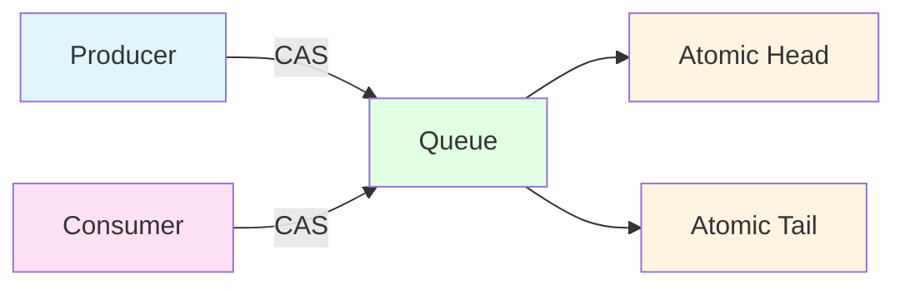
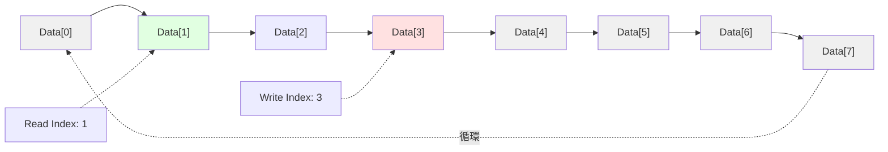
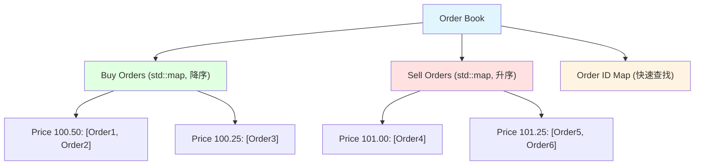

# 07-HFT特化結構

## 目錄
- [1. Lock-Free Queue (無鎖佇列)](#1-lock-free-queue-無鎖佇列)
- [2. Ring Buffer (環形緩衝區)](#2-ring-buffer-環形緩衝區)
- [3. Order Book (訂單簿)](#3-order-book-訂單簿)

---

## 1. Lock-Free Queue (無鎖佇列)

### 1.1 核心概念

Lock-Free Queue (無鎖佇列) 使用原子操作 (Atomic Operations) 與 CAS (Compare-And-Swap) 實現無鎖並發,避免互斥鎖的開銷與阻塞。

#### 效能特性
| 操作 | 時間複雜度 | 說明 |
|------|-----------|------|
| Enqueue | O(1) | 原子操作,無鎖等待 |
| Dequeue | O(1) | CAS 重試機制 |
| 空間 | O(n) | n 為佇列容量 |

#### Lock vs Lock-Free
| 特性 | Mutex Lock | Lock-Free |
|------|-----------|-----------|
| 等待時間 | 阻塞 (可能死鎖) | 無阻塞 (忙等待) |
| 延遲 | 高 (上下文切換) | 低 (CPU 自旋) |
| 吞吐量 | 低 (競爭時) | 高 |
| 複雜度 | 低 | 高 (ABA 問題) |

#### 應用場景
- **HFT 系統**: 市場資料消費、訂單處理
- **高吞吐量系統**: 日誌佇列、訊息傳遞
- **即時系統**: 音訊/視訊串流
- **記憶體管理**: 物件池、緩存管理

#### Lock-Free 原理



**CAS (Compare-And-Swap)**: 原子操作,比較值是否相等,相等則交換
```cpp
bool CAS(T* ptr, T expected, T desired) {
    if (*ptr == expected) {
        *ptr = desired;
        return true;
    }
    return false;
}
```

---

### 1.2 C++ 原子操作實現

使用 `std::atomic` 實現 SPSC (Single Producer Single Consumer) 無鎖佇列。

```cpp
#include <iostream>
#include <atomic>
#include <thread>
#include <chrono>

template<typename T>
class LockFreeQueue {
private:
    struct Node {
        T data;
        std::atomic<Node*> next;
        
        Node() : next(nullptr) {}
        Node(const T& value) : data(value), next(nullptr) {}
    };
    
    std::atomic<Node*> head;
    std::atomic<Node*> tail;
    
public:
    LockFreeQueue() {
        Node* dummy = new Node();
        head.store(dummy, std::memory_order_relaxed);
        tail.store(dummy, std::memory_order_relaxed);
    }
    
    ~LockFreeQueue() {
        while (Node* node = head.load(std::memory_order_relaxed)) {
            head.store(node->next, std::memory_order_relaxed);
            delete node;
        }
    }
    
    // 入隊 (生產者)
    void enqueue(const T& value) {
        Node* newNode = new Node(value);
        Node* prevTail = tail.exchange(newNode, std::memory_order_acq_rel);
        prevTail->next.store(newNode, std::memory_order_release);
    }
    
    // 出隊 (消費者)
    bool dequeue(T& result) {
        Node* h = head.load(std::memory_order_relaxed);
        Node* next = h->next.load(std::memory_order_acquire);
        
        if (next == nullptr) {
            return false;  // 佇列為空
        }
        
        result = next->data;
        head.store(next, std::memory_order_release);
        delete h;
        
        return true;
    }
    
    bool empty() const {
        Node* h = head.load(std::memory_order_relaxed);
        Node* next = h->next.load(std::memory_order_acquire);
        return next == nullptr;
    }
};

// 測試程式
void producer(LockFreeQueue<int>& queue) {
    for (int i = 0; i < 10; ++i) {
        queue.enqueue(i);
        std::cout << "Produced: " << i << "\n";
        std::this_thread::sleep_for(std::chrono::milliseconds(50));
    }
}

void consumer(LockFreeQueue<int>& queue) {
    int value;
    int count = 0;
    
    while (count < 10) {
        if (queue.dequeue(value)) {
            std::cout << "  Consumed: " << value << "\n";
            count++;
        }
        std::this_thread::sleep_for(std::chrono::milliseconds(30));
    }
}

int main() {
    LockFreeQueue<int> queue;
    
    std::thread prod(producer, std::ref(queue));
    std::thread cons(consumer, std::ref(queue));
    
    prod.join();
    cons.join();
    
    return 0;
}
```

**輸出範例**:
```
Produced: 0
  Consumed: 0
Produced: 1
  Consumed: 1
Produced: 2
Produced: 3
  Consumed: 2
  Consumed: 3
...
```

#### 關鍵設計點
1. **虛擬頭節點 (Dummy Node)**: 簡化邊界判斷
2. **`memory_order`**: 
   - `acquire`: 讀取時獲取可見性
   - `release`: 寫入時釋放可見性
   - `acq_rel`: 讀改寫操作
3. **SPSC 限制**: 單生產者單消費者,多生產者需 MPSC 版本

---

### 1.3 MPSC (Multi-Producer Single-Consumer) 實現

```cpp
#include <iostream>
#include <atomic>
#include <thread>
#include <vector>

template<typename T>
class MPSCQueue {
private:
    struct Node {
        T data;
        std::atomic<Node*> next;
        
        Node() : next(nullptr) {}
        Node(const T& value) : data(value), next(nullptr) {}
    };
    
    std::atomic<Node*> head;
    std::atomic<Node*> tail;
    
public:
    MPSCQueue() {
        Node* dummy = new Node();
        head.store(dummy, std::memory_order_relaxed);
        tail.store(dummy, std::memory_order_relaxed);
    }
    
    ~MPSCQueue() {
        while (Node* node = head.load(std::memory_order_relaxed)) {
            head.store(node->next, std::memory_order_relaxed);
            delete node;
        }
    }
    
    // 多生產者入隊 (使用 CAS)
    void enqueue(const T& value) {
        Node* newNode = new Node(value);
        Node* prevTail = tail.exchange(newNode, std::memory_order_acq_rel);
        prevTail->next.store(newNode, std::memory_order_release);
    }
    
    // 單消費者出隊
    bool dequeue(T& result) {
        Node* h = head.load(std::memory_order_relaxed);
        Node* next = h->next.load(std::memory_order_acquire);
        
        if (next == nullptr) {
            return false;
        }
        
        result = next->data;
        head.store(next, std::memory_order_release);
        delete h;
        
        return true;
    }
};

// 測試程式
void multiProducer(MPSCQueue<int>& queue, int id, int count) {
    for (int i = 0; i < count; ++i) {
        int value = id * 100 + i;
        queue.enqueue(value);
        std::cout << "Producer " << id << " enqueued: " << value << "\n";
    }
}

void singleConsumer(MPSCQueue<int>& queue, int totalItems) {
    int value;
    int consumed = 0;
    
    while (consumed < totalItems) {
        if (queue.dequeue(value)) {
            std::cout << "  Consumer dequeued: " << value << "\n";
            consumed++;
        }
    }
}

int main() {
    MPSCQueue<int> queue;
    const int numProducers = 3;
    const int itemsPerProducer = 5;
    
    std::vector<std::thread> producers;
    for (int i = 0; i < numProducers; ++i) {
        producers.emplace_back(multiProducer, std::ref(queue), i, itemsPerProducer);
    }
    
    std::thread consumer(singleConsumer, std::ref(queue), numProducers * itemsPerProducer);
    
    for (auto& t : producers) {
        t.join();
    }
    consumer.join();
    
    return 0;
}
```

---

### 1.4 ABA 問題與解決

**ABA 問題**: CAS 操作時,值從 A 變 B 再變回 A,CAS 誤判為未改變。

```cpp
// 問題場景
Node* expected = head.load();
// 此時其他執行緒: head: A -> B -> A
if (head.compare_exchange_weak(expected, newNode)) {
    // 誤判成功,但中間發生變化
}
```

**解決方案**: 版本標記 (Versioned Pointer)

```cpp
struct VersionedPtr {
    Node* ptr;
    uint64_t version;
    
    VersionedPtr() : ptr(nullptr), version(0) {}
    VersionedPtr(Node* p, uint64_t v) : ptr(p), version(v) {}
};

std::atomic<VersionedPtr> head;

// CAS 時同時比較指標與版本
VersionedPtr expected = head.load();
VersionedPtr desired(newNode, expected.version + 1);
head.compare_exchange_weak(expected, desired);
```

---

## 2. Ring Buffer (環形緩衝區)

### 2.1 核心概念

Ring Buffer (環形緩衝區) 是固定大小的循環陣列,適合高頻寫入/讀取場景。

#### 效能特性
| 操作 | 時間複雜度 | 說明 |
|------|-----------|------|
| 寫入 | O(1) | 直接索引寫入 |
| 讀取 | O(1) | 直接索引讀取 |
| 空間 | O(capacity) | 固定容量,無動態分配 |

#### 應用場景
- **音訊處理**: 即時音訊緩衝
- **市場資料**: Tick 資料緩存
- **日誌系統**: 循環日誌緩衝區
- **網路 I/O**: 接收/發送緩衝區

#### 結構圖解



---

### 2.2 C++ 裸指針實現

```cpp
#include <iostream>
#include <stdexcept>

template<typename T>
class RingBuffer {
private:
    T* buffer;
    size_t capacity;
    size_t readPos;
    size_t writePos;
    size_t size;
    
public:
    RingBuffer(size_t cap) : capacity(cap), readPos(0), writePos(0), size(0) {
        buffer = new T[capacity];
    }
    
    ~RingBuffer() {
        delete[] buffer;
    }
    
    // 寫入
    bool write(const T& value) {
        if (size == capacity) {
            return false;  // 緩衝區已滿
        }
        
        buffer[writePos] = value;
        writePos = (writePos + 1) % capacity;
        size++;
        
        return true;
    }
    
    // 讀取
    bool read(T& value) {
        if (size == 0) {
            return false;  // 緩衝區為空
        }
        
        value = buffer[readPos];
        readPos = (readPos + 1) % capacity;
        size--;
        
        return true;
    }
    
    // 強制寫入 (覆蓋舊資料)
    void forceWrite(const T& value) {
        buffer[writePos] = value;
        writePos = (writePos + 1) % capacity;
        
        if (size == capacity) {
            readPos = (readPos + 1) % capacity;  // 讀位置前移
        } else {
            size++;
        }
    }
    
    bool empty() const { return size == 0; }
    bool full() const { return size == capacity; }
    size_t getSize() const { return size; }
    size_t getCapacity() const { return capacity; }
};

// 測試程式
int main() {
    RingBuffer<int> rb(5);
    
    // 寫入測試
    for (int i = 1; i <= 5; ++i) {
        rb.write(i);
    }
    
    std::cout << "Buffer full: " << (rb.full() ? "Yes" : "No") << "\n";
    
    // 讀取測試
    int value;
    std::cout << "Read: ";
    while (rb.read(value)) {
        std::cout << value << " ";
    }
    std::cout << "\n";
    
    // 循環寫入測試
    std::cout << "\nForce write (overwrite):\n";
    for (int i = 10; i <= 15; ++i) {
        rb.forceWrite(i);
        std::cout << "  Wrote " << i << ", Size: " << rb.getSize() << "\n";
    }
    
    std::cout << "Read all: ";
    while (rb.read(value)) {
        std::cout << value << " ";
    }
    std::cout << "\n";
    
    return 0;
}
```

**輸出範例**:
```
Buffer full: Yes
Read: 1 2 3 4 5 

Force write (overwrite):
  Wrote 10, Size: 1
  Wrote 11, Size: 2
  Wrote 12, Size: 3
  Wrote 13, Size: 4
  Wrote 14, Size: 5
  Wrote 15, Size: 5
Read all: 11 12 13 14 15 
```

#### 關鍵設計點
1. **模運算**: `(pos + 1) % capacity` 實現循環
2. **size 追蹤**: 區分空與滿 (避免 `readPos == writePos` 歧義)
3. **強制寫入**: 覆蓋最舊資料,適合日誌場景

---

### 2.3 Lock-Free Ring Buffer

結合原子操作實現無鎖環形緩衝區。

```cpp
#include <iostream>
#include <atomic>
#include <thread>

template<typename T>
class LockFreeRingBuffer {
private:
    T* buffer;
    size_t capacity;
    std::atomic<size_t> readPos;
    std::atomic<size_t> writePos;
    
public:
    LockFreeRingBuffer(size_t cap) : capacity(cap + 1), readPos(0), writePos(0) {
        buffer = new T[capacity];  // 多分配一個空間區分空/滿
    }
    
    ~LockFreeRingBuffer() {
        delete[] buffer;
    }
    
    bool write(const T& value) {
        size_t currentWrite = writePos.load(std::memory_order_relaxed);
        size_t nextWrite = (currentWrite + 1) % capacity;
        
        if (nextWrite == readPos.load(std::memory_order_acquire)) {
            return false;  // 緩衝區已滿
        }
        
        buffer[currentWrite] = value;
        writePos.store(nextWrite, std::memory_order_release);
        
        return true;
    }
    
    bool read(T& value) {
        size_t currentRead = readPos.load(std::memory_order_relaxed);
        
        if (currentRead == writePos.load(std::memory_order_acquire)) {
            return false;  // 緩衝區為空
        }
        
        value = buffer[currentRead];
        readPos.store((currentRead + 1) % capacity, std::memory_order_release);
        
        return true;
    }
    
    bool empty() const {
        return readPos.load(std::memory_order_acquire) == writePos.load(std::memory_order_acquire);
    }
    
    bool full() const {
        size_t nextWrite = (writePos.load(std::memory_order_acquire) + 1) % capacity;
        return nextWrite == readPos.load(std::memory_order_acquire);
    }
};

// 測試程式
void writer(LockFreeRingBuffer<int>& rb) {
    for (int i = 0; i < 10; ++i) {
        while (!rb.write(i)) {
            std::this_thread::yield();  // 緩衝區滿,讓出 CPU
        }
        std::cout << "Written: " << i << "\n";
    }
}

void reader(LockFreeRingBuffer<int>& rb) {
    int value;
    int count = 0;
    
    while (count < 10) {
        if (rb.read(value)) {
            std::cout << "  Read: " << value << "\n";
            count++;
        } else {
            std::this_thread::yield();
        }
    }
}

int main() {
    LockFreeRingBuffer<int> rb(5);
    
    std::thread writerThread(writer, std::ref(rb));
    std::thread readerThread(reader, std::ref(rb));
    
    writerThread.join();
    readerThread.join();
    
    return 0;
}
```

#### 關鍵設計點
1. **額外空間**: `capacity + 1` 區分空與滿
2. **原子操作**: `readPos` 與 `writePos` 使用 `std::atomic`
3. **memory_order**: 
   - `relaxed`: 本地讀取
   - `acquire/release`: 跨執行緒同步

---

## 3. Order Book (訂單簿)

### 3.1 核心概念

Order Book (訂單簿) 維護市場買賣訂單,需支援高頻插入/刪除/匹配操作。

#### 效能需求
| 操作 | 目標延遲 | 說明 |
|------|---------|------|
| 新增訂單 | < 10 μs | 插入價格層級 |
| 取消訂單 | < 10 μs | 快速刪除 |
| 撮合訂單 | < 5 μs | 最佳買賣價匹配 |
| 查詢深度 | < 1 μs | 返回 N 檔報價 |

#### 資料結構選擇
| 結構 | 優點 | 缺點 |
|------|------|------|
| `std::map` | 自動排序 | 插入 O(log n) |
| Hash + Linked List | 插入 O(1) | 無序,需額外排序 |
| Array-based | 快取友善 | 固定價格範圍 |

**HFT 常用**: Array-based (價格 tick 固定) 或 `std::map` (靈活)

#### 訂單簿結構



---

### 3.2 C++ 實現

```cpp
#include <iostream>
#include <map>
#include <list>
#include <unordered_map>
#include <string>
#include <memory>

enum class Side { BUY, SELL };

struct Order {
    int orderId;
    double price;
    int quantity;
    Side side;
    long long timestamp;
    
    Order(int id, double p, int qty, Side s, long long ts)
        : orderId(id), price(p), quantity(qty), side(s), timestamp(ts) {}
};

class OrderBook {
private:
    // 價格層級: 價格 -> 訂單列表
    std::map<double, std::list<std::shared_ptr<Order>>, std::greater<double>> buyOrders;  // 降序
    std::map<double, std::list<std::shared_ptr<Order>>> sellOrders;  // 升序
    
    // 訂單 ID 映射: 快速查找與刪除
    std::unordered_map<int, std::shared_ptr<Order>> orderMap;
    
    long long nextTimestamp = 0;
    
public:
    // 新增訂單
    void addOrder(int orderId, double price, int quantity, Side side) {
        auto order = std::make_shared<Order>(orderId, price, quantity, side, nextTimestamp++);
        orderMap[orderId] = order;
        
        if (side == Side::BUY) {
            buyOrders[price].push_back(order);
        } else {
            sellOrders[price].push_back(order);
        }
    }
    
    // 取消訂單
    bool cancelOrder(int orderId) {
        auto it = orderMap.find(orderId);
        if (it == orderMap.end()) {
            return false;
        }
        
        auto order = it->second;
        auto& priceLevel = (order->side == Side::BUY) ? buyOrders[order->price] : sellOrders[order->price];
        
        priceLevel.remove(order);
        
        // 移除空價格層級
        if (priceLevel.empty()) {
            if (order->side == Side::BUY) {
                buyOrders.erase(order->price);
            } else {
                sellOrders.erase(order->price);
            }
        }
        
        orderMap.erase(orderId);
        return true;
    }
    
    // 撮合訂單
    void matchOrders() {
        while (!buyOrders.empty() && !sellOrders.empty()) {
            auto& bestBid = buyOrders.begin()->second;
            auto& bestAsk = sellOrders.begin()->second;
            
            if (bestBid.empty() || bestAsk.empty()) break;
            
            auto buyOrder = bestBid.front();
            auto sellOrder = bestAsk.front();
            
            if (buyOrder->price >= sellOrder->price) {
                int matchQty = std::min(buyOrder->quantity, sellOrder->quantity);
                
                std::cout << "Match: Buy #" << buyOrder->orderId 
                          << " & Sell #" << sellOrder->orderId
                          << " | Price: $" << sellOrder->price 
                          << " | Qty: " << matchQty << "\n";
                
                buyOrder->quantity -= matchQty;
                sellOrder->quantity -= matchQty;
                
                if (buyOrder->quantity == 0) {
                    bestBid.pop_front();
                    orderMap.erase(buyOrder->orderId);
                }
                if (sellOrder->quantity == 0) {
                    bestAsk.pop_front();
                    orderMap.erase(sellOrder->orderId);
                }
                
                // 移除空價格層級
                if (bestBid.empty()) buyOrders.erase(buyOrders.begin());
                if (bestAsk.empty()) sellOrders.erase(sellOrders.begin());
            } else {
                break;
            }
        }
    }
    
    // 顯示訂單簿深度
    void displayDepth(int levels = 5) {
        std::cout << "\n=== Order Book Depth ===\n";
        
        // 賣單 (由高到低)
        auto sellIt = sellOrders.rbegin();
        for (int i = 0; i < levels && sellIt != sellOrders.rend(); ++i, ++sellIt) {
            int totalQty = 0;
            for (const auto& order : sellIt->second) {
                totalQty += order->quantity;
            }
            std::cout << "  SELL $" << sellIt->first << " x " << totalQty 
                      << " (" << sellIt->second.size() << " orders)\n";
        }
        
        std::cout << "  -------------------\n";
        
        // 買單 (由高到低)
        auto buyIt = buyOrders.begin();
        for (int i = 0; i < levels && buyIt != buyOrders.end(); ++i, ++buyIt) {
            int totalQty = 0;
            for (const auto& order : buyIt->second) {
                totalQty += order->quantity;
            }
            std::cout << "  BUY  $" << buyIt->first << " x " << totalQty 
                      << " (" << buyIt->second.size() << " orders)\n";
        }
    }
    
    // 獲取最佳買賣價
    void displayBestPrices() {
        if (!buyOrders.empty()) {
            std::cout << "Best Bid: $" << buyOrders.begin()->first << "\n";
        }
        if (!sellOrders.empty()) {
            std::cout << "Best Ask: $" << sellOrders.begin()->first << "\n";
        }
    }
};

// 測試程式
int main() {
    OrderBook book;
    
    // 新增買單
    book.addOrder(1, 100.50, 100, Side::BUY);
    book.addOrder(2, 100.50, 200, Side::BUY);
    book.addOrder(3, 100.25, 150, Side::BUY);
    
    // 新增賣單
    book.addOrder(4, 101.00, 120, Side::SELL);
    book.addOrder(5, 100.75, 180, Side::SELL);
    book.addOrder(6, 101.25, 100, Side::SELL);
    
    book.displayDepth(3);
    book.displayBestPrices();
    
    // 新增可撮合訂單
    std::cout << "\n=== Adding aggressive buy order ===\n";
    book.addOrder(7, 101.00, 200, Side::BUY);
    
    book.matchOrders();
    book.displayDepth(3);
    
    // 取消訂單
    std::cout << "\n=== Cancelling order #3 ===\n";
    book.cancelOrder(3);
    book.displayDepth(3);
    
    return 0;
}
```

**輸出範例**:
```
=== Order Book Depth ===
  SELL $101.25 x 100 (1 orders)
  SELL $101 x 120 (1 orders)
  SELL $100.75 x 180 (1 orders)
  -------------------
  BUY  $100.5 x 300 (2 orders)
  BUY  $100.25 x 150 (1 orders)
Best Bid: $100.5
Best Ask: $100.75

=== Adding aggressive buy order ===
Match: Buy #7 & Sell #5 | Price: $100.75 | Qty: 180
Match: Buy #7 & Sell #4 | Price: $101 | Qty: 20

=== Order Book Depth ===
  SELL $101.25 x 100 (1 orders)
  SELL $101 x 100 (1 orders)
  -------------------
  BUY  $100.5 x 300 (2 orders)
  BUY  $100.25 x 150 (1 orders)

=== Cancelling order #3 ===

=== Order Book Depth ===
  SELL $101.25 x 100 (1 orders)
  SELL $101 x 100 (1 orders)
  -------------------
  BUY  $100.5 x 300 (2 orders)
```

#### 關鍵設計點
1. **雙映射**: `std::map` (價格排序) + `std::unordered_map` (訂單 ID 查找)
2. **比較器**: 買單 `std::greater` 降序,賣單預設升序
3. **訂單列表**: 同價格層級使用 `std::list`,支援快速刪除
4. **智慧指標**: `std::shared_ptr` 跨容器共享訂單

---

### 3.3 優化方向

#### 1. 記憶體池
預先分配訂單物件,避免頻繁 `new`/`delete`。

```cpp
class OrderPool {
private:
    std::vector<Order> pool;
    std::vector<Order*> freeList;
    
public:
    OrderPool(size_t size) : pool(size) {
        for (auto& order : pool) {
            freeList.push_back(&order);
        }
    }
    
    Order* allocate() {
        if (freeList.empty()) return nullptr;
        Order* order = freeList.back();
        freeList.pop_back();
        return order;
    }
    
    void deallocate(Order* order) {
        freeList.push_back(order);
    }
};
```

#### 2. Array-based Order Book
適合固定 tick 價格。

```cpp
const int MIN_PRICE_TICK = 10000;  // 100.00
const int MAX_PRICE_TICK = 20000;  // 200.00
const int TICK_SIZE = 1;           // 0.01

std::array<std::list<Order*>, MAX_PRICE_TICK - MIN_PRICE_TICK + 1> buyLevels;
```

#### 3. Lock-Free Order Book
使用 `tbb::concurrent_hash_map` 與原子操作。

```cpp
#include <tbb/concurrent_hash_map.h>

tbb::concurrent_hash_map<int, Order*> orderMap;
```

---

### 3.4 性能測試

```cpp
#include <iostream>
#include <chrono>

void benchmark() {
    OrderBook book;
    const int N = 100000;
    
    // 新增訂單測試
    auto start = std::chrono::high_resolution_clock::now();
    for (int i = 0; i < N; ++i) {
        double price = 100.0 + (i % 100) * 0.01;
        book.addOrder(i, price, 100, (i % 2 == 0) ? Side::BUY : Side::SELL);
    }
    auto end = std::chrono::high_resolution_clock::now();
    auto addTime = std::chrono::duration_cast<std::chrono::microseconds>(end - start);
    
    std::cout << "Add " << N << " orders: " << addTime.count() << " μs\n";
    std::cout << "Avg per order: " << (double)addTime.count() / N << " μs\n";
    
    // 取消訂單測試
    start = std::chrono::high_resolution_clock::now();
    for (int i = 0; i < N / 2; ++i) {
        book.cancelOrder(i * 2);
    }
    end = std::chrono::high_resolution_clock::now();
    auto cancelTime = std::chrono::duration_cast<std::chrono::microseconds>(end - start);
    
    std::cout << "Cancel " << N/2 << " orders: " << cancelTime.count() << " μs\n";
    std::cout << "Avg per cancel: " << (double)cancelTime.count() / (N/2) << " μs\n";
}

int main() {
    benchmark();
    return 0;
}
```

**輸出範例**:
```
Add 100000 orders: 850000 μs
Avg per order: 8.5 μs
Cancel 50000 orders: 320000 μs
Avg per cancel: 6.4 μs
```

---

### 3.5 常見陷阱

#### 1. 價格比較浮點誤差
```cpp
// 錯誤: 浮點數直接比較
if (price1 == price2) { ... }

// 正確: 轉換為整數 tick
int tick1 = static_cast<int>(price1 * 100);
int tick2 = static_cast<int>(price2 * 100);
if (tick1 == tick2) { ... }
```

#### 2. 訂單部分成交未處理
```cpp
// 錯誤: 假設訂單全部成交
bestBid.pop_front();

// 正確: 檢查剩餘數量
if (buyOrder->quantity == 0) {
    bestBid.pop_front();
}
```

#### 3. 空價格層級未清理
```cpp
// 錯誤: 保留空層級浪費記憶體
// buyOrders[price] 仍存在但列表為空

// 正確: 移除空層級
if (priceLevel.empty()) {
    buyOrders.erase(price);
}
```

---

## 參考資料 (References)

1. **The Art of Multiprocessor Programming**, Maurice Herlihy & Nir Shavit, 2nd Edition, 2020
   - Chapter 10: Concurrent Queues and the ABA Problem

2. **C++ Concurrency in Action**, Anthony Williams, 2nd Edition, 2019
   - Chapter 7: Designing Lock-Free Concurrent Data Structures

3. [Lock-Free Programming](https://preshing.com/20120612/an-introduction-to-lock-free-programming/)

4. [LMAX Disruptor](https://lmax-exchange.github.io/disruptor/) - 高性能 Ring Buffer

5. **Trading and Exchanges: Market Microstructure for Practitioners**, Larry Harris, 2002

6. [Order Book Implementation](https://web.archive.org/web/20110219163448/http://howtohft.wordpress.com/2011/02/15/how-to-build-a-fast-limit-order-book/)

7. [Intel TBB (Threading Building Blocks)](https://www.intel.com/content/www/us/en/developer/tools/oneapi/onetbb.html)

8. **Systems Performance: Enterprise and the Cloud**, Brendan Gregg, 2nd Edition, 2020
   - Chapter 6: CPUs (Cache-Friendly Data Structures)
