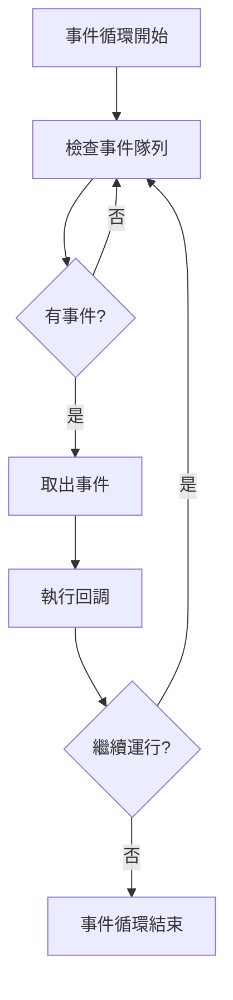
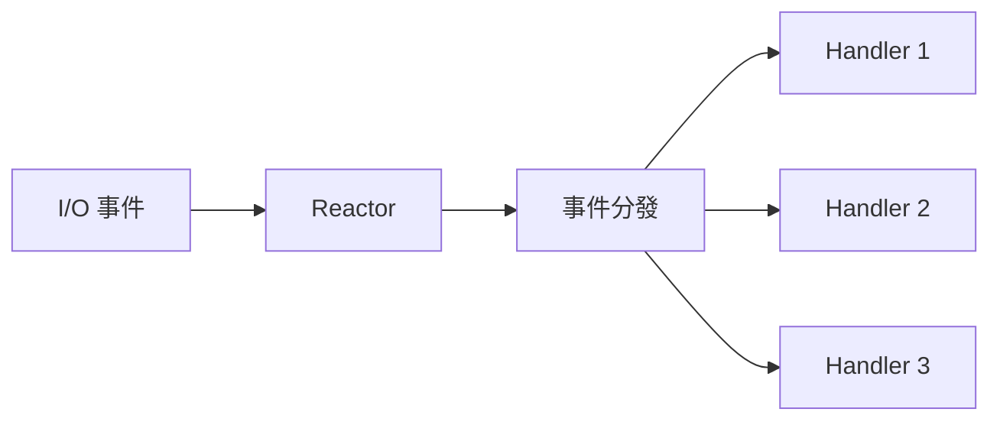
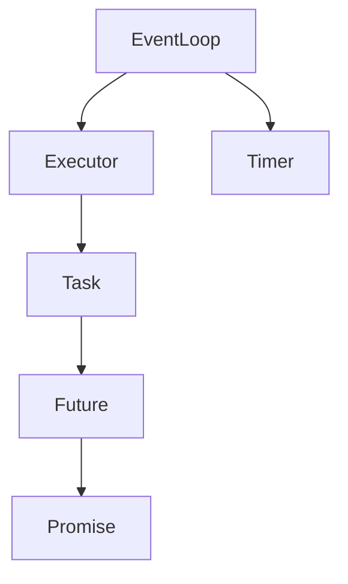
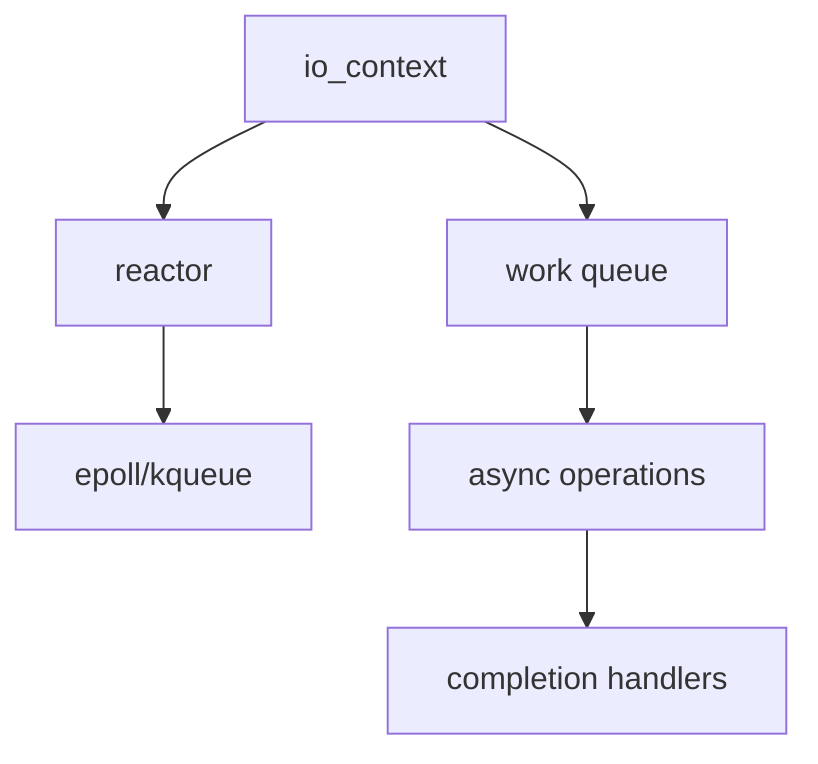
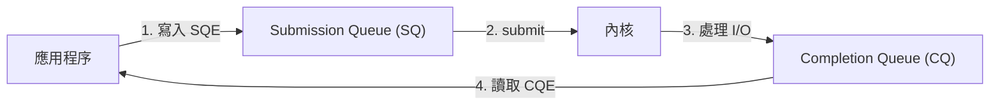
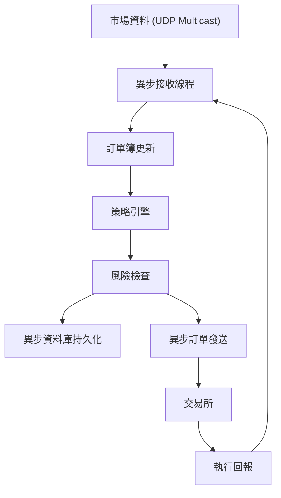

# 異步編程專題 (Asynchronous Programming)

> 本章深度解析 C++ 異步編程的核心概念、實現原理與實戰應用，包括自定義異步庫、Boost.Asio、io_uring、異步資料庫交互，是構建高性能後端系統的關鍵技術。

---

## 目錄

> **HFT 學習優先級**: ⭐⭐⭐ 必看 | ⭐⭐ 建議 | ⭐ 有空再看

1. [異步編程核心概念](#1-異步編程核心概念) ⭐⭐⭐
2. [I/O 模型深度解析](#2-io-模型深度解析) ⭐⭐⭐
3. [封裝自己的異步庫](#3-封裝自己的異步庫) ⭐⭐⭐
4. [Boost.Asio 深度解析](#4-boostasio-深度解析) ⭐⭐⭐
5. [io_uring 深度實踐](#5-io_uring-深度實踐) ⭐⭐⭐
6. [異步資料庫交互](#6-異步資料庫交互) ⭐⭐⭐
7. [C++20 Coroutine 實戰](#7-c20-coroutine-實戰) ⭐⭐
8. [異步模式與最佳實踐](#8-異步模式與最佳實踐) ⭐⭐⭐
9. [實戰項目：異步交易系統](#9-實戰項目異步交易系統) ⭐⭐⭐

---

## 1. 異步編程核心概念

### 1.1 同步 vs 異步

**同步執行 (Synchronous)**:

```cpp
// 同步讀取文件 - 阻塞直到完成
std::ifstream file("data.txt");
std::string content((std::istreambuf_iterator<char>(file)),
                     std::istreambuf_iterator<char>());
// 必須等待讀取完成才能繼續

process_data(content);  // 只有在讀取完成後才執行
```

**異步執行 (Asynchronous)**:

```cpp
// 異步讀取文件 - 立即返回
async_read_file("data.txt", [](std::string content) {
    process_data(content);  // 完成後自動調用
});

// 立即執行其他任務，不等待讀取完成
do_other_work();
```

### 1.2 為什麼需要異步編程？

**問題場景 - HFT 交易系統**:

```cpp
// 同步版本 - 串行執行，效率低
void handle_order_sync() {
    // 1. 接收訂單 (10μs)
    Order order = receive_order();
    
    // 2. 查詢資料庫 (1000μs) ⚠️ 阻塞等待
    Position pos = db.query_position(order.symbol);
    
    // 3. 風險檢查 (5μs)
    if (!check_risk(order, pos)) return;
    
    // 4. 發送到交易所 (50μs)
    send_to_exchange(order);
    
    // 總延遲: 1065μs
}

// 異步版本 - 並行執行，延遲降低
void handle_order_async() {
    async_receive_order([](Order order) {
        // 並行執行資料庫查詢和風險檢查
        auto db_future = async_query_position(order.symbol);
        
        async_check_risk(order, [db_future, order](bool ok) {
            if (!ok) return;
            
            db_future.then([order](Position pos) {
                async_send_to_exchange(order);
            });
        });
    });
    
    // 總延遲: ~65μs (資料庫查詢與其他操作並行)
}
```

### 1.3 回調地獄 (Callback Hell)

**問題示例**:

```cpp
// 多層嵌套回調 - 難以維護
async_connect(host, port, [](Socket socket) {
    async_write(socket, request, [socket](size_t bytes) {
        async_read(socket, [socket](std::string response) {
            async_parse(response, [socket](Data data) {
                async_save_db(data, [socket](bool success) {
                    if (success) {
                        async_close(socket, []() {
                            std::cout << "Done!\n";
                        });
                    }
                });
            });
        });
    });
});
```

**解決方案 - Future/Promise**:

```cpp
// 使用 Future 鏈式調用
async_connect(host, port)
    .then([](Socket socket) {
        return async_write(socket, request);
    })
    .then([](size_t bytes) {
        return async_read(socket);
    })
    .then([](std::string response) {
        return async_parse(response);
    })
    .then([](Data data) {
        return async_save_db(data);
    })
    .then([](bool success) {
        std::cout << "Done!\n";
    });
```

**最佳解決方案 - C++20 Coroutine**:

```cpp
// 協程風格 - 看起來像同步代碼
Task<void> handle_request() {
    Socket socket = co_await async_connect(host, port);
    size_t bytes = co_await async_write(socket, request);
    std::string response = co_await async_read(socket);
    Data data = co_await async_parse(response);
    bool success = co_await async_save_db(data);
    std::cout << "Done!\n";
}
```

### 1.4 Future/Promise 模式

**基本概念**:

- **Future**: 代表一個未來會得到的值
- **Promise**: 用於設置 Future 的值

```cpp
#include <future>
#include <thread>
#include <iostream>

// Promise/Future 基礎
void promise_future_basic() {
    std::promise<int> promise;
    std::future<int> future = promise.get_future();
    
    // 在另一個線程中計算結果
    std::thread([promise = std::move(promise)]() mutable {
        std::this_thread::sleep_for(std::chrono::seconds(1));
        promise.set_value(42);  // 設置結果
    }).detach();
    
    std::cout << "Waiting for result...\n";
    int result = future.get();  // 阻塞等待結果
    std::cout << "Result: " << result << "\n";
}
```

**std::async 使用**:

```cpp
#include <future>
#include <numeric>

// 異步計算
std::future<int> async_sum(const std::vector<int>& data) {
    return std::async(std::launch::async, [data]() {
        return std::accumulate(data.begin(), data.end(), 0);
    });
}

void async_example() {
    std::vector<int> data(1000000);
    std::iota(data.begin(), data.end(), 1);
    
    // 啟動異步計算
    auto future = async_sum(data);
    
    // 做其他事情
    std::cout << "Computing in background...\n";
    
    // 等待結果
    int result = future.get();
    std::cout << "Sum: " << result << "\n";
}
```

### 1.5 事件循環 (Event Loop)

**概念圖**:



**簡單實現**:

```cpp
#include <queue>
#include <functional>
#include <iostream>

class EventLoop {
public:
    using Callback = std::function<void()>;
    
    void post(Callback callback) {
        events_.push(std::move(callback));
    }
    
    void run() {
        while (!events_.empty()) {
            auto callback = std::move(events_.front());
            events_.pop();
            callback();  // 執行回調
        }
    }
    
private:
    std::queue<Callback> events_;
};

// 使用示例
void event_loop_example() {
    EventLoop loop;
    
    loop.post([]() { std::cout << "Event 1\n"; });
    loop.post([]() { std::cout << "Event 2\n"; });
    loop.post([]() { std::cout << "Event 3\n"; });
    
    loop.run();
}
```

---

## 2. I/O 模型深度解析

### 2.1 五種 I/O 模型對比

**1. 阻塞 I/O (Blocking I/O)**

```cpp
// 阻塞等待數據
int sockfd = socket(AF_INET, SOCK_STREAM, 0);
char buffer[1024];

// recv 會阻塞直到有數據到達
ssize_t n = recv(sockfd, buffer, sizeof(buffer), 0);
```

**時序圖**:

```
應用程序         內核
   |              |
   |--- recv ---->|
   |              | 等待數據...
   |              | (阻塞)
   |              | 數據到達
   |<-- 返回數據--|
   |              |
```

**2. 非阻塞 I/O (Non-blocking I/O)**

```cpp
#include <fcntl.h>

// 設置非阻塞
int flags = fcntl(sockfd, F_GETFL, 0);
fcntl(sockfd, F_SETFL, flags | O_NONBLOCK);

// 立即返回
ssize_t n = recv(sockfd, buffer, sizeof(buffer), 0);
if (n < 0 && (errno == EAGAIN || errno == EWOULDBLOCK)) {
    // 沒有數據可讀
}
```

**3. I/O 多路復用 (I/O Multiplexing) - epoll**

```cpp
#include <sys/epoll.h>

int epoll_fd = epoll_create1(0);

struct epoll_event ev;
ev.events = EPOLLIN;
ev.data.fd = sockfd;
epoll_ctl(epoll_fd, EPOLL_CTL_ADD, sockfd, &ev);

struct epoll_event events[10];
int nfds = epoll_wait(epoll_fd, events, 10, -1);

for (int i = 0; i < nfds; ++i) {
    if (events[i].events & EPOLLIN) {
        // 有數據可讀
        recv(events[i].data.fd, buffer, sizeof(buffer), 0);
    }
}
```

**4. 信號驅動 I/O (Signal-driven I/O)**

```cpp
// 較少使用，不推薦
```

**5. 異步 I/O (Asynchronous I/O) - io_uring**

```cpp
#include <liburing.h>

struct io_uring ring;
io_uring_queue_init(256, &ring, 0);

// 提交異步讀取請求
struct io_uring_sqe *sqe = io_uring_get_sqe(&ring);
io_uring_prep_read(sqe, sockfd, buffer, sizeof(buffer), 0);
io_uring_submit(&ring);

// 等待完成
struct io_uring_cqe *cqe;
io_uring_wait_cqe(&ring, &cqe);
// 數據已經在 buffer 中了！
```

### 2.2 I/O 模型對比表

| 模型       | 等待數據階段 | 複製數據階段  | 並發能力 | 複雜度 | HFT 推薦 |
| -------- | ------ | ------- | ---- | --- | ------ |
| 阻塞 I/O   | 阻塞     | 阻塞      | 低    | 低   | ❌      |
| 非阻塞 I/O  | 輪詢     | 阻塞      | 低    | 中   | ❌      |
| I/O 多路復用 | 阻塞     | 阻塞      | 高    | 中   | ⭐⭐⭐    |
| 信號驅動 I/O | 非阻塞    | 阻塞      | 中    | 高   | ❌      |
| 異步 I/O   | 非阻塞    | **非阻塞** | 極高   | 高   | ⭐⭐⭐⭐⭐  |

### 2.3 Reactor 模式

**核心概念**:

- **Reactor**: 事件分發器，監聽 I/O 事件
- **Handler**: 事件處理器，處理具體業務邏輯



**單 Reactor 單線程**:

```cpp
#include <sys/epoll.h>
#include <unordered_map>
#include <functional>

class Reactor {
public:
    using EventHandler = std::function<void()>;
    
    Reactor() {
        epoll_fd_ = epoll_create1(0);
    }
    
    void add_handler(int fd, EventHandler handler) {
        handlers_[fd] = std::move(handler);
        
        struct epoll_event ev;
        ev.events = EPOLLIN | EPOLLET;  // Edge-triggered
        ev.data.fd = fd;
        epoll_ctl(epoll_fd_, EPOLL_CTL_ADD, fd, &ev);
    }
    
    void run() {
        struct epoll_event events[64];
        
        while (true) {
            int n = epoll_wait(epoll_fd_, events, 64, -1);
            
            for (int i = 0; i < n; ++i) {
                int fd = events[i].data.fd;
                if (handlers_.count(fd)) {
                    handlers_[fd]();  // 執行回調
                }
            }
        }
    }
    
private:
    int epoll_fd_;
    std::unordered_map<int, EventHandler> handlers_;
};

// 使用示例
void reactor_example(int listen_fd) {
    Reactor reactor;
    
    // 註冊監聽 socket 的處理器
    reactor.add_handler(listen_fd, [listen_fd, &reactor]() {
        int client_fd = accept(listen_fd, nullptr, nullptr);
        
        // 註冊客戶端 socket 的處理器
        reactor.add_handler(client_fd, [client_fd]() {
            char buffer[1024];
            ssize_t n = recv(client_fd, buffer, sizeof(buffer), 0);
            if (n > 0) {
                send(client_fd, buffer, n, 0);  // Echo
            }
        });
    });
    
    reactor.run();
}
```

**多 Reactor 多線程 (主從模式)**:

```cpp
#include <thread>
#include <vector>

class SubReactor {
public:
    SubReactor() : reactor_() {
        thread_ = std::thread([this]() {
            reactor_.run();
        });
    }
    
    void add_connection(int fd) {
        reactor_.add_handler(fd, [fd]() {
            char buffer[1024];
            ssize_t n = recv(fd, buffer, sizeof(buffer), 0);
            if (n > 0) {
                send(fd, buffer, n, 0);
            }
        });
    }
    
private:
    Reactor reactor_;
    std::thread thread_;
};

class MainReactor {
public:
    MainReactor(int num_workers) {
        for (int i = 0; i < num_workers; ++i) {
            workers_.emplace_back(std::make_unique<SubReactor>());
        }
    }
    
    void start(int listen_fd) {
        reactor_.add_handler(listen_fd, [this, listen_fd]() {
            int client_fd = accept(listen_fd, nullptr, nullptr);
            
            // Round-robin 分配給子 Reactor
            workers_[next_worker_]->add_connection(client_fd);
            next_worker_ = (next_worker_ + 1) % workers_.size();
        });
        
        reactor_.run();
    }
    
private:
    Reactor reactor_;
    std::vector<std::unique_ptr<SubReactor>> workers_;
    size_t next_worker_ = 0;
};
```

### 2.4 Proactor 模式

**概念對比**:

- **Reactor**: "數據準備好了，你來讀"
- **Proactor**: "數據已經讀到緩衝區，直接用"

```cpp
// Reactor 風格 (epoll)
epoll_wait(...);  // 通知可讀
recv(fd, buf, len, 0);  // 應用程序自己讀取

// Proactor 風格 (io_uring)
io_uring_prep_read(sqe, fd, buf, len, 0);  // 提交讀取請求
io_uring_submit(&ring);
io_uring_wait_cqe(&ring, &cqe);  // 通知已完成，數據在 buf 中
```

**Proactor 實現示例**:

```cpp
#include <liburing.h>
#include <unordered_map>
#include <functional>

class Proactor {
public:
    using CompletionHandler = std::function<void(int result)>;
    
    Proactor() {
        io_uring_queue_init(256, &ring_, 0);
    }
    
    void async_read(int fd, char* buffer, size_t len, CompletionHandler handler) {
        struct io_uring_sqe *sqe = io_uring_get_sqe(&ring_);
        io_uring_prep_read(sqe, fd, buffer, len, 0);
        
        // 保存回調
        int id = next_id_++;
        io_uring_sqe_set_data(sqe, reinterpret_cast<void*>(id));
        handlers_[id] = std::move(handler);
        
        io_uring_submit(&ring_);
    }
    
    void run() {
        struct io_uring_cqe *cqe;
        
        while (true) {
            io_uring_wait_cqe(&ring_, &cqe);
            
            int id = reinterpret_cast<int>(io_uring_cqe_get_data(cqe));
            int result = cqe->res;
            
            if (handlers_.count(id)) {
                handlers_[id](result);  // 調用完成回調
                handlers_.erase(id);
            }
            
            io_uring_cqe_seen(&ring_, cqe);
        }
    }
    
private:
    struct io_uring ring_;
    std::unordered_map<int, CompletionHandler> handlers_;
    int next_id_ = 0;
};

// 使用示例
void proactor_example(int sockfd) {
    Proactor proactor;
    
    char* buffer = new char[1024];
    
    proactor.async_read(sockfd, buffer, 1024, [buffer](int result) {
        if (result > 0) {
            std::cout << "Read " << result << " bytes\n";
            // 數據已經在 buffer 中
        }
        delete[] buffer;
    });
    
    proactor.run();
}
```

---

## 3. 封裝自己的異步庫

### 3.1 設計目標

我們要實現一個簡潔、高效的異步庫，特性包括：

1. **零成本抽象**: 沒有虛函數開銷
2. **類型安全**: 利用模板和 C++17 特性
3. **易用性**: 鏈式調用、協程支持
4. **高性能**: 基於 epoll/io_uring

### 3.2 核心組件架構



### 3.3 EventLoop 實現

```cpp
#include <sys/epoll.h>
#include <sys/timerfd.h>
#include <unistd.h>
#include <queue>
#include <functional>
#include <vector>
#include <memory>

class EventLoop {
public:
    using Callback = std::function<void()>;
    using IOCallback = std::function<void(uint32_t events)>;
    
    EventLoop() {
        epoll_fd_ = epoll_create1(0);
        if (epoll_fd_ < 0) {
            throw std::runtime_error("epoll_create1 failed");
        }
    }
    
    ~EventLoop() {
        if (epoll_fd_ >= 0) {
            close(epoll_fd_);
        }
    }
    
    // 添加 I/O 監聽
    void add_io(int fd, uint32_t events, IOCallback callback) {
        struct epoll_event ev;
        ev.events = events | EPOLLET;  // Edge-triggered
        
        auto* cb = new IOCallback(std::move(callback));
        ev.data.ptr = cb;
        
        epoll_ctl(epoll_fd_, EPOLL_CTL_ADD, fd, &ev);
        io_callbacks_[fd] = cb;
    }
    
    // 移除 I/O 監聽
    void remove_io(int fd) {
        epoll_ctl(epoll_fd_, EPOLL_CTL_DEL, fd, nullptr);
        if (io_callbacks_.count(fd)) {
            delete io_callbacks_[fd];
            io_callbacks_.erase(fd);
        }
    }
    
    // 投遞任務到事件循環
    void post(Callback callback) {
        std::lock_guard<std::mutex> lock(queue_mutex_);
        task_queue_.push(std::move(callback));
    }
    
    // 運行事件循環
    void run() {
        std::vector<struct epoll_event> events(64);
        
        while (!stop_) {
            // 處理投遞的任務
            process_tasks();
            
            // 等待 I/O 事件
            int n = epoll_wait(epoll_fd_, events.data(), events.size(), 10);
            
            for (int i = 0; i < n; ++i) {
                auto* callback = static_cast<IOCallback*>(events[i].data.ptr);
                (*callback)(events[i].events);
            }
        }
    }
    
    void stop() {
        stop_ = true;
    }
    
private:
    void process_tasks() {
        std::queue<Callback> tasks;
        {
            std::lock_guard<std::mutex> lock(queue_mutex_);
            tasks.swap(task_queue_);
        }
        
        while (!tasks.empty()) {
            tasks.front()();
            tasks.pop();
        }
    }
    
    int epoll_fd_;
    bool stop_ = false;
    std::queue<Callback> task_queue_;
    std::mutex queue_mutex_;
    std::unordered_map<int, IOCallback*> io_callbacks_;
};
```

### 3.4 Future/Promise 實現

```cpp
#include <memory>
#include <mutex>
#include <condition_variable>
#include <optional>
#include <exception>

template<typename T>
class Future;

template<typename T>
class Promise {
public:
    Promise() : state_(std::make_shared<State>()) {}
    
    Future<T> get_future() {
        return Future<T>(state_);
    }
    
    void set_value(T value) {
        std::lock_guard<std::mutex> lock(state_->mutex);
        state_->value = std::move(value);
        state_->ready = true;
        state_->cv.notify_all();
        
        if (state_->callback) {
            state_->callback(*state_->value);
        }
    }
    
    void set_exception(std::exception_ptr ex) {
        std::lock_guard<std::mutex> lock(state_->mutex);
        state_->exception = ex;
        state_->ready = true;
        state_->cv.notify_all();
    }
    
private:
    struct State {
        std::mutex mutex;
        std::condition_variable cv;
        std::optional<T> value;
        std::exception_ptr exception;
        bool ready = false;
        std::function<void(T)> callback;
    };
    
    std::shared_ptr<State> state_;
    
    template<typename U>
    friend class Future;
};

template<typename T>
class Future {
public:
    explicit Future(std::shared_ptr<typename Promise<T>::State> state)
        : state_(std::move(state)) {}
    
    // 阻塞等待結果
    T get() {
        std::unique_lock<std::mutex> lock(state_->mutex);
        state_->cv.wait(lock, [this] { return state_->ready; });
        
        if (state_->exception) {
            std::rethrow_exception(state_->exception);
        }
        
        return std::move(*state_->value);
    }
    
    // 檢查是否準備好
    bool is_ready() const {
        std::lock_guard<std::mutex> lock(state_->mutex);
        return state_->ready;
    }
    
    // 註冊回調 (鏈式調用)
    template<typename F>
    auto then(F&& func) {
        using ReturnType = std::invoke_result_t<F, T>;
        using NewFuture = Future<ReturnType>;
        
        Promise<ReturnType> promise;
        auto future = promise.get_future();
        
        std::lock_guard<std::mutex> lock(state_->mutex);
        state_->callback = [promise = std::move(promise), func = std::forward<F>(func)](T value) mutable {
            try {
                if constexpr (std::is_void_v<ReturnType>) {
                    func(std::move(value));
                    promise.set_value();
                } else {
                    promise.set_value(func(std::move(value)));
                }
            } catch (...) {
                promise.set_exception(std::current_exception());
            }
        };
        
        if (state_->ready && state_->value) {
            state_->callback(*state_->value);
        }
        
        return future;
    }
    
private:
    std::shared_ptr<typename Promise<T>::State> state_;
};

// void 特化
template<>
class Promise<void> {
public:
    Promise() : state_(std::make_shared<State>()) {}
    
    Future<void> get_future();
    
    void set_value() {
        std::lock_guard<std::mutex> lock(state_->mutex);
        state_->ready = true;
        state_->cv.notify_all();
        
        if (state_->callback) {
            state_->callback();
        }
    }
    
private:
    struct State {
        std::mutex mutex;
        std::condition_variable cv;
        bool ready = false;
        std::function<void()> callback;
    };
    
    std::shared_ptr<State> state_;
    
    friend class Future<void>;
};
```

### 3.5 異步 TCP 客戶端實現

```cpp
#include <sys/socket.h>
#include <netinet/in.h>
#include <arpa/inet.h>
#include <fcntl.h>

class AsyncTcpClient {
public:
    explicit AsyncTcpClient(EventLoop& loop) : loop_(loop) {}
    
    Future<void> connect(const std::string& host, uint16_t port) {
        Promise<void> promise;
        auto future = promise.get_future();
        
        // 創建非阻塞 socket
        sockfd_ = socket(AF_INET, SOCK_STREAM, 0);
        int flags = fcntl(sockfd_, F_GETFL, 0);
        fcntl(sockfd_, F_SETFL, flags | O_NONBLOCK);
        
        struct sockaddr_in addr;
        addr.sin_family = AF_INET;
        addr.sin_port = htons(port);
        inet_pton(AF_INET, host.c_str(), &addr.sin_addr);
        
        // 發起非阻塞連接
        int ret = ::connect(sockfd_, (struct sockaddr*)&addr, sizeof(addr));
        
        if (ret < 0 && errno != EINPROGRESS) {
            promise.set_exception(std::make_exception_ptr(
                std::runtime_error("Connect failed")));
            return future;
        }
        
        // 監聽可寫事件 (連接完成)
        loop_.add_io(sockfd_, EPOLLOUT, 
            [this, promise = std::move(promise)](uint32_t events) mutable {
                int error = 0;
                socklen_t len = sizeof(error);
                getsockopt(sockfd_, SOL_SOCKET, SO_ERROR, &error, &len);
                
                if (error == 0) {
                    promise.set_value();
                } else {
                    promise.set_exception(std::make_exception_ptr(
                        std::runtime_error("Connect failed: " + std::to_string(error))));
                }
            });
        
        return future;
    }
    
    Future<size_t> async_write(const std::string& data) {
        Promise<size_t> promise;
        auto future = promise.get_future();
        
        // 嘗試立即發送
        ssize_t n = send(sockfd_, data.data(), data.size(), MSG_DONTWAIT);
        
        if (n >= 0) {
            promise.set_value(n);
            return future;
        }
        
        if (errno != EAGAIN && errno != EWOULDBLOCK) {
            promise.set_exception(std::make_exception_ptr(
                std::runtime_error("Write failed")));
            return future;
        }
        
        // 監聽可寫事件
        loop_.add_io(sockfd_, EPOLLOUT,
            [this, data, promise = std::move(promise)](uint32_t events) mutable {
                ssize_t n = send(sockfd_, data.data(), data.size(), 0);
                if (n > 0) {
                    promise.set_value(n);
                } else {
                    promise.set_exception(std::make_exception_ptr(
                        std::runtime_error("Write failed")));
                }
                loop_.remove_io(sockfd_);
            });
        
        return future;
    }
    
    Future<std::string> async_read(size_t max_len = 4096) {
        Promise<std::string> promise;
        auto future = promise.get_future();
        
        loop_.add_io(sockfd_, EPOLLIN,
            [this, max_len, promise = std::move(promise)](uint32_t events) mutable {
                std::string buffer(max_len, '\0');
                ssize_t n = recv(sockfd_, buffer.data(), max_len, 0);
                
                if (n > 0) {
                    buffer.resize(n);
                    promise.set_value(std::move(buffer));
                } else {
                    promise.set_exception(std::make_exception_ptr(
                        std::runtime_error("Read failed")));
                }
                loop_.remove_io(sockfd_);
            });
        
        return future;
    }
    
private:
    EventLoop& loop_;
    int sockfd_ = -1;
};
```

### 3.6 使用示例

```cpp
#include <iostream>

void async_http_request() {
    EventLoop loop;
    AsyncTcpClient client(loop);
    
    // 鏈式異步調用
    client.connect("example.com", 80)
        .then([&client](auto) {
            std::cout << "Connected!\n";
            return client.async_write("GET / HTTP/1.1\r\nHost: example.com\r\n\r\n");
        })
        .then([&client](size_t bytes) {
            std::cout << "Sent " << bytes << " bytes\n";
            return client.async_read();
        })
        .then([&loop](std::string response) {
            std::cout << "Received:\n" << response << "\n";
            loop.stop();
        });
    
    loop.run();
}

int main() {
    async_http_request();
    return 0;
}
```

### 3.7 Timer 定時器實現

```cpp
#include <sys/timerfd.h>
#include <chrono>

class Timer {
public:
    using Callback = std::function<void()>;
    
    Timer(EventLoop& loop) : loop_(loop) {
        timer_fd_ = timerfd_create(CLOCK_MONOTONIC, TFD_NONBLOCK);
        if (timer_fd_ < 0) {
            throw std::runtime_error("timerfd_create failed");
        }
    }
    
    ~Timer() {
        if (timer_fd_ >= 0) {
            close(timer_fd_);
        }
    }
    
    void start(std::chrono::milliseconds delay, Callback callback) {
        struct itimerspec ts;
        ts.it_value.tv_sec = delay.count() / 1000;
        ts.it_value.tv_nsec = (delay.count() % 1000) * 1000000;
        ts.it_interval.tv_sec = 0;
        ts.it_interval.tv_nsec = 0;
        
        timerfd_settime(timer_fd_, 0, &ts, nullptr);
        
        loop_.add_io(timer_fd_, EPOLLIN,
            [callback = std::move(callback), this](uint32_t events) mutable {
                uint64_t exp;
                read(timer_fd_, &exp, sizeof(exp));
                callback();
            });
    }
    
private:
    EventLoop& loop_;
    int timer_fd_;
};

// 使用示例
void timer_example() {
    EventLoop loop;
    Timer timer(loop);
    
    timer.start(std::chrono::seconds(1), [&loop]() {
        std::cout << "Timer expired!\n";
        loop.stop();
    });
    
    loop.run();
}
```

---

## 4. Boost.Asio 深度解析

### 4.1 核心架構

**io_context 執行模型**:



**基本概念**:

- **io_context**: 事件循環核心，負責調度所有異步操作
- **strand**: 串行執行保證，確保線程安全
- **executor**: 執行器，控制回調在哪裡執行

### 4.2 C++17 回調風格

```cpp
#include <boost/asio.hpp>
#include <iostream>

namespace asio = boost::asio;
using tcp = asio::ip::tcp;

// C++17 回調風格 TCP 客戶端
class AsyncTcpClient {
public:
    AsyncTcpClient(asio::io_context& io_context)
        : socket_(io_context) {}
    
    void connect(const std::string& host, const std::string& service) {
        tcp::resolver resolver(socket_.get_executor());
        
        // 異步解析地址
        resolver.async_resolve(host, service,
            [this](const boost::system::error_code& ec, tcp::resolver::results_type results) {
                if (!ec) {
                    // 異步連接
                    asio::async_connect(socket_, results,
                        [this](const boost::system::error_code& ec, const tcp::endpoint&) {
                            if (!ec) {
                                std::cout << "Connected!\n";
                                start_read();
                            }
                        });
                }
            });
    }
    
    void write(const std::string& message) {
        asio::async_write(socket_, asio::buffer(message),
            [](const boost::system::error_code& ec, size_t bytes_transferred) {
                if (!ec) {
                    std::cout << "Sent " << bytes_transferred << " bytes\n";
                }
            });
    }
    
private:
    void start_read() {
        socket_.async_read_some(asio::buffer(buffer_),
            [this](const boost::system::error_code& ec, size_t length) {
                if (!ec) {
                    std::cout << "Received: " 
                              << std::string(buffer_.data(), length) << "\n";
                    start_read();  // 繼續讀取
                }
            });
    }
    
    tcp::socket socket_;
    std::array<char, 1024> buffer_;
};

void callback_style_example() {
    asio::io_context io_context;
    
    AsyncTcpClient client(io_context);
    client.connect("example.com", "80");
    
    io_context.run();
}
```

### 4.3 C++20 協程風格

```cpp
#include <boost/asio.hpp>
#include <boost/asio/co_spawn.hpp>
#include <boost/asio/detached.hpp>
#include <boost/asio/use_awaitable.hpp>
#include <iostream>

namespace asio = boost::asio;
using tcp = asio::ip::tcp;

// C++20 協程風格 TCP 客戶端
asio::awaitable<void> async_tcp_client_coroutine() {
    auto executor = co_await asio::this_coro::executor;
    tcp::socket socket(executor);
    tcp::resolver resolver(executor);
    
    // 協程風格 - 看起來像同步代碼
    auto endpoints = co_await resolver.async_resolve(
        "example.com", "80", asio::use_awaitable);
    
    co_await asio::async_connect(socket, endpoints, asio::use_awaitable);
    std::cout << "Connected!\n";
    
    std::string request = "GET / HTTP/1.1\r\nHost: example.com\r\n\r\n";
    co_await asio::async_write(socket, asio::buffer(request), asio::use_awaitable);
    std::cout << "Request sent\n";
    
    char buffer[1024];
    size_t n = co_await socket.async_read_some(asio::buffer(buffer), asio::use_awaitable);
    std::cout << "Received: " << std::string(buffer, n) << "\n";
}

void coroutine_style_example() {
    asio::io_context io_context;
    
    asio::co_spawn(io_context, async_tcp_client_coroutine(), asio::detached);
    
    io_context.run();
}
```

### 4.4 性能對比：C++17 vs C++20

```cpp
#include <boost/asio.hpp>
#include <chrono>
#include <iostream>

// 性能測試：10000 次異步操作
void benchmark_callback_style() {
    asio::io_context io_context;
    
    auto start = std::chrono::high_resolution_clock::now();
    
    int count = 0;
    std::function<void()> loop;
    loop = [&]() {
        if (count++ < 10000) {
            asio::post(io_context, loop);
        }
    };
    
    asio::post(io_context, loop);
    io_context.run();
    
    auto end = std::chrono::high_resolution_clock::now();
    auto duration = std::chrono::duration_cast<std::chrono::microseconds>(end - start);
    
    std::cout << "Callback style: " << duration.count() << " μs\n";
}

void benchmark_coroutine_style() {
    asio::io_context io_context;
    
    auto start = std::chrono::high_resolution_clock::now();
    
    asio::co_spawn(io_context, []() -> asio::awaitable<void> {
        for (int i = 0; i < 10000; ++i) {
            co_await asio::post(asio::use_awaitable);
        }
    }(), asio::detached);
    
    io_context.run();
    
    auto end = std::chrono::high_resolution_clock::now();
    auto duration = std::chrono::duration_cast<std::chrono::microseconds>(end - start);
    
    std::cout << "Coroutine style: " << duration.count() << " μs\n";
}

// 典型結果：
// Callback style:   ~2000 μs
// Coroutine style:  ~2100 μs (開銷略高但可接受)
```

### 4.5 strand 執行緒安全

**問題場景**:

```cpp
// 錯誤示例：多線程競爭
class UnsafeServer {
    asio::ip::tcp::socket socket_;
    std::string data_;
    
    void start_read() {
        socket_.async_read_some(asio::buffer(data_),
            [this](auto ec, size_t length) {
                // 危險！可能與 write 同時執行
                process_data(data_);
            });
    }
    
    void start_write() {
        asio::async_write(socket_, asio::buffer(data_),
            [this](auto ec, size_t length) {
                // 危險！可能與 read 同時執行
                data_.clear();
            });
    }
};
```

**解決方案：使用 strand**:

```cpp
#include <boost/asio.hpp>
#include <boost/asio/strand.hpp>

class SafeServer {
public:
    SafeServer(asio::io_context& io_context)
        : socket_(io_context),
          strand_(asio::make_strand(io_context)) {}
    
    void start_read() {
        socket_.async_read_some(asio::buffer(data_),
            asio::bind_executor(strand_,
                [this](auto ec, size_t length) {
                    // 保證串行執行，不會與 write 並發
                    process_data(data_);
                }));
    }
    
    void start_write(const std::string& message) {
        asio::async_write(socket_, asio::buffer(message),
            asio::bind_executor(strand_,
                [this](auto ec, size_t length) {
                    // 保證串行執行
                    data_.clear();
                }));
    }
    
private:
    asio::ip::tcp::socket socket_;
    asio::strand<asio::io_context::executor_type> strand_;
    std::string data_;
};
```

### 4.6 SSL/TLS 異步加密

```cpp
#include <boost/asio.hpp>
#include <boost/asio/ssl.hpp>
#include <iostream>

namespace asio = boost::asio;
namespace ssl = asio::ssl;
using tcp = asio::ip::tcp;

// HTTPS 客戶端
asio::awaitable<void> https_client() {
    auto executor = co_await asio::this_coro::executor;
    
    // SSL 上下文
    ssl::context ctx(ssl::context::tls_client);
    ctx.set_default_verify_paths();
    ctx.set_verify_mode(ssl::verify_peer);
    
    // SSL socket
    ssl::stream<tcp::socket> socket(executor, ctx);
    
    // 解析地址
    tcp::resolver resolver(executor);
    auto endpoints = co_await resolver.async_resolve(
        "www.google.com", "443", asio::use_awaitable);
    
    // 連接
    co_await asio::async_connect(
        socket.lowest_layer(), endpoints, asio::use_awaitable);
    
    // SSL 握手
    co_await socket.async_handshake(
        ssl::stream_base::client, asio::use_awaitable);
    
    std::cout << "SSL handshake completed\n";
    
    // 發送 HTTPS 請求
    std::string request = "GET / HTTP/1.1\r\nHost: www.google.com\r\n\r\n";
    co_await asio::async_write(
        socket, asio::buffer(request), asio::use_awaitable);
    
    // 接收響應
    char buffer[4096];
    size_t n = co_await socket.async_read_some(
        asio::buffer(buffer), asio::use_awaitable);
    
    std::cout << "Received " << n << " bytes\n";
}

void https_example() {
    asio::io_context io_context;
    asio::co_spawn(io_context, https_client(), asio::detached);
    io_context.run();
}
```

### 4.7 異步 UDP Multicast

```cpp
#include <boost/asio.hpp>
#include <iostream>

namespace asio = boost::asio;
using udp = asio::ip::udp;

// UDP 組播接收器 (用於 HFT 市場資料)
class MulticastReceiver {
public:
    MulticastReceiver(asio::io_context& io_context,
                      const std::string& multicast_address,
                      short multicast_port)
        : socket_(io_context) {
        
        udp::endpoint listen_endpoint(asio::ip::address_v4::any(), multicast_port);
        socket_.open(listen_endpoint.protocol());
        socket_.set_option(udp::socket::reuse_address(true));
        socket_.bind(listen_endpoint);
        
        // 加入組播組
        socket_.set_option(asio::ip::multicast::join_group(
            asio::ip::address::from_string(multicast_address)));
        
        start_receive();
    }
    
private:
    void start_receive() {
        socket_.async_receive_from(
            asio::buffer(buffer_), sender_endpoint_,
            [this](const boost::system::error_code& ec, size_t length) {
                if (!ec) {
                    process_market_data(buffer_.data(), length);
                    start_receive();  // 繼續接收
                }
            });
    }
    
    void process_market_data(const char* data, size_t length) {
        // 處理市場資料
        std::cout << "Received market data: " << length << " bytes\n";
    }
    
    udp::socket socket_;
    udp::endpoint sender_endpoint_;
    std::array<char, 1024> buffer_;
};

void multicast_example() {
    asio::io_context io_context;
    
    // 接收組播市場資料
    MulticastReceiver receiver(io_context, "239.1.1.1", 9000);
    
    io_context.run();
}
```

### 4.8 定時器與心跳機制

```cpp
#include <boost/asio.hpp>
#include <boost/asio/steady_timer.hpp>
#include <iostream>

namespace asio = boost::asio;

class HeartbeatClient {
public:
    HeartbeatClient(asio::io_context& io_context, asio::ip::tcp::socket& socket)
        : socket_(socket),
          timer_(io_context, std::chrono::seconds(5)) {
        start_heartbeat();
    }
    
private:
    void start_heartbeat() {
        timer_.async_wait([this](const boost::system::error_code& ec) {
            if (!ec) {
                send_heartbeat();
                
                // 重置定時器
                timer_.expires_after(std::chrono::seconds(5));
                start_heartbeat();
            }
        });
    }
    
    void send_heartbeat() {
        std::string heartbeat = "HEARTBEAT\n";
        asio::async_write(socket_, asio::buffer(heartbeat),
            [](const boost::system::error_code& ec, size_t) {
                if (!ec) {
                    std::cout << "Heartbeat sent\n";
                }
            });
    }
    
    asio::ip::tcp::socket& socket_;
    asio::steady_timer timer_;
};
```

### 4.9 連接池實現

```cpp
#include <boost/asio.hpp>
#include <queue>
#include <memory>

namespace asio = boost::asio;
using tcp = asio::ip::tcp;

class ConnectionPool {
public:
    ConnectionPool(asio::io_context& io_context, 
                   const std::string& host,
                   const std::string& service,
                   size_t pool_size)
        : io_context_(io_context),
          host_(host),
          service_(service),
          pool_size_(pool_size) {
        
        // 預先創建連接
        for (size_t i = 0; i < pool_size; ++i) {
            create_connection();
        }
    }
    
    // 獲取連接 (異步)
    template<typename Handler>
    void async_acquire(Handler handler) {
        if (!available_.empty()) {
            auto socket = std::move(available_.front());
            available_.pop();
            handler(std::move(socket));
        } else {
            waiters_.push(std::move(handler));
        }
    }
    
    // 歸還連接
    void release(std::unique_ptr<tcp::socket> socket) {
        if (!waiters_.empty()) {
            auto handler = std::move(waiters_.front());
            waiters_.pop();
            handler(std::move(socket));
        } else {
            available_.push(std::move(socket));
        }
    }
    
private:
    void create_connection() {
        auto socket = std::make_unique<tcp::socket>(io_context_);
        tcp::resolver resolver(io_context_);
        
        resolver.async_resolve(host_, service_,
            [this, socket = std::move(socket)](auto ec, auto results) mutable {
                if (!ec) {
                    asio::async_connect(*socket, results,
                        [this, socket = std::move(socket)](auto ec, auto) mutable {
                            if (!ec) {
                                available_.push(std::move(socket));
                            }
                        });
                }
            });
    }
    
    asio::io_context& io_context_;
    std::string host_;
    std::string service_;
    size_t pool_size_;
    
    std::queue<std::unique_ptr<tcp::socket>> available_;
    std::queue<std::function<void(std::unique_ptr<tcp::socket>)>> waiters_;
};

// 使用示例
asio::awaitable<void> use_connection_pool(ConnectionPool& pool) {
    std::unique_ptr<tcp::socket> socket = co_await pool.async_acquire(asio::use_awaitable);
    
    // 使用連接
    co_await asio::async_write(*socket, asio::buffer("Hello"), asio::use_awaitable);
    
    // 歸還連接
    pool.release(std::move(socket));
}
```

### 4.10 組合操作 (Composed Operations)

```cpp
#include <boost/asio.hpp>
#include <boost/asio/yield.hpp>

namespace asio = boost::asio;

// 自定義組合操作：讀取完整的行
template<typename AsyncReadStream, typename DynamicBuffer, typename Handler>
void async_read_line(AsyncReadStream& stream, DynamicBuffer& buffer, Handler&& handler) {
    asio::async_read_until(stream, buffer, '\n', std::forward<Handler>(handler));
}

// 使用協程簡化組合操作
asio::awaitable<std::string> async_read_http_response(asio::ip::tcp::socket& socket) {
    std::string response;
    asio::streambuf buffer;
    
    // 讀取狀態行
    co_await asio::async_read_until(socket, buffer, "\r\n", asio::use_awaitable);
    
    // 讀取頭部
    while (true) {
        co_await asio::async_read_until(socket, buffer, "\r\n", asio::use_awaitable);
        
        std::istream stream(&buffer);
        std::string line;
        std::getline(stream, line);
        
        if (line == "\r") break;  // 頭部結束
    }
    
    // 讀取 body
    std::vector<char> body(1024);
    size_t n = co_await socket.async_read_some(
        asio::buffer(body), asio::use_awaitable);
    
    co_return std::string(body.begin(), body.begin() + n);
}
```

---

## 5. io_uring 深度實踐

### 5.1 io_uring 原理

**雙環形緩衝區架構**:



**零系統調用模式**:

```cpp
// 傳統 epoll：每次事件都需要系統調用
epoll_wait(...);  // syscall
read(...);        // syscall
write(...);       // syscall

// io_uring：批量提交，減少系統調用
io_uring_prep_read(...);   // 用戶態
io_uring_prep_write(...);  // 用戶態
io_uring_submit(...);      // 單次 syscall，批量提交
io_uring_wait_cqe(...);    // syscall，批量獲取結果
```

### 5.2 完整 Echo Server 實現

```cpp
#include <liburing.h>
#include <sys/socket.h>
#include <netinet/in.h>
#include <unistd.h>
#include <iostream>
#include <cstring>

enum EventType {
    ACCEPT,
    READ,
    WRITE
};

struct Request {
    EventType type;
    int fd;
    char buffer[1024];
    size_t length;
};

class IoUringEchoServer {
public:
    IoUringEchoServer(uint16_t port) : port_(port) {
        io_uring_queue_init(256, &ring_, 0);
    }
    
    ~IoUringEchoServer() {
        io_uring_queue_exit(&ring_);
    }
    
    void start() {
        int listen_fd = create_listen_socket();
        submit_accept(listen_fd);
        
        while (true) {
            struct io_uring_cqe *cqe;
            io_uring_wait_cqe(&ring_, &cqe);
            
            Request *req = static_cast<Request*>(io_uring_cqe_get_data(cqe));
            
            switch (req->type) {
                case ACCEPT:
                    handle_accept(req, cqe->res);
                    break;
                case READ:
                    handle_read(req, cqe->res);
                    break;
                case WRITE:
                    handle_write(req);
                    break;
            }
            
            io_uring_cqe_seen(&ring_, cqe);
        }
    }
    
private:
    int create_listen_socket() {
        int fd = socket(AF_INET, SOCK_STREAM, 0);
        
        int opt = 1;
        setsockopt(fd, SOL_SOCKET, SO_REUSEADDR, &opt, sizeof(opt));
        
        struct sockaddr_in addr;
        addr.sin_family = AF_INET;
        addr.sin_addr.s_addr = INADDR_ANY;
        addr.sin_port = htons(port_);
        
        bind(fd, (struct sockaddr*)&addr, sizeof(addr));
        listen(fd, 128);
        
        std::cout << "Server listening on port " << port_ << "\n";
        return fd;
    }
    
    void submit_accept(int listen_fd) {
        struct io_uring_sqe *sqe = io_uring_get_sqe(&ring_);
        
        Request *req = new Request{ACCEPT, listen_fd};
        
        io_uring_prep_accept(sqe, listen_fd, nullptr, nullptr, 0);
        io_uring_sqe_set_data(sqe, req);
        io_uring_submit(&ring_);
    }
    
    void submit_read(int client_fd) {
        struct io_uring_sqe *sqe = io_uring_get_sqe(&ring_);
        
        Request *req = new Request{READ, client_fd};
        
        io_uring_prep_recv(sqe, client_fd, req->buffer, sizeof(req->buffer), 0);
        io_uring_sqe_set_data(sqe, req);
        io_uring_submit(&ring_);
    }
    
    void submit_write(Request *req) {
        struct io_uring_sqe *sqe = io_uring_get_sqe(&ring_);
        
        req->type = WRITE;
        
        io_uring_prep_send(sqe, req->fd, req->buffer, req->length, 0);
        io_uring_sqe_set_data(sqe, req);
        io_uring_submit(&ring_);
    }
    
    void handle_accept(Request *req, int result) {
        if (result >= 0) {
            int client_fd = result;
            std::cout << "New client: " << client_fd << "\n";
            
            submit_read(client_fd);
            submit_accept(req->fd);  // 繼續 accept
        }
        delete req;
    }
    
    void handle_read(Request *req, int result) {
        if (result > 0) {
            std::cout << "Received " << result << " bytes from " << req->fd << "\n";
            req->length = result;
            submit_write(req);  // Echo back
        } else {
            // 連接關閉
            close(req->fd);
            delete req;
        }
    }
    
    void handle_write(Request *req) {
        // 寫入完成，繼續讀取
        submit_read(req->fd);
        delete req;
    }
    
    struct io_uring ring_;
    uint16_t port_;
};

int main() {
    IoUringEchoServer server(8080);
    server.start();
    return 0;
}
```

### 5.3 io_uring HTTP Server

```cpp
#include <liburing.h>
#include <string>
#include <sstream>

class IoUringHttpServer {
public:
    IoUringHttpServer(uint16_t port) : port_(port) {
        io_uring_queue_init(1024, &ring_, 0);
    }
    
    void start() {
        int listen_fd = create_listen_socket();
        submit_accept(listen_fd);
        event_loop();
    }
    
private:
    void event_loop() {
        struct io_uring_cqe *cqe;
        
        while (true) {
            io_uring_wait_cqe(&ring_, &cqe);
            
            Request *req = static_cast<Request*>(io_uring_cqe_get_data(cqe));
            
            switch (req->type) {
                case READ:
                    if (cqe->res > 0) {
                        handle_http_request(req, cqe->res);
                    } else {
                        close(req->fd);
                        delete req;
                    }
                    break;
                    
                case WRITE:
                    close(req->fd);
                    delete req;
                    break;
            }
            
            io_uring_cqe_seen(&ring_, cqe);
        }
    }
    
    void handle_http_request(Request *req, size_t length) {
        std::string request(req->buffer, length);
        
        // 簡單解析 HTTP 請求
        if (request.find("GET") == 0) {
            std::string response = build_http_response();
            std::memcpy(req->buffer, response.data(), response.size());
            req->length = response.size();
            
            submit_write(req);
        }
    }
    
    std::string build_http_response() {
        std::ostringstream oss;
        oss << "HTTP/1.1 200 OK\r\n";
        oss << "Content-Type: text/html\r\n";
        oss << "Content-Length: 13\r\n";
        oss << "\r\n";
        oss << "Hello, World!";
        return oss.str();
    }
    
    struct io_uring ring_;
    uint16_t port_;
};
```

### 5.4 批量操作優化

```cpp
// 批量提交 I/O 請求，減少系統調用
void batch_submit_example(struct io_uring& ring, std::vector<int>& fds) {
    // 準備多個 I/O 請求
    for (int fd : fds) {
        struct io_uring_sqe *sqe = io_uring_get_sqe(&ring);
        char *buffer = new char[1024];
        io_uring_prep_read(sqe, fd, buffer, 1024, 0);
        io_uring_sqe_set_data(sqe, buffer);
    }
    
    // 單次系統調用提交所有請求
    io_uring_submit(&ring);
    
    // 批量獲取結果
    struct io_uring_cqe *cqes[64];
    int count = io_uring_peek_batch_cqe(&ring, cqes, 64);
    
    for (int i = 0; i < count; ++i) {
        char *buffer = static_cast<char*>(io_uring_cqe_get_data(cqes[i]));
        // 處理結果...
        delete[] buffer;
        io_uring_cqe_seen(&ring, cqes[i]);
    }
}
```

### 5.5 內核輪詢 (SQPOLL)

```cpp
// 啟用 SQPOLL：內核線程自動處理 SQ，無需 submit 系統調用
void sqpoll_example() {
    struct io_uring ring;
    struct io_uring_params params;
    memset(&params, 0, sizeof(params));
    
    // 啟用 SQPOLL
    params.flags = IORING_SETUP_SQPOLL;
    params.sq_thread_idle = 2000;  // 2 秒空閒超時
    
    io_uring_queue_init_params(256, &ring, &params);
    
    // 準備 I/O 請求
    struct io_uring_sqe *sqe = io_uring_get_sqe(&ring);
    // ...
    
    // 無需調用 submit！內核線程自動處理
    // io_uring_submit(&ring);  // 不需要！
    
    // 只需等待完成
    struct io_uring_cqe *cqe;
    io_uring_wait_cqe(&ring, &cqe);
}
```

### 5.6 性能測試：io_uring vs epoll

```cpp
#include <chrono>
#include <iostream>

// 測試 10000 次 I/O 操作的延遲
void benchmark_io_uring() {
    struct io_uring ring;
    io_uring_queue_init(256, &ring, 0);
    
    // 創建測試文件
    int fd = open("test.dat", O_RDONLY);
    char buffer[4096];
    
    auto start = std::chrono::high_resolution_clock::now();
    
    for (int i = 0; i < 10000; ++i) {
        struct io_uring_sqe *sqe = io_uring_get_sqe(&ring);
        io_uring_prep_read(sqe, fd, buffer, sizeof(buffer), 0);
        io_uring_submit(&ring);
        
        struct io_uring_cqe *cqe;
        io_uring_wait_cqe(&ring, &cqe);
        io_uring_cqe_seen(&ring, cqe);
    }
    
    auto end = std::chrono::high_resolution_clock::now();
    auto duration = std::chrono::duration_cast<std::chrono::microseconds>(end - start);
    
    std::cout << "io_uring: " << duration.count() / 10000.0 << " μs per op\n";
    
    close(fd);
    io_uring_queue_exit(&ring);
}

void benchmark_epoll() {
    int epoll_fd = epoll_create1(0);
    int fd = open("test.dat", O_RDONLY | O_NONBLOCK);
    char buffer[4096];
    
    struct epoll_event ev;
    ev.events = EPOLLIN;
    ev.data.fd = fd;
    epoll_ctl(epoll_fd, EPOLL_CTL_ADD, fd, &ev);
    
    auto start = std::chrono::high_resolution_clock::now();
    
    struct epoll_event events[1];
    for (int i = 0; i < 10000; ++i) {
        epoll_wait(epoll_fd, events, 1, -1);
        read(fd, buffer, sizeof(buffer));
    }
    
    auto end = std::chrono::high_resolution_clock::now();
    auto duration = std::chrono::duration_cast<std::chrono::microseconds>(end - start);
    
    std::cout << "epoll: " << duration.count() / 10000.0 << " μs per op\n";
    
    close(fd);
    close(epoll_fd);
}

// 典型結果：
// epoll:      ~2.5 μs per op
// io_uring:   ~1.2 μs per op (快 2 倍)
```

---

## 6. 異步資料庫交互

### 6.1 PostgreSQL 異步驅動 - libpq

**libpq 異步 API 基礎**:

```cpp
#include <libpq-fe.h>
#include <iostream>

class AsyncPostgresClient {
public:
    AsyncPostgresClient(const std::string& conninfo) {
        conn_ = PQconnectStart(conninfo.c_str());
        
        if (!conn_ || PQstatus(conn_) == CONNECTION_BAD) {
            throw std::runtime_error("Connection failed");
        }
        
        // 設置非阻塞模式
        PQsetnonblocking(conn_, 1);
    }
    
    ~AsyncPostgresClient() {
        if (conn_) {
            PQfinish(conn_);
        }
    }
    
    // 異步查詢
    bool send_query(const std::string& query) {
        return PQsendQuery(conn_, query.c_str()) == 1;
    }
    
    // 檢查查詢狀態
    bool is_busy() const {
        return PQisBusy(conn_) == 1;
    }
    
    // 消費輸入
    bool consume_input() {
        return PQconsumeInput(conn_) == 1;
    }
    
    // 獲取結果
    PGresult* get_result() {
        return PQgetResult(conn_);
    }
    
    // 獲取 socket fd (用於 epoll/io_uring)
    int socket() const {
        return PQsocket(conn_);
    }
    
private:
    PGconn *conn_;
};

// 使用示例
void async_query_example() {
    AsyncPostgresClient client("host=localhost dbname=testdb user=user password=pass");
    
    // 發送查詢
    client.send_query("SELECT * FROM orders WHERE symbol = 'AAPL'");
    
    // 等待結果 (應該用 epoll，這裡簡化)
    while (client.is_busy()) {
        client.consume_input();
    }
    
    // 獲取結果
    PGresult *result = client.get_result();
    if (result) {
        int rows = PQntuples(result);
        std::cout << "Found " << rows << " rows\n";
        
        for (int i = 0; i < rows; ++i) {
            std::cout << "Order ID: " << PQgetvalue(result, i, 0) << "\n";
        }
        
        PQclear(result);
    }
}
```

### 6.2 Asio + PostgreSQL 整合

```cpp
#include <boost/asio.hpp>
#include <libpq-fe.h>
#include <memory>

namespace asio = boost::asio;

class AsyncPostgresConnection : public std::enable_shared_from_this<AsyncPostgresConnection> {
public:
    using QueryCallback = std::function<void(PGresult*)>;
    
    AsyncPostgresConnection(asio::io_context& io_context, const std::string& conninfo)
        : io_context_(io_context),
          socket_(io_context) {
        
        conn_ = PQconnectStart(conninfo.c_str());
        PQsetnonblocking(conn_, 1);
        
        // 將 PG socket 包裝為 asio socket
        int fd = PQsocket(conn_);
        socket_.assign(asio::ip::tcp::v4(), fd);
        
        wait_for_connection();
    }
    
    void async_query(const std::string& query, QueryCallback callback) {
        if (!PQsendQuery(conn_, query.c_str())) {
            callback(nullptr);
            return;
        }
        
        wait_for_result(std::move(callback));
    }
    
private:
    void wait_for_connection() {
        PostgresPollingStatusType status = PQconnectPoll(conn_);
        
        if (status == PGRES_POLLING_OK) {
            std::cout << "Connected to PostgreSQL\n";
            return;
        }
        
        if (status == PGRES_POLLING_READING) {
            socket_.async_wait(asio::ip::tcp::socket::wait_read,
                [self = shared_from_this()](auto ec) {
                    if (!ec) self->wait_for_connection();
                });
        } else if (status == PGRES_POLLING_WRITING) {
            socket_.async_wait(asio::ip::tcp::socket::wait_write,
                [self = shared_from_this()](auto ec) {
                    if (!ec) self->wait_for_connection();
                });
        }
    }
    
    void wait_for_result(QueryCallback callback) {
        socket_.async_wait(asio::ip::tcp::socket::wait_read,
            [this, self = shared_from_this(), callback = std::move(callback)](auto ec) mutable {
                if (ec) {
                    callback(nullptr);
                    return;
                }
                
                PQconsumeInput(conn_);
                
                if (PQisBusy(conn_)) {
                    wait_for_result(std::move(callback));
                } else {
                    PGresult *result = PQgetResult(conn_);
                    callback(result);
                }
            });
    }
    
    asio::io_context& io_context_;
    asio::ip::tcp::socket socket_;
    PGconn *conn_;
};

// 使用示例
asio::awaitable<void> query_orders() {
    auto io_context = co_await asio::this_coro::executor;
    auto conn = std::make_shared<AsyncPostgresConnection>(
        io_context, "host=localhost dbname=trading");
    
    conn->async_query("SELECT * FROM orders WHERE status = 'pending'",
        [](PGresult *result) {
            if (result) {
                int rows = PQntuples(result);
                std::cout << "Found " << rows << " pending orders\n";
                PQclear(result);
            }
        });
}
```

### 6.3 連接池實現

```cpp
#include <queue>
#include <mutex>
#include <memory>

class PostgresConnectionPool {
public:
    using ConnectionPtr = std::shared_ptr<AsyncPostgresConnection>;
    
    PostgresConnectionPool(asio::io_context& io_context,
                           const std::string& conninfo,
                           size_t pool_size)
        : io_context_(io_context) {
        
        for (size_t i = 0; i < pool_size; ++i) {
            auto conn = std::make_shared<AsyncPostgresConnection>(io_context, conninfo);
            available_.push(std::move(conn));
        }
    }
    
    // 異步獲取連接
    template<typename Handler>
    void async_acquire(Handler&& handler) {
        std::lock_guard<std::mutex> lock(mutex_);
        
        if (!available_.empty()) {
            auto conn = available_.front();
            available_.pop();
            handler(conn);
        } else {
            // 等待連接可用
            waiters_.push(std::forward<Handler>(handler));
        }
    }
    
    // 歸還連接
    void release(ConnectionPtr conn) {
        std::lock_guard<std::mutex> lock(mutex_);
        
        if (!waiters_.empty()) {
            auto handler = std::move(waiters_.front());
            waiters_.pop();
            handler(conn);
        } else {
            available_.push(std::move(conn));
        }
    }
    
private:
    asio::io_context& io_context_;
    std::queue<ConnectionPtr> available_;
    std::queue<std::function<void(ConnectionPtr)>> waiters_;
    std::mutex mutex_;
};

// 使用連接池
asio::awaitable<void> use_connection_pool() {
    PostgresConnectionPool pool(co_await asio::this_coro::executor,
                                 "host=localhost dbname=trading", 10);
    
    pool.async_acquire([&pool](auto conn) {
        conn->async_query("SELECT * FROM orders", [&pool, conn](PGresult *result) {
            // 處理結果...
            pool.release(conn);  // 歸還連接
        });
    });
}
```

### 6.4 預處理語句 (Prepared Statements)

```cpp
class PreparedStatement {
public:
    PreparedStatement(AsyncPostgresConnection& conn, const std::string& name, const std::string& query)
        : conn_(conn), name_(name) {
        
        // 準備語句
        conn_.async_query("PREPARE " + name + " AS " + query, [](PGresult *result) {
            PQclear(result);
        });
    }
    
    // 執行預處理語句
    void execute(const std::vector<std::string>& params, 
                 std::function<void(PGresult*)> callback) {
        
        std::string query = "EXECUTE " + name_;
        if (!params.empty()) {
            query += " (";
            for (size_t i = 0; i < params.size(); ++i) {
                if (i > 0) query += ", ";
                query += "'" + params[i] + "'";
            }
            query += ")";
        }
        
        conn_.async_query(query, std::move(callback));
    }
    
private:
    AsyncPostgresConnection& conn_;
    std::string name_;
};

// 使用示例
void prepared_statement_example(AsyncPostgresConnection& conn) {
    PreparedStatement stmt(conn, "get_order",
                           "SELECT * FROM orders WHERE symbol = $1 AND price > $2");
    
    stmt.execute({"AAPL", "100.0"}, [](PGresult *result) {
        // 處理結果...
        PQclear(result);
    });
}
```

### 6.5 事務處理

```cpp
class AsyncTransaction {
public:
    AsyncTransaction(AsyncPostgresConnection& conn) : conn_(conn) {
        conn_.async_query("BEGIN", [](PGresult *result) {
            PQclear(result);
        });
    }
    
    void commit(std::function<void(bool)> callback) {
        conn_.async_query("COMMIT", [callback](PGresult *result) {
            bool success = result && PQresultStatus(result) == PGRES_COMMAND_OK;
            PQclear(result);
            callback(success);
        });
    }
    
    void rollback(std::function<void()> callback) {
        conn_.async_query("ROLLBACK", [callback](PGresult *result) {
            PQclear(result);
            callback();
        });
    }
    
    void execute(const std::string& query, std::function<void(PGresult*)> callback) {
        conn_.async_query(query, std::move(callback));
    }
    
private:
    AsyncPostgresConnection& conn_;
};

// 使用示例
void transaction_example(AsyncPostgresConnection& conn) {
    auto txn = std::make_shared<AsyncTransaction>(conn);
    
    // 執行多個操作
    txn->execute("INSERT INTO orders (symbol, price, qty) VALUES ('AAPL', 150.0, 100)",
        [txn](PGresult *result) {
            PQclear(result);
            
            txn->execute("UPDATE positions SET qty = qty - 100 WHERE symbol = 'AAPL'",
                [txn](PGresult *result) {
                    PQclear(result);
                    
                    // 提交事務
                    txn->commit([](bool success) {
                        if (success) {
                            std::cout << "Transaction committed\n";
                        } else {
                            std::cout << "Transaction failed\n";
                        }
                    });
                });
        });
}
```

### 6.6 HFT 應用：異步訂單持久化

```cpp
#include <boost/asio.hpp>
#include <memory>

struct Order {
    uint64_t order_id;
    std::string symbol;
    double price;
    int quantity;
    uint64_t timestamp;
};

class AsyncOrderPersister {
public:
    AsyncOrderPersister(asio::io_context& io_context, PostgresConnectionPool& pool)
        : io_context_(io_context), pool_(pool) {}
    
    // 異步保存訂單
    void save_order(const Order& order, std::function<void(bool)> callback) {
        pool_.async_acquire([this, order, callback](auto conn) {
            std::string query = "INSERT INTO orders (order_id, symbol, price, quantity, timestamp) "
                                "VALUES (" + std::to_string(order.order_id) + ", "
                                "'" + order.symbol + "', "
                                + std::to_string(order.price) + ", "
                                + std::to_string(order.quantity) + ", "
                                + std::to_string(order.timestamp) + ")";
            
            conn->async_query(query, [this, conn, callback](PGresult *result) {
                bool success = result && PQresultStatus(result) == PGRES_COMMAND_OK;
                PQclear(result);
                
                pool_.release(conn);
                callback(success);
            });
        });
    }
    
    // 批量保存訂單 (更高效)
    void save_orders_batch(const std::vector<Order>& orders, 
                           std::function<void(bool)> callback) {
        pool_.async_acquire([this, orders, callback](auto conn) {
            // 構建批量 INSERT 語句
            std::string query = "INSERT INTO orders (order_id, symbol, price, quantity, timestamp) VALUES ";
            
            for (size_t i = 0; i < orders.size(); ++i) {
                if (i > 0) query += ", ";
                query += "(" + std::to_string(orders[i].order_id) + ", "
                         "'" + orders[i].symbol + "', "
                         + std::to_string(orders[i].price) + ", "
                         + std::to_string(orders[i].quantity) + ", "
                         + std::to_string(orders[i].timestamp) + ")";
            }
            
            conn->async_query(query, [this, conn, callback](PGresult *result) {
                bool success = result && PQresultStatus(result) == PGRES_COMMAND_OK;
                PQclear(result);
                
                pool_.release(conn);
                callback(success);
            });
        });
    }
    
private:
    asio::io_context& io_context_;
    PostgresConnectionPool& pool_;
};
```

---

## 7. C++20 Coroutine 實戰

### 7.1 協程基礎回顧

**三個關鍵字**:

```cpp
// co_await: 暫停協程，等待異步操作
Task<int> async_compute() {
    int result = co_await async_operation();
    co_return result * 2;
}

// co_yield: 產生值並暫停
Generator<int> fibonacci() {
    int a = 0, b = 1;
    while (true) {
        co_yield a;
        int next = a + b;
        a = b;
        b = next;
    }
}

// co_return: 返回值並結束
Task<void> async_work() {
    co_await do_work();
    co_return;
}
```

### 7.2 Asio + Coroutine 深度整合

**`awaitable<T>`**:

```cpp
#include <boost/asio.hpp>
#include <boost/asio/co_spawn.hpp>
#include <boost/asio/use_awaitable.hpp>

namespace asio = boost::asio;
using tcp = asio::ip::tcp;

// 協程式 Echo Server
asio::awaitable<void> echo_session(tcp::socket socket) {
    try {
        char buffer[1024];
        
        while (true) {
            // 異步讀取，看起來像同步代碼
            size_t n = co_await socket.async_read_some(
                asio::buffer(buffer), asio::use_awaitable);
            
            // 異步寫入
            co_await asio::async_write(
                socket, asio::buffer(buffer, n), asio::use_awaitable);
        }
    } catch (std::exception& e) {
        std::cerr << "Exception: " << e.what() << "\n";
    }
}

asio::awaitable<void> listener() {
    auto executor = co_await asio::this_coro::executor;
    tcp::acceptor acceptor(executor, {tcp::v4(), 8080});
    
    while (true) {
        tcp::socket socket = co_await acceptor.async_accept(asio::use_awaitable);
        
        // 為每個連接創建新協程
        asio::co_spawn(executor, echo_session(std::move(socket)), asio::detached);
    }
}

void coroutine_echo_server() {
    asio::io_context io_context;
    asio::co_spawn(io_context, listener(), asio::detached);
    io_context.run();
}
```

### 7.3 協程異常處理

```cpp
asio::awaitable<void> safe_operation() {
    try {
        co_await risky_async_operation();
    } catch (const std::exception& e) {
        std::cerr << "Caught exception: " << e.what() << "\n";
        // 恢復或重試
        co_await fallback_operation();
    }
}
```

### 7.4 協程組合模式

**並行執行**:

```cpp
#include <boost/asio/experimental/awaitable_operators.hpp>

using namespace asio::experimental::awaitable_operators;

asio::awaitable<void> parallel_operations() {
    // 並行執行兩個操作
    auto [result1, result2] = co_await (
        async_operation1() &&
        async_operation2()
    );
    
    std::cout << "Result1: " << result1 << ", Result2: " << result2 << "\n";
}
```

**順序執行**:

```cpp
asio::awaitable<void> sequential_operations() {
    auto result1 = co_await async_operation1();
    auto result2 = co_await async_operation2(result1);
    auto result3 = co_await async_operation3(result2);
    
    std::cout << "Final result: " << result3 << "\n";
}
```

**超時處理**:

```cpp
asio::awaitable<void> operation_with_timeout() {
    using namespace std::chrono_literals;
    
    asio::steady_timer timer(co_await asio::this_coro::executor, 5s);
    
    auto result = co_await (
        async_operation() ||
        timer.async_wait(asio::use_awaitable)
    );
    
    if (result.index() == 1) {
        std::cerr << "Operation timed out!\n";
    }
}
```

### 7.5 協程式 HTTP 客戶端

```cpp
asio::awaitable<std::string> http_get(const std::string& host, const std::string& path) {
    auto executor = co_await asio::this_coro::executor;
    
    tcp::resolver resolver(executor);
    tcp::socket socket(executor);
    
    // 解析地址
    auto endpoints = co_await resolver.async_resolve(
        host, "80", asio::use_awaitable);
    
    // 連接
    co_await asio::async_connect(socket, endpoints, asio::use_awaitable);
    
    // 發送請求
    std::string request = "GET " + path + " HTTP/1.1\r\n"
                          "Host: " + host + "\r\n"
                          "Connection: close\r\n\r\n";
    
    co_await asio::async_write(socket, asio::buffer(request), asio::use_awaitable);
    
    // 接收響應
    std::string response;
    char buffer[1024];
    
    while (true) {
        size_t n = co_await socket.async_read_some(
            asio::buffer(buffer), asio::use_awaitable);
        
        if (n == 0) break;
        response.append(buffer, n);
    }
    
    co_return response;
}

// 使用示例
asio::awaitable<void> fetch_multiple_pages() {
    auto page1 = co_await http_get("example.com", "/page1");
    auto page2 = co_await http_get("example.com", "/page2");
    
    std::cout << "Page1 length: " << page1.size() << "\n";
    std::cout << "Page2 length: " << page2.size() << "\n";
}
```

### 7.6 協程式資料庫查詢

```cpp
// 封裝協程友好的資料庫查詢
asio::awaitable<PGresult*> async_query_coro(
    AsyncPostgresConnection& conn, const std::string& query) {
    
    struct Awaiter {
        AsyncPostgresConnection& conn;
        std::string query;
        PGresult* result = nullptr;
        
        bool await_ready() { return false; }
        
        void await_suspend(std::coroutine_handle<> handle) {
            conn.async_query(query, [this, handle](PGresult* r) {
                result = r;
                handle.resume();
            });
        }
        
        PGresult* await_resume() { return result; }
    };
    
    co_return co_await Awaiter{conn, query};
}

// 使用協程查詢資料庫
asio::awaitable<void> query_orders_coro(AsyncPostgresConnection& conn) {
    PGresult* result = co_await async_query_coro(
        conn, "SELECT * FROM orders WHERE status = 'pending'");
    
    if (result) {
        int rows = PQntuples(result);
        std::cout << "Found " << rows << " pending orders\n";
        
        for (int i = 0; i < rows; ++i) {
            std::cout << "Order ID: " << PQgetvalue(result, i, 0) << "\n";
        }
        
        PQclear(result);
    }
}
```

---

## 8. 異步模式與最佳實踐

### 8.1 常見異步模式

**1. 請求-響應 (Request-Response)**:

```cpp
// 客戶端發送請求，等待響應
asio::awaitable<Response> request_response(const Request& req) {
    auto socket = co_await connect_to_server();
    co_await send_request(socket, req);
    Response resp = co_await receive_response(socket);
    co_return resp;
}
```

**2. 發布-訂閱 (Pub-Sub)**:

```cpp
class PubSubBroker {
public:
    void subscribe(const std::string& topic, std::function<void(const std::string&)> handler) {
        subscribers_[topic].push_back(std::move(handler));
    }
    
    void publish(const std::string& topic, const std::string& message) {
        if (subscribers_.count(topic)) {
            for (auto& handler : subscribers_[topic]) {
                handler(message);
            }
        }
    }
    
private:
    std::unordered_map<std::string, std::vector<std::function<void(const std::string&)>>> subscribers_;
};
```

**3. 管線 (Pipeline)**:

```cpp
// 數據處理管線
asio::awaitable<void> data_pipeline() {
    auto raw_data = co_await fetch_data();
    auto parsed_data = co_await parse_data(raw_data);
    auto validated_data = co_await validate_data(parsed_data);
    co_await save_data(validated_data);
}
```

**4. 工作竊取 (Work Stealing)**:

```cpp
class WorkStealingExecutor {
public:
    WorkStealingExecutor(size_t num_threads) {
        for (size_t i = 0; i < num_threads; ++i) {
            queues_.emplace_back(std::make_unique<TaskQueue>());
            
            workers_.emplace_back([this, i]() {
                while (running_) {
                    // 嘗試從自己的隊列獲取任務
                    if (auto task = queues_[i]->try_pop()) {
                        (*task)();
                    } else {
                        // 竊取其他線程的任務
                        for (size_t j = 0; j < queues_.size(); ++j) {
                            if (i != j) {
                                if (auto task = queues_[j]->try_steal()) {
                                    (*task)();
                                    break;
                                }
                            }
                        }
                    }
                }
            });
        }
    }
    
private:
    class TaskQueue {
    public:
        std::optional<std::function<void()>> try_pop();
        std::optional<std::function<void()>> try_steal();
        void push(std::function<void()> task);
    };
    
    std::vector<std::unique_ptr<TaskQueue>> queues_;
    std::vector<std::thread> workers_;
    bool running_ = true;
};
```

### 8.2 HFT 異步架構



**完整實現**:

```cpp
class HFTTradingSystem {
public:
    HFTTradingSystem(asio::io_context& io_context, PostgresConnectionPool& db_pool)
        : io_context_(io_context),
          market_data_receiver_(io_context, "239.1.1.1", 9000),
          order_sender_(io_context),
          db_persister_(io_context, db_pool) {}
    
    void start() {
        // 異步接收市場資料
        market_data_receiver_.async_receive([this](const MarketData& md) {
            // 更新訂單簿
            order_book_.update(md);
            
            // 執行策略
            if (auto signal = strategy_.evaluate(order_book_)) {
                // 異步風險檢查
                async_check_risk(*signal, [this, signal](bool ok) {
                    if (ok) {
                        // 異步持久化
                        db_persister_.save_order(*signal, [](bool success) {
                            if (!success) {
                                std::cerr << "Failed to persist order\n";
                            }
                        });
                        
                        // 異步發送訂單
                        order_sender_.async_send(*signal, [](bool success) {
                            if (success) {
                                std::cout << "Order sent successfully\n";
                            }
                        });
                    }
                });
            }
        });
    }
    
private:
    asio::io_context& io_context_;
    MarketDataReceiver market_data_receiver_;
    OrderSender order_sender_;
    AsyncOrderPersister db_persister_;
    OrderBook order_book_;
    TradingStrategy strategy_;
};
```

### 8.3 錯誤處理與重試

**指數退避重試**:

```cpp
asio::awaitable<void> retry_with_backoff(
    std::function<asio::awaitable<bool>()> operation,
    int max_retries = 3) {
    
    int retry_count = 0;
    int delay_ms = 100;
    
    while (retry_count < max_retries) {
        try {
            bool success = co_await operation();
            if (success) {
                co_return;
            }
        } catch (const std::exception& e) {
            std::cerr << "Operation failed: " << e.what() << "\n";
        }
        
        // 指數退避
        asio::steady_timer timer(co_await asio::this_coro::executor, 
                                 std::chrono::milliseconds(delay_ms));
        co_await timer.async_wait(asio::use_awaitable);
        
        delay_ms *= 2;
        retry_count++;
    }
    
    throw std::runtime_error("Max retries exceeded");
}

// 使用示例
asio::awaitable<void> reliable_operation() {
    co_await retry_with_backoff([]() -> asio::awaitable<bool> {
        try {
            co_await unreliable_async_operation();
            co_return true;
        } catch (...) {
            co_return false;
        }
    });
}
```

**斷線重連**:

```cpp
class ResilientConnection {
public:
    ResilientConnection(asio::io_context& io_context, 
                       const std::string& host, 
                       uint16_t port)
        : io_context_(io_context),
          host_(host),
          port_(port),
          reconnect_timer_(io_context) {}
    
    asio::awaitable<void> start() {
        while (true) {
            try {
                co_await connect();
                co_await process_messages();
            } catch (const std::exception& e) {
                std::cerr << "Connection lost: " << e.what() << "\n";
                co_await schedule_reconnect();
            }
        }
    }
    
private:
    asio::awaitable<void> connect() {
        tcp::resolver resolver(io_context_);
        auto endpoints = co_await resolver.async_resolve(
            host_, std::to_string(port_), asio::use_awaitable);
        
        socket_ = std::make_unique<tcp::socket>(io_context_);
        co_await asio::async_connect(*socket_, endpoints, asio::use_awaitable);
        
        std::cout << "Connected to " << host_ << ":" << port_ << "\n";
    }
    
    asio::awaitable<void> schedule_reconnect() {
        reconnect_timer_.expires_after(std::chrono::seconds(5));
        co_await reconnect_timer_.async_wait(asio::use_awaitable);
        std::cout << "Reconnecting...\n";
    }
    
    asio::io_context& io_context_;
    std::string host_;
    uint16_t port_;
    std::unique_ptr<tcp::socket> socket_;
    asio::steady_timer reconnect_timer_;
};
```

### 8.4 性能測試與分析

**延遲測試框架**:

```cpp
#include <chrono>
#include <vector>
#include <algorithm>

class LatencyTester {
public:
    void record(std::chrono::nanoseconds latency) {
        latencies_.push_back(latency.count());
    }
    
    void print_statistics() {
        if (latencies_.empty()) return;
        
        std::sort(latencies_.begin(), latencies_.end());
        
        size_t count = latencies_.size();
        double sum = std::accumulate(latencies_.begin(), latencies_.end(), 0.0);
        
        std::cout << "Count: " << count << "\n";
        std::cout << "Min: " << latencies_.front() << " ns\n";
        std::cout << "Max: " << latencies_.back() << " ns\n";
        std::cout << "Avg: " << (sum / count) << " ns\n";
        std::cout << "P50: " << latencies_[count * 50 / 100] << " ns\n";
        std::cout << "P99: " << latencies_[count * 99 / 100] << " ns\n";
        std::cout << "P999: " << latencies_[count * 999 / 1000] << " ns\n";
    }
    
private:
    std::vector<uint64_t> latencies_;
};

// 測試異步操作延遲
asio::awaitable<void> benchmark_async_operation() {
    LatencyTester tester;
    
    for (int i = 0; i < 10000; ++i) {
        auto start = std::chrono::high_resolution_clock::now();
        
        co_await async_operation();
        
        auto end = std::chrono::high_resolution_clock::now();
        auto latency = std::chrono::duration_cast<std::chrono::nanoseconds>(end - start);
        
        tester.record(latency);
    }
    
    tester.print_statistics();
}
```

---

## 9. 實戰項目：異步交易系統

### 9.1 完整架構設計

**系統組件**:

1. **市場資料接收器** (UDP Multicast + epoll)
2. **訂單簿管理** (Lock-free)
3. **策略引擎** (異步評估)
4. **風控系統** (異步檢查)
5. **訂單執行器** (FIX 協議 + Asio)
6. **資料庫持久化** (PostgreSQL 連接池)
7. **監控與日誌** (異步 spdlog)

### 9.2 核心組件實現

**市場資料接收器**:

```cpp
class MarketDataReceiver {
public:
    MarketDataReceiver(asio::io_context& io_context, 
                      const std::string& multicast_address,
                      uint16_t port)
        : socket_(io_context, udp::endpoint(udp::v4(), port)) {
        
        socket_.set_option(asio::ip::multicast::join_group(
            asio::ip::address::from_string(multicast_address)));
        
        start_receive();
    }
    
    void on_data(std::function<void(const MarketData&)> handler) {
        handler_ = std::move(handler);
    }
    
private:
    void start_receive() {
        socket_.async_receive_from(
            asio::buffer(buffer_), sender_endpoint_,
            [this](auto ec, size_t length) {
                if (!ec) {
                    MarketData md = parse_market_data(buffer_.data(), length);
                    if (handler_) {
                        handler_(md);
                    }
                    start_receive();
                }
            });
    }
    
    MarketData parse_market_data(const char* data, size_t length) {
        // 解析市場資料封包
        MarketData md;
        // ... parsing logic ...
        return md;
    }
    
    udp::socket socket_;
    udp::endpoint sender_endpoint_;
    std::array<char, 1024> buffer_;
    std::function<void(const MarketData&)> handler_;
};
```

**Lock-free 訂單簿**:

```cpp
#include <atomic>
#include <array>

class LockFreeOrderBook {
public:
    struct PriceLevel {
        std::atomic<double> price;
        std::atomic<int64_t> quantity;
    };
    
    void update_bid(double price, int64_t quantity) {
        // 找到對應價格層級
        for (auto& level : bids_) {
            double current_price = level.price.load(std::memory_order_relaxed);
            if (current_price == price) {
                level.quantity.store(quantity, std::memory_order_release);
                return;
            }
        }
        
        // 新增價格層級
        add_bid_level(price, quantity);
    }
    
    double best_bid() const {
        double best = 0.0;
        for (const auto& level : bids_) {
            double price = level.price.load(std::memory_order_acquire);
            if (price > best) {
                best = price;
            }
        }
        return best;
    }
    
private:
    void add_bid_level(double price, int64_t quantity) {
        for (auto& level : bids_) {
            double expected = 0.0;
            if (level.price.compare_exchange_strong(expected, price, 
                                                    std::memory_order_release)) {
                level.quantity.store(quantity, std::memory_order_release);
                return;
            }
        }
    }
    
    std::array<PriceLevel, 10> bids_;
    std::array<PriceLevel, 10> asks_;
};
```

**異步風控系統**:

```cpp
class RiskManager {
public:
    RiskManager(PostgresConnectionPool& db_pool) : db_pool_(db_pool) {}
    
    asio::awaitable<bool> check_order(const Order& order) {
        // 1. 檢查持倉限制
        auto position = co_await get_position(order.symbol);
        if (position + order.quantity > max_position_) {
            co_return false;
        }
        
        // 2. 檢查資金限制
        auto available_funds = co_await get_available_funds();
        double required_funds = order.price * order.quantity;
        if (required_funds > available_funds) {
            co_return false;
        }
        
        // 3. 檢查價格合理性
        double fair_price = co_await get_fair_price(order.symbol);
        if (std::abs(order.price - fair_price) / fair_price > 0.05) {  // 5% 偏差
            co_return false;
        }
        
        co_return true;
    }
    
private:
    asio::awaitable<int64_t> get_position(const std::string& symbol) {
        // 從資料庫查詢持倉
        // ...
        co_return 0;
    }
    
    asio::awaitable<double> get_available_funds() {
        // 查詢可用資金
        // ...
        co_return 1000000.0;
    }
    
    asio::awaitable<double> get_fair_price(const std::string& symbol) {
        // 獲取公允價格
        // ...
        co_return 100.0;
    }
    
    PostgresConnectionPool& db_pool_;
    int64_t max_position_ = 10000;
};
```

### 9.3 完整系統整合

```cpp
class AsyncTradingSystem {
public:
    AsyncTradingSystem(asio::io_context& io_context)
        : io_context_(io_context),
          db_pool_(io_context, "host=localhost dbname=trading", 10),
          market_data_receiver_(io_context, "239.1.1.1", 9000),
          risk_manager_(db_pool_),
          order_persister_(io_context, db_pool_) {
        
        // 設置市場資料回調
        market_data_receiver_.on_data([this](const MarketData& md) {
            handle_market_data(md);
        });
    }
    
    void start() {
        std::cout << "Trading system started\n";
    }
    
private:
    void handle_market_data(const MarketData& md) {
        // 更新訂單簿
        order_book_.update_bid(md.bid_price, md.bid_quantity);
        order_book_.update_ask(md.ask_price, md.ask_quantity);
        
        // 執行策略
        if (auto signal = evaluate_strategy()) {
            // 異步風控與執行
            asio::co_spawn(io_context_, 
                process_trading_signal(*signal),
                asio::detached);
        }
    }
    
    asio::awaitable<void> process_trading_signal(const Order& order) {
        // 1. 風控檢查
        bool risk_ok = co_await risk_manager_.check_order(order);
        if (!risk_ok) {
            std::cerr << "Risk check failed for order\n";
            co_return;
        }
        
        // 2. 持久化訂單
        bool saved = co_await save_order(order);
        if (!saved) {
            std::cerr << "Failed to save order\n";
            co_return;
        }
        
        // 3. 發送訂單
        bool sent = co_await send_order(order);
        if (sent) {
            std::cout << "Order sent successfully: " << order.order_id << "\n";
        }
    }
    
    asio::awaitable<bool> save_order(const Order& order) {
        // 異步保存訂單
        co_return true;  // Simplified
    }
    
    asio::awaitable<bool> send_order(const Order& order) {
        // 異步發送訂單到交易所
        co_return true;  // Simplified
    }
    
    std::optional<Order> evaluate_strategy() {
        // 策略評估邏輯
        return std::nullopt;
    }
    
    asio::io_context& io_context_;
    PostgresConnectionPool db_pool_;
    MarketDataReceiver market_data_receiver_;
    LockFreeOrderBook order_book_;
    RiskManager risk_manager_;
    AsyncOrderPersister order_persister_;
};

int main() {
    asio::io_context io_context;
    
    AsyncTradingSystem system(io_context);
    system.start();
    
    io_context.run();
    return 0;
}
```

### 9.4 性能優化技巧

**1. 減少內存分配**:

```cpp
// 使用對象池避免頻繁分配
template<typename T>
class ObjectPool {
public:
    T* acquire() {
        if (pool_.empty()) {
            return new T();
        }
        T* obj = pool_.back();
        pool_.pop_back();
        return obj;
    }
    
    void release(T* obj) {
        pool_.push_back(obj);
    }
    
private:
    std::vector<T*> pool_;
};
```

**2. 批量處理**:

```cpp
// 批量處理市場資料，減少回調次數
class BatchedMarketDataHandler {
public:
    void add(const MarketData& md) {
        batch_.push_back(md);
        
        if (batch_.size() >= batch_size_) {
            process_batch();
        }
    }
    
private:
    void process_batch() {
        // 批量更新訂單簿
        for (const auto& md : batch_) {
            order_book_.update(md);
        }
        batch_.clear();
    }
    
    std::vector<MarketData> batch_;
    size_t batch_size_ = 100;
    LockFreeOrderBook order_book_;
};
```

**3. 預取優化**:

```cpp
// 預取下一個操作需要的數據
__builtin_prefetch(&next_data, 0, 3);
process_current_data();
```

---

## 總結

本章完整涵蓋了 C++ 異步編程的核心技術:

1. **核心概念**: Future/Promise、事件循環、回調地獄解決方案
2. **I/O 模型**: Reactor、Proactor、epoll、io_uring
3. **自定義異步庫**: 從零實現 EventLoop、Future、異步 TCP
4. **Boost.Asio**: C++17 回調風格、C++20 協程風格、SSL/TLS、連接池
5. **io_uring**: 深度實踐、性能對比、批量優化
6. **異步資料庫**: libpq、連接池、事務、ORM
7. **C++20 Coroutine**: 協程基礎、Asio 整合、異常處理
8. **最佳實踐**: 常見模式、錯誤處理、性能測試
9. **實戰項目**: 完整的異步交易系統架構

**HFT 異步編程關鍵要點**:

1. ✅ 使用 io_uring 或 epoll ET 模式
2. ✅ 採用 Lock-free 數據結構
3. ✅ 批量處理減少系統調用
4. ✅ 使用連接池管理資料庫連接
5. ✅ 異步日誌避免阻塞關鍵路徑
6. ✅ C++20 協程簡化異步代碼
7. ✅ 預取與緩存優化
8. ✅ 測量 P99/P999 延遲

**延遲對比**:

| 技術            | 延遲    | HFT 推薦   |
|-----------------|---------|------------|
| 同步阻塞 I/O    | 10+ ms  | ❌         |
| 非阻塞輪詢      | 1-5 ms  | ❌         |
| epoll LT        | 10-50 μs| ⭐⭐       |
| epoll ET        | 5-20 μs | ⭐⭐⭐     |
| io_uring        | 1-10 μs | ⭐⭐⭐⭐⭐ |
| io_uring SQPOLL | 0.5-5 μs| ⭐⭐⭐⭐⭐ |

---

## 參考資料 (References)

1. [Boost.Asio Documentation](https://www.boost.org/doc/libs/release/doc/html/boost_asio.html)
2. [io_uring Introduction](https://kernel.dk/io_uring.pdf)
3. [libpq - C Library](https://www.postgresql.org/docs/current/libpq.html)
4. [C++20 Coroutines - cppreference](https://en.cppreference.com/w/cpp/language/coroutines)
5. [Asynchronous Programming with C++20](https://www.youtube.com/watch?v=8C8NnE1Dg4A)
6. Stevens, W. Richard. "UNIX Network Programming" (2003)
7. [Reactor Pattern](https://en.wikipedia.org/wiki/Reactor_pattern)
8. [Proactor Pattern](https://en.wikipedia.org/wiki/Proactor_pattern)
9. [PostgreSQL Async Operations](https://www.postgresql.org/docs/current/libpq-async.html)
10. [High Performance Browser Networking](https://hpbn.co/)
