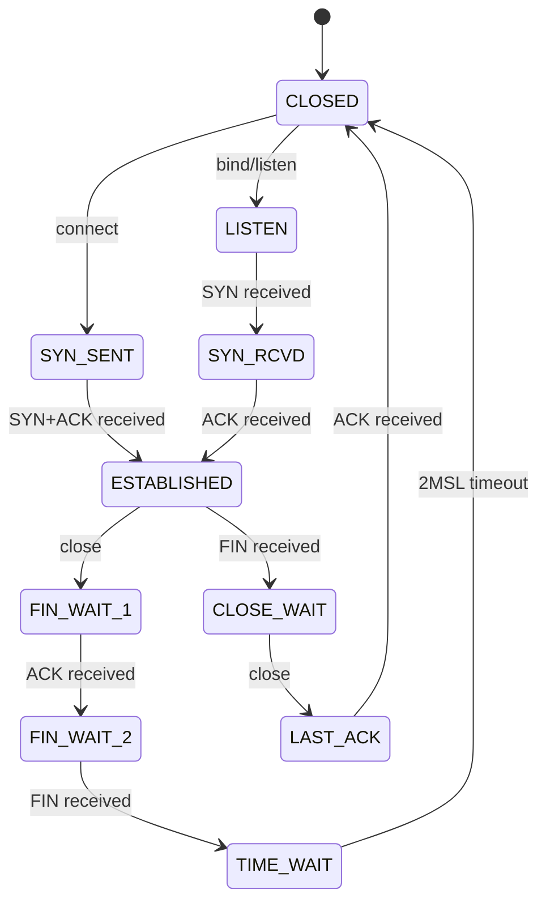

# 網路編程

> 本章涵蓋 C++ 網路編程基礎與進階技術,包括 TCP/UDP、I/O 多路復用、零拷貝、io_uring 等,是構建低延遲交易系統的關鍵。

---

## 目錄

> **HFT 學習優先級**: ⭐⭐⭐ 必看 | ⭐⭐ 建議 | ⭐ 有空再看

1. [TCP 基礎](#1-tcp-基礎) ⭐⭐
2. [非阻塞 I/O](#2-非阻塞-io) ⭐⭐⭐
3. [I/O 多路復用](#3-io-多路復用) ⭐⭐⭐
4. [零拷貝技術](#4-零拷貝技術) ⭐⭐⭐
5. [TCP 調優](#5-tcp-調優) ⭐⭐⭐
6. [UDP 編程](#6-udp-編程) ⭐⭐⭐
7. [io_uring 進階](#7-io_uring-進階) ⭐⭐⭐
8. [延遲優化](#8-延遲優化) ⭐⭐⭐

---

## 1. TCP 基礎

### 1.1 TCP 客戶端

```cpp
#include <sys/socket.h>
#include <netinet/in.h>
#include <arpa/inet.h>
#include <unistd.h>
#include <cstring>
#include <iostream>

class TCPClient {
public:
    TCPClient() : sockfd_(-1) {}

    ~TCPClient() {
        if (sockfd_ >= 0) {
            close(sockfd_);
        }
    }

    bool connect(const char* ip, int port) {
        // 創建 socket
        sockfd_ = socket(AF_INET, SOCK_STREAM, 0);
        if (sockfd_ < 0) {
            std::cerr << "Failed to create socket\n";
            return false;
        }

        // 設置服務器地址
        struct sockaddr_in server_addr;
        std::memset(&server_addr, 0, sizeof(server_addr));
        server_addr.sin_family = AF_INET;
        server_addr.sin_port = htons(port);

        if (inet_pton(AF_INET, ip, &server_addr.sin_addr) <= 0) {
            std::cerr << "Invalid address\n";
            return false;
        }

        // 連接
        if (::connect(sockfd_, (struct sockaddr*)&server_addr, sizeof(server_addr)) < 0) {
            std::cerr << "Connection failed\n";
            return false;
        }

        std::cout << "Connected to " << ip << ":" << port << "\n";
        return true;
    }

    ssize_t send(const void* data, size_t len) {
        return ::send(sockfd_, data, len, 0);
    }

    ssize_t receive(void* buffer, size_t len) {
        return ::recv(sockfd_, buffer, len, 0);
    }

private:
    int sockfd_;
};

void tcp_client_example() {
    TCPClient client;

    if (!client.connect("127.0.0.1", 8080)) {
        return;
    }

    // 發送數據
    const char* message = "Hello, Server!";
    client.send(message, std::strlen(message));

    // 接收響應
    char buffer[1024];
    ssize_t n = client.receive(buffer, sizeof(buffer) - 1);
    if (n > 0) {
        buffer[n] = '\0';
        std::cout << "Received: " << buffer << "\n";
    }
}
```

### 1.2 TCP 服務器

```cpp
#include <sys/socket.h>
#include <netinet/in.h>
#include <unistd.h>
#include <cstring>
#include <iostream>

class TCPServer {
public:
    TCPServer() : listen_fd_(-1) {}

    ~TCPServer() {
        if (listen_fd_ >= 0) {
            close(listen_fd_);
        }
    }

    bool start(int port, int backlog = 128) {
        // 創建 socket
        listen_fd_ = socket(AF_INET, SOCK_STREAM, 0);
        if (listen_fd_ < 0) {
            std::cerr << "Failed to create socket\n";
            return false;
        }

        // 設置 SO_REUSEADDR
        int opt = 1;
        setsockopt(listen_fd_, SOL_SOCKET, SO_REUSEADDR, &opt, sizeof(opt));

        // 綁定地址
        struct sockaddr_in server_addr;
        std::memset(&server_addr, 0, sizeof(server_addr));
        server_addr.sin_family = AF_INET;
        server_addr.sin_addr.s_addr = INADDR_ANY;
        server_addr.sin_port = htons(port);

        if (bind(listen_fd_, (struct sockaddr*)&server_addr, sizeof(server_addr)) < 0) {
            std::cerr << "Bind failed\n";
            return false;
        }

        // 監聽
        if (listen(listen_fd_, backlog) < 0) {
            std::cerr << "Listen failed\n";
            return false;
        }

        std::cout << "Server listening on port " << port << "\n";
        return true;
    }

    int accept_connection() {
        struct sockaddr_in client_addr;
        socklen_t addr_len = sizeof(client_addr);

        int client_fd = accept(listen_fd_, (struct sockaddr*)&client_addr, &addr_len);
        if (client_fd < 0) {
            std::cerr << "Accept failed\n";
            return -1;
        }

        std::cout << "Client connected\n";
        return client_fd;
    }

private:
    int listen_fd_;
};

void tcp_server_example() {
    TCPServer server;

    if (!server.start(8080)) {
        return;
    }

    while (true) {
        int client_fd = server.accept_connection();
        if (client_fd < 0) continue;

        // 接收數據
        char buffer[1024];
        ssize_t n = recv(client_fd, buffer, sizeof(buffer) - 1, 0);
        if (n > 0) {
            buffer[n] = '\0';
            std::cout << "Received: " << buffer << "\n";

            // 回應
            const char* response = "Hello, Client!";
            send(client_fd, response, std::strlen(response), 0);
        }

        close(client_fd);
    }
}
```

### 1.3 TCP 狀態轉換



---

## 2. 非阻塞 I/O

### 2.1 設置非阻塞模式

```cpp
#include <fcntl.h>
#include <unistd.h>
#include <iostream>

bool set_nonblocking(int fd) {
    int flags = fcntl(fd, F_GETFL, 0);
    if (flags == -1) {
        std::cerr << "fcntl F_GETFL failed\n";
        return false;
    }

    if (fcntl(fd, F_SETFL, flags | O_NONBLOCK) == -1) {
        std::cerr << "fcntl F_SETFL failed\n";
        return false;
    }

    return true;
}

void nonblocking_example() {
    int sockfd = socket(AF_INET, SOCK_STREAM, 0);

    // 設置為非阻塞
    set_nonblocking(sockfd);

    // 非阻塞 connect
    struct sockaddr_in server_addr;
    // ... 設置地址 ...

    int ret = connect(sockfd, (struct sockaddr*)&server_addr, sizeof(server_addr));
    if (ret < 0) {
        if (errno == EINPROGRESS) {
            std::cout << "Connection in progress...\n";
            // 使用 select/poll/epoll 等待連接完成
        }
    }

    close(sockfd);
}
```

---

## 3. I/O 多路復用

### 3.1 select

```cpp
#include <sys/select.h>
#include <sys/socket.h>
#include <vector>
#include <iostream>

class SelectServer {
public:
    void run(int listen_fd) {
        fd_set read_fds;
        int max_fd = listen_fd;
        std::vector<int> clients;

        while (true) {
            FD_ZERO(&read_fds);
            FD_SET(listen_fd, &read_fds);

            // 添加所有客戶端 fd
            for (int client_fd : clients) {
                FD_SET(client_fd, &read_fds);
                if (client_fd > max_fd) {
                    max_fd = client_fd;
                }
            }

            // select 等待
            int ret = select(max_fd + 1, &read_fds, nullptr, nullptr, nullptr);
            if (ret < 0) {
                std::cerr << "select failed\n";
                break;
            }

            // 檢查新連接
            if (FD_ISSET(listen_fd, &read_fds)) {
                int client_fd = accept(listen_fd, nullptr, nullptr);
                if (client_fd >= 0) {
                    clients.push_back(client_fd);
                    std::cout << "New client: " << client_fd << "\n";
                }
            }

            // 檢查客戶端數據
            for (auto it = clients.begin(); it != clients.end(); ) {
                int client_fd = *it;
                if (FD_ISSET(client_fd, &read_fds)) {
                    char buffer[1024];
                    ssize_t n = recv(client_fd, buffer, sizeof(buffer), 0);

                    if (n <= 0) {
                        // 連接關閉
                        close(client_fd);
                        it = clients.erase(it);
                        std::cout << "Client disconnected: " << client_fd << "\n";
                    } else {
                        // 處理數據
                        buffer[n] = '\0';
                        std::cout << "Received: " << buffer << "\n";
                        ++it;
                    }
                } else {
                    ++it;
                }
            }
        }
    }
};
```

### 3.2 poll

```cpp
#include <poll.h>
#include <vector>
#include <iostream>

class PollServer {
public:
    void run(int listen_fd) {
        std::vector<struct pollfd> fds;

        // 添加監聽 fd
        struct pollfd listen_pfd;
        listen_pfd.fd = listen_fd;
        listen_pfd.events = POLLIN;
        fds.push_back(listen_pfd);

        while (true) {
            int ret = poll(fds.data(), fds.size(), -1);
            if (ret < 0) {
                std::cerr << "poll failed\n";
                break;
            }

            // 檢查監聽 fd
            if (fds[0].revents & POLLIN) {
                int client_fd = accept(listen_fd, nullptr, nullptr);
                if (client_fd >= 0) {
                    struct pollfd client_pfd;
                    client_pfd.fd = client_fd;
                    client_pfd.events = POLLIN;
                    fds.push_back(client_pfd);
                    std::cout << "New client: " << client_fd << "\n";
                }
            }

            // 檢查客戶端 fd
            for (size_t i = 1; i < fds.size(); ) {
                if (fds[i].revents & POLLIN) {
                    char buffer[1024];
                    ssize_t n = recv(fds[i].fd, buffer, sizeof(buffer), 0);

                    if (n <= 0) {
                        close(fds[i].fd);
                        fds.erase(fds.begin() + i);
                    } else {
                        buffer[n] = '\0';
                        std::cout << "Received: " << buffer << "\n";
                        ++i;
                    }
                } else {
                    ++i;
                }
            }
        }
    }
};
```

### 3.3 epoll (Linux 高性能)

```cpp
#include <sys/epoll.h>
#include <unistd.h>
#include <iostream>

class EpollServer {
public:
    EpollServer() : epoll_fd_(-1) {}

    ~EpollServer() {
        if (epoll_fd_ >= 0) {
            close(epoll_fd_);
        }
    }

    bool init() {
        epoll_fd_ = epoll_create1(0);
        if (epoll_fd_ < 0) {
            std::cerr << "epoll_create1 failed\n";
            return false;
        }
        return true;
    }

    bool add_fd(int fd, uint32_t events = EPOLLIN | EPOLLET) {
        struct epoll_event ev;
        ev.events = events;
        ev.data.fd = fd;

        if (epoll_ctl(epoll_fd_, EPOLL_CTL_ADD, fd, &ev) < 0) {
            std::cerr << "epoll_ctl ADD failed\n";
            return false;
        }
        return true;
    }

    void run(int listen_fd) {
        const int MAX_EVENTS = 64;
        struct epoll_event events[MAX_EVENTS];

        // 添加監聽 fd
        add_fd(listen_fd);

        while (true) {
            int n = epoll_wait(epoll_fd_, events, MAX_EVENTS, -1);
            if (n < 0) {
                std::cerr << "epoll_wait failed\n";
                break;
            }

            for (int i = 0; i < n; ++i) {
                int fd = events[i].data.fd;

                if (fd == listen_fd) {
                    // 新連接
                    int client_fd = accept(listen_fd, nullptr, nullptr);
                    if (client_fd >= 0) {
                        set_nonblocking(client_fd);
                        add_fd(client_fd);
                        std::cout << "New client: " << client_fd << "\n";
                    }
                } else {
                    // 客戶端數據
                    char buffer[1024];
                    ssize_t len = recv(fd, buffer, sizeof(buffer), 0);

                    if (len <= 0) {
                        epoll_ctl(epoll_fd_, EPOLL_CTL_DEL, fd, nullptr);
                        close(fd);
                        std::cout << "Client disconnected: " << fd << "\n";
                    } else {
                        buffer[len] = '\0';
                        std::cout << "Received: " << buffer << "\n";
                    }
                }
            }
        }
    }

private:
    int epoll_fd_;
};
```

**I/O 多路復用對比:**

| 方法   | 最大連接數        | 性能 | 跨平台    | HFT 推薦 |
| ------ | ----------------- | ---- | --------- | -------- |
| select | 1024 (FD_SETSIZE) | 低   | 是        | 不推薦   |
| poll   | 無限制            | 中等 | 是        | 不推薦   |
| epoll  | 無限制            | 高   | Linux     | 推薦     |
| kqueue | 無限制            | 高   | BSD/macOS | 推薦     |

---

## 4. 零拷貝技術

### 4.1 sendfile

```cpp
#include <sys/sendfile.h>
#include <fcntl.h>
#include <unistd.h>
#include <iostream>

void sendfile_example(int socket_fd, const char* filename) {
    // 打開文件
    int file_fd = open(filename, O_RDONLY);
    if (file_fd < 0) {
        std::cerr << "Failed to open file\n";
        return;
    }

    // 獲取文件大小
    off_t offset = 0;
    struct stat stat_buf;
    fstat(file_fd, &stat_buf);

    // 零拷貝發送
    ssize_t sent = sendfile(socket_fd, file_fd, &offset, stat_buf.st_size);

    std::cout << "Sent " << sent << " bytes\n";

    close(file_fd);
}
```

### 4.2 mmap

```cpp
#include <sys/mman.h>
#include <fcntl.h>
#include <unistd.h>
#include <sys/stat.h>
#include <iostream>

void mmap_example(const char* filename) {
    // 打開文件
    int fd = open(filename, O_RDONLY);
    if (fd < 0) {
        std::cerr << "Failed to open file\n";
        return;
    }

    // 獲取文件大小
    struct stat sb;
    if (fstat(fd, &sb) < 0) {
        close(fd);
        return;
    }

    // 映射到內存
    void* addr = mmap(nullptr, sb.st_size, PROT_READ, MAP_PRIVATE, fd, 0);
    if (addr == MAP_FAILED) {
        std::cerr << "mmap failed\n";
        close(fd);
        return;
    }

    // 使用映射的內存 (零拷貝讀取)
    const char* data = static_cast<const char*>(addr);
    std::cout << "First 100 bytes: ";
    for (int i = 0; i < 100 && i < sb.st_size; ++i) {
        std::cout << data[i];
    }
    std::cout << "\n";

    // 解除映射
    munmap(addr, sb.st_size);
    close(fd);
}
```

---

## 5. TCP 調優

### 5.1 TCP_NODELAY (禁用 Nagle 算法)

```cpp
#include <netinet/tcp.h>

void set_tcp_nodelay(int sockfd) {
    int flag = 1;
    if (setsockopt(sockfd, IPPROTO_TCP, TCP_NODELAY, &flag, sizeof(flag)) < 0) {
        std::cerr << "Failed to set TCP_NODELAY\n";
    } else {
        std::cout << "TCP_NODELAY enabled\n";
    }
}
```

### 5.2 調整緩衝區大小

```cpp
void tune_socket_buffers(int sockfd) {
    // 發送緩衝區
    int send_buf = 1024 * 1024;  // 1MB
    setsockopt(sockfd, SOL_SOCKET, SO_SNDBUF, &send_buf, sizeof(send_buf));

    // 接收緩衝區
    int recv_buf = 1024 * 1024;  // 1MB
    setsockopt(sockfd, SOL_SOCKET, SO_RCVBUF, &recv_buf, sizeof(recv_buf));

    std::cout << "Socket buffers tuned\n";
}
```

### 5.3 系統級 TCP 調優

```bash
# 查看當前設置
sysctl -a | grep tcp

# 調整 TCP 緩衝區
sudo sysctl -w net.ipv4.tcp_rmem="4096 87380 16777216"
sudo sysctl -w net.ipv4.tcp_wmem="4096 65536 16777216"

# 啟用 TCP 快速打開 (TCP Fast Open)
sudo sysctl -w net.ipv4.tcp_fastopen=3

# 調整 backlog
sudo sysctl -w net.core.somaxconn=4096

# 永久保存
sudo vim /etc/sysctl.conf
# 添加上述配置
sudo sysctl -p
```

---

## 6. UDP 編程

### 6.1 UDP 服務器

```cpp
#include <sys/socket.h>
#include <netinet/in.h>
#include <arpa/inet.h>
#include <unistd.h>
#include <cstring>
#include <iostream>

class UDPServer {
public:
    UDPServer() : sockfd_(-1) {}

    ~UDPServer() {
        if (sockfd_ >= 0) {
            close(sockfd_);
        }
    }

    bool start(int port) {
        sockfd_ = socket(AF_INET, SOCK_DGRAM, 0);
        if (sockfd_ < 0) {
            std::cerr << "Failed to create socket\n";
            return false;
        }

        struct sockaddr_in server_addr;
        std::memset(&server_addr, 0, sizeof(server_addr));
        server_addr.sin_family = AF_INET;
        server_addr.sin_addr.s_addr = INADDR_ANY;
        server_addr.sin_port = htons(port);

        if (bind(sockfd_, (struct sockaddr*)&server_addr, sizeof(server_addr)) < 0) {
            std::cerr << "Bind failed\n";
            return false;
        }

        std::cout << "UDP server listening on port " << port << "\n";
        return true;
    }

    void run() {
        char buffer[65536];
        struct sockaddr_in client_addr;
        socklen_t addr_len = sizeof(client_addr);

        while (true) {
            ssize_t n = recvfrom(sockfd_, buffer, sizeof(buffer), 0,
                                (struct sockaddr*)&client_addr, &addr_len);

            if (n > 0) {
                buffer[n] = '\0';
                std::cout << "Received: " << buffer << "\n";

                // 回應
                const char* response = "ACK";
                sendto(sockfd_, response, std::strlen(response), 0,
                      (struct sockaddr*)&client_addr, addr_len);
            }
        }
    }

private:
    int sockfd_;
};
```

### 6.2 UDP 組播 (Multicast)

```cpp
#include <sys/socket.h>
#include <netinet/in.h>
#include <arpa/inet.h>
#include <unistd.h>
#include <cstring>
#include <iostream>

class MulticastReceiver {
public:
    bool join(const char* group_ip, int port) {
        sockfd_ = socket(AF_INET, SOCK_DGRAM, 0);
        if (sockfd_ < 0) return false;

        // 允許多個進程綁定同一端口
        int reuse = 1;
        setsockopt(sockfd_, SOL_SOCKET, SO_REUSEADDR, &reuse, sizeof(reuse));

        // 綁定
        struct sockaddr_in local_addr;
        std::memset(&local_addr, 0, sizeof(local_addr));
        local_addr.sin_family = AF_INET;
        local_addr.sin_addr.s_addr = INADDR_ANY;
        local_addr.sin_port = htons(port);

        if (bind(sockfd_, (struct sockaddr*)&local_addr, sizeof(local_addr)) < 0) {
            return false;
        }

        // 加入組播組
        struct ip_mreq mreq;
        mreq.imr_multiaddr.s_addr = inet_addr(group_ip);
        mreq.imr_interface.s_addr = INADDR_ANY;

        if (setsockopt(sockfd_, IPPROTO_IP, IP_ADD_MEMBERSHIP, &mreq, sizeof(mreq)) < 0) {
            return false;
        }

        std::cout << "Joined multicast group " << group_ip << ":" << port << "\n";
        return true;
    }

    void receive() {
        char buffer[65536];
        while (true) {
            ssize_t n = recvfrom(sockfd_, buffer, sizeof(buffer), 0, nullptr, nullptr);
            if (n > 0) {
                buffer[n] = '\0';
                std::cout << "Received: " << buffer << "\n";
            }
        }
    }

private:
    int sockfd_;
};

void multicast_example() {
    MulticastReceiver receiver;
    if (receiver.join("239.255.0.1", 12345)) {
        receiver.receive();
    }
}
```

---

## 7. io_uring 進階

### 7.1 io_uring 基礎

```cpp
#include <liburing.h>
#include <iostream>

class IoUringServer {
public:
    IoUringServer() {
        io_uring_queue_init(256, &ring_, 0);
    }

    ~IoUringServer() {
        io_uring_queue_exit(&ring_);
    }

    void submit_accept(int listen_fd) {
        struct io_uring_sqe* sqe = io_uring_get_sqe(&ring_);
        io_uring_prep_accept(sqe, listen_fd, nullptr, nullptr, 0);
        io_uring_sqe_set_data(sqe, (void*)1);  // 標記為 accept
        io_uring_submit(&ring_);
    }

    void submit_recv(int client_fd, char* buffer, size_t len) {
        struct io_uring_sqe* sqe = io_uring_get_sqe(&ring_);
        io_uring_prep_recv(sqe, client_fd, buffer, len, 0);
        io_uring_sqe_set_data(sqe, (void*)2);  // 標記為 recv
        io_uring_submit(&ring_);
    }

    void run(int listen_fd) {
        submit_accept(listen_fd);

        while (true) {
            struct io_uring_cqe* cqe;
            io_uring_wait_cqe(&ring_, &cqe);

            int type = (long)io_uring_cqe_get_data(cqe);

            if (type == 1) {
                // Accept 完成
                int client_fd = cqe->res;
                if (client_fd >= 0) {
                    std::cout << "New client: " << client_fd << "\n";

                    char* buffer = new char[1024];
                    submit_recv(client_fd, buffer, 1024);
                }
                submit_accept(listen_fd);
            } else if (type == 2) {
                // Recv 完成
                if (cqe->res > 0) {
                    std::cout << "Received data\n";
                }
            }

            io_uring_cqe_seen(&ring_, cqe);
        }
    }

private:
    struct io_uring ring_;
};
```

---

## 8. 延遲優化

### 8.1 高精度計時

```cpp
#include <time.h>
#include <iostream>

uint64_t get_timestamp_ns() {
    struct timespec ts;
    clock_gettime(CLOCK_MONOTONIC, &ts);
    return ts.tv_sec * 1000000000ULL + ts.tv_nsec;
}

void measure_latency() {
    uint64_t start = get_timestamp_ns();

    // 執行操作
    // ...

    uint64_t end = get_timestamp_ns();
    uint64_t latency_ns = end - start;

    std::cout << "Latency: " << latency_ns << " ns\n";
}
```

### 8.2 RDTSC (讀取時間戳計數器)

```cpp
#include <x86intrin.h>
#include <iostream>

inline uint64_t rdtsc() {
    return __rdtsc();
}

void rdtsc_example() {
    uint64_t start = rdtsc();

    // 執行操作
    volatile int x = 0;
    for (int i = 0; i < 1000; ++i) {
        x += i;
    }

    uint64_t end = rdtsc();
    uint64_t cycles = end - start;

    std::cout << "Cycles: " << cycles << "\n";
}
```

---

## 總結

本章涵蓋了網路編程的核心技術:

1. **TCP 基礎**: 客戶端、服務器、狀態轉換
2. **非阻塞 I/O**: fcntl 設置
3. **I/O 多路復用**: select、poll、epoll
4. **零拷貝**: sendfile、mmap
5. **TCP 調優**: TCP_NODELAY、緩衝區
6. **UDP**: 基礎、組播
7. **io_uring**: 現代異步 I/O
8. **延遲優化**: 高精度計時、RDTSC

**HFT 網路編程最佳實踐:**

1. 使用 epoll (Linux) 或 kqueue (BSD)
2. 啟用 TCP_NODELAY
3. 調整 socket 緩衝區
4. 使用非阻塞 I/O
5. 考慮 UDP 組播接收市場數據
6. 測量 P99/P999 延遲

**性能對比:**

| 技術     | 延遲 | 吞吐量 | 複雜度 | HFT 推薦 |
| -------- | ---- | ------ | ------ | -------- |
| 阻塞 I/O | 高   | 低     | 低     | 不推薦   |
| select   | 中等 | 中等   | 低     | 不推薦   |
| epoll    | 低   | 高     | 中等   | 推薦     |
| io_uring | 極低 | 極高   | 高     | 推薦     |

---

## 參考資料 (References)

1. [Linux Socket Programming](https://man7.org/linux/man-pages/man7/socket.7.html)
2. [epoll Documentation](https://man7.org/linux/man-pages/man7/epoll.7.html)
3. [io_uring Introduction](https://kernel.dk/io_uring.pdf)
4. Stevens, W. Richard. "UNIX Network Programming" (2003)
5. [TCP Tuning Guide](https://fasterdata.es.net/network-tuning/linux/)
