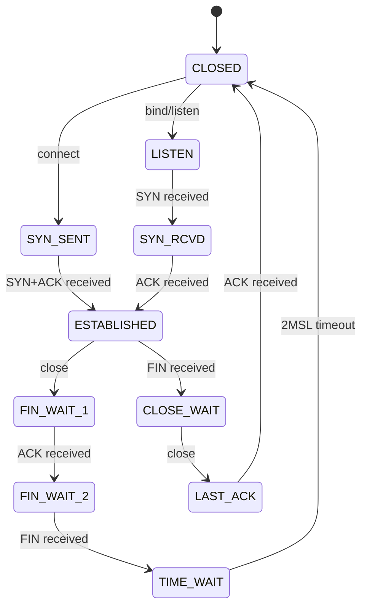
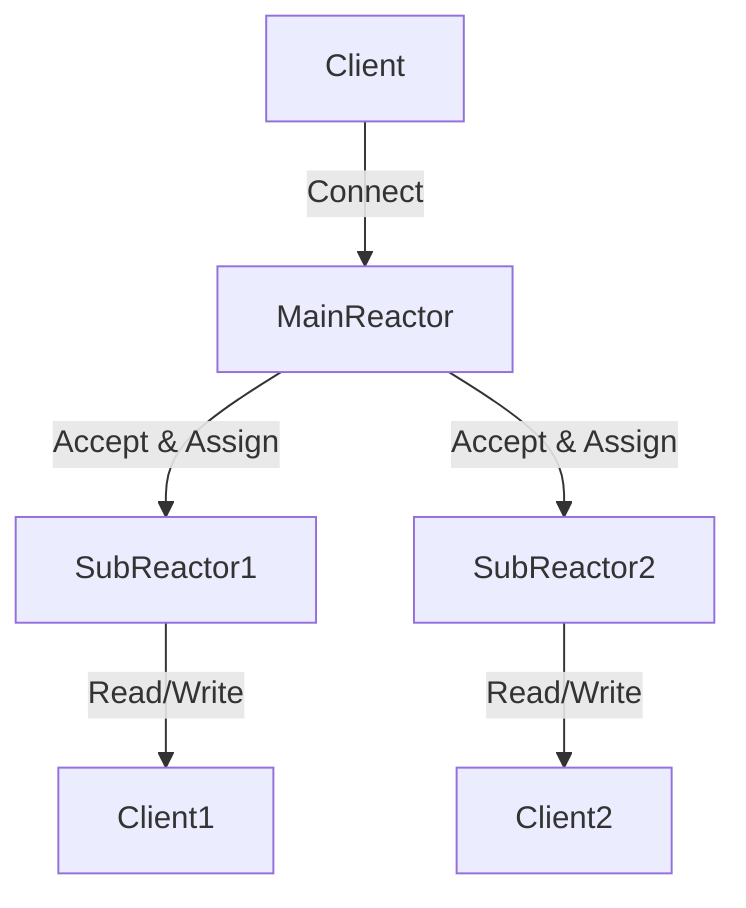

# 網路編程

> 本章涵蓋 C++ 網路編程基礎與進階技術,包括 TCP/UDP、I/O 多路復用、零拷貝、io_uring 等,是構建低延遲交易系統的關鍵。

---

## 目錄

> **HFT 學習優先級**: ⭐⭐⭐ 必看 | ⭐⭐ 建議 | ⭐ 有空再看

1. [TCP 基礎](#1-tcp-基礎) ⭐⭐
2. [網路 I/O 模型](#2-網路-io-模型) ⭐⭐⭐
3. [Epoll 深度解析](#3-epoll-深度解析) ⭐⭐⭐
4. [Reactor 模式](#4-reactor-模式) ⭐⭐⭐
5. [Proactor 與 io_uring](#5-proactor-與-io_uring) ⭐⭐⭐
6. [零拷貝技術](#6-零拷貝技術) ⭐⭐⭐
7. [TCP 調優](#7-tcp-調優) ⭐⭐⭐
8. [UDP 編程](#8-udp-編程) ⭐⭐⭐
9. [延遲優化](#9-延遲優化) ⭐⭐⭐

---

## 1. TCP 基礎

### 1.1 TCP 客戶端

```cpp
#include <sys/socket.h>
#include <netinet/in.h>
#include <arpa/inet.h>
#include <unistd.h>
#include <cstring>
#include <iostream>

class TCPClient {
public:
    TCPClient() : sockfd_(-1) {}

    ~TCPClient() {
        if (sockfd_ >= 0) {
            close(sockfd_);
        }
    }

    bool connect(const char* ip, int port) {
        // 創建 socket
        sockfd_ = socket(AF_INET, SOCK_STREAM, 0);
        if (sockfd_ < 0) {
            std::cerr << "Failed to create socket\n";
            return false;
        }

        // 設置服務器地址
        struct sockaddr_in server_addr;
        std::memset(&server_addr, 0, sizeof(server_addr));
        server_addr.sin_family = AF_INET;
        server_addr.sin_port = htons(port);

        if (inet_pton(AF_INET, ip, &server_addr.sin_addr) <= 0) {
            std::cerr << "Invalid address\n";
            return false;
        }

        // 連接
        if (::connect(sockfd_, (struct sockaddr*)&server_addr, sizeof(server_addr)) < 0) {
            std::cerr << "Connection failed\n";
            return false;
        }

        std::cout << "Connected to " << ip << ":" << port << "\n";
        return true;
    }

    ssize_t send(const void* data, size_t len) {
        return ::send(sockfd_, data, len, 0);
    }

    ssize_t receive(void* buffer, size_t len) {
        return ::recv(sockfd_, buffer, len, 0);
    }

private:
    int sockfd_;
};

void tcp_client_example() {
    TCPClient client;

    if (!client.connect("127.0.0.1", 8080)) {
        return;
    }

    // 發送數據
    const char* message = "Hello, Server!";
    client.send(message, std::strlen(message));

    // 接收響應
    char buffer[1024];
    ssize_t n = client.receive(buffer, sizeof(buffer) - 1);
    if (n > 0) {
        buffer[n] = '\0';
        std::cout << "Received: " << buffer << "\n";
    }
}
```

### 1.2 TCP 服務器

```cpp
#include <sys/socket.h>
#include <netinet/in.h>
#include <unistd.h>
#include <cstring>
#include <iostream>

class TCPServer {
public:
    TCPServer() : listen_fd_(-1) {}

    ~TCPServer() {
        if (listen_fd_ >= 0) {
            close(listen_fd_);
        }
    }

    bool start(int port, int backlog = 128) {
        // 創建 socket
        listen_fd_ = socket(AF_INET, SOCK_STREAM, 0);
        if (listen_fd_ < 0) {
            std::cerr << "Failed to create socket\n";
            return false;
        }

        // 設置 SO_REUSEADDR
        int opt = 1;
        setsockopt(listen_fd_, SOL_SOCKET, SO_REUSEADDR, &opt, sizeof(opt));

        // 綁定地址
        struct sockaddr_in server_addr;
        std::memset(&server_addr, 0, sizeof(server_addr));
        server_addr.sin_family = AF_INET;
        server_addr.sin_addr.s_addr = INADDR_ANY;
        server_addr.sin_port = htons(port);

        if (bind(listen_fd_, (struct sockaddr*)&server_addr, sizeof(server_addr)) < 0) {
            std::cerr << "Bind failed\n";
            return false;
        }

        // 監聽
        if (listen(listen_fd_, backlog) < 0) {
            std::cerr << "Listen failed\n";
            return false;
        }

        std::cout << "Server listening on port " << port << "\n";
        return true;
    }

    int accept_connection() {
        struct sockaddr_in client_addr;
        socklen_t addr_len = sizeof(client_addr);

        int client_fd = accept(listen_fd_, (struct sockaddr*)&client_addr, &addr_len);
        if (client_fd < 0) {
            std::cerr << "Accept failed\n";
            return -1;
        }

        std::cout << "Client connected\n";
        return client_fd;
    }

private:
    int listen_fd_;
};

void tcp_server_example() {
    TCPServer server;

    if (!server.start(8080)) {
        return;
    }

    while (true) {
        int client_fd = server.accept_connection();
        if (client_fd < 0) continue;

        // 接收數據
        char buffer[1024];
        ssize_t n = recv(client_fd, buffer, sizeof(buffer) - 1, 0);
        if (n > 0) {
            buffer[n] = '\0';
            std::cout << "Received: " << buffer << "\n";

            // 回應
            const char* response = "Hello, Client!";
            send(client_fd, response, std::strlen(response), 0);
        }

        close(client_fd);
    }
}
```

### 1.3 TCP 狀態轉換



---

## 2. 網路 I/O 模型

Unix 下有五種主要的 I/O 模型:

1.  **阻塞 I/O (Blocking I/O)**:

    - 默認模式。
    - 調用 `recv` 時,如果無數據,線程被掛起,直到數據到達。
    - **缺點**: 無法處理高並發,每個連接需要一個線程。

2.  **非阻塞 I/O (Non-blocking I/O)**:

    - 設置 `O_NONBLOCK`。
    - 調用 `recv` 時,如果無數據,立即返回 `EWOULDBLOCK` 錯誤。
    - **缺點**: 需要輪詢 (Busy Loop),浪費 CPU。

3.  **I/O 多路復用 (I/O Multiplexing)**:

    - 使用 `select`/`poll`/`epoll`。
    - 一個線程監控多個 FD。
    - 當某個 FD 就緒時,通知應用程序進行處理。
    - **優點**: 高並發,單線程處理成千上萬個連接。

4.  **信號驅動 I/O (Signal-driven I/O)**:

    - 利用信號通知 (SIGIO)。
    - 較少使用。

5.  **異步 I/O (Asynchronous I/O)**:
    - 告訴內核啟動操作,並在整個操作完成(包括將數據從內核複製到用戶空間)後通知我們。
    - `io_uring` 是 Linux 下真正的異步 I/O 實現。

### 2.1 I/O 模型對比總結

| 模型                    | 阻塞 (Blocking) | 非阻塞 (Non-blocking)  | 多路復用 (Multiplexing) | 異步 (Async I/O)      |
| :---------------------- | :-------------- | :--------------------- | :---------------------- | :-------------------- |
| **第一階段** (等待數據) | 阻塞            | 立即返回 (EWOULDBLOCK) | 阻塞 (select/epoll)     | 立即返回              |
| **第二階段** (複製數據) | 阻塞            | 阻塞                   | 阻塞                    | **不阻塞** (內核完成) |
| **編程難度**            | 低              | 中                     | 中                      | 高                    |
| **適用場景**            | 低並發          | 輪詢 (不推薦)          | **高並發 (主流)**       | **極致性能 (HFT)**    |

---

## 3. Epoll 深度解析

`epoll` 是 Linux 特有的 I/O 多路復用機制,是構建高性能服務器(如 Nginx, Redis)的基石。

### 3.1 核心數據結構

內核在 `epoll_create` 時會創建一個 `eventpoll` 結構體,包含兩個核心數據結構:

1.  **紅黑樹 (Red-Black Tree)**:

    - 用於存儲所有待監控的 File Descriptors (FD)。
    - 支持高效的插入、刪除和查找 (O(log N))。
    - 相比 `select`/`poll` 的數組/鏈表結構,`epoll` 在管理大量連接時效率極高。

2.  **就緒鏈表 (Ready List)**:
    - 雙向鏈表,存儲當前已經就緒(有事件發生)的 FD。
    - 當網卡收到數據,中斷處理程序會通過回調將對應的 FD 加入就緒鏈表。
    - `epoll_wait` 需要檢查這個鏈表是否為空,**時間複雜度為 O(1)** (與監控的連接總數無關)。

### 3.2 觸發模式: LT vs ET

這是 `epoll` 最重要的概念,直接影響編程模型。

#### Level Triggered (LT) - 水平觸發

- **默認模式**。
- **機制**: 只要 FD 還有數據沒讀完,每次調用 `epoll_wait` 都會返回該 FD。
- **優點**: 編程簡單,不易丟失數據。
- **缺點**: 如果數據量大,需要多次系統調用才能讀完,可能導致 "驚群" 或不必要的喚醒。

#### Edge Triggered (ET) - 邊緣觸發

- **高性能模式** (HFT 推薦)。
- **機制**: 只有 FD 狀態**發生變化**時(從無數據變有數據)才通知一次。如果不一次性讀完,下次 `epoll_wait` **不會**再通知,直到有新數據到達。
- **要求**:
  1.  必須將 FD 設置為**非阻塞 (Non-blocking)**。
  2.  必須循環調用 `read/recv` 直到返回 `EAGAIN` 或 `EWOULDBLOCK`,確保讀空緩衝區。
- **優點**: 減少系統調用次數,並發效率更高。
- **缺點**: 編程複雜,容易產生 "死連接" (數據沒讀完但不再通知)。

### 3.3 Epoll Server 實現 (ET 模式)

```cpp
#include <sys/epoll.h>
#include <fcntl.h>
#include <unistd.h>
#include <iostream>
#include <vector>
#include <cstring>

class EpollServer {
public:
    // ... init ...

    bool add_fd(int fd, uint32_t events) {
        // 設置非阻塞
        int flags = fcntl(fd, F_GETFL, 0);
        fcntl(fd, F_SETFL, flags | O_NONBLOCK);

        struct epoll_event ev;
        ev.events = events | EPOLLET; // 強制開啟 ET 模式
        ev.data.fd = fd;
        return epoll_ctl(epoll_fd_, EPOLL_CTL_ADD, fd, &ev) == 0;
    }

    void run(int listen_fd) {
        struct epoll_event events[64];
        add_fd(listen_fd, EPOLLIN); // 監聽 socket 也用 ET

        while (true) {
            int n = epoll_wait(epoll_fd_, events, 64, -1);

            for (int i = 0; i < n; ++i) {
                int fd = events[i].data.fd;

                if (fd == listen_fd) {
                    // ET 模式下 accept 需要循環直到為空
                    while (true) {
                        int client_fd = accept(listen_fd, nullptr, nullptr);
                        if (client_fd < 0) {
                            if (errno == EAGAIN || errno == EWOULDBLOCK) break; // 處理完畢
                            else { perror("accept"); break; }
                        }
                        add_fd(client_fd, EPOLLIN);
                    }
                } else {
                    // ET 模式下 recv 需要循環直到為空
                    handle_client_data(fd);
                }
            }
        }
    }

    void handle_client_data(int fd) {
        char buffer[1024];
        while (true) {
            ssize_t len = recv(fd, buffer, sizeof(buffer), 0);
            if (len < 0) {
                if (errno == EAGAIN || errno == EWOULDBLOCK) break; // 讀完了
                else { close(fd); break; } // 錯誤
            } else if (len == 0) {
                close(fd); break; // 對方關閉
            } else {
                // 處理數據
            }
        }
    }

private:
    int epoll_fd_;
};
```

---

## 4. Reactor 模式

Reactor 是處理高並發連接的標準設計模式。

### 4.1 核心概念

- **Reactor (反應堆)**: 負責監聽和分發事件 (Event Loop)。
- **Handler (處理器)**: 負責處理具體的 I/O 事件 (Read, Decode, Compute, Encode, Write)。

### 4.2 單 Reactor 單線程

- **架構**: 一個線程完成所有工作 (epoll_wait -> accept -> read -> decode -> compute -> encode -> write)。
- **優點**: 無鎖,簡單,無上下文切換。
- **缺點**: 無法利用多核,計算密集型任務會阻塞 I/O。
- **適用**: Redis (早期版本), 輕量級業務。

### 4.3 多 Reactor 多線程 (Master-Slave)

這是 HFT 和高性能網關(如 Netty, Memcached, Nginx) 的標準架構。

- **Main Reactor (Master)**:
  - 只負責監聽 `listen_fd`。
  - 收到連接請求後,`accept` 新連接。
  - 將新連接分配(Round Robin)給 Sub Reactor。
- **Sub Reactor (Slave/Worker)**:
  - 每個 Sub Reactor 有獨立的 Event Loop (epoll)。
  - 負責已連接 Socket 的讀寫和業務處理。
  - 通常線程數 = CPU 核心數。



**代碼結構示例:**

```cpp
class SubReactor {
public:
    void add_connection(int fd) {
        // 通過隊列或 socketpair 通知子線程的 epoll 循環
        // 將 fd 加入 epoll 監聽
    }
    void loop() {
        while(running) {
            epoll_wait(...);
            // 處理讀寫事件
        }
    }
};

class MainReactor {
    std::vector<std::unique_ptr<SubReactor>> workers_;
    int next_worker_ = 0;

public:
    void on_accept(int client_fd) {
        // Round Robin 分配
        workers_[next_worker_]->add_connection(client_fd);
        next_worker_ = (next_worker_ + 1) % workers_.size();
    }
};
```

---

## 5. Proactor 與 io_uring

### 5.1 Proactor 模式

- **機制**: 異步 I/O。應用程序發起 I/O 請求後立即返回,內核負責數據傳輸,完成後通知應用程序。
- **區別**:
  - Reactor: "來了數據,你自己讀" (數據在內核緩衝區)。
  - Proactor: "數據讀好了,給你" (數據在用戶緩衝區)。
- **優勢**: 真正的零拷貝,CPU 利用率更高。

### 5.2 Reactor vs Proactor 對比

| 特性           | Reactor (epoll)       | Proactor (io_uring)           |
| :------------- | :-------------------- | :---------------------------- |
| **通知機制**   | 就緒通知 (Ready)      | 完成通知 (Completion)         |
| **數據讀取**   | 應用程序負責 `read()` | 內核負責,直接寫入 Buffer      |
| **系統調用**   | 每次事件至少一次      | 可批量提交 (Batch Submission) |
| **內存拷貝**   | 內核 -> 用戶 (read)   | **零拷貝** (Shared Memory)    |
| **延遲**       | 低 (~1-5μs)           | **極低** (~0.5-2μs)           |
| **HFT 適用性** | ✅ 主流選擇           | ✅ 未來趨勢 (更優)            |

### 5.2 io_uring 深度解析

`io_uring` (Linux 5.1+) 是 Linux I/O 的革命性進化,性能遠超 epoll。

#### 核心架構: 雙環形緩衝區 (Ring Buffers)

1.  **Submission Queue (SQ)**: 應用程序生產 I/O 請求,內核消費。
2.  **Completion Queue (CQ)**: 內核生產完成事件,應用程序消費。
3.  **共享內存**: SQ 和 CQ 都在用戶態和內核態共享的內存中,**消除了系統調用的內存拷貝開銷**。

#### 零拷貝機制

- 傳統 `read()`: 用戶態 -> 內核態 (syscall) -> 數據拷貝 -> 返回。
- `io_uring`:
  1.  App 將請求寫入 SQ (內存操作,無 syscall)。
  2.  (可選) 內核線程輪詢 SQ,自動處理請求。
  3.  內核將數據直接寫入用戶緩衝區。
  4.  內核將結果寫入 CQ。
  5.  App 從 CQ 讀取結果。

#### io_uring Echo Server 示例

```cpp
#include <liburing.h>
// ... includes ...

struct Request {
    int fd;
    char buffer[1024];
    // ...
};

class IoUringServer {
    struct io_uring ring;

public:
    void init() {
        io_uring_queue_init(4096, &ring, 0);
    }

    void submit_read(int fd) {
        struct io_uring_sqe *sqe = io_uring_get_sqe(&ring);
        Request* req = new Request{fd};

        // 準備異步讀取
        io_uring_prep_read(sqe, fd, req->buffer, 1024, 0);
        io_uring_sqe_set_data(sqe, req); // 綁定上下文

        io_uring_submit(&ring);
    }

    void loop() {
        struct io_uring_cqe *cqe;
        while (true) {
            // 等待完成事件
            io_uring_wait_cqe(&ring, &cqe);

            Request* req = (Request*)io_uring_cqe_get_data(cqe);
            if (cqe->res > 0) {
                // 讀取成功, req->buffer 裡已經有數據了!
                // 處理數據...

                // 繼續讀
                submit_read(req->fd);
            }

            io_uring_cqe_seen(&ring, cqe);
        }
    }
};
```

---

---

## 6. 零拷貝技術

### 4.1 sendfile

```cpp
#include <sys/sendfile.h>
#include <fcntl.h>
#include <unistd.h>
#include <iostream>

void sendfile_example(int socket_fd, const char* filename) {
    // 打開文件
    int file_fd = open(filename, O_RDONLY);
    if (file_fd < 0) {
        std::cerr << "Failed to open file\n";
        return;
    }

    // 獲取文件大小
    off_t offset = 0;
    struct stat stat_buf;
    fstat(file_fd, &stat_buf);

    // 零拷貝發送
    ssize_t sent = sendfile(socket_fd, file_fd, &offset, stat_buf.st_size);

    std::cout << "Sent " << sent << " bytes\n";

    close(file_fd);
}
```

### 4.2 mmap

```cpp
#include <sys/mman.h>
#include <fcntl.h>
#include <unistd.h>
#include <sys/stat.h>
#include <iostream>

void mmap_example(const char* filename) {
    // 打開文件
    int fd = open(filename, O_RDONLY);
    if (fd < 0) {
        std::cerr << "Failed to open file\n";
        return;
    }

    // 獲取文件大小
    struct stat sb;
    if (fstat(fd, &sb) < 0) {
        close(fd);
        return;
    }

    // 映射到內存
    void* addr = mmap(nullptr, sb.st_size, PROT_READ, MAP_PRIVATE, fd, 0);
    if (addr == MAP_FAILED) {
        std::cerr << "mmap failed\n";
        close(fd);
        return;
    }

    // 使用映射的內存 (零拷貝讀取)
    const char* data = static_cast<const char*>(addr);
    std::cout << "First 100 bytes: ";
    for (int i = 0; i < 100 && i < sb.st_size; ++i) {
        std::cout << data[i];
    }
    std::cout << "\n";

    // 解除映射
    munmap(addr, sb.st_size);
    close(fd);
}
```

---

## 7. TCP 調優

### 5.1 TCP_NODELAY (禁用 Nagle 算法)

```cpp
#include <netinet/tcp.h>

void set_tcp_nodelay(int sockfd) {
    int flag = 1;
    if (setsockopt(sockfd, IPPROTO_TCP, TCP_NODELAY, &flag, sizeof(flag)) < 0) {
        std::cerr << "Failed to set TCP_NODELAY\n";
    } else {
        std::cout << "TCP_NODELAY enabled\n";
    }
}
```

### 5.2 調整緩衝區大小

```cpp
void tune_socket_buffers(int sockfd) {
    // 發送緩衝區
    int send_buf = 1024 * 1024;  // 1MB
    setsockopt(sockfd, SOL_SOCKET, SO_SNDBUF, &send_buf, sizeof(send_buf));

    // 接收緩衝區
    int recv_buf = 1024 * 1024;  // 1MB
    setsockopt(sockfd, SOL_SOCKET, SO_RCVBUF, &recv_buf, sizeof(recv_buf));

    std::cout << "Socket buffers tuned\n";
}
```

### 5.3 系統級 TCP 調優

```bash
# 查看當前設置
sysctl -a | grep tcp

# 調整 TCP 緩衝區
sudo sysctl -w net.ipv4.tcp_rmem="4096 87380 16777216"
sudo sysctl -w net.ipv4.tcp_wmem="4096 65536 16777216"

# 啟用 TCP 快速打開 (TCP Fast Open)
sudo sysctl -w net.ipv4.tcp_fastopen=3

# 調整 backlog
sudo sysctl -w net.core.somaxconn=4096

# 永久保存
sudo vim /etc/sysctl.conf
# 添加上述配置
sudo sysctl -p
```

---

## 8. UDP 編程

### 6.1 UDP 服務器

```cpp
#include <sys/socket.h>
#include <netinet/in.h>
#include <arpa/inet.h>
#include <unistd.h>
#include <cstring>
#include <iostream>

class UDPServer {
public:
    UDPServer() : sockfd_(-1) {}

    ~UDPServer() {
        if (sockfd_ >= 0) {
            close(sockfd_);
        }
    }

    bool start(int port) {
        sockfd_ = socket(AF_INET, SOCK_DGRAM, 0);
        if (sockfd_ < 0) {
            std::cerr << "Failed to create socket\n";
            return false;
        }

        struct sockaddr_in server_addr;
        std::memset(&server_addr, 0, sizeof(server_addr));
        server_addr.sin_family = AF_INET;
        server_addr.sin_addr.s_addr = INADDR_ANY;
        server_addr.sin_port = htons(port);

        if (bind(sockfd_, (struct sockaddr*)&server_addr, sizeof(server_addr)) < 0) {
            std::cerr << "Bind failed\n";
            return false;
        }

        std::cout << "UDP server listening on port " << port << "\n";
        return true;
    }

    void run() {
        char buffer[65536];
        struct sockaddr_in client_addr;
        socklen_t addr_len = sizeof(client_addr);

        while (true) {
            ssize_t n = recvfrom(sockfd_, buffer, sizeof(buffer), 0,
                                (struct sockaddr*)&client_addr, &addr_len);

            if (n > 0) {
                buffer[n] = '\0';
                std::cout << "Received: " << buffer << "\n";

                // 回應
                const char* response = "ACK";
                sendto(sockfd_, response, std::strlen(response), 0,
                      (struct sockaddr*)&client_addr, addr_len);
            }
        }
    }

private:
    int sockfd_;
};
```

### 6.2 UDP 組播 (Multicast)

```cpp
#include <sys/socket.h>
#include <netinet/in.h>
#include <arpa/inet.h>
#include <unistd.h>
#include <cstring>
#include <iostream>

class MulticastReceiver {
public:
    bool join(const char* group_ip, int port) {
        sockfd_ = socket(AF_INET, SOCK_DGRAM, 0);
        if (sockfd_ < 0) return false;

        // 允許多個進程綁定同一端口
        int reuse = 1;
        setsockopt(sockfd_, SOL_SOCKET, SO_REUSEADDR, &reuse, sizeof(reuse));

        // 綁定
        struct sockaddr_in local_addr;
        std::memset(&local_addr, 0, sizeof(local_addr));
        local_addr.sin_family = AF_INET;
        local_addr.sin_addr.s_addr = INADDR_ANY;
        local_addr.sin_port = htons(port);

        if (bind(sockfd_, (struct sockaddr*)&local_addr, sizeof(local_addr)) < 0) {
            return false;
        }

        // 加入組播組
        struct ip_mreq mreq;
        mreq.imr_multiaddr.s_addr = inet_addr(group_ip);
        mreq.imr_interface.s_addr = INADDR_ANY;

        if (setsockopt(sockfd_, IPPROTO_IP, IP_ADD_MEMBERSHIP, &mreq, sizeof(mreq)) < 0) {
            return false;
        }

        std::cout << "Joined multicast group " << group_ip << ":" << port << "\n";
        return true;
    }

    void receive() {
        char buffer[65536];
        while (true) {
            ssize_t n = recvfrom(sockfd_, buffer, sizeof(buffer), 0, nullptr, nullptr);
            if (n > 0) {
                buffer[n] = '\0';
                std::cout << "Received: " << buffer << "\n";
            }
        }
    }

private:
    int sockfd_;
};

void multicast_example() {
    MulticastReceiver receiver;
    if (receiver.join("239.255.0.1", 12345)) {
        receiver.receive();
    }
}
```

---

## 7. io_uring 進階

### 7.1 io_uring 基礎

```cpp
#include <liburing.h>
#include <iostream>

class IoUringServer {
public:
    IoUringServer() {
        io_uring_queue_init(256, &ring_, 0);
    }

    ~IoUringServer() {
        io_uring_queue_exit(&ring_);
    }

    void submit_accept(int listen_fd) {
        struct io_uring_sqe* sqe = io_uring_get_sqe(&ring_);
        io_uring_prep_accept(sqe, listen_fd, nullptr, nullptr, 0);
        io_uring_sqe_set_data(sqe, (void*)1);  // 標記為 accept
        io_uring_submit(&ring_);
    }

    void submit_recv(int client_fd, char* buffer, size_t len) {
        struct io_uring_sqe* sqe = io_uring_get_sqe(&ring_);
        io_uring_prep_recv(sqe, client_fd, buffer, len, 0);
        io_uring_sqe_set_data(sqe, (void*)2);  // 標記為 recv
        io_uring_submit(&ring_);
    }

    void run(int listen_fd) {
        submit_accept(listen_fd);

        while (true) {
            struct io_uring_cqe* cqe;
            io_uring_wait_cqe(&ring_, &cqe);

            int type = (long)io_uring_cqe_get_data(cqe);

            if (type == 1) {
                // Accept 完成
                int client_fd = cqe->res;
                if (client_fd >= 0) {
                    std::cout << "New client: " << client_fd << "\n";

                    char* buffer = new char[1024];
                    submit_recv(client_fd, buffer, 1024);
                }
                submit_accept(listen_fd);
            } else if (type == 2) {
                // Recv 完成
                if (cqe->res > 0) {
                    std::cout << "Received data\n";
                }
            }

            io_uring_cqe_seen(&ring_, cqe);
        }
    }

private:
    struct io_uring ring_;
};
```

---

## 8. 延遲優化

### 8.1 高精度計時

```cpp
#include <time.h>
#include <iostream>

uint64_t get_timestamp_ns() {
    struct timespec ts;
    clock_gettime(CLOCK_MONOTONIC, &ts);
    return ts.tv_sec * 1000000000ULL + ts.tv_nsec;
}

void measure_latency() {
    uint64_t start = get_timestamp_ns();

    // 執行操作
    // ...

    uint64_t end = get_timestamp_ns();
    uint64_t latency_ns = end - start;

    std::cout << "Latency: " << latency_ns << " ns\n";
}
```

### 8.2 RDTSC (讀取時間戳計數器)

```cpp
#include <x86intrin.h>
#include <iostream>

inline uint64_t rdtsc() {
    return __rdtsc();
}

void rdtsc_example() {
    uint64_t start = rdtsc();

    // 執行操作
    volatile int x = 0;
    for (int i = 0; i < 1000; ++i) {
        x += i;
    }

    uint64_t end = rdtsc();
    uint64_t cycles = end - start;

    std::cout << "Cycles: " << cycles << "\n";
}
```

---

## 總結

本章涵蓋了網路編程的核心技術:

1. **TCP 基礎**: 客戶端、服務器、狀態轉換
2. **非阻塞 I/O**: fcntl 設置
3. **I/O 多路復用**: select、poll、epoll
4. **零拷貝**: sendfile、mmap
5. **TCP 調優**: TCP_NODELAY、緩衝區
6. **UDP**: 基礎、組播
7. **io_uring**: 現代異步 I/O
8. **延遲優化**: 高精度計時、RDTSC

**HFT 網路編程最佳實踐:**

1. 使用 epoll (Linux) 或 kqueue (BSD)
2. 啟用 TCP_NODELAY
3. 調整 socket 緩衝區
4. 使用非阻塞 I/O
5. 考慮 UDP 組播接收市場數據
6. 測量 P99/P999 延遲

**性能對比:**

| 技術     | 延遲 | 吞吐量 | 複雜度 | HFT 推薦 |
| -------- | ---- | ------ | ------ | -------- |
| 阻塞 I/O | 高   | 低     | 低     | 不推薦   |
| select   | 中等 | 中等   | 低     | 不推薦   |
| epoll    | 低   | 高     | 中等   | 推薦     |
| io_uring | 極低 | 極高   | 高     | 推薦     |

---

## 參考資料 (References)

1. [Linux Socket Programming](https://man7.org/linux/man-pages/man7/socket.7.html)
2. [epoll Documentation](https://man7.org/linux/man-pages/man7/epoll.7.html)
3. [io_uring Introduction](https://kernel.dk/io_uring.pdf)
4. Stevens, W. Richard. "UNIX Network Programming" (2003)
5. [TCP Tuning Guide](https://fasterdata.es.net/network-tuning/linux/)
