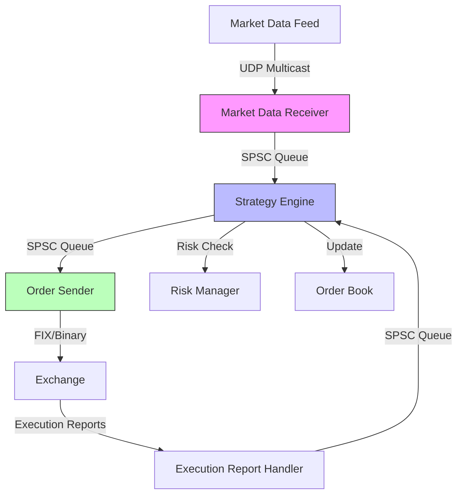

# 金融交易系統專題

> 本章涵蓋金融交易系統的核心組件,包括 FIX 協議、市場數據處理、訂單簿實現、風險管理等,是構建完整 HFT 系統的關鍵。

---

## 目錄

> **HFT 學習優先級**: ⭐⭐⭐ 必看 | ⭐⭐ 建議 | ⭐ 有空再看

1. [FIX 協議](#1-fix-協議) ⭐⭐⭐
2. [市場數據處理](#2-市場數據處理) ⭐⭐⭐
3. [訂單簿實現](#3-訂單簿實現) ⭐⭐⭐
4. [風險管理](#4-風險管理) ⭐⭐⭐
5. [HFT 系統架構](#5-hft-系統架構) ⭐⭐⭐
6. [完整系統實現](#6-完整系統實現) ⭐⭐⭐

---

## 1. FIX 協議

### 1.0 概念解析: 什麼是 FIX 協議?

**FIX (Financial Information eXchange)** 是金融界的"通用語言"。

就像瀏覽網頁使用 HTTP 協議一樣,金融機構之間進行交易(下單、撤單、行情)都使用 FIX 協議。它定義了標準的消息格式,確保無論是用 C++ 寫的系統還是 Java 寫的系統,都能互相聽懂。

**類比**:

- **HTTP**: 瀏覽器 <-> 服務器 (傳輸網頁)
- **FIX**: 交易員 <-> 交易所 (傳輸訂單)

### 1.1 FIX 消息結構

FIX 消息由三部分組成:

- **Header**: 標準頭部 (MsgType, SenderCompID, TargetCompID 等)
- **Body**: 消息主體
- **Trailer**: CheckSum

```
8=FIX.4.4|9=178|35=D|49=SENDER|56=TARGET|34=1|52=20250121-01:23:45|
11=ORDER123|21=1|55=AAPL|54=1|60=20250121-01:23:45|38=100|40=2|44=150.50|
10=123|
```

### 1.2 FIX 消息解析

```cpp
#include <string>
#include <unordered_map>
#include <sstream>
#include <iostream>

class FIXMessage {
public:
    void parse(const std::string& message) {
        std::istringstream iss(message);
        std::string field;

        while (std::getline(iss, field, '|')) {
            size_t pos = field.find('=');
            if (pos != std::string::npos) {
                int tag = std::stoi(field.substr(0, pos));
                std::string value = field.substr(pos + 1);
                fields_[tag] = value;
            }
        }
    }

    std::string get_field(int tag) const {
        auto it = fields_.find(tag);
        return (it != fields_.end()) ? it->second : "";
    }

    std::string get_msg_type() const { return get_field(35); }
    std::string get_sender() const { return get_field(49); }
    std::string get_target() const { return get_field(56); }
    std::string get_symbol() const { return get_field(55); }
    std::string get_order_id() const { return get_field(11); }

    void print() const {
        std::cout << "MsgType: " << get_msg_type() << "\n";
        std::cout << "Sender: " << get_sender() << "\n";
        std::cout << "Target: " << get_target() << "\n";
        std::cout << "Symbol: " << get_symbol() << "\n";
        std::cout << "OrderID: " << get_order_id() << "\n";
    }

private:
    std::unordered_map<int, std::string> fields_;
};

void fix_parser_example() {
    std::string fix_msg = "8=FIX.4.4|9=178|35=D|49=SENDER|56=TARGET|"
                         "11=ORDER123|55=AAPL|54=1|38=100|40=2|44=150.50|10=123|";

    FIXMessage msg;
    msg.parse(fix_msg);
    msg.print();
}
```

### 1.3 常見 FIX 消息類型

| MsgType | 名稱                          | 用途             |
| ------- | ----------------------------- | ---------------- |
| D       | NewOrderSingle                | 新訂單           |
| F       | OrderCancelRequest            | 取消訂單         |
| G       | OrderCancelReplaceRequest     | 修改訂單         |
| 8       | ExecutionReport               | 執行報告         |
| W       | MarketDataSnapshotFullRefresh | 市場數據快照     |
| X       | MarketDataIncrementalRefresh  | 市場數據增量更新 |

### 1.4 FIX 消息構建

```cpp
#include <string>
#include <sstream>

class FIXMessageBuilder {
public:
    FIXMessageBuilder& set_msg_type(const std::string& type) {
        set_field(35, type);
        return *this;
    }

    FIXMessageBuilder& set_sender(const std::string& sender) {
        set_field(49, sender);
        return *this;
    }

    FIXMessageBuilder& set_target(const std::string& target) {
        set_field(56, target);
        return *this;
    }

    FIXMessageBuilder& set_field(int tag, const std::string& value) {
        fields_[tag] = value;
        return *this;
    }

    std::string build() {
        std::ostringstream oss;

        // Header
        oss << "8=FIX.4.4|";

        // Body
        for (const auto& [tag, value] : fields_) {
            oss << tag << "=" << value << "|";
        }

        // Trailer (簡化版,實際需要計算 CheckSum)
        oss << "10=000|";

        return oss.str();
    }

private:
    std::unordered_map<int, std::string> fields_;
};

void fix_builder_example() {
    std::string msg = FIXMessageBuilder()
        .set_msg_type("D")
        .set_sender("TRADER")
        .set_target("EXCHANGE")
        .set_field(11, "ORDER123")  // ClOrdID
        .set_field(55, "AAPL")      // Symbol
        .set_field(54, "1")         // Side (Buy)
        .set_field(38, "100")       // OrderQty
        .set_field(40, "2")         // OrdType (Limit)
        .set_field(44, "150.50")    // Price
        .build();

    std::cout << "FIX Message: " << msg << "\n";
}
```

---

## 2. 市場數據處理

### 2.0 概念解析: 為什麼用 UDP 組播?

**TCP vs UDP**:

- **TCP**: 打電話。建立連接,確認對方聽到,丟包重傳。可靠但慢。
- **UDP**: 廣播電台。發送方只管發,不管你有沒有聽到。不可靠但極快。

**組播 (Multicast)**:
交易所發送行情數據就像"廣播電台"。如果用 TCP (一對一),1000 個客戶就要發 1000 次,延遲巨大。用 UDP 組播,交易所只發一次,所有訂閱的客戶同時收到。

**HFT 選擇**: 行情數據量巨大且對延遲極度敏感,因此**必須使用 UDP 組播**。丟包了怎麼辦? 通常通過 TCP 請求快照 (Snapshot) 來修復。

### 2.1 市場數據層級

- **Level 1**: 最佳買賣價 (Best Bid/Ask)
- **Level 2**: 完整訂單簿深度
- **Level 3**: 個別訂單詳情

### 2.2 市場數據協議

常見協議:

- **ITCH** (NASDAQ)
- **MDP 3.0** (CME)
- **FAST** (FIX Adapted for Streaming)

### 2.3 市場數據結構

```cpp
#include <cstdint>
#include <string>
#include <iostream>

// Level 1 數據
struct Level1Data {
    char symbol[16];
    uint64_t timestamp;
    double bid_price;
    uint32_t bid_size;
    double ask_price;
    uint32_t ask_size;
    double last_price;
    uint32_t last_size;

    void print() const {
        std::cout << "Symbol: " << symbol << "\n";
        std::cout << "Bid: " << bid_price << " x " << bid_size << "\n";
        std::cout << "Ask: " << ask_price << " x " << ask_size << "\n";
        std::cout << "Last: " << last_price << " x " << last_size << "\n";
    }
};

// Level 2 價格層
struct PriceLevel {
    double price;
    uint32_t size;
    uint32_t num_orders;
};

struct Level2Data {
    char symbol[16];
    uint64_t timestamp;
    PriceLevel bids[10];  // Top 10 買價
    PriceLevel asks[10];  // Top 10 賣價

    void print() const {
        std::cout << "=== " << symbol << " ===\n";
        std::cout << "Asks:\n";
        for (int i = 9; i >= 0; --i) {
            if (asks[i].size > 0) {
                std::cout << "  " << asks[i].price << " x " << asks[i].size << "\n";
            }
        }
        std::cout << "Bids:\n";
        for (int i = 0; i < 10; ++i) {
            if (bids[i].size > 0) {
                std::cout << "  " << bids[i].price << " x " << bids[i].size << "\n";
            }
        }
    }
};
```

### 2.4 UDP 組播接收市場數據

```cpp
#include <sys/socket.h>
#include <netinet/in.h>
#include <arpa/inet.h>
#include <unistd.h>
#include <cstring>
#include <iostream>

class MarketDataReceiver {
public:
    bool start(const char* multicast_group, int port) {
        sockfd_ = socket(AF_INET, SOCK_DGRAM, 0);
        if (sockfd_ < 0) return false;

        // 允許地址重用
        int reuse = 1;
        setsockopt(sockfd_, SOL_SOCKET, SO_REUSEADDR, &reuse, sizeof(reuse));

        // 綁定
        struct sockaddr_in local_addr;
        std::memset(&local_addr, 0, sizeof(local_addr));
        local_addr.sin_family = AF_INET;
        local_addr.sin_addr.s_addr = INADDR_ANY;
        local_addr.sin_port = htons(port);

        if (bind(sockfd_, (struct sockaddr*)&local_addr, sizeof(local_addr)) < 0) {
            return false;
        }

        // 加入組播組
        struct ip_mreq mreq;
        mreq.imr_multiaddr.s_addr = inet_addr(multicast_group);
        mreq.imr_interface.s_addr = INADDR_ANY;

        if (setsockopt(sockfd_, IPPROTO_IP, IP_ADD_MEMBERSHIP, &mreq, sizeof(mreq)) < 0) {
            return false;
        }

        std::cout << "Listening on " << multicast_group << ":" << port << "\n";
        return true;
    }

    void receive_loop() {
        char buffer[65536];

        while (true) {
            ssize_t n = recvfrom(sockfd_, buffer, sizeof(buffer), 0, nullptr, nullptr);

            if (n > 0) {
                // 解析市場數據
                process_market_data(buffer, n);
            }
        }
    }

private:
    int sockfd_;

    void process_market_data(const char* data, size_t len) {
        // 解析並處理市場數據
        std::cout << "Received " << len << " bytes\n";
    }
};
```

---

## 3. 訂單簿實現

### 3.0 概念解析: 什麼是訂單簿 (Order Book)?

**訂單簿**是交易所的核心數據結構,記錄了所有買家和賣家的意向。

- **買單 (Bid)**: 想買的人,價格越高排越前面 (價高者得)。
- **賣單 (Ask)**: 想賣的人,價格越低排越前面 (價低者得)。
- **撮合 (Matching)**: 當 **最高買價 >= 最低賣價** 時,交易達成。

**HFT 的挑戰**: 我們需要在本地維護一個和交易所完全同步的訂單簿,以便在微秒級別內判斷市場趨勢並做出決策。

### 3.1 基本訂單簿

```cpp
#include <map>
#include <list>
#include <unordered_map>
#include <memory>
#include <iostream>

struct Order {
    uint64_t order_id;
    double price;
    uint32_t quantity;
    char side;  // 'B' or 'S'

    Order(uint64_t id, double p, uint32_t q, char s)
        : order_id(id), price(p), quantity(q), side(s) {}
};

class OrderBook {
public:
    // 添加訂單
    void add_order(uint64_t order_id, double price, uint32_t quantity, char side) {
        auto order = std::make_shared<Order>(order_id, price, quantity, side);

        if (side == 'B') {
            buy_levels_[price].push_back(order);
        } else {
            sell_levels_[price].push_back(order);
        }

        order_map_[order_id] = order;
    }

    // 取消訂單
    bool cancel_order(uint64_t order_id) {
        auto it = order_map_.find(order_id);
        if (it == order_map_.end()) return false;

        auto order = it->second;

        auto& levels = (order->side == 'B') ? buy_levels_ : sell_levels_;
        auto level_it = levels.find(order->price);

        if (level_it != levels.end()) {
            level_it->second.remove(order);
            if (level_it->second.empty()) {
                levels.erase(level_it);
            }
        }

        order_map_.erase(it);
        return true;
    }

    // 獲取最佳買價
    double get_best_bid() const {
        if (buy_levels_.empty()) return 0.0;
        return buy_levels_.rbegin()->first;
    }

    // 獲取最佳賣價
    double get_best_ask() const {
        if (sell_levels_.empty()) return 0.0;
        return sell_levels_.begin()->first;
    }

    // 獲取價差
    double get_spread() const {
        double bid = get_best_bid();
        double ask = get_best_ask();
        return (bid > 0 && ask > 0) ? (ask - bid) : 0.0;
    }

    // 打印訂單簿
    void print(int depth = 5) const {
        std::cout << "=== Order Book ===\n";

        // 賣單 (從高到低)
        int count = 0;
        for (auto it = sell_levels_.rbegin(); it != sell_levels_.rend() && count < depth; ++it, ++count) {
            uint32_t total_qty = 0;
            for (const auto& order : it->second) {
                total_qty += order->quantity;
            }
            std::cout << "ASK: " << it->first << " x " << total_qty << "\n";
        }

        std::cout << "---\n";

        // 買單 (從高到低)
        count = 0;
        for (auto it = buy_levels_.rbegin(); it != buy_levels_.rend() && count < depth; ++it, ++count) {
            uint32_t total_qty = 0;
            for (const auto& order : it->second) {
                total_qty += order->quantity;
            }
            std::cout << "BID: " << it->first << " x " << total_qty << "\n";
        }

        std::cout << "Spread: " << get_spread() << "\n";
    }

private:
    // 價格層: 價格 -> 訂單列表
    std::map<double, std::list<std::shared_ptr<Order>>> buy_levels_;
    std::map<double, std::list<std::shared_ptr<Order>>, std::greater<double>> sell_levels_;

    // 訂單 ID -> 訂單
    std::unordered_map<uint64_t, std::shared_ptr<Order>> order_map_;
};

void orderbook_example() {
    OrderBook book;

    // 添加買單
    book.add_order(1, 100.0, 10, 'B');
    book.add_order(2, 99.5, 20, 'B');
    book.add_order(3, 99.0, 15, 'B');

    // 添加賣單
    book.add_order(4, 100.5, 15, 'S');
    book.add_order(5, 101.0, 25, 'S');
    book.add_order(6, 101.5, 30, 'S');

    book.print();

    // 取消訂單
    book.cancel_order(1);
    std::cout << "\nAfter canceling order 1:\n";
    book.print();
}
```

### 3.2 高性能訂單簿優化

```cpp
#include <array>
#include <vector>

// 使用數組實現的高性能訂單簿
class FastOrderBook {
public:
    static constexpr int MAX_PRICE_LEVELS = 1000;
    static constexpr double PRICE_TICK = 0.01;
    static constexpr double BASE_PRICE = 50.0;

    struct PriceLevel {
        double price;
        uint32_t total_quantity;
        uint32_t num_orders;
    };

    FastOrderBook() {
        bid_levels_.fill({0.0, 0, 0});
        ask_levels_.fill({0.0, 0, 0});
    }

    void add_order(double price, uint32_t quantity, char side) {
        int index = price_to_index(price);
        if (index < 0 || index >= MAX_PRICE_LEVELS) return;

        auto& levels = (side == 'B') ? bid_levels_ : ask_levels_;
        levels[index].price = price;
        levels[index].total_quantity += quantity;
        levels[index].num_orders++;
    }

    double get_best_bid() const {
        for (int i = MAX_PRICE_LEVELS - 1; i >= 0; --i) {
            if (bid_levels_[i].total_quantity > 0) {
                return bid_levels_[i].price;
            }
        }
        return 0.0;
    }

    double get_best_ask() const {
        for (int i = 0; i < MAX_PRICE_LEVELS; ++i) {
            if (ask_levels_[i].total_quantity > 0) {
                return ask_levels_[i].price;
            }
        }
        return 0.0;
    }

private:
    std::array<PriceLevel, MAX_PRICE_LEVELS> bid_levels_;
    std::array<PriceLevel, MAX_PRICE_LEVELS> ask_levels_;

    int price_to_index(double price) const {
        return static_cast<int>((price - BASE_PRICE) / PRICE_TICK);
    }
};
```

---

## 4. 風險管理

### 4.1 風險檢查

```cpp
#include <atomic>
#include <limits>

class RiskManager {
public:
    struct Limits {
        double max_order_value;      // 單筆訂單最大金額
        uint32_t max_order_quantity;  // 單筆訂單最大數量
        double max_position_value;    // 最大持倉金額
        uint32_t max_daily_trades;    // 每日最大交易次數
    };

    RiskManager(const Limits& limits) : limits_(limits) {
        current_position_value_ = 0.0;
        daily_trade_count_ = 0;
    }

    bool check_order(double price, uint32_t quantity) {
        double order_value = price * quantity;

        // 檢查單筆訂單金額
        if (order_value > limits_.max_order_value) {
            std::cerr << "Order value exceeds limit\n";
            return false;
        }

        // 檢查單筆訂單數量
        if (quantity > limits_.max_order_quantity) {
            std::cerr << "Order quantity exceeds limit\n";
            return false;
        }

        // 檢查持倉金額
        if (std::abs(current_position_value_ + order_value) > limits_.max_position_value) {
            std::cerr << "Position value would exceed limit\n";
            return false;
        }

        // 檢查每日交易次數
        if (daily_trade_count_ >= limits_.max_daily_trades) {
            std::cerr << "Daily trade count limit reached\n";
            return false;
        }

        return true;
    }

    void update_position(double value) {
        current_position_value_ += value;
    }

    void increment_trade_count() {
        ++daily_trade_count_;
    }

    void reset_daily_counters() {
        daily_trade_count_ = 0;
    }

private:
    Limits limits_;
    std::atomic<double> current_position_value_;
    std::atomic<uint32_t> daily_trade_count_;
};

void risk_manager_example() {
    RiskManager::Limits limits{
        .max_order_value = 100000.0,
        .max_order_quantity = 1000,
        .max_position_value = 500000.0,
        .max_daily_trades = 10000
    };

    RiskManager risk_mgr(limits);

    // 檢查訂單
    if (risk_mgr.check_order(150.0, 500)) {
        std::cout << "Order approved\n";
        risk_mgr.update_position(150.0 * 500);
        risk_mgr.increment_trade_count();
    }
}
```

---

## 5. HFT 系統架構

### 5.1 系統架構圖



### 5.2 線程設計

```cpp
#include <thread>
#include <atomic>

class HFTSystem {
public:
    void start() {
        running_ = true;

        // 市場數據接收線程 - CPU 2, 優先級 90
        md_thread_ = std::thread([this]() {
            set_thread_affinity(pthread_self(), 2);
            set_realtime_priority(90);
            market_data_loop();
        });

        // 策略引擎線程 - CPU 3, 優先級 85
        strategy_thread_ = std::thread([this]() {
            set_thread_affinity(pthread_self(), 3);
            set_realtime_priority(85);
            strategy_loop();
        });

        // 訂單發送線程 - CPU 4, 優先級 80
        order_thread_ = std::thread([this]() {
            set_thread_affinity(pthread_self(), 4);
            set_realtime_priority(80);
            order_loop();
        });
    }

    void stop() {
        running_ = false;

        if (md_thread_.joinable()) md_thread_.join();
        if (strategy_thread_.joinable()) strategy_thread_.join();
        if (order_thread_.joinable()) order_thread_.join();
    }

private:
    std::atomic<bool> running_;
    std::thread md_thread_;
    std::thread strategy_thread_;
    std::thread order_thread_;

    void market_data_loop() {
        while (running_) {
            // 接收市場數據
            // 推送到策略引擎
        }
    }

    void strategy_loop() {
        while (running_) {
            // 從隊列讀取市場數據
            // 執行策略邏輯
            // 生成訂單
        }
    }

    void order_loop() {
        while (running_) {
            // 從隊列讀取訂單
            // 發送到交易所
        }
    }
};
```

---

## 6. 完整系統實現

### 6.1 核心數據結構

```cpp
#include <cstdint>

// 市場數據事件
struct MarketDataEvent {
    char symbol[16];
    uint64_t timestamp;
    double bid_price;
    uint32_t bid_size;
    double ask_price;
    uint32_t ask_size;
};

// 訂單消息
struct OrderMessage {
    uint64_t order_id;
    char symbol[16];
    double price;
    uint32_t quantity;
    char side;  // 'B' or 'S'
    char type;  // 'M' (Market) or 'L' (Limit)
};

// 執行報告
struct ExecutionReport {
    uint64_t order_id;
    char status;  // 'N' (New), 'F' (Filled), 'C' (Cancelled)
    uint32_t filled_quantity;
    double avg_price;
};
```

### 6.2 SPSC 隊列 (線程間通信)

```cpp
#include <atomic>
#include <array>

template<typename T, size_t Size>
class SPSCQueue {
public:
    SPSCQueue() : head_(0), tail_(0) {}

    bool push(const T& item) {
        size_t current_tail = tail_.load(std::memory_order_relaxed);
        size_t next_tail = (current_tail + 1) % Size;

        if (next_tail == head_.load(std::memory_order_acquire)) {
            return false;  // 隊列滿
        }

        buffer_[current_tail] = item;
        tail_.store(next_tail, std::memory_order_release);
        return true;
    }

    bool pop(T& item) {
        size_t current_head = head_.load(std::memory_order_relaxed);

        if (current_head == tail_.load(std::memory_order_acquire)) {
            return false;  // 隊列空
        }

        item = buffer_[current_head];
        head_.store((current_head + 1) % Size, std::memory_order_release);
        return true;
    }

private:
    std::array<T, Size> buffer_;
    alignas(64) std::atomic<size_t> head_;
    alignas(64) std::atomic<size_t> tail_;
};
```

---

## 總結

本章涵蓋了金融交易系統的核心組件:

1. **FIX 協議**: 消息解析、構建
2. **市場數據**: Level 1/2、UDP 組播
3. **訂單簿**: 基本實現、高性能優化
4. **風險管理**: 限額檢查、持倉管理
5. **系統架構**: 多線程設計、SPSC 隊列
6. **完整實現**: 數據結構、線程通信

**HFT 系統關鍵要點:**

- ✅ 使用 UDP 組播接收市場數據
- ✅ SPSC 隊列進行線程間通信
- ✅ 關鍵線程綁定到獨立 CPU
- ✅ 實時調度策略 (SCHED_FIFO)
- ✅ 內存預分配避免動態分配
- ✅ 數組實現訂單簿提升性能
- ✅ 嚴格的風險控制

**性能指標:**

| 組件         | 延遲目標 | 吞吐量   | 優化重點         |
| ------------ | -------- | -------- | ---------------- |
| 市場數據接收 | <1 μs    | 1M msg/s | UDP、零拷貝      |
| 策略引擎     | <5 μs    | 100K/s   | 無鎖、預分配     |
| 訂單發送     | <10 μs   | 50K/s    | FIX、TCP_NODELAY |
| 端到端       | <50 μs   | -        | 全鏈路優化       |

---

## 參考資料 (References)

1. [FIX Protocol Specification](https://www.fixtrading.org/standards/)
2. [NASDAQ ITCH Protocol](https://www.nasdaqtrader.com/content/technicalsupport/specifications/dataproducts/NQTVITCHspecification.pdf)
3. [CME MDP 3.0](https://www.cmegroup.com/confluence/display/EPICSANDBOX/MDP+3.0+-+Market+Data+Platform)
4. Harris, Larry. "Trading and Exchanges" (2003)
5. [QuickFIX Documentation](http://www.quickfixengine.org/)
