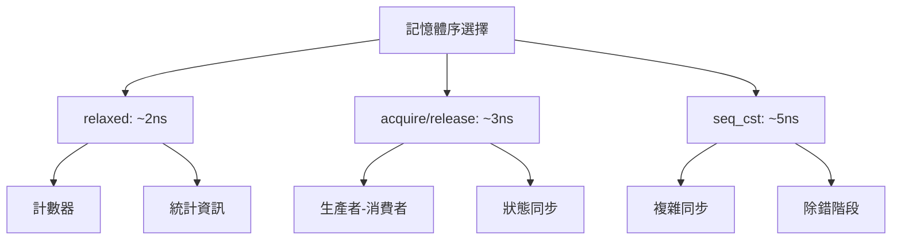

# 02-原子操作與內存序 ⭐⭐⭐

> **HFT 核心技術** | 無鎖編程的基石，單操作延遲 < 10ns

## 概述

原子操作 (Atomic Operations) 是現代高頻交易系統的核心技術：

- **硬體保證**: CPU 級別的原子性保證
- **無鎖設計**: 避免互斥鎖的開銷和阻塞
- **內存序控制**: 精確控制指令重排序
- **極致性能**: 單次操作延遲 2-10ns

**HFT 關鍵應用**: 無鎖佇列、計數器、狀態標記、CAS 操作

---

## 1. std::atomic 基礎

### 1.1 原子類型概述

**支援的原子類型:**

```cpp
#include <atomic>

// 基本整數類型
std::atomic<bool> flag{false};
std::atomic<int> counter{0};
std::atomic<long> large_counter{0};
std::atomic<uint64_t> timestamp{0};

// 指針類型
std::atomic<int*> ptr{nullptr};
std::atomic<Node*> head{nullptr};

// 自定義類型 (有限制)
struct alignas(8) SmallStruct {
    uint32_t a;
    uint32_t b;
};
std::atomic<SmallStruct> atomic_struct;

// 檢查類型是否支援無鎖原子操作
void check_lock_free() {
    std::cout << "bool is lock-free: " << std::atomic<bool>{}.is_lock_free() << "\n";
    std::cout << "int is lock-free: " << std::atomic<int>{}.is_lock_free() << "\n";
    std::cout << "int64_t is lock-free: " << std::atomic<int64_t>{}.is_lock_free() << "\n";
    std::cout << "pointer is lock-free: " << std::atomic<void*>{}.is_lock_free() << "\n";
    
    // 編譯時常量檢查
    static_assert(std::atomic<int>::is_always_lock_free);
    static_assert(std::atomic<uint64_t>::is_always_lock_free);
}
```

### 1.2 基本操作

**載入、儲存、交換操作:**

```cpp
#include <atomic>

void basic_operations() {
    std::atomic<int> value{42};
    
    // 1. 載入 (load)
    int current = value.load(std::memory_order_relaxed);
    // 等價於: int current = value;
    
    // 2. 儲存 (store)  
    value.store(100, std::memory_order_relaxed);
    // 等價於: value = 100;
    
    // 3. 交換 (exchange) - 原子性設定新值並返回舊值
    int old_value = value.exchange(200, std::memory_order_relaxed);
    std::cout << "Old value: " << old_value << ", New value: " << value.load() << "\n";
    
    // 4. 比較交換 (compare_exchange)
    int expected = 200;
    bool success = value.compare_exchange_strong(expected, 300, std::memory_order_relaxed);
    if (success) {
        std::cout << "CAS succeeded, value is now 300\n";
    } else {
        std::cout << "CAS failed, expected was " << expected << "\n";
    }
}
```

### 1.3 數值運算操作

**原子算術操作:**

```cpp
void arithmetic_operations() {
    std::atomic<int> counter{0};
    
    // 遞增/遞減
    int old_val = counter.fetch_add(1, std::memory_order_relaxed); // 返回舊值
    int new_val = ++counter; // 前綴遞增，返回新值
    int current = counter++; // 後綴遞增，返回舊值
    
    // 其他算術操作
    counter.fetch_sub(5, std::memory_order_relaxed);  // 減法
    counter.fetch_and(0xFF, std::memory_order_relaxed); // 位元 AND
    counter.fetch_or(0x10, std::memory_order_relaxed);  // 位元 OR
    counter.fetch_xor(0x0F, std::memory_order_relaxed); // 位元 XOR
    
    std::cout << "Final counter value: " << counter.load() << "\n";
}

// HFT 中的原子計數器應用
class HFTAtomicCounter {
public:
    // 高頻訂單計數
    void increment_order_count() {
        order_count_.fetch_add(1, std::memory_order_relaxed);
    }
    
    // 獲取當前計數 (用於監控)
    uint64_t get_order_count() const {
        return order_count_.load(std::memory_order_relaxed);
    }
    
    // 重置計數器
    void reset() {
        order_count_.store(0, std::memory_order_relaxed);
    }
    
    // 原子性檢查並遞增
    bool try_increment_if_below_limit(uint64_t limit) {
        uint64_t current = order_count_.load(std::memory_order_relaxed);
        while (current < limit) {
            if (order_count_.compare_exchange_weak(current, current + 1, 
                                                 std::memory_order_relaxed)) {
                return true; // 成功遞增
            }
            // current 被 CAS 更新為實際值，繼續嘗試
        }
        return false; // 達到限制
    }
    
private:
    alignas(64) std::atomic<uint64_t> order_count_{0}; // 避免 false sharing
};
```

---

## 2. 比較交換 (Compare-And-Swap)

### 2.1 CAS 操作詳解

**基本 CAS 概念:**

```cpp
// CAS 偽代碼邏輯:
// bool compare_exchange_strong(T& expected, T desired) {
//     if (*this == expected) {
//         *this = desired;
//         return true;
//     } else {
//         expected = *this;  // 更新 expected 為實際值
//         return false;
//     }
// }

void cas_detailed_example() {
    std::atomic<int> value{100};
    
    // strong vs weak CAS
    int expected = 100;
    
    // strong CAS - 保證如果值相等就一定成功
    bool success = value.compare_exchange_strong(expected, 200, 
                                               std::memory_order_seq_cst,
                                               std::memory_order_seq_cst);
    
    // weak CAS - 即使值相等也可能失敗 (在某些架構上性能更好)
    expected = 200;
    success = value.compare_exchange_weak(expected, 300,
                                        std::memory_order_seq_cst,
                                        std::memory_order_seq_cst);
    
    // weak CAS 通常在循環中使用
    expected = 300;
    while (!value.compare_exchange_weak(expected, 400, std::memory_order_relaxed)) {
        // expected 被自動更新為實際值
        // 在某些架構上，這個循環可能需要多次迭代
    }
}
```

### 2.2 CAS 在資料結構中的應用

**無鎖棧實現:**

```cpp
template<typename T>
class LockFreeStack {
private:
    struct Node {
        T data;
        Node* next;
        
        Node(T&& item) : data(std::move(item)), next(nullptr) {}
    };
    
    alignas(64) std::atomic<Node*> head_{nullptr};
    
public:
    void push(T item) {
        Node* new_node = new Node(std::move(item));
        
        // CAS 循環：將新節點插入到棧頂
        Node* old_head = head_.load(std::memory_order_relaxed);
        do {
            new_node->next = old_head;
        } while (!head_.compare_exchange_weak(old_head, new_node,
                                            std::memory_order_release,
                                            std::memory_order_relaxed));
    }
    
    bool pop(T& result) {
        Node* old_head = head_.load(std::memory_order_acquire);
        
        // CAS 循環：移除棧頂元素
        while (old_head != nullptr) {
            if (head_.compare_exchange_weak(old_head, old_head->next,
                                          std::memory_order_release,
                                          std::memory_order_relaxed)) {
                result = std::move(old_head->data);
                delete old_head;
                return true;
            }
        }
        return false; // 棧空
    }
    
    bool empty() const {
        return head_.load(std::memory_order_relaxed) == nullptr;
    }
};

// HFT 使用範例
void hft_stack_example() {
    LockFreeStack<int> order_stack;
    
    // 多執行緒環境下的無鎖操作
    std::vector<std::thread> producers;
    std::vector<std::thread> consumers;
    
    // 生產者執行緒
    for (int i = 0; i < 2; ++i) {
        producers.emplace_back([&order_stack, i]() {
            for (int j = 0; j < 1000; ++j) {
                order_stack.push(i * 1000 + j);
            }
        });
    }
    
    // 消費者執行緒
    std::atomic<int> processed_count{0};
    for (int i = 0; i < 2; ++i) {
        consumers.emplace_back([&order_stack, &processed_count]() {
            int item;
            while (processed_count.load() < 2000) {
                if (order_stack.pop(item)) {
                    processed_count.fetch_add(1);
                } else {
                    std::this_thread::yield();
                }
            }
        });
    }
    
    // 等待完成
    for (auto& t : producers) t.join();
    for (auto& t : consumers) t.join();
    
    std::cout << "Processed " << processed_count.load() << " items\n";
}
```

---

## 3. 內存序 (Memory Ordering)

### 3.1 內存序類型詳解

**六種內存序模型:**

```cpp
#include <atomic>

void memory_order_explanation() {
    std::atomic<int> x{0}, y{0};
    std::atomic<bool> flag{false};
    
    // 1. memory_order_relaxed - 最弱保證，僅保證操作原子性
    x.store(1, std::memory_order_relaxed);
    int val = y.load(std::memory_order_relaxed);
    
    // 2. memory_order_consume - 依賴序，C++17 中不推薦使用
    // (通常被實現為 acquire)
    
    // 3. memory_order_acquire - 獲取語義，用於讀操作
    bool ready = flag.load(std::memory_order_acquire);
    
    // 4. memory_order_release - 釋放語義，用於寫操作
    flag.store(true, std::memory_order_release);
    
    // 5. memory_order_acq_rel - 獲取-釋放語義，用於讀-修改-寫操作
    int old_x = x.fetch_add(1, std::memory_order_acq_rel);
    
    // 6. memory_order_seq_cst - 順序一致性，最強保證 (預設)
    y.store(2, std::memory_order_seq_cst);
    int val2 = x.load(std::memory_order_seq_cst);
}
```

### 3.2 Acquire-Release 語義

**生產者-消費者模式的正確同步:**

```cpp
#include <atomic>
#include <thread>

class DataChannel {
private:
    int data_ = 0;
    std::atomic<bool> ready_{false};
    
public:
    // 生產者：使用 release 語義
    void produce(int value) {
        data_ = value; // 普通寫入
        
        // release：確保上面的寫入對其他執行緒可見
        ready_.store(true, std::memory_order_release);
    }
    
    // 消費者：使用 acquire 語義  
    bool consume(int& value) {
        // acquire：同步於對應的 release 操作
        if (ready_.load(std::memory_order_acquire)) {
            value = data_; // 此時保證能看到 produce 中的寫入
            return true;
        }
        return false;
    }
};

void acquire_release_example() {
    DataChannel channel;
    
    std::thread producer([&channel]() {
        for (int i = 0; i < 10; ++i) {
            channel.produce(i * 100);
            std::this_thread::sleep_for(std::chrono::milliseconds(100));
        }
    });
    
    std::thread consumer([&channel]() {
        int value;
        while (true) {
            if (channel.consume(value)) {
                std::cout << "Consumed: " << value << "\n";
                if (value >= 900) break;
            }
            std::this_thread::sleep_for(std::chrono::milliseconds(10));
        }
    });
    
    producer.join();
    consumer.join();
}
```

### 3.3 HFT 中的內存序選擇

**性能對比與選擇指南:**



**HFT 內存序最佳實踐:**

```cpp
// HFT 系統中的內存序使用指南
class HFTMemoryOrderGuide {
public:
    // ✅ 高頻操作：使用 relaxed (最快)
    void increment_message_count() {
        message_count_.fetch_add(1, std::memory_order_relaxed);
    }
    
    // ✅ 狀態同步：使用 acquire-release
    void publish_market_data(const MarketData& data) {
        market_data_ = data;  // 普通寫入
        data_ready_.store(true, std::memory_order_release); // 同步點
    }
    
    bool consume_market_data(MarketData& data) {
        if (data_ready_.load(std::memory_order_acquire)) {
            data = market_data_; // 保證能看到最新數據
            data_ready_.store(false, std::memory_order_relaxed);
            return true;
        }
        return false;
    }
    
    // ✅ 關鍵控制：使用 seq_cst (除錯時)
    void emergency_stop() {
        emergency_stop_flag_.store(true, std::memory_order_seq_cst);
    }
    
    bool should_stop() {
        return emergency_stop_flag_.load(std::memory_order_seq_cst);
    }
    
    // ❌ 錯誤：不必要的強內存序
    void bad_increment() {
        // 浪費性能：counter 不需要 seq_cst
        counter_.fetch_add(1, std::memory_order_seq_cst);
    }
    
    // ❌ 錯誤：過弱的內存序
    void bad_synchronization() {
        important_data_ = calculate_important_value();
        // 錯誤：relaxed 不保證 important_data_ 的可見性
        data_flag_.store(true, std::memory_order_relaxed);
    }
    
private:
    alignas(64) std::atomic<uint64_t> message_count_{0};
    alignas(64) std::atomic<bool> data_ready_{false};
    alignas(64) std::atomic<bool> emergency_stop_flag_{false};
    alignas(64) std::atomic<uint64_t> counter_{0};
    alignas(64) std::atomic<bool> data_flag_{false};
    
    MarketData market_data_;
    int important_data_;
};
```

---

## 4. 高級原子操作模式

### 4.1 Double-Width CAS (DWCAS)

**64位系統上的128位原子操作:**

```cpp
#include <atomic>

// 模擬 ABA 問題的解決方案
template<typename T>
class ABAFreePointer {
private:
    struct TaggedPointer {
        T* ptr;
        uint64_t tag;
        
        TaggedPointer(T* p = nullptr, uint64_t t = 0) : ptr(p), tag(t) {}
        
        bool operator==(const TaggedPointer& other) const {
            return ptr == other.ptr && tag == other.tag;
        }
    };
    
    alignas(16) std::atomic<TaggedPointer> tagged_ptr_;
    
public:
    ABAFreePointer() : tagged_ptr_{TaggedPointer{}} {}
    
    // 設置指針，自動遞增標籤防止 ABA
    void set(T* new_ptr) {
        TaggedPointer old_tagged = tagged_ptr_.load(std::memory_order_relaxed);
        TaggedPointer new_tagged;
        
        do {
            new_tagged.ptr = new_ptr;
            new_tagged.tag = old_tagged.tag + 1;
        } while (!tagged_ptr_.compare_exchange_weak(old_tagged, new_tagged,
                                                   std::memory_order_release,
                                                   std::memory_order_relaxed));
    }
    
    // 獲取指針
    T* get() {
        return tagged_ptr_.load(std::memory_order_acquire).ptr;
    }
    
    // CAS 操作，防止 ABA 問題
    bool compare_exchange(T* expected, T* desired) {
        TaggedPointer old_tagged = tagged_ptr_.load(std::memory_order_relaxed);
        
        if (old_tagged.ptr != expected) {
            return false;
        }
        
        TaggedPointer new_tagged{desired, old_tagged.tag + 1};
        return tagged_ptr_.compare_exchange_strong(old_tagged, new_tagged,
                                                 std::memory_order_release,
                                                 std::memory_order_relaxed);
    }
};
```

### 4.2 Hazard Pointers (安全記憶體回收)

**無鎖資料結構的記憶體安全:**

```cpp
#include <atomic>
#include <array>

template<typename T>
class HazardPointerManager {
private:
    static constexpr size_t MAX_THREADS = 32;
    static constexpr size_t HAZARD_POINTERS_PER_THREAD = 2;
    
    struct HazardRecord {
        alignas(64) std::atomic<T*> hazard_ptrs[HAZARD_POINTERS_PER_THREAD];
        std::atomic<bool> active{false};
        thread_local static HazardRecord* local_record;
    };
    
    static std::array<HazardRecord, MAX_THREADS> hazard_records_;
    static std::atomic<size_t> next_record_idx_;
    
public:
    // 獲取當前執行緒的 hazard pointer 記錄
    static HazardRecord* get_hazard_record() {
        if (HazardRecord::local_record == nullptr) {
            size_t idx = next_record_idx_.fetch_add(1) % MAX_THREADS;
            HazardRecord::local_record = &hazard_records_[idx];
            HazardRecord::local_record->active.store(true);
        }
        return HazardRecord::local_record;
    }
    
    // 保護指針不被其他執行緒刪除
    static void protect(size_t slot, T* ptr) {
        auto* record = get_hazard_record();
        record->hazard_ptrs[slot].store(ptr, std::memory_order_release);
    }
    
    // 取消保護
    static void unprotect(size_t slot) {
        auto* record = get_hazard_record();
        record->hazard_ptrs[slot].store(nullptr, std::memory_order_release);
    }
    
    // 安全刪除指針 (檢查是否被其他執行緒保護)
    static bool safe_delete(T* ptr) {
        // 檢查所有活躍的 hazard pointer 記錄
        for (auto& record : hazard_records_) {
            if (!record.active.load()) continue;
            
            for (size_t i = 0; i < HAZARD_POINTERS_PER_THREAD; ++i) {
                if (record.hazard_ptrs[i].load(std::memory_order_acquire) == ptr) {
                    return false; // 被保護，不能刪除
                }
            }
        }
        
        delete ptr;
        return true;
    }
};

// 靜態成員定義
template<typename T>
std::array<typename HazardPointerManager<T>::HazardRecord, 
           HazardPointerManager<T>::MAX_THREADS> HazardPointerManager<T>::hazard_records_;

template<typename T>
std::atomic<size_t> HazardPointerManager<T>::next_record_idx_{0};

template<typename T>
thread_local typename HazardPointerManager<T>::HazardRecord* 
    HazardPointerManager<T>::HazardRecord::local_record = nullptr;
```

---

## 5. 實戰：HFT 原子操作優化

### 5.1 高性能原子計數器

```cpp
// 專為 HFT 設計的高性能計數器
class HFTAtomicMetrics {
private:
    // 使用 cache line 對齊避免 false sharing
    struct alignas(64) CounterGroup {
        std::atomic<uint64_t> orders_sent{0};
        std::atomic<uint64_t> orders_filled{0};
        std::atomic<uint64_t> orders_cancelled{0};
        std::atomic<uint64_t> market_data_received{0};
    };
    
    CounterGroup counters_;
    
    // 延遲統計使用更複雜的原子操作
    struct alignas(64) LatencyStats {
        std::atomic<uint64_t> total_latency_ns{0};
        std::atomic<uint64_t> max_latency_ns{0};
        std::atomic<uint64_t> sample_count{0};
    } latency_stats_;
    
public:
    // 高頻調用：使用最快的 relaxed 語義
    void increment_orders_sent() {
        counters_.orders_sent.fetch_add(1, std::memory_order_relaxed);
    }
    
    void increment_market_data() {
        counters_.market_data_received.fetch_add(1, std::memory_order_relaxed);
    }
    
    // 延遲記錄：使用 CAS 更新最大值
    void record_latency(uint64_t latency_ns) {
        // 更新總延遲和樣本數
        latency_stats_.total_latency_ns.fetch_add(latency_ns, std::memory_order_relaxed);
        latency_stats_.sample_count.fetch_add(1, std::memory_order_relaxed);
        
        // 原子性更新最大延遲
        uint64_t current_max = latency_stats_.max_latency_ns.load(std::memory_order_relaxed);
        while (latency_ns > current_max) {
            if (latency_stats_.max_latency_ns.compare_exchange_weak(
                    current_max, latency_ns, std::memory_order_relaxed)) {
                break;
            }
        }
    }
    
    // 獲取統計信息 (用於監控，不需要完全一致性)
    struct Metrics {
        uint64_t orders_sent;
        uint64_t orders_filled;
        uint64_t market_data_count;
        double avg_latency_ns;
        uint64_t max_latency_ns;
    };
    
    Metrics get_metrics() const {
        Metrics m;
        m.orders_sent = counters_.orders_sent.load(std::memory_order_relaxed);
        m.orders_filled = counters_.orders_filled.load(std::memory_order_relaxed);
        m.market_data_count = counters_.market_data_received.load(std::memory_order_relaxed);
        
        uint64_t total_latency = latency_stats_.total_latency_ns.load(std::memory_order_relaxed);
        uint64_t sample_count = latency_stats_.sample_count.load(std::memory_order_relaxed);
        
        m.avg_latency_ns = sample_count > 0 ? 
            static_cast<double>(total_latency) / sample_count : 0.0;
        m.max_latency_ns = latency_stats_.max_latency_ns.load(std::memory_order_relaxed);
        
        return m;
    }
    
    // 重置統計 (使用 seq_cst 確保一致性)
    void reset() {
        counters_.orders_sent.store(0, std::memory_order_seq_cst);
        counters_.orders_filled.store(0, std::memory_order_seq_cst);
        counters_.orders_cancelled.store(0, std::memory_order_seq_cst);
        counters_.market_data_received.store(0, std::memory_order_seq_cst);
        
        latency_stats_.total_latency_ns.store(0, std::memory_order_seq_cst);
        latency_stats_.max_latency_ns.store(0, std::memory_order_seq_cst);
        latency_stats_.sample_count.store(0, std::memory_order_seq_cst);
    }
};
```

### 5.2 無鎖狀態機

```cpp
// HFT 訂單狀態的無鎖管理
class AtomicOrderState {
public:
    enum class State : uint32_t {
        PENDING = 0,
        SENT = 1,
        ACKNOWLEDGED = 2,  
        PARTIALLY_FILLED = 3,
        FILLED = 4,
        CANCELLED = 5,
        REJECTED = 6
    };
    
private:
    std::atomic<State> state_{State::PENDING};
    
    // 有效的狀態轉換矩陣
    static constexpr bool valid_transitions_[7][7] = {
        // FROM\TO    PEND SENT ACK  PART FILL CANC REJ
        /* PENDING */ {false, true, false, false, false, true, false},
        /* SENT */    {false, false, true, false, false, false, true},
        /* ACK */     {false, false, false, true, true, true, false},
        /* PART */    {false, false, false, false, true, true, false},
        /* FILLED */  {false, false, false, false, false, false, false},
        /* CANCELLED*/{false, false, false, false, false, false, false},
        /* REJECTED */{false, false, false, false, false, false, false}
    };
    
public:
    AtomicOrderState(State initial = State::PENDING) : state_(initial) {}
    
    // 原子性狀態轉換
    bool try_transition(State from, State to) {
        if (!is_valid_transition(from, to)) {
            return false;
        }
        
        return state_.compare_exchange_strong(from, to, std::memory_order_acq_rel);
    }
    
    // 獲取當前狀態
    State get() const {
        return state_.load(std::memory_order_acquire);
    }
    
    // 檢查是否為終態
    bool is_terminal() const {
        State current = get();
        return current == State::FILLED || 
               current == State::CANCELLED || 
               current == State::REJECTED;
    }
    
    // 等待狀態變化 (用於同步)
    bool wait_for_state_change(State expected_old, State& new_state, 
                              std::chrono::milliseconds timeout = std::chrono::milliseconds(1000)) {
        auto start = std::chrono::steady_clock::now();
        
        while (std::chrono::steady_clock::now() - start < timeout) {
            new_state = get();
            if (new_state != expected_old) {
                return true;
            }
            std::this_thread::sleep_for(std::chrono::microseconds(1));
        }
        return false; // 超時
    }
    
private:
    static bool is_valid_transition(State from, State to) {
        return valid_transitions_[static_cast<uint32_t>(from)][static_cast<uint32_t>(to)];
    }
};

// 使用範例
void atomic_state_machine_example() {
    AtomicOrderState order_state;
    
    // 模擬訂單生命週期
    std::thread order_sender([&order_state]() {
        // 嘗試將訂單從 PENDING 轉換為 SENT
        if (order_state.try_transition(AtomicOrderState::State::PENDING, 
                                      AtomicOrderState::State::SENT)) {
            std::cout << "Order sent successfully\n";
        }
        
        // 模擬網路延遲
        std::this_thread::sleep_for(std::chrono::milliseconds(1));
        
        // 收到交易所確認
        if (order_state.try_transition(AtomicOrderState::State::SENT,
                                      AtomicOrderState::State::ACKNOWLEDGED)) {
            std::cout << "Order acknowledged\n";
        }
    });
    
    std::thread order_monitor([&order_state]() {
        AtomicOrderState::State new_state;
        if (order_state.wait_for_state_change(AtomicOrderState::State::PENDING, new_state)) {
            std::cout << "State changed to: " << static_cast<int>(new_state) << "\n";
        }
        
        // 等待最終狀態
        while (!order_state.is_terminal()) {
            std::this_thread::sleep_for(std::chrono::microseconds(10));
        }
        std::cout << "Order reached terminal state: " 
                  << static_cast<int>(order_state.get()) << "\n";
    });
    
    order_sender.join();
    order_monitor.join();
}
```

---

## 6. 性能測量與優化

### 6.1 原子操作性能基準測試

```cpp
#include <chrono>
#include <vector>

class AtomicPerformanceBenchmark {
private:
    static constexpr size_t NUM_ITERATIONS = 10000000;
    
public:
    // 測試不同內存序的性能
    static void benchmark_memory_orders() {
        std::atomic<uint64_t> counter{0};
        
        // 測試 relaxed
        auto start = std::chrono::high_resolution_clock::now();
        for (size_t i = 0; i < NUM_ITERATIONS; ++i) {
            counter.fetch_add(1, std::memory_order_relaxed);
        }
        auto end = std::chrono::high_resolution_clock::now();
        
        auto relaxed_ns = std::chrono::duration_cast<std::chrono::nanoseconds>(end - start).count();
        double relaxed_per_op = static_cast<double>(relaxed_ns) / NUM_ITERATIONS;
        
        // 重置計數器
        counter.store(0);
        
        // 測試 seq_cst
        start = std::chrono::high_resolution_clock::now();
        for (size_t i = 0; i < NUM_ITERATIONS; ++i) {
            counter.fetch_add(1, std::memory_order_seq_cst);
        }
        end = std::chrono::high_resolution_clock::now();
        
        auto seq_cst_ns = std::chrono::duration_cast<std::chrono::nanoseconds>(end - start).count();
        double seq_cst_per_op = static_cast<double>(seq_cst_ns) / NUM_ITERATIONS;
        
        std::cout << "=== 原子操作性能測試 ===\n";
        std::cout << "Relaxed: " << relaxed_per_op << " ns/op\n";
        std::cout << "Seq_cst: " << seq_cst_per_op << " ns/op\n";
        std::cout << "Overhead: " << ((seq_cst_per_op - relaxed_per_op) / relaxed_per_op * 100) << "%\n";
    }
    
    // 測試 CAS 性能
    static void benchmark_cas_operations() {
        std::atomic<uint64_t> value{0};
        
        auto start = std::chrono::high_resolution_clock::now();
        
        for (size_t i = 0; i < NUM_ITERATIONS; ++i) {
            uint64_t expected = i;
            while (!value.compare_exchange_weak(expected, expected + 1, 
                                              std::memory_order_relaxed)) {
                // CAS 失敗，重試
            }
        }
        
        auto end = std::chrono::high_resolution_clock::now();
        
        auto cas_ns = std::chrono::duration_cast<std::chrono::nanoseconds>(end - start).count();
        double cas_per_op = static_cast<double>(cas_ns) / NUM_ITERATIONS;
        
        std::cout << "CAS operation: " << cas_per_op << " ns/op\n";
    }
    
    // 多執行緒競爭測試
    static void benchmark_contention() {
        std::atomic<uint64_t> shared_counter{0};
        constexpr size_t NUM_THREADS = 4;
        constexpr size_t OPERATIONS_PER_THREAD = NUM_ITERATIONS / NUM_THREADS;
        
        auto start = std::chrono::high_resolution_clock::now();
        
        std::vector<std::thread> threads;
        for (size_t t = 0; t < NUM_THREADS; ++t) {
            threads.emplace_back([&shared_counter]() {
                for (size_t i = 0; i < OPERATIONS_PER_THREAD; ++i) {
                    shared_counter.fetch_add(1, std::memory_order_relaxed);
                }
            });
        }
        
        for (auto& thread : threads) {
            thread.join();
        }
        
        auto end = std::chrono::high_resolution_clock::now();
        
        auto contention_ns = std::chrono::duration_cast<std::chrono::nanoseconds>(end - start).count();
        double contention_per_op = static_cast<double>(contention_ns) / NUM_ITERATIONS;
        
        std::cout << "Contended operation (" << NUM_THREADS << " threads): " 
                  << contention_per_op << " ns/op\n";
    }
};
```

### 6.2 最佳化指南

**HFT 原子操作最佳實踐:**

```cpp
class HFTAtomicOptimizations {
public:
    // ✅ 最佳實踐 1: 使用適當的記憶體序
    static void best_practice_memory_order() {
        std::atomic<uint64_t> counter{0};
        
        // 高頻計數：使用 relaxed
        counter.fetch_add(1, std::memory_order_relaxed);
        
        // 發布數據：使用 release
        std::atomic<bool> data_ready{false};
        // ... 準備數據 ...
        data_ready.store(true, std::memory_order_release);
        
        // 讀取數據：使用 acquire
        if (data_ready.load(std::memory_order_acquire)) {
            // ... 使用數據 ...
        }
    }
    
    // ✅ 最佳實踐 2: 避免 False Sharing
    struct OptimizedCounters {
        alignas(64) std::atomic<uint64_t> counter1{0};
        alignas(64) std::atomic<uint64_t> counter2{0};
        alignas(64) std::atomic<uint64_t> counter3{0};
    };
    
    // ✅ 最佳實踐 3: 批次操作減少原子操作頻率
    class BatchedCounter {
    private:
        std::atomic<uint64_t> global_counter_{0};
        thread_local static uint64_t local_counter_;
        thread_local static uint64_t batch_size_;
        
    public:
        void increment() {
            ++local_counter_;
            if (local_counter_ >= batch_size_) {
                global_counter_.fetch_add(local_counter_, std::memory_order_relaxed);
                local_counter_ = 0;
            }
        }
        
        uint64_t get_count() const {
            return global_counter_.load(std::memory_order_relaxed);
        }
        
        static void set_batch_size(uint64_t size) {
            batch_size_ = size;
        }
    };
    
    // ✅ 最佳實踐 4: 使用 weak CAS 在循環中
    static bool optimized_cas_loop(std::atomic<uint64_t>& value, uint64_t increment) {
        uint64_t old_value = value.load(std::memory_order_relaxed);
        uint64_t new_value;
        
        do {
            new_value = old_value + increment;
        } while (!value.compare_exchange_weak(old_value, new_value,
                                            std::memory_order_relaxed,
                                            std::memory_order_relaxed));
        
        return true;
    }
    
    // ❌ 反面教材：過度使用強內存序
    static void bad_practice_strong_ordering() {
        std::atomic<uint64_t> counter{0};
        
        // 浪費性能：簡單計數不需要 seq_cst
        counter.fetch_add(1, std::memory_order_seq_cst);
    }
    
    // ❌ 反面教材：頻繁的原子操作
    static void bad_practice_frequent_atomics() {
        std::atomic<uint64_t> sum{0};
        
        // 效率低：每次都進行原子操作
        for (int i = 0; i < 1000; ++i) {
            sum.fetch_add(i, std::memory_order_relaxed);
        }
        
        // 更好的做法：批次操作
        uint64_t local_sum = 0;
        for (int i = 0; i < 1000; ++i) {
            local_sum += i;
        }
        sum.fetch_add(local_sum, std::memory_order_relaxed);
    }
};

// 靜態成員定義
thread_local uint64_t HFTAtomicOptimizations::BatchedCounter::local_counter_ = 0;
thread_local uint64_t HFTAtomicOptimizations::BatchedCounter::batch_size_ = 100;
```

---

## 7. 總結

### 7.1 關鍵要點回顧

**原子操作核心概念:**
- 硬體級別的原子性保證
- 避免鎖的開銷和阻塞
- 精確控制內存序
- 適用於高頻、低延遲場景

**內存序選擇指南:**

| 內存序          | 延遲   | 適用場景              | HFT 推薦度 |
| --------------- | ------ | --------------------- | ---------- |
| relaxed         | ~2ns   | 計數器、統計          | ⭐⭐⭐⭐⭐ |
| acquire/release | ~3ns   | 生產者-消費者同步     | ⭐⭐⭐⭐   |
| seq_cst         | ~5ns   | 複雜同步、調試        | ⭐⭐       |

### 7.2 HFT 最佳實踐

**性能優化要點:**
- ✅ 使用 `memory_order_relaxed` 進行高頻計數
- ✅ 使用 `alignas(64)` 避免 False Sharing  
- ✅ 批次操作減少原子操作頻率
- ✅ weak CAS 在循環中性能更好
- ✅ 合理使用 acquire-release 語義

**常見錯誤:**
- ❌ 過度使用 `seq_cst` (預設值)
- ❌ 忽視 Cache Line 對齊
- ❌ 頻繁的小粒度原子操作
- ❌ 在錯誤場景使用原子操作

### 7.3 實際應用建議

**HFT 系統中的使用場景:**

1. **高頻計數器**: 使用 `relaxed` 原子遞增
2. **狀態同步**: 使用 `acquire-release` 語義
3. **無鎖佇列**: 結合 CAS 和適當內存序
4. **緊急停止**: 使用 `seq_cst` 確保立即可見

**下一步學習:**
- 無鎖資料結構設計模式
- 硬體級別的記憶體屏障
- NUMA 環境下的原子操作優化
- 編譯器相關的原子操作優化

---

## 參考資料 (References)

1. [C++ Memory Model](https://en.cppreference.com/w/cpp/atomic/memory_order) - cppreference.com
2. [Atomic Operations and Memory Ordering](https://gcc.gnu.org/onlinedocs/gcc/_005f_005fatomic-Builtins.html) - GCC Documentation  
3. [Intel 64 and IA-32 Memory Ordering](https://www.intel.com/content/dam/www/public/us/en/documents/manuals/64-ia-32-architectures-software-developer-vol-3a-part-1-manual.pdf) - Intel Manual
4. [Lock-Free Programming](https://preshing.com/20120612/an-introduction-to-lock-free-programming/) - Jeff Preshing
5. [Memory Barriers: a Hardware View for Software Hackers](http://www.rdrop.com/~paulmck/scalability/paper/whymb.2010.06.07c.pdf) - Paul McKenney
6. [C++11 Memory Model](https://www.hpl.hp.com/techreports/2008/HPL-2008-56.pdf) - Hans Boehm
7. [Relaxed Memory Models](https://research.swtch.com/gomm) - Russ Cox
8. [Hardware Memory Models](https://arxiv.org/pdf/1803.02309.pdf) - Academic Paper