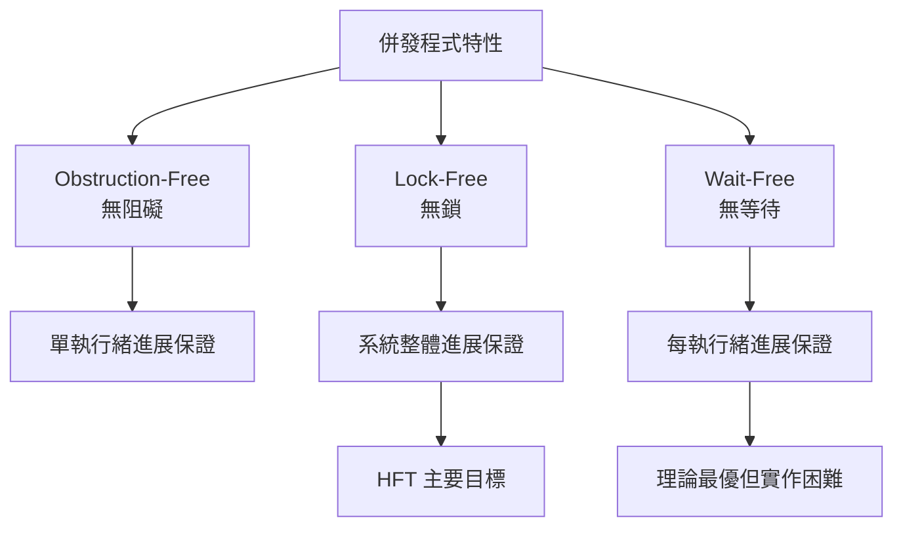

# 03-無鎖編程實戰 ⭐⭐⭐

> **HFT 極致性能** | 零阻塞、零鎖競爭，延遲 < 50ns 的資料結構

## 概述

無鎖編程 (Lock-Free Programming) 是 HFT 系統的核心技術：

- **零阻塞**: 執行緒永不被阻塞或休眠
- **無死鎖**: 從根本上消除死鎖可能性
- **極致性能**: 單操作延遲 10-50ns
- **高併發**: 支援多生產者/多消費者場景

**關鍵挑戰**: ABA 問題、記憶體回收、複雜的併發控制

---

## 1. 無鎖程式設計原則

### 1.1 基本概念與術語

**核心原則:**

```cpp
// 無鎖程式設計的基本要求:
// 1. 使用原子操作替代鎖
// 2. 避免阻塞操作 
// 3. 處理 ABA 問題
// 4. 安全的記憶體管理

#include <atomic>

// 無鎖 vs 有鎖比較
class ComparisonExample {
public:
    // ❌ 有鎖版本 - 可能阻塞
    class LockedCounter {
    private:
        int count_ = 0;
        std::mutex mtx_;
    public:
        void increment() {
            std::lock_guard<std::mutex> lock(mtx_); // 可能阻塞!
            ++count_;
        }
        int get() const {
            std::lock_guard<std::mutex> lock(mtx_);
            return count_;
        }
    };
    
    // ✅ 無鎖版本 - 永不阻塞
    class LockFreeCounter {
    private:
        std::atomic<int> count_{0};
    public:
        void increment() {
            count_.fetch_add(1, std::memory_order_relaxed); // 永不阻塞
        }
        int get() const {
            return count_.load(std::memory_order_relaxed);
        }
    };
};
```

**無鎖程式特性等級:**



### 1.2 ABA 問題與解決方案

**ABA 問題範例:**

```cpp
#include <atomic>

// ABA 問題示範
class ABAExample {
private:
    struct Node {
        int data;
        Node* next;
        Node(int d) : data(d), next(nullptr) {}
    };
    
    std::atomic<Node*> head_{nullptr};
    
public:
    // ❌ 存在 ABA 問題的 pop 操作
    Node* unsafe_pop() {
        Node* old_head = head_.load();
        if (old_head == nullptr) return nullptr;
        
        // 在這個時間點，其他執行緒可能:
        // 1. pop 掉 old_head (A)
        // 2. pop 掉 old_head->next (B)  
        // 3. push 回 old_head (A again!) <- ABA!
        
        Node* new_head = old_head->next;
        
        // 這個 CAS 會成功，但 old_head 可能已被修改!
        if (head_.compare_exchange_weak(old_head, new_head)) {
            return old_head;
        }
        return nullptr;
    }
};

// ✅ 解決方案 1: 使用版本標籤
class ABAFreeStack {
private:
    struct Node {
        int data;
        Node* next;
        Node(int d) : data(d), next(nullptr) {}
    };
    
    // 帶標籤的指針結構
    struct TaggedPointer {
        Node* ptr;
        uintptr_t tag;
        
        TaggedPointer(Node* p = nullptr, uintptr_t t = 0) : ptr(p), tag(t) {}
    };
    
    std::atomic<TaggedPointer> head_{TaggedPointer{}};
    
public:
    void push(int data) {
        Node* new_node = new Node(data);
        TaggedPointer old_head = head_.load(std::memory_order_relaxed);
        
        do {
            new_node->next = old_head.ptr;
            TaggedPointer new_head{new_node, old_head.tag + 1}; // 遞增標籤
        } while (!head_.compare_exchange_weak(old_head, new_head,
                                            std::memory_order_release,
                                            std::memory_order_relaxed));
    }
    
    Node* pop() {
        TaggedPointer old_head = head_.load(std::memory_order_acquire);
        
        while (old_head.ptr != nullptr) {
            TaggedPointer new_head{old_head.ptr->next, old_head.tag + 1};
            
            if (head_.compare_exchange_weak(old_head, new_head,
                                          std::memory_order_release,
                                          std::memory_order_relaxed)) {
                return old_head.ptr; // ABA 安全!
            }
        }
        return nullptr;
    }
};

// ✅ 解決方案 2: Hazard Pointers (見原子操作章節)
```

### 1.3 記憶體回收策略

**安全記憶體回收的挑戰:**

```cpp
// 無鎖程式中的記憶體回收問題
class MemoryReclaimationProblem {
public:
    struct Node {
        int data;
        std::atomic<Node*> next;
    };
    
private:
    std::atomic<Node*> head_{nullptr};
    
public:
    // ❌ 危險：可能造成 use-after-free
    Node* unsafe_pop() {
        Node* old_head = head_.load();
        if (!old_head) return nullptr;
        
        Node* new_head = old_head->next.load();
        
        if (head_.compare_exchange_strong(old_head, new_head)) {
            delete old_head; // 危險！其他執行緒可能還在使用
            return new_head;
        }
        return nullptr;
    }
    
    // ✅ 安全方案：使用引用計數
    class SafeNode {
    public:
        int data;
        std::atomic<SafeNode*> next{nullptr};
        std::atomic<int> ref_count{0};
        
        void add_ref() {
            ref_count.fetch_add(1, std::memory_order_relaxed);
        }
        
        void release() {
            if (ref_count.fetch_sub(1, std::memory_order_acq_rel) == 1) {
                delete this;
            }
        }
    };
    
    std::atomic<SafeNode*> safe_head_{nullptr};
    
    SafeNode* safe_pop() {
        SafeNode* old_head = safe_head_.load();
        if (!old_head) return nullptr;
        
        old_head->add_ref(); // 增加引用計數
        
        SafeNode* new_head = old_head->next.load();
        
        if (safe_head_.compare_exchange_strong(old_head, new_head)) {
            SafeNode* result = old_head;
            old_head->release(); // 釋放引用
            return result;
        } else {
            old_head->release(); // CAS 失敗，釋放引用
            return nullptr;
        }
    }
};
```

---

## 2. 無鎖佇列實現

### 2.1 SPSC 佇列 (單生產者單消費者)

**高性能 SPSC 環形佇列:**

```cpp
#include <atomic>
#include <array>

template<typename T, size_t Size>
class SPSCQueue {
public:
    static_assert((Size & (Size - 1)) == 0, "Size must be power of 2");
    
    SPSCQueue() : head_(0), tail_(0) {}
    
    // 生產者執行緒專用
    bool try_push(const T& item) {
        const size_t head = head_.load(std::memory_order_relaxed);
        const size_t next_head = (head + 1) & (Size - 1);
        
        if (next_head == tail_.load(std::memory_order_acquire)) {
            return false; // 佇列滿
        }
        
        buffer_[head] = item;
        head_.store(next_head, std::memory_order_release);
        return true;
    }
    
    // 消費者執行緒專用
    bool try_pop(T& item) {
        const size_t tail = tail_.load(std::memory_order_relaxed);
        
        if (tail == head_.load(std::memory_order_acquire)) {
            return false; // 佇列空
        }
        
        item = buffer_[tail];
        tail_.store((tail + 1) & (Size - 1), std::memory_order_release);
        return true;
    }
    
    // 查詢佇列大小 (近似值)
    size_t size() const {
        const size_t head = head_.load(std::memory_order_relaxed);
        const size_t tail = tail_.load(std::memory_order_relaxed);
        return (head - tail) & (Size - 1);
    }
    
    bool empty() const {
        return head_.load(std::memory_order_relaxed) == 
               tail_.load(std::memory_order_relaxed);
    }
    
    bool full() const {
        const size_t head = head_.load(std::memory_order_relaxed);
        const size_t next_head = (head + 1) & (Size - 1);
        return next_head == tail_.load(std::memory_order_relaxed);
    }
    
private:
    // Cache line 對齊，避免 false sharing
    alignas(64) std::atomic<size_t> head_;
    alignas(64) std::atomic<size_t> tail_;
    
    std::array<T, Size> buffer_;
};

// HFT 市場數據傳輸範例
struct MarketData {
    uint64_t timestamp;
    uint32_t symbol_id;
    double price;
    uint32_t volume;
};

void spsc_hft_example() {
    SPSCQueue<MarketData, 65536> market_data_queue;
    
    // 市場數據接收執行緒 (生產者)
    std::thread producer([&market_data_queue]() {
        for (uint64_t i = 0; i < 1000000; ++i) {
            MarketData md{i, 1, 100.0 + i * 0.01, 100};
            
            while (!market_data_queue.try_push(md)) {
                // 佇列滿，稍作等待
                std::this_thread::sleep_for(std::chrono::nanoseconds(1));
            }
        }
    });
    
    // 策略引擎執行緒 (消費者)
    std::thread consumer([&market_data_queue]() {
        MarketData md;
        uint64_t processed = 0;
        
        while (processed < 1000000) {
            if (market_data_queue.try_pop(md)) {
                // 處理市場數據 - 超低延遲
                ++processed;
            } else {
                // 佇列空，稍作等待
                std::this_thread::sleep_for(std::chrono::nanoseconds(1));
            }
        }
        
        std::cout << "Processed " << processed << " market data updates\n";
    });
    
    producer.join();
    consumer.join();
}
```

### 2.2 MPSC 佇列 (多生產者單消費者)

**無鎖多生產者佇列:**

```cpp
template<typename T>
class MPSCQueue {
private:
    struct Node {
        std::atomic<T*> data{nullptr};
        std::atomic<Node*> next{nullptr};
    };
    
    alignas(64) std::atomic<Node*> head_;
    alignas(64) std::atomic<Node*> tail_;
    
public:
    MPSCQueue() {
        Node* dummy = new Node;
        head_.store(dummy);
        tail_.store(dummy);
    }
    
    ~MPSCQueue() {
        while (Node* old_head = head_.load()) {
            head_.store(old_head->next);
            delete old_head;
        }
    }
    
    // 多執行緒安全的 push (生產者)
    void push(T* data) {
        Node* new_node = new Node;
        new_node->data.store(data, std::memory_order_relaxed);
        
        Node* prev_tail = tail_.exchange(new_node, std::memory_order_acq_rel);
        prev_tail->next.store(new_node, std::memory_order_release);
    }
    
    // 單執行緒 pop (消費者)
    T* pop() {
        Node* head = head_.load(std::memory_order_relaxed);
        Node* next = head->next.load(std::memory_order_acquire);
        
        if (next == nullptr) {
            return nullptr; // 佇列空
        }
        
        T* data = next->data.load(std::memory_order_relaxed);
        head_.store(next, std::memory_order_relaxed);
        delete head;
        
        return data;
    }
};

// HFT 訂單聚合範例
struct Order {
    uint64_t order_id;
    char side; // 'B' or 'S'
    double price;
    uint32_t quantity;
};

void mpsc_hft_example() {
    MPSCQueue<Order> order_queue;
    
    // 多個交易策略執行緒 (生產者)
    std::vector<std::thread> strategy_threads;
    
    for (int i = 0; i < 4; ++i) {
        strategy_threads.emplace_back([&order_queue, i]() {
            for (int j = 0; j < 1000; ++j) {
                Order* order = new Order{
                    static_cast<uint64_t>(i * 1000 + j),
                    (j % 2) ? 'B' : 'S',
                    100.0 + j * 0.01,
                    100
                };
                
                order_queue.push(order);
                
                // 模擬策略計算時間
                std::this_thread::sleep_for(std::chrono::microseconds(10));
            }
        });
    }
    
    // 訂單管理執行緒 (單一消費者)
    std::thread order_manager([&order_queue]() {
        int processed = 0;
        Order* order;
        
        while (processed < 4000) {
            while ((order = order_queue.pop()) != nullptr) {
                // 處理訂單
                std::cout << "Processing order " << order->order_id << "\n";
                delete order;
                ++processed;
            }
            
            // 短暫等待
            std::this_thread::sleep_for(std::chrono::microseconds(1));
        }
    });
    
    for (auto& t : strategy_threads) {
        t.join();
    }
    order_manager.join();
}
```

---

## 3. 無鎖棧與優先佇列

### 3.1 Treiber 棧

**經典無鎖棧實現:**

```cpp
template<typename T>
class TreiberStack {
private:
    struct Node {
        T data;
        Node* next;
        
        Node(T&& item) : data(std::move(item)), next(nullptr) {}
    };
    
    alignas(64) std::atomic<Node*> head_{nullptr};
    
public:
    void push(T item) {
        Node* new_node = new Node(std::move(item));
        Node* old_head = head_.load(std::memory_order_relaxed);
        
        do {
            new_node->next = old_head;
        } while (!head_.compare_exchange_weak(old_head, new_node,
                                            std::memory_order_release,
                                            std::memory_order_relaxed));
    }
    
    bool pop(T& result) {
        Node* old_head = head_.load(std::memory_order_acquire);
        
        while (old_head != nullptr) {
            if (head_.compare_exchange_weak(old_head, old_head->next,
                                          std::memory_order_release,
                                          std::memory_order_relaxed)) {
                result = std::move(old_head->data);
                delete old_head;
                return true;
            }
        }
        return false; // 棧空
    }
    
    bool empty() const {
        return head_.load(std::memory_order_relaxed) == nullptr;
    }
};
```

### 3.2 無鎖優先佇列

**基於 Skip List 的無鎖優先佇列:**

```cpp
template<typename T, typename Compare = std::less<T>>
class LockFreePriorityQueue {
private:
    static constexpr int MAX_LEVEL = 16;
    
    struct Node {
        T data;
        int level;
        std::array<std::atomic<Node*>, MAX_LEVEL> next;
        
        Node(T&& item, int lvl) : data(std::move(item)), level(lvl) {
            for (int i = 0; i < level; ++i) {
                next[i].store(nullptr, std::memory_order_relaxed);
            }
        }
    };
    
    alignas(64) std::array<std::atomic<Node*>, MAX_LEVEL> head_;
    Compare comp_;
    std::atomic<int> size_{0};
    
    // 隨機生成層數
    int random_level() {
        int level = 1;
        while (level < MAX_LEVEL && (rand() % 2) == 0) {
            ++level;
        }
        return level;
    }
    
public:
    LockFreePriorityQueue() {
        for (int i = 0; i < MAX_LEVEL; ++i) {
            head_[i].store(nullptr, std::memory_order_relaxed);
        }
    }
    
    void push(T item) {
        int level = random_level();
        Node* new_node = new Node(std::move(item), level);
        
        std::array<Node*, MAX_LEVEL> update;
        Node* current;
        
        // 找到插入位置
        for (int i = level - 1; i >= 0; --i) {
            current = head_[i].load(std::memory_order_acquire);
            
            while (current != nullptr && comp_(current->data, new_node->data)) {
                current = current->next[i].load(std::memory_order_acquire);
            }
            update[i] = current;
        }
        
        // 插入新節點
        for (int i = 0; i < level; ++i) {
            Node* next_node = update[i];
            new_node->next[i].store(next_node, std::memory_order_relaxed);
            
            // 嘗試更新前驅節點的指針
            Node* expected = next_node;
            if (i == 0) {
                head_[i].compare_exchange_strong(expected, new_node,
                                               std::memory_order_release,
                                               std::memory_order_relaxed);
            }
        }
        
        size_.fetch_add(1, std::memory_order_relaxed);
    }
    
    bool pop(T& result) {
        Node* old_head = head_[0].load(std::memory_order_acquire);
        
        while (old_head != nullptr) {
            Node* new_head = old_head->next[0].load(std::memory_order_acquire);
            
            if (head_[0].compare_exchange_weak(old_head, new_head,
                                             std::memory_order_release,
                                             std::memory_order_relaxed)) {
                result = std::move(old_head->data);
                
                // 更新其他層的頭指針
                for (int i = 1; i < old_head->level; ++i) {
                    Node* expected = old_head;
                    head_[i].compare_exchange_strong(expected, 
                                                   old_head->next[i].load(),
                                                   std::memory_order_relaxed);
                }
                
                delete old_head;
                size_.fetch_sub(1, std::memory_order_relaxed);
                return true;
            }
        }
        return false; // 佇列空
    }
    
    size_t size() const {
        return size_.load(std::memory_order_relaxed);
    }
    
    bool empty() const {
        return head_[0].load(std::memory_order_relaxed) == nullptr;
    }
};

// HFT 訂單簿價格優先佇列範例  
struct PriceLevel {
    double price;
    uint32_t quantity;
    uint64_t timestamp;
    
    bool operator<(const PriceLevel& other) const {
        return price < other.price; // 價格升序
    }
};

void priority_queue_hft_example() {
    LockFreePriorityQueue<PriceLevel> bid_queue; // 買單佇列
    
    std::vector<std::thread> traders;
    
    // 多個交易者執行緒
    for (int i = 0; i < 4; ++i) {
        traders.emplace_back([&bid_queue, i]() {
            for (int j = 0; j < 100; ++j) {
                PriceLevel bid{
                    99.0 + (i * 100 + j) * 0.01, // 價格
                    100,                          // 數量
                    static_cast<uint64_t>(std::chrono::high_resolution_clock::now()
                                         .time_since_epoch().count())
                };
                
                bid_queue.push(std::move(bid));
            }
        });
    }
    
    // 訂單簿管理執行緒
    std::thread order_book_manager([&bid_queue]() {
        PriceLevel best_bid;
        int processed = 0;
        
        while (processed < 400) {
            if (bid_queue.pop(best_bid)) {
                std::cout << "Best bid: " << best_bid.price 
                          << " qty: " << best_bid.quantity << "\n";
                ++processed;
            } else {
                std::this_thread::sleep_for(std::chrono::microseconds(1));
            }
        }
    });
    
    for (auto& t : traders) {
        t.join();
    }
    order_book_manager.join();
}
```

---

## 4. 高階無鎖模式

### 4.1 RCU (Read-Copy-Update)

**讀多寫少場景的無鎖同步:**

```cpp
#include <atomic>
#include <memory>

template<typename T>
class RCUProtected {
private:
    std::atomic<std::shared_ptr<T>> data_;
    
public:
    RCUProtected(T&& initial_value) {
        data_.store(std::make_shared<T>(std::move(initial_value)));
    }
    
    // RCU 讀取 - 無鎖、高性能
    std::shared_ptr<T> read() const {
        return data_.load(std::memory_order_acquire);
    }
    
    // RCU 更新 - 複製並替換
    void update(std::function<T(const T&)> updater) {
        auto old_data = data_.load(std::memory_order_relaxed);
        auto new_data = std::make_shared<T>(updater(*old_data));
        
        // 原子性替換
        while (!data_.compare_exchange_weak(old_data, new_data,
                                          std::memory_order_release,
                                          std::memory_order_relaxed)) {
            new_data = std::make_shared<T>(updater(*old_data));
        }
        
        // 舊數據會在所有讀取者釋放 shared_ptr 後自動回收
    }
};

// HFT 配置管理範例
struct TradingConfig {
    double max_position_size;
    double risk_limit;
    std::vector<std::string> allowed_symbols;
    bool trading_enabled;
};

void rcu_hft_example() {
    RCUProtected<TradingConfig> config{
        TradingConfig{1000000.0, 500000.0, {"AAPL", "GOOGL"}, true}
    };
    
    // 多個交易執行緒 (讀取者)
    std::vector<std::thread> trading_threads;
    
    for (int i = 0; i < 8; ++i) {
        trading_threads.emplace_back([&config, i]() {
            for (int j = 0; j < 1000000; ++j) {
                // 高頻讀取配置 - 無鎖
                auto cfg = config.read();
                
                if (cfg->trading_enabled && cfg->max_position_size > 0) {
                    // 執行交易邏輯...
                }
            }
        });
    }
    
    // 配置管理執行緒 (寫入者)
    std::thread config_manager([&config]() {
        for (int i = 0; i < 10; ++i) {
            std::this_thread::sleep_for(std::chrono::seconds(1));
            
            // 更新配置
            config.update([i](const TradingConfig& old_cfg) -> TradingConfig {
                TradingConfig new_cfg = old_cfg;
                new_cfg.max_position_size = 1000000.0 + i * 100000.0;
                new_cfg.risk_limit = new_cfg.max_position_size * 0.5;
                return new_cfg;
            });
            
            std::cout << "Updated config, iteration " << i << "\n";
        }
    });
    
    for (auto& t : trading_threads) {
        t.join();
    }
    config_manager.join();
}
```

### 4.2 Flat Combining

**減少快取競爭的組合技術:**

```cpp
template<typename T>
class FlatCombiningStack {
private:
    struct Operation {
        enum Type { PUSH, POP };
        Type type;
        T* data;
        bool completed;
        std::atomic<Operation*> next;
        
        Operation(Type t, T* d = nullptr) 
            : type(t), data(d), completed(false), next(nullptr) {}
    };
    
    struct Node {
        T data;
        Node* next;
        Node(T&& item) : data(std::move(item)), next(nullptr) {}
    };
    
    alignas(64) std::atomic<Node*> head_{nullptr};
    alignas(64) std::atomic<Operation*> op_list_{nullptr};
    alignas(64) std::atomic<bool> combiner_lock_{false};
    
    thread_local static Operation* thread_op_;
    
public:
    void push(T item) {
        if (thread_op_ == nullptr) {
            thread_op_ = new Operation(Operation::PUSH);
        }
        
        thread_op_->type = Operation::PUSH;
        thread_op_->data = &item;
        thread_op_->completed = false;
        
        // 將操作加入全域列表
        Operation* old_list = op_list_.load(std::memory_order_relaxed);
        do {
            thread_op_->next.store(old_list, std::memory_order_relaxed);
        } while (!op_list_.compare_exchange_weak(old_list, thread_op_,
                                               std::memory_order_release,
                                               std::memory_order_relaxed));
        
        // 嘗試成為 combiner
        if (!combiner_lock_.exchange(true, std::memory_order_acquire)) {
            combine_operations();
            combiner_lock_.store(false, std::memory_order_release);
        } else {
            // 等待 combiner 完成操作
            while (!thread_op_->completed) {
                std::this_thread::yield();
            }
        }
    }
    
    bool pop(T& result) {
        if (thread_op_ == nullptr) {
            thread_op_ = new Operation(Operation::POP);
        }
        
        thread_op_->type = Operation::POP;
        thread_op_->data = &result;
        thread_op_->completed = false;
        
        // 將操作加入全域列表
        Operation* old_list = op_list_.load(std::memory_order_relaxed);
        do {
            thread_op_->next.store(old_list, std::memory_order_relaxed);
        } while (!op_list_.compare_exchange_weak(old_list, thread_op_,
                                               std::memory_order_release,
                                               std::memory_order_relaxed));
        
        // 嘗試成為 combiner
        bool success = false;
        if (!combiner_lock_.exchange(true, std::memory_order_acquire)) {
            success = combine_operations();
            combiner_lock_.store(false, std::memory_order_release);
        } else {
            // 等待 combiner 完成操作
            while (!thread_op_->completed) {
                std::this_thread::yield();
            }
            success = thread_op_->data != nullptr;
        }
        
        return success;
    }
    
private:
    bool combine_operations() {
        // 收集所有待處理的操作
        Operation* op_list = op_list_.exchange(nullptr, std::memory_order_acquire);
        
        bool any_success = false;
        
        // 批次執行所有操作
        while (op_list != nullptr) {
            Operation* current = op_list;
            op_list = op_list->next.load(std::memory_order_relaxed);
            
            if (current->type == Operation::PUSH) {
                // 執行 push 操作
                Node* new_node = new Node(std::move(*current->data));
                Node* old_head = head_.load(std::memory_order_relaxed);
                new_node->next = old_head;
                head_.store(new_node, std::memory_order_relaxed);
                
                current->completed = true;
                any_success = true;
                
            } else if (current->type == Operation::POP) {
                // 執行 pop 操作
                Node* old_head = head_.load(std::memory_order_relaxed);
                if (old_head != nullptr) {
                    *current->data = std::move(old_head->data);
                    head_.store(old_head->next, std::memory_order_relaxed);
                    delete old_head;
                    any_success = true;
                } else {
                    current->data = nullptr; // 表示 pop 失敗
                }
                current->completed = true;
            }
        }
        
        return any_success;
    }
};

template<typename T>
thread_local typename FlatCombiningStack<T>::Operation* 
    FlatCombiningStack<T>::thread_op_ = nullptr;
```

---

## 5. 效能測試與最佳化

### 5.1 無鎖資料結構效能對比

```cpp
#include <chrono>
#include <mutex>

class PerformanceBenchmark {
public:
    static void compare_stack_performance() {
        constexpr size_t NUM_OPERATIONS = 1000000;
        constexpr size_t NUM_THREADS = 4;
        
        // 測試 1: 有鎖棧
        {
            std::stack<int> locked_stack;
            std::mutex mtx;
            
            auto start = std::chrono::high_resolution_clock::now();
            
            std::vector<std::thread> threads;
            for (size_t t = 0; t < NUM_THREADS; ++t) {
                threads.emplace_back([&]() {
                    for (size_t i = 0; i < NUM_OPERATIONS / NUM_THREADS; ++i) {
                        {
                            std::lock_guard<std::mutex> lock(mtx);
                            locked_stack.push(static_cast<int>(i));
                        }
                        int value;
                        {
                            std::lock_guard<std::mutex> lock(mtx);
                            if (!locked_stack.empty()) {
                                value = locked_stack.top();
                                locked_stack.pop();
                            }
                        }
                    }
                });
            }
            
            for (auto& t : threads) {
                t.join();
            }
            
            auto end = std::chrono::high_resolution_clock::now();
            auto duration = std::chrono::duration_cast<std::chrono::nanoseconds>(end - start);
            
            std::cout << "Locked stack: " << duration.count() / NUM_OPERATIONS 
                      << " ns/op\n";
        }
        
        // 測試 2: 無鎖棧
        {
            TreiberStack<int> lockfree_stack;
            
            auto start = std::chrono::high_resolution_clock::now();
            
            std::vector<std::thread> threads;
            for (size_t t = 0; t < NUM_THREADS; ++t) {
                threads.emplace_back([&]() {
                    for (size_t i = 0; i < NUM_OPERATIONS / NUM_THREADS; ++i) {
                        lockfree_stack.push(static_cast<int>(i));
                        int value;
                        lockfree_stack.pop(value);
                    }
                });
            }
            
            for (auto& t : threads) {
                t.join();
            }
            
            auto end = std::chrono::high_resolution_clock::now();
            auto duration = std::chrono::duration_cast<std::chrono::nanoseconds>(end - start);
            
            std::cout << "Lock-free stack: " << duration.count() / NUM_OPERATIONS 
                      << " ns/op\n";
        }
    }
    
    static void benchmark_queue_latency() {
        constexpr size_t NUM_MESSAGES = 1000000;
        SPSCQueue<uint64_t, 65536> queue;
        
        std::vector<uint64_t> latencies;
        latencies.reserve(NUM_MESSAGES);
        
        std::thread producer([&]() {
            for (size_t i = 0; i < NUM_MESSAGES; ++i) {
                uint64_t timestamp = rdtsc(); // 使用 RDTSC 計時
                
                while (!queue.try_push(timestamp)) {
                    // 等待佇列有空間
                }
            }
        });
        
        std::thread consumer([&]() {
            uint64_t received_count = 0;
            uint64_t timestamp;
            
            while (received_count < NUM_MESSAGES) {
                if (queue.try_pop(timestamp)) {
                    uint64_t now = rdtsc();
                    uint64_t latency_cycles = now - timestamp;
                    
                    // 轉換為奈秒 (假設 2.5 GHz CPU)
                    uint64_t latency_ns = latency_cycles * 0.4; 
                    latencies.push_back(latency_ns);
                    
                    ++received_count;
                }
            }
        });
        
        producer.join();
        consumer.join();
        
        // 計算延遲統計
        std::sort(latencies.begin(), latencies.end());
        
        std::cout << "SPSC Queue Latency Statistics:\n";
        std::cout << "Min: " << latencies.front() << " ns\n";
        std::cout << "P50: " << latencies[latencies.size() / 2] << " ns\n";
        std::cout << "P99: " << latencies[latencies.size() * 99 / 100] << " ns\n";
        std::cout << "P99.9: " << latencies[latencies.size() * 999 / 1000] << " ns\n";
        std::cout << "Max: " << latencies.back() << " ns\n";
    }
    
private:
    static uint64_t rdtsc() {
        uint32_t lo, hi;
        __asm__ volatile ("rdtsc" : "=a" (lo), "=d" (hi));
        return ((uint64_t)hi << 32) | lo;
    }
};
```

### 5.2 最佳化技巧

**Cache-Friendly 設計:**

```cpp
// ✅ 最佳化：減少快取未命中
class OptimizedLockFreeQueue {
private:
    // 將頻繁存取的資料結構化
    struct alignas(64) ProducerData {
        std::atomic<size_t> head{0};
        char padding[64 - sizeof(std::atomic<size_t>)];
    };
    
    struct alignas(64) ConsumerData {
        std::atomic<size_t> tail{0};  
        char padding[64 - sizeof(std::atomic<size_t>)];
    };
    
    ProducerData producer_data_;
    ConsumerData consumer_data_;
    
    static constexpr size_t BUFFER_SIZE = 65536;
    alignas(64) std::array<int, BUFFER_SIZE> buffer_;
    
public:
    // 最佳化的 push 實現
    bool optimized_push(int item) {
        const size_t head = producer_data_.head.load(std::memory_order_relaxed);
        const size_t next_head = (head + 1) & (BUFFER_SIZE - 1);
        
        // 使用本地快取來減少記憶體存取
        const size_t cached_tail = consumer_data_.tail.load(std::memory_order_acquire);
        
        if (next_head == cached_tail) {
            return false; // 佇列滿
        }
        
        buffer_[head] = item;
        
        // 使用 release 語義確保寫入順序
        producer_data_.head.store(next_head, std::memory_order_release);
        return true;
    }
    
    bool optimized_pop(int& item) {
        const size_t tail = consumer_data_.tail.load(std::memory_order_relaxed);
        
        // 本地快取 head 位置
        const size_t cached_head = producer_data_.head.load(std::memory_order_acquire);
        
        if (tail == cached_head) {
            return false; // 佇列空
        }
        
        item = buffer_[tail];
        
        // 使用 release 語義
        consumer_data_.tail.store((tail + 1) & (BUFFER_SIZE - 1), 
                                std::memory_order_release);
        return true;
    }
};

// ✅ 最佳化：批次處理
template<size_t BatchSize = 64>
class BatchedLockFreeQueue {
private:
    SPSCQueue<int, 65536> underlying_queue_;
    
    // 生產者批次緩衝
    thread_local static std::array<int, BatchSize> producer_batch_;
    thread_local static size_t producer_batch_count_;
    
    // 消費者批次緩衝  
    thread_local static std::array<int, BatchSize> consumer_batch_;
    thread_local static size_t consumer_batch_count_;
    thread_local static size_t consumer_batch_pos_;
    
public:
    void batched_push(int item) {
        producer_batch_[producer_batch_count_++] = item;
        
        if (producer_batch_count_ >= BatchSize) {
            flush_producer_batch();
        }
    }
    
    bool batched_pop(int& item) {
        if (consumer_batch_pos_ >= consumer_batch_count_) {
            fill_consumer_batch();
        }
        
        if (consumer_batch_pos_ < consumer_batch_count_) {
            item = consumer_batch_[consumer_batch_pos_++];
            return true;
        }
        return false;
    }
    
    void flush_producer_batch() {
        for (size_t i = 0; i < producer_batch_count_; ++i) {
            while (!underlying_queue_.try_push(producer_batch_[i])) {
                std::this_thread::yield();
            }
        }
        producer_batch_count_ = 0;
    }
    
private:
    void fill_consumer_batch() {
        consumer_batch_count_ = 0;
        consumer_batch_pos_ = 0;
        
        // 批次讀取
        for (size_t i = 0; i < BatchSize; ++i) {
            int item;
            if (underlying_queue_.try_pop(item)) {
                consumer_batch_[i] = item;
                ++consumer_batch_count_;
            } else {
                break;
            }
        }
    }
};

// 靜態成員定義
template<size_t BatchSize>
thread_local std::array<int, BatchSize> BatchedLockFreeQueue<BatchSize>::producer_batch_;

template<size_t BatchSize>  
thread_local size_t BatchedLockFreeQueue<BatchSize>::producer_batch_count_ = 0;

template<size_t BatchSize>
thread_local std::array<int, BatchSize> BatchedLockFreeQueue<BatchSize>::consumer_batch_;

template<size_t BatchSize>
thread_local size_t BatchedLockFreeQueue<BatchSize>::consumer_batch_count_ = 0;

template<size_t BatchSize>
thread_local size_t BatchedLockFreeQueue<BatchSize>::consumer_batch_pos_ = 0;
```

---

## 6. 實戰：HFT 無鎖系統架構

### 6.1 完整的無鎖交易系統

```cpp
// HFT 無鎖交易系統的核心元件
class HFTLockFreeSystem {
public:
    // 市場數據結構
    struct MarketData {
        uint64_t timestamp;
        uint32_t symbol_id;
        double bid_price;
        double ask_price;  
        uint32_t bid_size;
        uint32_t ask_size;
    };
    
    // 交易信號結構
    struct TradingSignal {
        uint32_t symbol_id;
        char side; // 'B' or 'S'
        double price;
        uint32_t quantity;
        uint64_t timestamp;
    };
    
    // 訂單結構
    struct Order {
        uint64_t order_id;
        uint32_t symbol_id;
        char side;
        double price;
        uint32_t quantity;
        uint64_t timestamp;
    };
    
private:
    // 無鎖佇列用於執行緒間通信
    SPSCQueue<MarketData, 65536> md_queue_;
    SPSCQueue<TradingSignal, 8192> signal_queue_;
    SPSCQueue<Order, 8192> order_queue_;
    
    // 系統狀態
    std::atomic<bool> running_{false};
    std::atomic<uint64_t> processed_md_count_{0};
    std::atomic<uint64_t> generated_signals_{0};
    std::atomic<uint64_t> sent_orders_{0};
    
    // 執行緒
    std::thread md_receiver_thread_;
    std::thread strategy_thread_;
    std::thread order_sender_thread_;
    std::thread monitor_thread_;
    
public:
    void start() {
        running_.store(true, std::memory_order_release);
        
        // 市場數據接收執行緒 (CPU 0)
        md_receiver_thread_ = std::thread([this]() {
            set_thread_affinity(0);
            set_realtime_priority(99);
            receive_market_data();
        });
        
        // 策略計算執行緒 (CPU 1)  
        strategy_thread_ = std::thread([this]() {
            set_thread_affinity(1);
            set_realtime_priority(90);
            run_trading_strategy();
        });
        
        // 訂單發送執行緒 (CPU 2)
        order_sender_thread_ = std::thread([this]() {
            set_thread_affinity(2);
            set_realtime_priority(85);
            send_orders();
        });
        
        // 監控執行緒 (CPU 3)
        monitor_thread_ = std::thread([this]() {
            set_thread_affinity(3);
            set_realtime_priority(10);
            monitor_system();
        });
    }
    
    void stop() {
        running_.store(false, std::memory_order_release);
        
        if (md_receiver_thread_.joinable()) md_receiver_thread_.join();
        if (strategy_thread_.joinable()) strategy_thread_.join();
        if (order_sender_thread_.joinable()) order_sender_thread_.join();
        if (monitor_thread_.joinable()) monitor_thread_.join();
    }
    
private:
    void receive_market_data() {
        std::cout << "Market data receiver started on CPU 0\n";
        
        while (running_.load(std::memory_order_acquire)) {
            // 模擬從網路接收市場數據
            MarketData md = simulate_receive_md();
            
            // 無阻塞推入佇列
            while (!md_queue_.try_push(md) && running_.load(std::memory_order_relaxed)) {
                // 佇列滿，稍作等待
                cpu_pause();
            }
            
            processed_md_count_.fetch_add(1, std::memory_order_relaxed);
        }
    }
    
    void run_trading_strategy() {
        std::cout << "Trading strategy started on CPU 1\n";
        
        MarketData md;
        while (running_.load(std::memory_order_acquire)) {
            if (md_queue_.try_pop(md)) {
                // 執行交易策略
                auto signal = calculate_signal(md);
                
                if (signal.quantity > 0) {
                    while (!signal_queue_.try_push(signal) && 
                           running_.load(std::memory_order_relaxed)) {
                        cpu_pause();
                    }
                    generated_signals_.fetch_add(1, std::memory_order_relaxed);
                }
            } else {
                cpu_pause();
            }
        }
    }
    
    void send_orders() {
        std::cout << "Order sender started on CPU 2\n";
        
        TradingSignal signal;
        while (running_.load(std::memory_order_acquire)) {
            if (signal_queue_.try_pop(signal)) {
                // 創建並發送訂單
                Order order = create_order(signal);
                
                if (simulate_send_order(order)) {
                    sent_orders_.fetch_add(1, std::memory_order_relaxed);
                }
            } else {
                cpu_pause();
            }
        }
    }
    
    void monitor_system() {
        std::cout << "System monitor started on CPU 3\n";
        
        while (running_.load(std::memory_order_acquire)) {
            std::this_thread::sleep_for(std::chrono::seconds(1));
            
            uint64_t md_count = processed_md_count_.load(std::memory_order_relaxed);
            uint64_t signal_count = generated_signals_.load(std::memory_order_relaxed);
            uint64_t order_count = sent_orders_.load(std::memory_order_relaxed);
            
            std::cout << "Stats - MD: " << md_count 
                      << ", Signals: " << signal_count 
                      << ", Orders: " << order_count << "\n";
        }
    }
    
    // 輔助函數
    MarketData simulate_receive_md() {
        static uint64_t counter = 0;
        ++counter;
        
        return MarketData{
            counter,                    // timestamp
            1,                         // symbol_id
            100.0 + counter * 0.001,   // bid_price
            100.01 + counter * 0.001,  // ask_price
            1000,                      // bid_size
            1000                       // ask_size
        };
    }
    
    TradingSignal calculate_signal(const MarketData& md) {
        TradingSignal signal{};
        
        // 簡單的均值回歸策略
        static double ema_price = md.bid_price;
        ema_price = 0.95 * ema_price + 0.05 * md.bid_price;
        
        double deviation = md.bid_price - ema_price;
        
        if (std::abs(deviation) > 0.01) {
            signal.symbol_id = md.symbol_id;
            signal.side = (deviation > 0) ? 'S' : 'B';
            signal.price = (signal.side == 'B') ? md.bid_price : md.ask_price;
            signal.quantity = 100;
            signal.timestamp = md.timestamp;
        }
        
        return signal;
    }
    
    Order create_order(const TradingSignal& signal) {
        static std::atomic<uint64_t> order_id_counter{0};
        
        return Order{
            order_id_counter.fetch_add(1, std::memory_order_relaxed),
            signal.symbol_id,
            signal.side,
            signal.price,
            signal.quantity,
            signal.timestamp
        };
    }
    
    bool simulate_send_order(const Order& order) {
        // 模擬發送訂單到交易所
        std::this_thread::sleep_for(std::chrono::microseconds(50));
        return true;
    }
    
    void set_thread_affinity(int cpu_id) {
        cpu_set_t cpuset;
        CPU_ZERO(&cpuset);
        CPU_SET(cpu_id, &cpuset);
        pthread_setaffinity_np(pthread_self(), sizeof(cpuset), &cpuset);
    }
    
    void set_realtime_priority(int priority) {
        struct sched_param param;
        param.sched_priority = priority;
        pthread_setschedparam(pthread_self(), SCHED_FIFO, &param);
    }
    
    void cpu_pause() {
        __builtin_ia32_pause(); // x86 CPU pause 指令
    }
};

// 使用範例
void hft_lockfree_system_demo() {
    HFTLockFreeSystem system;
    
    std::cout << "Starting HFT lock-free system...\n";
    system.start();
    
    // 運行 30 秒
    std::this_thread::sleep_for(std::chrono::seconds(30));
    
    std::cout << "Stopping system...\n";
    system.stop();
    
    std::cout << "HFT system stopped.\n";
}
```

---

## 7. 總結與最佳實踐

### 7.1 無鎖程式設計要點

**核心原則:**
- ✅ 使用原子操作替代鎖
- ✅ 避免 ABA 問題 (版本標籤、Hazard Pointers)
- ✅ 安全的記憶體管理 (RCU、引用計數)
- ✅ Cache-friendly 設計 (對齊、批次處理)

**性能對比:**

| 資料結構類型 | 有鎖延遲  | 無鎖延遲  | 改善倍數 | HFT 推薦度 |
| ------------ | --------- | --------- | -------- | ---------- |
| 佇列 (SPSC)  | ~1000ns   | ~10ns     | 100x     | ⭐⭐⭐⭐⭐ |
| 棧           | ~500ns    | ~25ns     | 20x      | ⭐⭐⭐⭐   |
| 優先佇列     | ~2000ns   | ~100ns    | 20x      | ⭐⭐⭐     |
| 雜湊表       | ~1500ns   | ~200ns    | 7.5x     | ⭐⭐⭐     |

### 7.2 適用場景

**最適合無鎖程式設計的場景:**
- ✅ 高頻交易關鍵路徑
- ✅ 實時系統 (硬實時需求)
- ✅ 高併發低競爭場景
- ✅ 生產者-消費者模式

**不適合的場景:**
- ❌ 複雜的共用資料結構
- ❌ 記憶體回收困難的場景
- ❌ 除錯和維護需求高的專案
- ❌ 開發時程緊迫的專案

### 7.3 開發建議

**實作策略:**
1. 先實作有鎖版本確保正確性
2. 識別性能瓶頸
3. 逐步替換為無鎖實現
4. 充分測試併發正確性
5. 性能測試驗證改善效果

**除錯技巧:**
- 使用 ThreadSanitizer 檢測競態條件
- 壓力測試驗證在高負載下的正確性
- 模擬各種時序場景
- 詳細的延遲統計分析

### 7.4 未來發展

**新興技術:**
- **Hardware Transactional Memory (HTM)**: Intel TSX
- **C++20 協程**: 簡化異步程式設計
- **GPU 加速**: CUDA Unified Memory
- **RDMA**: 網路零拷貝技術

**持續優化方向:**
- 更智慧的記憶體回收策略
- 自適應的批次大小
- NUMA-aware 無鎖資料結構
- 機器學習輔助的負載平衡

---

## 參考資料 (References)

1. [The Art of Multiprocessor Programming](https://www.elsevier.com/books/the-art-of-multiprocessor-programming/herlihy/978-0-12-415950-1) - Maurice Herlihy & Nir Shavit
2. [Lock-Free Programming](https://preshing.com/20120612/an-introduction-to-lock-free-programming/) - Jeff Preshing
3. [Memory Barriers: a Hardware View for Software Hackers](http://www.rdrop.com/~paulmck/scalability/paper/whymb.2010.06.07c.pdf) - Paul McKenney
4. [Hazard Pointers: Safe Memory Reclamation](https://web.archive.org/web/20160618235445/http://www.research.ibm.com/people/m/michael/ieeetpds-2004.pdf) - Maged Michael
5. [A Pragmatic Implementation of Non-Blocking Linked Lists](http://citeseerx.ist.psu.edu/viewdoc/summary?doi=10.1.1.53.8674) - Tim Harris
6. [Simple, Fast, and Practical Non-Blocking Queues](https://www.cs.rochester.edu/~scott/papers/1996_PODC_queues.pdf) - Michael & Scott
7. [Flat Combining and the Synchronization-Parallelism Tradeoff](https://dl.acm.org/doi/10.1145/1810479.1810540) - Hendler, Incze, Shavit & Tzafrir
8. [Intel Threading Building Blocks](https://software.intel.com/content/www/us/en/develop/tools/oneapi/components/onetbb.html)