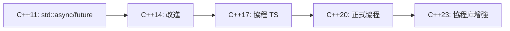

# 異步基礎與協程 (Async Fundamentals & Coroutines)

> **優先級**: ⭐⭐⭐ 必看
> **適用場景**: 異步 I/O / 並發編程 / HFT 非關鍵路徑
> **前置知識**: C++ 多線程基礎, Lambda 表達式

## 目錄

- [核心概念](#核心概念)
- [C++ 標準異步工具](#c-標準異步工具)
- [C++20 協程 (Coroutines)](#c20-協程-coroutines)
- [協程實戰應用](#協程實戰應用)
- [性能對比與選擇](#性能對比與選擇)
- [最佳實踐](#最佳實踐)
- [參考資料](#參考資料)

---

## 核心概念

### 1. 什麼是異步編程

**異步編程 (Asynchronous Programming)** 允許程序在等待 I/O 操作完成時繼續執行其他任務，而不是阻塞等待。

**同步 vs 異步對比**:

| 特性       | 同步 (Synchronous)      | 異步 (Asynchronous)        |
|------------|-------------------------|----------------------------|
| 執行方式   | 順序執行，阻塞等待      | 並發執行，非阻塞           |
| 資源利用   | 低 (等待時 CPU 閒置)    | 高 (等待時可執行其他任務)  |
| 編程複雜度 | 低 (邏輯直觀)           | 中高 (需處理回調或協程)    |
| 適用場景   | CPU 密集型計算          | I/O 密集型操作             |

### 2. C++ 異步編程演進



---

## C++ 標準異步工具

### 1. std::async 與 std::future

`std::async` 提供簡單的異步任務執行機制。

#### 基本用法

```cpp
#include <future>
#include <iostream>
#include <chrono>

// 耗時計算函數
int expensive_computation(int x) {
    std::this_thread::sleep_for(std::chrono::seconds(1));
    return x * x;
}

void async_basic_example() {
    // 啟動異步任務
    std::future<int> result = std::async(std::launch::async,
                                         expensive_computation, 10);
    
    std::cout << "Doing other work while computation runs...\n";
    
    // 獲取結果 (阻塞直到完成)
    int value = result.get();
    std::cout << "Result: " << value << "\n";  // 100
}
```

#### 啟動策略 (Launch Policy)

```cpp
void launch_policy_example() {
    // 1. std::launch::async - 立即在新線程中執行
    auto f1 = std::async(std::launch::async, []() {
        return 42;
    });
    
    // 2. std::launch::deferred - 延遲執行 (調用 get() 時才執行)
    auto f2 = std::async(std::launch::deferred, []() {
        return 100;
    });
    
    // 3. 默認策略 (實現定義, 可能是 async 或 deferred)
    auto f3 = std::async([]() {
        return 200;
    });
    
    std::cout << f1.get() << "\n";  // 42
    std::cout << f2.get() << "\n";  // 100 (此時才執行)
    std::cout << f3.get() << "\n";  // 200
}
```

#### HFT 適用性分析

| 特性   | std::async | 手動線程 | 評價          |
|--------|------------|----------|---------------|
| 延遲   | ~1-10μs    | ~100ns   | ❌ 不適合 HFT |
| 開銷   | 線程創建   | 可控     | ❌ 開銷大     |
| 靈活性 | 低         | 高       | ❌ 控制有限   |

**結論**: `std::async` 不適合 HFT 關鍵路徑，但可用於:
- 非關鍵路徑的後台任務
- 初始化階段的並行處理
- 日誌、監控等輔助功能

---

### 2. std::promise 與 std::future

`std::promise` 允許在一個線程中設置值，在另一個線程中獲取。

#### 基本用法

```cpp
#include <future>
#include <thread>

void promise_example() {
    std::promise<int> promise;
    std::future<int> future = promise.get_future();
    
    // 生產者線程
    std::thread producer([&promise]() {
        std::this_thread::sleep_for(std::chrono::seconds(1));
        promise.set_value(42);  // 設置結果
    });
    
    // 消費者線程 (主線程)
    std::cout << "Waiting for result...\n";
    int result = future.get();  // 阻塞等待
    std::cout << "Got result: " << result << "\n";
    
    producer.join();
}
```

#### 異常傳播

```cpp
void promise_exception_example() {
    std::promise<int> promise;
    std::future<int> future = promise.get_future();
    
    std::thread t([&promise]() {
        try {
            throw std::runtime_error("Something went wrong");
        } catch (...) {
            promise.set_exception(std::current_exception());
        }
    });
    
    try {
        future.get();  // 重新拋出異常
    } catch (const std::exception& e) {
        std::cout << "Caught: " << e.what() << "\n";
    }
    
    t.join();
}
```

---

## C++20 協程 (Coroutines)

### 1. 協程核心概念

**協程 (Coroutines)** 是 C++20 引入的革命性特性:

- **可暫停函數**: 函數可以暫停並稍後恢復
- **無棧協程**: 狀態保存在堆上，開銷小
- **語法糖**: `co_await`, `co_yield`, `co_return`
- **零開銷抽象**: 編譯器優化後性能極佳

### 2. 協程關鍵字

```cpp
// co_return - 返回值並結束協程
Task<int> simple_coroutine() {
    co_return 42;
}

// co_yield - 產生值並暫停 (Generator)
Generator<int> range(int start, int end) {
    for (int i = start; i < end; ++i) {
        co_yield i;  // 產生值並暫停
    }
}

// co_await - 等待異步操作完成
Task<int> async_operation() {
    int result = co_await some_async_task();
    co_return result;
}
```

### 3. Generator 實現 (同步協程)

```cpp
#include <coroutine>
#include <iostream>
#include <exception>

// Generator 協程類型
template<typename T>
class Generator {
public:
    struct promise_type {
        T current_value;
        std::exception_ptr exception;
        
        Generator get_return_object() {
            return Generator{std::coroutine_handle<promise_type>::from_promise(*this)};
        }
        
        std::suspend_always initial_suspend() { return {}; }
        std::suspend_always final_suspend() noexcept { return {}; }
        
        std::suspend_always yield_value(T value) {
            current_value = value;
            return {};
        }
        
        void return_void() {}
        
        void unhandled_exception() {
            exception = std::current_exception();
        }
    };
    
    struct iterator {
        std::coroutine_handle<promise_type> handle;
        
        iterator& operator++() {
            handle.resume();
            return *this;
        }
        
        T operator*() const {
            return handle.promise().current_value;
        }
        
        bool operator!=(const iterator& other) const {
            return !handle.done();
        }
    };
    
    iterator begin() {
        handle.resume();
        return {handle};
    }
    
    iterator end() { return {nullptr}; }
    
    ~Generator() {
        if (handle) handle.destroy();
    }
    
private:
    explicit Generator(std::coroutine_handle<promise_type> h) : handle(h) {}
    std::coroutine_handle<promise_type> handle;
};

// 使用 Generator
Generator<int> fibonacci(int n) {
    int a = 0, b = 1;
    for (int i = 0; i < n; ++i) {
        co_yield a;
        int next = a + b;
        a = b;
        b = next;
    }
}

void generator_example() {
    for (int value : fibonacci(10)) {
        std::cout << value << " ";  // 0 1 1 2 3 5 8 13 21 34
    }
    std::cout << "\n";
}
```

### 4. Task 實現 (異步協程)

```cpp
#include <coroutine>
#include <optional>

// 簡化的 Task 類型
template<typename T>
class Task {
public:
    struct promise_type {
        std::optional<T> result;
        
        Task get_return_object() {
            return Task{std::coroutine_handle<promise_type>::from_promise(*this)};
        }
        
        std::suspend_never initial_suspend() { return {}; }
        std::suspend_always final_suspend() noexcept { return {}; }
        
        void return_value(T value) {
            result = value;
        }
        
        void unhandled_exception() {
            std::terminate();
        }
    };
    
    T get() {
        if (!handle.done()) {
            handle.resume();
        }
        return *handle.promise().result;
    }
    
    ~Task() {
        if (handle) handle.destroy();
    }
    
private:
    explicit Task(std::coroutine_handle<promise_type> h) : handle(h) {}
    std::coroutine_handle<promise_type> handle;
};

// 異步任務示例
Task<int> async_compute(int x) {
    // 模擬異步操作
    co_return x * x;
}

void task_example() {
    Task<int> task = async_compute(10);
    int result = task.get();
    std::cout << "Result: " << result << "\n";  // 100
}
```

---

## 協程實戰應用

### 1. 協程優勢

#### 代碼清晰度對比

```cpp
// ❌ 回調地獄
async_read(socket, [](auto data1) {
    async_process(data1, [](auto data2) {
        async_write(socket, data2, [](auto result) {
            // ...
        });
    });
});

// ✅ 協程 (清晰易讀)
Task<void> handle_request() {
    auto data1 = co_await async_read(socket);
    auto data2 = co_await async_process(data1);
    co_await async_write(socket, data2);
}
```

#### 性能優勢

- **零開銷抽象**: 狀態機編譯優化
- **無額外堆分配**: 編譯器優化
- **無上下文切換**: 相比線程切換

### 2. HFT 應用場景

```cpp
// 異步市場數據處理
Task<void> process_market_data() {
    while (true) {
        // 異步接收市場數據
        auto md_event = co_await receiver.receive_next();
        
        // 策略計算 (同步, 極快)
        auto signal = strategy.calculate(md_event);
        
        // 如果有交易信號
        if (signal.should_trade) {
            auto order = create_order(signal);
            // 異步發送訂單
            co_await order_sender.send_order(order);
        }
    }
}
```

---

## 性能對比與選擇

### 1. 異步方案對比

| 方案            | 延遲         | 內存開銷     | 代碼複雜度    | HFT 推薦   |
|-----------------|--------------|--------------|---------------|------------|
| 回調            | 極低 (~50ns) | 極小         | 高 (回調地獄) | ⭐⭐⭐     |
| 線程            | 高 (~1μs)    | 大 (MB/線程) | 中等          | ⭐         |
| std::async      | 高 (~10μs)   | 大           | 低            | ⭐         |
| 協程 (C++20)    | 低 (~100ns)  | 小 (KB)      | 低            | ⭐⭐⭐⭐⭐ |
| SPSC + 專用線程 | 極低 (~10ns) | 中等         | 中等          | ⭐⭐⭐⭐⭐ |

### 2. 使用建議

**關鍵路徑**: 使用 SPSC 隊列 + 專用線程
- 市場數據接收 → 策略引擎
- 策略引擎 → 訂單發送

**非關鍵路徑**: 使用協程
- 風險檢查
- 日誌記錄
- 監控上報

**後台任務**: 使用 std::async 或線程池
- 數據持久化
- 統計計算
- 系統監控

---

## 最佳實踐

### 1. 何時使用協程

✅ **適合使用協程**:
- I/O 密集型操作 (網路、文件)
- 需要等待多個異步操作
- 代碼可讀性重要
- 非極端延遲敏感 (< 1μs)

❌ **不適合使用協程**:
- 極端延遲敏感 (< 100ns)
- CPU 密集型計算
- 簡單的同步操作

### 2. 協程編碼規範

```cpp
// ✅ 好的協程使用
Task<void> good_coroutine_usage() {
    // 1. 異步 I/O 操作
    auto data = co_await async_read(socket);
    
    // 2. 同步處理 (快速)
    auto processed = process_data(data);
    
    // 3. 異步寫入
    co_await async_write(socket, processed);
}

// ❌ 不好的協程使用
Task<int> bad_coroutine_usage() {
    // 不要在協程中做 CPU 密集型計算
    int result = 0;
    for (int i = 0; i < 1000000; ++i) {
        result += expensive_computation(i);  // 阻塞協程!
    }
    co_return result;
}
```

### 3. 錯誤處理

```cpp
// 協程中的異常處理
Task<void> coroutine_with_error_handling() {
    try {
        auto data = co_await async_read(socket);
        co_await async_process(data);
    } catch (const std::exception& e) {
        log_error("Coroutine error: ", e.what());
        // 清理資源
        co_await cleanup();
    }
}
```

---

## 參考資料

1. [C++ Coroutines (cppreference)](https://en.cppreference.com/w/cpp/language/coroutines)
2. [Understanding C++20 Coroutines - Lewis Baker](https://lewissbaker.github.io/)
3. [C++20 Coroutines: sketching a minimal async framework](https://www.jeremyong.com/cpp/2021/01/04/cpp20-coroutines-a-minimal-async-framework/)
4. [CppCon 2019: Coroutines in C++20](https://www.youtube.com/watch?v=ZTqHjjm86Bw)
5. [Asymmetric Transfer - Coroutines Blog](https://lewissbaker.github.io/)
