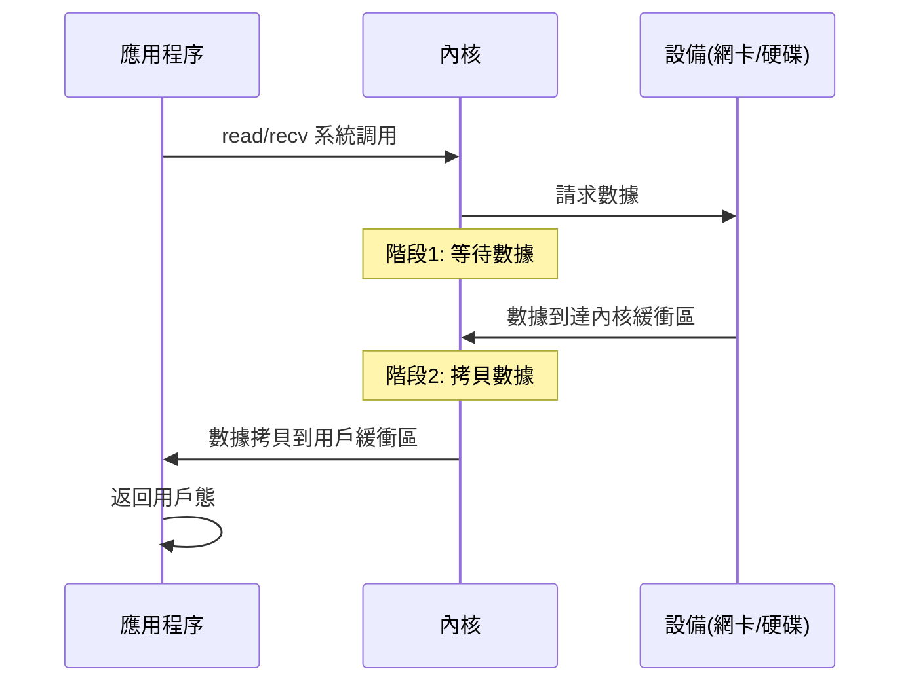
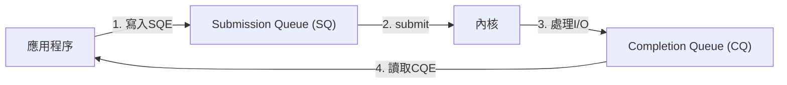
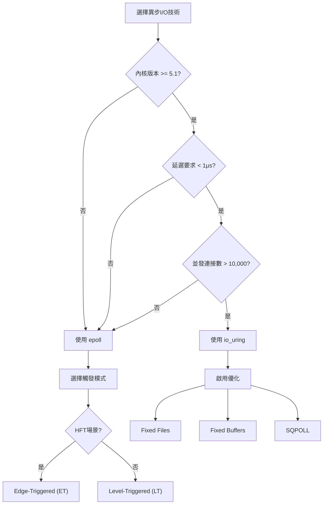

# 異步IO深度解析 (Asynchronous I/O Deep Dive)

> **優先級**: ⭐⭐⭐ 必看
> **適用場景**: HFT/金融系統/高性能網路編程
> **前置知識**: TCP/IP基礎、作業系統I/O模型、多執行緒基礎

## 目錄

- [核心概念](#核心概念)
- [Linux I/O模型深度解析](#linux-io模型深度解析)
- [epoll深度剖析](#epoll深度剖析)
- [io_uring革命性突破](#io_uring革命性突破)
- [性能對比與選型](#性能對比與選型)
- [實戰案例](#實戰案例)
- [常見陷阱](#常見陷阱)
- [參考資料](#參考資料)

## 核心概念

### I/O操作的兩個階段

所有I/O操作可分為兩個階段:

1. **等待數據就緒** (Waiting for Data Ready)
   - 數據從網卡到達內核緩衝區
   - 或文件數據載入到內核緩衝區

2. **數據拷貝** (Data Copying)
   - 數據從內核緩衝區拷貝到用戶緩衝區

**時序圖**:



### 同步 vs 異步 vs 阻塞 vs 非阻塞

這是最容易混淆的概念,需要嚴格區分:

- **阻塞 (Blocking)**:  調用者掛起,直到操作完成
- **非阻塞 (Non-blocking)**: 調用立即返回,操作未完成則返回錯誤碼
- **同步 (Synchronous)**: 調用者負責檢查操作完成狀態
- **異步 (Asynchronous)**: 操作完成後內核主動通知調用者

**關鍵區別**:

```cpp
// 阻塞 I/O (同步阻塞)
ssize_t n = recv(sockfd, buffer, len, 0);  // 掛起直到有數據
// ✅ 優點: 編程簡單
// ❌ 缺點: 無法處理高並發

// 非阻塞 I/O (同步非阻塞)
fcntl(sockfd, F_SETFL, O_NONBLOCK);
ssize_t n = recv(sockfd, buffer, len, 0);  // 立即返回
if (n < 0 && (errno == EAGAIN || errno == EWOULDBLOCK)) {
    // 沒有數據,稍後再試
}
// ✅ 優點: 不會掛起
// ❌ 缺點: 需要輪詢 (busy loop),浪費 CPU

// 異步 I/O (真正的異步)
io_uring_prep_recv(sqe, sockfd, buffer, len, 0);
io_uring_submit(&ring);
// 立即返回,數據準備好後內核通知
// ✅ 優點: 無需輪詢,CPU 效率高
// ✅ 優點: 內核直接拷貝數據到用戶緩衝區
```

---

## Linux I/O模型深度解析

### 模型1: 阻塞I/O (Blocking I/O)

**原理**: 預設模式,調用 `recv` 時線程被掛起,直到數據到達。

```cpp
#include <sys/socket.h>
#include <unistd.h>
#include <iostream>

void blocking_io_example(int sockfd) {
    char buffer[1024];
    
    std::cout << "Calling recv (will block)...\n";
    
    // 阻塞直到有數據
    ssize_t n = recv(sockfd, buffer, sizeof(buffer), 0);
    
    if (n > 0) {
        std::cout << "Received " << n << " bytes\n";
    } else if (n == 0) {
        std::cout << "Connection closed\n";
    } else {
        std::cerr << "Error: " << errno << "\n";
    }
}
```

**時序圖**:

```
應用程序           內核
   |                |
   |--- recv ------>|
   |                | (阻塞)
   |                | 等待數據...
   |                | 數據到達
   |<-- 返回數據 ---|
   |                |
```

**適用場景**: 低並發、簡單業務邏輯

**缺點**:
- 每個連接需要一個線程 (C10K問題)
- 線程切換開銷大
- 無法應用於HFT

### 模型2: 非阻塞I/O (Non-blocking I/O)

**原理**: 設置 `O_NONBLOCK`,調用立即返回,無數據時返回 `EAGAIN`。

```cpp
#include <fcntl.h>
#include <sys/socket.h>
#include <unistd.h>
#include <cerrno>
#include <iostream>

void nonblocking_io_example(int sockfd) {
    // 設置非阻塞
    int flags = fcntl(sockfd, F_GETFL, 0);
    fcntl(sockfd, F_SETFL, flags | O_NONBLOCK);
    
    char buffer[1024];
    
    // 輪詢讀取 (Busy Loop) ❌ 不推薦
    while (true) {
        ssize_t n = recv(sockfd, buffer, sizeof(buffer), 0);
        
        if (n > 0) {
            std::cout << "Received " << n << " bytes\n";
            break;
        } else if (n == 0) {
            std::cout << "Connection closed\n";
            break;
        } else {
            if (errno == EAGAIN || errno == EWOULDBLOCK) {
                // 沒有數據,繼續輪詢 (浪費 CPU)
                continue;
            } else {
                std::cerr << "Error\n";
                break;
            }
        }
    }
}
```

**缺點**:
- Busy Loop 浪費 CPU
- 實際生產環境幾乎不單獨使用
- 通常與I/O多路復用結合

### 模型3: I/O多路復用 (I/O Multiplexing)

**原理**: 使用 `select`/`poll`/`epoll` 監控多個 fd,有事件時通知應用程序。

```cpp
#include <sys/epoll.h>
#include <unistd.h>
#include <vector>
#include <iostream>

void io_multiplexing_example(int listen_fd) {
    // 創建 epoll 實例
    int epoll_fd = epoll_create1(0);
    
    struct epoll_event ev;
    ev.events = EPOLLIN;
    ev.data.fd = listen_fd;
    epoll_ctl(epoll_fd, EPOLL_CTL_ADD, listen_fd, &ev);
    
    std::vector<struct epoll_event> events(64);
    
    while (true) {
        // 阻塞等待事件
        int nfds = epoll_wait(epoll_fd, events.data(), events.size(), -1);
        
        for (int i = 0; i < nfds; ++i) {
            int fd = events[i].data.fd;
            
            if (fd == listen_fd) {
                // 新連接
                int client_fd = accept(listen_fd, nullptr, nullptr);
                
                struct epoll_event client_ev;
                client_ev.events = EPOLLIN | EPOLLET;  // Edge-triggered
                client_ev.data.fd = client_fd;
                epoll_ctl(epoll_fd, EPOLL_CTL_ADD, client_fd, &client_ev);
            } else {
                // 數據到達
                char buffer[1024];
                ssize_t n = recv(fd, buffer, sizeof(buffer), 0);
                
                if (n > 0) {
                    std::cout << "Received " << n << " bytes from fd " << fd << "\n";
                } else {
                    close(fd);
                }
            }
        }
    }
    
    close(epoll_fd);
}
```

**優點**:
- 單線程處理上萬連接
- Linux 下 epoll 性能極佳 (O(1) 複雜度)

**缺點**:
- 編程複雜度高
- 仍需要系統調用拷貝數據

### 模型4: 信號驅動I/O (Signal-driven I/O)

**原理**: 註冊 `SIGIO` 信號,數據到達時收到信號通知。

**缺點**: 信號處理複雜,實際較少使用,不推薦。

### 模型5: 異步I/O (Asynchronous I/O)

**原理**: 告訴內核啟動操作,**數據拷貝完成後**內核通知應用程序。

```cpp
#include <liburing.h>
#include <iostream>

void async_io_example(int sockfd) {
    struct io_uring ring;
    io_uring_queue_init(256, &ring, 0);
    
    char buffer[1024];
    
    // 提交異步讀取請求
    struct io_uring_sqe *sqe = io_uring_get_sqe(&ring);
    io_uring_prep_recv(sqe, sockfd, buffer, sizeof(buffer), 0);
    io_uring_sqe_set_data(sqe, buffer);
    io_uring_submit(&ring);
    
    std::cout << "Submitted async read, doing other work...\n";
    
    // 做其他工作...
    
    // 等待完成
    struct io_uring_cqe *cqe;
    io_uring_wait_cqe(&ring, &cqe);
    
    int result = cqe->res;
    if (result > 0) {
        std::cout << "Async read completed: " << result << " bytes\n";
        // 數據已經在 buffer 中了！
    }
    
    io_uring_cqe_seen(&ring, cqe);
    io_uring_queue_exit(&ring);
}
```

**關鍵優勢**:
- **數據拷貝階段也是異步的** (與前4種模型的根本區別)
- 內核直接將數據拷貝到用戶緩衝區
- 無需應用程序調用 `read/recv`

---

## epoll深度剖析

### epoll核心數據結構

```cpp
// 內核中的 eventpoll 結構 (簡化版)
struct eventpoll {
    struct rb_root rbr;       // 紅黑樹根節點,存儲所有監控的 fd
    struct list_head rdllist; // 就緒鏈表,存儲已就緒的 fd
    wait_queue_head_t wq;     // 等待隊列
};
```

**紅黑樹 (Red-Black Tree)**:
- 用於高效管理監控的 fd (O(log N) 插入/刪除)
- 相比 `select`/`poll` 的線性結構,性能大幅提升

**就緒鏈表 (Ready List)**:
- 雙向鏈表,存儲就緒的 fd
- `epoll_wait` 只需檢查此鏈表 (O(1) 複雜度)
- 當網卡收到數據,中斷處理程序通過回調將 fd 加入就緒鏈表

### epoll觸發模式: LT vs ET

#### Level-Triggered (LT) 水平觸發

**機制**: 只要 fd 有未讀數據,每次 `epoll_wait` 都會返回該 fd。

```cpp
#include <sys/epoll.h>
#include <fcntl.h>
#include <unistd.h>

void epoll_lt_example(int sockfd) {
    int epoll_fd = epoll_create1(0);
    
    struct epoll_event ev;
    ev.events = EPOLLIN;  // Level-Triggered (預設)
    ev.data.fd = sockfd;
    epoll_ctl(epoll_fd, EPOLL_CTL_ADD, sockfd, &ev);
    
    struct epoll_event events[10];
    char buffer[100];  // 故意設置小緩衝區
    
    while (true) {
        int nfds = epoll_wait(epoll_fd, events, 10, -1);
        
        for (int i = 0; i < nfds; ++i) {
            if (events[i].events & EPOLLIN) {
                // 只讀取 100 bytes
                ssize_t n = recv(events[i].data.fd, buffer, sizeof(buffer), 0);
                
                if (n > 0) {
                    std::cout << "Read " << n << " bytes\n";
                }
                
                // LT 模式: 如果還有未讀數據,下次 epoll_wait 會再次返回此 fd
            }
        }
    }
}
```

**優點**:
- 編程簡單,不易丟失數據
- 即使沒有一次性讀完,下次仍會通知

**缺點**:
- 可能多次喚醒,系統調用次數較多

#### Edge-Triggered (ET) 邊緣觸發

**機制**: 只在 fd 狀態**變化**時通知一次,必須一次性讀完所有數據。

```cpp
#include <sys/epoll.h>
#include <fcntl.h>
#include <unistd.h>
#include <cerrno>

void epoll_et_example(int sockfd) {
    int epoll_fd = epoll_create1(0);
    
    // 必須設置非阻塞
    int flags = fcntl(sockfd, F_GETFL, 0);
    fcntl(sockfd, F_SETFL, flags | O_NONBLOCK);
    
    struct epoll_event ev;
    ev.events = EPOLLIN | EPOLLET;  // Edge-Triggered
    ev.data.fd = sockfd;
    epoll_ctl(epoll_fd, EPOLL_CTL_ADD, sockfd, &ev);
    
    struct epoll_event events[10];
    
    while (true) {
        int nfds = epoll_wait(epoll_fd, events, 10, -1);
        
        for (int i = 0; i < nfds; ++i) {
            if (events[i].events & EPOLLIN) {
                // ET 模式: 必須循環讀取直到 EAGAIN
                char buffer[1024];
                
                while (true) {
                    ssize_t n = recv(events[i].data.fd, buffer, sizeof(buffer), 0);
                    
                    if (n > 0) {
                        // 處理數據
                        std::cout << "Read " << n << " bytes\n";
                    } else if (n == 0) {
                        // 連接關閉
                        close(events[i].data.fd);
                        break;
                    } else {
                        if (errno == EAGAIN || errno == EWOULDBLOCK) {
                            // 讀完了,跳出循環
                            break;
                        } else {
                            // 錯誤
                            close(events[i].data.fd);
                            break;
                        }
                    }
                }
            }
        }
    }
}
```

**要求** (必須遵守):
1. fd 必須設置為非阻塞 (`O_NONBLOCK`)
2. 必須循環讀取直到 `EAGAIN` 或 `EWOULDBLOCK`
3. `accept` 也需要循環直到 `EAGAIN`

**優點**:
- 減少系統調用次數
- 高並發下性能更好
- **HFT 推薦使用**

**缺點**:
- 編程複雜,容易出錯
- 忘記讀完會導致數據丟失

### epoll完整Echo Server實現

```cpp
#include <sys/epoll.h>
#include <sys/socket.h>
#include <netinet/in.h>
#include <fcntl.h>
#include <unistd.h>
#include <cstring>
#include <iostream>

class EpollEchoServer {
public:
    EpollEchoServer(uint16_t port) : port_(port) {
        epoll_fd_ = epoll_create1(EPOLL_CLOEXEC);
        if (epoll_fd_ < 0) {
            throw std::runtime_error("epoll_create1 failed");
        }
    }
    
    ~EpollEchoServer() {
        if (epoll_fd_ >= 0) close(epoll_fd_);
        if (listen_fd_ >= 0) close(listen_fd_);
    }
    
    void start() {
        listen_fd_ = create_listen_socket();
        add_fd(listen_fd_, EPOLLIN);
        
        std::cout << "Server listening on port " << port_ << "\n";
        
        event_loop();
    }
    
private:
    void event_loop() {
        constexpr int MAX_EVENTS = 64;
        struct epoll_event events[MAX_EVENTS];
        
        while (true) {
            int nfds = epoll_wait(epoll_fd_, events, MAX_EVENTS, -1);
            
            if (nfds < 0) {
                std::cerr << "epoll_wait error\n";
                break;
            }
            
            for (int i = 0; i < nfds; ++i) {
                int fd = events[i].data.fd;
                
                if (fd == listen_fd_) {
                    handle_accept();
                } else {
                    handle_client(fd, events[i].events);
                }
            }
        }
    }
    
    void handle_accept() {
        // ET 模式下需要循環 accept
        while (true) {
            struct sockaddr_in client_addr;
            socklen_t addr_len = sizeof(client_addr);
            
            int client_fd = accept(listen_fd_, 
                                   (struct sockaddr*)&client_addr, 
                                   &addr_len);
            
            if (client_fd < 0) {
                if (errno == EAGAIN || errno == EWOULDBLOCK) {
                    break;  // 處理完所有連接
                } else {
                    std::cerr << "accept error\n";
                    break;
                }
            }
            
            std::cout << "New connection: fd=" << client_fd << "\n";
            
            add_fd(client_fd, EPOLLIN);
        }
    }
    
    void handle_client(int fd, uint32_t events) {
        if (events & EPOLLIN) {
            // ET 模式下需要循環讀取
            char buffer[1024];
            
            while (true) {
                ssize_t n = recv(fd, buffer, sizeof(buffer), 0);
                
                if (n > 0) {
                    // Echo back
                    send(fd, buffer, n, 0);
                } else if (n == 0) {
                    // 連接關閉
                    std::cout << "Connection closed: fd=" << fd << "\n";
                    epoll_ctl(epoll_fd_, EPOLL_CTL_DEL, fd, nullptr);
                    close(fd);
                    break;
                } else {
                    if (errno == EAGAIN || errno == EWOULDBLOCK) {
                        break;  // 讀完了
                    } else {
                        std::cerr << "recv error\n";
                        epoll_ctl(epoll_fd_, EPOLL_CTL_DEL, fd, nullptr);
                        close(fd);
                        break;
                    }
                }
            }
        }
        
        if (events & (EPOLLERR | EPOLLHUP)) {
            epoll_ctl(epoll_fd_, EPOLL_CTL_DEL, fd, nullptr);
            close(fd);
        }
    }
    
    int create_listen_socket() {
        int fd = socket(AF_INET, SOCK_STREAM, 0);
        if (fd < 0) {
            throw std::runtime_error("socket failed");
        }
        
        int opt = 1;
        setsockopt(fd, SOL_SOCKET, SO_REUSEADDR, &opt, sizeof(opt));
        
        // 設置非阻塞
        int flags = fcntl(fd, F_GETFL, 0);
        fcntl(fd, F_SETFL, flags | O_NONBLOCK);
        
        struct sockaddr_in addr;
        std::memset(&addr, 0, sizeof(addr));
        addr.sin_family = AF_INET;
        addr.sin_addr.s_addr = INADDR_ANY;
        addr.sin_port = htons(port_);
        
        if (bind(fd, (struct sockaddr*)&addr, sizeof(addr)) < 0) {
            throw std::runtime_error("bind failed");
        }
        
        if (listen(fd, 128) < 0) {
            throw std::runtime_error("listen failed");
        }
        
        return fd;
    }
    
    void add_fd(int fd, uint32_t events) {
        struct epoll_event ev;
        ev.events = events | EPOLLET;  // Edge-Triggered
        ev.data.fd = fd;
        
        if (epoll_ctl(epoll_fd_, EPOLL_CTL_ADD, fd, &ev) < 0) {
            throw std::runtime_error("epoll_ctl failed");
        }
    }
    
    int epoll_fd_ = -1;
    int listen_fd_ = -1;
    uint16_t port_;
};

int main() {
    try {
        EpollEchoServer server(8080);
        server.start();
    } catch (const std::exception& e) {
        std::cerr << "Error: " << e.what() << "\n";
        return 1;
    }
    
    return 0;
}
```

---

## io_uring革命性突破

### io_uring架構原理

io_uring (Linux 5.1+) 是 Linux I/O 的革命性進化,採用**雙環形緩衝區 (Ring Buffers)** 架構。



**三大核心組件**:

1. **Submission Queue (SQ)**: 應用程序提交 I/O 請求
2. **Completion Queue (CQ)**: 內核返回完成事件
3. **Shared Memory**: SQ 和 CQ 都位於用戶態和內核態共享的內存區域

**零系統調用模式**:

```cpp
// 傳統 epoll: 每次事件都需要系統調用
epoll_wait(...);  // syscall
read(...);        // syscall
write(...);       // syscall

// io_uring: 批量提交,減少系統調用
io_uring_prep_read(...);   // 用戶態操作
io_uring_prep_write(...);  // 用戶態操作
io_uring_submit(...);      // 單次 syscall
io_uring_wait_cqe(...);    // syscall
```

### io_uring基礎使用

```cpp
#include <liburing.h>
#include <fcntl.h>
#include <unistd.h>
#include <cstring>
#include <iostream>

void io_uring_basic_example() {
    struct io_uring ring;
    
    // 初始化 io_uring,queue 深度為 256
    if (io_uring_queue_init(256, &ring, 0) < 0) {
        std::cerr << "io_uring_queue_init failed\n";
        return;
    }
    
    // 打開文件
    int fd = open("test.txt", O_RDONLY);
    if (fd < 0) {
        std::cerr << "open failed\n";
        io_uring_queue_exit(&ring);
        return;
    }
    
    char buffer[1024];
    
    // 獲取 Submission Queue Entry (SQE)
    struct io_uring_sqe *sqe = io_uring_get_sqe(&ring);
    if (!sqe) {
        std::cerr << "io_uring_get_sqe failed\n";
        close(fd);
        io_uring_queue_exit(&ring);
        return;
    }
    
    // 準備異步讀取請求
    io_uring_prep_read(sqe, fd, buffer, sizeof(buffer), 0);
    
    // 設置用戶數據 (用於識別完成事件)
    io_uring_sqe_set_data(sqe, buffer);
    
    // 提交請求
    if (io_uring_submit(&ring) < 0) {
        std::cerr << "io_uring_submit failed\n";
        close(fd);
        io_uring_queue_exit(&ring);
        return;
    }
    
    std::cout << "Submitted async read, waiting for completion...\n";
    
    // 等待完成事件
    struct io_uring_cqe *cqe;
    if (io_uring_wait_cqe(&ring, &cqe) < 0) {
        std::cerr << "io_uring_wait_cqe failed\n";
        close(fd);
        io_uring_queue_exit(&ring);
        return;
    }
    
    // 獲取結果
    int result = cqe->res;
    if (result > 0) {
        std::cout << "Read " << result << " bytes: " << buffer << "\n";
    } else {
        std::cerr << "Read failed: " << result << "\n";
    }
    
    // 標記 CQE 已處理
    io_uring_cqe_seen(&ring, cqe);
    
    // 清理
    close(fd);
    io_uring_queue_exit(&ring);
}
```

### io_uring Echo Server完整實現

```cpp
#include <liburing.h>
#include <sys/socket.h>
#include <netinet/in.h>
#include <unistd.h>
#include <cstring>
#include <iostream>

enum EventType {
    EVENT_ACCEPT,
    EVENT_READ,
    EVENT_WRITE
};

struct Request {
    EventType type;
    int fd;
    char buffer[1024];
    size_t length;
};

class IoUringEchoServer {
public:
    IoUringEchoServer(uint16_t port) : port_(port) {
        if (io_uring_queue_init(256, &ring_, 0) < 0) {
            throw std::runtime_error("io_uring_queue_init failed");
        }
    }
    
    ~IoUringEchoServer() {
        io_uring_queue_exit(&ring_);
        if (listen_fd_ >= 0) close(listen_fd_);
    }
    
    void start() {
        listen_fd_ = create_listen_socket();
        submit_accept();
        
        std::cout << "Server listening on port " << port_ << "\n";
        
        event_loop();
    }
    
private:
    void event_loop() {
        while (true) {
            struct io_uring_cqe *cqe;
            
            // 等待完成事件
            if (io_uring_wait_cqe(&ring_, &cqe) < 0) {
                std::cerr << "io_uring_wait_cqe failed\n";
                break;
            }
            
            Request *req = static_cast<Request*>(io_uring_cqe_get_data(cqe));
            int result = cqe->res;
            
            switch (req->type) {
                case EVENT_ACCEPT:
                    handle_accept(req, result);
                    break;
                case EVENT_READ:
                    handle_read(req, result);
                    break;
                case EVENT_WRITE:
                    handle_write(req);
                    break;
            }
            
            io_uring_cqe_seen(&ring_, cqe);
        }
    }
    
    void submit_accept() {
        struct io_uring_sqe *sqe = io_uring_get_sqe(&ring_);
        if (!sqe) {
            std::cerr << "io_uring_get_sqe failed\n";
            return;
        }
        
        Request *req = new Request;
        req->type = EVENT_ACCEPT;
        req->fd = listen_fd_;
        
        io_uring_prep_accept(sqe, listen_fd_, nullptr, nullptr, 0);
        io_uring_sqe_set_data(sqe, req);
        io_uring_submit(&ring_);
    }
    
    void submit_read(int client_fd) {
        struct io_uring_sqe *sqe = io_uring_get_sqe(&ring_);
        if (!sqe) return;
        
        Request *req = new Request;
        req->type = EVENT_READ;
        req->fd = client_fd;
        
        io_uring_prep_recv(sqe, client_fd, req->buffer, sizeof(req->buffer), 0);
        io_uring_sqe_set_data(sqe, req);
        io_uring_submit(&ring_);
    }
    
    void submit_write(Request *req) {
        struct io_uring_sqe *sqe = io_uring_get_sqe(&ring_);
        if (!sqe) {
            delete req;
            return;
        }
        
        req->type = EVENT_WRITE;
        
        io_uring_prep_send(sqe, req->fd, req->buffer, req->length, 0);
        io_uring_sqe_set_data(sqe, req);
        io_uring_submit(&ring_);
    }
    
    void handle_accept(Request *req, int result) {
        if (result >= 0) {
            int client_fd = result;
            std::cout << "New connection: fd=" << client_fd << "\n";
            
            submit_read(client_fd);
            submit_accept();  // 繼續接受連接
        } else {
            std::cerr << "accept failed\n";
        }
        delete req;
    }
    
    void handle_read(Request *req, int result) {
        if (result > 0) {
            std::cout << "Received " << result << " bytes from fd=" << req->fd << "\n";
            req->length = result;
            submit_write(req);  // Echo back
        } else {
            std::cout << "Connection closed: fd=" << req->fd << "\n";
            close(req->fd);
            delete req;
        }
    }
    
    void handle_write(Request *req) {
        submit_read(req->fd);  // 繼續讀取
        delete req;
    }
    
    int create_listen_socket() {
        int fd = socket(AF_INET, SOCK_STREAM, 0);
        if (fd < 0) {
            throw std::runtime_error("socket failed");
        }
        
        int opt = 1;
        setsockopt(fd, SOL_SOCKET, SO_REUSEADDR, &opt, sizeof(opt));
        
        struct sockaddr_in addr;
        std::memset(&addr, 0, sizeof(addr));
        addr.sin_family = AF_INET;
        addr.sin_addr.s_addr = INADDR_ANY;
        addr.sin_port = htons(port_);
        
        if (bind(fd, (struct sockaddr*)&addr, sizeof(addr)) < 0) {
            throw std::runtime_error("bind failed");
        }
        
        if (listen(fd, 128) < 0) {
            throw std::runtime_error("listen failed");
        }
        
        return fd;
    }
    
    struct io_uring ring_;
    int listen_fd_ = -1;
    uint16_t port_;
};

int main() {
    try {
        IoUringEchoServer server(8080);
        server.start();
    } catch (const std::exception& e) {
        std::cerr << "Error: " << e.what() << "\n";
        return 1;
    }
    
    return 0;
}
```

### io_uring進階特性

#### Fixed Files (固定文件描述符)

```cpp
// 註冊文件描述符,避免每次查找 fd
int fds[] = {sockfd1, sockfd2, sockfd3};

io_uring_register_files(&ring, fds, 3);

// 使用固定 fd 索引 (而非實際 fd)
struct io_uring_sqe *sqe = io_uring_get_sqe(&ring);
io_uring_prep_recv(sqe, 0, buffer, len, 0);  // 0 是索引
sqe->flags |= IOSQE_FIXED_FILE;
```

**優勢**: 減少 fd 查找開銷,延遲降低 ~5-10%

#### Fixed Buffers (固定緩衝區)

```cpp
// 註冊緩衝區,避免內核重複 pin memory
struct iovec iovecs[2] = {
    {.iov_base = buffer1, .iov_len = 4096},
    {.iov_base = buffer2, .iov_len = 4096}
};

io_uring_register_buffers(&ring, iovecs, 2);

// 使用固定緩衝區
struct io_uring_sqe *sqe = io_uring_get_sqe(&ring);
io_uring_prep_read_fixed(sqe, fd, buffer1, 4096, 0, 0);  // 最後的 0 是緩衝區索引
```

**優勢**: 避免內存鎖定開銷,特別適合高頻 I/O

#### SQPOLL模式 (內核輪詢)

```cpp
struct io_uring_params params;
std::memset(&params, 0, sizeof(params));

// 啟用 SQPOLL: 內核線程自動處理 SQ
params.flags = IORING_SETUP_SQPOLL;
params.sq_thread_idle = 2000;  // 2秒空閒後休眠

io_uring_queue_init_params(256, &ring, &params);

// 準備請求
struct io_uring_sqe *sqe = io_uring_get_sqe(&ring);
io_uring_prep_read(sqe, fd, buffer, len, 0);

// 無需調用 submit! 內核線程自動處理
// io_uring_submit(&ring);  // 不需要
```

**優勢**: 消除 `io_uring_submit` 系統調用,真正的零系統調用

---

## 性能對比與選型

### Benchmark: epoll vs io_uring

```cpp
#include <chrono>
#include <iostream>
#include <sys/epoll.h>
#include <liburing.h>
#include <fcntl.h>
#include <unistd.h>

void benchmark_epoll() {
    int epfd = epoll_create1(0);
    int fd = open("test.dat", O_RDONLY);
    char buffer[4096];
    
    struct epoll_event ev;
    ev.events = EPOLLIN;
    ev.data.fd = fd;
    epoll_ctl(epfd, EPOLL_CTL_ADD, fd, &ev);
    
    auto start = std::chrono::high_resolution_clock::now();
    
    struct epoll_event events[1];
    for (int i = 0; i < 10000; ++i) {
        epoll_wait(epfd, events, 1, 0);
        read(fd, buffer, sizeof(buffer));
    }
    
    auto end = std::chrono::high_resolution_clock::now();
    auto duration = std::chrono::duration_cast<std::chrono::microseconds>(end - start);
    
    std::cout << "epoll: " << duration.count() / 10000.0 << " μs/op\n";
    
    close(fd);
    close(epfd);
}

void benchmark_io_uring() {
    struct io_uring ring;
    io_uring_queue_init(256, &ring, 0);
    
    int fd = open("test.dat", O_RDONLY);
    char buffer[4096];
    
    auto start = std::chrono::high_resolution_clock::now();
    
    for (int i = 0; i < 10000; ++i) {
        struct io_uring_sqe *sqe = io_uring_get_sqe(&ring);
        io_uring_prep_read(sqe, fd, buffer, sizeof(buffer), 0);
        io_uring_submit(&ring);
        
        struct io_uring_cqe *cqe;
        io_uring_wait_cqe(&ring, &cqe);
        io_uring_cqe_seen(&ring, cqe);
    }
    
    auto end = std::chrono::high_resolution_clock::now();
    auto duration = std::chrono::duration_cast<std::chrono::microseconds>(end - start);
    
    std::cout << "io_uring: " << duration.count() / 10000.0 << " μs/op\n";
    
    close(fd);
    io_uring_queue_exit(&ring);
}

int main() {
    benchmark_epoll();
    benchmark_io_uring();
    return 0;
}

// 典型結果:
// epoll:     ~2.5 μs/op
// io_uring:  ~1.2 μs/op (快 2 倍)
```

### 技術選型決策樹



### 選型建議

| 場景                | 推薦技術  | 理由                                      |
|---------------------|-----------|-------------------------------------------|
| 通用網路服務器      | epoll (ET) | 穩定、成熟、廣泛支持                      |
| HFT 市場數據接收    | io_uring  | 極低延遲 (~0.5-1μs)、批量處理              |
| HFT 訂單路由        | io_uring  | 減少系統調用、固定緩衝區優化               |
| 大文件傳輸          | io_uring  | 真正的異步、零拷貝                        |
| 舊系統 (Kernel < 5.1) | epoll (ET) | 唯一選擇                                  |

---

## 實戰案例

### 案例1: HFT市場數據接收器 (io_uring)

```cpp
#include <liburing.h>
#include <sys/socket.h>
#include <netinet/in.h>
#include <arpa/inet.h>
#include <cstring>
#include <iostream>
#include <vector>

struct MarketDataContext {
    int sockfd;
    char buffer[8192];  // 市場數據包
    size_t buffer_size = sizeof(buffer);
};

class IoUringMarketDataReceiver {
public:
    IoUringMarketDataReceiver(const std::vector<std::string>& multicast_groups, 
                               uint16_t port) {
        // 初始化 io_uring with SQPOLL
        struct io_uring_params params;
        std::memset(&params, 0, sizeof(params));
        params.flags = IORING_SETUP_SQPOLL;
        params.sq_thread_idle = 1000;  // 1秒空閒
        
        io_uring_queue_init_params(256, &ring_, &params);
        
        // 創建 UDP multicast sockets
        for (const auto& group : multicast_groups) {
            int sockfd = create_multicast_socket(group, port);
            
            auto ctx = std::make_unique<MarketDataContext>();
            ctx->sockfd = sockfd;
            
            submit_recv(ctx.get());
            contexts_.push_back(std::move(ctx));
        }
    }
    
    ~IoUringMarketDataReceiver() {
        io_uring_queue_exit(&ring_);
    }
    
    void run() {
        while (true) {
            struct io_uring_cqe *cqe;
            
            // 非阻塞輪詢
            int ret = io_uring_peek_cqe(&ring_, &cqe);
            
            if (ret == 0) {
                auto *ctx = static_cast<MarketDataContext*>(io_uring_cqe_get_data(cqe));
                int bytes = cqe->res;
                
                if (bytes > 0) {
                    // 處理市場數據 (超低延遲路徑)
                    process_market_data(ctx->buffer, bytes);
                    
                    // 重新提交接收請求
                    submit_recv(ctx);
                } else {
                    std::cerr << "recv error: " << bytes << "\n";
                }
                
                io_uring_cqe_seen(&ring_, cqe);
            } else if (ret == -EAGAIN) {
                // 無事件,繼續輪詢
            }
        }
    }
    
private:
    int create_multicast_socket(const std::string& group, uint16_t port) {
        int sockfd = socket(AF_INET, SOCK_DGRAM, 0);
        
        int opt = 1;
        setsockopt(sockfd, SOL_SOCKET, SO_REUSEADDR, &opt, sizeof(opt));
        
        struct sockaddr_in addr;
        std::memset(&addr, 0, sizeof(addr));
        addr.sin_family = AF_INET;
        addr.sin_addr.s_addr = INADDR_ANY;
        addr.sin_port = htons(port);
        
        bind(sockfd, (struct sockaddr*)&addr, sizeof(addr));
        
        // 加入 multicast 組
        struct ip_mreq mreq;
        mreq.imr_multiaddr.s_addr = inet_addr(group.c_str());
        mreq.imr_interface.s_addr = INADDR_ANY;
        setsockopt(sockfd, IPPROTO_IP, IP_ADD_MEMBERSHIP, &mreq, sizeof(mreq));
        
        return sockfd;
    }
    
    void submit_recv(MarketDataContext *ctx) {
        struct io_uring_sqe *sqe = io_uring_get_sqe(&ring_);
        io_uring_prep_recv(sqe, ctx->sockfd, ctx->buffer, ctx->buffer_size, 0);
        io_uring_sqe_set_data(sqe, ctx);
        // SQPOLL 模式下無需手動 submit
    }
    
    void process_market_data(const char *data, size_t len) {
        // HFT 關鍵路徑: 解析並更新訂單簿
        // 延遲要求 < 500ns
        
        // TODO: 實際解析邏輯
        // update_order_book(data, len);
    }
    
    struct io_uring ring_;
    std::vector<std::unique_ptr<MarketDataContext>> contexts_;
};

int main() {
    std::vector<std::string> groups = {
        "239.1.1.1",  // 交易所A
        "239.1.1.2"   // 交易所B
    };
    
    IoUringMarketDataReceiver receiver(groups, 9000);
    receiver.run();
    
    return 0;
}
```

### 案例2: Reactor模式 (epoll ET)

```cpp
#include <sys/epoll.h>
#include <sys/socket.h>
#include <fcntl.h>
#include <unistd.h>
#include <functional>
#include <unordered_map>
#include <iostream>

class EpollReactor {
public:
    using EventHandler = std::function<void(uint32_t events)>;
    
    EpollReactor() {
        epoll_fd_ = epoll_create1(EPOLL_CLOEXEC);
        if (epoll_fd_ < 0) {
            throw std::runtime_error("epoll_create1 failed");
        }
    }
    
    ~EpollReactor() {
        if (epoll_fd_ >= 0) close(epoll_fd_);
    }
    
    void register_handler(int fd, uint32_t events, EventHandler handler) {
        // 設置非阻塞
        int flags = fcntl(fd, F_GETFL, 0);
        fcntl(fd, F_SETFL, flags | O_NONBLOCK);
        
        struct epoll_event ev;
        ev.events = events | EPOLLET;  // Edge-Triggered
        ev.data.fd = fd;
        
        if (epoll_ctl(epoll_fd_, EPOLL_CTL_ADD, fd, &ev) < 0) {
            throw std::runtime_error("epoll_ctl failed");
        }
        
        handlers_[fd] = std::move(handler);
    }
    
    void unregister_handler(int fd) {
        epoll_ctl(epoll_fd_, EPOLL_CTL_DEL, fd, nullptr);
        handlers_.erase(fd);
    }
    
    void run() {
        constexpr int MAX_EVENTS = 1024;
        struct epoll_event events[MAX_EVENTS];
        
        running_ = true;
        
        while (running_) {
            int nfds = epoll_wait(epoll_fd_, events, MAX_EVENTS, -1);
            
            if (nfds < 0) {
                if (errno == EINTR) continue;
                throw std::runtime_error("epoll_wait failed");
            }
            
            for (int i = 0; i < nfds; ++i) {
                int fd = events[i].data.fd;
                uint32_t ev = events[i].events;
                
                auto it = handlers_.find(fd);
                if (it != handlers_.end()) {
                    it->second(ev);
                }
            }
        }
    }
    
    void stop() {
        running_ = false;
    }
    
private:
    int epoll_fd_;
    bool running_ = false;
    std::unordered_map<int, EventHandler> handlers_;
};
```

---

## 常見陷阱

### 陷阱1: ET模式忘記循環讀取

**錯誤示範**:

```cpp
// ❌ 錯誤: ET 模式下只讀一次
void handle_client(int fd) {
    char buffer[1024];
    ssize_t n = recv(fd, buffer, sizeof(buffer), 0);  // 只讀一次
    if (n > 0) {
        process_data(buffer, n);
    }
    // 如果還有未讀數據,將永遠不會再被通知!
}
```

**正確實現**:

```cpp
// ✅ 正確: ET 模式下循環讀取直到 EAGAIN
void handle_client(int fd) {
    char buffer[1024];
    
    while (true) {
        ssize_t n = recv(fd, buffer, sizeof(buffer), 0);
        
        if (n > 0) {
            process_data(buffer, n);
        } else if (n == 0) {
            close(fd);
            break;
        } else {
            if (errno == EAGAIN || errno == EWOULDBLOCK) {
                break;  // 讀完了
            } else {
                close(fd);
                break;
            }
        }
    }
}
```

### 陷阱2: io_uring忘記消費CQE

**錯誤示範**:

```cpp
// ❌ 錯誤: 忘記調用 io_uring_cqe_seen
void process_completion() {
    struct io_uring_cqe *cqe;
    io_uring_wait_cqe(&ring, &cqe);
    
    int result = cqe->res;
    process_result(result);
    
    // 忘記標記 CQE 已處理,導致 CQ 溢出
}
```

**正確實現**:

```cpp
// ✅ 正確: 必須調用 io_uring_cqe_seen
void process_completion() {
    struct io_uring_cqe *cqe;
    io_uring_wait_cqe(&ring, &cqe);
    
    int result = cqe->res;
    process_result(result);
    
    io_uring_cqe_seen(&ring, cqe);  // 標記已處理
}
```

### 陷阱3: epoll_data聯合體誤用

**錯誤示範**:

```cpp
// ❌ 錯誤: 使用 fd 字段,但處理時使用 ptr
epoll_event ev;
ev.events = EPOLLIN;
ev.data.fd = sockfd;
epoll_ctl(epfd, EPOLL_CTL_ADD, sockfd, &ev);

// 處理事件時
auto *ctx = static_cast<Context*>(events[i].data.ptr);  // 錯誤!
```

**正確實現**:

```cpp
// ✅ 正確: 使用 ptr 字段存儲上下文
epoll_event ev;
ev.events = EPOLLIN;
ev.data.ptr = new Context{sockfd};
epoll_ctl(epfd, EPOLL_CTL_ADD, sockfd, &ev);

// 處理事件時
auto *ctx = static_cast<Context*>(events[i].data.ptr);
```

---

## 最佳實踐

1. **epoll優先使用ET模式**: HFT場景減少系統調用
2. **ET模式必須非阻塞**: 避免死鎖
3. **io_uring啟用SQPOLL**: 真正零系統調用
4. **使用Fixed Files/Buffers**: 降低開銷
5. **批量提交io_uring請求**: 提高吞吐量
6. **避免在回調中阻塞**: 影響整個事件循環
7. **妥善處理EWOULDBLOCK**: ET模式下的終止條件
8. **使用epoll_data.ptr**: 存儲連接上下文

---

## 參考資料 (References)

1. [epoll(7) - Linux Manual Page](https://man7.org/linux/man-pages/man7/epoll.7.html)
2. [io_uring - Efficient I/O with io_uring](https://kernel.dk/io_uring.pdf) - Jens Axboe
3. [liburing GitHub Repository](https://github.com/axboe/liburing)
4. [Lord of the io_uring](https://unixism.net/loti/) - Tutorial Series
5. Stevens, W. Richard. *UNIX Network Programming, Volume 1: The Sockets Networking API* (3rd Edition)
6. [The C10K Problem](http://www.kegel.com/c10k.html) - Dan Kegel
7. [io_uring by Example](https://github.com/shuveb/io_uring-by-example)
8. [Awesome io_uring](https://github.com/espoal/awesome-iouring) - Curated List
