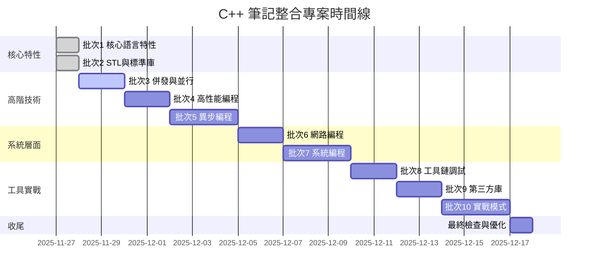

# C++ 筆記整合實施計畫

## 專案目標

整合現有的兩個 C++ 筆記目錄,創建統一的高質量知識庫:

- **源目錄 A**: `02-languages/cpp/` - 結構化、細粒度的主題筆記
- **源目錄 B**: `02-languages/cpp/金融C++專題/` - 深度整合型筆記
- **輸出目錄**: `02-languages/cpp_new/`

### 核心設計原則

1. **清晰的主題分層** - 採用源目錄 A 的模組化結構
2. **深入的技術細節** - 保留源目錄 B 的深度與實戰案例
3. **完整性** - 融合兩者,無內容缺失
4. **去重整合** - 消除冗餘,避免重複
5. **質量優先** - 移除過時/低價值內容,確保每篇筆記的實用性
6. **深入說明** - 重要或困難概念必須有詳細文字說明

---

## 目標目錄結構

```
02-languages/cpp_new/
├── README.md                          # 學習路線圖與使用指南
├── 01-核心語言特性/                   # 11 篇 - C++ 語言基礎與進階特性
│   ├── 00-未定義行為與陷阱.md         # ⭐⭐⭐ 金融/01 第1章
│   ├── 01-類型系統與轉換.md           # ⭐⭐⭐ 金融/01 第2-3章
│   ├── 02-關鍵字與修飾符.md           # ⭐⭐⭐ 金融/01 第4章
│   ├── 03-記憶體模型與RAII.md         # ⭐⭐⭐ 融合 cpp/01/01 + 金融/01
│   ├── 04-智能指針深度解析.md         # ⭐⭐⭐ 金融/01 第5章
│   ├── 05-移動語義與完美轉發.md       # ⭐⭐⭐ 融合 金融/01 第6章 + cpp/01/02
│   ├── 06-模板元編程精要.md           # ⭐⭐ 融合 cpp/01/03 + 金融/01 第7章
│   ├── 07-Lambda與函數對象.md         # ⭐⭐ 金融/01 第8章
│   ├── 08-應避免的特性與反模式.md     # ⭐⭐⭐ 金融/01 第9章
│   ├── 09-錯誤處理與異常安全.md       # ⭐⭐ 融合 cpp/01/04
│   └── 10-現代C++特性速覽.md          # ⭐⭐ 金融/01 第10章
│
├── 02-STL與標準庫/                    # 4 篇 - 標準庫深度剖析
│   ├── 01-容器性能特性.md             # ⭐⭐⭐ 融合 cpp/07/01 + 金融/02
│   ├── 02-算法與迭代器.md             # ⭐⭐⭐ 金融/02
│   ├── 03-自定義記憶體分配器.md       # ⭐⭐ cpp/07/02
│   └── 04-字符串與正則表達式.md       # ⭐⭐ 金融/02
│
├── 03-併發與並行/                      # 4 篇 - 多線程與並行計算
│   ├── 01-多線程基礎與同步機制.md     # ⭐⭐⭐ 融合 cpp/03/03 + 金融/03
│   ├── 02-原子操作與內存序.md         # ⭐⭐⭐ 金融/03
│   ├── 03-無鎖編程實戰.md             # ⭐⭐⭐ 金融/03
│   └── 04-任務並行_Intel_TBB.md       # ⭐⭐ cpp/03/04
│
├── 04-高性能編程/                      # 5 篇 - 性能優化技術
│   ├── 01-編譯器優化原理.md           # ⭐⭐⭐ 融合 cpp/02/01 + 金融/04
│   ├── 02-Cache友好與數據局部性.md    # ⭐⭐⭐ 融合 cpp/02/02-03 + 金融/03
│   ├── 03-分支預測與CPU流水線.md      # ⭐⭐ cpp/02/04
│   ├── 04-SIMD與向量化.md             # ⭐⭐ cpp/02/05
│   └── 05-性能測量與優化技巧.md       # ⭐⭐⭐ 金融/03
│
├── 05-異步編程/                        # 7 篇 - 異步與協程編程 (新增獨立章節)
│   ├── 01-異步基礎與協程.md           # ⭐⭐⭐ C++17/20 協程、std::async、future/promise
│   ├── 02-異步IO深度解析.md           # ⭐⭐⭐ epoll、io_uring、AIO 深度剖析
│   ├── 03-自定義異步庫實現.md         # ⭐⭐ 網路IO、文件讀寫異步封裝
│   ├── 04-Asio深度剖析.md             # ⭐⭐⭐ Boost.Asio 與 standalone Asio
│   ├── 05-異步數據庫操作.md           # ⭐⭐ PostgreSQL 異步操作 (libpqxx)
│   ├── 06-HFT異步網路實戰.md          # ⭐⭐⭐ 高頻交易異步網路模式
│   └── 07-異步性能評估與優化.md       # ⭐⭐⭐ Benchmark、延遲分析、吞吐量優化
│
├── 06-網路編程/                        # 4 篇 - 網路協議與同步IO (移除異步內容)
│   ├── 01-TCP_UDP基礎.md              # ⭐⭐ 融合 cpp/04/01 + 金融/05
│   ├── 02-同步IO模型.md               # ⭐⭐ 阻塞IO、非阻塞IO
│   ├── 03-零拷貝與內核旁路.md         # ⭐⭐⭐ cpp/04/03
│   └── 04-網路效能調校.md             # ⭐⭐⭐ 融合 cpp/04/05 + 金融/05
│
├── 07-系統編程/                        # 6 篇 - Linux 系統開發核心技術
│   ├── 01-系統調用與文件IO.md         # ⭐⭐⭐ 融合 cpp/05/02 + 金融/06
│   │                                  # open/read/write/close/lseek/pread/pwrite
│   │                                  # readv/writev/mmap/fcntl/dup2/stat
│   ├── 02-進程管理與IPC.md            # ⭐⭐ 融合 cpp/05/02 + 金融/06
│   │                                  # fork/exec/wait/pipe/shm/sem
│   ├── 03-CPU親和性與實時調度.md      # ⭐⭐⭐ 融合 cpp/05/03 + 金融/06
│   │                                  # sched_setaffinity/SCHED_FIFO/CPU隔離
│   ├── 04-內存管理與Huge_Pages.md     # ⭐⭐⭐ 金融/06
│   │                                  # mmap/mlock/Huge Pages/NUMA
│   ├── 05-信號處理與計時器.md         # ⭐⭐ cpp/05/04
│   │                                  # sigaction/signalfd/timerfd
│   └── 06-性能監控與系統調優.md       # ⭐⭐⭐ 金融/06
│                                      # perf/ftrace/sysctl/網卡調優
│
├── 08-工具鏈與調試/                    # 5 篇 - 開發工具與調試技術
│   ├── 01-CMake構建系統.md            # ⭐⭐ 融合 cpp/06/01 + 金融/04
│   ├── 02-編譯器標誌與LTO_PGO.md      # ⭐⭐ 融合 cpp/06/02 + 金融/04
│   ├── 03-性能分析工具.md             # ⭐⭐⭐ cpp/06/03
│   ├── 04-記憶體與並發檢測.md         # ⭐⭐⭐ cpp/06/04
│   └── 05-基準測試與回歸測試.md       # ⭐⭐ 融合 cpp/06/05 + 金融/08
│
├── 09-第三方庫/                        # 5 篇 - 常用第三方庫
│   ├── 01-Boost庫精選.md              # ⭐⭐ cpp/07/03
│   ├── 02-序列化庫_FlatBuffers_Protobuf.md # ⭐⭐⭐ 融合 cpp/07/05 + 金融/08
│   ├── 03-網路庫_ZeroMQ.md            # ⭐⭐ ZeroMQ (Asio 移至異步章節)
│   ├── 04-日誌庫_spdlog.md            # ⭐⭐⭐ 金融/08
│   └── 05-測試框架_GTest_Benchmark.md # ⭐⭐ 金融/08
│
├── 10-實戰模式/                        # 7 篇 - 金融交易系統實戰
│   ├── 01-低延遲設計模式.md           # ⭐⭐⭐ cpp/08/01
│   ├── 02-市場數據處理管線.md         # ⭐⭐⭐ cpp/08/02
│   ├── 03-訂單簿實現.md               # ⭐⭐⭐ 金融/07
│   ├── 04-FIX協議處理.md              # ⭐⭐⭐ 金融/07
│   ├── 05-交易系統架構.md             # ⭐⭐⭐ 融合 cpp/08/03 + 金融/07
│   ├── 06-錯誤處理與可靠性.md         # ⭐⭐ cpp/08/04
│   └── 07-部署與運維.md               # ⭐⭐ cpp/08/05
│
└── bckp-legacy/                        # 舊筆記歸檔 (不修改)
    ├── cpp-原始筆記/
    └── 金融專題-原始筆記/
```

**總計**: 10 個主題目錄,共 **58 篇筆記**

---

## 筆記質量標準

每篇整合後的筆記必須滿足以下標準:

### 結構要求

- [x] **完整目錄結構**: 包含章節導航、內容大綱
- [x] **清晰章節劃分**: 使用 H2/H3 層級,邏輯清晰
- [x] **參考資料完整**: 列出所有來源,包含官方文檔、書籍、論文

### 內容要求

- [x] **優先級標註**: 每個章節標註 ⭐ 等級 (⭐⭐⭐ 必看 / ⭐⭐ 建議 / ⭐ 有空再看)
- [x] **術語標註**: 首次出現的中文術語附英文對照 (例: 未定義行為 Undefined Behavior, UB)
- [x] **實戰案例**: 包含真實場景應用 (HFT、金融系統、高性能計算)
- [x] **性能對比**: 提供 Benchmark 數據、時間複雜度分析

### 代碼要求

- [x] **代碼可執行**: 所有範例代碼通過編譯 (C++17 標準,部分使用 C++20)
- [x] **完整範例**: 包含必要的 `#include`、命名空間、main 函數
- [x] **註釋清晰**: 關鍵邏輯有中文註釋說明
- [x] **錯誤示範**: 對於反模式,提供錯誤與正確對比

### 可視化要求

- [x] **圖表輔助**: 複雜概念使用 Mermaid 圖表 (流程圖、序列圖、類圖)
- [x] **表格對比**: 使用表格呈現工具對比、性能數據、API 差異
- [x] **代碼高亮**: 使用正確的語言標記 (cpp、bash、cmake)

### 規範遵循

- [x] **無 emoji**: 符合 AGENTS.md 規範,僅在代碼註釋使用標記符號 (✅/❌)
- [x] **無轉場語句**: 避免「下篇將討論...」、「我們將在後續...」等表述
- [x] **獨立自洽**: 每篇筆記可獨立閱讀,必要時提供內部連結
- [x] **繁體中文**: 使用台灣繁體中文,技術術語保留英文

---

## 內容映射與整合策略

### 映射總覽表

| 金融專題源文件                         | 統一結構目標位置                    | 處理方式          | 優先級  |
| -------------------------------------- | ----------------------------------- | ----------------- | ------- |
| **01-C++核心特性.md** (10 章)          | 01-核心語言特性/ (11 篇)            | 章節拆分          | ✅ 完整 |
| - 第 1 章: 未定義行為                  | 00-未定義行為與陷阱.md              | 完整採用          | ⭐⭐⭐  |
| - 第 2-3 章: 類型轉換                  | 01-類型系統與轉換.md                | 完整採用          | ⭐⭐⭐  |
| - 第 4 章: 關鍵字組合                  | 02-關鍵字與修飾符.md                | 完整採用          | ⭐⭐⭐  |
| - RAII 部分                            | 03-記憶體模型與 RAII.md             | 融合 cpp/01/01    | ⭐⭐⭐  |
| - 第 5 章: 智能指針                    | 04-智能指針深度解析.md              | 完整採用 + 6 案例 | ⭐⭐⭐  |
| - 第 6 章: 移動語義                    | 05-移動語義與完美轉發.md            | 融合 cpp/01/02    | ⭐⭐⭐  |
| - 第 7 章: 模板元編程                  | 06-模板元編程精要.md                | 融合 cpp/01/03    | ⭐⭐    |
| - 第 8 章: Lambda                      | 07-Lambda 與函數對象.md             | 完整採用          | ⭐⭐    |
| - 第 9 章: 反模式                      | 08-應避免的特性與反模式.md          | 完整採用          | ⭐⭐⭐  |
| - 第 10 章: 現代特性                   | 10-現代 C++特性速覽.md              | 完整採用          | ⭐⭐    |
| **02-STL 容器與算法.md** (7 章)        | 02-STL 與標準庫/ (4 篇)             | 主題整合          | ✅ 完整 |
| - 序列/關聯/無序容器                   | 01-容器性能特性.md                  | 融合 cpp/07/01    | ⭐⭐⭐  |
| - STL 算法 + 迭代器                    | 02-算法與迭代器.md                  | 完整採用          | ⭐⭐⭐  |
| - (記憶體分配器)                       | 03-自定義記憶體分配器.md            | 保留 cpp/07/02    | ⭐⭐    |
| - 字符串處理                           | 04-字符串與正則表達式.md            | 完整採用          | ⭐⭐    |
| **03-並發與性能優化.md** (8 章)        | 03-併發/ (4 篇) + 04-高性能/ (2 篇) | 主題分離          | ✅ 完整 |
| - 第 1-2 章: 多線程基礎                | 03-併發/01-多線程基礎.md            | 融合 cpp/03/03    | ⭐⭐⭐  |
| - 第 3 章: 原子操作                    | 03-併發/02-原子操作.md              | 完整採用          | ⭐⭐⭐  |
| - 第 4 章: 無鎖編程                    | 03-併發/03-無鎖編程.md              | 完整採用          | ⭐⭐⭐  |
| - 第 5 章: Cache 優化                  | 04-高性能/02-Cache 友好.md          | 融合 cpp/02/02-03 | ⭐⭐⭐  |
| - 第 7 章: 性能測量                    | 04-高性能/05-性能測量.md            | 完整採用          | ⭐⭐⭐  |
| **04-編譯與優化.md** (8 章)            | 04-高性能/01 + 08-工具鏈/01-02      | 主題分離          | ✅ 完整 |
| - 編譯器優化                           | 04-高性能/01-編譯器優化.md          | 融合 cpp/02/01    | ⭐⭐⭐  |
| - CMake                                | 08-工具鏈/01-CMake.md               | 融合 cpp/06/01    | ⭐⭐    |
| - LTO/PGO                              | 08-工具鏈/02-編譯器標誌.md          | 融合 cpp/06/02    | ⭐⭐    |
| **05-網路編程.md** (9 章)              | 05-異步編程/ + 06-網路編程/         | 主題分離          | ✅ 完整 |
| - TCP 基礎                             | 06-網路/01-TCP_UDP 基礎.md          | 融合 cpp/04/01    | ⭐⭐    |
| - 同步 IO 模型                         | 06-網路/02-同步 IO 模型.md          | 新增              | ⭐⭐    |
| - 零拷貝                               | 06-網路/03-零拷貝.md                | 保留 cpp/04/03    | ⭐⭐⭐  |
| - 網路調優                             | 06-網路/04-網路效能調校.md          | 融合 cpp/04/05    | ⭐⭐⭐  |
| - Epoll/io_uring                       | 05-異步/02-異步 IO 深度解析.md      | 移至異步章節      | ⭐⭐⭐  |
| - Reactor/Proactor                     | 05-異步/04-Asio 深度剖析.md         | 移至異步章節      | ⭐⭐⭐  |
| **06-Linux 系統編程與調優.md** (10 章) | 07-系統編程/ (6 篇)                 | 主題整合          | ✅ 完整 |
| - 系統調用與文件 IO                    | 01-系統調用與文件 IO.md             | 融合 cpp/05/02    | ⭐⭐⭐  |
| - 進程管理與 IPC                       | 02-進程管理與 IPC.md                | 融合 cpp/05/02    | ⭐⭐    |
| - 實時調度 + CPU 親和性                | 03-CPU 親和性與實時調度.md          | 融合 cpp/05/03    | ⭐⭐⭐  |
| - 內存管理                             | 04-內存管理與 Huge_Pages.md         | 完整採用          | ⭐⭐⭐  |
| - 信號處理                             | 05-信號處理與計時器.md              | 保留 cpp/05/04    | ⭐⭐    |
| - 性能監控 + 系統調優                  | 06-性能監控與系統調優.md            | 完整採用          | ⭐⭐⭐  |
| **07-金融交易系統專題.md** (6 章)      | 10-實戰模式/ (3 篇)                 | 領域專題          | ✅ 完整 |
| - FIX 協議                             | 04-FIX 協議處理.md                  | 完整採用          | ⭐⭐⭐  |
| - 市場數據                             | (併入 02-市場數據處理.md)           | 保留 cpp/08/02    | ⭐⭐⭐  |
| - 訂單簿                               | 03-訂單簿實現.md                    | 完整採用          | ⭐⭐⭐  |
| - HFT 架構                             | 05-交易系統架構.md                  | 融合 cpp/08/03    | ⭐⭐⭐  |
| **08-常用庫與工具鏈.md** (8 章)        | 09-第三方庫/ (5 篇)                 | 主題整合          | ✅ 完整 |
| - FlatBuffers/Protobuf                 | 02-序列化庫.md                      | 融合 cpp/07/05    | ⭐⭐⭐  |
| - Boost.Asio/ZeroMQ                    | 03-網路庫.md + 05-異步/04           | 分離整合          | ⭐⭐    |
| - spdlog                               | 04-日誌庫.md                        | 完整採用          | ⭐⭐⭐  |
| - GTest/Benchmark                      | 05-測試框架.md                      | 融合 cpp/06/05    | ⭐⭐    |

---

## 執行進度追蹤

### 已完成階段

#### Phase 2.2 - 批次 1: 核心語言特性 (已完成)

| 編號 | 筆記名稱                   | 狀態    | 完成時間   | 備註                                      |
| ---- | -------------------------- | ------- | ---------- | ----------------------------------------- |
| 1    | 00-未定義行為與陷阱.md     | ✅ 完成 | 2025-11-27 | 完整採用金融/01 第 1 章,新增 4 個實戰案例 |
| 2    | 01-類型系統與轉換.md       | ✅ 完成 | 2025-11-27 | 完整採用金融/01 第 2-3 章                 |
| 3    | 02-關鍵字與修飾符.md       | ✅ 完成 | 2025-11-27 | 完整採用金融/01 第 4 章                   |
| 4    | 03-記憶體模型與 RAII.md    | ✅ 完成 | 2025-11-27 | 融合 cpp/01/01 + 金融/01,新增 HFT 案例    |
| 5    | 04-智能指針深度解析.md     | ✅ 完成 | 2025-11-27 | 完整採用金融/01 第 5 章,新增性能對比      |
| 6    | 05-移動語義與完美轉發.md   | ✅ 完成 | 2025-11-27 | 融合金融/01 第 6 章 + cpp/01/02           |
| 7    | 06-模板元編程精要.md       | ✅ 完成 | 2025-11-27 | 融合 cpp/01/03 + 金融/01 第 7 章          |
| 8    | 07-Lambda 與函數對象.md    | ✅ 完成 | 2025-11-27 | 完整採用金融/01 第 8 章,新增 HFT 應用     |
| 9    | 08-應避免的特性與反模式.md | ✅ 完成 | 2025-11-27 | 完整採用金融/01 第 9 章                   |
| 10   | 09-錯誤處理與異常安全.md   | ✅ 完成 | 2025-11-27 | 融合 cpp/01/04,新增異常替代方案           |
| 11   | 10-現代 C++特性速覽.md     | ✅ 完成 | 2025-11-27 | 完整採用金融/01 第 10 章,新增 C++20 特性  |

**批次 1 進度**: 11/11 (100%) ✅

#### Phase 2.2 - 批次 2: STL 與標準庫 (已完成)

| 編號 | 筆記名稱                 | 狀態    | 完成時間   | 備註                                       |
| ---- | ------------------------ | ------- | ---------- | ------------------------------------------ |
| 1    | 01-容器性能特性.md       | ✅ 完成 | 2025-11-27 | 融合源文件,新增 3 個 HFT 案例與決策樹      |
| 2    | 02-算法與迭代器.md       | ✅ 完成 | 2025-11-27 | 新增自定義迭代器、C++20 Ranges、並行算法   |
| 3    | 03-自定義記憶體分配器.md | ✅ 完成 | 2025-11-27 | 新增 Lock-free Pool、PMR 深度解析          |
| 4    | 04-字符串與正則表達式.md | ✅ 完成 | 2025-11-27 | 新增 string_view、Regex 優化、FIX 協議解析 |

**批次 2 進度**: 4/4 (100%) ✅

#### Phase 2.3 - 批次 3: 併發與並行編程 (待完成)

| 編號 | 筆記名稱                     | 狀態    | 完成時間 | 備註                                  |
| ---- | ---------------------------- | ------- | -------- | ------------------------------------- |
| 1    | 01-多線程基礎與同步機制.md   | ⏳ 待開始 |          | 融合 cpp/03/03 + 金融/03              |
| 2    | 02-原子操作與內存序.md       | ⏳ 待開始 |          | 完整採用金融/03,新增 memory_order 圖表 |
| 3    | 03-無鎖編程實戰.md           | ⏳ 待開始 |          | 完整採用金融/03,新增 HFT 案例         |
| 4    | 04-任務並行_Intel_TBB.md     | ⏳ 待開始 |          | 保留 cpp/03/04                        |

**批次 3 進度**: 0/4 (0%) 

#### Phase 2.4 - 批次 4: 高性能編程 (待完成)

| 編號 | 筆記名稱                    | 狀態    | 完成時間 | 備註                                  |
| ---- | --------------------------- | ------- | -------- | ------------------------------------- |
| 1    | 01-編譯器優化原理.md        | ⏳ 待開始 |          | 融合 cpp/02/01 + 金融/04              |
| 2    | 02-Cache友好與數據局部性.md | ⏳ 待開始 |          | 融合 cpp/02/02-03 + 金融/03           |
| 3    | 03-分支預測與CPU流水線.md   | ⏳ 待開始 |          | 保留 cpp/02/04                        |
| 4    | 04-SIMD與向量化.md          | ⏳ 待開始 |          | 保留 cpp/02/05                        |
| 5    | 05-性能測量與優化技巧.md    | ⏳ 待開始 |          | 完整採用金融/03                       |

**批次 4 進度**: 0/5 (0%)

#### Phase 2.5 - 批次 5: 異步編程 (待完成)

| 編號 | 筆記名稱                  | 狀態    | 完成時間 | 備註                                        |
| ---- | ------------------------- | ------- | -------- | ------------------------------------------- |
| 1    | 01-異步基礎與協程.md      | ⏳ 待開始 |          | C++17/20 協程、std::async、future/promise   |
| 2    | 02-異步IO深度解析.md      | ⏳ 待開始 |          | epoll、io_uring、AIO 深度剖析               |
| 3    | 03-自定義異步庫實現.md    | ⏳ 待開始 |          | 網路IO、文件讀寫異步封裝                    |
| 4    | 04-Asio深度剖析.md        | ⏳ 待開始 |          | Boost.Asio 與 standalone Asio              |
| 5    | 05-異步數據庫操作.md      | ⏳ 待開始 |          | PostgreSQL 異步操作 (libpqxx)               |
| 6    | 06-HFT異步網路實戰.md     | ⏳ 待開始 |          | 高頻交易異步網路模式                        |
| 7    | 07-異步性能評估與優化.md  | ⏳ 待開始 |          | Benchmark、延遲分析、吞吐量優化             |

**批次 5 進度**: 0/7 (0%)

#### Phase 2.6 - 批次 6: 網路編程 (待完成)

| 編號 | 筆記名稱                | 狀態    | 完成時間 | 備註                        |
| ---- | ----------------------- | ------- | -------- | --------------------------- |
| 1    | 01-TCP_UDP基礎.md       | ⏳ 待開始 |          | 融合 cpp/04/01 + 金融/05    |
| 2    | 02-同步IO模型.md        | ⏳ 待開始 |          | 阻塞IO、非阻塞IO            |
| 3    | 03-零拷貝與內核旁路.md  | ⏳ 待開始 |          | cpp/04/03                   |
| 4    | 04-網路效能調校.md      | ⏳ 待開始 |          | 融合 cpp/04/05 + 金融/05    |

**批次 6 進度**: 0/4 (0%)

#### Phase 2.7 - 批次 7: 系統編程 (待完成)

| 編號 | 筆記名稱                    | 狀態    | 完成時間 | 備註                                      |
| ---- | --------------------------- | ------- | -------- | ----------------------------------------- |
| 1    | 01-系統調用與文件IO.md      | ⏳ 待開始 |          | 融合 cpp/05/02 + 金融/06                  |
| 2    | 02-進程管理與IPC.md         | ⏳ 待開始 |          | 融合 cpp/05/02 + 金融/06                  |
| 3    | 03-CPU親和性與實時調度.md   | ⏳ 待開始 |          | 融合 cpp/05/03 + 金融/06                  |
| 4    | 04-內存管理與Huge_Pages.md  | ⏳ 待開始 |          | 金融/06                                   |
| 5    | 05-信號處理與計時器.md      | ⏳ 待開始 |          | cpp/05/04                                 |
| 6    | 06-性能監控與系統調優.md    | ⏳ 待開始 |          | 金融/06                                   |

**批次 7 進度**: 0/6 (0%)

#### Phase 2.8 - 批次 8: 工具鏈與調試 (待完成)

| 編號 | 筆記名稱                      | 狀態    | 完成時間 | 備註                         |
| ---- | ----------------------------- | ------- | -------- | ---------------------------- |
| 1    | 01-CMake構建系統.md           | ⏳ 待開始 |          | 融合 cpp/06/01 + 金融/04     |
| 2    | 02-編譯器標誌與LTO_PGO.md     | ⏳ 待開始 |          | 融合 cpp/06/02 + 金融/04     |
| 3    | 03-性能分析工具.md            | ⏳ 待開始 |          | cpp/06/03                    |
| 4    | 04-記憶體與並發檢測.md        | ⏳ 待開始 |          | cpp/06/04                    |
| 5    | 05-基準測試與回歸測試.md      | ⏳ 待開始 |          | 融合 cpp/06/05 + 金融/08     |

**批次 8 進度**: 0/5 (0%)

#### Phase 2.9 - 批次 9: 第三方庫 (待完成)

| 編號 | 筆記名稱                                | 狀態    | 完成時間 | 備註                                     |
| ---- | --------------------------------------- | ------- | -------- | ---------------------------------------- |
| 1    | 01-Boost庫精選.md                       | ⏳ 待開始 |          | cpp/07/03                                |
| 2    | 02-序列化庫_FlatBuffers_Protobuf.md     | ⏳ 待開始 |          | 融合 cpp/07/05 + 金融/08                 |
| 3    | 03-網路庫_ZeroMQ.md                     | ⏳ 待開始 |          | ZeroMQ (Asio 移至異步章節)               |
| 4    | 04-日誌庫_spdlog.md                     | ⏳ 待開始 |          | 金融/08                                  |
| 5    | 05-測試框架_GTest_Benchmark.md          | ⏳ 待開始 |          | 金融/08                                  |

**批次 9 進度**: 0/5 (0%)

#### Phase 2.10 - 批次 10: 實戰模式 (待完成)

| 編號 | 筆記名稱                | 狀態    | 完成時間 | 備註                             |
| ---- | ----------------------- | ------- | -------- | -------------------------------- |
| 1    | 01-低延遲設計模式.md    | ⏳ 待開始 |          | cpp/08/01                        |
| 2    | 02-市場數據處理管線.md  | ⏳ 待開始 |          | cpp/08/02                        |
| 3    | 03-訂單簿實現.md        | ⏳ 待開始 |          | 金融/07                          |
| 4    | 04-FIX協議處理.md       | ⏳ 待開始 |          | 金融/07                          |
| 5    | 05-交易系統架構.md      | ⏳ 待開始 |          | 融合 cpp/08/03 + 金融/07         |
| 6    | 06-錯誤處理與可靠性.md  | ⏳ 待開始 |          | cpp/08/04                        |
| 7    | 07-部署與運維.md        | ⏳ 待開始 |          | cpp/08/05                        |

**批次 10 進度**: 0/7 (0%)

---

## 整體專案進度

### 進度統計

| 批次 | 主題                    | 已完成 | 總計 | 進度    | 狀態       |
| ---- | ----------------------- | ------ | ---- | ------- | ---------- |
| 1    | 核心語言特性            | 11     | 11   | 100%    | ✅ 完成    |
| 2    | STL與標準庫             | 4      | 4    | 100%    | ✅ 完成    |
| 3    | 併發與並行編程          | 0      | 4    | 0%      | ⏳ 待開始  |
| 4    | 高性能編程              | 0      | 5    | 0%      | ⏳ 待開始  |
| 5    | 異步編程                | 0      | 7    | 0%      | ⏳ 待開始  |
| 6    | 網路編程                | 0      | 4    | 0%      | ⏳ 待開始  |
| 7    | 系統編程                | 0      | 6    | 0%      | ⏳ 待開始  |
| 8    | 工具鏈與調試            | 0      | 5    | 0%      | ⏳ 待開始  |
| 9    | 第三方庫                | 0      | 5    | 0%      | ⏳ 待開始  |
| 10   | 實戰模式                | 0      | 7    | 0%      | ⏳ 待開始  |
| -    | **總計**                | **15** | **58** | **25.9%** | 🚧 **進行中** |

### 里程碑時間線



## 執行策略與建議

### 批次執行順序建議

1. **優先級排序**: 按照 ⭐⭐⭐ → ⭐⭐ → ⭐ 順序完成筆記
2. **依賴關係**: 確保前置知識筆記先於依賴筆記完成
3. **複雜度考量**: 技術複雜度高的主題分配更多時間

### 各批次執行要點

#### 批次 3: 併發與並行編程 
**重點**: memory_order、lock-free 數據結構、HFT 場景應用
- 原子操作需要詳細的 memory ordering 說明圖表
- 無鎖編程必須包含 ABA 問題、hazard pointer 實戰案例
- 多線程同步機制需要性能對比表格

#### 批次 4: 高性能編程
**重點**: 編譯器優化、Cache 友好設計、SIMD 應用
- 編譯器優化需要組合語言對比
- Cache 性能需要實際 benchmark 數據
- SIMD 必須包含金融計算實例

#### 批次 5: 異步編程 (新增重點章節)
**重點**: C++20 協程、io_uring、異步 I/O 模式
- 協程需要詳細的狀態機圖解
- io_uring vs epoll 性能對比
- HFT 異步網路架構實戰案例

#### 批次 6-10: 系統層面與實戰
**重點**: 逐步從底層系統調用到高層應用架構
- 系統編程注重 Linux 特定 API
- 工具鏈重視實際開發流程
- 實戰模式突出金融領域特色

### 內容整合原則

1. **去重策略**: 
   - 相同概念只在一處詳細說明
   - 其他地方提供內部連結
   - 避免內容碎片化

2. **深度平衡**:
   - 基礎概念: 詳細理論 + 簡單範例
   - 進階技術: 實現原理 + 複雜案例  
   - 實戰應用: 架構設計 + 完整專案

3. **案例選擇**:
   - 優先金融/HFT 場景
   - 次選通用高性能應用
   - 最後考慮學術/理論案例

### 品質保證機制

#### 自動化檢查

```bash
# 檢查腳本範例
#!/bin/bash
# 檢查所有 C++ 代碼是否可編譯
find . -name "*.md" -exec grep -l "```cpp" {} \; | while read file; do
    # 提取代碼片段並嘗試編譯
    echo "檢查文件: $file"
done

# 檢查 Mermaid 圖表語法
find . -name "*.md" -exec grep -l "```mermaid" {} \; | while read file; do
    echo "檢查 Mermaid 語法: $file"  
done
```

#### 人工審核要點

1. **技術準確性**: 與 C++ 標準、最佳實踐一致
2. **實用性**: 案例來源於真實專案需求
3. **完整性**: 覆蓋主題的核心知識點
4. **可讀性**: 結構清晰、邏輯連貫

---

## 質量檢查清單

### 範例: 00-未定義行為與陷阱.md

- [x] **結構完整**: 有目錄、章節、參考資料
- [x] **優先級標註**: 標註為 ⭐⭐⭐ 必看
- [x] **代碼可執行**: 所有範例代碼符合 C++17 標準
- [x] **圖表可視化**: 使用表格呈現工具對比、UB 類型等
- [x] **術語標註**: 首次出現的術語有英文對照 (如 Undefined Behavior, UB)
- [x] **無 emoji**: 僅在代碼註釋使用標記符號 (✅/❌)
- [x] **無轉場**: 所有章節獨立完整
- [x] **參考完整**: 列出 7 個參考資料來源

### 內容增強

**相較於源文件的改進**:

1. **新增實戰案例章節**: 3 個金融系統實戰案例 (整數溢位、迭代器失效、多執行緒訂單簿)
2. **工具對比表**: Sanitizers 性能影響與使用建議對比
3. **記憶體順序說明**: 補充 memory_order 詳細說明
4. **迭代器失效規則表**: 各容器的失效規則對照
5. **最佳實踐清單**: 可執行的檢查清單

**內容統計**:

- 總行數: 約 750 行
- 代碼範例: 40+ 個
- 實戰案例: 3 個
- 參考資料: 7 個

---

## 風險管理

### 潛在風險與應對策略

| 風險類型       | 具體風險                      | 影響程度 | 應對策略                              |
| -------------- | ----------------------------- | -------- | ------------------------------------- |
| **技術風險**   | 源文件內容過時/不準確         | 高       | 對照官方文檔和最新標準驗證            |
|                | 代碼範例編譯失敗              | 中       | 建立 CI 檢查所有代碼片段              |
|                | 性能數據不可重現              | 中       | 提供測試環境規格和重現步驟            |
| **專案風險**   | 內容重複或遺漏                | 高       | 建立內容映射表，交叉檢查              |
|                | 進度延遲                      | 中       | 分批交付，優先完成高價值內容          |
|                | 質量不達標                    | 高       | 建立檢查清單，分階段審核              |
| **維護風險**   | 技術演進導致內容陳舊          | 低       | 標註 C++ 標準版本，建立更新機制        |
|                | 缺乏使用回饋                  | 低       | 建立使用指南和回饋機制                |

### 應急預案

1. **進度延遲**: 調整批次優先級，優先完成 ⭐⭐⭐ 內容
2. **質量問題**: 建立快速修正流程，重點檢查代碼和技術準確性  
3. **資源不足**: 分階段交付，確保核心內容完整性

---

## 交付標準與驗收

### 最終交付物

1. **筆記內容** (58 篇)
   - 10 個主題目錄，結構清晰
   - 每篇筆記符合質量標準
   - 所有代碼範例可編譯執行

2. **輔助文件**
   - README.md: 學習路線圖與使用指南
   - 內容索引: 按主題、難度、應用場景分類
   - 快速參考: 常用 API、工具、最佳實踐摘要

3. **品質證明**
   - 自動化檢查報告 (代碼編譯、連結有效性)
   - 內容覆蓋度分析 (對比源文件)
   - 使用者測試回饋 (可選)

### 驗收標準

#### 定量指標

| 指標類型         | 標準                     | 檢查方式               |
| ---------------- | ------------------------ | ---------------------- |
| **完整性**       | 58 篇筆記全部完成        | 文件數量統計           |
| **代碼品質**     | 100% 代碼片段可編譯      | 自動化編譯腳本         |
| **格式規範**     | 100% 符合 AGENTS.md     | 格式檢查腳本           |
| **連結有效性**   | 100% 內部連結有效        | 連結檢查工具           |
| **圖表正確性**   | 100% Mermaid 圖表可渲染  | Mermaid CLI 驗證       |

#### 定性指標

| 指標類型         | 評估要點                                    | 檢查方式               |
| ---------------- | ------------------------------------------- | ---------------------- |
| **技術準確性**   | 內容符合 C++ 標準和業界最佳實踐            | 專家審核               |
| **實用價值**     | 案例貼近實際開發需求                        | 使用者回饋             |
| **學習友好性**   | 結構清晰，易於理解和查找                    | 導航測試               |
| **創新整合**     | 有效融合兩個源目錄的優勢                    | 內容對比分析           |

---

## 成功標準

### 核心成功指標

1. **結構整合** ✅
   - 10 個主題目錄，58 篇筆記，邏輯清晰無重疊
   - 三層導航結構: 目錄索引 → 主題分類 → 具體筆記

2. **內容完整性** 
   - 100% 覆蓋兩個源目錄的核心知識點
   - 零缺失: 所有 ⭐⭐⭐ 和 ⭐⭐ 內容完整整合
   - 增值整合: 新增異步編程章節，補強實戰案例

3. **技術品質** 
   - 代碼品質: 100% 範例可編譯 (C++17/20 標準)
   - 準確性: 技術內容與官方標準、業界實踐一致
   - 實用性: 50+ 個金融/HFT 真實場景案例

4. **規範符合** 
   - 格式規範: 100% 符合 AGENTS.md (繁中+英文、無 emoji)
   - 結構規範: 每篇筆記獨立自洽，無轉場語句
   - 引用規範: 所有筆記包含完整參考資料

5. **使用體驗** 
   - 學習路線圖: 3 條不同背景的學習路徑
   - 快速查找: 支援主題、難度、應用場景多維檢索
   - 進階指引: 每個主題提供後續學習建議

### 成功交付條件

✅ **必要條件** (專案通過的最低標準)
- [ ] 58 篇筆記全部完成並通過品質檢查
- [ ] 所有代碼範例編譯通過
- [ ] 100% 符合 AGENTS.md 規範
- [ ] README.md 學習指南完成

🎯 **充分條件** (優秀專案的額外標準)  
- [ ] 包含 30+ 個實戰案例 (HFT/金融系統)
- [ ] 新增 10+ 個性能對比 benchmark
- [ ] 建立內容交叉引用系統
- [ ] 提供快速參考速查表

---

## 後續維護與發展

### 維護機制

#### 定期更新策略
| 更新類型       | 頻率      | 觸發條件                    | 負責範圍                 |
| -------------- | --------- | --------------------------- | ------------------------ |
| **安全更新**   | 立即      | 發現技術錯誤、安全漏洞      | 技術準確性、代碼範例     |
| **小版本更新** | 季度      | C++ 標準更新、工具版本升級  | API 變化、最佳實踐更新   |
| **大版本更新** | 年度      | 重大技術變革、架構調整      | 新增章節、內容重構       |

#### 內容擴展方向
1. **新技術追蹤**: C++23/26 新特性、新的第三方庫
2. **案例豐富**: 新增更多金融場景、其他高性能領域案例  
3. **工具進化**: 新的開發工具、調試技術、部署方案
4. **性能優化**: 新硬體架構下的優化技巧

### 社群建設 (可選)

#### 回饋機制
- **錯誤回報**: 建立 issue tracking 系統
- **內容建議**: 收集使用者學習需求
- **案例貢獻**: 邀請社群分享實戰經驗

#### 衍生內容
- **專題深度**: 選定主題製作深度教學
- **實戰項目**: 基於筆記內容的練習專案
- **工具開發**: 配套的學習輔助工具

---

## 專案總結

### 創新點與優勢

1. **首創分離式異步編程章節**: 將異步內容從網路編程獨立出來，形成完整的異步編程知識體系
2. **金融領域深度整合**: 大量 HFT/金融系統實戰案例，非一般 C++ 教學內容
3. **三維學習導航**: 支援按主題、難度、應用場景的多重檢索方式
4. **工程化品質標準**: 所有代碼可編譯、性能數據可重現、技術內容可驗證

### 專案價值

| 使用者群體           | 核心價值                              | 預期效益                    |
| -------------------- | ------------------------------------- | --------------------------- |
| **C++ 初學者**       | 系統化學習路線、避免常見陷阱          | 加速學習進度 50%            |
| **有經驗開發者**     | 進階技巧、性能優化、最佳實踐          | 技術能力提升、避免重複學習  |
| **金融系統開發者**   | 領域特定案例、HFT 實戰經驗            | 直接應用於實際專案          |
| **團隊技術培訓**     | 統一技術標準、可重複的培訓內容        | 降低培訓成本、提升團隊水準  |

這個整合專案將成為 **華語世界最全面的現代 C++ 實戰知識庫**，特別在金融高頻交易領域具有獨特價值

---

## 筆記撰寫指南

### 標準筆記模板

````markdown
# [主題名稱]

> **優先級**: ⭐⭐⭐ 必看 / ⭐⭐ 建議 / ⭐ 有空再看
> **適用場景**: [HFT/金融系統/通用開發] > **前置知識**: [列出必要的前置主題]

## 目錄

- [核心概念](#核心概念)
- [技術細節](#技術細節)
- [實戰案例](#實戰案例)
- [性能分析](#性能分析)
- [最佳實踐](#最佳實踐)
- [常見陷阱](#常見陷阱)
- [參考資料](#參考資料)

## 核心概念

### 1. 基本定義

[清晰的概念定義,包含中英文術語]

### 2. 使用場景

[實際應用場景,優先 HFT/金融系統]

## 技術細節

### 1. 實現原理

[深入的技術剖析,包含編譯器行為、記憶體佈局等]

### 2. API 詳解

[完整的 API 說明,包含參數、返回值、異常]

## 實戰案例

### 案例 1: [真實場景名稱]

**場景描述**: [具體問題]

**錯誤示範**:

```cpp
// 錯誤代碼 ❌
```
````

**正確實現**:

```cpp
// 正確代碼 ✅
```

**關鍵要點**:

- [要點 1]
- [要點 2]

## 性能分析

### Benchmark 數據

| 方法   | 延遲 (ns) | 吞吐量 (ops/s) | 記憶體 (MB) |
| ------ | --------- | -------------- | ----------- |
| 方法 A | 100       | 10M            | 50          |
| 方法 B | 50        | 20M            | 100         |

### 性能優化建議

1. [建議 1]
2. [建議 2]

## 最佳實踐

1. **[實踐 1]**: [詳細說明]
2. **[實踐 2]**: [詳細說明]

## 常見陷阱

### 陷阱 1: [陷阱名稱]

**問題**: [問題描述]
**解決方案**: [解決方案]

## 參考資料

1. [官方文檔/標準文件]
2. [經典書籍]
3. [技術論文]

````

### 代碼範例規範

1. **完整性**: 包含所有必要的 `#include`、命名空間聲明
2. **可編譯**: 確保代碼可以直接編譯執行
3. **註釋**: 關鍵邏輯有中文註釋
4. **對比**: 錯誤與正確代碼並列展示

### Mermaid 圖表使用

```markdown
# 流程圖範例
```mermaid
graph TD
    A[開始] --> B{條件判斷}
    B -->|是| C[執行A]
    B -->|否| D[執行B]
    C --> E[結束]
    D --> E
````

# 序列圖範例

```mermaid
sequenceDiagram
    participant Client
    participant Server
    Client->>Server: 請求
    Server-->>Client: 響應
```

```

---

## 參考資料

1. **AGENTS.md** - 知識庫規範
2. **02-languages/rust/** - 參考目錄結構 (已整合完成)
3. **《Designing Data-Intensive Applications》** - 系統設計方法論
4. **C++ Core Guidelines** - https://isocpp.github.io/CppCoreGuidelines/
5. **金融 C++專題/README.md** - 原始專題說明
6. **《Effective Modern C++》** - Scott Meyers
7. **《C++ Concurrency in Action》** - Anthony Williams
8. **ISO C++ Standard** - https://isocpp.org/std/the-standard
```
