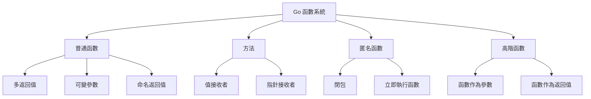
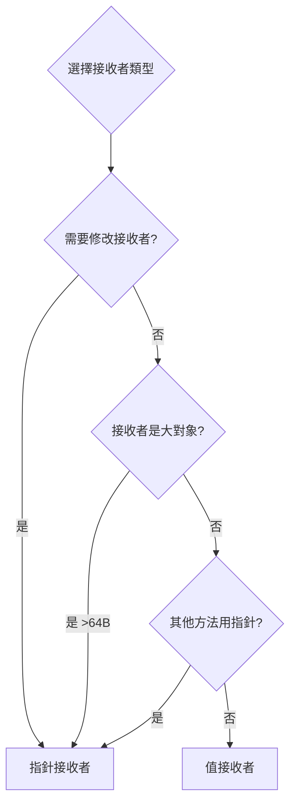
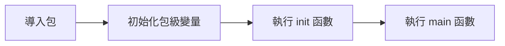

# 函數與方法

## 函數系統架構



## 函數定義與調用

### 基本語法

```go
func functionName(param1 type1, param2 type2) returnType {
    return value
}

func add(a int, b int) int {
    return a + b
}

func add(a, b int) int {  // 相同類型可簡寫
    return a + b
}
```

### 多返回值

```go
func divide(a, b float64) (float64, error) {
    if b == 0 {
        return 0, errors.New("division by zero")
    }
    return a / b, nil
}

result, err := divide(10, 2)
if err != nil {
    log.Fatal(err)
}

result, _ := divide(10, 2)  // 忽略錯誤（不推薦）
```

### 命名返回值

```go
func split(sum int) (x, y int) {
    x = sum * 4 / 9
    y = sum - x
    return  // 裸返回
}

func calculate(a, b int) (sum int, product int) {
    sum = a + b
    product = a * b
    return
}
```

### 可變參數

```go
func sum(nums ...int) int {
    total := 0
    for _, num := range nums {
        total += num
    }
    return total
}

sum(1, 2, 3)
sum(1, 2, 3, 4, 5)

numbers := []int{1, 2, 3, 4}
sum(numbers...)  // 展開 slice
```

### 實戰案例：格式化日誌

```go
func logf(level string, format string, args ...interface{}) {
    timestamp := time.Now().Format("2006-01-02 15:04:05")
    msg := fmt.Sprintf(format, args...)
    fmt.Printf("[%s] %s: %s\n", timestamp, level, msg)
}

logf("INFO", "User %s logged in from %s", "alice", "192.168.1.1")
logf("ERROR", "Failed to connect to database: %v", err)
```

## 函數類型與變量

### 函數類型

```go
type MathFunc func(int, int) int

func add(a, b int) int {
    return a + b
}

func subtract(a, b int) int {
    return a - b
}

var operation MathFunc
operation = add
result := operation(5, 3)  // 8

operation = subtract
result = operation(5, 3)  // 2
```

### 實戰案例：策略模式

```go
type PaymentMethod func(amount float64) error

func creditCardPayment(amount float64) error {
    fmt.Printf("Processing credit card payment of $%.2f\n", amount)
    return nil
}

func paypalPayment(amount float64) error {
    fmt.Printf("Processing PayPal payment of $%.2f\n", amount)
    return nil
}

type Order struct {
    Amount float64
    Payment PaymentMethod
}

func (o *Order) Checkout() error {
    return o.Payment(o.Amount)
}

func main() {
    order1 := Order{Amount: 100.50, Payment: creditCardPayment}
    order1.Checkout()
    
    order2 := Order{Amount: 75.25, Payment: paypalPayment}
    order2.Checkout()
}
```

## 匿名函數與閉包

### 匿名函數

```go
func main() {
    add := func(a, b int) int {
        return a + b
    }
    result := add(3, 5)
    
    func(msg string) {
        fmt.Println(msg)
    }("Hello")
}
```

### 閉包（Closure）

```go
func counter() func() int {
    count := 0
    return func() int {
        count++
        return count
    }
}

func main() {
    c1 := counter()
    fmt.Println(c1())  // 1
    fmt.Println(c1())  // 2
    fmt.Println(c1())  // 3
    
    c2 := counter()
    fmt.Println(c2())  // 1
}
```

### 實戰案例：中間件模式

```go
type HandlerFunc func(http.ResponseWriter, *http.Request)

func loggingMiddleware(next HandlerFunc) HandlerFunc {
    return func(w http.ResponseWriter, r *http.Request) {
        start := time.Now()
        log.Printf("Started %s %s", r.Method, r.URL.Path)
        
        next(w, r)
        
        log.Printf("Completed in %v", time.Since(start))
    }
}

func authMiddleware(next HandlerFunc) HandlerFunc {
    return func(w http.ResponseWriter, r *http.Request) {
        token := r.Header.Get("Authorization")
        if token == "" {
            http.Error(w, "Unauthorized", http.StatusUnauthorized)
            return
        }
        next(w, r)
    }
}

func helloHandler(w http.ResponseWriter, r *http.Request) {
    fmt.Fprintf(w, "Hello, World!")
}

func main() {
    handler := loggingMiddleware(authMiddleware(helloHandler))
    http.HandleFunc("/", handler)
    http.ListenAndServe(":8080", nil)
}
```

### 實戰案例：函數式選項模式

```go
type Server struct {
    host    string
    port    int
    timeout time.Duration
    maxConn int
}

type Option func(*Server)

func WithHost(host string) Option {
    return func(s *Server) {
        s.host = host
    }
}

func WithPort(port int) Option {
    return func(s *Server) {
        s.port = port
    }
}

func WithTimeout(timeout time.Duration) Option {
    return func(s *Server) {
        s.timeout = timeout
    }
}

func WithMaxConn(maxConn int) Option {
    return func(s *Server) {
        s.maxConn = maxConn
    }
}

func NewServer(options ...Option) *Server {
    server := &Server{
        host:    "localhost",
        port:    8080,
        timeout: 30 * time.Second,
        maxConn: 100,
    }
    
    for _, option := range options {
        option(server)
    }
    
    return server
}

func main() {
    server := NewServer(
        WithHost("0.0.0.0"),
        WithPort(9000),
        WithTimeout(60 * time.Second),
    )
}
```

## 高階函數

### 函數作為參數

```go
func apply(nums []int, fn func(int) int) []int {
    result := make([]int, len(nums))
    for i, n := range nums {
        result[i] = fn(n)
    }
    return result
}

func double(n int) int {
    return n * 2
}

func square(n int) int {
    return n * n
}

func main() {
    nums := []int{1, 2, 3, 4, 5}
    
    doubled := apply(nums, double)
    squared := apply(nums, square)
    
    cubed := apply(nums, func(n int) int {
        return n * n * n
    })
}
```

### 函數作為返回值

```go
func makeMultiplier(factor int) func(int) int {
    return func(n int) int {
        return n * factor
    }
}

func main() {
    double := makeMultiplier(2)
    triple := makeMultiplier(3)
    
    fmt.Println(double(5))  // 10
    fmt.Println(triple(5))  // 15
}
```

### 實戰案例：實現 Map/Filter/Reduce

```go
func Map[T, U any](slice []T, fn func(T) U) []U {
    result := make([]U, len(slice))
    for i, v := range slice {
        result[i] = fn(v)
    }
    return result
}

func Filter[T any](slice []T, predicate func(T) bool) []T {
    result := make([]T, 0)
    for _, v := range slice {
        if predicate(v) {
            result = append(result, v)
        }
    }
    return result
}

func Reduce[T, U any](slice []T, initial U, fn func(U, T) U) U {
    acc := initial
    for _, v := range slice {
        acc = fn(acc, v)
    }
    return acc
}

func main() {
    nums := []int{1, 2, 3, 4, 5}
    
    doubled := Map(nums, func(n int) int { return n * 2 })
    
    evens := Filter(nums, func(n int) bool { return n%2 == 0 })
    
    sum := Reduce(nums, 0, func(acc, n int) int { return acc + n })
}
```

## 方法（Methods）

### 值接收者 vs 指針接收者

```go
type Counter struct {
    count int
}

func (c Counter) GetValue() int {
    return c.count
}

func (c Counter) IncrementValue() {
    c.count++  // 不會修改原值
}

func (c *Counter) IncrementPointer() {
    c.count++  // 會修改原值
}

func main() {
    c := Counter{count: 0}
    
    c.IncrementValue()
    fmt.Println(c.GetValue())  // 0
    
    c.IncrementPointer()
    fmt.Println(c.GetValue())  // 1
}
```

### 方法接收者選擇原則



**使用指針接收者的情況：**
1. 需要修改接收者
2. 接收者是大型結構體
3. 保持一致性（如果有一個方法用指針，全部用指針）

**使用值接收者的情況：**
1. 不需要修改接收者
2. 接收者是小型結構體或基本類型
3. 接收者是 map, slice, channel 等引用類型

### 實戰案例：鏈式調用

```go
type QueryBuilder struct {
    table  string
    fields []string
    where  []string
    limit  int
}

func NewQueryBuilder() *QueryBuilder {
    return &QueryBuilder{}
}

func (qb *QueryBuilder) Table(table string) *QueryBuilder {
    qb.table = table
    return qb
}

func (qb *QueryBuilder) Select(fields ...string) *QueryBuilder {
    qb.fields = fields
    return qb
}

func (qb *QueryBuilder) Where(condition string) *QueryBuilder {
    qb.where = append(qb.where, condition)
    return qb
}

func (qb *QueryBuilder) Limit(limit int) *QueryBuilder {
    qb.limit = limit
    return qb
}

func (qb *QueryBuilder) Build() string {
    query := fmt.Sprintf("SELECT %s FROM %s",
        strings.Join(qb.fields, ", "),
        qb.table,
    )
    
    if len(qb.where) > 0 {
        query += " WHERE " + strings.Join(qb.where, " AND ")
    }
    
    if qb.limit > 0 {
        query += fmt.Sprintf(" LIMIT %d", qb.limit)
    }
    
    return query
}

func main() {
    query := NewQueryBuilder().
        Table("users").
        Select("id", "name", "email").
        Where("age > 18").
        Where("active = true").
        Limit(10).
        Build()
    
    fmt.Println(query)
}
```

### 為非結構體類型定義方法

```go
type MyInt int

func (m MyInt) IsEven() bool {
    return m%2 == 0
}

func (m MyInt) Double() MyInt {
    return m * 2
}

type MyString string

func (s MyString) Reverse() string {
    runes := []rune(s)
    for i, j := 0, len(runes)-1; i < j; i, j = i+1, j-1 {
        runes[i], runes[j] = runes[j], runes[i]
    }
    return string(runes)
}

func main() {
    num := MyInt(5)
    fmt.Println(num.IsEven())  // false
    fmt.Println(num.Double())  // 10
    
    str := MyString("hello")
    fmt.Println(str.Reverse())  // olleh
}
```

## Defer 延遲執行

### 基本用法

```go
func example() {
    defer fmt.Println("world")
    fmt.Println("hello")
}
```

### 多個 defer 的執行順序（LIFO）

```go
func main() {
    defer fmt.Println("1")
    defer fmt.Println("2")
    defer fmt.Println("3")
}
```

### 實戰案例：資源清理

```go
func readFile(filename string) error {
    file, err := os.Open(filename)
    if err != nil {
        return err
    }
    defer file.Close()
    
    scanner := bufio.NewScanner(file)
    for scanner.Scan() {
        fmt.Println(scanner.Text())
    }
    
    return scanner.Err()
}
```

### 實戰案例：性能計時

```go
func timeTrack(start time.Time, name string) {
    elapsed := time.Since(start)
    log.Printf("%s took %s", name, elapsed)
}

func slowFunction() {
    defer timeTrack(time.Now(), "slowFunction")
    
    time.Sleep(2 * time.Second)
}
```

### 實戰案例：事務處理

```go
func transferMoney(db *sql.DB, from, to int, amount float64) error {
    tx, err := db.Begin()
    if err != nil {
        return err
    }
    
    defer func() {
        if p := recover(); p != nil {
            tx.Rollback()
            panic(p)
        } else if err != nil {
            tx.Rollback()
        } else {
            err = tx.Commit()
        }
    }()
    
    _, err = tx.Exec("UPDATE accounts SET balance = balance - ? WHERE id = ?", amount, from)
    if err != nil {
        return err
    }
    
    _, err = tx.Exec("UPDATE accounts SET balance = balance + ? WHERE id = ?", amount, to)
    if err != nil {
        return err
    }
    
    return nil
}
```

### defer 的陷阱

#### 陷阱1：defer 參數立即求值

```go
func main() {
    i := 0
    defer fmt.Println(i)  // 輸出 0
    i++
}
```

#### 陷阱2：閉包捕獲變量

```go
func main() {
    for i := 0; i < 3; i++ {
        defer func() {
            fmt.Println(i)  // 3, 3, 3
        }()
    }
}

func main() {
    for i := 0; i < 3; i++ {
        defer func(n int) {
            fmt.Println(n)  // 2, 1, 0
        }(i)
    }
}
```

#### 陷阱3：命名返回值

```go
func f() (result int) {
    defer func() {
        result++
    }()
    return 0  // 實際返回 1
}
```

## init 函數

### 執行順序



### 基本使用

```go
package main

import "fmt"

var GlobalVar = initGlobalVar()

func initGlobalVar() int {
    fmt.Println("Initializing global var")
    return 42
}

func init() {
    fmt.Println("First init")
}

func init() {
    fmt.Println("Second init")
}

func main() {
    fmt.Println("Main function")
}
```

### 實戰案例：初始化配置

```go
package config

import (
    "log"
    "os"
)

var (
    DatabaseURL string
    APIKey      string
)

func init() {
    DatabaseURL = os.Getenv("DATABASE_URL")
    if DatabaseURL == "" {
        log.Fatal("DATABASE_URL is not set")
    }
    
    APIKey = os.Getenv("API_KEY")
    if APIKey == "" {
        log.Fatal("API_KEY is not set")
    }
}
```

## 最佳實踐

### 1. 保持函數簡短

每個函數應該只做一件事，通常不超過 50 行

```go
func processUser(user User) error {
    if err := validateUser(user); err != nil {
        return err
    }
    
    if err := saveUser(user); err != nil {
        return err
    }
    
    if err := sendWelcomeEmail(user); err != nil {
        return err
    }
    
    return nil
}
```

### 2. 使用命名返回值提高可讀性

```go
func getUserInfo(id int) (name string, age int, err error) {
    user, err := db.GetUser(id)
    if err != nil {
        return
    }
    
    name = user.Name
    age = user.Age
    return
}
```

### 3. 優先使用值接收者

除非確實需要修改接收者或避免拷貝大對象

### 4. defer 用於資源清理

始終使用 defer 來關閉文件、連接、鎖等資源

### 5. 避免 panic，優先返回 error

```go
func divide(a, b float64) (float64, error) {
    if b == 0 {
        return 0, errors.New("division by zero")
    }
    return a / b, nil
}
```

### 6. 使用函數式選項模式配置複雜對象

見前面的 Server 例子

### 7. 保持接口小而專注

```go
type Reader interface {
    Read(p []byte) (n int, err error)
}

type Writer interface {
    Write(p []byte) (n int, err error)
}

type ReadWriter interface {
    Reader
    Writer
}
```
