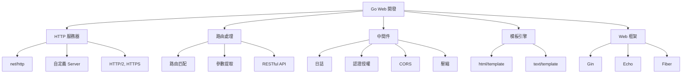

# Go Web開發基礎

## Web開發架構



## net/http 標準庫

### 基礎 HTTP 服務器

```go
package main

import (
    "fmt"
    "log"
    "net/http"
)

func helloHandler(w http.ResponseWriter, r *http.Request) {
    fmt.Fprintf(w, "Hello, World!")
}

func main() {
    http.HandleFunc("/", helloHandler)
    log.Println("Server starting on :8080")
    log.Fatal(http.ListenAndServe(":8080", nil))
}
```

### Handler 接口

```go
type Handler interface {
    ServeHTTP(ResponseWriter, *Request)
}

type MyHandler struct{}

func (h *MyHandler) ServeHTTP(w http.ResponseWriter, r *http.Request) {
    fmt.Fprintf(w, "Custom Handler")
}

func main() {
    handler := &MyHandler{}
    http.ListenAndServe(":8080", handler)
}
```

### HandlerFunc 適配器

```go
func loggingHandler(w http.ResponseWriter, r *http.Request) {
    log.Printf("%s %s", r.Method, r.URL.Path)
    fmt.Fprintf(w, "Logged request")
}

func main() {
    var handler http.HandlerFunc = loggingHandler
    http.ListenAndServe(":8080", handler)
}
```

### Request 對象

```go
func requestHandler(w http.ResponseWriter, r *http.Request) {
    fmt.Fprintf(w, "Method: %s\n", r.Method)
    fmt.Fprintf(w, "URL: %s\n", r.URL.Path)
    fmt.Fprintf(w, "Protocol: %s\n", r.Proto)
    
    fmt.Fprintf(w, "Host: %s\n", r.Host)
    fmt.Fprintf(w, "RemoteAddr: %s\n", r.RemoteAddr)
    
    fmt.Fprintf(w, "User-Agent: %s\n", r.UserAgent())
    fmt.Fprintf(w, "Content-Type: %s\n", r.Header.Get("Content-Type"))
    
    fmt.Fprintf(w, "Content-Length: %d\n", r.ContentLength)
    
    if err := r.ParseForm(); err != nil {
        http.Error(w, err.Error(), http.StatusBadRequest)
        return
    }
    fmt.Fprintf(w, "Form Values: %v\n", r.Form)
    
    name := r.FormValue("name")
    fmt.Fprintf(w, "Name: %s\n", name)
    
    cookie, err := r.Cookie("session")
    if err == nil {
        fmt.Fprintf(w, "Cookie: %s\n", cookie.Value)
    }
}
```

### Response 操作

```go
func responseHandler(w http.ResponseWriter, r *http.Request) {
    w.Header().Set("Content-Type", "application/json")
    w.Header().Set("X-Custom-Header", "value")
    
    http.SetCookie(w, &http.Cookie{
        Name:     "session",
        Value:    "abc123",
        Path:     "/",
        MaxAge:   3600,
        HttpOnly: true,
        Secure:   true,
        SameSite: http.SameSiteStrictMode,
    })
    
    w.WriteHeader(http.StatusOK)
    
    w.Write([]byte(`{"message": "success"}`))
}
```

### HTTP 方法處理

```go
func apiHandler(w http.ResponseWriter, r *http.Request) {
    switch r.Method {
    case http.MethodGet:
        handleGet(w, r)
    case http.MethodPost:
        handlePost(w, r)
    case http.MethodPut:
        handlePut(w, r)
    case http.MethodDelete:
        handleDelete(w, r)
    case http.MethodPatch:
        handlePatch(w, r)
    default:
        http.Error(w, "Method not allowed", http.StatusMethodNotAllowed)
    }
}

func handleGet(w http.ResponseWriter, r *http.Request) {
    w.Header().Set("Content-Type", "application/json")
    json.NewEncoder(w).Encode(map[string]string{"message": "GET"})
}

func handlePost(w http.ResponseWriter, r *http.Request) {
    var data map[string]interface{}
    if err := json.NewDecoder(r.Body).Decode(&data); err != nil {
        http.Error(w, err.Error(), http.StatusBadRequest)
        return
    }
    defer r.Body.Close()
    
    w.Header().Set("Content-Type", "application/json")
    w.WriteHeader(http.StatusCreated)
    json.NewEncoder(w).Encode(data)
}
```

### 路由模式

```go
func main() {
    mux := http.NewServeMux()
    
    mux.HandleFunc("/", homeHandler)
    mux.HandleFunc("/users", usersHandler)
    mux.HandleFunc("/users/", userHandler)
    mux.HandleFunc("/api/v1/products", productsHandler)
    
    server := &http.Server{
        Addr:         ":8080",
        Handler:      mux,
        ReadTimeout:  10 * time.Second,
        WriteTimeout: 10 * time.Second,
        IdleTimeout:  60 * time.Second,
    }
    
    log.Fatal(server.ListenAndServe())
}

func homeHandler(w http.ResponseWriter, r *http.Request) {
    if r.URL.Path != "/" {
        http.NotFound(w, r)
        return
    }
    fmt.Fprintf(w, "Home Page")
}

func userHandler(w http.ResponseWriter, r *http.Request) {
    id := strings.TrimPrefix(r.URL.Path, "/users/")
    fmt.Fprintf(w, "User ID: %s", id)
}
```

### 靜態文件服務

```go
func main() {
    fs := http.FileServer(http.Dir("./static"))
    http.Handle("/static/", http.StripPrefix("/static/", fs))
    
    http.Handle("/files/", http.StripPrefix("/files/", 
        http.FileServer(http.Dir("/path/to/files"))))
    
    http.HandleFunc("/download", func(w http.ResponseWriter, r *http.Request) {
        file := "path/to/file.pdf"
        w.Header().Set("Content-Disposition", "attachment; filename=file.pdf")
        w.Header().Set("Content-Type", "application/pdf")
        http.ServeFile(w, r, file)
    })
    
    log.Fatal(http.ListenAndServe(":8080", nil))
}
```

### 文件上傳

```go
func uploadHandler(w http.ResponseWriter, r *http.Request) {
    if r.Method != http.MethodPost {
        http.Error(w, "Method not allowed", http.StatusMethodNotAllowed)
        return
    }
    
    r.ParseMultipartForm(10 << 20)
    
    file, handler, err := r.FormFile("file")
    if err != nil {
        http.Error(w, err.Error(), http.StatusBadRequest)
        return
    }
    defer file.Close()
    
    dst, err := os.Create(filepath.Join("./uploads", handler.Filename))
    if err != nil {
        http.Error(w, err.Error(), http.StatusInternalServerError)
        return
    }
    defer dst.Close()
    
    if _, err := io.Copy(dst, file); err != nil {
        http.Error(w, err.Error(), http.StatusInternalServerError)
        return
    }
    
    fmt.Fprintf(w, "File uploaded successfully: %s", handler.Filename)
}
```

### HTTPS 服務器

```go
func main() {
    http.HandleFunc("/", handler)
    
    log.Fatal(http.ListenAndServeTLS(":443", "cert.pem", "key.pem", nil))
}

func generateSelfSignedCert() {
    cert, err := tls.LoadX509KeyPair("cert.pem", "key.pem")
    if err != nil {
        log.Fatal(err)
    }
    
    config := &tls.Config{Certificates: []tls.Certificate{cert}}
    server := &http.Server{
        Addr:      ":443",
        TLSConfig: config,
    }
    
    log.Fatal(server.ListenAndServeTLS("", ""))
}
```

## 中間件模式

### 基本中間件

```go
type Middleware func(http.HandlerFunc) http.HandlerFunc

func LoggingMiddleware(next http.HandlerFunc) http.HandlerFunc {
    return func(w http.ResponseWriter, r *http.Request) {
        start := time.Now()
        log.Printf("Started %s %s", r.Method, r.URL.Path)
        
        next(w, r)
        
        log.Printf("Completed in %v", time.Since(start))
    }
}

func AuthMiddleware(next http.HandlerFunc) http.HandlerFunc {
    return func(w http.ResponseWriter, r *http.Request) {
        token := r.Header.Get("Authorization")
        if token == "" {
            http.Error(w, "Unauthorized", http.StatusUnauthorized)
            return
        }
        
        next(w, r)
    }
}

func RecoveryMiddleware(next http.HandlerFunc) http.HandlerFunc {
    return func(w http.ResponseWriter, r *http.Request) {
        defer func() {
            if err := recover(); err != nil {
                log.Printf("Panic: %v\n%s", err, debug.Stack())
                http.Error(w, "Internal Server Error", http.StatusInternalServerError)
            }
        }()
        
        next(w, r)
    }
}
```

### 中間件鏈

```go
func Chain(f http.HandlerFunc, middlewares ...Middleware) http.HandlerFunc {
    for i := len(middlewares) - 1; i >= 0; i-- {
        f = middlewares[i](f)
    }
    return f
}

func main() {
    handler := Chain(
        helloHandler,
        LoggingMiddleware,
        AuthMiddleware,
        RecoveryMiddleware,
    )
    
    http.HandleFunc("/", handler)
    log.Fatal(http.ListenAndServe(":8080", nil))
}
```

### 實戰案例：完整中間件系統

```go
func CORSMiddleware(next http.HandlerFunc) http.HandlerFunc {
    return func(w http.ResponseWriter, r *http.Request) {
        w.Header().Set("Access-Control-Allow-Origin", "*")
        w.Header().Set("Access-Control-Allow-Methods", "GET, POST, PUT, DELETE, OPTIONS")
        w.Header().Set("Access-Control-Allow-Headers", "Content-Type, Authorization")
        
        if r.Method == http.MethodOptions {
            w.WriteHeader(http.StatusOK)
            return
        }
        
        next(w, r)
    }
}

func GzipMiddleware(next http.HandlerFunc) http.HandlerFunc {
    return func(w http.ResponseWriter, r *http.Request) {
        if !strings.Contains(r.Header.Get("Accept-Encoding"), "gzip") {
            next(w, r)
            return
        }
        
        w.Header().Set("Content-Encoding", "gzip")
        gz := gzip.NewWriter(w)
        defer gz.Close()
        
        gzw := &gzipResponseWriter{Writer: gz, ResponseWriter: w}
        next(gzw, r)
    }
}

type gzipResponseWriter struct {
    io.Writer
    http.ResponseWriter
}

func (w *gzipResponseWriter) Write(b []byte) (int, error) {
    return w.Writer.Write(b)
}

func RateLimitMiddleware(requestsPerSecond int) Middleware {
    limiter := rate.NewLimiter(rate.Limit(requestsPerSecond), requestsPerSecond)
    
    return func(next http.HandlerFunc) http.HandlerFunc {
        return func(w http.ResponseWriter, r *http.Request) {
            if !limiter.Allow() {
                http.Error(w, "Rate limit exceeded", http.StatusTooManyRequests)
                return
            }
            next(w, r)
        }
    }
}
```

## RESTful API 設計

### 資源路由

```go
type User struct {
    ID    int    `json:"id"`
    Name  string `json:"name"`
    Email string `json:"email"`
}

var users = []User{
    {1, "Alice", "alice@example.com"},
    {2, "Bob", "bob@example.com"},
}

func usersHandler(w http.ResponseWriter, r *http.Request) {
    switch r.Method {
    case http.MethodGet:
        listUsers(w, r)
    case http.MethodPost:
        createUser(w, r)
    default:
        http.Error(w, "Method not allowed", http.StatusMethodNotAllowed)
    }
}

func userHandler(w http.ResponseWriter, r *http.Request) {
    id, err := strconv.Atoi(strings.TrimPrefix(r.URL.Path, "/users/"))
    if err != nil {
        http.Error(w, "Invalid user ID", http.StatusBadRequest)
        return
    }
    
    switch r.Method {
    case http.MethodGet:
        getUser(w, r, id)
    case http.MethodPut:
        updateUser(w, r, id)
    case http.MethodDelete:
        deleteUser(w, r, id)
    default:
        http.Error(w, "Method not allowed", http.StatusMethodNotAllowed)
    }
}

func listUsers(w http.ResponseWriter, r *http.Request) {
    w.Header().Set("Content-Type", "application/json")
    json.NewEncoder(w).Encode(users)
}

func getUser(w http.ResponseWriter, r *http.Request, id int) {
    for _, user := range users {
        if user.ID == id {
            w.Header().Set("Content-Type", "application/json")
            json.NewEncoder(w).Encode(user)
            return
        }
    }
    http.Error(w, "User not found", http.StatusNotFound)
}

func createUser(w http.ResponseWriter, r *http.Request) {
    var user User
    if err := json.NewDecoder(r.Body).Decode(&user); err != nil {
        http.Error(w, err.Error(), http.StatusBadRequest)
        return
    }
    
    user.ID = len(users) + 1
    users = append(users, user)
    
    w.Header().Set("Content-Type", "application/json")
    w.WriteHeader(http.StatusCreated)
    json.NewEncoder(w).Encode(user)
}

func updateUser(w http.ResponseWriter, r *http.Request, id int) {
    var updatedUser User
    if err := json.NewDecoder(r.Body).Decode(&updatedUser); err != nil {
        http.Error(w, err.Error(), http.StatusBadRequest)
        return
    }
    
    for i, user := range users {
        if user.ID == id {
            users[i].Name = updatedUser.Name
            users[i].Email = updatedUser.Email
            
            w.Header().Set("Content-Type", "application/json")
            json.NewEncoder(w).Encode(users[i])
            return
        }
    }
    
    http.Error(w, "User not found", http.StatusNotFound)
}

func deleteUser(w http.ResponseWriter, r *http.Request, id int) {
    for i, user := range users {
        if user.ID == id {
            users = append(users[:i], users[i+1:]...)
            w.WriteHeader(http.StatusNoContent)
            return
        }
    }
    
    http.Error(w, "User not found", http.StatusNotFound)
}
```

### 統一響應格式

```go
type Response struct {
    Code    int         `json:"code"`
    Message string      `json:"message"`
    Data    interface{} `json:"data,omitempty"`
}

func sendJSON(w http.ResponseWriter, statusCode int, data interface{}) {
    w.Header().Set("Content-Type", "application/json")
    w.WriteHeader(statusCode)
    json.NewEncoder(w).Encode(data)
}

func sendSuccess(w http.ResponseWriter, data interface{}) {
    sendJSON(w, http.StatusOK, Response{
        Code:    http.StatusOK,
        Message: "Success",
        Data:    data,
    })
}

func sendError(w http.ResponseWriter, statusCode int, message string) {
    sendJSON(w, statusCode, Response{
        Code:    statusCode,
        Message: message,
    })
}

func apiHandler(w http.ResponseWriter, r *http.Request) {
    data := map[string]string{"name": "Alice"}
    sendSuccess(w, data)
}
```

## Gin 框架

### 安裝與基本使用

```bash
go get -u github.com/gin-gonic/gin
```

```go
package main

import "github.com/gin-gonic/gin"

func main() {
    r := gin.Default()
    
    r.GET("/ping", func(c *gin.Context) {
        c.JSON(200, gin.H{
            "message": "pong",
        })
    })
    
    r.Run(":8080")
}
```

### 路由組

```go
func main() {
    r := gin.Default()
    
    v1 := r.Group("/api/v1")
    {
        v1.GET("/users", getUsers)
        v1.GET("/users/:id", getUser)
        v1.POST("/users", createUser)
        v1.PUT("/users/:id", updateUser)
        v1.DELETE("/users/:id", deleteUser)
    }
    
    v2 := r.Group("/api/v2")
    {
        v2.GET("/users", getUsersV2)
    }
    
    r.Run(":8080")
}
```

### 參數獲取

```go
func paramHandler(c *gin.Context) {
    id := c.Param("id")
    
    name := c.Query("name")
    
    page := c.DefaultQuery("page", "1")
    
    var form LoginForm
    if err := c.ShouldBind(&form); err != nil {
        c.JSON(400, gin.H{"error": err.Error()})
        return
    }
    
    var json LoginJSON
    if err := c.ShouldBindJSON(&json); err != nil {
        c.JSON(400, gin.H{"error": err.Error()})
        return
    }
    
    file, err := c.FormFile("file")
    if err != nil {
        c.JSON(400, gin.H{"error": err.Error()})
        return
    }
    
    c.SaveUploadedFile(file, dst)
}

type LoginForm struct {
    Username string `form:"username" binding:"required"`
    Password string `form:"password" binding:"required,min=6"`
}

type LoginJSON struct {
    Username string `json:"username" binding:"required"`
    Password string `json:"password" binding:"required,min=6"`
}
```

### Gin 中間件

```go
func Logger() gin.HandlerFunc {
    return func(c *gin.Context) {
        t := time.Now()
        
        c.Set("example", "12345")
        
        c.Next()
        
        latency := time.Since(t)
        status := c.Writer.Status()
        log.Printf("%s %s %d %v", c.Request.Method, c.Request.URL.Path, status, latency)
    }
}

func AuthRequired() gin.HandlerFunc {
    return func(c *gin.Context) {
        token := c.GetHeader("Authorization")
        if token == "" {
            c.AbortWithStatusJSON(401, gin.H{"error": "unauthorized"})
            return
        }
        
        c.Set("user_id", 123)
        c.Next()
    }
}

func main() {
    r := gin.New()
    
    r.Use(Logger())
    r.Use(gin.Recovery())
    
    api := r.Group("/api")
    api.Use(AuthRequired())
    {
        api.GET("/users", getUsers)
    }
    
    r.Run(":8080")
}
```

### 數據綁定與驗證

```go
type User struct {
    Name     string `json:"name" binding:"required"`
    Email    string `json:"email" binding:"required,email"`
    Age      int    `json:"age" binding:"required,gte=0,lte=130"`
    Password string `json:"password" binding:"required,min=8"`
}

func createUserHandler(c *gin.Context) {
    var user User
    
    if err := c.ShouldBindJSON(&user); err != nil {
        c.JSON(400, gin.H{"error": err.Error()})
        return
    }
    
    c.JSON(201, user)
}

type QueryParams struct {
    Page     int    `form:"page" binding:"required,min=1"`
    PageSize int    `form:"page_size" binding:"required,min=1,max=100"`
    Sort     string `form:"sort" binding:"omitempty,oneof=asc desc"`
}

func listHandler(c *gin.Context) {
    var params QueryParams
    
    if err := c.ShouldBindQuery(&params); err != nil {
        c.JSON(400, gin.H{"error": err.Error()})
        return
    }
    
    c.JSON(200, params)
}
```

### 文件上傳

```go
func uploadHandler(c *gin.Context) {
    file, err := c.FormFile("file")
    if err != nil {
        c.JSON(400, gin.H{"error": err.Error()})
        return
    }
    
    dst := filepath.Join("./uploads", file.Filename)
    if err := c.SaveUploadedFile(file, dst); err != nil {
        c.JSON(500, gin.H{"error": err.Error()})
        return
    }
    
    c.JSON(200, gin.H{"filename": file.Filename})
}

func multiUploadHandler(c *gin.Context) {
    form, err := c.MultipartForm()
    if err != nil {
        c.JSON(400, gin.H{"error": err.Error()})
        return
    }
    
    files := form.File["files"]
    for _, file := range files {
        dst := filepath.Join("./uploads", file.Filename)
        c.SaveUploadedFile(file, dst)
    }
    
    c.JSON(200, gin.H{"count": len(files)})
}
```

### 自定義驗證器

```go
import "github.com/go-playground/validator/v10"

var customPassword validator.Func = func(fl validator.FieldLevel) bool {
    password := fl.Field().String()
    
    hasUpper := regexp.MustCompile(`[A-Z]`).MatchString(password)
    hasLower := regexp.MustCompile(`[a-z]`).MatchString(password)
    hasNumber := regexp.MustCompile(`[0-9]`).MatchString(password)
    
    return hasUpper && hasLower && hasNumber
}

func main() {
    r := gin.Default()
    
    if v, ok := binding.Validator.Engine().(*validator.Validate); ok {
        v.RegisterValidation("custom_password", customPassword)
    }
    
    r.Run()
}

type RegisterForm struct {
    Password string `json:"password" binding:"required,custom_password"`
}
```

## 實戰案例：完整 RESTful API

```go
package main

import (
    "net/http"
    "strconv"
    "sync"
    
    "github.com/gin-gonic/gin"
)

type User struct {
    ID    int    `json:"id"`
    Name  string `json:"name" binding:"required"`
    Email string `json:"email" binding:"required,email"`
}

type UserService struct {
    users  map[int]*User
    nextID int
    mu     sync.RWMutex
}

func NewUserService() *UserService {
    return &UserService{
        users:  make(map[int]*User),
        nextID: 1,
    }
}

func (s *UserService) List() []*User {
    s.mu.RLock()
    defer s.mu.RUnlock()
    
    users := make([]*User, 0, len(s.users))
    for _, user := range s.users {
        users = append(users, user)
    }
    return users
}

func (s *UserService) Get(id int) (*User, error) {
    s.mu.RLock()
    defer s.mu.RUnlock()
    
    user, ok := s.users[id]
    if !ok {
        return nil, errors.New("user not found")
    }
    return user, nil
}

func (s *UserService) Create(user *User) *User {
    s.mu.Lock()
    defer s.mu.Unlock()
    
    user.ID = s.nextID
    s.nextID++
    s.users[user.ID] = user
    
    return user
}

func (s *UserService) Update(id int, user *User) (*User, error) {
    s.mu.Lock()
    defer s.mu.Unlock()
    
    if _, ok := s.users[id]; !ok {
        return nil, errors.New("user not found")
    }
    
    user.ID = id
    s.users[id] = user
    return user, nil
}

func (s *UserService) Delete(id int) error {
    s.mu.Lock()
    defer s.mu.Unlock()
    
    if _, ok := s.users[id]; !ok {
        return errors.New("user not found")
    }
    
    delete(s.users, id)
    return nil
}

type UserHandler struct {
    service *UserService
}

func NewUserHandler(service *UserService) *UserHandler {
    return &UserHandler{service: service}
}

func (h *UserHandler) List(c *gin.Context) {
    users := h.service.List()
    c.JSON(http.StatusOK, gin.H{
        "code": 200,
        "data": users,
    })
}

func (h *UserHandler) Get(c *gin.Context) {
    id, err := strconv.Atoi(c.Param("id"))
    if err != nil {
        c.JSON(http.StatusBadRequest, gin.H{
            "code":    400,
            "message": "invalid user id",
        })
        return
    }
    
    user, err := h.service.Get(id)
    if err != nil {
        c.JSON(http.StatusNotFound, gin.H{
            "code":    404,
            "message": err.Error(),
        })
        return
    }
    
    c.JSON(http.StatusOK, gin.H{
        "code": 200,
        "data": user,
    })
}

func (h *UserHandler) Create(c *gin.Context) {
    var user User
    if err := c.ShouldBindJSON(&user); err != nil {
        c.JSON(http.StatusBadRequest, gin.H{
            "code":    400,
            "message": err.Error(),
        })
        return
    }
    
    created := h.service.Create(&user)
    
    c.JSON(http.StatusCreated, gin.H{
        "code": 201,
        "data": created,
    })
}

func (h *UserHandler) Update(c *gin.Context) {
    id, err := strconv.Atoi(c.Param("id"))
    if err != nil {
        c.JSON(http.StatusBadRequest, gin.H{
            "code":    400,
            "message": "invalid user id",
        })
        return
    }
    
    var user User
    if err := c.ShouldBindJSON(&user); err != nil {
        c.JSON(http.StatusBadRequest, gin.H{
            "code":    400,
            "message": err.Error(),
        })
        return
    }
    
    updated, err := h.service.Update(id, &user)
    if err != nil {
        c.JSON(http.StatusNotFound, gin.H{
            "code":    404,
            "message": err.Error(),
        })
        return
    }
    
    c.JSON(http.StatusOK, gin.H{
        "code": 200,
        "data": updated,
    })
}

func (h *UserHandler) Delete(c *gin.Context) {
    id, err := strconv.Atoi(c.Param("id"))
    if err != nil {
        c.JSON(http.StatusBadRequest, gin.H{
            "code":    400,
            "message": "invalid user id",
        })
        return
    }
    
    if err := h.service.Delete(id); err != nil {
        c.JSON(http.StatusNotFound, gin.H{
            "code":    404,
            "message": err.Error(),
        })
        return
    }
    
    c.JSON(http.StatusNoContent, nil)
}

func main() {
    r := gin.Default()
    
    service := NewUserService()
    handler := NewUserHandler(service)
    
    api := r.Group("/api/v1")
    {
        users := api.Group("/users")
        {
            users.GET("", handler.List)
            users.GET("/:id", handler.Get)
            users.POST("", handler.Create)
            users.PUT("/:id", handler.Update)
            users.DELETE("/:id", handler.Delete)
        }
    }
    
    r.Run(":8080")
}
```

## 最佳實踐

### 1. 使用 Context 管理請求

```go
func handler(c *gin.Context) {
    ctx, cancel := context.WithTimeout(c.Request.Context(), 5*time.Second)
    defer cancel()
    
    result := doWork(ctx)
    c.JSON(200, result)
}
```

### 2. 統一錯誤處理

```go
type APIError struct {
    Code    int    `json:"code"`
    Message string `json:"message"`
}

func ErrorHandler() gin.HandlerFunc {
    return func(c *gin.Context) {
        c.Next()
        
        if len(c.Errors) > 0 {
            err := c.Errors.Last()
            c.JSON(500, APIError{
                Code:    500,
                Message: err.Error(),
            })
        }
    }
}
```

### 3. 請求ID追蹤

```go
func RequestID() gin.HandlerFunc {
    return func(c *gin.Context) {
        requestID := uuid.New().String()
        c.Set("request_id", requestID)
        c.Header("X-Request-ID", requestID)
        c.Next()
    }
}
```

### 4. 結構化日誌

```go
import "go.uber.org/zap"

func StructuredLogger(logger *zap.Logger) gin.HandlerFunc {
    return func(c *gin.Context) {
        start := time.Now()
        path := c.Request.URL.Path
        
        c.Next()
        
        logger.Info("request",
            zap.String("method", c.Request.Method),
            zap.String("path", path),
            zap.Int("status", c.Writer.Status()),
            zap.Duration("latency", time.Since(start)),
        )
    }
}
```

### 5. 優雅關閉

```go
func main() {
    r := gin.Default()
    
    server := &http.Server{
        Addr:    ":8080",
        Handler: r,
    }
    
    go func() {
        if err := server.ListenAndServe(); err != nil && err != http.ErrServerClosed {
            log.Fatalf("listen: %s\n", err)
        }
    }()
    
    quit := make(chan os.Signal, 1)
    signal.Notify(quit, syscall.SIGINT, syscall.SIGTERM)
    <-quit
    
    log.Println("Shutting down server...")
    
    ctx, cancel := context.WithTimeout(context.Background(), 5*time.Second)
    defer cancel()
    
    if err := server.Shutdown(ctx); err != nil {
        log.Fatal("Server forced to shutdown:", err)
    }
    
    log.Println("Server exiting")
}
```

### 6. API 版本控制

使用路徑版本：`/api/v1/users`, `/api/v2/users`

### 7. 輸入驗證

始終驗證用戶輸入

### 8. 速率限制

使用中間件限制請求頻率

### 9. CORS 配置

```go
import "github.com/gin-contrib/cors"

func main() {
    r := gin.Default()
    
    r.Use(cors.New(cors.Config{
        AllowOrigins:     []string{"https://example.com"},
        AllowMethods:     []string{"GET", "POST"},
        AllowHeaders:     []string{"Origin", "Content-Type"},
        ExposeHeaders:    []string{"Content-Length"},
        AllowCredentials: true,
        MaxAge:           12 * time.Hour,
    }))
    
    r.Run()
}
```

### 10. 安全頭部

```go
func SecurityHeaders() gin.HandlerFunc {
    return func(c *gin.Context) {
        c.Header("X-Frame-Options", "DENY")
        c.Header("X-Content-Type-Options", "nosniff")
        c.Header("X-XSS-Protection", "1; mode=block")
        c.Header("Strict-Transport-Security", "max-age=31536000")
        c.Next()
    }
}
```
