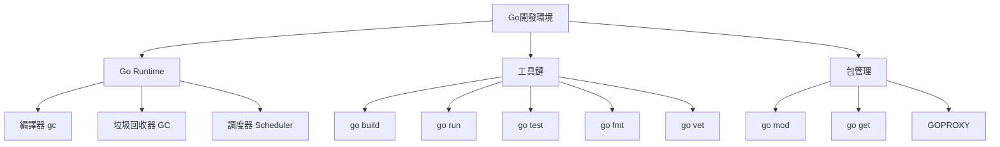
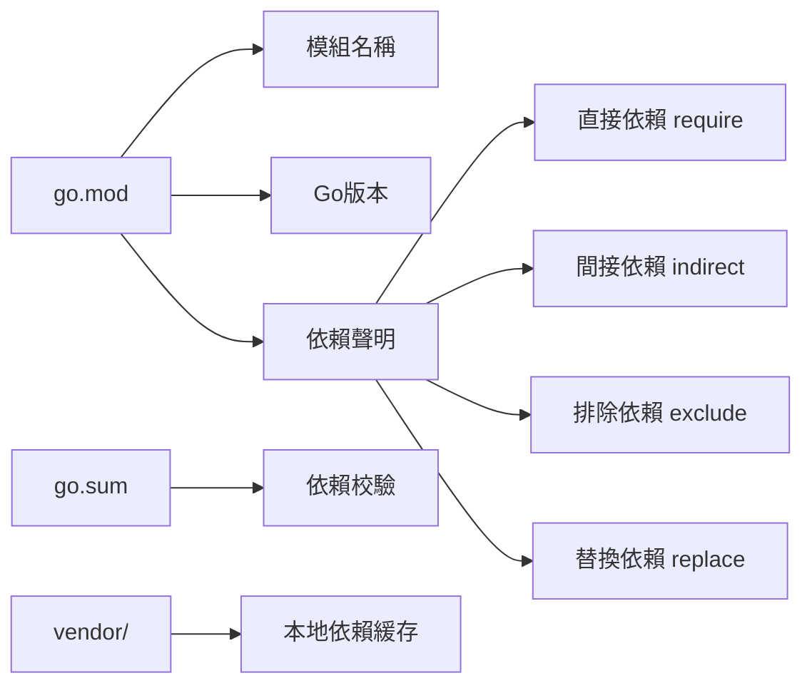

# Go環境與工具鏈

## Go開發環境架構



## 安裝與配置

### 安裝Go

```bash
wget https://go.dev/dl/go1.23.0.linux-amd64.tar.gz
sudo tar -C /usr/local -xzf go1.23.0.linux-amd64.tar.gz
```

### 環境變量配置

```bash
export PATH=$PATH:/usr/local/go/bin
export GOPATH=$HOME/go
export GOBIN=$GOPATH/bin
export PATH=$PATH:$GOBIN

export GOPROXY=https://goproxy.cn,direct
export GOPRIVATE=github.com/yourcompany
```

### 驗證安裝

```bash
go version
go env
```

## Go Modules 模組系統

### 模組系統架構



### 初始化模組

```bash
go mod init github.com/username/projectname
```

生成 `go.mod`:

```go
module github.com/username/projectname

go 1.23

require (
    github.com/gin-gonic/gin v1.9.1
    github.com/go-redis/redis/v8 v8.11.5
)
```

### 常用命令

```bash
go mod init          # 初始化模組
go mod tidy          # 整理依賴，移除未使用的依賴
go mod download      # 下載依賴到本地緩存
go mod vendor        # 複製依賴到 vendor 目錄
go mod verify        # 驗證依賴完整性
go mod graph         # 打印模組依賴圖
go get -u ./...      # 更新所有依賴到最新版本
go get package@v1.2.3  # 獲取特定版本
```

### 實戰案例：管理依賴版本

```bash
go get github.com/gin-gonic/gin@v1.9.1
go get -u github.com/gin-gonic/gin
go get github.com/gin-gonic/gin@latest
go get github.com/gin-gonic/gin@master
```

### 本地依賴替換

在 `go.mod` 中使用 replace：

```go
module myproject

go 1.23

require github.com/external/package v1.2.3

replace github.com/external/package => ../local/package
replace github.com/external/package => github.com/yourfork/package v1.2.4
```

## 工具鏈詳解

### go build - 編譯

```bash
go build                    # 編譯當前目錄
go build -o myapp           # 指定輸出文件名
go build -race              # 啟用競態檢測
go build -ldflags="-s -w"   # 減小二進制大小
go build -tags=prod         # 條件編譯

GOOS=linux GOARCH=amd64 go build    # 交叉編譯
GOOS=windows GOARCH=amd64 go build
GOOS=darwin GOARCH=arm64 go build
```

### go run - 快速運行

```bash
go run main.go
go run .
go run -race main.go
```

### go fmt - 格式化

```bash
go fmt ./...
gofmt -w -s main.go
```

### go vet - 靜態檢查

```bash
go vet ./...
go vet main.go
```

### go test - 測試

```bash
go test ./...
go test -v
go test -cover
go test -bench=.
go test -race
```

## 實戰案例：項目初始化流程

### 創建新項目

```bash
mkdir myapi && cd myapi
go mod init github.com/mycompany/myapi

mkdir -p cmd/server
mkdir -p internal/{handler,service,repository}
mkdir -p pkg/config
mkdir -p api
touch cmd/server/main.go
```

### 項目結構

```
myapi/
├── go.mod
├── go.sum
├── cmd/
│   └── server/
│       └── main.go
├── internal/
│   ├── handler/
│   ├── service/
│   └── repository/
├── pkg/
│   └── config/
└── api/
```

### 添加依賴

```bash
go get github.com/gin-gonic/gin
go get github.com/spf13/viper
go get gorm.io/gorm
go get gorm.io/driver/postgres
```

### Makefile 示例

```makefile
.PHONY: build run test clean

build:
	go build -o bin/server cmd/server/main.go

run:
	go run cmd/server/main.go

test:
	go test -v -race -cover ./...

lint:
	go vet ./...
	go fmt ./...

clean:
	rm -rf bin/
```

## Go 環境變量參考

```bash
GOROOT       # Go安裝目錄
GOPATH       # 工作目錄
GOBIN        # 可執行文件目錄
GOOS         # 目標操作系統
GOARCH       # 目標架構
GOPROXY      # 模組代理
GOPRIVATE    # 私有模組
GONOPROXY    # 不使用代理的模組
GOSUMDB      # 校驗數據庫
GO111MODULE  # 模組開關 (on/off/auto)
CGO_ENABLED  # CGO開關 (0/1)
```

## 開發工具推薦

### IDE/編輯器

- **VSCode** + Go 擴展
- **GoLand** (JetBrains)
- **Vim/NeoVim** + vim-go

### 代碼質量工具

```bash
go install golang.org/x/tools/cmd/goimports@latest
go install github.com/golangci/golangci-lint/cmd/golangci-lint@latest
go install golang.org/x/tools/gopls@latest
go install github.com/go-delve/delve/cmd/dlv@latest
```

### golangci-lint 配置

```yaml
# .golangci.yml
linters:
  enable:
    - gofmt
    - govet
    - errcheck
    - staticcheck
    - unused
    - gosimple
    - ineffassign
```

運行：

```bash
golangci-lint run
```

## 調試工具 Delve

### 安裝

```bash
go install github.com/go-delve/delve/cmd/dlv@latest
```

### 使用

```bash
dlv debug cmd/server/main.go
dlv test
dlv attach <pid>
```

### 調試命令

```
break main.main    # 設置斷點
continue          # 繼續執行
next              # 下一行
step              # 進入函數
print var         # 打印變量
quit              # 退出
```

## 性能分析工具

### pprof

```go
import _ "net/http/pprof"

func main() {
    go func() {
        http.ListenAndServe("localhost:6060", nil)
    }()
    // your code
}
```

訪問：

```bash
go tool pprof http://localhost:6060/debug/pprof/profile
go tool pprof http://localhost:6060/debug/pprof/heap
```

## 最佳實踐

### 1. 使用 Go Modules

始終使用 `go mod` 而非 GOPATH 模式

### 2. 配置 GOPROXY

```bash
export GOPROXY=https://goproxy.cn,https://goproxy.io,direct
```

### 3. 定期更新依賴

```bash
go get -u ./...
go mod tidy
```

### 4. 使用版本控制

gitignore 配置：

```
bin/
vendor/
*.exe
*.exe~
*.dll
*.so
*.dylib
*.test
*.out
```

### 5. CI/CD 集成

GitHub Actions 示例：

```yaml
name: Go CI

on: [push, pull_request]

jobs:
  build:
    runs-on: ubuntu-latest
    steps:
    - uses: actions/checkout@v3
    - uses: actions/setup-go@v4
      with:
        go-version: '1.23'
    - run: go mod download
    - run: go build -v ./...
    - run: go test -v -race -cover ./...
```

## 常見問題

### 1. go get 超時

```bash
export GOPROXY=https://goproxy.cn,direct
```

### 2. 模組緩存問題

```bash
go clean -modcache
```

### 3. vendor 與 go.mod 衝突

```bash
go mod vendor
go build -mod=vendor
```

### 4. 私有倉庫配置

```bash
export GOPRIVATE=github.com/yourcompany/*
git config --global url."git@github.com:yourcompany".insteadOf "https://github.com/yourcompany"
```
