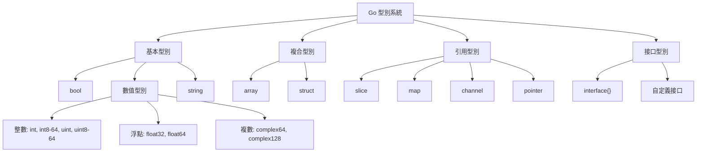
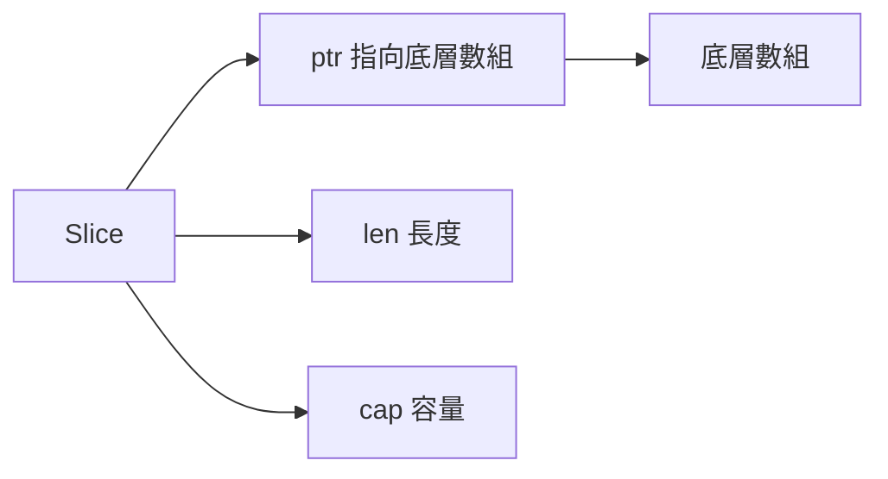

# 基礎語法與型別系統

## Go型別系統架構



## 變量聲明

### 聲明方式

```go
var name string                    // 零值初始化
var age int = 25                   // 顯式初始化
var isActive bool                  // 零值: false
var score = 95.5                   // 型別推導
count := 10                        // 短聲明 (只能在函數內)
var x, y, z int                    // 批量聲明
var (                              // 批量聲明塊
    name string
    age  int
)
```

### 零值表

| 型別      | 零值    |
| --------- | ------- |
| bool      | false   |
| int/float | 0       |
| string    | ""      |
| pointer   | nil     |
| slice     | nil     |
| map       | nil     |
| channel   | nil     |
| interface | nil     |
| function  | nil     |

### 實戰案例：配置結構體

```go
type Config struct {
    Host     string
    Port     int
    Timeout  time.Duration
    MaxConns int
}

func NewDefaultConfig() Config {
    return Config{
        Host:     "localhost",
        Port:     8080,
        Timeout:  30 * time.Second,
        MaxConns: 100,
    }
}
```

## 基本型別詳解

### 整數型別

```go
var i8 int8      // -128 to 127
var i16 int16    // -32768 to 32767
var i32 int32    // -2^31 to 2^31-1
var i64 int64    // -2^63 to 2^63-1

var u8 uint8     // 0 to 255
var u16 uint16   // 0 to 65535
var u32 uint32   // 0 to 2^32-1
var u64 uint64   // 0 to 2^64-1

var b byte = 255        // byte 是 uint8 的別名
var r rune = '中'       // rune 是 int32 的別名，用於 Unicode
```

### 浮點數與複數

```go
var f32 float32 = 3.14
var f64 float64 = 3.141592653589793

var c64 complex64 = 1 + 2i
var c128 complex128 = complex(1, 2)  // 1+2i

real(c128)  // 實部: 1
imag(c128)  // 虛部: 2
```

### 字符串

```go
s := "Hello, 世界"
len(s)           // 字節長度: 13
len([]rune(s))   // 字符長度: 9

s[0]             // 字節訪問: 72 ('H')
[]rune(s)[7]     // 字符訪問: 19990 ('世')

raw := `multi
line
string`          // 原始字符串字面量
```

#### 字符串操作實戰

```go
import "strings"

s := "hello,world,go"
strings.Contains(s, "world")       // true
strings.HasPrefix(s, "hello")      // true
strings.HasSuffix(s, "go")         // true
strings.Split(s, ",")              // ["hello", "world", "go"]
strings.Join([]string{"a","b"}, "-")  // "a-b"
strings.Replace(s, "world", "GO", 1)  // "hello,GO,go"
strings.ToUpper(s)                 // "HELLO,WORLD,GO"
strings.Trim("  text  ", " ")      // "text"
```

## 型別轉換

### 基本型別轉換

```go
var i int = 42
var f float64 = float64(i)
var u uint = uint(f)

var x int = 100
var y int64 = int64(x)
```

### 字符串轉換

```go
import "strconv"

i, err := strconv.Atoi("123")          // string -> int
s := strconv.Itoa(123)                 // int -> string

f, err := strconv.ParseFloat("3.14", 64)  // string -> float64
b, err := strconv.ParseBool("true")       // string -> bool

s = strconv.FormatFloat(3.14, 'f', 2, 64) // "3.14"
s = strconv.FormatBool(true)              // "true"
```

### 實戰案例：安全的型別轉換

```go
func SafeStringToInt(s string) (int, error) {
    i, err := strconv.Atoi(s)
    if err != nil {
        return 0, fmt.Errorf("invalid integer: %s", s)
    }
    return i, nil
}

func SafeStringToInt64(s string, defaultValue int64) int64 {
    i, err := strconv.ParseInt(s, 10, 64)
    if err != nil {
        return defaultValue
    }
    return i
}
```

## 常量與枚舉

### 常量定義

```go
const Pi = 3.14159
const (
    StatusOK    = 200
    StatusError = 500
)

const (
    a = iota  // 0
    b         // 1
    c         // 2
    d = 100   // 100
    e         // 100
    f = iota  // 5
)
```

### 實戰案例：HTTP狀態碼

```go
type HTTPStatus int

const (
    StatusOK HTTPStatus = iota + 200
    StatusCreated
    StatusAccepted
)

const (
    StatusBadRequest HTTPStatus = iota + 400
    StatusUnauthorized
    StatusForbidden
    StatusNotFound
)

const (
    StatusInternalServerError HTTPStatus = iota + 500
    StatusNotImplemented
    StatusBadGateway
)

func (s HTTPStatus) String() string {
    switch s {
    case StatusOK:
        return "OK"
    case StatusBadRequest:
        return "Bad Request"
    default:
        return "Unknown"
    }
}
```

### 位運算枚舉（權限系統）

```go
type Permission uint

const (
    PermRead Permission = 1 << iota  // 1 (001)
    PermWrite                         // 2 (010)
    PermExecute                       // 4 (100)
)

func (p Permission) Has(perm Permission) bool {
    return p&perm != 0
}

func main() {
    userPerm := PermRead | PermWrite  // 3 (011)
    
    userPerm.Has(PermRead)     // true
    userPerm.Has(PermExecute)  // false
}
```

## Array 數組

### 基本使用

```go
var arr [5]int                     // [0 0 0 0 0]
arr := [5]int{1, 2, 3, 4, 5}      // [1 2 3 4 5]
arr := [...]int{1, 2, 3}          // 自動推導長度
arr := [5]int{0: 10, 4: 20}       // [10 0 0 0 20]

len(arr)                          // 長度
arr[0] = 100                      // 訪問
```

### 數組是值類型

```go
func modify(arr [3]int) {
    arr[0] = 100
}

func main() {
    arr := [3]int{1, 2, 3}
    modify(arr)
    fmt.Println(arr)  // [1 2 3] - 未改變
}
```

## Slice 切片

### Slice 底層結構



### 創建 Slice

```go
var s []int                        // nil slice
s := []int{}                       // 空 slice (非 nil)
s := []int{1, 2, 3}               // 字面量
s := make([]int, 5)               // len=5, cap=5
s := make([]int, 5, 10)           // len=5, cap=10

arr := [5]int{1, 2, 3, 4, 5}
s := arr[1:4]                     // [2 3 4], len=3, cap=4
s := arr[:3]                      // [1 2 3]
s := arr[2:]                      // [3 4 5]
s := arr[:]                       // [1 2 3 4 5]
```

### Slice 操作

```go
s := []int{1, 2, 3}

s = append(s, 4)                  // [1 2 3 4]
s = append(s, 5, 6, 7)           // [1 2 3 4 5 6 7]
s = append(s, []int{8, 9}...)    // 展開 slice

copy(dst, src)                    // 拷貝元素

s = s[:0]                         // 清空 (保留容量)
s = nil                           // 清空 (釋放內存)
```

### 實戰案例：Slice 陷阱與最佳實踐

#### 陷阱1：共享底層數組

```go
original := []int{1, 2, 3, 4, 5}
slice1 := original[1:3]  // [2 3]
slice2 := original[2:4]  // [3 4]

slice1[1] = 99
fmt.Println(original)  // [1 2 99 4 5] - 意外修改!
fmt.Println(slice2)    // [99 4]       - 也被影響!
```

解決方案：

```go
slice1 := make([]int, 2)
copy(slice1, original[1:3])
```

#### 陷阱2：append 導致底層數組重新分配

```go
s1 := make([]int, 3, 5)
s2 := s1[1:3]
s1 = append(s1, 4)  // 未超過 cap，共享數組
s1 = append(s1, 5, 6)  // 超過 cap，重新分配
```

#### 最佳實踐：預分配容量

```go
const size = 10000

s := make([]int, 0, size)
for i := 0; i < size; i++ {
    s = append(s, i)
}
```

### 實戰案例：實現 Filter

```go
func Filter(slice []int, predicate func(int) bool) []int {
    result := make([]int, 0, len(slice))
    for _, v := range slice {
        if predicate(v) {
            result = append(result, v)
        }
    }
    return result
}

func main() {
    nums := []int{1, 2, 3, 4, 5, 6}
    evens := Filter(nums, func(n int) bool {
        return n%2 == 0
    })
    fmt.Println(evens)  // [2 4 6]
}
```

## Map 映射

### 創建 Map

```go
var m map[string]int               // nil map (不能寫入)
m := map[string]int{}              // 空 map
m := make(map[string]int)          // 使用 make
m := make(map[string]int, 100)     // 預分配容量
m := map[string]int{               // 字面量
    "a": 1,
    "b": 2,
}
```

### Map 操作

```go
m := make(map[string]int)

m["key"] = 42                      // 插入/更新
value := m["key"]                  // 讀取
value, ok := m["key"]              // 安全讀取
if !ok {
    // key 不存在
}

delete(m, "key")                   // 刪除
len(m)                             // 大小

for k, v := range m {              // 遍歷 (順序隨機!)
    fmt.Println(k, v)
}
```

### 實戰案例：併發安全的 Map

```go
import "sync"

type SafeMap struct {
    mu sync.RWMutex
    m  map[string]int
}

func NewSafeMap() *SafeMap {
    return &SafeMap{
        m: make(map[string]int),
    }
}

func (sm *SafeMap) Get(key string) (int, bool) {
    sm.mu.RLock()
    defer sm.mu.RUnlock()
    val, ok := sm.m[key]
    return val, ok
}

func (sm *SafeMap) Set(key string, value int) {
    sm.mu.Lock()
    defer sm.mu.Unlock()
    sm.m[key] = value
}

func (sm *SafeMap) Delete(key string) {
    sm.mu.Lock()
    defer sm.mu.Unlock()
    delete(sm.m, key)
}
```

或使用標準庫的 `sync.Map`:

```go
var m sync.Map

m.Store("key", 42)
value, ok := m.Load("key")
m.Delete("key")
m.Range(func(key, value interface{}) bool {
    fmt.Println(key, value)
    return true  // continue
})
```

### 實戰案例：實現 LRU Cache

```go
type LRUCache struct {
    capacity int
    cache    map[int]*list.Element
    list     *list.List
}

type entry struct {
    key   int
    value int
}

func NewLRUCache(capacity int) *LRUCache {
    return &LRUCache{
        capacity: capacity,
        cache:    make(map[int]*list.Element),
        list:     list.New(),
    }
}

func (c *LRUCache) Get(key int) int {
    if elem, ok := c.cache[key]; ok {
        c.list.MoveToFront(elem)
        return elem.Value.(*entry).value
    }
    return -1
}

func (c *LRUCache) Put(key, value int) {
    if elem, ok := c.cache[key]; ok {
        c.list.MoveToFront(elem)
        elem.Value.(*entry).value = value
        return
    }
    
    elem := c.list.PushFront(&entry{key, value})
    c.cache[key] = elem
    
    if c.list.Len() > c.capacity {
        oldest := c.list.Back()
        if oldest != nil {
            c.list.Remove(oldest)
            delete(c.cache, oldest.Value.(*entry).key)
        }
    }
}
```

## Struct 結構體

### 定義與初始化

```go
type Person struct {
    Name string
    Age  int
    Email string
}

var p1 Person
p2 := Person{}
p3 := Person{"Alice", 30, "alice@example.com"}
p4 := Person{
    Name:  "Bob",
    Age:   25,
    Email: "bob@example.com",
}
p5 := new(Person)         // *Person
p6 := &Person{}           // *Person
```

### 匿名字段與嵌入

```go
type Address struct {
    City    string
    Country string
}

type Employee struct {
    Person          // 匿名嵌入
    Address         // 匿名嵌入
    EmployeeID int
}

emp := Employee{
    Person: Person{Name: "Alice", Age: 30},
    Address: Address{City: "NYC", Country: "USA"},
    EmployeeID: 1001,
}

fmt.Println(emp.Name)    // 直接訪問 Person.Name
fmt.Println(emp.City)    // 直接訪問 Address.City
```

### 標籤（Tags）

```go
type User struct {
    ID        int    `json:"id" db:"user_id"`
    Username  string `json:"username" db:"username" validate:"required,min=3"`
    Email     string `json:"email" db:"email" validate:"required,email"`
    CreatedAt time.Time `json:"created_at" db:"created_at"`
}
```

### 實戰案例：JSON 序列化

```go
import "encoding/json"

type Response struct {
    Code    int         `json:"code"`
    Message string      `json:"message"`
    Data    interface{} `json:"data,omitempty"`
}

func main() {
    resp := Response{
        Code:    200,
        Message: "Success",
        Data:    map[string]string{"user": "alice"},
    }
    
    jsonBytes, _ := json.Marshal(resp)
    fmt.Println(string(jsonBytes))
    
    var decoded Response
    json.Unmarshal(jsonBytes, &decoded)
}
```

## 指針

### 基本使用

```go
var p *int           // nil 指針
x := 42
p = &x              // 取地址
fmt.Println(*p)     // 解引用: 42
*p = 100            // 修改值
fmt.Println(x)      // 100

p := new(int)       // 分配內存並返回指針
*p = 42
```

### 指針 vs 值

```go
type Point struct {
    X, Y int
}

func modifyByValue(p Point) {
    p.X = 100
}

func modifyByPointer(p *Point) {
    p.X = 100
}

func main() {
    p := Point{1, 2}
    modifyByValue(p)
    fmt.Println(p)  // {1 2}
    
    modifyByPointer(&p)
    fmt.Println(p)  // {100 2}
}
```

### 何時使用指針

1. **需要修改原值**
2. **避免大結構體拷貝**
3. **表達"可選"語義（nil）**
4. **需要與接口配合時**

```go
type Config struct {
    data [1024]byte
}

func (c *Config) Update() {
    // 使用指針接收者避免拷貝 1KB 數據
}
```

## Type 自定義型別

### 定義新型別

```go
type UserID int64
type Meter float64
type Handler func(http.ResponseWriter, *http.Request)
```

### 型別別名

```go
type MyInt = int  // 型別別名，完全等價於 int

var x MyInt = 10
var y int = x     // OK
```

### 實戰案例：領域模型

```go
type (
    UserID      int64
    ProductID   int64
    OrderID     int64
)

type Money struct {
    Amount   int64
    Currency string
}

func (m Money) Add(other Money) (Money, error) {
    if m.Currency != other.Currency {
        return Money{}, errors.New("currency mismatch")
    }
    return Money{
        Amount:   m.Amount + other.Amount,
        Currency: m.Currency,
    }, nil
}

type Order struct {
    ID       OrderID
    UserID   UserID
    Items    []OrderItem
    Total    Money
}

type OrderItem struct {
    ProductID ProductID
    Quantity  int
    Price     Money
}
```

## 型別斷言與型別開關

### 型別斷言

```go
var i interface{} = "hello"

s := i.(string)        // 斷言，失敗會 panic
fmt.Println(s)

s, ok := i.(string)    // 安全斷言
if ok {
    fmt.Println(s)
}
```

### 型別開關

```go
func describe(i interface{}) {
    switch v := i.(type) {
    case int:
        fmt.Printf("Integer: %d\n", v)
    case string:
        fmt.Printf("String: %s\n", v)
    case bool:
        fmt.Printf("Boolean: %t\n", v)
    default:
        fmt.Printf("Unknown type: %T\n", v)
    }
}
```

### 實戰案例：處理多種錯誤類型

```go
type ValidationError struct {
    Field string
    Message string
}

func (e *ValidationError) Error() string {
    return fmt.Sprintf("validation error on %s: %s", e.Field, e.Message)
}

type DatabaseError struct {
    Query string
    Err   error
}

func (e *DatabaseError) Error() string {
    return fmt.Sprintf("database error: %v", e.Err)
}

func handleError(err error) {
    switch e := err.(type) {
    case *ValidationError:
        log.Printf("Validation failed: %s", e.Message)
    case *DatabaseError:
        log.Printf("Database query failed: %s", e.Query)
    default:
        log.Printf("Unknown error: %v", err)
    }
}
```

## 最佳實踐總結

### 1. 選擇合適的數據結構

- **Array**: 固定大小，棧分配
- **Slice**: 動態大小，常用
- **Map**: 鍵值對，無序

### 2. 避免 nil 陷阱

```go
var m map[string]int  // nil map
m["key"] = 1          // panic!

m = make(map[string]int)  // 正確
m["key"] = 1              // OK
```

### 3. 預分配容量

```go
// 差
s := []int{}
for i := 0; i < 10000; i++ {
    s = append(s, i)  // 多次擴容
}

// 好
s := make([]int, 0, 10000)
for i := 0; i < 10000; i++ {
    s = append(s, i)  // 無需擴容
}
```

### 4. 使用 strings.Builder 構建字符串

```go
// 差
s := ""
for i := 0; i < 1000; i++ {
    s += "x"  // 每次都分配新字符串
}

// 好
var builder strings.Builder
for i := 0; i < 1000; i++ {
    builder.WriteString("x")
}
s := builder.String()
```

### 5. 指針的使用原則

- 小對象（< 64 bytes）: 值傳遞
- 大對象: 指針傳遞
- 需要修改: 指針傳遞
- 接口實現: 看需求決定
