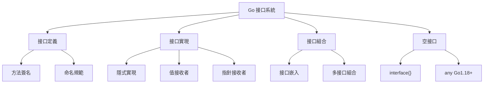
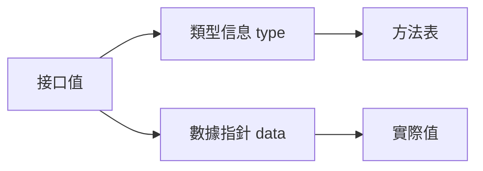

# 接口與多態

## 接口系統架構



## 接口基礎

### 接口定義

```go
type Reader interface {
    Read(p []byte) (n int, err error)
}

type Writer interface {
    Write(p []byte) (n int, err error)
}

type Closer interface {
    Close() error
}
```

### 隱式實現（Duck Typing）

Go 的接口實現是隱式的，無需顯式聲明

```go
type File struct {
    name string
    data []byte
}

func (f *File) Read(p []byte) (n int, err error) {
    n = copy(p, f.data)
    return n, nil
}

func readData(r Reader) {
    buffer := make([]byte, 1024)
    n, _ := r.Read(buffer)
    fmt.Println(string(buffer[:n]))
}

func main() {
    f := &File{
        name: "test.txt",
        data: []byte("Hello, World!"),
    }
    
    readData(f)
}
```

### 接口組合

```go
type ReadWriter interface {
    Reader
    Writer
}

type ReadWriteCloser interface {
    Reader
    Writer
    Closer
}
```

## 標準庫中的重要接口

### io 包

```go
type Reader interface {
    Read(p []byte) (n int, err error)
}

type Writer interface {
    Write(p []byte) (n int, err error)
}

type Closer interface {
    Close() error
}

type Seeker interface {
    Seek(offset int64, whence int) (int64, error)
}

type ReadCloser interface {
    Reader
    Closer
}

type WriteCloser interface {
    Writer
    Closer
}

type ReadWriteCloser interface {
    Reader
    Writer
    Closer
}
```

### fmt 包

```go
type Stringer interface {
    String() string
}

type GoStringer interface {
    GoString() string
}
```

#### 實戰案例：實現 Stringer

```go
type Person struct {
    Name string
    Age  int
}

func (p Person) String() string {
    return fmt.Sprintf("%s (%d years old)", p.Name, p.Age)
}

func main() {
    p := Person{"Alice", 30}
    fmt.Println(p)  // Alice (30 years old)
}
```

### error 接口

```go
type error interface {
    Error() string
}
```

#### 實戰案例：自定義錯誤

```go
type ValidationError struct {
    Field   string
    Message string
}

func (e *ValidationError) Error() string {
    return fmt.Sprintf("validation error on field '%s': %s", e.Field, e.Message)
}

func validateUser(username string) error {
    if len(username) < 3 {
        return &ValidationError{
            Field:   "username",
            Message: "must be at least 3 characters",
        }
    }
    return nil
}

func main() {
    if err := validateUser("ab"); err != nil {
        fmt.Println(err)
    }
}
```

### sort 接口

```go
type Interface interface {
    Len() int
    Less(i, j int) bool
    Swap(i, j int)
}
```

#### 實戰案例：自定義排序

```go
type Person struct {
    Name string
    Age  int
}

type ByAge []Person

func (a ByAge) Len() int           { return len(a) }
func (a ByAge) Less(i, j int) bool { return a[i].Age < a[j].Age }
func (a ByAge) Swap(i, j int)      { a[i], a[j] = a[j], a[i] }

func main() {
    people := []Person{
        {"Bob", 31},
        {"Alice", 25},
        {"Charlie", 28},
    }
    
    sort.Sort(ByAge(people))
    fmt.Println(people)
}

type ByName []Person

func (a ByName) Len() int           { return len(a) }
func (a ByName) Less(i, j int) bool { return a[i].Name < a[j].Name }
func (a ByName) Swap(i, j int)      { a[i], a[j] = a[j], a[i] }
```

## 空接口與類型斷言

### 空接口 interface{}

```go
func printAny(v interface{}) {
    fmt.Printf("Type: %T, Value: %v\n", v, v)
}

func main() {
    printAny(42)
    printAny("hello")
    printAny(true)
    printAny([]int{1, 2, 3})
}
```

### Go 1.18+ 的 any

```go
func printAny(v any) {
    fmt.Printf("Type: %T, Value: %v\n", v, v)
}
```

### 類型斷言

```go
var i interface{} = "hello"

s := i.(string)        // 斷言為 string，失敗會 panic
fmt.Println(s)         // hello

s, ok := i.(string)    // 安全斷言
if ok {
    fmt.Println(s)
} else {
    fmt.Println("not a string")
}
```

### 類型開關

```go
func describe(i interface{}) {
    switch v := i.(type) {
    case int:
        fmt.Printf("Integer: %d\n", v)
    case string:
        fmt.Printf("String: %s\n", v)
    case bool:
        fmt.Printf("Boolean: %t\n", v)
    case []int:
        fmt.Printf("Slice of ints: %v\n", v)
    case Person:
        fmt.Printf("Person: %s, %d\n", v.Name, v.Age)
    default:
        fmt.Printf("Unknown type: %T\n", v)
    }
}
```

### 實戰案例：處理不同類型的響應

```go
type Response struct {
    Code int
    Data interface{}
}

func handleResponse(resp Response) {
    fmt.Printf("Code: %d\n", resp.Code)
    
    switch data := resp.Data.(type) {
    case string:
        fmt.Println("Message:", data)
    case map[string]interface{}:
        fmt.Println("Object:", data)
    case []interface{}:
        fmt.Println("Array:", data)
    default:
        fmt.Println("Unknown data type")
    }
}

func main() {
    resp1 := Response{Code: 200, Data: "Success"}
    resp2 := Response{Code: 200, Data: map[string]interface{}{"user": "alice"}}
    resp3 := Response{Code: 200, Data: []interface{}{1, 2, 3}}
    
    handleResponse(resp1)
    handleResponse(resp2)
    handleResponse(resp3)
}
```

## 接口的設計原則

### 1. 保持接口小而專注

```go
type Reader interface {
    Read(p []byte) (n int, err error)
}

type Writer interface {
    Write(p []byte) (n int, err error)
}
```

### 2. 接受接口，返回具體類型

```go
func ProcessData(r io.Reader) (*Data, error) {
    // r 是接口
    data := &Data{}
    // ...
    return data, nil  // 返回具體類型
}
```

### 3. 在使用方定義接口

```go
package main

type DataStore interface {
    Get(key string) (string, error)
    Set(key, value string) error
}

func SaveUser(store DataStore, user User) error {
    return store.Set(user.ID, user.Name)
}
```

## 實戰設計模式

### 策略模式

```go
type PaymentProcessor interface {
    ProcessPayment(amount float64) error
}

type CreditCardProcessor struct{}

func (c *CreditCardProcessor) ProcessPayment(amount float64) error {
    fmt.Printf("Processing credit card payment of $%.2f\n", amount)
    return nil
}

type PayPalProcessor struct{}

func (p *PayPalProcessor) ProcessPayment(amount float64) error {
    fmt.Printf("Processing PayPal payment of $%.2f\n", amount)
    return nil
}

type BitcoinProcessor struct{}

func (b *BitcoinProcessor) ProcessPayment(amount float64) error {
    fmt.Printf("Processing Bitcoin payment of $%.2f\n", amount)
    return nil
}

type Order struct {
    Amount   float64
    Processor PaymentProcessor
}

func (o *Order) Checkout() error {
    return o.Processor.ProcessPayment(o.Amount)
}

func main() {
    order := Order{
        Amount:   100.50,
        Processor: &CreditCardProcessor{},
    }
    order.Checkout()
    
    order.Processor = &PayPalProcessor{}
    order.Checkout()
}
```

### 適配器模式

```go
type LegacyPrinter struct{}

func (lp *LegacyPrinter) PrintOld(text string) {
    fmt.Println("[OLD]", text)
}

type Printer interface {
    Print(text string)
}

type PrinterAdapter struct {
    legacy *LegacyPrinter
}

func (pa *PrinterAdapter) Print(text string) {
    pa.legacy.PrintOld(text)
}

func NewPrinterAdapter(legacy *LegacyPrinter) Printer {
    return &PrinterAdapter{legacy: legacy}
}

func main() {
    legacy := &LegacyPrinter{}
    printer := NewPrinterAdapter(legacy)
    printer.Print("Hello, World!")
}
```

### 裝飾器模式

```go
type Component interface {
    Operation() string
}

type ConcreteComponent struct{}

func (c *ConcreteComponent) Operation() string {
    return "ConcreteComponent"
}

type Decorator struct {
    component Component
}

func (d *Decorator) Operation() string {
    return d.component.Operation()
}

type ConcreteDecoratorA struct {
    Decorator
}

func (d *ConcreteDecoratorA) Operation() string {
    return "DecoratorA(" + d.Decorator.Operation() + ")"
}

type ConcreteDecoratorB struct {
    Decorator
}

func (d *ConcreteDecoratorB) Operation() string {
    return "DecoratorB(" + d.Decorator.Operation() + ")"
}

func main() {
    component := &ConcreteComponent{}
    
    decoratorA := &ConcreteDecoratorA{
        Decorator: Decorator{component: component},
    }
    
    decoratorB := &ConcreteDecoratorB{
        Decorator: Decorator{component: decoratorA},
    }
    
    fmt.Println(decoratorB.Operation())
}
```

### 實戰案例：HTTP 中間件

```go
type Handler interface {
    ServeHTTP(w http.ResponseWriter, r *http.Request)
}

type HandlerFunc func(http.ResponseWriter, *http.Request)

func (f HandlerFunc) ServeHTTP(w http.ResponseWriter, r *http.Request) {
    f(w, r)
}

type Middleware func(Handler) Handler

func LoggingMiddleware(next Handler) Handler {
    return HandlerFunc(func(w http.ResponseWriter, r *http.Request) {
        start := time.Now()
        log.Printf("Started %s %s", r.Method, r.URL.Path)
        
        next.ServeHTTP(w, r)
        
        log.Printf("Completed in %v", time.Since(start))
    })
}

func AuthMiddleware(next Handler) Handler {
    return HandlerFunc(func(w http.ResponseWriter, r *http.Request) {
        token := r.Header.Get("Authorization")
        if token == "" {
            http.Error(w, "Unauthorized", http.StatusUnauthorized)
            return
        }
        
        next.ServeHTTP(w, r)
    })
}

func Chain(middlewares ...Middleware) Middleware {
    return func(final Handler) Handler {
        for i := len(middlewares) - 1; i >= 0; i-- {
            final = middlewares[i](final)
        }
        return final
    }
}

func HelloHandler(w http.ResponseWriter, r *http.Request) {
    fmt.Fprintf(w, "Hello, World!")
}

func main() {
    handler := Chain(
        LoggingMiddleware,
        AuthMiddleware,
    )(HandlerFunc(HelloHandler))
    
    http.ListenAndServe(":8080", handler)
}
```

## 依賴注入

### 構造函數注入

```go
type UserRepository interface {
    GetUser(id int) (*User, error)
    SaveUser(user *User) error
}

type EmailService interface {
    SendEmail(to, subject, body string) error
}

type UserService struct {
    repo  UserRepository
    email EmailService
}

func NewUserService(repo UserRepository, email EmailService) *UserService {
    return &UserService{
        repo:  repo,
        email: email,
    }
}

func (s *UserService) RegisterUser(user *User) error {
    if err := s.repo.SaveUser(user); err != nil {
        return err
    }
    
    return s.email.SendEmail(
        user.Email,
        "Welcome",
        "Welcome to our service!",
    )
}
```

### Mock 實現（測試）

```go
type MockUserRepository struct {
    users map[int]*User
}

func NewMockUserRepository() *MockUserRepository {
    return &MockUserRepository{
        users: make(map[int]*User),
    }
}

func (m *MockUserRepository) GetUser(id int) (*User, error) {
    user, ok := m.users[id]
    if !ok {
        return nil, errors.New("user not found")
    }
    return user, nil
}

func (m *MockUserRepository) SaveUser(user *User) error {
    m.users[user.ID] = user
    return nil
}

type MockEmailService struct {
    sentEmails []string
}

func (m *MockEmailService) SendEmail(to, subject, body string) error {
    m.sentEmails = append(m.sentEmails, to)
    return nil
}

func TestUserService_RegisterUser(t *testing.T) {
    repo := NewMockUserRepository()
    email := &MockEmailService{}
    service := NewUserService(repo, email)
    
    user := &User{ID: 1, Email: "test@example.com"}
    err := service.RegisterUser(user)
    
    if err != nil {
        t.Errorf("Expected no error, got %v", err)
    }
    
    if len(email.sentEmails) != 1 {
        t.Errorf("Expected 1 email, got %d", len(email.sentEmails))
    }
}
```

## 接口與指針

### 值接收者 vs 指針接收者

```go
type Incrementer interface {
    Increment()
}

type Counter struct {
    count int
}

func (c Counter) Increment() {
    c.count++
}

func main() {
    c := Counter{count: 0}
    
    var i Incrementer = c
    i.Increment()
    fmt.Println(c.count)  // 0
}
```

```go
func (c *Counter) Increment() {
    c.count++
}

func main() {
    c := Counter{count: 0}
    
    var i Incrementer = &c
    i.Increment()
    fmt.Println(c.count)  // 1
}
```

### 接口值的內部結構



```go
type Reader interface {
    Read() string
}

type File struct {
    name string
}

func (f *File) Read() string {
    return f.name
}

func main() {
    var r Reader
    fmt.Printf("(%v, %T)\n", r, r)  // (<nil>, <nil>)
    
    r = &File{name: "test.txt"}
    fmt.Printf("(%v, %T)\n", r, r)  // (&{test.txt}, *main.File)
}
```

### nil 接口 vs nil 具體值

```go
func returnsError() error {
    var p *MyError = nil
    if bad() {
        p = &MyError{}
    }
    return p  // p 可能是 nil，但接口不是 nil!
}

func main() {
    err := returnsError()
    if err != nil {  // 可能為 true，即使 p 是 nil
        fmt.Println("error occurred")
    }
}
```

正確做法：

```go
func returnsError() error {
    if bad() {
        return &MyError{}
    }
    return nil
}
```

## 實戰案例：插件系統

### 定義插件接口

```go
type Plugin interface {
    Name() string
    Version() string
    Execute(args map[string]interface{}) (interface{}, error)
}

type PluginRegistry struct {
    plugins map[string]Plugin
}

func NewPluginRegistry() *PluginRegistry {
    return &PluginRegistry{
        plugins: make(map[string]Plugin),
    }
}

func (pr *PluginRegistry) Register(plugin Plugin) {
    pr.plugins[plugin.Name()] = plugin
}

func (pr *PluginRegistry) Get(name string) (Plugin, bool) {
    plugin, ok := pr.plugins[name]
    return plugin, ok
}

func (pr *PluginRegistry) Execute(name string, args map[string]interface{}) (interface{}, error) {
    plugin, ok := pr.Get(name)
    if !ok {
        return nil, fmt.Errorf("plugin %s not found", name)
    }
    return plugin.Execute(args)
}
```

### 實現具體插件

```go
type EmailPlugin struct{}

func (p *EmailPlugin) Name() string {
    return "email"
}

func (p *EmailPlugin) Version() string {
    return "1.0.0"
}

func (p *EmailPlugin) Execute(args map[string]interface{}) (interface{}, error) {
    to := args["to"].(string)
    subject := args["subject"].(string)
    body := args["body"].(string)
    
    fmt.Printf("Sending email to %s: %s\n", to, subject)
    return "Email sent", nil
}

type SMSPlugin struct{}

func (p *SMSPlugin) Name() string {
    return "sms"
}

func (p *SMSPlugin) Version() string {
    return "1.0.0"
}

func (p *SMSPlugin) Execute(args map[string]interface{}) (interface{}, error) {
    to := args["to"].(string)
    message := args["message"].(string)
    
    fmt.Printf("Sending SMS to %s: %s\n", to, message)
    return "SMS sent", nil
}
```

### 使用插件

```go
func main() {
    registry := NewPluginRegistry()
    
    registry.Register(&EmailPlugin{})
    registry.Register(&SMSPlugin{})
    
    result, err := registry.Execute("email", map[string]interface{}{
        "to":      "user@example.com",
        "subject": "Hello",
        "body":    "Hello, World!",
    })
    
    if err != nil {
        log.Fatal(err)
    }
    
    fmt.Println(result)
}
```

## 最佳實踐

### 1. 接口應該在使用方定義

消費者定義所需的接口，而不是提供者

### 2. 接口越小越好

通常 1-3 個方法最佳

### 3. 返回具體類型，接受接口

```go
func NewReader(filename string) (*os.File, error) {
    return os.Open(filename)
}

func ProcessData(r io.Reader) error {
    // ...
}
```

### 4. 使用組合而非繼承

```go
type ReadWriter interface {
    Reader
    Writer
}
```

### 5. 避免空接口濫用

盡量使用具體類型或泛型（Go 1.18+）

### 6. 小心 nil 接口陷阱

始終返回 nil 而非 nil 指針

### 7. 為錯誤類型實現接口

```go
type Error interface {
    error
    Code() int
    Details() map[string]interface{}
}
```
