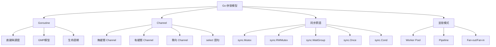
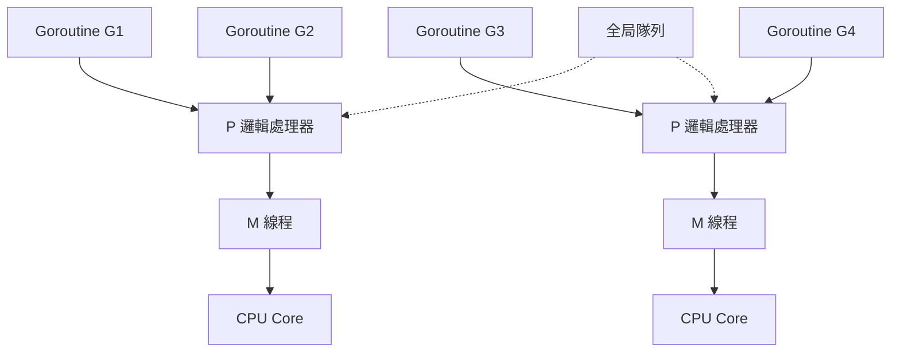

# 併發編程

## Go 併發模型架構



## Goroutine 基礎

### 創建 Goroutine

```go
func sayHello() {
    fmt.Println("Hello from goroutine")
}

func main() {
    go sayHello()
    
    go func() {
        fmt.Println("Anonymous goroutine")
    }()
    
    time.Sleep(time.Second)
}
```

### Goroutine vs Thread

| 特性       | Goroutine      | OS Thread    |
| ---------- | -------------- | ------------ |
| 棧大小     | 2KB (動態增長) | 1-2MB (固定) |
| 調度       | 用戶態調度     | 內核態調度   |
| 切換成本   | 低 (~100ns)    | 高 (~1-2μs)  |
| 創建數量   | 百萬級         | 千級         |
| 創建成本   | 低             | 高           |

### GMP 調度模型



- **G**: Goroutine
- **M**: Machine (OS Thread)
- **P**: Processor (邏輯處理器，數量 = GOMAXPROCS)

### 控制並發數量

```go
runtime.GOMAXPROCS(runtime.NumCPU())
fmt.Println("CPUs:", runtime.NumCPU())
fmt.Println("Goroutines:", runtime.NumGoroutine())
```

## Channel 通道

### Channel 設計哲學

> "Don't communicate by sharing memory; share memory by communicating."

### 無緩衝 Channel (同步)

```go
ch := make(chan int)

go func() {
    ch <- 42  // 發送，阻塞直到接收
}()

value := <-ch  // 接收，阻塞直到發送
fmt.Println(value)
```

### 有緩衝 Channel (異步)

```go
ch := make(chan int, 3)

ch <- 1
ch <- 2
ch <- 3

fmt.Println(<-ch)
fmt.Println(<-ch)
fmt.Println(<-ch)
```

### Channel 操作

```go
ch := make(chan int, 2)

ch <- 1              // 發送
value := <-ch        // 接收
value, ok := <-ch    // 接收並檢查 channel 是否關閉

close(ch)            // 關閉 channel

for value := range ch {  // 遍歷直到 channel 關閉
    fmt.Println(value)
}
```

### 單向 Channel

```go
func producer(ch chan<- int) {  // 只能發送
    for i := 0; i < 5; i++ {
        ch <- i
    }
    close(ch)
}

func consumer(ch <-chan int) {  // 只能接收
    for value := range ch {
        fmt.Println(value)
    }
}

func main() {
    ch := make(chan int)
    go producer(ch)
    consumer(ch)
}
```

### select 語句

```go
select {
case msg := <-ch1:
    fmt.Println("Received from ch1:", msg)
case msg := <-ch2:
    fmt.Println("Received from ch2:", msg)
case ch3 <- value:
    fmt.Println("Sent to ch3")
case <-time.After(1 * time.Second):
    fmt.Println("Timeout")
default:
    fmt.Println("No communication")
}
```

### 實戰案例：超時控制

```go
func fetchWithTimeout(url string, timeout time.Duration) (string, error) {
    result := make(chan string, 1)
    errCh := make(chan error, 1)
    
    go func() {
        resp, err := http.Get(url)
        if err != nil {
            errCh <- err
            return
        }
        defer resp.Body.Close()
        
        body, _ := io.ReadAll(resp.Body)
        result <- string(body)
    }()
    
    select {
    case res := <-result:
        return res, nil
    case err := <-errCh:
        return "", err
    case <-time.After(timeout):
        return "", errors.New("request timeout")
    }
}
```

### 實戰案例：取消操作（Context）

```go
func worker(ctx context.Context, id int) {
    for {
        select {
        case <-ctx.Done():
            fmt.Printf("Worker %d cancelled\n", id)
            return
        default:
            fmt.Printf("Worker %d working...\n", id)
            time.Sleep(500 * time.Millisecond)
        }
    }
}

func main() {
    ctx, cancel := context.WithCancel(context.Background())
    
    for i := 1; i <= 3; i++ {
        go worker(ctx, i)
    }
    
    time.Sleep(2 * time.Second)
    cancel()  // 取消所有 worker
    time.Sleep(1 * time.Second)
}
```

## 同步原語

### sync.Mutex

```go
type SafeCounter struct {
    mu    sync.Mutex
    count int
}

func (c *SafeCounter) Increment() {
    c.mu.Lock()
    defer c.mu.Unlock()
    c.count++
}

func (c *SafeCounter) Value() int {
    c.mu.Lock()
    defer c.mu.Unlock()
    return c.count
}
```

### sync.RWMutex

```go
type Cache struct {
    mu   sync.RWMutex
    data map[string]string
}

func (c *Cache) Get(key string) (string, bool) {
    c.mu.RLock()
    defer c.mu.RUnlock()
    value, ok := c.data[key]
    return value, ok
}

func (c *Cache) Set(key, value string) {
    c.mu.Lock()
    defer c.mu.Unlock()
    c.data[key] = value
}
```

### sync.WaitGroup

```go
func main() {
    var wg sync.WaitGroup
    
    for i := 1; i <= 5; i++ {
        wg.Add(1)
        go func(id int) {
            defer wg.Done()
            fmt.Printf("Worker %d done\n", id)
        }(i)
    }
    
    wg.Wait()
    fmt.Println("All workers completed")
}
```

### sync.Once

```go
type Database struct {
    once sync.Once
    conn *sql.DB
}

func (db *Database) GetConnection() *sql.DB {
    db.once.Do(func() {
        db.conn, _ = sql.Open("postgres", "...")
    })
    return db.conn
}
```

### sync.Pool

```go
var bufferPool = sync.Pool{
    New: func() interface{} {
        return new(bytes.Buffer)
    },
}

func processData(data []byte) {
    buf := bufferPool.Get().(*bytes.Buffer)
    defer bufferPool.Put(buf)
    
    buf.Reset()
    buf.Write(data)
}
```

### sync.Map

```go
var cache sync.Map

cache.Store("key", "value")
value, ok := cache.Load("key")
cache.Delete("key")

cache.Range(func(key, value interface{}) bool {
    fmt.Println(key, value)
    return true
})
```

### sync.Cond

```go
type Queue struct {
    mu    sync.Mutex
    cond  *sync.Cond
    items []int
}

func NewQueue() *Queue {
    q := &Queue{}
    q.cond = sync.NewCond(&q.mu)
    return q
}

func (q *Queue) Enqueue(item int) {
    q.mu.Lock()
    defer q.mu.Unlock()
    
    q.items = append(q.items, item)
    q.cond.Signal()
}

func (q *Queue) Dequeue() int {
    q.mu.Lock()
    defer q.mu.Unlock()
    
    for len(q.items) == 0 {
        q.cond.Wait()
    }
    
    item := q.items[0]
    q.items = q.items[1:]
    return item
}
```

## 並發模式

### Worker Pool

```go
func worker(id int, jobs <-chan int, results chan<- int) {
    for job := range jobs {
        fmt.Printf("Worker %d processing job %d\n", id, job)
        time.Sleep(time.Second)
        results <- job * 2
    }
}

func main() {
    const numWorkers = 3
    const numJobs = 5
    
    jobs := make(chan int, numJobs)
    results := make(chan int, numJobs)
    
    for w := 1; w <= numWorkers; w++ {
        go worker(w, jobs, results)
    }
    
    for j := 1; j <= numJobs; j++ {
        jobs <- j
    }
    close(jobs)
    
    for a := 1; a <= numJobs; a++ {
        <-results
    }
}
```

### Pipeline

```go
func generator(nums ...int) <-chan int {
    out := make(chan int)
    go func() {
        for _, n := range nums {
            out <- n
        }
        close(out)
    }()
    return out
}

func square(in <-chan int) <-chan int {
    out := make(chan int)
    go func() {
        for n := range in {
            out <- n * n
        }
        close(out)
    }()
    return out
}

func main() {
    c := generator(2, 3, 4, 5)
    out := square(c)
    
    for result := range out {
        fmt.Println(result)
    }
}
```

### Fan-out / Fan-in

```go
func fanOut(input <-chan int, workers int) []<-chan int {
    channels := make([]<-chan int, workers)
    for i := 0; i < workers; i++ {
        channels[i] = worker(input)
    }
    return channels
}

func fanIn(channels ...<-chan int) <-chan int {
    out := make(chan int)
    var wg sync.WaitGroup
    
    for _, ch := range channels {
        wg.Add(1)
        go func(c <-chan int) {
            defer wg.Done()
            for n := range c {
                out <- n
            }
        }(ch)
    }
    
    go func() {
        wg.Wait()
        close(out)
    }()
    
    return out
}

func worker(in <-chan int) <-chan int {
    out := make(chan int)
    go func() {
        for n := range in {
            out <- n * 2
        }
        close(out)
    }()
    return out
}
```

### 實戰案例：並發爬蟲

```go
type Fetcher interface {
    Fetch(url string) ([]string, error)
}

type ConcurrentCrawler struct {
    fetcher Fetcher
    visited sync.Map
}

func (c *ConcurrentCrawler) Crawl(url string, depth int, wg *sync.WaitGroup) {
    defer wg.Done()
    
    if depth <= 0 {
        return
    }
    
    if _, loaded := c.visited.LoadOrStore(url, true); loaded {
        return
    }
    
    urls, err := c.fetcher.Fetch(url)
    if err != nil {
        fmt.Println("Error:", err)
        return
    }
    
    fmt.Println("Crawled:", url)
    
    for _, u := range urls {
        wg.Add(1)
        go c.Crawl(u, depth-1, wg)
    }
}

func main() {
    crawler := &ConcurrentCrawler{fetcher: someFetcher}
    var wg sync.WaitGroup
    
    wg.Add(1)
    go crawler.Crawl("https://golang.org/", 4, &wg)
    wg.Wait()
}
```

### 實戰案例：並發下載器

```go
type DownloadTask struct {
    URL      string
    Filename string
}

type DownloadResult struct {
    Task  DownloadTask
    Size  int64
    Error error
}

func downloader(tasks <-chan DownloadTask, results chan<- DownloadResult) {
    for task := range tasks {
        size, err := downloadFile(task.URL, task.Filename)
        results <- DownloadResult{
            Task:  task,
            Size:  size,
            Error: err,
        }
    }
}

func downloadFile(url, filename string) (int64, error) {
    resp, err := http.Get(url)
    if err != nil {
        return 0, err
    }
    defer resp.Body.Close()
    
    file, err := os.Create(filename)
    if err != nil {
        return 0, err
    }
    defer file.Close()
    
    return io.Copy(file, resp.Body)
}

func main() {
    tasks := make(chan DownloadTask, 10)
    results := make(chan DownloadResult, 10)
    
    const numWorkers = 3
    for i := 0; i < numWorkers; i++ {
        go downloader(tasks, results)
    }
    
    urls := []string{
        "https://example.com/file1.zip",
        "https://example.com/file2.zip",
    }
    
    go func() {
        for i, url := range urls {
            tasks <- DownloadTask{
                URL:      url,
                Filename: fmt.Sprintf("file%d.zip", i),
            }
        }
        close(tasks)
    }()
    
    for range urls {
        result := <-results
        if result.Error != nil {
            fmt.Printf("Failed: %s\n", result.Task.URL)
        } else {
            fmt.Printf("Downloaded: %s (%d bytes)\n", result.Task.Filename, result.Size)
        }
    }
}
```

### 實戰案例：Rate Limiter

```go
type RateLimiter struct {
    tokens chan struct{}
    rate   time.Duration
}

func NewRateLimiter(requestsPerSecond int) *RateLimiter {
    rl := &RateLimiter{
        tokens: make(chan struct{}, requestsPerSecond),
        rate:   time.Second / time.Duration(requestsPerSecond),
    }
    
    go func() {
        ticker := time.NewTicker(rl.rate)
        defer ticker.Stop()
        
        for range ticker.C {
            select {
            case rl.tokens <- struct{}{}:
            default:
            }
        }
    }()
    
    return rl
}

func (rl *RateLimiter) Wait() {
    <-rl.tokens
}

func main() {
    limiter := NewRateLimiter(5)
    
    for i := 0; i < 20; i++ {
        limiter.Wait()
        go func(id int) {
            fmt.Printf("Request %d at %v\n", id, time.Now())
        }(i)
    }
    
    time.Sleep(5 * time.Second)
}
```

### 使用標準庫的 Rate Limiter

```go
import "golang.org/x/time/rate"

func main() {
    limiter := rate.NewLimiter(5, 1)  // 5 req/sec, burst 1
    
    for i := 0; i < 20; i++ {
        limiter.Wait(context.Background())
        fmt.Printf("Request %d\n", i)
    }
}
```

## 原子操作

### sync/atomic

```go
import "sync/atomic"

type Counter struct {
    value int64
}

func (c *Counter) Increment() {
    atomic.AddInt64(&c.value, 1)
}

func (c *Counter) Value() int64 {
    return atomic.LoadInt64(&c.value)
}

func (c *Counter) CompareAndSwap(old, new int64) bool {
    return atomic.CompareAndSwapInt64(&c.value, old, new)
}
```

## 常見陷阱與最佳實踐

### 1. Goroutine 泄露

```go
func leak() {
    ch := make(chan int)
    go func() {
        val := <-ch  // 永遠阻塞
        fmt.Println(val)
    }()
}
```

解決：

```go
func noLeak(ctx context.Context) {
    ch := make(chan int)
    go func() {
        select {
        case val := <-ch:
            fmt.Println(val)
        case <-ctx.Done():
            return
        }
    }()
}
```

### 2. 閉包捕獲循環變量

```go
for i := 0; i < 3; i++ {
    go func() {
        fmt.Println(i)  // 輸出 3, 3, 3
    }()
}
```

解決：

```go
for i := 0; i < 3; i++ {
    go func(n int) {
        fmt.Println(n)  // 輸出 0, 1, 2
    }(i)
}
```

### 3. 向已關閉的 Channel 發送

```go
ch := make(chan int)
close(ch)
ch <- 1  // panic!
```

### 4. 重複關閉 Channel

```go
ch := make(chan int)
close(ch)
close(ch)  // panic!
```

### 5. WaitGroup 計數錯誤

```go
var wg sync.WaitGroup
for i := 0; i < 5; i++ {
    go func() {
        wg.Add(1)  // 錯誤！應在 goroutine 外部
        defer wg.Done()
    }()
}
```

## 最佳實踐總結

### 1. 優先使用 Channel 而非共享內存

### 2. 使用 Context 管理 Goroutine 生命週期

### 3. 避免 Goroutine 泄露

始終確保 goroutine 能夠退出

### 4. 合理設置 Channel 緩衝大小

根據實際場景選擇無緩衝或有緩衝

### 5. 使用 sync.WaitGroup 等待所有任務完成

### 6. 讀多寫少用 RWMutex

### 7. 使用 select 處理多個 Channel

### 8. 使用 Worker Pool 限制並發數

### 9. 使用 Context 實現超時和取消

### 10. 謹慎使用共享狀態

盡量使用不可變數據或通過 Channel 傳遞

## 性能對比

### Channel vs Mutex

```go
func BenchmarkChannel(b *testing.B) {
    ch := make(chan int, 1)
    ch <- 0
    b.ResetTimer()
    
    for i := 0; i < b.N; i++ {
        v := <-ch
        v++
        ch <- v
    }
}

func BenchmarkMutex(b *testing.B) {
    var mu sync.Mutex
    v := 0
    b.ResetTimer()
    
    for i := 0; i < b.N; i++ {
        mu.Lock()
        v++
        mu.Unlock()
    }
}
```

結論：Mutex 通常比 Channel 快，但 Channel 提供更好的語義和安全性
