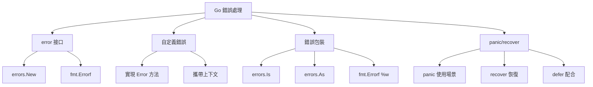

# 錯誤處理與panic恢復

## 錯誤處理架構



## error 接口

### 基本定義

```go
type error interface {
    Error() string
}
```

### 創建錯誤

```go
import "errors"

err := errors.New("something went wrong")

err := fmt.Errorf("failed to process file: %s", filename)
```

### 錯誤處理模式

```go
func divide(a, b float64) (float64, error) {
    if b == 0 {
        return 0, errors.New("division by zero")
    }
    return a / b, nil
}

result, err := divide(10, 0)
if err != nil {
    log.Fatal(err)
}
```

## 自定義錯誤類型

### 基本實現

```go
type MyError struct {
    Code    int
    Message string
    When    time.Time
}

func (e *MyError) Error() string {
    return fmt.Sprintf("[%d] %s at %v", e.Code, e.Message, e.When)
}

func doSomething() error {
    return &MyError{
        Code:    500,
        Message: "internal server error",
        When:    time.Now(),
    }
}
```

### 實戰案例：驗證錯誤

```go
type ValidationError struct {
    Field   string
    Value   interface{}
    Message string
}

func (e *ValidationError) Error() string {
    return fmt.Sprintf("validation failed on field '%s': %s (got: %v)", 
        e.Field, e.Message, e.Value)
}

func validateUser(user User) error {
    if len(user.Name) < 3 {
        return &ValidationError{
            Field:   "name",
            Value:   user.Name,
            Message: "must be at least 3 characters",
        }
    }
    
    if !strings.Contains(user.Email, "@") {
        return &ValidationError{
            Field:   "email",
            Value:   user.Email,
            Message: "must be a valid email",
        }
    }
    
    return nil
}
```

### 實戰案例：多錯誤

```go
type MultiError []error

func (m MultiError) Error() string {
    var messages []string
    for _, err := range m {
        messages = append(messages, err.Error())
    }
    return strings.Join(messages, "; ")
}

func (m MultiError) HasErrors() bool {
    return len(m) > 0
}

func validateForm(form Form) error {
    var errs MultiError
    
    if form.Name == "" {
        errs = append(errs, errors.New("name is required"))
    }
    
    if form.Email == "" {
        errs = append(errs, errors.New("email is required"))
    }
    
    if errs.HasErrors() {
        return errs
    }
    
    return nil
}
```

## 錯誤包裝 (Go 1.13+)

### 使用 %w 包裝錯誤

```go
func readConfig(filename string) error {
    _, err := os.Open(filename)
    if err != nil {
        return fmt.Errorf("failed to read config: %w", err)
    }
    return nil
}
```

### errors.Is 判斷錯誤

```go
err := readConfig("config.yaml")
if errors.Is(err, os.ErrNotExist) {
    log.Println("Config file does not exist")
}
```

### errors.As 類型斷言

```go
var pathErr *os.PathError
if errors.As(err, &pathErr) {
    log.Printf("Failed path: %s", pathErr.Path)
}
```

### 實戰案例：錯誤鏈

```go
func processFile(filename string) error {
    data, err := readFile(filename)
    if err != nil {
        return fmt.Errorf("processFile: %w", err)
    }
    
    if err := parseData(data); err != nil {
        return fmt.Errorf("processFile: %w", err)
    }
    
    return nil
}

func readFile(filename string) error {
    _, err := os.ReadFile(filename)
    if err != nil {
        return fmt.Errorf("readFile %s: %w", filename, err)
    }
    return nil
}

func parseData(data []byte) error {
    var config Config
    if err := json.Unmarshal(data, &config); err != nil {
        return fmt.Errorf("parseData: %w", err)
    }
    return nil
}

func main() {
    err := processFile("config.json")
    if err != nil {
        log.Printf("Error: %v", err)
        
        if errors.Is(err, os.ErrNotExist) {
            log.Println("File not found")
        }
    }
}
```

## panic 與 recover

### panic 使用場景

```go
func mustConnect(url string) *sql.DB {
    db, err := sql.Open("postgres", url)
    if err != nil {
        panic(err)
    }
    return db
}

if value < 0 {
    panic("value cannot be negative")
}
```

### recover 恢復

```go
func safeDivide(a, b int) (result int, err error) {
    defer func() {
        if r := recover(); r != nil {
            err = fmt.Errorf("panic: %v", r)
        }
    }()
    
    return a / b, nil
}

func main() {
    result, err := safeDivide(10, 0)
    if err != nil {
        log.Println("Error:", err)
    }
}
```

### 實戰案例：HTTP Handler 保護

```go
func protectHandler(h http.HandlerFunc) http.HandlerFunc {
    return func(w http.ResponseWriter, r *http.Request) {
        defer func() {
            if err := recover(); err != nil {
                log.Printf("Panic recovered: %v\n%s", err, debug.Stack())
                http.Error(w, "Internal Server Error", 500)
            }
        }()
        
        h(w, r)
    }
}

func riskyHandler(w http.ResponseWriter, r *http.Request) {
    panic("something went wrong")
}

func main() {
    http.HandleFunc("/", protectHandler(riskyHandler))
    http.ListenAndServe(":8080", nil)
}
```

## 最佳實踐

### 1. 返回錯誤而非 panic

```go
func divide(a, b float64) (float64, error) {
    if b == 0 {
        return 0, errors.New("division by zero")
    }
    return a / b, nil
}
```

### 2. 為錯誤添加上下文

```go
func processFile(filename string) error {
    data, err := os.ReadFile(filename)
    if err != nil {
        return fmt.Errorf("failed to read %s: %w", filename, err)
    }
    return nil
}
```

### 3. 錯誤命名

```go
var (
    ErrNotFound     = errors.New("not found")
    ErrUnauthorized = errors.New("unauthorized")
    ErrInvalidInput = errors.New("invalid input")
)
```

### 4. 不要忽略錯誤

```go
_, _ = file.Write(data)  // 不好

n, err := file.Write(data)  // 好
if err != nil {
    return err
}
```

### 5. 在頂層處理錯誤

```go
func main() {
    if err := run(); err != nil {
        log.Fatal(err)
    }
}

func run() error {
    return nil
}
```
