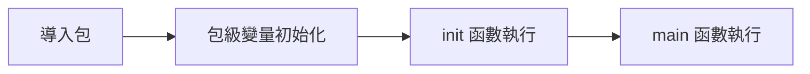

# 包管理與模組設計

## 包的基本概念

### 包聲明

```go
package main

package utils

package internal
```

### 導入包

```go
import "fmt"
import "net/http"

import (
    "fmt"
    "net/http"
    "encoding/json"
)

import (
    "fmt"
    m "math"                    // 別名
    . "strings"                 // 點導入
    _ "github.com/lib/pq"       // 僅執行 init
)
```

### 包的可見性

```go
type PublicStruct struct {    // 大寫開頭,外部可訪問
    PublicField string
    privateField string        // 小寫開頭,包內可訪問
}

func PublicFunction() {}      // 外部可訪問
func privateFunction() {}     // 包內可訪問
```

## 項目結構設計

### 標準項目結構

```
myproject/
├── cmd/
│   └── myapp/
│       └── main.go
├── internal/
│   ├── handler/
│   ├── service/
│   └── repository/
├── pkg/
│   └── utils/
├── api/
│   └── openapi.yaml
├── configs/
│   └── config.yaml
├── deployments/
│   └── docker-compose.yaml
├── scripts/
├── test/
├── go.mod
├── go.sum
└── README.md
```

### internal 包

`internal/` 目錄下的包只能被同模組導入

```
myproject/
├── internal/
│   └── secret/
│       └── secret.go    # 僅 myproject 可導入
```

## init 函數

### 執行順序



### 示例

```go
package config

var DatabaseURL string

func init() {
    DatabaseURL = os.Getenv("DATABASE_URL")
    if DatabaseURL == "" {
        log.Fatal("DATABASE_URL not set")
    }
}
```

## 實戰項目結構

### Web API 項目

```
api-server/
├── cmd/
│   └── server/
│       └── main.go
├── internal/
│   ├── api/
│   │   ├── handler/
│   │   ├── middleware/
│   │   └── router/
│   ├── domain/
│   │   ├── user/
│   │   └── product/
│   ├── repository/
│   └── service/
├── pkg/
│   ├── logger/
│   └── validator/
├── configs/
└── go.mod
```

### 分層架構實現

```go
// domain/user/user.go
package user

type User struct {
    ID    int64
    Name  string
    Email string
}

// repository/user_repository.go
package repository

type UserRepository interface {
    GetByID(id int64) (*user.User, error)
    Create(user *user.User) error
}

// service/user_service.go
package service

type UserService struct {
    repo repository.UserRepository
}

func (s *UserService) GetUser(id int64) (*user.User, error) {
    return s.repo.GetByID(id)
}

// handler/user_handler.go
package handler

type UserHandler struct {
    service *service.UserService
}

func (h *UserHandler) GetUser(w http.ResponseWriter, r *http.Request) {
    // handle request
}
```
