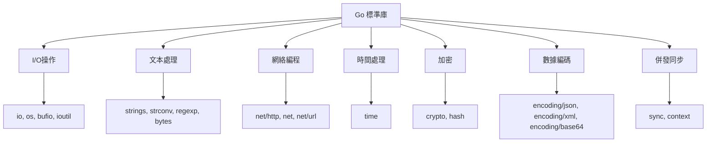

# 常用標準庫

## 標準庫概覽



## fmt - 格式化I/O

### 輸出函數

```go
package main

import "fmt"

func main() {
    fmt.Print("Hello")              // 不換行
    fmt.Println("Hello")            // 換行
    fmt.Printf("Name: %s\n", "Go")  // 格式化輸出
    
    s := fmt.Sprintf("Value: %v", 42)  // 格式化到字符串
    
    file, _ := os.Create("output.txt")
    fmt.Fprintf(file, "Data: %d\n", 100)  // 格式化到 io.Writer
}
```

### 輸入函數

```go
var name string
var age int

fmt.Scan(&name, &age)
fmt.Scanf("%s %d", &name, &age)
fmt.Scanln(&name, &age)

reader := strings.NewReader("John 25")
fmt.Fscan(reader, &name, &age)
```

### 格式化動詞詳解

#### 通用動詞

```go
type Person struct {
    Name string
    Age  int
}

p := Person{"Alice", 25}

fmt.Printf("%v\n", p)   // {Alice 25}
fmt.Printf("%+v\n", p)  // {Name:Alice Age:25}
fmt.Printf("%#v\n", p)  // main.Person{Name:"Alice", Age:25}
fmt.Printf("%T\n", p)   // main.Person
```

#### 布爾值

```go
fmt.Printf("%t\n", true)   // true
fmt.Printf("%t\n", false)  // false
```

#### 整數

```go
num := 42

fmt.Printf("%b\n", num)   // 101010 (二進制)
fmt.Printf("%o\n", num)   // 52 (八進制)
fmt.Printf("%d\n", num)   // 42 (十進制)
fmt.Printf("%x\n", num)   // 2a (十六進制小寫)
fmt.Printf("%X\n", num)   // 2A (十六進制大寫)
fmt.Printf("%c\n", num)   // * (Unicode字符)
fmt.Printf("%U\n", num)   // U+002A
fmt.Printf("%q\n", num)   // '*'
```

#### 浮點數

```go
f := 123.456789

fmt.Printf("%f\n", f)     // 123.456789
fmt.Printf("%.2f\n", f)   // 123.46
fmt.Printf("%e\n", f)     // 1.234568e+02
fmt.Printf("%E\n", f)     // 1.234568E+02
fmt.Printf("%g\n", f)     // 123.456789 (自動選擇)
```

#### 字符串與字節

```go
s := "Hello, 世界"

fmt.Printf("%s\n", s)     // Hello, 世界
fmt.Printf("%q\n", s)     // "Hello, 世界"
fmt.Printf("%x\n", s)     // 十六進制字節
fmt.Printf("% x\n", s)    // 帶空格的十六進制字節
```

#### 指針

```go
x := 42
p := &x

fmt.Printf("%p\n", p)     // 0xc0000b4000
fmt.Printf("%#p\n", p)    // c0000b4000
```

#### 寬度與精度

```go
fmt.Printf("|%5d|\n", 42)      // |   42|
fmt.Printf("|%-5d|\n", 42)     // |42   |
fmt.Printf("|%05d|\n", 42)     // |00042|
fmt.Printf("|%8.2f|\n", 3.14)  // |    3.14|
```

### 實戰案例：日誌格式化

```go
type LogEntry struct {
    Timestamp time.Time
    Level     string
    Message   string
    Data      map[string]interface{}
}

func (l LogEntry) String() string {
    return fmt.Sprintf("[%s] %s: %s %+v",
        l.Timestamp.Format("2006-01-02 15:04:05"),
        l.Level,
        l.Message,
        l.Data,
    )
}

func main() {
    log := LogEntry{
        Timestamp: time.Now(),
        Level:     "INFO",
        Message:   "User logged in",
        Data:      map[string]interface{}{"user_id": 123, "ip": "192.168.1.1"},
    }
    fmt.Println(log)
}
```

## strings - 字符串處理

### 查詢與判斷

```go
s := "Hello, World!"

strings.Contains(s, "World")        // true
strings.ContainsAny(s, "aeiou")    // true
strings.ContainsRune(s, 'W')       // true

strings.HasPrefix(s, "Hello")      // true
strings.HasSuffix(s, "!")          // true

strings.Index(s, "World")          // 7
strings.LastIndex(s, "o")          // 8
strings.IndexAny(s, "aeiou")       // 1
strings.Count(s, "l")              // 3
```

### 修改操作

```go
strings.ToUpper("hello")                    // "HELLO"
strings.ToLower("HELLO")                    // "hello"
strings.Title("hello world")                // "Hello World"

strings.TrimSpace("  hello  ")              // "hello"
strings.Trim("!!!hello!!!", "!")            // "hello"
strings.TrimLeft("000123", "0")             // "123"
strings.TrimRight("hello000", "0")          // "hello"
strings.TrimPrefix("Hello, World", "Hello") // ", World"
strings.TrimSuffix("file.txt", ".txt")      // "file"

strings.Replace("oink oink oink", "k", "ky", 2)  // "oinky oinky oink"
strings.ReplaceAll("oink oink", "oink", "moo")   // "moo moo"

strings.Repeat("na", 3)                     // "nanana"
```

### 分割與連接

```go
strings.Split("a,b,c,d", ",")              // ["a", "b", "c", "d"]
strings.SplitN("a,b,c,d", ",", 2)          // ["a", "b,c,d"]
strings.SplitAfter("a,b,c", ",")           // ["a,", "b,", "c"]
strings.Fields("  a   b   c  ")            // ["a", "b", "c"]

strings.Join([]string{"a", "b", "c"}, "-") // "a-b-c"
```

### strings.Builder - 高效字符串構建

```go
var builder strings.Builder

builder.WriteString("Hello")
builder.WriteString(", ")
builder.WriteString("World")
builder.WriteByte('!')
builder.WriteRune('中')

result := builder.String()  // "Hello, World!中"
builder.Reset()             // 清空

builder.Grow(1024)          // 預分配空間
```

### 實戰案例：CSV 解析

```go
func parseCSV(data string) [][]string {
    var result [][]string
    lines := strings.Split(data, "\n")
    
    for _, line := range lines {
        line = strings.TrimSpace(line)
        if line == "" {
            continue
        }
        fields := strings.Split(line, ",")
        for i, field := range fields {
            fields[i] = strings.TrimSpace(field)
        }
        result = append(result, fields)
    }
    
    return result
}

func main() {
    csv := `
        name, age, city
        Alice, 25, NYC
        Bob, 30, LA
    `
    data := parseCSV(csv)
    for _, row := range data {
        fmt.Printf("%v\n", row)
    }
}
```

### 實戰案例：URL 路徑處理

```go
func cleanPath(path string) string {
    path = strings.TrimSpace(path)
    path = strings.Trim(path, "/")
    
    segments := strings.Split(path, "/")
    var cleaned []string
    
    for _, seg := range segments {
        seg = strings.TrimSpace(seg)
        if seg != "" && seg != "." {
            if seg == ".." && len(cleaned) > 0 {
                cleaned = cleaned[:len(cleaned)-1]
            } else if seg != ".." {
                cleaned = append(cleaned, seg)
            }
        }
    }
    
    return "/" + strings.Join(cleaned, "/")
}

func main() {
    fmt.Println(cleanPath("/a/b/../c/./d/"))  // "/a/c/d"
}
```

## strconv - 類型轉換

### 字符串與整數

```go
i, err := strconv.Atoi("123")              // string -> int
s := strconv.Itoa(123)                     // int -> string

i64, err := strconv.ParseInt("123", 10, 64)   // 基數10, 64位
ui64, err := strconv.ParseUint("123", 10, 64)

s = strconv.FormatInt(123, 10)             // int64 -> string
s = strconv.FormatUint(123, 10)            // uint64 -> string
```

### 字符串與浮點數

```go
f, err := strconv.ParseFloat("3.1415", 64)
s := strconv.FormatFloat(3.1415, 'f', 4, 64)  // 格式, 精度, 位數

// 格式選項
strconv.FormatFloat(3.14, 'f', 2, 64)   // "3.14" (定點)
strconv.FormatFloat(314.0, 'e', 2, 64)  // "3.14e+02" (科學計數)
strconv.FormatFloat(3.14, 'g', -1, 64)  // "3.14" (自動)
```

### 字符串與布爾值

```go
b, err := strconv.ParseBool("true")     // string -> bool
b, err = strconv.ParseBool("1")         // true
b, err = strconv.ParseBool("false")     // false
b, err = strconv.ParseBool("0")         // false

s := strconv.FormatBool(true)           // "true"
```

### 引號處理

```go
s := strconv.Quote("Hello\nWorld")      // "\"Hello\\nWorld\""
s = strconv.QuoteRune('世')              // "'世'"

unquoted, err := strconv.Unquote(`"Hello"`)  // "Hello"
```

### 實戰案例：配置文件解析

```go
type Config struct {
    Host     string
    Port     int
    Debug    bool
    Timeout  float64
    MaxConns int64
}

func parseConfig(data map[string]string) (*Config, error) {
    cfg := &Config{}
    
    cfg.Host = data["host"]
    
    if port, err := strconv.Atoi(data["port"]); err == nil {
        cfg.Port = port
    } else {
        return nil, fmt.Errorf("invalid port: %v", err)
    }
    
    if debug, err := strconv.ParseBool(data["debug"]); err == nil {
        cfg.Debug = debug
    }
    
    if timeout, err := strconv.ParseFloat(data["timeout"], 64); err == nil {
        cfg.Timeout = timeout
    }
    
    if maxConns, err := strconv.ParseInt(data["max_conns"], 10, 64); err == nil {
        cfg.MaxConns = maxConns
    }
    
    return cfg, nil
}
```

## bytes - 字節操作

### 基本操作

```go
import "bytes"

b1 := []byte("hello")
b2 := []byte("world")

bytes.Equal(b1, b2)                    // false
bytes.Compare(b1, b2)                  // -1, 0, 1
bytes.Contains(b1, []byte("ell"))      // true
bytes.Index(b1, []byte("ll"))          // 2
bytes.Count(b1, []byte("l"))           // 2
```

### bytes.Buffer - 緩衝區

```go
var buf bytes.Buffer

buf.Write([]byte("Hello"))
buf.WriteString(", ")
buf.WriteByte('W')
buf.WriteRune('世')

data := buf.Bytes()    // 獲取字節切片
s := buf.String()      // 獲取字符串
buf.Reset()            // 清空
buf.Grow(1024)         // 預分配
```

### 實戰案例：構建HTTP請求體

```go
func buildJSONRequest(data map[string]interface{}) (*bytes.Buffer, error) {
    var buf bytes.Buffer
    encoder := json.NewEncoder(&buf)
    if err := encoder.Encode(data); err != nil {
        return nil, err
    }
    return &buf, nil
}

func main() {
    data := map[string]interface{}{
        "username": "alice",
        "email":    "alice@example.com",
    }
    
    buf, _ := buildJSONRequest(data)
    req, _ := http.NewRequest("POST", "https://api.example.com/users", buf)
    req.Header.Set("Content-Type", "application/json")
}
```

## io - 輸入輸出接口

### 核心接口

```go
type Reader interface {
    Read(p []byte) (n int, err error)
}

type Writer interface {
    Write(p []byte) (n int, err error)
}

type Closer interface {
    Close() error
}

type ReadWriter interface {
    Reader
    Writer
}

type ReadCloser interface {
    Reader
    Closer
}

type WriteCloser interface {
    Writer
    Closer
}
```

### 常用函數

```go
n, err := io.Copy(dst, src)              // 拷貝數據
data, err := io.ReadAll(r)               // 讀取所有數據
n, err := io.WriteString(w, "hello")     // 寫入字符串
n, err := io.CopyN(dst, src, 1024)       // 拷貝指定字節數

r := io.LimitReader(r, 1024)             // 限制讀取數量
r := io.MultiReader(r1, r2, r3)          // 順序讀取多個
w := io.MultiWriter(w1, w2, w3)          // 同時寫入多個

r, w := io.Pipe()                        // 創建管道
```

### 實戰案例：文件拷貝進度

```go
type ProgressReader struct {
    io.Reader
    Total    int64
    Current  int64
    OnProgress func(current, total int64)
}

func (pr *ProgressReader) Read(p []byte) (int, error) {
    n, err := pr.Reader.Read(p)
    pr.Current += int64(n)
    
    if pr.OnProgress != nil {
        pr.OnProgress(pr.Current, pr.Total)
    }
    
    return n, err
}

func copyWithProgress(dst io.Writer, src io.Reader, size int64) error {
    pr := &ProgressReader{
        Reader: src,
        Total:  size,
        OnProgress: func(current, total int64) {
            percent := float64(current) / float64(total) * 100
            fmt.Printf("\rProgress: %.2f%%", percent)
        },
    }
    
    _, err := io.Copy(dst, pr)
    fmt.Println()
    return err
}
```

## bufio - 緩衝I/O

### Scanner - 按行讀取

```go
file, _ := os.Open("data.txt")
defer file.Close()

scanner := bufio.NewScanner(file)
for scanner.Scan() {
    line := scanner.Text()
    fmt.Println(line)
}

if err := scanner.Err(); err != nil {
    log.Fatal(err)
}
```

### 自定義分隔符

```go
scanner := bufio.NewScanner(strings.NewReader("a,b,c,d"))
scanner.Split(func(data []byte, atEOF bool) (advance int, token []byte, err error) {
    if i := bytes.IndexByte(data, ','); i >= 0 {
        return i + 1, data[0:i], nil
    }
    if atEOF && len(data) > 0 {
        return len(data), data, nil
    }
    return 0, nil, nil
})

for scanner.Scan() {
    fmt.Println(scanner.Text())
}
```

### Reader/Writer

```go
reader := bufio.NewReader(os.Stdin)

line, err := reader.ReadString('\n')
line, isPrefix, err := reader.ReadLine()
data, err := reader.ReadBytes('\n')

writer := bufio.NewWriter(os.Stdout)
writer.WriteString("Hello\n")
writer.Flush()
```

### 實戰案例：大文件處理

```go
func processLargeFile(filename string) error {
    file, err := os.Open(filename)
    if err != nil {
        return err
    }
    defer file.Close()
    
    scanner := bufio.NewScanner(file)
    scanner.Buffer(make([]byte, 0, 64*1024), 1024*1024)
    
    lineCount := 0
    for scanner.Scan() {
        lineCount++
        line := scanner.Text()
        
        if strings.Contains(line, "ERROR") {
            fmt.Printf("Line %d: %s\n", lineCount, line)
        }
    }
    
    return scanner.Err()
}
```

## os - 操作系統接口

### 文件操作

```go
file, err := os.Open("input.txt")
if err != nil {
    if os.IsNotExist(err) {
        fmt.Println("File not found")
    }
}
defer file.Close()

file, err = os.OpenFile("file.txt", os.O_RDWR|os.O_CREATE|os.O_APPEND, 0644)

file, err = os.Create("output.txt")
n, err := file.WriteString("Hello\n")
n, err = file.Write([]byte("World\n"))
err = file.Sync()

data, err := os.ReadFile("file.txt")
err = os.WriteFile("file.txt", data, 0644)

err = os.Remove("file.txt")
err = os.Rename("old.txt", "new.txt")

info, err := os.Stat("file.txt")
fmt.Println(info.Name(), info.Size(), info.ModTime(), info.IsDir())
```

### 目錄操作

```go
err := os.Mkdir("mydir", 0755)
err = os.MkdirAll("path/to/dir", 0755)
err = os.RemoveAll("mydir")

wd, err := os.Getwd()
err = os.Chdir("/tmp")

entries, err := os.ReadDir(".")
for _, entry := range entries {
    info, _ := entry.Info()
    fmt.Printf("%s\t%d\t%v\n", entry.Name(), info.Size(), entry.IsDir())
}
```

### 文件權限與屬性

```go
err := os.Chmod("file.txt", 0644)
err = os.Chown("file.txt", uid, gid)

info, err := os.Stat("file.txt")
mode := info.Mode()

if mode.IsRegular() {
    fmt.Println("Regular file")
}
if mode.IsDir() {
    fmt.Println("Directory")
}
if mode&0400 != 0 {
    fmt.Println("Readable by owner")
}
```

### 環境變量

```go
val := os.Getenv("HOME")
val, exists := os.LookupEnv("PATH")
err := os.Setenv("MY_VAR", "value")
err = os.Unsetenv("MY_VAR")

for _, env := range os.Environ() {
    fmt.Println(env)
}
```

### 進程操作

```go
fmt.Println(os.Getpid())
fmt.Println(os.Getppid())
fmt.Println(os.Getuid())
fmt.Println(os.Getgid())

os.Exit(0)

args := os.Args  // 命令行參數
```

### 實戰案例：文件監控

```go
func watchFile(filename string, interval time.Duration) {
    var lastModTime time.Time
    
    ticker := time.NewTicker(interval)
    defer ticker.Stop()
    
    for range ticker.C {
        info, err := os.Stat(filename)
        if err != nil {
            continue
        }
        
        if info.ModTime() != lastModTime {
            fmt.Printf("File %s modified at %v\n", filename, info.ModTime())
            lastModTime = info.ModTime()
        }
    }
}
```

## path/filepath - 文件路徑操作

```go
import "path/filepath"

path := filepath.Join("dir", "subdir", "file.txt")    // 跨平台路徑連接
abs, err := filepath.Abs("relative/path")             // 絕對路徑
dir := filepath.Dir("/path/to/file.txt")              // "/path/to"
base := filepath.Base("/path/to/file.txt")            // "file.txt"
ext := filepath.Ext("file.txt")                       // ".txt"

matched, err := filepath.Match("*.txt", "file.txt")
matches, err := filepath.Glob("*.go")

err = filepath.Walk(".", func(path string, info os.FileInfo, err error) error {
    if err != nil {
        return err
    }
    fmt.Println(path, info.Size())
    return nil
})
```

## time - 時間處理

### 時間獲取與創建

```go
now := time.Now()
fmt.Println(now.Year(), now.Month(), now.Day())
fmt.Println(now.Hour(), now.Minute(), now.Second(), now.Nanosecond())
fmt.Println(now.Weekday())
fmt.Println(now.YearDay())
fmt.Println(now.Zone())

utc := time.Now().UTC()
local := time.Now().Local()

t := time.Date(2024, time.January, 1, 12, 0, 0, 0, time.UTC)

unix := now.Unix()           // 秒時間戳
unixMilli := now.UnixMilli() // 毫秒時間戳
unixNano := now.UnixNano()   // 納秒時間戳

t = time.Unix(unix, 0)
t = time.UnixMilli(unixMilli)
```

### 時間運算

```go
future := now.Add(24 * time.Hour)
past := now.Add(-7 * 24 * time.Hour)

future = now.AddDate(1, 2, 3)  // 加1年2月3天

duration := future.Sub(now)
fmt.Println(duration.Hours())
fmt.Println(duration.Minutes())
fmt.Println(duration.Seconds())

elapsed := time.Since(start)
remaining := time.Until(deadline)

if t1.Before(t2) {
    fmt.Println("t1 before t2")
}
if t1.After(t2) {
    fmt.Println("t1 after t2")
}
if t1.Equal(t2) {
    fmt.Println("t1 equals t2")
}
```

### 時間格式化

```go
layout := "2006-01-02 15:04:05"
s := now.Format(layout)
s = now.Format("2006/01/02")
s = now.Format("15:04:05")
s = now.Format(time.RFC3339)

t, err := time.Parse(layout, "2024-01-01 12:00:00")
t, err = time.ParseInLocation(layout, "2024-01-01 12:00:00", time.Local)
```

### Timer 和 Ticker

```go
timer := time.NewTimer(5 * time.Second)
<-timer.C
fmt.Println("Timer expired")

timer.Stop()
timer.Reset(10 * time.Second)

ticker := time.NewTicker(1 * time.Second)
defer ticker.Stop()

for i := 0; i < 5; i++ {
    <-ticker.C
    fmt.Println("Tick", i+1)
}

time.Sleep(2 * time.Second)
time.After(5 * time.Second)  // 返回 <-chan time.Time
```

### 實戰案例：速率限制器

```go
type RateLimiter struct {
    rate     time.Duration
    lastTime time.Time
    mu       sync.Mutex
}

func NewRateLimiter(rate time.Duration) *RateLimiter {
    return &RateLimiter{
        rate:     rate,
        lastTime: time.Now(),
    }
}

func (rl *RateLimiter) Allow() bool {
    rl.mu.Lock()
    defer rl.mu.Unlock()
    
    now := time.Now()
    if now.Sub(rl.lastTime) >= rl.rate {
        rl.lastTime = now
        return true
    }
    return false
}

func (rl *RateLimiter) Wait() {
    rl.mu.Lock()
    defer rl.mu.Unlock()
    
    now := time.Now()
    sleep := rl.rate - now.Sub(rl.lastTime)
    if sleep > 0 {
        time.Sleep(sleep)
    }
    rl.lastTime = time.Now()
}
```

## encoding/json - JSON處理

### 結構體標籤

```go
type User struct {
    ID        int       `json:"id"`
    Name      string    `json:"name"`
    Email     string    `json:"email,omitempty"`
    Password  string    `json:"-"`
    Age       int       `json:"age,string"`
    IsActive  bool      `json:"is_active"`
    CreatedAt time.Time `json:"created_at"`
}
```

### 序列化

```go
user := User{
    ID:        1,
    Name:      "Alice",
    Email:     "alice@example.com",
    IsActive:  true,
    CreatedAt: time.Now(),
}

data, err := json.Marshal(user)
data, err = json.MarshalIndent(user, "", "  ")

var buf bytes.Buffer
encoder := json.NewEncoder(&buf)
encoder.SetIndent("", "  ")
encoder.Encode(user)
```

### 反序列化

```go
jsonData := `{"id":1,"name":"Alice","email":"alice@example.com"}`

var user User
err := json.Unmarshal([]byte(jsonData), &user)

decoder := json.NewDecoder(strings.NewReader(jsonData))
err = decoder.Decode(&user)

var data map[string]interface{}
err = json.Unmarshal([]byte(jsonData), &data)
```

### 實戰案例：動態JSON處理

```go
type Response struct {
    Code    int                    `json:"code"`
    Message string                 `json:"message"`
    Data    map[string]interface{} `json:"data"`
}

func handleDynamicJSON(jsonStr string) error {
    var resp Response
    if err := json.Unmarshal([]byte(jsonStr), &resp); err != nil {
        return err
    }
    
    if userID, ok := resp.Data["user_id"].(float64); ok {
        fmt.Printf("User ID: %d\n", int(userID))
    }
    
    if name, ok := resp.Data["name"].(string); ok {
        fmt.Printf("Name: %s\n", name)
    }
    
    return nil
}
```

### 自定義序列化

```go
type Date time.Time

func (d Date) MarshalJSON() ([]byte, error) {
    stamp := time.Time(d).Format("2006-01-02")
    return json.Marshal(stamp)
}

func (d *Date) UnmarshalJSON(data []byte) error {
    var s string
    if err := json.Unmarshal(data, &s); err != nil {
        return err
    }
    
    t, err := time.Parse("2006-01-02", s)
    if err != nil {
        return err
    }
    
    *d = Date(t)
    return nil
}
```

## net/http - HTTP 編程

### HTTP 客戶端

```go
resp, err := http.Get("https://api.example.com/users")
if err != nil {
    log.Fatal(err)
}
defer resp.Body.Close()

body, err := io.ReadAll(resp.Body)
fmt.Println(resp.StatusCode)
fmt.Println(resp.Header.Get("Content-Type"))

client := &http.Client{
    Timeout: 10 * time.Second,
}

req, err := http.NewRequest("POST", url, bytes.NewBuffer(jsonData))
req.Header.Set("Content-Type", "application/json")
req.Header.Set("Authorization", "Bearer token")

resp, err = client.Do(req)
```

### HTTP 服務器

```go
http.HandleFunc("/", func(w http.ResponseWriter, r *http.Request) {
    fmt.Fprintf(w, "Hello, %s!", r.URL.Path[1:])
})

http.HandleFunc("/api/users", func(w http.ResponseWriter, r *http.Request) {
    switch r.Method {
    case http.MethodGet:
        w.Header().Set("Content-Type", "application/json")
        json.NewEncoder(w).Encode(users)
    case http.MethodPost:
        var user User
        json.NewDecoder(r.Body).Decode(&user)
        w.WriteHeader(http.StatusCreated)
        json.NewEncoder(w).Encode(user)
    default:
        w.WriteHeader(http.StatusMethodNotAllowed)
    }
})

server := &http.Server{
    Addr:         ":8080",
    ReadTimeout:  10 * time.Second,
    WriteTimeout: 10 * time.Second,
    IdleTimeout:  60 * time.Second,
}

log.Fatal(server.ListenAndServe())
```

### 實戰案例：REST API 客戶端

```go
type APIClient struct {
    baseURL string
    client  *http.Client
}

func NewAPIClient(baseURL string) *APIClient {
    return &APIClient{
        baseURL: baseURL,
        client: &http.Client{
            Timeout: 30 * time.Second,
        },
    }
}

func (c *APIClient) Get(endpoint string, result interface{}) error {
    url := c.baseURL + endpoint
    
    req, err := http.NewRequest("GET", url, nil)
    if err != nil {
        return err
    }
    
    resp, err := c.client.Do(req)
    if err != nil {
        return err
    }
    defer resp.Body.Close()
    
    if resp.StatusCode != http.StatusOK {
        return fmt.Errorf("status: %d", resp.StatusCode)
    }
    
    return json.NewDecoder(resp.Body).Decode(result)
}

func (c *APIClient) Post(endpoint string, data interface{}, result interface{}) error {
    jsonData, err := json.Marshal(data)
    if err != nil {
        return err
    }
    
    url := c.baseURL + endpoint
    req, err := http.NewRequest("POST", url, bytes.NewBuffer(jsonData))
    if err != nil {
        return err
    }
    
    req.Header.Set("Content-Type", "application/json")
    
    resp, err := c.client.Do(req)
    if err != nil {
        return err
    }
    defer resp.Body.Close()
    
    if resp.StatusCode != http.StatusOK && resp.StatusCode != http.StatusCreated {
        return fmt.Errorf("status: %d", resp.StatusCode)
    }
    
    return json.NewDecoder(resp.Body).Decode(result)
}
```

## context - 上下文管理

### 創建 Context

```go
ctx := context.Background()
ctx := context.TODO()

ctx, cancel := context.WithCancel(ctx)
defer cancel()

ctx, cancel := context.WithTimeout(ctx, 5*time.Second)
defer cancel()

deadline := time.Now().Add(10 * time.Second)
ctx, cancel := context.WithDeadline(ctx, deadline)
defer cancel()

ctx = context.WithValue(ctx, "request_id", "abc123")
```

### 使用 Context

```go
select {
case <-ctx.Done():
    fmt.Println("Context cancelled:", ctx.Err())
    return
case result := <-ch:
    fmt.Println("Got result:", result)
}

if deadline, ok := ctx.Deadline(); ok {
    fmt.Println("Deadline:", deadline)
}

if value := ctx.Value("request_id"); value != nil {
    requestID := value.(string)
    fmt.Println("Request ID:", requestID)
}
```

### 實戰案例：HTTP 請求超時

```go
func fetchWithContext(ctx context.Context, url string) ([]byte, error) {
    req, err := http.NewRequestWithContext(ctx, "GET", url, nil)
    if err != nil {
        return nil, err
    }
    
    resp, err := http.DefaultClient.Do(req)
    if err != nil {
        return nil, err
    }
    defer resp.Body.Close()
    
    return io.ReadAll(resp.Body)
}

func main() {
    ctx, cancel := context.WithTimeout(context.Background(), 3*time.Second)
    defer cancel()
    
    data, err := fetchWithContext(ctx, "https://api.example.com/data")
    if err != nil {
        if err == context.DeadlineExceeded {
            log.Println("Request timeout")
        }
        log.Fatal(err)
    }
    
    fmt.Println(string(data))
}
```

## regexp - 正則表達式

### 基本匹配

```go
matched, err := regexp.MatchString(`\d+`, "abc123")  // true

re := regexp.MustCompile(`\d+`)
matched = re.MatchString("abc123")

result := re.FindString("abc123 def456")           // "123"
results := re.FindAllString("abc123 def456", -1)   // ["123", "456"]
results = re.FindAllString("abc123 def456", 1)     // ["123"]

index := re.FindStringIndex("abc123")              // [3, 6]
indices := re.FindAllStringIndex("abc123 def456", -1)
```

### 子匹配

```go
re := regexp.MustCompile(`(\d{4})-(\d{2})-(\d{2})`)
matches := re.FindStringSubmatch("Today is 2024-01-15")
// matches[0] = "2024-01-15"
// matches[1] = "2024"
// matches[2] = "01"
// matches[3] = "15"

allMatches := re.FindAllStringSubmatch(text, -1)
```

### 替換

```go
re := regexp.MustCompile(`\d+`)
result := re.ReplaceAllString("abc123 def456", "XXX")  // "abcXXX defXXX"

result = re.ReplaceAllStringFunc("abc123", func(s string) string {
    num, _ := strconv.Atoi(s)
    return strconv.Itoa(num * 2)
})
```

### 實戰案例：驗證與提取

```go
func validateEmail(email string) bool {
    re := regexp.MustCompile(`^[a-zA-Z0-9._%+-]+@[a-zA-Z0-9.-]+\.[a-zA-Z]{2,}$`)
    return re.MatchString(email)
}

func extractURLs(text string) []string {
    re := regexp.MustCompile(`https?://[^\s]+`)
    return re.FindAllString(text, -1)
}

func parseLogLine(line string) map[string]string {
    re := regexp.MustCompile(`\[(\d{4}-\d{2}-\d{2})\s+(\d{2}:\d{2}:\d{2})\]\s+(\w+):\s+(.+)`)
    matches := re.FindStringSubmatch(line)
    
    if len(matches) == 0 {
        return nil
    }
    
    return map[string]string{
        "date":    matches[1],
        "time":    matches[2],
        "level":   matches[3],
        "message": matches[4],
    }
}
```

## sort - 排序

### 基本排序

```go
ints := []int{3, 1, 4, 1, 5, 9, 2, 6}
sort.Ints(ints)
sort.Sort(sort.Reverse(sort.IntSlice(ints)))

floats := []float64{3.14, 1.41, 2.71}
sort.Float64s(floats)

strings := []string{"banana", "apple", "cherry"}
sort.Strings(strings)

sort.IsSorted(sort.IntSlice(ints))
```

### 自定義排序

```go
type Person struct {
    Name string
    Age  int
}

people := []Person{
    {"Bob", 31},
    {"Alice", 25},
    {"Charlie", 28},
}

sort.Slice(people, func(i, j int) bool {
    return people[i].Age < people[j].Age
})

sort.SliceStable(people, func(i, j int) bool {
    return people[i].Name < people[j].Name
})
```

### 實現 sort.Interface

```go
type ByAge []Person

func (a ByAge) Len() int           { return len(a) }
func (a ByAge) Less(i, j int) bool { return a[i].Age < a[j].Age }
func (a ByAge) Swap(i, j int)      { a[i], a[j] = a[j], a[i] }

sort.Sort(ByAge(people))
sort.Sort(sort.Reverse(ByAge(people)))
```

### 二分查找

```go
ints := []int{1, 2, 3, 4, 5, 6, 7, 8, 9}
index := sort.SearchInts(ints, 5)  // 4

strings := []string{"a", "b", "c", "d"}
index = sort.SearchStrings(strings, "c")  // 2

index = sort.Search(len(ints), func(i int) bool {
    return ints[i] >= 5
})
```

## 最佳實踐總結

### 1. 優先使用標準庫

標準庫經過充分測試，性能優異

### 2. 合理使用緩衝

```go
var buf bytes.Buffer
var builder strings.Builder
reader := bufio.NewReader(file)
writer := bufio.NewWriter(file)
```

### 3. 正確處理錯誤

```go
data, err := os.ReadFile("file.txt")
if err != nil {
    return fmt.Errorf("read file: %w", err)
}
```

### 4. 使用 context 管理生命週期

```go
ctx, cancel := context.WithTimeout(ctx, 5*time.Second)
defer cancel()
```

### 5. 預編譯正則表達式

```go
var emailRegex = regexp.MustCompile(`^[a-zA-Z0-9._%+-]+@[a-zA-Z0-9.-]+\.[a-zA-Z]{2,}$`)
```

### 6. 使用 defer 確保資源釋放

```go
file, err := os.Open("file.txt")
if err != nil {
    return err
}
defer file.Close()
```
