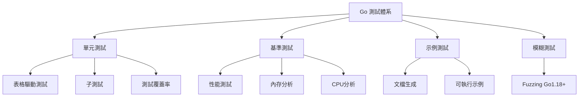

# 測試與性能調優

## 測試體系架構



## 單元測試基礎

### 測試文件命名規則

```
math.go       -> math_test.go
user.go       -> user_test.go
handler.go    -> handler_test.go
```

### 基本測試函數

```go
// math.go
package math

func Add(a, b int) int {
    return a + b
}

func Divide(a, b float64) (float64, error) {
    if b == 0 {
        return 0, errors.New("division by zero")
    }
    return a / b, nil
}

// math_test.go
package math

import "testing"

func TestAdd(t *testing.T) {
    result := Add(2, 3)
    expected := 5
    
    if result != expected {
        t.Errorf("Add(2, 3) = %d; expected %d", result, expected)
    }
}

func TestDivide(t *testing.T) {
    result, err := Divide(10, 2)
    if err != nil {
        t.Fatalf("unexpected error: %v", err)
    }
    
    if result != 5.0 {
        t.Errorf("Divide(10, 2) = %f; expected 5.0", result)
    }
}

func TestDivideByZero(t *testing.T) {
    _, err := Divide(10, 0)
    if err == nil {
        t.Error("expected error for division by zero")
    }
}
```

### 運行測試

```bash
go test                           # 當前目錄
go test ./...                     # 遞歸測試所有子目錄
go test -v                        # 詳細輸出
go test -run TestAdd              # 運行特定測試
go test -run "TestAdd|TestDivide" # 運行多個測試
go test -short                    # 跳過長測試
go test -timeout 30s              # 設置超時
go test -count=10                 # 運行10次
go test -parallel 4               # 並行運行
```

## 表格驅動測試

### 基本模式

```go
func TestAdd(t *testing.T) {
    tests := []struct {
        name     string
        a, b     int
        expected int
    }{
        {"positive numbers", 2, 3, 5},
        {"negative numbers", -1, -2, -3},
        {"mixed signs", -1, 2, 1},
        {"with zero", 0, 5, 5},
        {"both zero", 0, 0, 0},
    }
    
    for _, tt := range tests {
        t.Run(tt.name, func(t *testing.T) {
            result := Add(tt.a, tt.b)
            if result != tt.expected {
                t.Errorf("Add(%d, %d) = %d; expected %d",
                    tt.a, tt.b, result, tt.expected)
            }
        })
    }
}
```

### 錯誤測試模式

```go
func TestValidateEmail(t *testing.T) {
    tests := []struct {
        name    string
        email   string
        wantErr bool
    }{
        {"valid email", "user@example.com", false},
        {"no @ symbol", "userexample.com", true},
        {"no domain", "user@", true},
        {"empty string", "", true},
    }
    
    for _, tt := range tests {
        t.Run(tt.name, func(t *testing.T) {
            err := ValidateEmail(tt.email)
            if (err != nil) != tt.wantErr {
                t.Errorf("ValidateEmail() error = %v, wantErr %v", err, tt.wantErr)
            }
        })
    }
}
```

### 實戰案例：HTTP Handler 測試

```go
// handler.go
func UserHandler(w http.ResponseWriter, r *http.Request) {
    if r.Method != http.MethodGet {
        http.Error(w, "Method not allowed", http.StatusMethodNotAllowed)
        return
    }
    
    id := r.URL.Query().Get("id")
    if id == "" {
        http.Error(w, "Missing id parameter", http.StatusBadRequest)
        return
    }
    
    user := User{ID: id, Name: "John Doe"}
    json.NewEncoder(w).Encode(user)
}

// handler_test.go
func TestUserHandler(t *testing.T) {
    tests := []struct {
        name           string
        method         string
        queryParams    string
        expectedStatus int
        expectedBody   string
    }{
        {
            name:           "valid request",
            method:         "GET",
            queryParams:    "?id=123",
            expectedStatus: http.StatusOK,
            expectedBody:   `{"id":"123","name":"John Doe"}`,
        },
        {
            name:           "missing id",
            method:         "GET",
            queryParams:    "",
            expectedStatus: http.StatusBadRequest,
        },
        {
            name:           "wrong method",
            method:         "POST",
            queryParams:    "?id=123",
            expectedStatus: http.StatusMethodNotAllowed,
        },
    }
    
    for _, tt := range tests {
        t.Run(tt.name, func(t *testing.T) {
            req := httptest.NewRequest(tt.method, "/user"+tt.queryParams, nil)
            w := httptest.NewRecorder()
            
            UserHandler(w, req)
            
            if w.Code != tt.expectedStatus {
                t.Errorf("status = %d; expected %d", w.Code, tt.expectedStatus)
            }
            
            if tt.expectedBody != "" {
                body := strings.TrimSpace(w.Body.String())
                if body != tt.expectedBody {
                    t.Errorf("body = %s; expected %s", body, tt.expectedBody)
                }
            }
        })
    }
}
```

## 測試輔助函數

### Helper 函數

```go
func assertEqual(t *testing.T, got, want interface{}) {
    t.Helper()
    if got != want {
        t.Errorf("got %v, want %v", got, want)
    }
}

func assertNil(t *testing.T, err error) {
    t.Helper()
    if err != nil {
        t.Fatalf("unexpected error: %v", err)
    }
}

func TestExample(t *testing.T) {
    result := Add(2, 3)
    assertEqual(t, result, 5)
}
```

### Setup 和 Teardown

```go
func TestMain(m *testing.M) {
    fmt.Println("Setup before all tests")
    
    db := setupDatabase()
    defer db.Close()
    
    code := m.Run()
    
    fmt.Println("Teardown after all tests")
    
    os.Exit(code)
}

func TestWithSetup(t *testing.T) {
    setup := func() (*DB, func()) {
        db := &DB{}
        return db, func() { db.Close() }
    }
    
    db, teardown := setup()
    defer teardown()
    
}
```

### 臨時目錄與文件

```go
func TestFileOperation(t *testing.T) {
    tmpDir := t.TempDir()
    
    filePath := filepath.Join(tmpDir, "test.txt")
    err := os.WriteFile(filePath, []byte("test data"), 0644)
    assertNil(t, err)
    
}
```

## Mock 與依賴注入

### 接口Mock

```go
// 接口定義
type UserRepository interface {
    GetByID(id int) (*User, error)
    Save(user *User) error
}

// Mock 實現
type MockUserRepository struct {
    users map[int]*User
    err   error
}

func NewMockUserRepository() *MockUserRepository {
    return &MockUserRepository{
        users: make(map[int]*User),
    }
}

func (m *MockUserRepository) GetByID(id int) (*User, error) {
    if m.err != nil {
        return nil, m.err
    }
    user, ok := m.users[id]
    if !ok {
        return nil, errors.New("user not found")
    }
    return user, nil
}

func (m *MockUserRepository) Save(user *User) error {
    if m.err != nil {
        return m.err
    }
    m.users[user.ID] = user
    return nil
}

// 測試使用
func TestUserService(t *testing.T) {
    mockRepo := NewMockUserRepository()
    service := NewUserService(mockRepo)
    
    user := &User{ID: 1, Name: "Alice"}
    mockRepo.users[1] = user
    
    result, err := service.GetUser(1)
    assertNil(t, err)
    assertEqual(t, result.Name, "Alice")
}
```

### 使用 testify 套件

```bash
go get github.com/stretchr/testify
```

```go
import (
    "testing"
    "github.com/stretchr/testify/assert"
    "github.com/stretchr/testify/mock"
    "github.com/stretchr/testify/require"
)

func TestWithAssert(t *testing.T) {
    result := Add(2, 3)
    assert.Equal(t, 5, result)
    assert.NotNil(t, result)
    assert.True(t, result > 0)
}

func TestWithRequire(t *testing.T) {
    result, err := Divide(10, 2)
    require.NoError(t, err)
    require.Equal(t, 5.0, result)
}

type MockRepository struct {
    mock.Mock
}

func (m *MockRepository) GetByID(id int) (*User, error) {
    args := m.Called(id)
    if args.Get(0) == nil {
        return nil, args.Error(1)
    }
    return args.Get(0).(*User), args.Error(1)
}

func TestWithMock(t *testing.T) {
    mockRepo := new(MockRepository)
    
    user := &User{ID: 1, Name: "Alice"}
    mockRepo.On("GetByID", 1).Return(user, nil)
    
    result, err := mockRepo.GetByID(1)
    
    assert.NoError(t, err)
    assert.Equal(t, "Alice", result.Name)
    mockRepo.AssertExpectations(t)
}
```

## 測試覆蓋率

### 生成覆蓋率報告

```bash
go test -cover
go test -coverprofile=coverage.out
go test -coverprofile=coverage.out ./...
go tool cover -html=coverage.out
go tool cover -func=coverage.out
```

### 設置覆蓋率目標

```bash
go test -cover -coverprofile=coverage.out
go tool cover -func=coverage.out | grep total
```

### CI/CD 集成

```yaml
# .github/workflows/test.yml
name: Tests

on: [push, pull_request]

jobs:
  test:
    runs-on: ubuntu-latest
    steps:
      - uses: actions/checkout@v3
      - uses: actions/setup-go@v4
        with:
          go-version: '1.21'
      
      - name: Run tests
        run: go test -v -race -coverprofile=coverage.out ./...
      
      - name: Upload coverage
        run: bash <(curl -s https://codecov.io/bash)
```

## 基準測試 (Benchmark)

### 基本基準測試

```go
func BenchmarkAdd(b *testing.B) {
    for i := 0; i < b.N; i++ {
        Add(2, 3)
    }
}

func BenchmarkStringConcat(b *testing.B) {
    for i := 0; i < b.N; i++ {
        s := ""
        for j := 0; j < 100; j++ {
            s += "x"
        }
    }
}

func BenchmarkStringBuilder(b *testing.B) {
    for i := 0; i < b.N; i++ {
        var builder strings.Builder
        for j := 0; j < 100; j++ {
            builder.WriteString("x")
        }
        _ = builder.String()
    }
}
```

### 運行基準測試

```bash
go test -bench=.
go test -bench=BenchmarkAdd
go test -bench=. -benchmem                    # 顯示內存分配
go test -bench=. -benchtime=10s               # 運行時間
go test -bench=. -count=5                     # 運行次數
go test -bench=. -cpuprofile=cpu.prof         # CPU profile
go test -bench=. -memprofile=mem.prof         # 內存 profile
go test -bench=. -benchmem > old.txt          # 保存結果
go test -bench=. -benchmem > new.txt
benchcmp old.txt new.txt                      # 對比
```

### 子基準測試

```go
func BenchmarkFibonacci(b *testing.B) {
    cases := []struct {
        name string
        n    int
    }{
        {"Fib10", 10},
        {"Fib20", 20},
        {"Fib30", 30},
    }
    
    for _, bc := range cases {
        b.Run(bc.name, func(b *testing.B) {
            for i := 0; i < b.N; i++ {
                Fibonacci(bc.n)
            }
        })
    }
}
```

### 內存分配控制

```go
func BenchmarkWithResetTimer(b *testing.B) {
    data := make([]int, 10000)
    
    b.ResetTimer()
    
    for i := 0; i < b.N; i++ {
        sort.Ints(data)
    }
}

func BenchmarkWithReportAllocs(b *testing.B) {
    b.ReportAllocs()
    
    for i := 0; i < b.N; i++ {
        s := make([]int, 0, 100)
        for j := 0; j < 100; j++ {
            s = append(s, j)
        }
    }
}
```

### 並行基準測試

```go
func BenchmarkParallel(b *testing.B) {
    b.RunParallel(func(pb *testing.PB) {
        for pb.Next() {
            Add(2, 3)
        }
    })
}
```

### 實戰案例：對比不同實現

```go
func BenchmarkMapVsSlice(b *testing.B) {
    b.Run("Map", func(b *testing.B) {
        m := make(map[int]bool)
        b.ResetTimer()
        for i := 0; i < b.N; i++ {
            m[i] = true
            _ = m[i]
        }
    })
    
    b.Run("Slice", func(b *testing.B) {
        s := make([]int, 0, b.N)
        b.ResetTimer()
        for i := 0; i < b.N; i++ {
            s = append(s, i)
            _ = s[len(s)-1]
        }
    })
}
```

## 性能分析 (Profiling)

### CPU Profiling

```go
import _ "net/http/pprof"

func main() {
    go func() {
        log.Println(http.ListenAndServe("localhost:6060", nil))
    }()
    
}
```

訪問 pprof:

```bash
go tool pprof http://localhost:6060/debug/pprof/profile?seconds=30
go tool pprof -http=:8080 cpu.prof

curl http://localhost:6060/debug/pprof/profile?seconds=30 > cpu.prof
go tool pprof cpu.prof
```

### 內存 Profiling

```bash
go tool pprof http://localhost:6060/debug/pprof/heap
go tool pprof http://localhost:6060/debug/pprof/allocs

curl http://localhost:6060/debug/pprof/heap > heap.prof
go tool pprof heap.prof
```

### Goroutine Profiling

```bash
curl http://localhost:6060/debug/pprof/goroutine > goroutine.prof
go tool pprof goroutine.prof
```

### Block Profiling

```go
func main() {
    runtime.SetBlockProfileRate(1)
    
}
```

```bash
curl http://localhost:6060/debug/pprof/block > block.prof
go tool pprof block.prof
```

### Trace

```bash
curl http://localhost:6060/debug/pprof/trace?seconds=5 > trace.out
go tool trace trace.out
```

### 程序內部 Profiling

```go
import (
    "os"
    "runtime/pprof"
)

func main() {
    f, _ := os.Create("cpu.prof")
    pprof.StartCPUProfile(f)
    defer pprof.StopCPUProfile()
    
    
    f, _ = os.Create("heap.prof")
    defer f.Close()
    pprof.WriteHeapProfile(f)
}
```

### pprof 命令

```
(pprof) top              # 顯示最耗時函數
(pprof) top10            # 顯示前10個
(pprof) list funcName    # 顯示函數源代碼
(pprof) web              # 生成調用圖
(pprof) pdf              # 生成PDF
(pprof) svg              # 生成SVG
(pprof) help             # 幫助
```

## 性能優化技巧

### 1. 避免不必要的內存分配

```go
// 差
func badConcat(strs []string) string {
    result := ""
    for _, s := range strs {
        result += s  // 每次都分配新內存
    }
    return result
}

// 好
func goodConcat(strs []string) string {
    var builder strings.Builder
    builder.Grow(estimateSize(strs))
    for _, s := range strs {
        builder.WriteString(s)
    }
    return builder.String()
}
```

### 2. 預分配 slice 容量

```go
// 差
func badAppend() []int {
    s := []int{}  // 多次擴容
    for i := 0; i < 10000; i++ {
        s = append(s, i)
    }
    return s
}

// 好
func goodAppend() []int {
    s := make([]int, 0, 10000)  // 一次分配
    for i := 0; i < 10000; i++ {
        s = append(s, i)
    }
    return s
}
```

### 3. 使用 sync.Pool 重用對象

```go
var bufferPool = sync.Pool{
    New: func() interface{} {
        return new(bytes.Buffer)
    },
}

func processData(data []byte) {
    buf := bufferPool.Get().(*bytes.Buffer)
    defer func() {
        buf.Reset()
        bufferPool.Put(buf)
    }()
    
    buf.Write(data)
    
}
```

### 4. 避免反射

```go
// 差
func badEqual(a, b interface{}) bool {
    return reflect.DeepEqual(a, b)
}

// 好
func goodEqual(a, b MyStruct) bool {
    return a.Field1 == b.Field1 && a.Field2 == b.Field2
}
```

### 5. 使用指針避免大對象拷貝

```go
type Large struct {
    data [1024]byte
}

// 差
func processByValue(l Large) {
    
}

// 好
func processByPointer(l *Large) {
    
}
```

### 6. 批量處理

```go
// 差
func processOneByOne(items []Item) {
    for _, item := range items {
        db.Insert(item)  // N 次數據庫調用
    }
}

// 好
func processBatch(items []Item) {
    const batchSize = 100
    for i := 0; i < len(items); i += batchSize {
        end := i + batchSize
        if end > len(items) {
            end = len(items)
        }
        db.InsertBatch(items[i:end])  // 批量插入
    }
}
```

### 7. 並發處理

```go
func processParallel(items []Item) {
    numWorkers := runtime.NumCPU()
    jobs := make(chan Item, len(items))
    results := make(chan Result, len(items))
    
    for w := 0; w < numWorkers; w++ {
        go worker(jobs, results)
    }
    
    for _, item := range items {
        jobs <- item
    }
    close(jobs)
    
    for range items {
        <-results
    }
}

func worker(jobs <-chan Item, results chan<- Result) {
    for item := range jobs {
        result := process(item)
        results <- result
    }
}
```

### 8. 使用緩存

```go
var cache = make(map[string]Result)
var cacheMu sync.RWMutex

func getResult(key string) Result {
    cacheMu.RLock()
    if result, ok := cache[key]; ok {
        cacheMu.RUnlock()
        return result
    }
    cacheMu.RUnlock()
    
    cacheMu.Lock()
    defer cacheMu.Unlock()
    
    if result, ok := cache[key]; ok {
        return result
    }
    
    result := computeExpensiveResult(key)
    cache[key] = result
    return result
}
```

## 示例測試

### 基本示例

```go
func ExampleAdd() {
    fmt.Println(Add(2, 3))
    // Output: 5
}

func ExampleDivide() {
    result, _ := Divide(10, 2)
    fmt.Printf("%.1f", result)
    // Output: 5.0
}

func ExampleDivide_zero() {
    _, err := Divide(10, 0)
    fmt.Println(err)
    // Output: division by zero
}
```

### 無序輸出

```go
func ExamplePrintMap() {
    m := map[string]int{"a": 1, "b": 2, "c": 3}
    for k, v := range m {
        fmt.Printf("%s: %d\n", k, v)
    }
    // Unordered output:
    // a: 1
    // b: 2
    // c: 3
}
```

## 模糊測試 (Fuzzing) Go 1.18+

### 基本模糊測試

```go
func FuzzReverse(f *testing.F) {
    testcases := []string{"Hello", "世界", ""}
    for _, tc := range testcases {
        f.Add(tc)
    }
    
    f.Fuzz(func(t *testing.T, orig string) {
        rev := Reverse(orig)
        doubleRev := Reverse(rev)
        if orig != doubleRev {
            t.Errorf("Before: %q, after: %q", orig, doubleRev)
        }
        if utf8.ValidString(orig) && !utf8.ValidString(rev) {
            t.Errorf("Reverse produced invalid UTF-8 string %q", rev)
        }
    })
}
```

運行模糊測試:

```bash
go test -fuzz=Fuzz
go test -fuzz=FuzzReverse -fuzztime=30s
go test -fuzz=FuzzReverse -fuzzminimizetime=30s
```

## 測試最佳實踐

### 1. 測試命名

```go
func TestFunctionName(t *testing.T)           // 基本測試
func TestFunctionName_EdgeCase(t *testing.T)  // 特殊情況
func TestFunctionName_ErrorCase(t *testing.T) // 錯誤情況
```

### 2. 使用表格驅動測試

適合多個輸入輸出組合的測試

### 3. 測試錯誤情況

確保測試覆蓋錯誤路徑

### 4. 保持測試獨立

每個測試應該獨立運行，不依賴其他測試

### 5. 使用 t.Helper()

在輔助函數中使用，報告正確的行號

### 6. 適當使用 Mock

對外部依賴使用 Mock

### 7. 測試覆蓋率目標

通常目標是 70-80%，但不要為了覆蓋率而測試

### 8. 性能測試

定期運行基準測試，發現性能退化

### 9. 並行測試

```go
func TestParallel(t *testing.T) {
    t.Parallel()
    
}
```

### 10. 金標準測試

```go
func TestGolden(t *testing.T) {
    goldenFile := "testdata/output.golden"
    
    got := GenerateOutput()
    
    if *update {
        os.WriteFile(goldenFile, got, 0644)
    }
    
    want, _ := os.ReadFile(goldenFile)
    
    if !bytes.Equal(got, want) {
        t.Errorf("output mismatch")
    }
}
```

## 性能分析工具對比

| 工具      | 用途           | 使用場景                 |
| --------- | -------------- | ------------------------ |
| pprof     | CPU/內存分析   | 找出熱點代碼             |
| trace     | 執行軌跡       | 分析並發、調度           |
| benchmark | 性能基準       | 對比優化效果             |
| cover     | 代碼覆蓋率     | 確保測試完整性           |
| race      | 競態檢測       | 發現並發問題             |
| memstats  | 內存統計       | 監控內存使用             |

## 實戰案例：完整測試套件

```go
// user_service_test.go
package service

import (
    "testing"
    "github.com/stretchr/testify/assert"
    "github.com/stretchr/testify/require"
)

func TestUserService_CreateUser(t *testing.T) {
    tests := []struct {
        name      string
        username  string
        email     string
        setupMock func(*MockRepo)
        wantErr   bool
    }{
        {
            name:     "valid user",
            username: "alice",
            email:    "alice@example.com",
            setupMock: func(m *MockRepo) {
                m.On("Save", mock.Anything).Return(nil)
            },
            wantErr: false,
        },
        {
            name:     "invalid email",
            username: "bob",
            email:    "invalid",
            wantErr:  true,
        },
    }
    
    for _, tt := range tests {
        t.Run(tt.name, func(t *testing.T) {
            mockRepo := new(MockRepo)
            if tt.setupMock != nil {
                tt.setupMock(mockRepo)
            }
            
            service := NewUserService(mockRepo)
            
            user, err := service.CreateUser(tt.username, tt.email)
            
            if tt.wantErr {
                assert.Error(t, err)
                assert.Nil(t, user)
            } else {
                require.NoError(t, err)
                assert.NotNil(t, user)
                assert.Equal(t, tt.username, user.Username)
            }
            
            if tt.setupMock != nil {
                mockRepo.AssertExpectations(t)
            }
        })
    }
}

func BenchmarkUserService_CreateUser(b *testing.B) {
    mockRepo := new(MockRepo)
    mockRepo.On("Save", mock.Anything).Return(nil)
    service := NewUserService(mockRepo)
    
    b.ResetTimer()
    b.ReportAllocs()
    
    for i := 0; i < b.N; i++ {
        service.CreateUser("alice", "alice@example.com")
    }
}
```
