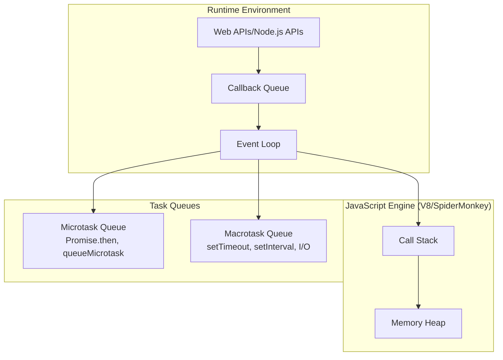
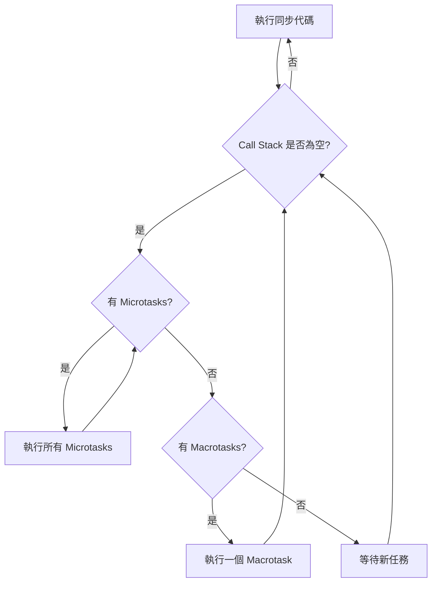
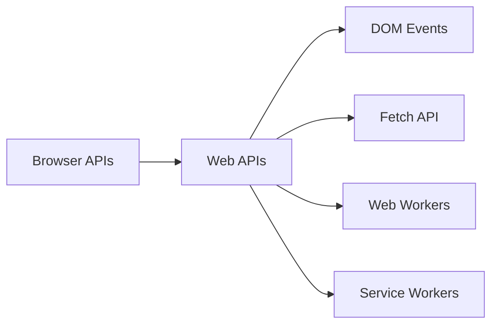
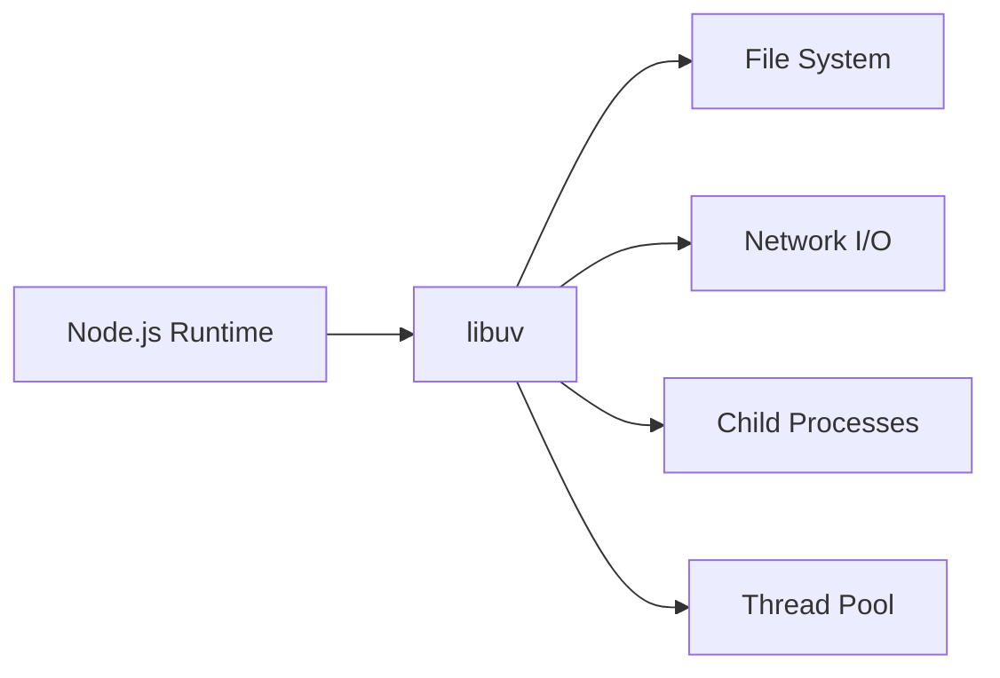
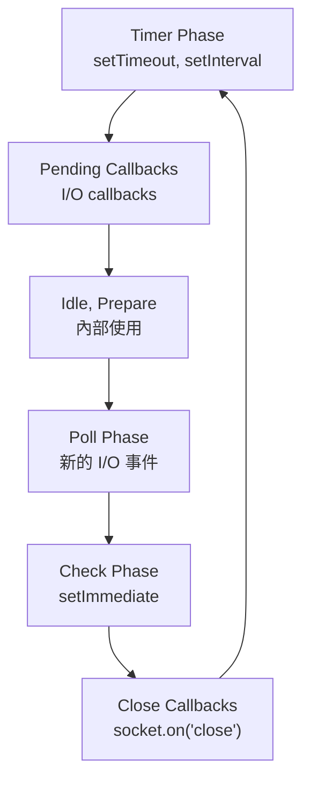

# JavaScript 運行時模型與事件循環

## 概述

JavaScript 採用單執行緒事件驅動模型，與 Go 的 goroutines、Rust 的 async/await、C++ 的多執行緒模型有根本性差異。理解這個模型對於後端工程師至關重要。

## JavaScript 引擎架構



### 與其他語言的比較

| 語言         | 併發模型                   | 執行緒模型         | 記憶體管理             |
| ---------- | ---------------------- | ------------- | ----------------- |
| JavaScript | Event Loop             | 單執行緒          | GC (Mark & Sweep) |
| Go         | Goroutines + Scheduler | M:N 模型        | GC (Tricolor)     |
| Rust       | async/await + Tokio    | Work Stealing | 零成本抽象             |
| C++        | std::thread/async      | 1:1 模型        | 手動管理              |

## 事件循環機制詳解

### 基本流程



### 任務優先級

1. **同步代碼** - 立即執行
2. **Microtasks** - Promise.then, queueMicrotask, MutationObserver
3. **Macrotasks** - setTimeout, setInterval, I/O, UI 渲染

```javascript
// 執行順序示例
console.log('1'); // 同步

setTimeout(() => console.log('2'), 0); // Macrotask

Promise.resolve().then(() => console.log('3')); // Microtask

queueMicrotask(() => console.log('4')); // Microtask

console.log('5'); // 同步

// 輸出: 1, 5, 3, 4, 2
```

## 瀏覽器 vs Node.js 運行時差異

### 瀏覽器環境



### Node.js 環境



### Event Loop 階段差異

**Node.js Event Loop 階段:**



## 效能考量與最佳實踐

### 1. 避免阻塞事件循環

```javascript
// ❌ 阻塞事件循環
function heavyComputation() {
    let result = 0;
    for (let i = 0; i < 10_000_000; i++) {
        result += Math.random();
    }
    return result;
}

// ✅ 使用 Worker Threads (Node.js)
const { Worker, isMainThread, parentPort } = require('worker_threads');

if (isMainThread) {
    const worker = new Worker(__filename);
    worker.postMessage('start');
    worker.on('message', (result) => {
        console.log('Result:', result);
    });
} else {
    parentPort.on('message', () => {
        const result = heavyComputation();
        parentPort.postMessage(result);
    });
}
```

### 2. 合理使用 Microtasks

```javascript
// ❌ 可能造成 Macrotask 飢餓
function recursiveMicrotask() {
    Promise.resolve().then(() => {
        console.log('Microtask');
        recursiveMicrotask(); // 無限遞迴
    });
}

// ✅ 使用 setTimeout 給其他任務機會
function balancedRecursion() {
    Promise.resolve().then(() => {
        console.log('Microtask');
        setTimeout(() => balancedRecursion(), 0);
    });
}
```

### 3. I/O 密集應用優化

```javascript
// Node.js 中的批量操作
const fs = require('fs').promises;

// ❌ 序列執行
async function readFilesSequential(files) {
    const results = [];
    for (const file of files) {
        results.push(await fs.readFile(file));
    }
    return results;
}

// ✅ 並行執行
async function readFilesConcurrent(files) {
    return Promise.all(files.map(file => fs.readFile(file)));
}

// ✅ 控制併發數量
async function readFilesWithLimit(files, limit = 10) {
    const results = [];
    for (let i = 0; i < files.length; i += limit) {
        const batch = files.slice(i, i + limit);
        const batchResults = await Promise.all(
            batch.map(file => fs.readFile(file))
        );
        results.push(...batchResults);
    }
    return results;
}
```

## 監控與除錯

### 1. 檢測事件循環延遲

```javascript
// Node.js 中監控 Event Loop Lag
const { performance } = require('perf_hooks');

function measureEventLoopLag() {
    const start = performance.now();
    setImmediate(() => {
        const lag = performance.now() - start;
        console.log(`Event Loop Lag: ${lag.toFixed(2)}ms`);
    });
}

setInterval(measureEventLoopLag, 1000);
```

### 2. 記憶體使用監控

```javascript
// 監控記憶體使用
function logMemoryUsage() {
    const usage = process.memoryUsage();
    console.log({
        rss: `${(usage.rss / 1024 / 1024).toFixed(2)} MB`,
        heapTotal: `${(usage.heapTotal / 1024 / 1024).toFixed(2)} MB`,
        heapUsed: `${(usage.heapUsed / 1024 / 1024).toFixed(2)} MB`,
        external: `${(usage.external / 1024 / 1024).toFixed(2)} MB`,
    });
}

setInterval(logMemoryUsage, 5000);
```

## 與後端架構整合

### 1. Express.js 中間件中的異步處理

```javascript
const express = require('express');
const app = express();

// ❌ 可能阻塞的中間件
app.use((req, res, next) => {
    // 同步的重計算
    const result = heavyComputation();
    req.computedValue = result;
    next();
});

// ✅ 非阻塞的中間件
app.use(async (req, res, next) => {
    try {
        // 使用 Worker 或外部服務
        req.computedValue = await computeAsync();
        next();
    } catch (error) {
        next(error);
    }
});
```

### 2. 資料庫連接池管理

```javascript
// 利用事件循環特性的連接池
class ConnectionPool {
    constructor(maxConnections = 10) {
        this.pool = [];
        this.waiting = [];
        this.maxConnections = maxConnections;
    }
    
    async getConnection() {
        if (this.pool.length > 0) {
            return this.pool.pop();
        }
        
        if (this.pool.length < this.maxConnections) {
            return this.createConnection();
        }
        
        // 等待連接可用
        return new Promise((resolve) => {
            this.waiting.push(resolve);
        });
    }
    
    releaseConnection(connection) {
        if (this.waiting.length > 0) {
            const resolve = this.waiting.shift();
            resolve(connection);
        } else {
            this.pool.push(connection);
        }
    }
}
```

## 總結

JavaScript 的事件循環模型提供了:

- **高 I/O 併發能力**: 適合處理大量並行請求
- **簡化的併發模型**: 避免了執行緒同步問題  
- **統一的異步編程**: Promise/async-await 模式
- **良好的可擴展性**: 特別適合微服務架構

對於後端工程師而言，理解這個模型有助於:
- 設計高效的 API 服務
- 避免效能陷阱
- 合理利用 JavaScript 的併發優勢
- 與其他技術棧進行架構決策對比