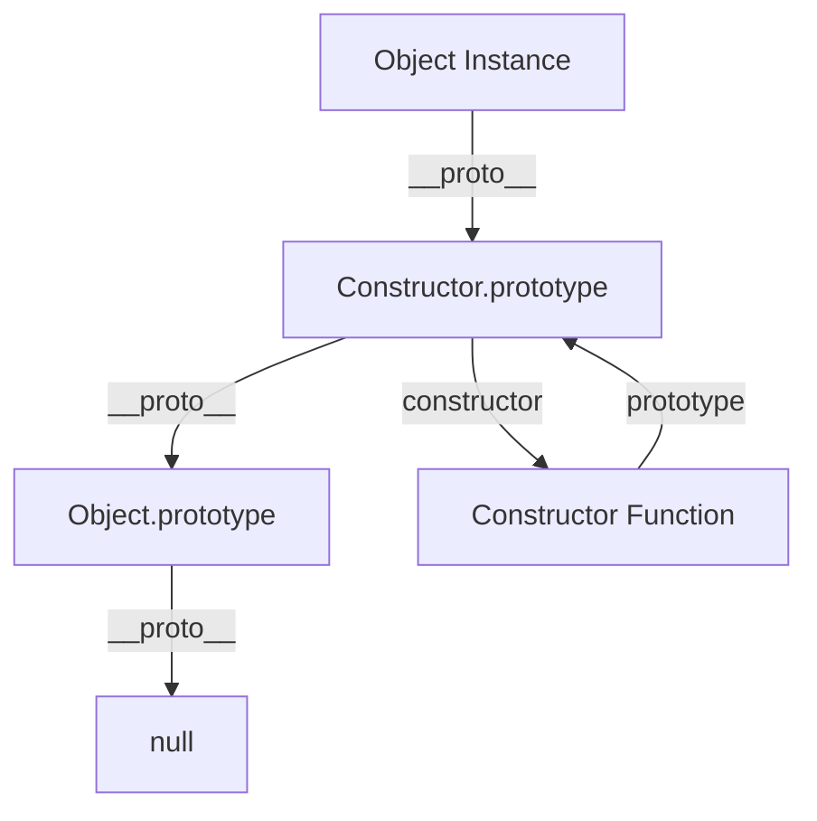

# 原型鏈與物件系統

## 概述

JavaScript 採用原型繼承 (Prototypal Inheritance) 而非類別繼承，這與 C++/Java 的 class-based 繼承、Rust 的 trait system 有根本差異。理解原型鏈對於設計高效能的 JavaScript 應用至關重要。

## 原型系統基礎

### 原型鏈結構



### 與其他語言的比較

| 語言 | 繼承模型 | 方法分派 | 記憶體效率 |
|------|----------|----------|------------|
| JavaScript | 原型鏈 | 動態查找 | 共享方法 |
| C++ | 類別繼承 | vtable | 編譯時優化 |
| Rust | Trait 系統 | 靜態分派 | 零成本抽象 |
| Go | 嵌入結構 | 介面滿足 | 編譯時檢查 |

## 物件創建模式

### 1. 構造函數模式

```javascript
// 基本構造函數
function User(name, email) {
    this.name = name;
    this.email = email;
}

// 方法添加到原型以節省記憶體
User.prototype.getName = function() {
    return this.name;
};

User.prototype.setEmail = function(email) {
    this.email = email;
};

// 使用
const user = new User('John', 'john@example.com');
console.log(user.getName()); // 'John'
```

### 2. Class 語法糖 (ES6+)

```javascript
class User {
    constructor(name, email) {
        this.name = name;
        this.email = email;
    }
    
    getName() {
        return this.name;
    }
    
    setEmail(email) {
        this.email = email;
    }
    
    // 靜態方法
    static fromJSON(json) {
        return new User(json.name, json.email);
    }
}

// 私有欄位 (ES2022)
class UserWithPrivates {
    #id;
    #createdAt;
    
    constructor(name, email) {
        this.name = name;
        this.email = email;
        this.#id = Math.random().toString(36);
        this.#createdAt = new Date();
    }
    
    getId() {
        return this.#id;
    }
}
```

### 3. 工廠模式

```javascript
// 高效能工廠模式
const UserFactory = (() => {
    // 共享的原型對象
    const userPrototype = {
        getName() {
            return this.name;
        },
        setEmail(email) {
            this.email = email;
        },
        toJSON() {
            return {
                name: this.name,
                email: this.email
            };
        }
    };
    
    return {
        create(name, email) {
            const user = Object.create(userPrototype);
            user.name = name;
            user.email = email;
            return user;
        },
        
        // 批量創建優化
        createBatch(users) {
            return users.map(({name, email}) => 
                this.create(name, email)
            );
        }
    };
})();
```

## 繼承模式詳解

### 1. 原型鏈繼承

```javascript
// 基類
function Animal(name) {
    this.name = name;
    this.species = 'Unknown';
}

Animal.prototype.speak = function() {
    return `${this.name} makes a sound`;
};

Animal.prototype.getInfo = function() {
    return `${this.name} is a ${this.species}`;
};

// 派生類
function Dog(name, breed) {
    Animal.call(this, name); // 調用父類構造函數
    this.species = 'Canine';
    this.breed = breed;
}

// 設置原型鏈
Dog.prototype = Object.create(Animal.prototype);
Dog.prototype.constructor = Dog;

// 重寫方法
Dog.prototype.speak = function() {
    return `${this.name} barks`;
};

// 添加新方法
Dog.prototype.fetch = function() {
    return `${this.name} fetches the ball`;
};
```

### 2. Mixin 模式

```javascript
// Mixin 功能模組
const Trackable = {
    track(event, data) {
        this.events = this.events || [];
        this.events.push({
            event,
            data,
            timestamp: Date.now()
        });
    },
    
    getEvents() {
        return this.events || [];
    }
};

const Cacheable = {
    cache: new Map(),
    
    getCached(key) {
        return this.cache.get(key);
    },
    
    setCached(key, value) {
        this.cache.set(key, value);
    }
};

// 應用多個 Mixins
function APIClient(baseURL) {
    this.baseURL = baseURL;
}

// 混合多個功能
Object.assign(APIClient.prototype, Trackable, Cacheable);

APIClient.prototype.request = async function(endpoint, options) {
    const cacheKey = `${endpoint}:${JSON.stringify(options)}`;
    
    // 檢查快取
    let response = this.getCached(cacheKey);
    if (response) {
        this.track('cache_hit', { endpoint });
        return response;
    }
    
    // 發起請求
    response = await fetch(`${this.baseURL}${endpoint}`, options);
    this.setCached(cacheKey, response);
    this.track('api_request', { endpoint, status: response.status });
    
    return response;
};
```

## 效能優化技巧

### 1. 避免原型污染

```javascript
// ❌ 原型污染
Object.prototype.customMethod = function() {
    return 'polluted';
};

// 影響所有物件
const obj = {};
console.log(obj.customMethod()); // 'polluted'

// ✅ 使用專用原型
const CustomPrototype = {
    customMethod() {
        return 'clean';
    }
};

function createCustomObject(data) {
    const obj = Object.create(CustomPrototype);
    return Object.assign(obj, data);
}
```

### 2. 屬性查找優化

```javascript
// ❌ 深層原型鏈查找
function SlowClass() {}
SlowClass.prototype.level1 = {};
SlowClass.prototype.level1.level2 = {};
SlowClass.prototype.level1.level2.method = function() {
    return 'slow';
};

// ✅ 扁平化結構
function FastClass() {}
FastClass.prototype.method = function() {
    return 'fast';
};

// 效能測試
function benchmark() {
    const slow = new SlowClass();
    const fast = new FastClass();
    
    console.time('slow');
    for (let i = 0; i < 1_000_000; i++) {
        slow.level1.level2.method();
    }
    console.timeEnd('slow');
    
    console.time('fast');
    for (let i = 0; i < 1_000_000; i++) {
        fast.method();
    }
    console.timeEnd('fast');
}
```

### 3. 方法綁定優化

```javascript
class EventEmitter {
    constructor() {
        this.listeners = new Map();
        
        // ❌ 每次創建新函數
        // this.on = this.on.bind(this);
        
        // ✅ 使用箭頭函數
        this.on = (event, callback) => {
            if (!this.listeners.has(event)) {
                this.listeners.set(event, []);
            }
            this.listeners.get(event).push(callback);
        };
    }
    
    emit(event, ...args) {
        const callbacks = this.listeners.get(event);
        if (callbacks) {
            callbacks.forEach(callback => callback(...args));
        }
    }
}
```

## 記憶體管理與垃圾回收

### 1. 避免記憶體洩漏

```javascript
// ❌ 潛在記憶體洩漏
class DataProcessor {
    constructor() {
        this.cache = new Map();
        this.timers = [];
    }
    
    process(data) {
        // 快取永遠不會清理
        this.cache.set(data.id, data);
        
        // 定時器引用不會被清理
        const timer = setInterval(() => {
            this.processData(data);
        }, 1000);
        this.timers.push(timer);
    }
}

// ✅ 正確的記憶體管理
class DataProcessor {
    constructor() {
        this.cache = new Map();
        this.timers = new Map();
        this.maxCacheSize = 1000;
    }
    
    process(data) {
        // LRU 快取管理
        if (this.cache.size >= this.maxCacheSize) {
            const firstKey = this.cache.keys().next().value;
            this.cache.delete(firstKey);
        }
        this.cache.set(data.id, data);
        
        // 可清理的定時器
        const timer = setInterval(() => {
            this.processData(data);
        }, 1000);
        this.timers.set(data.id, timer);
    }
    
    cleanup(dataId) {
        this.cache.delete(dataId);
        const timer = this.timers.get(dataId);
        if (timer) {
            clearInterval(timer);
            this.timers.delete(dataId);
        }
    }
    
    destroy() {
        this.cache.clear();
        this.timers.forEach(timer => clearInterval(timer));
        this.timers.clear();
    }
}
```

### 2. WeakMap 與 WeakSet 的使用

```javascript
// 私有資料存儲
const privateData = new WeakMap();

class User {
    constructor(name, email, password) {
        this.name = name;
        this.email = email;
        
        // 私有資料，不會阻止 GC
        privateData.set(this, {
            password: password,
            loginAttempts: 0,
            lastLogin: null
        });
    }
    
    authenticate(password) {
        const data = privateData.get(this);
        if (data.password === password) {
            data.lastLogin = new Date();
            data.loginAttempts = 0;
            return true;
        }
        data.loginAttempts++;
        return false;
    }
    
    getLoginInfo() {
        const data = privateData.get(this);
        return {
            lastLogin: data.lastLogin,
            failedAttempts: data.loginAttempts
        };
    }
}
```

## 高級模式與架構應用

### 1. 代理模式 (Proxy)

```javascript
// 資料庫連接代理
class DatabaseProxy {
    constructor(database) {
        this.database = database;
        this.cache = new Map();
        
        return new Proxy(this, {
            get(target, property) {
                // 攔截方法調用
                if (typeof target.database[property] === 'function') {
                    return (...args) => {
                        const cacheKey = `${property}:${JSON.stringify(args)}`;
                        
                        if (target.cache.has(cacheKey)) {
                            console.log(`Cache hit for ${property}`);
                            return target.cache.get(cacheKey);
                        }
                        
                        const result = target.database[property](...args);
                        target.cache.set(cacheKey, result);
                        return result;
                    };
                }
                
                return target[property];
            }
        });
    }
}

// 使用代理
const db = new DatabaseProxy({
    findUser(id) {
        console.log(`Querying database for user ${id}`);
        return { id, name: `User ${id}` };
    }
});

console.log(db.findUser(1)); // 查詢資料庫
console.log(db.findUser(1)); // 使用快取
```

### 2. 觀察者模式與事件系統

```javascript
class EventSystem {
    constructor() {
        this.listeners = new Map();
        this.onceListeners = new Map();
        this.maxListeners = 10;
    }
    
    on(event, callback) {
        this._addListener(this.listeners, event, callback);
        return this;
    }
    
    once(event, callback) {
        this._addListener(this.onceListeners, event, callback);
        return this;
    }
    
    emit(event, ...args) {
        // 處理普通監聽器
        this._emitToListeners(this.listeners, event, args);
        
        // 處理一次性監聽器
        this._emitToListeners(this.onceListeners, event, args);
        this.onceListeners.delete(event);
        
        return this;
    }
    
    _addListener(map, event, callback) {
        if (!map.has(event)) {
            map.set(event, []);
        }
        
        const listeners = map.get(event);
        if (listeners.length >= this.maxListeners) {
            console.warn(`MaxListeners exceeded for event: ${event}`);
        }
        
        listeners.push(callback);
    }
    
    _emitToListeners(map, event, args) {
        const listeners = map.get(event);
        if (listeners) {
            listeners.forEach(callback => {
                try {
                    callback(...args);
                } catch (error) {
                    console.error(`Error in event listener for ${event}:`, error);
                }
            });
        }
    }
}
```

## 與 TypeScript 整合

### 1. 類型安全的繼承

```typescript
// 基類定義
abstract class Entity<T = {}> {
    protected readonly id: string;
    protected readonly createdAt: Date;
    protected data: T;
    
    constructor(data: T) {
        this.id = crypto.randomUUID();
        this.createdAt = new Date();
        this.data = data;
    }
    
    abstract validate(): boolean;
    abstract serialize(): Record<string, unknown>;
    
    getId(): string {
        return this.id;
    }
    
    getCreatedAt(): Date {
        return this.createdAt;
    }
}

// 具體實現
interface UserData {
    name: string;
    email: string;
    role: 'admin' | 'user';
}

class User extends Entity<UserData> {
    validate(): boolean {
        return (
            typeof this.data.name === 'string' &&
            this.data.name.length > 0 &&
            /\S+@\S+\.\S+/.test(this.data.email)
        );
    }
    
    serialize(): Record<string, unknown> {
        return {
            id: this.getId(),
            createdAt: this.getCreatedAt(),
            ...this.data
        };
    }
    
    hasAdminRole(): boolean {
        return this.data.role === 'admin';
    }
}
```

## 總結

JavaScript 的原型系統提供了:

- **靈活的繼承機制**: 運行時動態修改原型鏈
- **記憶體效率**: 方法共享減少記憶體佔用
- **組合模式支持**: Mixin 和多重繼承模擬
- **動態特性**: 可在運行時修改物件行為

對於後端工程師的關鍵要點:
- 理解原型鏈查找的效能影響
- 合理使用繼承避免深層原型鏈
- 善用 WeakMap/WeakSet 管理私有資料
- 在 TypeScript 中利用類型系統增強安全性