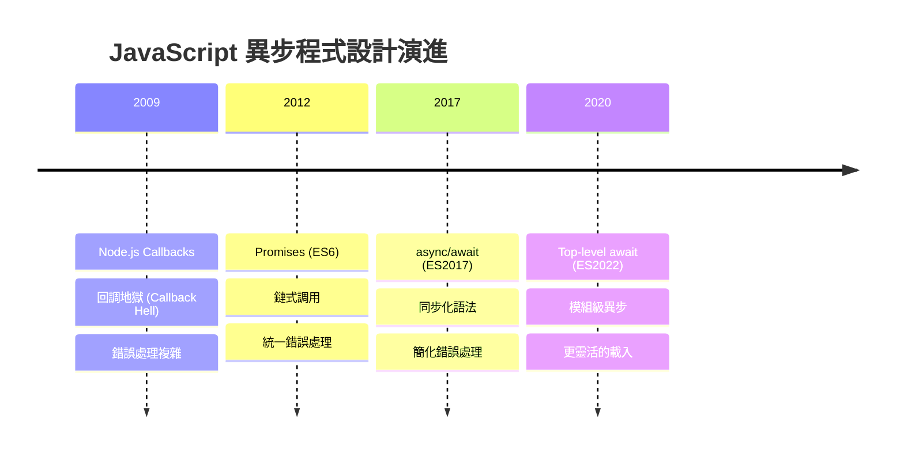
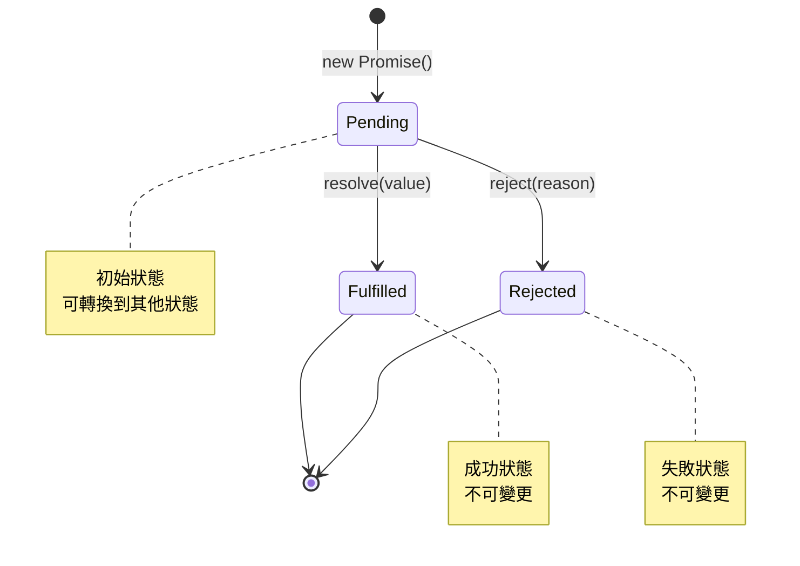

# 異步程式設計模型

## 概述

JavaScript 的異步程式設計經歷了 Callbacks → Promises → async/await 的演進。相比其他語言的併發模型，JavaScript 提供了統一的異步抽象，但也有其特殊性和陷阱。

## 異步模型演進

### 語言比較表

| 語言 | 異步模型 | 語法 | 錯誤處理 | 併發原語 |
|------|----------|------|----------|----------|
| JavaScript | Event Loop + Promises | async/await | try/catch + .catch() | Promise.all/race |
| Rust | Future + Tokio | async/await | Result<T, E> | join!/select! |
| Go | Goroutines + Channels | go routines | error return | sync.WaitGroup |
| C++ | std::future/coroutines | co_await | exceptions | std::async |

### 演進歷程



## Promise 深度解析

### Promise 狀態機



### Promise 實現原理

```javascript
// 簡化的 Promise 實現
class MyPromise {
    constructor(executor) {
        this.state = 'pending';
        this.value = undefined;
        this.reason = undefined;
        this.onFulfilledCallbacks = [];
        this.onRejectedCallbacks = [];
        
        const resolve = (value) => {
            if (this.state === 'pending') {
                this.state = 'fulfilled';
                this.value = value;
                this.onFulfilledCallbacks.forEach(fn => fn(value));
            }
        };
        
        const reject = (reason) => {
            if (this.state === 'pending') {
                this.state = 'rejected';
                this.reason = reason;
                this.onRejectedCallbacks.forEach(fn => fn(reason));
            }
        };
        
        try {
            executor(resolve, reject);
        } catch (error) {
            reject(error);
        }
    }
    
    then(onFulfilled, onRejected) {
        return new MyPromise((resolve, reject) => {
            if (this.state === 'fulfilled') {
                setTimeout(() => {
                    try {
                        const result = onFulfilled ? onFulfilled(this.value) : this.value;
                        resolve(result);
                    } catch (error) {
                        reject(error);
                    }
                });
            } else if (this.state === 'rejected') {
                setTimeout(() => {
                    try {
                        const result = onRejected ? onRejected(this.reason) : this.reason;
                        resolve(result);
                    } catch (error) {
                        reject(error);
                    }
                });
            } else {
                this.onFulfilledCallbacks.push((value) => {
                    try {
                        const result = onFulfilled ? onFulfilled(value) : value;
                        resolve(result);
                    } catch (error) {
                        reject(error);
                    }
                });
                
                this.onRejectedCallbacks.push((reason) => {
                    try {
                        const result = onRejected ? onRejected(reason) : reason;
                        resolve(result);
                    } catch (error) {
                        reject(error);
                    }
                });
            }
        });
    }
}
```

## 高級異步模式

### 1. 並行執行控制

```javascript
// 併發限制器
class ConcurrencyLimiter {
    constructor(limit) {
        this.limit = limit;
        this.running = 0;
        this.queue = [];
    }
    
    async add(task) {
        return new Promise((resolve, reject) => {
            this.queue.push({
                task,
                resolve,
                reject
            });
            this.process();
        });
    }
    
    async process() {
        if (this.running >= this.limit || this.queue.length === 0) {
            return;
        }
        
        this.running++;
        const { task, resolve, reject } = this.queue.shift();
        
        try {
            const result = await task();
            resolve(result);
        } catch (error) {
            reject(error);
        } finally {
            this.running--;
            this.process();
        }
    }
}

// 使用示例
const limiter = new ConcurrencyLimiter(3);

async function fetchWithLimit(url) {
    return limiter.add(() => fetch(url));
}

// 批量請求但限制併發數
const urls = Array.from({length: 100}, (_, i) => `https://api.example.com/data/${i}`);
const results = await Promise.all(urls.map(url => fetchWithLimit(url)));
```

### 2. 可取消的異步操作

```javascript
class CancellableOperation {
    constructor() {
        this.cancelled = false;
        this.onCancel = new Set();
    }
    
    cancel() {
        if (this.cancelled) return;
        
        this.cancelled = true;
        this.onCancel.forEach(callback => callback());
        this.onCancel.clear();
    }
    
    isCancelled() {
        return this.cancelled;
    }
    
    throwIfCancelled() {
        if (this.cancelled) {
            throw new Error('Operation was cancelled');
        }
    }
    
    onCancelRequested(callback) {
        if (this.cancelled) {
            callback();
        } else {
            this.onCancel.add(callback);
        }
    }
}

// 可取消的 fetch
function cancellableFetch(url, options = {}) {
    const operation = new CancellableOperation();
    const controller = new AbortController();
    
    operation.onCancelRequested(() => {
        controller.abort();
    });
    
    const promise = fetch(url, {
        ...options,
        signal: controller.signal
    }).then(response => {
        operation.throwIfCancelled();
        return response;
    });
    
    return { promise, operation };
}

// 使用
const { promise, operation } = cancellableFetch('https://api.example.com/data');

// 5 秒後取消
setTimeout(() => operation.cancel(), 5000);

try {
    const response = await promise;
    console.log('Request completed:', response);
} catch (error) {
    if (error.message === 'Operation was cancelled') {
        console.log('Request was cancelled');
    } else {
        console.error('Request failed:', error);
    }
}
```

### 3. 重試機制

```javascript
// 指數退避重試
async function retryWithBackoff(fn, maxRetries = 3, baseDelay = 1000) {
    let lastError;
    
    for (let attempt = 0; attempt <= maxRetries; attempt++) {
        try {
            return await fn();
        } catch (error) {
            lastError = error;
            
            if (attempt === maxRetries) {
                throw error;
            }
            
            // 指數退避延遲
            const delay = baseDelay * Math.pow(2, attempt);
            const jitter = Math.random() * 0.1 * delay; // 添加抖動
            
            console.log(`Attempt ${attempt + 1} failed, retrying in ${delay + jitter}ms...`);
            await new Promise(resolve => setTimeout(resolve, delay + jitter));
        }
    }
    
    throw lastError;
}

// 條件重試
async function retryWithCondition(fn, shouldRetry, maxRetries = 3) {
    let lastError;
    
    for (let attempt = 0; attempt <= maxRetries; attempt++) {
        try {
            return await fn();
        } catch (error) {
            lastError = error;
            
            if (attempt === maxRetries || !shouldRetry(error)) {
                throw error;
            }
            
            console.log(`Retrying due to: ${error.message}`);
        }
    }
    
    throw lastError;
}

// 使用示例
async function unreliableAPICall() {
    const response = await retryWithBackoff(
        () => fetch('https://unreliable-api.com/data'),
        3,
        1000
    );
    return response.json();
}

// 只對特定錯誤重試
async function conditionalRetry() {
    return retryWithCondition(
        () => databaseQuery(),
        (error) => error.code === 'ECONNRESET' || error.code === 'TIMEOUT',
        5
    );
}
```

## 錯誤處理策略

### 1. 統一錯誤處理

```javascript
// 錯誤類型定義
class APIError extends Error {
    constructor(message, status, code) {
        super(message);
        this.name = 'APIError';
        this.status = status;
        this.code = code;
    }
}

class NetworkError extends Error {
    constructor(message, originalError) {
        super(message);
        this.name = 'NetworkError';
        this.originalError = originalError;
    }
}

// 錯誤處理中間件
class ErrorHandler {
    constructor() {
        this.handlers = new Map();
    }
    
    register(errorType, handler) {
        this.handlers.set(errorType, handler);
    }
    
    async handle(error) {
        const handler = this.handlers.get(error.constructor);
        if (handler) {
            return handler(error);
        }
        
        // 預設處理
        console.error('Unhandled error:', error);
        throw error;
    }
}

// 全域錯誤處理器
const errorHandler = new ErrorHandler();

errorHandler.register(APIError, (error) => {
    console.log(`API Error [${error.status}]: ${error.message}`);
    // 記錄到監控系統
    if (error.status >= 500) {
        // 伺服器錯誤，需要告警
        alerting.notify('API_SERVER_ERROR', error);
    }
});

errorHandler.register(NetworkError, (error) => {
    console.log(`Network Error: ${error.message}`);
    // 可能需要重試
    return { shouldRetry: true, delay: 5000 };
});

// 包裝異步函數以統一處理錯誤
function withErrorHandling(fn) {
    return async (...args) => {
        try {
            return await fn(...args);
        } catch (error) {
            return errorHandler.handle(error);
        }
    };
}
```

### 2. Promise 錯誤傳播

```javascript
// 錯誤邊界模式
class AsyncErrorBoundary {
    constructor() {
        this.errorCallbacks = [];
    }
    
    onError(callback) {
        this.errorCallbacks.push(callback);
    }
    
    async execute(asyncFn) {
        try {
            return await asyncFn();
        } catch (error) {
            // 通知所有錯誤處理器
            this.errorCallbacks.forEach(callback => {
                try {
                    callback(error);
                } catch (handlerError) {
                    console.error('Error in error handler:', handlerError);
                }
            });
            
            throw error; // 重新拋出以保持錯誤傳播
        }
    }
}

// 使用
const boundary = new AsyncErrorBoundary();

boundary.onError((error) => {
    console.log('Logging error:', error.message);
});

boundary.onError((error) => {
    // 發送錯誤到監控服務
    monitoring.logError(error);
});

await boundary.execute(async () => {
    const data = await fetchUserData();
    return processData(data);
});
```

## 效能優化

### 1. 避免異步反模式

```javascript
// ❌ 串行執行獨立任務
async function badParallelExecution() {
    const user = await fetchUser();
    const posts = await fetchPosts();
    const comments = await fetchComments();
    
    return { user, posts, comments };
}

// ✅ 並行執行獨立任務
async function goodParallelExecution() {
    const [user, posts, comments] = await Promise.all([
        fetchUser(),
        fetchPosts(),
        fetchComments()
    ]);
    
    return { user, posts, comments };
}

// ❌ 在循環中使用 await
async function badLoopHandling(items) {
    const results = [];
    for (const item of items) {
        results.push(await processItem(item));
    }
    return results;
}

// ✅ 正確的並行處理
async function goodLoopHandling(items) {
    return Promise.all(items.map(item => processItem(item)));
}

// ✅ 批量處理大量項目
async function batchProcessing(items, batchSize = 10) {
    const results = [];
    
    for (let i = 0; i < items.length; i += batchSize) {
        const batch = items.slice(i, i + batchSize);
        const batchResults = await Promise.all(
            batch.map(item => processItem(item))
        );
        results.push(...batchResults);
        
        // 可選：批次間暫停以避免過載
        if (i + batchSize < items.length) {
            await new Promise(resolve => setTimeout(resolve, 100));
        }
    }
    
    return results;
}
```

### 2. 記憶體效率優化

```javascript
// 流式處理大型資料集
async function* processLargeDataset(dataSource) {
    for await (const chunk of dataSource) {
        // 處理每個資料塊
        const processedChunk = await processChunk(chunk);
        yield processedChunk;
        
        // 釋放記憶體的機會
        if (global.gc) {
            global.gc();
        }
    }
}

// 使用異步迭代器
async function handleLargeDataset() {
    const dataSource = createDataSource();
    
    for await (const processedChunk of processLargeDataset(dataSource)) {
        // 逐塊處理，不會累積大量記憶體
        await saveToDatabase(processedChunk);
    }
}

// 背壓控制
class BackpressureStream {
    constructor(maxQueueSize = 100) {
        this.queue = [];
        this.maxQueueSize = maxQueueSize;
        this.processing = false;
    }
    
    async push(item) {
        // 如果佇列滿了，等待
        while (this.queue.length >= this.maxQueueSize) {
            await new Promise(resolve => setTimeout(resolve, 10));
        }
        
        this.queue.push(item);
        this.process();
    }
    
    async process() {
        if (this.processing || this.queue.length === 0) {
            return;
        }
        
        this.processing = true;
        
        while (this.queue.length > 0) {
            const item = this.queue.shift();
            await this.processItem(item);
        }
        
        this.processing = false;
    }
    
    async processItem(item) {
        // 實際處理邏輯
        return new Promise(resolve => {
            setTimeout(() => {
                console.log('Processed:', item);
                resolve();
            }, Math.random() * 100);
        });
    }
}
```

## 與後端架構整合

### 1. 資料庫連接池異步管理

```javascript
class AsyncConnectionPool {
    constructor(createConnection, maxConnections = 10) {
        this.createConnection = createConnection;
        this.maxConnections = maxConnections;
        this.connections = [];
        this.waitingQueue = [];
        this.activeConnections = 0;
    }
    
    async getConnection() {
        // 如果有可用連接，直接返回
        if (this.connections.length > 0) {
            return this.connections.pop();
        }
        
        // 如果可以創建新連接
        if (this.activeConnections < this.maxConnections) {
            this.activeConnections++;
            try {
                return await this.createConnection();
            } catch (error) {
                this.activeConnections--;
                throw error;
            }
        }
        
        // 等待連接可用
        return new Promise((resolve, reject) => {
            const timeout = setTimeout(() => {
                const index = this.waitingQueue.findIndex(item => item.resolve === resolve);
                if (index !== -1) {
                    this.waitingQueue.splice(index, 1);
                    reject(new Error('Connection timeout'));
                }
            }, 30000); // 30秒超時
            
            this.waitingQueue.push({ resolve, reject, timeout });
        });
    }
    
    releaseConnection(connection) {
        if (this.waitingQueue.length > 0) {
            const { resolve, timeout } = this.waitingQueue.shift();
            clearTimeout(timeout);
            resolve(connection);
        } else {
            this.connections.push(connection);
        }
    }
    
    async withConnection(fn) {
        const connection = await this.getConnection();
        try {
            return await fn(connection);
        } finally {
            this.releaseConnection(connection);
        }
    }
}
```

### 2. 服務間通信異步模式

```javascript
// 微服務通信層
class ServiceCommunicator {
    constructor() {
        this.services = new Map();
        this.circuitBreakers = new Map();
    }
    
    registerService(name, baseURL, options = {}) {
        this.services.set(name, {
            baseURL,
            timeout: options.timeout || 5000,
            retries: options.retries || 3
        });
        
        this.circuitBreakers.set(name, new CircuitBreaker({
            timeout: options.timeout || 5000,
            errorThresholdPercentage: 50,
            resetTimeout: 30000
        }));
    }
    
    async call(serviceName, endpoint, options = {}) {
        const service = this.services.get(serviceName);
        if (!service) {
            throw new Error(`Service ${serviceName} not registered`);
        }
        
        const circuitBreaker = this.circuitBreakers.get(serviceName);
        
        return circuitBreaker.fire(async () => {
            return retryWithBackoff(
                () => this.makeRequest(service, endpoint, options),
                service.retries
            );
        });
    }
    
    async makeRequest(service, endpoint, options) {
        const controller = new AbortController();
        const timeoutId = setTimeout(() => controller.abort(), service.timeout);
        
        try {
            const response = await fetch(`${service.baseURL}${endpoint}`, {
                ...options,
                signal: controller.signal
            });
            
            if (!response.ok) {
                throw new APIError(
                    `HTTP ${response.status}: ${response.statusText}`,
                    response.status
                );
            }
            
            return response.json();
        } finally {
            clearTimeout(timeoutId);
        }
    }
}

// 熔斷器實現
class CircuitBreaker {
    constructor(options) {
        this.timeout = options.timeout;
        this.errorThresholdPercentage = options.errorThresholdPercentage;
        this.resetTimeout = options.resetTimeout;
        
        this.state = 'CLOSED'; // CLOSED, OPEN, HALF_OPEN
        this.failureCount = 0;
        this.successCount = 0;
        this.nextAttempt = Date.now();
    }
    
    async fire(fn) {
        if (this.state === 'OPEN') {
            if (Date.now() < this.nextAttempt) {
                throw new Error('Circuit breaker is OPEN');
            }
            this.state = 'HALF_OPEN';
        }
        
        try {
            const result = await fn();
            this.onSuccess();
            return result;
        } catch (error) {
            this.onFailure();
            throw error;
        }
    }
    
    onSuccess() {
        this.failureCount = 0;
        if (this.state === 'HALF_OPEN') {
            this.state = 'CLOSED';
        }
        this.successCount++;
    }
    
    onFailure() {
        this.failureCount++;
        const total = this.failureCount + this.successCount;
        const errorPercentage = (this.failureCount / total) * 100;
        
        if (errorPercentage >= this.errorThresholdPercentage) {
            this.state = 'OPEN';
            this.nextAttempt = Date.now() + this.resetTimeout;
        }
    }
}
```

## 總結

JavaScript 異步程式設計的關鍵特點:

- **統一的 Promise 抽象**: 提供一致的異步操作介面
- **事件循環整合**: 與單執行緒模型完美結合
- **豐富的併發控制**: Promise.all/race 等內建工具
- **錯誤處理機制**: try/catch 和 .catch() 雙重選擇

對於後端工程師的最佳實踐:
- 理解 Promise 內部機制避免反模式
- 合理使用並行處理提升效能
- 實現robust的錯誤處理和重試機制
- 在微服務架構中善用異步通信模式