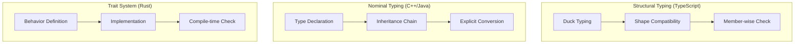

# TypeScript 核心型別系統

## 概述

TypeScript 採用結構化型別系統 (Structural Typing)，與 C++/Java 的名義型別系統 (Nominal Typing) 和 Rust 的 trait 系統有顯著差異。對於後端工程師而言，理解這些差異是建構大型應用的關鍵。

## 型別系統比較

### 型別系統對比

| 語言         | 型別系統                    | 型別檢查    | 型別推斷 | 泛型支援       |
| ---------- | ----------------------- | ------- | ---- | ---------- |
| TypeScript | 結構化                     | 靜態 + 漸進 | 強大   | 高級         |
| Rust       | Nominal + Traits        | 靜態      | 強大   | 零成本抽象      |
| C++        | Nominal                 | 靜態      | 基礎   | 模板系統       |
| Go         | Structural (interfaces) | 靜態      | 基礎   | 泛型 (1.18+) |

### 結構化 vs 名義型別



## 基礎型別深度解析

### 原始型別與包裝類型

```typescript
// 原始型別
let str: string = "hello";
let num: number = 42;
let bool: boolean = true;
let sym: symbol = Symbol("key");
let big: bigint = 100n;

// 包裝類型 (避免使用)
let strObj: String = new String("hello"); // ❌
let numObj: Number = new Number(42);      // ❌

// 型別相容性
function processString(s: string) {
  return s.toUpperCase();
}

processString(str);    // ✅ 原始型別
processString(strObj); // ✅ 結構相容，但不推薦

// null 和 undefined 的細微差別
let nullValue: null = null;
let undefinedValue: undefined = undefined;

// 在 strictNullChecks 下
function handleOptional(value: string | null | undefined) {
  if (value == null) {
    // 同時處理 null 和 undefined
    return "empty";
  }
  return value.toUpperCase(); // TypeScript 知道這裡 value 是 string
}
```

### 聯合型別與交集型別

```typescript
// 聯合型別 (Union Types)
type ID = string | number;
type Status = "pending" | "approved" | "rejected";

function processID(id: ID): string {
  if (typeof id === "string") {
    return id.toUpperCase(); // 型別縮窄
  }
  return id.toString(); // 這裡 id 是 number
}

// 交集型別 (Intersection Types)
interface User {
  id: string;
  name: string;
}

interface Timestamps {
  createdAt: Date;
  updatedAt: Date;
}

type UserWithTimestamps = User & Timestamps;

const user: UserWithTimestamps = {
  id: "123",
  name: "John",
  createdAt: new Date(),
  updatedAt: new Date()
};

// 複雜交集型別
interface APIResponse {
  status: number;
  message: string;
}

interface DataResponse<T> {
  data: T;
}

interface PaginationResponse {
  page: number;
  limit: number;
  total: number;
}

type PaginatedAPIResponse<T> = APIResponse & DataResponse<T[]> & PaginationResponse;

// 使用
async function fetchUsers(): Promise<PaginatedAPIResponse<User>> {
  const response = await fetch('/api/users');
  return response.json();
}
```

## 泛型系統

### 基礎泛型模式

```typescript
// 基礎泛型函數
function identity<T>(arg: T): T {
  return arg;
}

// 泛型約束
interface Lengthwise {
  length: number;
}

function loggingIdentity<T extends Lengthwise>(arg: T): T {
  console.log(arg.length); // 現在知道 arg 有 length 屬性
  return arg;
}

// 多重泛型參數
function pair<T, U>(first: T, second: U): [T, U] {
  return [first, second];
}

// 泛型類別
class GenericRepository<T, K = string> {
  private items = new Map<K, T>();
  
  save(key: K, item: T): void {
    this.items.set(key, item);
  }
  
  findById(key: K): T | undefined {
    return this.items.get(key);
  }
  
  findAll(): T[] {
    return Array.from(this.items.values());
  }
  
  findBy<P extends keyof T>(property: P, value: T[P]): T[] {
    return this.findAll().filter(item => item[property] === value);
  }
}

// 使用
interface Product {
  id: string;
  name: string;
  price: number;
  category: string;
}

const productRepo = new GenericRepository<Product>();
productRepo.save("1", { id: "1", name: "Laptop", price: 999, category: "Electronics" });

// 型別安全的查詢
const laptops = productRepo.findBy("category", "Electronics"); // T[P] 確保型別匹配
```

### 高級泛型模式

```typescript
// 條件型別基礎
type NonNullable<T> = T extends null | undefined ? never : T;

// 分布式條件型別
type ToArray<T> = T extends any ? T[] : never;
type Example = ToArray<string | number>; // string[] | number[]

// infer 關鍵字
type ReturnType<T> = T extends (...args: any[]) => infer R ? R : never;
type Parameters<T> = T extends (...args: infer P) => any ? P : never;

// 實用示例：提取 Promise 的解析型別
type Awaited<T> = T extends Promise<infer U> ? U : T;

async function fetchData(): Promise<{ users: User[] }> {
  // 實現...
  return { users: [] };
}

type FetchDataResult = Awaited<ReturnType<typeof fetchData>>; // { users: User[] }

// 遞歸條件型別
type DeepReadonly<T> = {
  readonly [P in keyof T]: T[P] extends object ? DeepReadonly<T[P]> : T[P];
};

interface Config {
  database: {
    host: string;
    port: number;
    credentials: {
      username: string;
      password: string;
    };
  };
}

type ReadonlyConfig = DeepReadonly<Config>;
// 所有嵌套屬性都變為 readonly
```

## 進階型別工具

### 映射型別 (Mapped Types)

```typescript
// 內建工具型別的實現
type MyPartial<T> = {
  [P in keyof T]?: T[P];
};

type MyRequired<T> = {
  [P in keyof T]-?: T[P];
};

type MyReadonly<T> = {
  readonly [P in keyof T]: T[P];
};

type MyPick<T, K extends keyof T> = {
  [P in K]: T[P];
};

type MyOmit<T, K extends keyof T> = {
  [P in Exclude<keyof T, K>]: T[P];
};

// 自訂映射型別
type Nullable<T> = {
  [P in keyof T]: T[P] | null;
};

type Timestamps<T> = T & {
  createdAt: Date;
  updatedAt: Date;
};

// 條件映射
type OptionalExcept<T, K extends keyof T> = {
  [P in keyof T]: P extends K ? T[P] : T[P] | undefined;
};

interface UserRegistration {
  email: string;
  password: string;
  name?: string;
  age?: number;
}

type RequiredEmail = OptionalExcept<UserRegistration, 'email'>;
// email 必填，其他可選
```

### 模板字面量型別

```typescript
// 基礎模板字面量
type EventName<T extends string> = `on${Capitalize<T>}`;
type ClickEvent = EventName<"click">; // "onClick"

// 路由型別安全
type Route = "/users" | "/products" | "/orders";
type APIRoute<T extends Route> = `/api${T}`;

type UserAPI = APIRoute<"/users">; // "/api/users"

// 資料庫欄位對應
type TableName = "users" | "products" | "orders";
type ColumnName = "id" | "name" | "email" | "created_at";

type SelectQuery<T extends TableName, C extends ColumnName> = 
  `SELECT ${C} FROM ${T}`;

type UserEmailQuery = SelectQuery<"users", "email">; 
// "SELECT email FROM users"

// 事件處理器型別
type EventMap = {
  click: MouseEvent;
  keydown: KeyboardEvent;
  scroll: Event;
};

type EventHandlers = {
  [K in keyof EventMap as `on${Capitalize<K>}`]: (event: EventMap[K]) => void;
};

// 生成的型別：
// {
//   onClick: (event: MouseEvent) => void;
//   onKeydown: (event: KeyboardEvent) => void;
//   onScroll: (event: Event) => void;
// }
```

## 型別收縮與型別守衛

### 內建型別守衛

```typescript
// typeof 型別守衛
function processValue(value: string | number | boolean) {
  if (typeof value === "string") {
    return value.toUpperCase(); // value 是 string
  }
  
  if (typeof value === "number") {
    return value.toFixed(2); // value 是 number
  }
  
  return value ? "true" : "false"; // value 是 boolean
}

// instanceof 型別守衛
class NetworkError extends Error {
  constructor(message: string, public statusCode: number) {
    super(message);
  }
}

class ValidationError extends Error {
  constructor(message: string, public field: string) {
    super(message);
  }
}

function handleError(error: Error) {
  if (error instanceof NetworkError) {
    console.log(`Network error ${error.statusCode}: ${error.message}`);
  } else if (error instanceof ValidationError) {
    console.log(`Validation error on ${error.field}: ${error.message}`);
  } else {
    console.log(`General error: ${error.message}`);
  }
}

// in 操作符
interface Bird {
  fly(): void;
  layEggs(): void;
}

interface Fish {
  swim(): void;
  layEggs(): void;
}

function move(animal: Bird | Fish) {
  if ("fly" in animal) {
    animal.fly(); // animal 是 Bird
  } else {
    animal.swim(); // animal 是 Fish
  }
}
```

### 自訂型別守衛

```typescript
// 基礎型別守衛
function isString(value: unknown): value is string {
  return typeof value === "string";
}

function isNumber(value: unknown): value is number {
  return typeof value === "number" && !isNaN(value);
}

// 物件型別守衛
interface User {
  id: string;
  name: string;
  email: string;
}

function isUser(obj: unknown): obj is User {
  return (
    typeof obj === "object" &&
    obj !== null &&
    typeof (obj as any).id === "string" &&
    typeof (obj as any).name === "string" &&
    typeof (obj as any).email === "string"
  );
}

// 泛型型別守衛
function isArrayOf<T>(
  value: unknown,
  guard: (item: unknown) => item is T
): value is T[] {
  return Array.isArray(value) && value.every(guard);
}

// 使用
function processUsers(data: unknown) {
  if (isArrayOf(data, isUser)) {
    // data 現在是 User[]
    data.forEach(user => {
      console.log(user.name); // 型別安全
    });
  }
}

// 非空斷言型別守衛
function assertNonNull<T>(value: T | null | undefined): asserts value is T {
  if (value == null) {
    throw new Error("Value is null or undefined");
  }
}

function processUserName(user: User | null) {
  assertNonNull(user);
  // 這裡 user 被斷言為非空
  console.log(user.name);
}
```

## 高級型別模式

### 品牌型別 (Branded Types)

```typescript
// 基礎品牌型別
type Brand<T, B> = T & { __brand: B };

type UserId = Brand<string, "UserId">;
type ProductId = Brand<string, "ProductId">;

function createUserId(id: string): UserId {
  return id as UserId;
}

function createProductId(id: string): ProductId {
  return id as ProductId;
}

// 型別安全的 API
function fetchUser(id: UserId): Promise<User> {
  // 實現...
  return Promise.resolve({} as User);
}

function fetchProduct(id: ProductId): Promise<Product> {
  // 實現...
  return Promise.resolve({} as Product);
}

const userId = createUserId("user-123");
const productId = createProductId("product-456");

fetchUser(userId);    // ✅ 正確
fetchUser(productId); // ❌ 型別錯誤
```

### 狀態機型別

```typescript
// 狀態機建模
type LoadingState = {
  status: "loading";
};

type SuccessState<T> = {
  status: "success";
  data: T;
};

type ErrorState = {
  status: "error";
  error: string;
};

type AsyncState<T> = LoadingState | SuccessState<T> | ErrorState;

// 型別安全的狀態處理
function handleAsyncState<T>(state: AsyncState<T>) {
  switch (state.status) {
    case "loading":
      console.log("Loading...");
      break;
      
    case "success":
      console.log("Data:", state.data); // 型別安全的 data 存取
      break;
      
    case "error":
      console.log("Error:", state.error); // 型別安全的 error 存取
      break;
  }
}

// 狀態轉換
class AsyncStateMachine<T> {
  private state: AsyncState<T> = { status: "loading" };
  
  getState(): AsyncState<T> {
    return this.state;
  }
  
  setLoading(): void {
    this.state = { status: "loading" };
  }
  
  setSuccess(data: T): void {
    this.state = { status: "success", data };
  }
  
  setError(error: string): void {
    this.state = { status: "error", error };
  }
}
```

## 模組系統與命名空間

### ES6 模組與型別

```typescript
// types/api.ts
export interface APIResponse<T = unknown> {
  success: boolean;
  data: T;
  message?: string;
}

export interface PaginatedResponse<T> extends APIResponse<T[]> {
  pagination: {
    page: number;
    limit: number;
    total: number;
  };
}

export type HTTPMethod = "GET" | "POST" | "PUT" | "DELETE" | "PATCH";

// services/api.ts
import type { APIResponse, HTTPMethod } from "../types/api";

export class APIClient {
  constructor(private baseURL: string) {}
  
  async request<T>(
    method: HTTPMethod,
    endpoint: string,
    data?: unknown
  ): Promise<APIResponse<T>> {
    // 實現...
    return {} as APIResponse<T>;
  }
}

// 重新導出模式
export type { APIResponse, HTTPMethod } from "../types/api";
```

### 命名空間模式

```typescript
// 全域型別宣告
declare global {
  namespace Express {
    interface Request {
      user?: User;
    }
  }
}

// 模組擴增
declare module "express-serve-static-core" {
  interface Request {
    user?: User;
  }
}

// 自訂命名空間
namespace Database {
  export interface Connection {
    query<T>(sql: string, params?: unknown[]): Promise<T[]>;
  }
  
  export interface Transaction {
    commit(): Promise<void>;
    rollback(): Promise<void>;
  }
  
  export class PostgreSQLConnection implements Connection {
    async query<T>(sql: string, params?: unknown[]): Promise<T[]> {
      // 實現...
      return [];
    }
  }
}

// 使用命名空間
const db: Database.Connection = new Database.PostgreSQLConnection();
```

## 效能與編譯優化

### 型別層級的效能

```typescript
// ❌ 深層嵌套的條件型別可能導致編譯緩慢
type DeepConditional<T> = T extends any[] 
  ? T[0] extends string 
    ? T[1] extends number 
      ? T[2] extends boolean 
        ? "complex" 
        : "simpler"
      : "simpler"
    : "simpler"
  : "simple";

// ✅ 簡化的方法
type SimpleCheck<T> = T extends [string, number, boolean, ...any[]] 
  ? "complex" 
  : "simple";

// ❌ 過度使用聯合型別
type ManyUnions = 
  | "a" | "b" | "c" | "d" | "e" | "f" | "g" | "h" | "i" | "j"
  | "k" | "l" | "m" | "n" | "o" | "p" | "q" | "r" | "s" | "t"
  | "u" | "v" | "w" | "x" | "y" | "z";

// ✅ 使用字串型別或枚舉
type AlphabetEnum = `${Lowercase<string>}`;
// 或者
enum Alphabet {
  A = "a", B = "b", C = "c"
  // ...
}
```

### 編譯器指令與配置

```typescript
// tsconfig.json 最佳實務
{
  "compilerOptions": {
    "strict": true,
    "noImplicitAny": true,
    "strictNullChecks": true,
    "strictFunctionTypes": true,
    "noImplicitReturns": true,
    "noImplicitThis": true,
    "exactOptionalPropertyTypes": true,
    
    // 效能相關
    "skipLibCheck": true,
    "incremental": true,
    "tsBuildInfoFile": ".tsbuildinfo",
    
    // 路徑對應
    "baseUrl": "./src",
    "paths": {
      "@/*": ["*"],
      "@types/*": ["types/*"],
      "@services/*": ["services/*"]
    }
  },
  "include": ["src/**/*"],
  "exclude": ["node_modules", "dist"]
}

// 編譯器指令
// @ts-ignore - 忽略下一行錯誤 (謹慎使用)
// @ts-expect-error - 期待錯誤，如果沒錯誤會報警
// @ts-nocheck - 跳過整個檔案檢查
// @ts-check - 在 JS 檔案中啟用型別檢查
```

## 與後端框架整合

### Express.js 型別安全

```typescript
// 型別安全的路由處理
interface RequestWithUser extends Request {
  user: User;
}

type AsyncHandler<T extends Request = Request> = (
  req: T,
  res: Response,
  next: NextFunction
) => Promise<void>;

const asyncHandler = <T extends Request = Request>(
  fn: AsyncHandler<T>
) => {
  return (req: T, res: Response, next: NextFunction) => {
    Promise.resolve(fn(req, res, next)).catch(next);
  };
};

// 使用
app.get('/users/:id', asyncHandler<RequestWithUser>(async (req, res) => {
  const userId = req.params.id;
  const user = await userService.findById(userId);
  res.json(user);
}));

// 中間件型別
interface AuthMiddleware {
  (req: Request, res: Response, next: NextFunction): void;
}

const requireAuth: AuthMiddleware = (req, res, next) => {
  // 實現認證邏輯
  next();
};
```

## 總結

TypeScript 的型別系統提供了:

- **漸進式採用**: 可以逐步從 JavaScript 遷移
- **結構化型別**: Duck typing 提供靈活性
- **強大的泛型**: 支援高級型別運算
- **優秀的推斷**: 減少型別註解負擔
- **工具整合**: 優秀的 IDE 支援

對於後端工程師的關鍵優勢:
- 大型代碼庫的可維護性
- 重構時的安全保障
- API 介面的型別安全
- 與現有 JavaScript 生態的兼容性