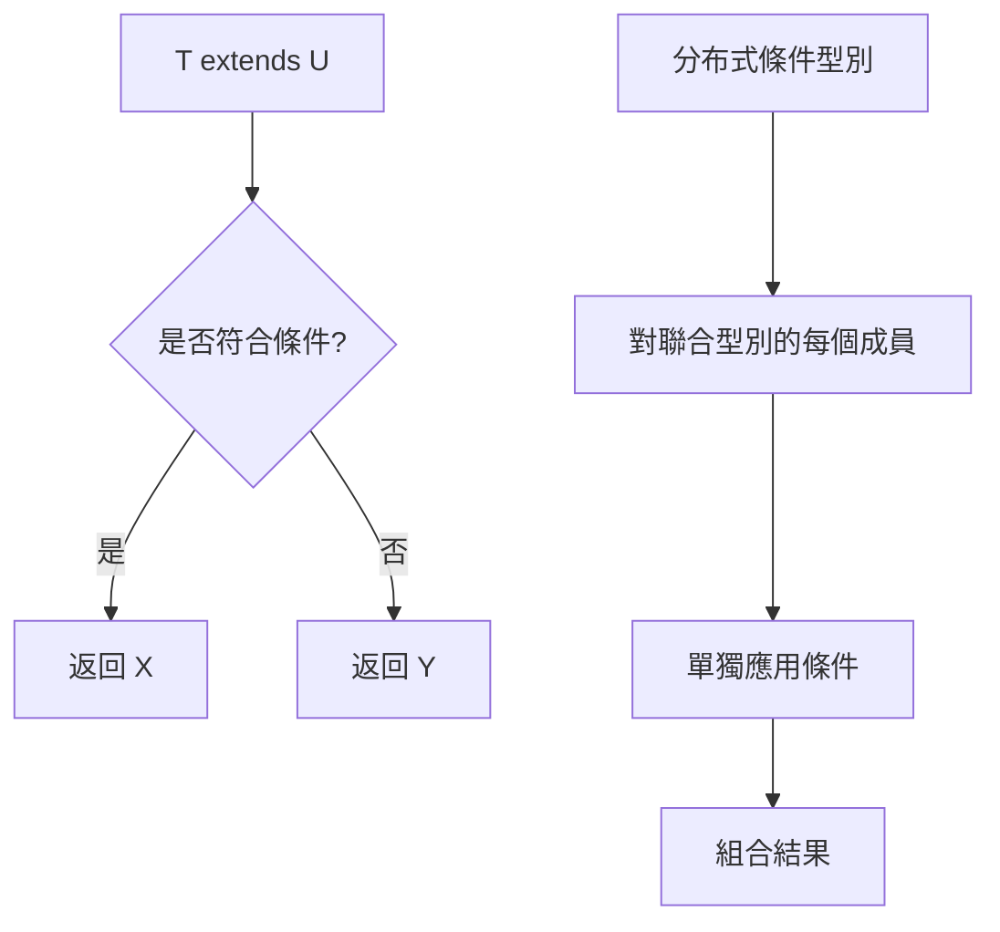

# TypeScript 進階類型技巧

## 概述

TypeScript 的進階類型系統提供了超越傳統靜態語言的元程式設計能力。這些技巧對於建構類型安全的後端框架、API 層和複雜業務邏輯至關重要。

## 條件型別深度應用

### 條件型別執行流程



### 高級條件型別模式

```typescript
// 排除 null 和 undefined 的進階版本
type DeepNonNullable<T> = T extends null | undefined
  ? never
  : T extends (infer U)[]
  ? DeepNonNullable<U>[]
  : T extends object
  ? { [K in keyof T]: DeepNonNullable<T[K]> }
  : T;

interface NestedData {
  user: {
    profile: {
      name: string | null;
      email: string | undefined;
    } | null;
  };
  tags: (string | null)[];
}

type CleanData = DeepNonNullable<NestedData>;
// 結果：所有嵌套的 null/undefined 都被移除

// 函數重載型別推斷
type OverloadedFunction = {
  (x: string): string;
  (x: number): number;
  (x: boolean): boolean;
};

type GetReturnType<T, U> = T extends (arg: U) => infer R ? R : never;

type StringReturn = GetReturnType<OverloadedFunction, string>; // string
type NumberReturn = GetReturnType<OverloadedFunction, number>; // number

// 遞歸條件型別：展平嵌套陣列
type Flatten<T> = T extends readonly (infer U)[]
  ? U extends readonly any[]
    ? Flatten<U>
    : U
  : T;

type Nested = [1, [2, [3, 4]], 5];
type Flattened = Flatten<Nested>; // 1 | 2 | 3 | 4 | 5

// API 響應型別推斷
type ExtractDataType<T> = T extends { data: infer U } ? U : T;
type ExtractArrayType<T> = T extends (infer U)[] ? U : never;

type APIResponse<T> = {
  success: boolean;
  data: T;
  message?: string;
};

type UserListResponse = APIResponse<User[]>;
type UserData = ExtractArrayType<ExtractDataType<UserListResponse>>; // User
```

### 型別級別的控制流程

```typescript
// 型別級別的 if-else
type If<C extends boolean, T, F> = C extends true ? T : F;

type IsString<T> = T extends string ? true : false;
type IsArray<T> = T extends any[] ? true : false;

type Example1 = If<IsString<"hello">, "is string", "not string">; // "is string"
type Example2 = If<IsArray<number>, "is array", "not array">; // "not array"

// 型別級別的邏輯運算
type And<A extends boolean, B extends boolean> = A extends true
  ? B extends true
    ? true
    : false
  : false;

type Or<A extends boolean, B extends boolean> = A extends true
  ? true
  : B extends true
  ? true
  : false;

type Not<A extends boolean> = A extends true ? false : true;

// 複雜的條件邏輯
type IsValidAPIKey<T> = And<
  T extends string ? true : false,
  T extends `api_${string}` ? true : false
>;

type ValidKey = IsValidAPIKey<"api_12345">; // true
type InvalidKey = IsValidAPIKey<"invalid">; // false
```

## 模板字面量型別進階應用

### API 路由型別生成

```typescript
// 基礎路由建構
type HTTPMethods = "GET" | "POST" | "PUT" | "DELETE" | "PATCH";
type Endpoint = `/${string}`;

type APIEndpoint<M extends HTTPMethods, E extends Endpoint> = `${M} ${E}`;

// 路由參數提取
type ExtractParams<T extends string> = T extends `${string}:${infer P}/${infer R}`
  ? P | ExtractParams<`/${R}`>
  : T extends `${string}:${infer P}`
  ? P
  : never;

type UserRoute = "/users/:userId/posts/:postId";
type RouteParams = ExtractParams<UserRoute>; // "userId" | "postId"

// 型別安全的路由處理器
type RouteHandler<T extends string> = (
  params: Record<ExtractParams<T>, string>
) => Promise<any>;

const handleUserPost: RouteHandler<"/users/:userId/posts/:postId"> = async (params) => {
  // params 有型別: { userId: string; postId: string }
  const { userId, postId } = params;
  return { userId, postId };
};

// 巢狀路由結構
type NestedRoutes<T extends Record<string, any>> = {
  [K in keyof T]: T[K] extends Record<string, any>
    ? NestedRoutes<T[K]>
    : T[K] extends string
    ? `/${K}${T[K] extends `/${string}` ? T[K] : `/${T[K]}`}`
    : never;
};

type RouteConfig = {
  users: {
    list: "";
    detail: ":id";
    posts: {
      list: ":userId/posts";
      detail: ":userId/posts/:postId";
    };
  };
  products: ":id";
};

type GeneratedRoutes = NestedRoutes<RouteConfig>;
// 生成所有可能的路由組合
```

### 資料庫 Schema 型別生成

```typescript
// SQL 查詢建構器
type SQLSelectFields<T, K extends keyof T> = K extends string
  ? `SELECT ${K} FROM ${string}`
  : never;

type SQLWhere<T, K extends keyof T> = K extends string
  ? `WHERE ${K} = ?`
  : never;

type SQLQuery<T, K extends keyof T> = `${SQLSelectFields<T, K>} ${SQLWhere<T, K>}`;

interface User {
  id: number;
  name: string;
  email: string;
}

type UserQuery = SQLQuery<User, "name">; // "SELECT name FROM ${string} WHERE name = ?"

// 型別安全的查詢建構器
class QueryBuilder<T> {
  private table: string;
  
  constructor(table: string) {
    this.table = table;
  }
  
  select<K extends keyof T>(...fields: K[]): SelectBuilder<T, K> {
    return new SelectBuilder(this.table, fields);
  }
}

class SelectBuilder<T, K extends keyof T> {
  constructor(private table: string, private fields: K[]) {}
  
  where<F extends keyof T>(field: F, value: T[F]): WhereBuilder<T, K, F> {
    return new WhereBuilder(this.table, this.fields, field, value);
  }
  
  build(): string {
    return `SELECT ${this.fields.join(', ')} FROM ${this.table}`;
  }
}

class WhereBuilder<T, K extends keyof T, F extends keyof T> {
  constructor(
    private table: string,
    private fields: K[],
    private whereField: F,
    private whereValue: T[F]
  ) {}
  
  build(): string {
    return `SELECT ${this.fields.join(', ')} FROM ${this.table} WHERE ${String(this.whereField)} = ${this.whereValue}`;
  }
}

// 使用
const userQuery = new QueryBuilder<User>("users")
  .select("name", "email")
  .where("id", 123) // 型別安全：只能是 number
  .build();
```

### 事件系統型別安全

```typescript
// 事件名稱與資料型別對應
type EventMap = {
  "user:created": { userId: string; email: string };
  "user:updated": { userId: string; changes: Partial<User> };
  "user:deleted": { userId: string };
  "product:created": { productId: string; name: string };
  "order:completed": { orderId: string; total: number };
};

// 提取事件類別
type ExtractEventCategory<T extends keyof EventMap> = T extends `${infer C}:${string}` ? C : never;
type UserEvents = Extract<keyof EventMap, `user:${string}`>;
type ProductEvents = Extract<keyof EventMap, `product:${string}`>;

// 型別安全的事件發送器
class TypedEventEmitter {
  private listeners = new Map<keyof EventMap, Function[]>();
  
  on<K extends keyof EventMap>(
    event: K, 
    listener: (data: EventMap[K]) => void
  ): void {
    if (!this.listeners.has(event)) {
      this.listeners.set(event, []);
    }
    this.listeners.get(event)!.push(listener);
  }
  
  emit<K extends keyof EventMap>(event: K, data: EventMap[K]): void {
    const listeners = this.listeners.get(event);
    if (listeners) {
      listeners.forEach(listener => listener(data));
    }
  }
  
  // 批次監聽同類別事件
  onCategory<C extends ExtractEventCategory<keyof EventMap>>(
    category: C,
    listener: (event: Extract<keyof EventMap, `${C}:${string}`>, data: any) => void
  ): void {
    // 實現類別監聽邏輯
  }
}

// 使用
const emitter = new TypedEventEmitter();

emitter.on("user:created", (data) => {
  // data 型別安全: { userId: string; email: string }
  console.log(`User created: ${data.userId}, ${data.email}`);
});

emitter.emit("user:created", { 
  userId: "123", 
  email: "user@example.com" 
}); // 型別檢查通過

// emitter.emit("user:created", { userId: 123 }); // ❌ 型別錯誤
```

## 遞歸型別與樹狀結構

### 深度遞歸型別

```typescript
// JSON 型別定義
type JSONValue = 
  | string 
  | number 
  | boolean 
  | null 
  | JSONObject 
  | JSONArray;

interface JSONObject {
  [key: string]: JSONValue;
}

interface JSONArray extends Array<JSONValue> {}

// 深度凍結型別
type DeepFreeze<T> = T extends Function
  ? T
  : T extends object
  ? {
      readonly [P in keyof T]: DeepFreeze<T[P]>;
    }
  : T;

// 路徑型別生成
type PathKeys<T> = T extends object
  ? {
      [K in keyof T]: K extends string | number
        ? T[K] extends object
          ? `${K}` | `${K}.${PathKeys<T[K]>}`
          : `${K}`
        : never;
    }[keyof T]
  : never;

interface Config {
  database: {
    host: string;
    port: number;
    ssl: {
      enabled: boolean;
      cert: string;
    };
  };
  redis: {
    url: string;
  };
}

type ConfigPaths = PathKeys<Config>;
// "database" | "database.host" | "database.port" | "database.ssl" | 
// "database.ssl.enabled" | "database.ssl.cert" | "redis" | "redis.url"

// 路徑取值型別
type GetValueByPath<T, P extends string> = P extends `${infer K}.${infer R}`
  ? K extends keyof T
    ? GetValueByPath<T[K], R>
    : never
  : P extends keyof T
  ? T[P]
  : never;

type DatabaseHost = GetValueByPath<Config, "database.host">; // string
type SSLEnabled = GetValueByPath<Config, "database.ssl.enabled">; // boolean

// 型別安全的配置存取器
function getConfigValue<T, P extends PathKeys<T>>(
  config: T,
  path: P
): GetValueByPath<T, P> {
  const keys = path.split('.');
  let current: any = config;
  
  for (const key of keys) {
    current = current[key];
  }
  
  return current;
}

// 使用
const config: Config = {
  database: {
    host: "localhost",
    port: 5432,
    ssl: {
      enabled: true,
      cert: "/path/to/cert"
    }
  },
  redis: {
    url: "redis://localhost:6379"
  }
};

const host = getConfigValue(config, "database.host"); // 型別: string
const sslEnabled = getConfigValue(config, "database.ssl.enabled"); // 型別: boolean
```

### 樹狀資料結構操作

```typescript
// 通用樹節點定義
interface TreeNode<T> {
  id: string;
  data: T;
  children?: TreeNode<T>[];
  parent?: TreeNode<T>;
}

// 樹狀操作型別
type TreeOperations<T> = {
  find: (predicate: (node: TreeNode<T>) => boolean) => TreeNode<T> | null;
  filter: (predicate: (node: TreeNode<T>) => boolean) => TreeNode<T>[];
  map: <U>(transform: (node: TreeNode<T>) => U) => TreeNode<U>;
  reduce: <U>(reducer: (acc: U, node: TreeNode<T>) => U, initial: U) => U;
};

class Tree<T> implements TreeOperations<T> {
  constructor(private root: TreeNode<T>) {}
  
  find(predicate: (node: TreeNode<T>) => boolean): TreeNode<T> | null {
    const traverse = (node: TreeNode<T>): TreeNode<T> | null => {
      if (predicate(node)) return node;
      
      if (node.children) {
        for (const child of node.children) {
          const result = traverse(child);
          if (result) return result;
        }
      }
      
      return null;
    };
    
    return traverse(this.root);
  }
  
  filter(predicate: (node: TreeNode<T>) => boolean): TreeNode<T>[] {
    const results: TreeNode<T>[] = [];
    
    const traverse = (node: TreeNode<T>) => {
      if (predicate(node)) {
        results.push(node);
      }
      
      if (node.children) {
        node.children.forEach(traverse);
      }
    };
    
    traverse(this.root);
    return results;
  }
  
  map<U>(transform: (node: TreeNode<T>) => U): TreeNode<U> {
    const mapNode = (node: TreeNode<T>): TreeNode<U> => ({
      id: node.id,
      data: transform(node),
      children: node.children?.map(mapNode),
    });
    
    return mapNode(this.root);
  }
  
  reduce<U>(reducer: (acc: U, node: TreeNode<T>) => U, initial: U): U {
    let accumulator = initial;
    
    const traverse = (node: TreeNode<T>) => {
      accumulator = reducer(accumulator, node);
      node.children?.forEach(traverse);
    };
    
    traverse(this.root);
    return accumulator;
  }
}

// 特定業務邏輯的樹狀結構
interface Category {
  name: string;
  slug: string;
  description?: string;
}

type CategoryTree = Tree<Category>;

// 型別安全的類別樹操作
class CategoryService {
  private tree: CategoryTree;
  
  constructor(rootCategory: TreeNode<Category>) {
    this.tree = new CategoryTree(rootCategory);
  }
  
  findCategoryBySlug(slug: string): TreeNode<Category> | null {
    return this.tree.find(node => node.data.slug === slug);
  }
  
  getCategoryNames(): string[] {
    return this.tree.reduce<string[]>((names, node) => {
      names.push(node.data.name);
      return names;
    }, []);
  }
  
  createBreadcrumbs(categoryId: string): Category[] {
    const category = this.tree.find(node => node.id === categoryId);
    if (!category) return [];
    
    const breadcrumbs: Category[] = [];
    let current: TreeNode<Category> | undefined = category;
    
    while (current) {
      breadcrumbs.unshift(current.data);
      current = current.parent;
    }
    
    return breadcrumbs;
  }
}
```

## 高級工具型別開發

### 自訂工具型別庫

```typescript
// 深層屬性操作
namespace DeepUtils {
  // 深層 Partial
  export type DeepPartial<T> = {
    [P in keyof T]?: T[P] extends object ? DeepPartial<T[P]> : T[P];
  };
  
  // 深層 Required
  export type DeepRequired<T> = {
    [P in keyof T]-?: T[P] extends object ? DeepRequired<T[P]> : T[P];
  };
  
  // 深層 Pick
  export type DeepPick<T, K extends PathKeys<T>> = {
    [P in K]: GetValueByPath<T, P>;
  };
  
  // 深層 Omit
  export type DeepOmit<T, K extends PathKeys<T>> = Omit<T, K>;
}

// 函數型別工具
namespace FunctionUtils {
  // 提取異步函數的解析型別
  export type UnwrapPromise<T> = T extends Promise<infer U> ? U : T;
  
  // 函數參數轉換
  export type TransformParameters<T extends (...args: any[]) => any, U> = 
    T extends (...args: infer P) => any 
      ? (...args: { [K in keyof P]: U }) => ReturnType<T>
      : never;
  
  // 函數管道型別
  export type Pipe<T extends readonly any[]> = T extends readonly [
    (...args: any[]) => infer U,
    ...infer R
  ]
    ? R extends readonly [(arg: U) => any, ...any[]]
      ? Pipe<R>
      : U
    : never;
}

// 物件操作工具
namespace ObjectUtils {
  // 鍵重命名
  export type RenameKeys<T, M extends Record<keyof T, string>> = {
    [K in keyof T as K extends keyof M ? M[K] : K]: T[K];
  };
  
  // 值型別過濾
  export type PickByValue<T, V> = {
    [K in keyof T as T[K] extends V ? K : never]: T[K];
  };
  
  // 可選屬性過濾
  export type OptionalKeys<T> = {
    [K in keyof T]-?: {} extends Pick<T, K> ? K : never;
  }[keyof T];
  
  export type RequiredKeys<T> = {
    [K in keyof T]-?: {} extends Pick<T, K> ? never : K;
  }[keyof T];
  
  // 分離可選和必需屬性
  export type OptionalProperties<T> = Pick<T, OptionalKeys<T>>;
  export type RequiredProperties<T> = Pick<T, RequiredKeys<T>>;
}

// 使用示例
interface UserProfile {
  id: string;
  name?: string;
  email: string;
  settings: {
    theme?: "light" | "dark";
    notifications: {
      email: boolean;
      push?: boolean;
    };
  };
}

type PartialProfile = DeepUtils.DeepPartial<UserProfile>;
type RequiredProfile = DeepUtils.DeepRequired<UserProfile>;

type StringProperties = ObjectUtils.PickByValue<UserProfile, string>;
// { id: string; name?: string; email: string }

type OptionalProps = ObjectUtils.OptionalProperties<UserProfile>;
// { name?: string }

type RequiredProps = ObjectUtils.RequiredProperties<UserProfile>;
// { id: string; email: string; settings: {...} }
```

### 型別級別的設計模式

```typescript
// 建造者模式型別
class TypedBuilder<T> {
  private data: Partial<T> = {};
  
  set<K extends keyof T>(key: K, value: T[K]): TypedBuilder<T> {
    this.data[key] = value;
    return this;
  }
  
  build(): T extends Record<string, any> 
    ? ObjectUtils.RequiredKeys<T> extends keyof this['data']
      ? T
      : "Missing required properties"
    : T {
    return this.data as any;
  }
}

// 狀態機型別
type StateMachine<
  S extends string,
  E extends string,
  T extends Record<S, E[]>
> = {
  currentState: S;
  transition(event: T[S][number]): StateMachine<S, E, T>;
  canTransition(event: E): boolean;
};

type OrderStates = "pending" | "confirmed" | "shipped" | "delivered" | "cancelled";
type OrderEvents = "confirm" | "ship" | "deliver" | "cancel";

type OrderTransitions = {
  pending: ["confirm", "cancel"];
  confirmed: ["ship", "cancel"];
  shipped: ["deliver"];
  delivered: [];
  cancelled: [];
};

class OrderStateMachine implements StateMachine<OrderStates, OrderEvents, OrderTransitions> {
  constructor(public currentState: OrderStates) {}
  
  transition(event: OrderTransitions[OrderStates][number]): OrderStateMachine {
    // 實現轉換邏輯
    return new OrderStateMachine(this.getNextState(event));
  }
  
  canTransition(event: OrderEvents): boolean {
    return (this.getValidEvents() as OrderEvents[]).includes(event);
  }
  
  private getValidEvents(): OrderTransitions[OrderStates] {
    const transitions: OrderTransitions = {
      pending: ["confirm", "cancel"],
      confirmed: ["ship", "cancel"],
      shipped: ["deliver"],
      delivered: [],
      cancelled: []
    };
    return transitions[this.currentState];
  }
  
  private getNextState(event: OrderEvents): OrderStates {
    // 實現狀態轉換邏輯
    switch (this.currentState) {
      case "pending":
        return event === "confirm" ? "confirmed" : "cancelled";
      case "confirmed":
        return event === "ship" ? "shipped" : "cancelled";
      case "shipped":
        return "delivered";
      default:
        return this.currentState;
    }
  }
}
```

## 型別測試與驗證

### 編譯時型別測試

```typescript
// 型別斷言工具
type Equals<X, Y> = (<T>() => T extends X ? 1 : 2) extends (<T>() => T extends Y ? 1 : 2)
  ? true
  : false;

type Assert<T extends true> = T;
type AssertFalse<T extends false> = T;

// 測試用例
type _Test_DeepPartial = Assert<
  Equals<
    DeepUtils.DeepPartial<{ a: { b: string } }>,
    { a?: { b?: string } }
  >
>;

type _Test_PathKeys = Assert<
  Equals<
    PathKeys<{ a: { b: string } }>,
    "a" | "a.b"
  >
>;

// 執行時型別驗證
function createValidator<T>() {
  return {
    validate(obj: unknown): obj is T {
      // 簡化的運行時驗證邏輯
      return typeof obj === "object" && obj !== null;
    },
    
    assert(obj: unknown): asserts obj is T {
      if (!this.validate(obj)) {
        throw new Error("Type assertion failed");
      }
    }
  };
}

// JSON Schema 整合
interface JSONSchema {
  type: "object" | "array" | "string" | "number" | "boolean";
  properties?: Record<string, JSONSchema>;
  items?: JSONSchema;
  required?: string[];
}

type JSONSchemaToType<T extends JSONSchema> = T extends { type: "string" }
  ? string
  : T extends { type: "number" }
  ? number
  : T extends { type: "boolean" }
  ? boolean
  : T extends { type: "array"; items: infer I }
  ? I extends JSONSchema
    ? JSONSchemaToType<I>[]
    : unknown[]
  : T extends { type: "object"; properties: infer P }
  ? P extends Record<string, JSONSchema>
    ? {
        [K in keyof P]: JSONSchemaToType<P[K]>;
      }
    : Record<string, unknown>
  : unknown;

// 使用
const userSchema = {
  type: "object",
  properties: {
    id: { type: "string" },
    name: { type: "string" },
    age: { type: "number" }
  },
  required: ["id", "name"]
} as const;

type UserFromSchema = JSONSchemaToType<typeof userSchema>;
// { id: string; name: string; age: number }
```

## 實際應用場景

### API 客戶端型別生成

```typescript
// OpenAPI 型別生成器概念
type HTTPMethod = "GET" | "POST" | "PUT" | "DELETE" | "PATCH";

type APISpec = {
  "/users": {
    GET: {
      response: User[];
      query?: { page?: number; limit?: number };
    };
    POST: {
      body: Omit<User, "id">;
      response: User;
    };
  };
  "/users/:id": {
    GET: {
      params: { id: string };
      response: User;
    };
    PUT: {
      params: { id: string };
      body: Partial<User>;
      response: User;
    };
    DELETE: {
      params: { id: string };
      response: { success: boolean };
    };
  };
};

type APIClient<T extends Record<string, Record<HTTPMethod, any>>> = {
  [Path in keyof T]: {
    [Method in keyof T[Path]]: T[Path][Method] extends {
      params: infer P;
      body: infer B;
      query: infer Q;
      response: infer R;
    }
      ? (options: { params: P; body: B; query: Q }) => Promise<R>
      : T[Path][Method] extends { body: infer B; response: infer R }
      ? (options: { body: B }) => Promise<R>
      : T[Path][Method] extends { query: infer Q; response: infer R }
      ? (options?: { query: Q }) => Promise<R>
      : T[Path][Method] extends { response: infer R }
      ? () => Promise<R>
      : never;
  };
};

// 生成的客戶端型別
type GeneratedAPIClient = APIClient<APISpec>;

// 使用
declare const apiClient: GeneratedAPIClient;

// 型別安全的 API 調用
const users = await apiClient["/users"].GET(); // Promise<User[]>
const newUser = await apiClient["/users"].POST({
  body: { name: "John", email: "john@example.com" }
}); // Promise<User>

const user = await apiClient["/users/:id"].GET({
  params: { id: "123" }
}); // Promise<User>
```

## 總結

TypeScript 進階型別技巧提供了:

- **元程式設計能力**: 型別級別的計算和轉換
- **編譯時保證**: 複雜業務邏輯的型別安全
- **框架開發支援**: 建構型別安全的 API 和工具
- **維護性提升**: 大型專案的重構和演進支援

對於後端工程師的關鍵價值:
- 建構型別安全的 ORM 和查詢建構器
- 實現編譯時的 API 規範驗證
- 設計可擴展的外掛系統
- 提供優秀的開發者體驗和 IDE 支援