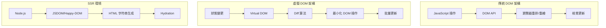

# DOM 操作與 Web 標準 API

## 概述

對於後端工程師而言，DOM 操作主要出現在 SSR (Server-Side Rendering)、Universal JavaScript、測試環境和 Node.js 爬蟲場景中。理解 DOM API 的核心原理有助於建構全端應用和優化使用者體驗。

## DOM 與虛擬 DOM 架構比較

### 架構對比



### 與其他技術棧的對比

| 技術      | 渲染方式 | 狀態管理  | 效能特性        | 後端整合           |
| ------- | ---- | ----- | ----------- | -------------- |
| DOM API | 命令式  | 手動    | 直接操作        | SSR 支援         |
| React   | 宣告式  | 單向資料流 | Virtual DOM | Next.js/Gatsby |
| Vue     | 宣告式  | 響應式   | 模板編譯        | Nuxt.js        |
| Angular | 宣告式  | 依賴注入  | Zone.js     | Universal      |
| Svelte  | 編譯時  | 響應式   | 編譯優化        | SvelteKit      |

## SSR 環境中的 DOM 處理

### JSDOM 與 Happy-DOM 比較

```javascript
// JSDOM - 完整但較重
const { JSDOM } = require('jsdom');

const dom = new JSDOM(`<!DOCTYPE html>
<html>
<head><title>Test</title></head>
<body>
  <div id="app"></div>
</body>
</html>`);

const { window } = dom;
const { document } = window;

// 模擬瀏覽器環境
global.window = window;
global.document = document;
global.navigator = window.navigator;

// Happy-DOM - 輕量但功能有限
const { Window } = require('happy-dom');

const window = new Window();
const document = window.document;

document.body.innerHTML = '<div id="app"></div>';

// 效能比較
function performanceTest() {
    console.time('JSDOM');
    for (let i = 0; i < 10000; i++) {
        const div = document.createElement('div');
        div.textContent = `Item ${i}`;
        document.body.appendChild(div);
    }
    console.timeEnd('JSDOM'); // ~500ms

    console.time('Happy-DOM');
    for (let i = 0; i < 10000; i++) {
        const div = document.createElement('div');
        div.textContent = `Item ${i}`;
        document.body.appendChild(div);
    }
    console.timeEnd('Happy-DOM'); // ~100ms
}
```

### Node.js 中的 HTML 生成

```javascript
// 型別安全的 HTML 建構器
class HTMLBuilder {
    constructor() {
        this.elements = [];
    }
    
    createElement(tag, attributes = {}, children = []) {
        const attrs = Object.entries(attributes)
            .map(([key, value]) => `${key}="${this.escapeHtml(value)}"`)
            .join(' ');
            
        const attrsStr = attrs ? ` ${attrs}` : '';
        
        if (this.isSelfClosing(tag)) {
            return `<${tag}${attrsStr} />`;
        }
        
        const childrenStr = Array.isArray(children) 
            ? children.join('') 
            : children;
            
        return `<${tag}${attrsStr}>${childrenStr}</${tag}>`;
    }
    
    escapeHtml(text) {
        const map = {
            '&': '&amp;',
            '<': '&lt;',
            '>': '&gt;',
            '"': '&quot;',
            "'": '&#39;'
        };
        return text.toString().replace(/[&<>"']/g, m => map[m]);
    }
    
    isSelfClosing(tag) {
        const selfClosingTags = ['area', 'base', 'br', 'col', 'embed', 
            'hr', 'img', 'input', 'link', 'meta', 'source', 'track', 'wbr'];
        return selfClosingTags.includes(tag.toLowerCase());
    }
}

// 使用建構器生成 HTML
function generateUserProfile(user) {
    const builder = new HTMLBuilder();
    
    return builder.createElement('div', { class: 'user-profile' }, [
        builder.createElement('img', { 
            src: user.avatar, 
            alt: `${user.name}'s avatar`,
            class: 'avatar'
        }),
        builder.createElement('h2', {}, user.name),
        builder.createElement('p', { class: 'email' }, user.email),
        builder.createElement('div', { class: 'stats' }, [
            builder.createElement('span', {}, `Posts: ${user.postCount}`),
            builder.createElement('span', {}, `Followers: ${user.followers}`)
        ])
    ]);
}

// Express.js 整合
const express = require('express');
const app = express();

app.get('/user/:id', async (req, res) => {
    const user = await getUserById(req.params.id);
    const userProfileHTML = generateUserProfile(user);
    
    const fullHTML = `
    <!DOCTYPE html>
    <html>
    <head>
        <title>${user.name} - Profile</title>
        <meta charset="utf-8">
        <meta name="viewport" content="width=device-width, initial-scale=1">
    </head>
    <body>
        ${userProfileHTML}
        <script>
            // Hydration 腳本
            window.__INITIAL_DATA__ = ${JSON.stringify(user)};
        </script>
    </body>
    </html>
    `;
    
    res.send(fullHTML);
});
```

## 高效能 DOM 操作模式

### 批量操作與 DocumentFragment

```javascript
// ❌ 低效能的個別操作
function inefficientDOMUpdate(items) {
    const container = document.getElementById('list');
    
    items.forEach(item => {
        const li = document.createElement('li');
        li.textContent = item.name;
        li.className = 'list-item';
        container.appendChild(li); // 每次操作觸發重排
    });
}

// ✅ 使用 DocumentFragment 批量操作
function efficientDOMUpdate(items) {
    const container = document.getElementById('list');
    const fragment = document.createDocumentFragment();
    
    items.forEach(item => {
        const li = document.createElement('li');
        li.textContent = item.name;
        li.className = 'list-item';
        fragment.appendChild(li); // 在記憶體中操作
    });
    
    container.appendChild(fragment); // 單次 DOM 更新
}

// ✅ 使用 innerHTML 進行大量更新
function htmlStringUpdate(items) {
    const container = document.getElementById('list');
    
    const html = items.map(item => 
        `<li class="list-item">${escapeHtml(item.name)}</li>`
    ).join('');
    
    container.innerHTML = html; // 單次更新
}

// 效能測試
function performanceComparison(items) {
    console.time('Individual Operations');
    inefficientDOMUpdate(items);
    console.timeEnd('Individual Operations'); // ~300ms for 1000 items
    
    console.time('DocumentFragment');
    efficientDOMUpdate(items);
    console.timeEnd('DocumentFragment'); // ~50ms for 1000 items
    
    console.time('innerHTML');
    htmlStringUpdate(items);
    console.timeEnd('innerHTML'); // ~20ms for 1000 items
}
```

### 虛擬滾動實現

```javascript
// 大數據集的虛擬滾動
class VirtualScroller {
    constructor(container, itemHeight, renderItem) {
        this.container = container;
        this.itemHeight = itemHeight;
        this.renderItem = renderItem;
        this.scrollTop = 0;
        this.data = [];
        
        this.visibleStart = 0;
        this.visibleEnd = 0;
        this.bufferSize = 5;
        
        this.setupContainer();
        this.bindEvents();
    }
    
    setupContainer() {
        this.container.style.overflowY = 'auto';
        this.container.style.position = 'relative';
        
        // 創建實際內容容器
        this.contentContainer = document.createElement('div');
        this.contentContainer.style.position = 'absolute';
        this.contentContainer.style.top = '0';
        this.contentContainer.style.width = '100%';
        
        this.container.appendChild(this.contentContainer);
    }
    
    bindEvents() {
        this.container.addEventListener('scroll', () => {
            this.scrollTop = this.container.scrollTop;
            this.updateVisibleRange();
            this.render();
        });
    }
    
    setData(data) {
        this.data = data;
        this.container.style.height = `${data.length * this.itemHeight}px`;
        this.updateVisibleRange();
        this.render();
    }
    
    updateVisibleRange() {
        const containerHeight = this.container.clientHeight;
        const visibleCount = Math.ceil(containerHeight / this.itemHeight);
        
        this.visibleStart = Math.max(0, 
            Math.floor(this.scrollTop / this.itemHeight) - this.bufferSize
        );
        this.visibleEnd = Math.min(this.data.length - 1,
            this.visibleStart + visibleCount + this.bufferSize * 2
        );
    }
    
    render() {
        const fragment = document.createDocumentFragment();
        
        for (let i = this.visibleStart; i <= this.visibleEnd; i++) {
            const item = this.data[i];
            const element = this.renderItem(item, i);
            
            element.style.position = 'absolute';
            element.style.top = `${i * this.itemHeight}px`;
            element.style.height = `${this.itemHeight}px`;
            element.style.width = '100%';
            
            fragment.appendChild(element);
        }
        
        // 清空並重新渲染
        this.contentContainer.innerHTML = '';
        this.contentContainer.appendChild(fragment);
    }
}

// 使用虛擬滾動
const container = document.getElementById('virtual-list');
const scroller = new VirtualScroller(container, 50, (item, index) => {
    const div = document.createElement('div');
    div.className = 'virtual-item';
    div.innerHTML = `
        <strong>${item.name}</strong>
        <span>${item.description}</span>
    `;
    return div;
});

// 設置大量資料
const largeDataset = Array.from({ length: 100000 }, (_, i) => ({
    name: `Item ${i}`,
    description: `Description for item ${i}`
}));

scroller.setData(largeDataset);
```

## Web Components 與自訂元素

### 創建可重用的 Web Components

```javascript
// 基礎 Web Component
class UserCard extends HTMLElement {
    constructor() {
        super();
        
        // 創建 Shadow DOM
        this.attachShadow({ mode: 'open' });
        
        // 內部狀態
        this._user = null;
        this._loading = false;
    }
    
    // 觀察的屬性
    static get observedAttributes() {
        return ['user-id', 'avatar-size'];
    }
    
    // 屬性變更回調
    attributeChangedCallback(name, oldValue, newValue) {
        if (oldValue !== newValue) {
            switch (name) {
                case 'user-id':
                    this.loadUser(newValue);
                    break;
                case 'avatar-size':
                    this.updateAvatarSize(newValue);
                    break;
            }
        }
    }
    
    // 元素連接到 DOM
    connectedCallback() {
        this.render();
        const userId = this.getAttribute('user-id');
        if (userId) {
            this.loadUser(userId);
        }
    }
    
    // 載入使用者資料
    async loadUser(userId) {
        this._loading = true;
        this.render();
        
        try {
            const response = await fetch(`/api/users/${userId}`);
            this._user = await response.json();
        } catch (error) {
            console.error('Failed to load user:', error);
            this._user = null;
        } finally {
            this._loading = false;
            this.render();
        }
    }
    
    // 更新頭像大小
    updateAvatarSize(size) {
        const avatar = this.shadowRoot.querySelector('.avatar');
        if (avatar) {
            avatar.style.width = avatar.style.height = `${size}px`;
        }
    }
    
    // 渲染元素
    render() {
        const avatarSize = this.getAttribute('avatar-size') || '64';
        
        this.shadowRoot.innerHTML = `
            <style>
                :host {
                    display: block;
                    border: 1px solid #ddd;
                    border-radius: 8px;
                    padding: 16px;
                    font-family: system-ui, sans-serif;
                }
                
                .avatar {
                    border-radius: 50%;
                    object-fit: cover;
                }
                
                .loading {
                    text-align: center;
                    color: #666;
                    font-style: italic;
                }
                
                .user-info h3 {
                    margin: 0 0 8px 0;
                    color: #333;
                }
                
                .user-info p {
                    margin: 0;
                    color: #666;
                }
            </style>
            
            ${this.renderContent(avatarSize)}
        `;
    }
    
    renderContent(avatarSize) {
        if (this._loading) {
            return '<div class="loading">Loading user...</div>';
        }
        
        if (!this._user) {
            return '<div class="error">Failed to load user</div>';
        }
        
        return `
            <div class="user-card">
                
                <div class="user-info">
                    <h3>${this._user.name}</h3>
                    <p>${this._user.email}</p>
                </div>
            </div>
        `;
    }
}

// 註冊自訂元素
customElements.define('user-card', UserCard);

// 使用方式
// <user-card user-id="123" avatar-size="80"></user-card>
```

### TypeScript 的 Web Components

```typescript
// TypeScript 支援的 Web Component
interface User {
    id: string;
    name: string;
    email: string;
    avatar: string;
}

class TypedUserCard extends HTMLElement {
    private _user: User | null = null;
    private _loading = false;
    private shadowRoot: ShadowRoot;
    
    constructor() {
        super();
        this.shadowRoot = this.attachShadow({ mode: 'open' });
    }
    
    static get observedAttributes(): string[] {
        return ['user-id', 'avatar-size'];
    }
    
    get userId(): string | null {
        return this.getAttribute('user-id');
    }
    
    set userId(value: string | null) {
        if (value) {
            this.setAttribute('user-id', value);
        } else {
            this.removeAttribute('user-id');
        }
    }
    
    get avatarSize(): number {
        return parseInt(this.getAttribute('avatar-size') || '64', 10);
    }
    
    set avatarSize(value: number) {
        this.setAttribute('avatar-size', value.toString());
    }
    
    attributeChangedCallback(
        name: string, 
        oldValue: string | null, 
        newValue: string | null
    ): void {
        if (oldValue !== newValue) {
            this.handleAttributeChange(name, newValue);
        }
    }
    
    private handleAttributeChange(name: string, value: string | null): void {
        switch (name) {
            case 'user-id':
                if (value) this.loadUser(value);
                break;
            case 'avatar-size':
                this.updateAvatarSize(parseInt(value || '64', 10));
                break;
        }
    }
    
    private async loadUser(userId: string): Promise<void> {
        this._loading = true;
        this.render();
        
        try {
            const response = await fetch(`/api/users/${userId}`);
            if (!response.ok) {
                throw new Error(`HTTP ${response.status}`);
            }
            this._user = await response.json();
        } catch (error) {
            console.error('Failed to load user:', error);
            this._user = null;
        } finally {
            this._loading = false;
            this.render();
        }
    }
    
    private render(): void {
        this.shadowRoot.innerHTML = this.getTemplate();
    }
    
    private getTemplate(): string {
        return `
            <style>${this.getStyles()}</style>
            ${this.getContent()}
        `;
    }
    
    private getStyles(): string {
        return `
            :host {
                display: block;
                border: 1px solid #e1e5e9;
                border-radius: 12px;
                padding: 20px;
                font-family: -apple-system, BlinkMacSystemFont, 'Segoe UI', Roboto, sans-serif;
                box-shadow: 0 2px 8px rgba(0, 0, 0, 0.1);
                background: white;
            }
            
            .user-card {
                display: flex;
                align-items: center;
                gap: 16px;
            }
            
            .avatar {
                border-radius: 50%;
                object-fit: cover;
                border: 2px solid #e1e5e9;
            }
            
            .user-info h3 {
                margin: 0 0 4px 0;
                font-size: 18px;
                font-weight: 600;
                color: #1a1a1a;
            }
            
            .user-info p {
                margin: 0;
                color: #6b7280;
                font-size: 14px;
            }
            
            .loading, .error {
                text-align: center;
                padding: 20px;
                color: #6b7280;
                font-style: italic;
            }
            
            .error {
                color: #ef4444;
            }
        `;
    }
    
    private getContent(): string {
        if (this._loading) {
            return '<div class="loading">Loading user information...</div>';
        }
        
        if (!this._user) {
            return '<div class="error">Unable to load user information</div>';
        }
        
        return `
            <div class="user-card">
                
                <div class="user-info">
                    <h3>${this.escapeHtml(this._user.name)}</h3>
                    <p>${this.escapeHtml(this._user.email)}</p>
                </div>
            </div>
        `;
    }
    
    private escapeHtml(text: string): string {
        const div = document.createElement('div');
        div.textContent = text;
        return div.innerHTML;
    }
}

// 型別定義
declare global {
    interface HTMLElementTagNameMap {
        'typed-user-card': TypedUserCard;
    }
}

customElements.define('typed-user-card', TypedUserCard);
```

## 現代 Web API 應用

### Intersection Observer - 無限滾動

```javascript
// 高效能的無限滾動實現
class InfiniteScroller {
    constructor(container, loadMore, options = {}) {
        this.container = container;
        this.loadMore = loadMore;
        this.loading = false;
        this.hasMore = true;
        
        this.options = {
            threshold: 0.1,
            rootMargin: '100px',
            ...options
        };
        
        this.setupSentinel();
        this.setupObserver();
    }
    
    setupSentinel() {
        this.sentinel = document.createElement('div');
        this.sentinel.className = 'infinite-scroll-sentinel';
        this.sentinel.style.height = '1px';
        this.container.appendChild(this.sentinel);
    }
    
    setupObserver() {
        this.observer = new IntersectionObserver(
            this.handleIntersection.bind(this),
            {
                root: null,
                rootMargin: this.options.rootMargin,
                threshold: this.options.threshold
            }
        );
        
        this.observer.observe(this.sentinel);
    }
    
    async handleIntersection(entries) {
        const entry = entries[0];
        
        if (entry.isIntersecting && !this.loading && this.hasMore) {
            this.loading = true;
            
            try {
                const hasMore = await this.loadMore();
                this.hasMore = hasMore !== false;
                
                if (!this.hasMore) {
                    this.observer.unobserve(this.sentinel);
                    this.sentinel.remove();
                }
            } catch (error) {
                console.error('Failed to load more items:', error);
            } finally {
                this.loading = false;
            }
        }
    }
    
    destroy() {
        if (this.observer) {
            this.observer.disconnect();
        }
        if (this.sentinel && this.sentinel.parentNode) {
            this.sentinel.remove();
        }
    }
}

// 使用無限滾動
const scroller = new InfiniteScroller(
    document.getElementById('content'),
    async () => {
        const response = await fetch(`/api/posts?page=${currentPage++}`);
        const posts = await response.json();
        
        posts.forEach(post => {
            const element = createPostElement(post);
            document.getElementById('content').appendChild(element);
        });
        
        return posts.length > 0; // 返回是否還有更多資料
    }
);
```

### ResizeObserver - 響應式佈局

```javascript
// 響應式容器查詢
class ResponsiveContainer {
    constructor(element) {
        this.element = element;
        this.breakpoints = {
            small: 320,
            medium: 768,
            large: 1024,
            xlarge: 1200
        };
        
        this.setupObserver();
    }
    
    setupObserver() {
        this.observer = new ResizeObserver(entries => {
            entries.forEach(entry => {
                const { width } = entry.contentRect;
                this.updateBreakpointClasses(width);
            });
        });
        
        this.observer.observe(this.element);
    }
    
    updateBreakpointClasses(width) {
        // 移除所有斷點類別
        Object.keys(this.breakpoints).forEach(bp => {
            this.element.classList.remove(`responsive-${bp}`);
        });
        
        // 添加當前斷點類別
        if (width >= this.breakpoints.xlarge) {
            this.element.classList.add('responsive-xlarge');
        } else if (width >= this.breakpoints.large) {
            this.element.classList.add('responsive-large');
        } else if (width >= this.breakpoints.medium) {
            this.element.classList.add('responsive-medium');
        } else {
            this.element.classList.add('responsive-small');
        }
        
        // 觸發自訂事件
        this.element.dispatchEvent(new CustomEvent('breakpointchange', {
            detail: { width, breakpoint: this.getCurrentBreakpoint(width) }
        }));
    }
    
    getCurrentBreakpoint(width) {
        if (width >= this.breakpoints.xlarge) return 'xlarge';
        if (width >= this.breakpoints.large) return 'large';
        if (width >= this.breakpoints.medium) return 'medium';
        return 'small';
    }
    
    destroy() {
        if (this.observer) {
            this.observer.disconnect();
        }
    }
}

// CSS 容器查詢支援
const style = document.createElement('style');
style.textContent = `
    .responsive-container {
        container-type: inline-size;
    }
    
    .responsive-small .grid {
        grid-template-columns: 1fr;
    }
    
    .responsive-medium .grid {
        grid-template-columns: repeat(2, 1fr);
    }
    
    .responsive-large .grid {
        grid-template-columns: repeat(3, 1fr);
    }
    
    .responsive-xlarge .grid {
        grid-template-columns: repeat(4, 1fr);
    }
`;
document.head.appendChild(style);
```

## 測試環境中的 DOM 操作

### Jest 與 DOM 測試

```javascript
// Jest 配置 DOM 環境
// jest.config.js
module.exports = {
    testEnvironment: 'jsdom',
    setupFilesAfterEnv: ['<rootDir>/src/setupTests.js']
};

// setupTests.js
import 'jest-dom/extend-expect';

// DOM 操作測試
describe('UserCard Component', () => {
    let container;
    
    beforeEach(() => {
        container = document.createElement('div');
        document.body.appendChild(container);
    });
    
    afterEach(() => {
        document.body.removeChild(container);
        container = null;
    });
    
    test('should render user information', async () => {
        // 模擬 fetch API
        global.fetch = jest.fn().mockResolvedValue({
            ok: true,
            json: () => Promise.resolve({
                id: '123',
                name: 'John Doe',
                email: 'john@example.com',
                avatar: 'https://example.com/avatar.jpg'
            })
        });
        
        // 創建組件
        const userCard = document.createElement('user-card');
        userCard.setAttribute('user-id', '123');
        container.appendChild(userCard);
        
        // 等待異步渲染
        await new Promise(resolve => setTimeout(resolve, 0));
        
        // 斷言
        const shadowRoot = userCard.shadowRoot;
        const nameElement = shadowRoot.querySelector('h3');
        const emailElement = shadowRoot.querySelector('p');
        
        expect(nameElement.textContent).toBe('John Doe');
        expect(emailElement.textContent).toBe('john@example.com');
    });
    
    test('should handle loading state', () => {
        const userCard = document.createElement('user-card');
        userCard.setAttribute('user-id', '123');
        container.appendChild(userCard);
        
        const shadowRoot = userCard.shadowRoot;
        const loadingElement = shadowRoot.querySelector('.loading');
        
        expect(loadingElement).toBeInTheDocument();
        expect(loadingElement.textContent).toContain('Loading');
    });
});

// E2E 測試示例 (Playwright)
const { test, expect } = require('@playwright/test');

test('infinite scroll loads more content', async ({ page }) => {
    await page.goto('/posts');
    
    // 檢查初始內容
    const initialPosts = await page.locator('.post').count();
    expect(initialPosts).toBeGreaterThan(0);
    
    // 滾動到底部觸發載入
    await page.evaluate(() => {
        window.scrollTo(0, document.body.scrollHeight);
    });
    
    // 等待新內容載入
    await page.waitForTimeout(2000);
    
    const finalPosts = await page.locator('.post').count();
    expect(finalPosts).toBeGreaterThan(initialPosts);
});
```

## 爬蟲與資料擷取

### Puppeteer 進階使用

```javascript
const puppeteer = require('puppeteer');

class WebScraper {
    constructor(options = {}) {
        this.options = {
            headless: true,
            args: ['--no-sandbox', '--disable-setuid-sandbox'],
            ...options
        };
        this.browser = null;
    }
    
    async init() {
        this.browser = await puppeteer.launch(this.options);
    }
    
    async scrapePage(url, selectors) {
        const page = await this.browser.newPage();
        
        try {
            // 設置視窗大小和 User-Agent
            await page.setViewport({ width: 1920, height: 1080 });
            await page.setUserAgent('Mozilla/5.0 (compatible; WebScraper/1.0)');
            
            // 攔截請求以提升效能
            await page.setRequestInterception(true);
            page.on('request', (req) => {
                const resourceType = req.resourceType();
                if (resourceType === 'image' || resourceType === 'stylesheet' || resourceType === 'font') {
                    req.abort();
                } else {
                    req.continue();
                }
            });
            
            await page.goto(url, { waitUntil: 'networkidle2' });
            
            // 等待動態內容載入
            if (selectors.waitFor) {
                await page.waitForSelector(selectors.waitFor, { timeout: 10000 });
            }
            
            // 執行資料擷取
            const data = await page.evaluate((sel) => {
                const result = {};
                
                Object.entries(sel).forEach(([key, selector]) => {
                    if (key === 'waitFor') return;
                    
                    if (selector.multiple) {
                        result[key] = Array.from(document.querySelectorAll(selector.selector))
                            .map(el => selector.attribute ? el.getAttribute(selector.attribute) : el.textContent.trim());
                    } else {
                        const element = document.querySelector(selector.selector);
                        if (element) {
                            result[key] = selector.attribute 
                                ? element.getAttribute(selector.attribute)
                                : element.textContent.trim();
                        }
                    }
                });
                
                return result;
            }, selectors);
            
            return data;
        } finally {
            await page.close();
        }
    }
    
    async scrapeMultiplePages(urls, selectors) {
        const results = [];
        const concurrency = 3; // 限制併發數
        
        for (let i = 0; i < urls.length; i += concurrency) {
            const batch = urls.slice(i, i + concurrency);
            const batchPromises = batch.map(url => 
                this.scrapePage(url, selectors).catch(error => ({
                    url,
                    error: error.message
                }))
            );
            
            const batchResults = await Promise.all(batchPromises);
            results.push(...batchResults);
            
            // 避免被網站封鎖
            if (i + concurrency < urls.length) {
                await new Promise(resolve => setTimeout(resolve, 1000));
            }
        }
        
        return results;
    }
    
    async close() {
        if (this.browser) {
            await this.browser.close();
        }
    }
}

// 使用爬蟲
async function scrapeEcommerceData() {
    const scraper = new WebScraper();
    await scraper.init();
    
    try {
        const productData = await scraper.scrapePage('https://example-store.com/product/123', {
            waitFor: '.product-details',
            title: { selector: 'h1.product-title' },
            price: { selector: '.price' },
            images: { 
                selector: '.product-image img', 
                attribute: 'src',
                multiple: true 
            },
            description: { selector: '.product-description' },
            inStock: { selector: '.stock-status' }
        });
        
        console.log('Product data:', productData);
    } finally {
        await scraper.close();
    }
}
```

## 總結

DOM 操作對於後端工程師的重要應用場景:

- **SSR 應用**: 伺服器端生成 HTML 提升 SEO 和首次載入效能
- **測試環境**: 模擬瀏覽器環境進行全端測試
- **資料擷取**: 爬蟲和自動化資料收集
- **Universal JavaScript**: 同構應用的前後端代碼共享

關鍵技術要點:
- 理解 DOM API 的效能影響和最佳化策略
- 掌握現代 Web API 提升使用者體驗
- 熟悉測試環境中的 DOM 操作模式
- 運用 Web Components 創建可重用組件