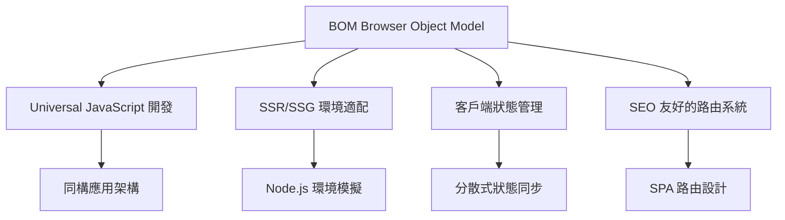
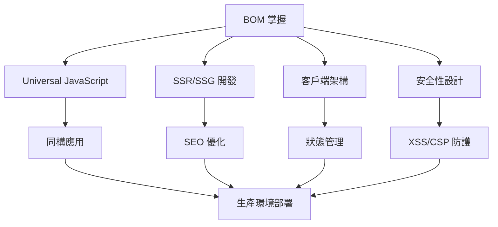

# BOM 與瀏覽器環境

> **從後端工程師角度理解瀏覽器物件模型**  
> 理解 Universal JavaScript、Isomorphic 應用開發以及瀏覽器環境特性

## 目錄

1. [BOM 核心概念](#bom-核心概念)
2. [Window 物件與全域作用域](#window-物件與全域作用域)
3. [Navigator 與環境檢測](#navigator-與環境檢測)
4. [Location 與 URL 處理](#location-與-url-處理)
5. [History API 與路由系統](#history-api-與路由系統)
6. [Storage API 與客戶端儲存](#storage-api-與客戶端儲存)
7. [Universal JavaScript 設計模式](#universal-javascript-設計模式)
8. [Server-Side Rendering 環境差異](#server-side-rendering-環境差異)
9. [瀏覽器 vs Node.js API 對照](#瀏覽器-vs-nodejs-api-對照)
10. [生產環境考量](#生產環境考量)

---

## BOM 核心概念

### 什麼是 BOM

BOM (Browser Object Model) 是瀏覽器提供的一組 API，用於與瀏覽器環境互動。對後端工程師而言，理解 BOM 有助於：



### BOM 與後端系統的對比

| 概念 | BOM (瀏覽器) | 後端系統 | 說明 |
|------|-------------|---------|------|
| 全域物件 | `window` | `global` (Node.js) | 全域命名空間 |
| 環境檢測 | `navigator` | `process.platform` | 環境資訊 |
| URL 處理 | `location` | `url` module | URL 解析與操作 |
| 儲存系統 | `localStorage` | Database/Cache | 持久化儲存 |
| 導航控制 | `history` | Router middleware | 路由與導航 |

---

## Window 物件與全域作用域

### Window 物件結構

```typescript
// 瀏覽器環境的全域物件
interface WindowLike {
  // 核心屬性
  location: Location;
  navigator: Navigator;
  history: History;
  
  // 儲存 API
  localStorage: Storage;
  sessionStorage: Storage;
  
  // 定時器 (與 Node.js 類似)
  setTimeout: typeof setTimeout;
  setInterval: typeof setInterval;
  
  // 網路請求
  fetch: typeof fetch;
  
  // 事件系統
  addEventListener: (type: string, listener: EventListener) => void;
}

// Universal JavaScript 環境檢測
const isServer = typeof window === 'undefined';
const isBrowser = typeof window !== 'undefined';
```

### 全域作用域管理

```typescript
// 後端工程師熟悉的模組化管理方式
class GlobalStateManager {
  private static instance: GlobalStateManager;
  private state: Map<string, any> = new Map();
  
  static getInstance(): GlobalStateManager {
    if (!GlobalStateManager.instance) {
      GlobalStateManager.instance = new GlobalStateManager();
    }
    return GlobalStateManager.instance;
  }
  
  // 安全的全域狀態設置
  setGlobal<T>(key: string, value: T): void {
    if (typeof window !== 'undefined') {
      // 瀏覽器環境
      (window as any)[key] = value;
    } else {
      // Node.js 環境
      (global as any)[key] = value;
    }
    this.state.set(key, value);
  }
  
  getGlobal<T>(key: string): T | undefined {
    if (typeof window !== 'undefined') {
      return (window as any)[key];
    } else {
      return (global as any)[key];
    }
  }
}

// 使用範例
const globalManager = GlobalStateManager.getInstance();
globalManager.setGlobal('API_BASE_URL', 'https://api.example.com');
```

---

## Navigator 與環境檢測

### 用戶代理檢測

```typescript
interface UserAgentInfo {
  browser: string;
  version: string;
  os: string;
  isMobile: boolean;
  isBot: boolean;
}

class UserAgentDetector {
  static detect(): UserAgentInfo {
    if (typeof navigator === 'undefined') {
      // SSR 環境處理
      return {
        browser: 'server',
        version: '1.0.0',
        os: process.platform,
        isMobile: false,
        isBot: true
      };
    }
    
    const ua = navigator.userAgent;
    
    return {
      browser: this.getBrowser(ua),
      version: this.getVersion(ua),
      os: this.getOS(ua),
      isMobile: this.isMobile(ua),
      isBot: this.isBot(ua)
    };
  }
  
  private static getBrowser(ua: string): string {
    if (ua.includes('Chrome')) return 'chrome';
    if (ua.includes('Firefox')) return 'firefox';
    if (ua.includes('Safari')) return 'safari';
    return 'unknown';
  }
  
  private static isMobile(ua: string): boolean {
    return /Mobile|Android|iPhone|iPad/.test(ua);
  }
  
  private static isBot(ua: string): boolean {
    return /bot|crawler|spider|scraper/i.test(ua);
  }
}

// 類似後端的 middleware 概念
export const userAgentMiddleware = (req: any, res: any, next: any) => {
  const userAgent = UserAgentDetector.detect();
  req.userAgent = userAgent;
  
  // 根據用戶代理調整回應
  if (userAgent.isBot) {
    res.setHeader('Cache-Control', 'public, max-age=3600');
  }
  
  next();
};
```

### 功能檢測 (Feature Detection)

```typescript
class FeatureDetector {
  // 儲存 API 支援檢測
  static hasLocalStorage(): boolean {
    try {
      if (typeof localStorage === 'undefined') return false;
      localStorage.setItem('test', 'test');
      localStorage.removeItem('test');
      return true;
    } catch {
      return false;
    }
  }
  
  // 網路 API 支援檢測
  static hasNetworkAPI(): boolean {
    return typeof navigator !== 'undefined' && 'onLine' in navigator;
  }
  
  // Service Worker 支援檢測
  static hasServiceWorker(): boolean {
    return 'serviceWorker' in navigator;
  }
  
  // 取得功能支援矩陣
  static getCapabilities(): Record<string, boolean> {
    return {
      localStorage: this.hasLocalStorage(),
      sessionStorage: typeof sessionStorage !== 'undefined',
      indexedDB: typeof indexedDB !== 'undefined',
      serviceWorker: this.hasServiceWorker(),
      pushNotifications: 'Notification' in window,
      geolocation: 'geolocation' in navigator,
      camera: 'mediaDevices' in navigator,
      networkInfo: this.hasNetworkAPI(),
      webGL: this.hasWebGL(),
      webAssembly: typeof WebAssembly !== 'undefined'
    };
  }
  
  private static hasWebGL(): boolean {
    try {
      const canvas = document.createElement('canvas');
      return !!(canvas.getContext('webgl') || canvas.getContext('experimental-webgl'));
    } catch {
      return false;
    }
  }
}
```

---

## Location 與 URL 處理

### URL 解析與操作

```typescript
class URLManager {
  private location: Location | URL;
  
  constructor(url?: string) {
    if (typeof window !== 'undefined' && !url) {
      this.location = window.location;
    } else {
      this.location = new URL(url || 'http://localhost');
    }
  }
  
  // 類似後端路由參數解析
  getParams(): Record<string, string> {
    const params: Record<string, string> = {};
    const searchParams = new URLSearchParams(this.location.search);
    
    for (const [key, value] of searchParams) {
      params[key] = value;
    }
    
    return params;
  }
  
  // 路徑解析 (類似 Express.js 路由)
  getPathSegments(): string[] {
    return this.location.pathname
      .split('/')
      .filter(segment => segment.length > 0);
  }
  
  // 建構查詢字串
  buildQueryString(params: Record<string, any>): string {
    const searchParams = new URLSearchParams();
    
    Object.entries(params).forEach(([key, value]) => {
      if (value !== null && value !== undefined) {
        searchParams.append(key, String(value));
      }
    });
    
    return searchParams.toString();
  }
  
  // 安全的 URL 建構
  buildURL(base: string, path: string, params?: Record<string, any>): string {
    try {
      const url = new URL(path, base);
      
      if (params) {
        const queryString = this.buildQueryString(params);
        if (queryString) {
          url.search = queryString;
        }
      }
      
      return url.toString();
    } catch (error) {
      console.error('Invalid URL construction:', error);
      return base;
    }
  }
}

// 路由匹配器 (類似後端路由系統)
class RouteManager {
  private routes: Map<string, (params: any) => void> = new Map();
  
  addRoute(pattern: string, handler: (params: any) => void): void {
    this.routes.set(pattern, handler);
  }
  
  match(path: string): { handler: Function; params: any } | null {
    for (const [pattern, handler] of this.routes) {
      const params = this.matchPattern(pattern, path);
      if (params) {
        return { handler, params };
      }
    }
    return null;
  }
  
  private matchPattern(pattern: string, path: string): any | null {
    const patternParts = pattern.split('/');
    const pathParts = path.split('/');
    
    if (patternParts.length !== pathParts.length) {
      return null;
    }
    
    const params: any = {};
    
    for (let i = 0; i < patternParts.length; i++) {
      const patternPart = patternParts[i];
      const pathPart = pathParts[i];
      
      if (patternPart.startsWith(':')) {
        params[patternPart.slice(1)] = pathPart;
      } else if (patternPart !== pathPart) {
        return null;
      }
    }
    
    return params;
  }
}
```

---

## History API 與路由系統

### SPA 路由管理

```typescript
interface RouteChangeEvent {
  from: string;
  to: string;
  params: Record<string, any>;
  query: Record<string, string>;
}

class SPARouter {
  private routes: Map<string, (event: RouteChangeEvent) => void> = new Map();
  private currentPath = '';
  private listeners: Set<(event: RouteChangeEvent) => void> = new Set();
  
  constructor() {
    if (typeof window !== 'undefined') {
      // 監聽瀏覽器前進後退
      window.addEventListener('popstate', this.handlePopState.bind(this));
      
      // 攔截點擊連結事件
      document.addEventListener('click', this.handleLinkClick.bind(this));
      
      this.currentPath = window.location.pathname;
    }
  }
  
  // 註冊路由 (類似 Express.js)
  route(path: string, handler: (event: RouteChangeEvent) => void): void {
    this.routes.set(path, handler);
  }
  
  // 程式化導航
  navigate(path: string, params?: Record<string, any>): void {
    if (typeof window === 'undefined') return;
    
    const url = new URLManager();
    const fullPath = params ? 
      url.buildURL(window.location.origin, path, params) : 
      path;
    
    const event: RouteChangeEvent = {
      from: this.currentPath,
      to: path,
      params: params || {},
      query: new URLManager(fullPath).getParams()
    };
    
    // 更新瀏覽器歷史
    history.pushState({ path, params }, '', fullPath);
    
    this.currentPath = path;
    this.executeRoute(event);
  }
  
  // 替換當前頁面 (不產生歷史記錄)
  replace(path: string, params?: Record<string, any>): void {
    if (typeof window === 'undefined') return;
    
    const url = new URLManager();
    const fullPath = params ? 
      url.buildURL(window.location.origin, path, params) : 
      path;
    
    history.replaceState({ path, params }, '', fullPath);
    this.currentPath = path;
  }
  
  // 返回上一頁
  goBack(): void {
    if (typeof window !== 'undefined') {
      history.back();
    }
  }
  
  private handlePopState(event: PopStateEvent): void {
    const state = event.state || {};
    const path = state.path || window.location.pathname;
    
    const routeEvent: RouteChangeEvent = {
      from: this.currentPath,
      to: path,
      params: state.params || {},
      query: new URLManager().getParams()
    };
    
    this.currentPath = path;
    this.executeRoute(routeEvent);
  }
  
  private handleLinkClick(event: MouseEvent): void {
    const target = event.target as HTMLElement;
    const link = target.closest('a[data-route]') as HTMLAnchorElement;
    
    if (link && !event.ctrlKey && !event.metaKey) {
      event.preventDefault();
      this.navigate(link.getAttribute('href') || '/');
    }
  }
  
  private executeRoute(event: RouteChangeEvent): void {
    const handler = this.routes.get(event.to);
    if (handler) {
      handler(event);
    }
    
    // 通知所有監聽器
    this.listeners.forEach(listener => listener(event));
  }
  
  // 監聽路由變化
  onRouteChange(listener: (event: RouteChangeEvent) => void): () => void {
    this.listeners.add(listener);
    
    // 返回取消監聽的函數
    return () => {
      this.listeners.delete(listener);
    };
  }
}
```

---

## Storage API 與客戶端儲存

### 統一的儲存介面

```typescript
interface StorageProvider {
  get<T>(key: string): T | null;
  set<T>(key: string, value: T): void;
  remove(key: string): void;
  clear(): void;
  keys(): string[];
}

// localStorage 包裝器
class LocalStorageProvider implements StorageProvider {
  get<T>(key: string): T | null {
    if (typeof localStorage === 'undefined') return null;
    
    try {
      const value = localStorage.getItem(key);
      return value ? JSON.parse(value) : null;
    } catch {
      return null;
    }
  }
  
  set<T>(key: string, value: T): void {
    if (typeof localStorage === 'undefined') return;
    
    try {
      localStorage.setItem(key, JSON.stringify(value));
    } catch (error) {
      console.error('LocalStorage write failed:', error);
    }
  }
  
  remove(key: string): void {
    if (typeof localStorage !== 'undefined') {
      localStorage.removeItem(key);
    }
  }
  
  clear(): void {
    if (typeof localStorage !== 'undefined') {
      localStorage.clear();
    }
  }
  
  keys(): string[] {
    if (typeof localStorage === 'undefined') return [];
    return Object.keys(localStorage);
  }
}

// 記憶體儲存 (用於 SSR 環境)
class MemoryStorageProvider implements StorageProvider {
  private storage: Map<string, any> = new Map();
  
  get<T>(key: string): T | null {
    return this.storage.get(key) || null;
  }
  
  set<T>(key: string, value: T): void {
    this.storage.set(key, value);
  }
  
  remove(key: string): void {
    this.storage.delete(key);
  }
  
  clear(): void {
    this.storage.clear();
  }
  
  keys(): string[] {
    return Array.from(this.storage.keys());
  }
}

// 儲存管理器 (類似後端的 Repository 模式)
class StorageManager {
  private provider: StorageProvider;
  
  constructor() {
    // 根據環境選擇儲存提供者
    this.provider = typeof localStorage !== 'undefined' 
      ? new LocalStorageProvider()
      : new MemoryStorageProvider();
  }
  
  // 帶過期時間的儲存
  setWithExpiry<T>(key: string, value: T, ttlMs: number): void {
    const expiryTime = Date.now() + ttlMs;
    const data = {
      value,
      expiry: expiryTime
    };
    
    this.provider.set(key, data);
  }
  
  getWithExpiry<T>(key: string): T | null {
    const data = this.provider.get<{ value: T; expiry: number }>(key);
    
    if (!data) return null;
    
    if (Date.now() > data.expiry) {
      this.provider.remove(key);
      return null;
    }
    
    return data.value;
  }
  
  // 命名空間儲存
  namespace(prefix: string): NamespacedStorage {
    return new NamespacedStorage(this.provider, prefix);
  }
}

class NamespacedStorage {
  constructor(
    private provider: StorageProvider,
    private prefix: string
  ) {}
  
  private getKey(key: string): string {
    return `${this.prefix}:${key}`;
  }
  
  get<T>(key: string): T | null {
    return this.provider.get<T>(this.getKey(key));
  }
  
  set<T>(key: string, value: T): void {
    this.provider.set(this.getKey(key), value);
  }
  
  remove(key: string): void {
    this.provider.remove(this.getKey(key));
  }
  
  keys(): string[] {
    return this.provider.keys()
      .filter(key => key.startsWith(`${this.prefix}:`))
      .map(key => key.slice(this.prefix.length + 1));
  }
}
```

---

## Universal JavaScript 設計模式

### 環境無關的 API 設計

```typescript
// 抽象的平台介面
interface Platform {
  storage: StorageProvider;
  router: RouterProvider;
  http: HttpProvider;
  environment: EnvironmentProvider;
}

interface RouterProvider {
  navigate(path: string): void;
  getCurrentPath(): string;
  listen(callback: (path: string) => void): () => void;
}

interface HttpProvider {
  get<T>(url: string): Promise<T>;
  post<T>(url: string, data: any): Promise<T>;
}

interface EnvironmentProvider {
  isServer(): boolean;
  isBrowser(): boolean;
  getPlatform(): string;
}

// 瀏覽器平台實作
class BrowserPlatform implements Platform {
  storage = new LocalStorageProvider();
  router = new BrowserRouter();
  http = new FetchHttpProvider();
  environment = new BrowserEnvironment();
}

class BrowserRouter implements RouterProvider {
  private router = new SPARouter();
  
  navigate(path: string): void {
    this.router.navigate(path);
  }
  
  getCurrentPath(): string {
    return window.location.pathname;
  }
  
  listen(callback: (path: string) => void): () => void {
    return this.router.onRouteChange(event => {
      callback(event.to);
    });
  }
}

class FetchHttpProvider implements HttpProvider {
  async get<T>(url: string): Promise<T> {
    const response = await fetch(url);
    if (!response.ok) {
      throw new Error(`HTTP ${response.status}: ${response.statusText}`);
    }
    return response.json();
  }
  
  async post<T>(url: string, data: any): Promise<T> {
    const response = await fetch(url, {
      method: 'POST',
      headers: { 'Content-Type': 'application/json' },
      body: JSON.stringify(data)
    });
    
    if (!response.ok) {
      throw new Error(`HTTP ${response.status}: ${response.statusText}`);
    }
    
    return response.json();
  }
}

// Node.js 平台實作
class NodePlatform implements Platform {
  storage = new MemoryStorageProvider();
  router = new NodeRouter();
  http = new NodeHttpProvider();
  environment = new NodeEnvironment();
}

// 平台工廠
class PlatformFactory {
  static create(): Platform {
    if (typeof window !== 'undefined') {
      return new BrowserPlatform();
    } else {
      return new NodePlatform();
    }
  }
}

// 使用範例
const platform = PlatformFactory.create();

// 這段代碼在瀏覽器和 Node.js 環境都能運行
async function fetchUserData(userId: string) {
  const userData = platform.storage.get(`user:${userId}`);
  
  if (userData) {
    return userData;
  }
  
  const freshData = await platform.http.get(`/api/users/${userId}`);
  platform.storage.set(`user:${userId}`, freshData);
  
  return freshData;
}
```

---

## Server-Side Rendering 環境差異

### SSR 環境模擬

```typescript
// SSR 環境的 BOM 模擬
class SSRWindowShim {
  location: Partial<Location>;
  navigator: Partial<Navigator>;
  history: Partial<History>;
  
  constructor(url: string, userAgent?: string) {
    const parsedUrl = new URL(url);
    
    this.location = {
      href: url,
      origin: parsedUrl.origin,
      pathname: parsedUrl.pathname,
      search: parsedUrl.search,
      hash: parsedUrl.hash,
      hostname: parsedUrl.hostname,
      port: parsedUrl.port,
      protocol: parsedUrl.protocol,
      host: parsedUrl.host,
      reload: () => {},
      assign: () => {},
      replace: () => {}
    };
    
    this.navigator = {
      userAgent: userAgent || 'Mozilla/5.0 (compatible; SSR)',
      language: 'en-US',
      languages: ['en-US', 'en'],
      onLine: true,
      platform: process.platform,
      cookieEnabled: true
    };
    
    this.history = {
      length: 1,
      state: null,
      pushState: () => {},
      replaceState: () => {},
      back: () => {},
      forward: () => {},
      go: () => {}
    };
  }
}

// SSR 安全的 BOM 操作
class SSRSafeBOM {
  static getWindow(): Window | SSRWindowShim {
    if (typeof window !== 'undefined') {
      return window;
    }
    
    // 從請求上下文取得 URL (例如 Express.js)
    const url = process.env.SSR_URL || 'http://localhost';
    const userAgent = process.env.SSR_USER_AGENT;
    
    return new SSRWindowShim(url, userAgent) as any;
  }
  
  static getLocation(): Location | Partial<Location> {
    const win = this.getWindow();
    return win.location;
  }
  
  static getNavigator(): Navigator | Partial<Navigator> {
    const win = this.getWindow();
    return win.navigator;
  }
  
  // 安全的 DOM 操作
  static safeQuerySelector(selector: string): Element | null {
    if (typeof document === 'undefined') return null;
    return document.querySelector(selector);
  }
  
  static safeGetElementById(id: string): HTMLElement | null {
    if (typeof document === 'undefined') return null;
    return document.getElementById(id);
  }
}

// Next.js 風格的 universal 組件
interface PageProps {
  userAgent: string;
  initialData: any;
}

function UniversalPage({ userAgent, initialData }: PageProps) {
  // 使用 SSR 安全的 BOM 操作
  const location = SSRSafeBOM.getLocation();
  const isServer = typeof window === 'undefined';
  
  return {
    render: () => {
      return `
        <div>
          <h1>Current Path: ${location.pathname}</h1>
          <p>User Agent: ${userAgent}</p>
          <p>Environment: ${isServer ? 'Server' : 'Browser'}</p>
        </div>
      `;
    }
  };
}

// SSR Data Fetching (類似 Next.js getServerSideProps)
export async function getServerSideProps(context: any) {
  const userAgent = context.req.headers['user-agent'] || '';
  const initialData = await fetchInitialData();
  
  return {
    props: {
      userAgent,
      initialData
    }
  };
}
```

---

## 瀏覽器 vs Node.js API 對照

### 功能對照表

| 功能 | 瀏覽器 API | Node.js 等價 | 通用解決方案 |
|------|-----------|-------------|-------------|
| HTTP 請求 | `fetch()` | `http/https` 模組 | `node-fetch`, `axios` |
| URL 解析 | `new URL()` | `url` 模組 | `whatwg-url` |
| Base64 編碼 | `btoa/atob` | `Buffer` | `base64-js` |
| 加密 | `crypto.subtle` | `crypto` 模組 | `crypto-js` |
| 檔案操作 | `File API` | `fs` 模組 | 抽象檔案系統 |
| 環境變數 | - | `process.env` | `dotenv` |
| 路徑操作 | - | `path` 模組 | `path-browserify` |
| 事件系統 | `EventTarget` | `EventEmitter` | 統一事件介面 |

### Universal HTTP Client

```typescript
interface HttpClient {
  get<T>(url: string, options?: RequestOptions): Promise<T>;
  post<T>(url: string, data: any, options?: RequestOptions): Promise<T>;
  put<T>(url: string, data: any, options?: RequestOptions): Promise<T>;
  delete<T>(url: string, options?: RequestOptions): Promise<T>;
}

interface RequestOptions {
  headers?: Record<string, string>;
  timeout?: number;
  credentials?: 'include' | 'omit' | 'same-origin';
}

class UniversalHttpClient implements HttpClient {
  private baseURL: string;
  private defaultHeaders: Record<string, string>;
  
  constructor(baseURL = '', defaultHeaders: Record<string, string> = {}) {
    this.baseURL = baseURL;
    this.defaultHeaders = defaultHeaders;
  }
  
  async get<T>(url: string, options: RequestOptions = {}): Promise<T> {
    return this.request<T>('GET', url, undefined, options);
  }
  
  async post<T>(url: string, data: any, options: RequestOptions = {}): Promise<T> {
    return this.request<T>('POST', url, data, options);
  }
  
  async put<T>(url: string, data: any, options: RequestOptions = {}): Promise<T> {
    return this.request<T>('PUT', url, data, options);
  }
  
  async delete<T>(url: string, options: RequestOptions = {}): Promise<T> {
    return this.request<T>('DELETE', url, undefined, options);
  }
  
  private async request<T>(
    method: string,
    url: string,
    data?: any,
    options: RequestOptions = {}
  ): Promise<T> {
    const fullURL = this.buildURL(url);
    const headers = { ...this.defaultHeaders, ...options.headers };
    
    if (typeof fetch !== 'undefined') {
      // 瀏覽器環境使用 fetch
      return this.fetchRequest<T>(method, fullURL, data, { ...options, headers });
    } else {
      // Node.js 環境使用 node-fetch 或其他 HTTP 客戶端
      return this.nodeRequest<T>(method, fullURL, data, { ...options, headers });
    }
  }
  
  private async fetchRequest<T>(
    method: string,
    url: string,
    data: any,
    options: RequestOptions & { headers: Record<string, string> }
  ): Promise<T> {
    const init: RequestInit = {
      method,
      headers: options.headers,
      credentials: options.credentials
    };
    
    if (data) {
      init.body = typeof data === 'string' ? data : JSON.stringify(data);
      init.headers = {
        ...init.headers,
        'Content-Type': 'application/json'
      };
    }
    
    const controller = new AbortController();
    if (options.timeout) {
      setTimeout(() => controller.abort(), options.timeout);
    }
    init.signal = controller.signal;
    
    const response = await fetch(url, init);
    
    if (!response.ok) {
      throw new Error(`HTTP ${response.status}: ${response.statusText}`);
    }
    
    return response.json();
  }
  
  private async nodeRequest<T>(
    method: string,
    url: string,
    data: any,
    options: RequestOptions & { headers: Record<string, string> }
  ): Promise<T> {
    // Node.js 實作 (需要 node-fetch 或類似庫)
    const fetch = (await import('node-fetch')).default;
    
    const init: any = {
      method,
      headers: options.headers,
      timeout: options.timeout || 30000
    };
    
    if (data) {
      init.body = typeof data === 'string' ? data : JSON.stringify(data);
      init.headers = {
        ...init.headers,
        'Content-Type': 'application/json'
      };
    }
    
    const response = await fetch(url, init);
    
    if (!response.ok) {
      throw new Error(`HTTP ${response.status}: ${response.statusText}`);
    }
    
    return response.json();
  }
  
  private buildURL(path: string): string {
    if (path.startsWith('http')) {
      return path;
    }
    
    const base = this.baseURL.endsWith('/') ? this.baseURL.slice(0, -1) : this.baseURL;
    const cleanPath = path.startsWith('/') ? path : `/${path}`;
    
    return `${base}${cleanPath}`;
  }
}
```

---

## 生產環境考量

### 效能優化策略

```typescript
// 延遲載入管理器
class LazyLoadManager {
  private observers: Map<string, IntersectionObserver> = new Map();
  private loadedComponents: Set<string> = new Set();
  
  // 延遲載入圖片
  observeImages(container: HTMLElement = document.body): void {
    if (typeof IntersectionObserver === 'undefined') return;
    
    const observer = new IntersectionObserver((entries) => {
      entries.forEach(entry => {
        if (entry.isIntersecting) {
          const img = entry.target as HTMLImageElement;
          const src = img.dataset.src;
          
          if (src) {
            img.src = src;
            img.removeAttribute('data-src');
            observer.unobserve(img);
          }
        }
      });
    }, {
      rootMargin: '50px 0px',
      threshold: 0.1
    });
    
    const lazyImages = container.querySelectorAll('img[data-src]');
    lazyImages.forEach(img => observer.observe(img));
    
    this.observers.set('images', observer);
  }
  
  // 延遲載入組件
  async loadComponent(name: string, loader: () => Promise<any>): Promise<any> {
    if (this.loadedComponents.has(name)) {
      return;
    }
    
    try {
      const component = await loader();
      this.loadedComponents.add(name);
      return component;
    } catch (error) {
      console.error(`Failed to load component ${name}:`, error);
      throw error;
    }
  }
  
  cleanup(): void {
    this.observers.forEach(observer => observer.disconnect());
    this.observers.clear();
  }
}

// 快取管理器
class CacheManager {
  private cache: Map<string, { data: any; timestamp: number; ttl: number }> = new Map();
  private maxSize: number = 100;
  
  set(key: string, data: any, ttlMs: number = 300000): void {
    // LRU 清理
    if (this.cache.size >= this.maxSize) {
      const firstKey = this.cache.keys().next().value;
      this.cache.delete(firstKey);
    }
    
    this.cache.set(key, {
      data,
      timestamp: Date.now(),
      ttl: ttlMs
    });
  }
  
  get(key: string): any | null {
    const entry = this.cache.get(key);
    
    if (!entry) return null;
    
    const isExpired = Date.now() - entry.timestamp > entry.ttl;
    
    if (isExpired) {
      this.cache.delete(key);
      return null;
    }
    
    // LRU 更新
    this.cache.delete(key);
    this.cache.set(key, entry);
    
    return entry.data;
  }
  
  clear(): void {
    this.cache.clear();
  }
  
  // 預先載入重要資源
  async preloadCriticalResources(urls: string[]): Promise<void> {
    const promises = urls.map(async (url) => {
      try {
        if (url.endsWith('.js')) {
          const link = document.createElement('link');
          link.rel = 'preload';
          link.as = 'script';
          link.href = url;
          document.head.appendChild(link);
        } else if (url.endsWith('.css')) {
          const link = document.createElement('link');
          link.rel = 'preload';
          link.as = 'style';
          link.href = url;
          document.head.appendChild(link);
        } else {
          await fetch(url);
        }
      } catch (error) {
        console.warn(`Failed to preload ${url}:`, error);
      }
    });
    
    await Promise.allSettled(promises);
  }
}

// 錯誤監控
class ErrorMonitor {
  private errorQueue: Array<{ error: Error; context: any; timestamp: number }> = [];
  private maxQueueSize = 50;
  
  constructor() {
    this.setupGlobalErrorHandlers();
  }
  
  private setupGlobalErrorHandlers(): void {
    if (typeof window === 'undefined') return;
    
    // JavaScript 錯誤
    window.addEventListener('error', (event) => {
      this.logError(event.error, {
        type: 'javascript',
        filename: event.filename,
        lineno: event.lineno,
        colno: event.colno
      });
    });
    
    // Promise 拒絕
    window.addEventListener('unhandledrejection', (event) => {
      this.logError(new Error(event.reason), {
        type: 'unhandled_promise_rejection'
      });
    });
    
    // 資源載入錯誤
    window.addEventListener('error', (event) => {
      if (event.target !== window) {
        this.logError(new Error('Resource load failed'), {
          type: 'resource',
          element: event.target,
          source: (event.target as any).src || (event.target as any).href
        });
      }
    }, true);
  }
  
  logError(error: Error, context: any = {}): void {
    const errorEntry = {
      error,
      context: {
        ...context,
        userAgent: navigator.userAgent,
        url: window.location.href,
        timestamp: new Date().toISOString()
      },
      timestamp: Date.now()
    };
    
    this.errorQueue.push(errorEntry);
    
    // 限制隊列大小
    if (this.errorQueue.length > this.maxQueueSize) {
      this.errorQueue.shift();
    }
    
    // 即時報告重要錯誤
    if (this.isCriticalError(error)) {
      this.reportError(errorEntry);
    }
  }
  
  private isCriticalError(error: Error): boolean {
    const criticalPatterns = [
      /network/i,
      /security/i,
      /authentication/i,
      /authorization/i
    ];
    
    return criticalPatterns.some(pattern => 
      pattern.test(error.message) || pattern.test(error.name)
    );
  }
  
  private async reportError(errorEntry: any): Promise<void> {
    try {
      await fetch('/api/errors', {
        method: 'POST',
        headers: { 'Content-Type': 'application/json' },
        body: JSON.stringify({
          message: errorEntry.error.message,
          stack: errorEntry.error.stack,
          context: errorEntry.context
        })
      });
    } catch (reportError) {
      console.error('Failed to report error:', reportError);
    }
  }
  
  getErrorQueue(): any[] {
    return [...this.errorQueue];
  }
  
  clearErrorQueue(): void {
    this.errorQueue.length = 0;
  }
}
```

### 安全性考量

```typescript
// CSP (Content Security Policy) 管理
class CSPManager {
  private policies: Map<string, string[]> = new Map();
  
  constructor() {
    this.initializeDefaultPolicies();
  }
  
  private initializeDefaultPolicies(): void {
    this.policies.set('default-src', ["'self'"]);
    this.policies.set('script-src', ["'self'", "'unsafe-inline'"]);
    this.policies.set('style-src', ["'self'", "'unsafe-inline'"]);
    this.policies.set('img-src', ["'self'", 'data:', 'https:']);
    this.policies.set('connect-src', ["'self'"]);
    this.policies.set('font-src', ["'self'"]);
    this.policies.set('object-src', ["'none'"]);
    this.policies.set('media-src', ["'self'"]);
    this.policies.set('frame-src', ["'none'"]);
  }
  
  addSource(directive: string, source: string): void {
    const sources = this.policies.get(directive) || [];
    if (!sources.includes(source)) {
      sources.push(source);
      this.policies.set(directive, sources);
    }
  }
  
  generateCSPHeader(): string {
    const policyStrings: string[] = [];
    
    for (const [directive, sources] of this.policies) {
      policyStrings.push(`${directive} ${sources.join(' ')}`);
    }
    
    return policyStrings.join('; ');
  }
  
  // 檢查是否符合 CSP 規則
  validateSource(directive: string, source: string): boolean {
    const sources = this.policies.get(directive) || [];
    
    return sources.some(allowedSource => {
      if (allowedSource === "'self'") {
        return this.isSameOrigin(source);
      }
      if (allowedSource === "'unsafe-inline'") {
        return true;
      }
      if (allowedSource.endsWith(':')) {
        return source.startsWith(allowedSource);
      }
      return source === allowedSource;
    });
  }
  
  private isSameOrigin(url: string): boolean {
    try {
      const sourceOrigin = new URL(url).origin;
      const currentOrigin = window.location.origin;
      return sourceOrigin === currentOrigin;
    } catch {
      return false;
    }
  }
}

// XSS 防護
class XSSProtection {
  // HTML 編碼
  static encodeHTML(str: string): string {
    const div = document.createElement('div');
    div.textContent = str;
    return div.innerHTML;
  }
  
  // 屬性編碼
  static encodeAttribute(str: string): string {
    return str
      .replace(/&/g, '&amp;')
      .replace(/"/g, '&quot;')
      .replace(/'/g, '&#x27;')
      .replace(/</g, '&lt;')
      .replace(/>/g, '&gt;');
  }
  
  // URL 編碼
  static encodeURL(str: string): string {
    return encodeURIComponent(str);
  }
  
  // 清理用戶輸入
  static sanitizeInput(input: string): string {
    // 移除潛在的惡意腳本
    return input
      .replace(/<script\b[^<]*(?:(?!<\/script>)<[^<]*)*<\/script>/gi, '')
      .replace(/javascript:/gi, '')
      .replace(/on\w+\s*=/gi, '')
      .replace(/style\s*=/gi, '');
  }
  
  // 安全的 innerHTML 設置
  static safeSetInnerHTML(element: HTMLElement, html: string): void {
    const sanitized = this.sanitizeInput(html);
    element.innerHTML = sanitized;
  }
}
```

---

## 總結

BOM 對後端工程師的價值在於：

1. **Universal JavaScript 開發** - 理解如何建構同時運行於瀏覽器和 Node.js 的代碼
2. **SSR/SSG 實作** - 掌握服務端渲染的環境差異處理
3. **客戶端狀態管理** - 運用 Storage API 實作分散式狀態同步
4. **路由系統設計** - 理解 SPA 路由與後端路由的差異與整合
5. **效能與安全性** - 應用後端思維優化前端效能與安全性



這些概念幫助後端工程師更好地理解現代 Web 應用的全棧架構，並能夠設計出更加健全和高效的系統。