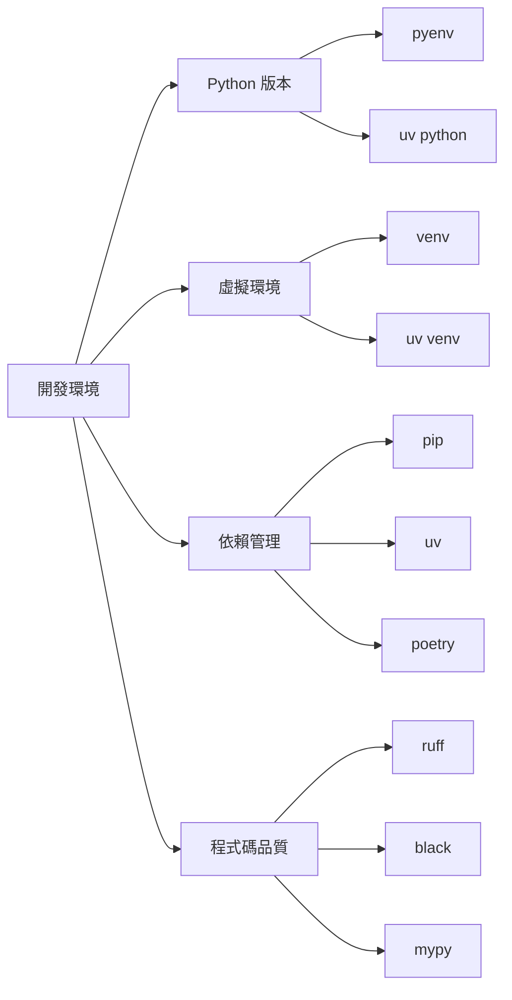

# 01-環境與工具鏈

## 📖 核心概念

Python 開發環境的核心要素：
- **Python 版本管理**: pyenv, uv
- **套件管理**: pip, uv, poetry
- **虛擬環境**: venv, virtualenv
- **程式碼品質**: ruff, black, mypy



## 🔧 uv - 現代化 Python 工具鏈

uv 是用 Rust 編寫的極速 Python 套件管理器，整合了專案管理、依賴解析、虛擬環境等功能。

### Python 版本管理

```bash
# 列出可用版本
uv python list

# 安裝 Python 版本
uv python install 3.12
uv python install 3.13

# 卸載版本
uv python uninstall 3.12

# 設定專案使用的 Python 版本
uv python pin 3.13
```

### 專案管理

#### 初始化專案

```bash
# 方式一：在現有目錄初始化
mkdir myproject && cd myproject
uv init

# 方式二：創建新專案
uv init myproject --python 3.13

# 專案結構
# myproject/
# ├── .python-version      # Python 版本
# ├── pyproject.toml       # 專案配置
# ├── uv.lock              # 依賴鎖定
# └── src/
#     └── myproject/
#         └── __init__.py
```

#### pyproject.toml 範例

```toml
[project]
name = "myproject"
version = "0.1.0"
description = "A modern Python project"
requires-python = ">=3.13"
dependencies = [
    "fastapi>=0.115.0",
    "uvicorn>=0.32.0",
    "pydantic>=2.9.0",
]

[project.optional-dependencies]
dev = [
    "pytest>=8.3.0",
    "ruff>=0.7.0",
    "mypy>=1.13.0",
]

[build-system]
requires = ["hatchling"]
build-backend = "hatchling.build"

[tool.ruff]
line-length = 100
target-version = "py313"
```

### 依賴管理

```bash
# 添加依賴（自動寫入 pyproject.toml）
uv add fastapi uvicorn pydantic

# 添加開發依賴
uv add --dev pytest ruff mypy

# 從 requirements.txt 遷移
uv add -r requirements.txt

# 移除依賴
uv remove requests

# 更新依賴到最新兼容版本
uv lock --upgrade-package fastapi

# 更新所有依賴
uv lock --upgrade

# 查看依賴樹
uv tree
```

### 執行與開發

```bash
# 同步依賴（根據 lock 檔安裝）
uv sync

# 同步開發依賴
uv sync --all-extras

# 執行 Python 程式
uv run main.py

# 執行 Python 指令
uv run python -c "print('Hello')"

# 執行模組
uv run -m pytest

# 進入虛擬環境
source .venv/bin/activate  # Linux/macOS
.venv\Scripts\activate     # Windows
```

### 工具管理

```bash
# 執行一次性工具（不安裝）
uvx ruff check .
uvx black .
uvx pytest

# 安裝全域工具
uv tool install ruff
uv tool install black
uv tool install mypy

# 列出已安裝工具
uv tool list

# 卸載工具
uv tool uninstall ruff

# 更新 shell 環境變數
uv tool update-shell
```

### 打包與發布

```bash
# 打包專案
uv build

# 產出結果
# dist/
# ├── myproject-0.1.0.tar.gz           # source distribution
# └── myproject-0.1.0-py3-none-any.whl # wheel

# 發布到 PyPI
uv publish --token $PYPI_TOKEN
```

## 🔧 傳統工具鏈

### venv - 內建虛擬環境

```bash
# 創建虛擬環境
python -m venv .venv

# 啟動虛擬環境
source .venv/bin/activate  # Linux/macOS
.venv\Scripts\activate     # Windows

# 停用
deactivate
```

### pip - 套件管理

```bash
# 安裝套件
pip install requests

# 安裝特定版本
pip install requests==2.31.0

# 安裝開發模式（可編輯）
pip install -e .

# 凍結依賴
pip freeze > requirements.txt

# 從 requirements.txt 安裝
pip install -r requirements.txt

# 升級套件
pip install --upgrade requests

# 卸載
pip uninstall requests
```

### pyenv - Python 版本管理

```bash
# 列出可安裝版本
pyenv install --list

# 安裝 Python
pyenv install 3.13.0

# 設定全域版本
pyenv global 3.13.0

# 設定本地版本（專案目錄）
pyenv local 3.13.0

# 列出已安裝版本
pyenv versions
```

## 🔧 程式碼品質工具

### Ruff - 極速 Linter & Formatter

```bash
# 檢查程式碼
ruff check .

# 自動修復
ruff check --fix .

# 格式化
ruff format .

# 配置 pyproject.toml
```

```toml
[tool.ruff]
line-length = 100
target-version = "py313"

[tool.ruff.lint]
select = [
    "E",   # pycodestyle errors
    "W",   # pycodestyle warnings
    "F",   # pyflakes
    "I",   # isort
    "B",   # flake8-bugbear
    "C4",  # flake8-comprehensions
    "UP",  # pyupgrade
]
ignore = ["E501"]  # 忽略行長度

[tool.ruff.format]
quote-style = "double"
indent-style = "space"
```

### Mypy - 靜態型別檢查

```bash
# 檢查型別
mypy src/

# 配置
```

```toml
[tool.mypy]
python_version = "3.13"
strict = true
warn_return_any = true
warn_unused_configs = true
disallow_untyped_defs = true
```

## 💡 實戰案例：FastAPI 專案初始化

```bash
# 1. 創建專案
uv init fastapi-app --python 3.13
cd fastapi-app

# 2. 添加依賴
uv add fastapi uvicorn[standard] pydantic pydantic-settings
uv add --dev pytest httpx ruff mypy

# 3. 創建專案結構
mkdir -p src/app/{api,core,models,services}
touch src/app/{__init__,main,config}.py
touch src/app/api/__init__.py
touch src/app/core/__init__.py

# 4. 設定工具
cat >> pyproject.toml << 'EOF'

[tool.ruff]
line-length = 100

[tool.ruff.lint]
select = ["E", "F", "I", "B", "UP"]

[tool.mypy]
strict = true
EOF

# 5. 執行
uv run uvicorn app.main:app --reload
```

### 專案結構範例

```
fastapi-app/
├── .python-version
├── pyproject.toml
├── uv.lock
├── README.md
├── tests/
│   ├── __init__.py
│   └── test_api.py
└── src/
    └── app/
        ├── __init__.py
        ├── main.py
        ├── config.py
        ├── api/
        │   ├── __init__.py
        │   └── routes.py
        ├── core/
        │   ├── __init__.py
        │   └── security.py
        ├── models/
        │   ├── __init__.py
        │   └── user.py
        └── services/
            ├── __init__.py
            └── user_service.py
```

## ⚠️ 常見陷阱

1. **混用套件管理工具**
   ```bash
   # ❌ 不要混用
   uv add requests
   pip install httpx  # 會破壞依賴管理
   
   # ✅ 統一使用一種工具
   uv add requests httpx
   ```

2. **忘記啟動虛擬環境**
   ```bash
   # ❌ 直接執行可能使用系統 Python
   python main.py
   
   # ✅ 使用 uv run 或啟動虛擬環境
   uv run main.py
   # 或
   source .venv/bin/activate && python main.py
   ```

3. **依賴版本未鎖定**
   ```toml
   # ❌ 不指定版本可能導致不可重現
   dependencies = ["fastapi"]
   
   # ✅ 使用 uv.lock 或指定版本範圍
   dependencies = ["fastapi>=0.115.0,<0.116.0"]
   ```

4. **提交虛擬環境到版本控制**
   ```gitignore
   # .gitignore
   .venv/
   __pycache__/
   *.pyc
   .pytest_cache/
   .mypy_cache/
   .ruff_cache/
   ```

## 📊 工具比較

| 工具 | 速度 | 功能 | 生態系統 | 推薦度 |
|------|------|------|----------|--------|
| uv | ⭐⭐⭐⭐⭐ | 全套工具鏈 | 新興 | ⭐⭐⭐⭐⭐ |
| poetry | ⭐⭐⭐ | 專案管理 | 成熟 | ⭐⭐⭐⭐ |
| pip + venv | ⭐⭐ | 基礎功能 | 官方標準 | ⭐⭐⭐ |
| conda | ⭐⭐ | 科學計算 | 跨語言 | ⭐⭐⭐ |

## 💡 最佳實踐

1. **使用 uv 進行現代化開發**
2. **每個專案使用獨立虛擬環境**
3. **鎖定依賴版本（uv.lock）**
4. **使用 ruff 統一程式碼風格**
5. **啟用 mypy 型別檢查**
6. **配置 pre-commit hooks**
7. **文件化專案設置（README.md）**

```bash
# .git/hooks/pre-commit 範例
#!/bin/bash
uv run ruff check .
uv run ruff format --check .
uv run mypy src/
uv run pytest
```
