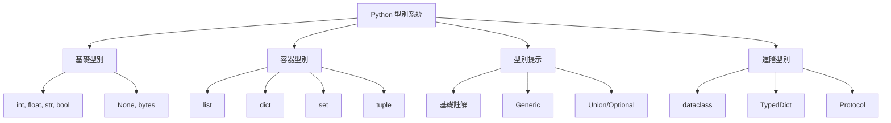

# 02-核心語法與型別系統

## 📖 核心概念

Python 的型別系統與資料結構：
- **內建資料結構**: list, dict, set, tuple
- **型別提示**: Type Hints (PEP 484)
- **資料類別**: dataclass, NamedTuple, TypedDict
- **推導式**: Comprehensions
- **生成器**: Generators



## 🔧 內建資料結構

### List - 動態陣列

```python
# 創建與基本操作
nums = [1, 2, 3, 4, 5]
empty = []
mixed = [1, "hello", 3.14, True]

# 索引與切片
nums[0]        # 1
nums[-1]       # 5 (倒數第一個)
nums[1:3]      # [2, 3] (左閉右開)
nums[:2]       # [1, 2]
nums[2:]       # [3, 4, 5]
nums[::2]      # [1, 3, 5] (步進為 2)
nums[::-1]     # [5, 4, 3, 2, 1] (反轉)

# 修改操作
nums.append(6)           # 尾部添加: [1, 2, 3, 4, 5, 6]
nums.insert(0, 0)        # 指定位置插入: [0, 1, 2, 3, 4, 5, 6]
nums.extend([7, 8])      # 擴展列表: [0, 1, 2, 3, 4, 5, 6, 7, 8]
nums.pop()               # 移除並返回最後元素: 8
nums.pop(0)              # 移除並返回指定位置: 0
nums.remove(3)           # 移除第一個值為 3 的元素
del nums[0]              # 刪除指定位置
nums.clear()             # 清空列表

# 排序與反轉
nums = [3, 1, 4, 1, 5]
nums.sort()              # 原地排序: [1, 1, 3, 4, 5]
nums.sort(reverse=True)  # 降序: [5, 4, 3, 1, 1]
sorted_nums = sorted(nums)  # 返回新列表
nums.reverse()           # 原地反轉

# 查找
nums.index(3)            # 返回第一個值為 3 的索引
nums.count(1)            # 統計值為 1 的元素數量
3 in nums                # True
len(nums)                # 長度
```

### Dict - 字典

```python
# 創建
user = {"name": "Alice", "age": 30, "email": "alice@example.com"}
empty = {}
from_pairs = dict([("a", 1), ("b", 2)])

# 訪問
user["name"]                  # "Alice"
user.get("name")              # "Alice"
user.get("phone", "N/A")      # 不存在返回預設值 "N/A"

# 修改
user["age"] = 31              # 更新
user["phone"] = "123456"      # 新增
user.update({"city": "NY"})   # 批量更新

# 刪除
del user["phone"]             # 刪除鍵
user.pop("email")             # 刪除並返回值
user.popitem()                # 刪除並返回最後插入的鍵值對 (3.7+)
user.clear()                  # 清空

# 迭代
for key in user:              # 迭代鍵
    print(key)

for value in user.values():   # 迭代值
    print(value)

for key, value in user.items():  # 迭代鍵值對
    print(f"{key}: {value}")

# 常用方法
user.keys()                   # dict_keys(['name', 'age'])
user.values()                 # dict_values(['Alice', 30])
user.items()                  # dict_items([('name', 'Alice'), ('age', 30)])
"name" in user                # True

# 字典推導式
squares = {x: x**2 for x in range(5)}  # {0: 0, 1: 1, 2: 4, 3: 9, 4: 16}
```

### Set - 集合

```python
# 創建
s = {1, 2, 3, 4, 5}
empty = set()                 # 注意: {} 是空字典
from_list = set([1, 2, 2, 3]) # {1, 2, 3} 自動去重

# 添加與刪除
s.add(6)                      # 添加元素
s.update([7, 8, 9])           # 批量添加
s.remove(1)                   # 移除元素（不存在會報錯）
s.discard(1)                  # 移除元素（不存在不報錯）
s.pop()                       # 隨機移除並返回元素
s.clear()                     # 清空

# 集合運算
a = {1, 2, 3, 4}
b = {3, 4, 5, 6}

a | b                         # {1, 2, 3, 4, 5, 6} 聯集
a & b                         # {3, 4} 交集
a - b                         # {1, 2} 差集
a ^ b                         # {1, 2, 5, 6} 對稱差集

# 子集與超集
{1, 2}.issubset({1, 2, 3})    # True
{1, 2, 3}.issuperset({1, 2})  # True

# 成員檢查（O(1)）
3 in a                        # True
```

### Tuple - 不可變序列

```python
# 創建
point = (3, 4)
single = (1,)                 # 單元素需要逗號
empty = ()

# 訪問
point[0]                      # 3
x, y = point                  # 解包
point[1] = 5                  # TypeError: 不可修改

# 用途：作為字典鍵
locations = {
    (0, 0): "origin",
    (1, 0): "right",
}
```

## 🔧 型別提示 (Type Hints)

### 基礎型別註解

```python
from typing import List, Dict, Set, Tuple, Optional, Union

# 基礎型別
name: str = "Alice"
age: int = 30
height: float = 5.6
is_active: bool = True

# 容器型別
numbers: list[int] = [1, 2, 3]              # Python 3.9+
names: List[str] = ["Alice", "Bob"]         # Python 3.8-
scores: dict[str, int] = {"math": 90}       # Python 3.9+
old_scores: Dict[str, int] = {"math": 90}   # Python 3.8-

# 可選型別
email: Optional[str] = None                 # str 或 None
email: str | None = None                    # Python 3.10+

# 聯合型別
user_id: Union[int, str] = "user_123"       # int 或 str
user_id: int | str = 123                    # Python 3.10+

# 函數註解
def greet(name: str, age: int = 0) -> str:
    return f"Hello {name}, you are {age} years old"

def process_data(data: list[dict[str, int]]) -> None:
    for item in data:
        print(item)
```

### 進階型別

```python
from typing import Any, Callable, Literal, TypeAlias, TypeVar

# Any - 任意型別
data: Any = "anything"

# Callable - 函數型別
def apply(func: Callable[[int, int], int], x: int, y: int) -> int:
    return func(x, y)

apply(lambda a, b: a + b, 1, 2)  # 3

# Literal - 字面值型別
def set_mode(mode: Literal["read", "write", "append"]) -> None:
    print(f"Mode: {mode}")

# TypeAlias - 型別別名
Vector: TypeAlias = list[float]
Matrix: TypeAlias = list[Vector]

# TypeVar - 泛型
T = TypeVar("T")

def first(items: list[T]) -> T | None:
    return items[0] if items else None

first([1, 2, 3])      # 推斷為 int
first(["a", "b"])     # 推斷為 str
```

## 🔧 資料類別

### dataclass - 資料類

```python
from dataclasses import dataclass, field
from datetime import datetime

@dataclass
class User:
    id: int
    name: str
    email: str
    created_at: datetime = field(default_factory=datetime.now)
    tags: list[str] = field(default_factory=list)
    
    def __post_init__(self):
        self.email = self.email.lower()

# 使用
user = User(id=1, name="Alice", email="ALICE@example.com")
print(user)
# User(id=1, name='Alice', email='alice@example.com', created_at=..., tags=[])

# 自動生成 __init__, __repr__, __eq__ 等方法

@dataclass(frozen=True)  # 不可變
class Point:
    x: float
    y: float

@dataclass(order=True)  # 可比較大小
class Score:
    value: int
    student: str = field(compare=False)  # 比較時忽略此欄位
```

### NamedTuple - 具名元組

```python
from typing import NamedTuple

class Point(NamedTuple):
    x: float
    y: float
    
    def distance(self) -> float:
        return (self.x ** 2 + self.y ** 2) ** 0.5

p = Point(3.0, 4.0)
print(p.x, p.y)        # 3.0 4.0
print(p.distance())    # 5.0
print(p[0])            # 3.0 (仍可用索引訪問)

# 不可變
p.x = 5  # AttributeError
```

### TypedDict - 型別化字典

```python
from typing import TypedDict, NotRequired

class UserDict(TypedDict):
    id: int
    name: str
    email: str
    age: NotRequired[int]  # 可選欄位

def create_user(user: UserDict) -> None:
    print(user["name"])

user: UserDict = {
    "id": 1,
    "name": "Alice",
    "email": "alice@example.com",
}
create_user(user)
```

## 🔧 推導式 (Comprehensions)

### List Comprehension

```python
# 基礎
squares = [x**2 for x in range(10)]
# [0, 1, 4, 9, 16, 25, 36, 49, 64, 81]

# 帶條件
evens = [x for x in range(10) if x % 2 == 0]
# [0, 2, 4, 6, 8]

# 雙重迴圈
pairs = [(x, y) for x in range(3) for y in range(3) if x != y]
# [(0, 1), (0, 2), (1, 0), (1, 2), (2, 0), (2, 1)]

# 實際應用：展平二維列表
matrix = [[1, 2, 3], [4, 5, 6], [7, 8, 9]]
flat = [num for row in matrix for num in row]
# [1, 2, 3, 4, 5, 6, 7, 8, 9]
```

### Dict Comprehension

```python
# 基礎
squares = {x: x**2 for x in range(5)}
# {0: 0, 1: 1, 2: 4, 3: 9, 4: 16}

# 條件過濾
even_squares = {x: x**2 for x in range(10) if x % 2 == 0}

# 鍵值互換
original = {"a": 1, "b": 2, "c": 3}
swapped = {v: k for k, v in original.items()}
# {1: 'a', 2: 'b', 3: 'c'}

# 實際應用：統計字母出現次數
text = "hello world"
char_count = {char: text.count(char) for char in set(text) if char != " "}
```

### Set Comprehension

```python
# 基礎
unique_lengths = {len(word) for word in ["hello", "world", "hi"]}
# {2, 5}

# 實際應用：提取所有獨特字母
text = "hello world"
unique_chars = {char for char in text if char.isalpha()}
```

## 🔧 生成器 (Generators)

### Generator Expression

```python
# 類似 list comprehension，但使用圓括號
gen = (x**2 for x in range(1000000))  # 不立即計算

# 惰性求值
for val in gen:
    if val > 100:
        break
    print(val)
```

### Generator Function

```python
def fibonacci(n: int):
    a, b = 0, 1
    for _ in range(n):
        yield a
        a, b = b, a + b

for num in fibonacci(10):
    print(num)  # 0 1 1 2 3 5 8 13 21 34

# 實際應用：讀取大檔案
def read_large_file(file_path: str):
    with open(file_path) as f:
        for line in f:
            yield line.strip()

for line in read_large_file("large.txt"):
    process(line)
```

## 💡 實戰案例：資料處理

```python
from dataclasses import dataclass
from typing import Iterator

@dataclass
class Transaction:
    id: int
    amount: float
    category: str
    is_income: bool

# 模擬資料
transactions = [
    Transaction(1, 1000.0, "salary", True),
    Transaction(2, 50.0, "food", False),
    Transaction(3, 200.0, "shopping", False),
    Transaction(4, 500.0, "bonus", True),
    Transaction(5, 30.0, "food", False),
]

# 使用推導式計算總收入
total_income = sum(t.amount for t in transactions if t.is_income)
print(f"Total income: ${total_income}")  # $1500.0

# 按類別分組（使用字典推導式）
from itertools import groupby

transactions_sorted = sorted(transactions, key=lambda t: t.category)
by_category = {
    category: list(group) 
    for category, group in groupby(transactions_sorted, key=lambda t: t.category)
}

# 生成器：處理大量交易記錄
def process_transactions(trans: list[Transaction]) -> Iterator[dict[str, float]]:
    for t in trans:
        yield {
            "id": t.id,
            "net_amount": t.amount if t.is_income else -t.amount,
            "category": t.category,
        }

for record in process_transactions(transactions):
    print(record)
```

## ⚠️ 常見陷阱

### 1. 可變預設參數

```python
# ❌ 錯誤：可變預設參數會在所有呼叫間共享
def add_item(item: str, items: list[str] = []) -> list[str]:
    items.append(item)
    return items

print(add_item("a"))  # ['a']
print(add_item("b"))  # ['a', 'b']  # 預期是 ['b']

# ✅ 正確：使用 None 並在函數內創建
def add_item(item: str, items: list[str] | None = None) -> list[str]:
    if items is None:
        items = []
    items.append(item)
    return items
```

### 2. 迴圈變數閉包

```python
# ❌ 錯誤：所有函數共享相同的 i
funcs = [lambda: i for i in range(5)]
print([f() for f in funcs])  # [4, 4, 4, 4, 4]

# ✅ 正確：使用預設參數捕獲當前值
funcs = [lambda i=i: i for i in range(5)]
print([f() for f in funcs])  # [0, 1, 2, 3, 4]
```

### 3. 字典鍵的可變性

```python
# ❌ 錯誤：list 不可作為字典鍵
d = {[1, 2]: "value"}  # TypeError

# ✅ 正確：使用 tuple
d = {(1, 2): "value"}
```

### 4. 集合修改時迭代

```python
# ❌ 錯誤：迭代時修改集合
s = {1, 2, 3, 4, 5}
for item in s:
    if item % 2 == 0:
        s.remove(item)  # RuntimeError

# ✅ 正確：創建副本迭代
s = {1, 2, 3, 4, 5}
for item in list(s):
    if item % 2 == 0:
        s.remove(item)
```

## 💡 最佳實踐

1. **使用型別提示提升程式碼可讀性**
   ```python
   def process_users(users: list[dict[str, Any]]) -> list[User]:
       ...
   ```

2. **優先使用 dataclass 而非普通類**
   ```python
   @dataclass
   class Config:
       host: str
       port: int
       timeout: float = 30.0
   ```

3. **使用推導式替代 map/filter**
   ```python
   # ✅ 清晰
   squares = [x**2 for x in nums if x > 0]
   
   # ❌ 難讀
   squares = list(map(lambda x: x**2, filter(lambda x: x > 0, nums)))
   ```

4. **大數據集使用生成器**
   ```python
   # 節省記憶體
   total = sum(x**2 for x in range(1000000))
   ```

5. **善用 get() 避免 KeyError**
   ```python
   value = user.get("email", "no-email@example.com")
   ```
