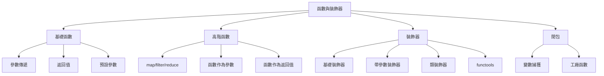

# 03-函數與裝飾器

## 📖 核心概念

Python 函數式編程特性：
- **函數定義**: 參數、返回值、預設參數
- **高階函數**: 函數作為參數/返回值
- **裝飾器**: 函數包裝器
- **閉包**: 函數捕獲外部變數
- **Lambda**: 匿名函數



## 🔧 函數基礎

### 函數定義與參數

```python
# 基本函數
def greet(name: str) -> str:
    return f"Hello, {name}!"

# 多個參數
def add(a: int, b: int) -> int:
    return a + b

# 預設參數
def greet(name: str, greeting: str = "Hello") -> str:
    return f"{greeting}, {name}!"

greet("Alice")              # "Hello, Alice!"
greet("Bob", "Hi")          # "Hi, Bob!"

# 關鍵字參數
def create_user(name: str, *, email: str, age: int) -> dict:
    return {"name": name, "email": email, "age": age}

create_user("Alice", email="alice@example.com", age=30)

# 可變位置參數 (*args)
def sum_all(*numbers: int) -> int:
    return sum(numbers)

sum_all(1, 2, 3, 4, 5)  # 15

# 可變關鍵字參數 (**kwargs)
def create_config(**options: str) -> dict[str, str]:
    return options

create_config(host="localhost", port="8000")
# {"host": "localhost", "port": "8000"}

# 組合使用
def process(required: str, *args: int, **kwargs: str) -> None:
    print(f"Required: {required}")
    print(f"Args: {args}")
    print(f"Kwargs: {kwargs}")

process("data", 1, 2, 3, debug="true", mode="fast")
```

### 參數解包

```python
# 位置參數解包
def add(a: int, b: int, c: int) -> int:
    return a + b + c

numbers = [1, 2, 3]
result = add(*numbers)  # 等同於 add(1, 2, 3)

# 關鍵字參數解包
def create_user(name: str, email: str, age: int) -> dict:
    return {"name": name, "email": email, "age": age}

user_data = {"name": "Alice", "email": "alice@example.com", "age": 30}
user = create_user(**user_data)
```

### 多返回值

```python
def get_min_max(numbers: list[int]) -> tuple[int, int]:
    return min(numbers), max(numbers)

minimum, maximum = get_min_max([1, 5, 3, 9, 2])
print(minimum, maximum)  # 1 9

# 使用 NamedTuple
from typing import NamedTuple

class MinMax(NamedTuple):
    min: int
    max: int

def get_min_max(numbers: list[int]) -> MinMax:
    return MinMax(min=min(numbers), max=max(numbers))

result = get_min_max([1, 5, 3, 9, 2])
print(result.min, result.max)  # 1 9
```

## 🔧 高階函數

### 函數作為參數

```python
from typing import Callable

def apply_operation(
    x: int, 
    y: int, 
    operation: Callable[[int, int], int]
) -> int:
    return operation(x, y)

def add(a: int, b: int) -> int:
    return a + b

def multiply(a: int, b: int) -> int:
    return a * b

apply_operation(5, 3, add)       # 8
apply_operation(5, 3, multiply)  # 15
apply_operation(5, 3, lambda a, b: a - b)  # 2
```

### 函數作為返回值

```python
def make_multiplier(n: int) -> Callable[[int], int]:
    def multiplier(x: int) -> int:
        return x * n
    return multiplier

double = make_multiplier(2)
triple = make_multiplier(3)

print(double(5))  # 10
print(triple(5))  # 15
```

### 內建高階函數

```python
# map - 映射
numbers = [1, 2, 3, 4, 5]
squared = list(map(lambda x: x**2, numbers))
# [1, 4, 9, 16, 25]

# filter - 過濾
evens = list(filter(lambda x: x % 2 == 0, numbers))
# [2, 4]

# reduce - 累積
from functools import reduce
total = reduce(lambda acc, x: acc + x, numbers, 0)
# 15

# 實際開發更推薦使用推導式
squared = [x**2 for x in numbers]
evens = [x for x in numbers if x % 2 == 0]
total = sum(numbers)
```

## 🔧 閉包 (Closures)

### 基礎閉包

```python
def make_counter():
    count = 0
    
    def increment():
        nonlocal count  # 修改外部變數
        count += 1
        return count
    
    return increment

counter1 = make_counter()
counter2 = make_counter()

print(counter1())  # 1
print(counter1())  # 2
print(counter2())  # 1
```

### 實際應用：記憶化

```python
def memoize(func: Callable) -> Callable:
    cache = {}
    
    def wrapper(*args):
        if args not in cache:
            cache[args] = func(*args)
        return cache[args]
    
    return wrapper

@memoize
def fibonacci(n: int) -> int:
    if n <= 1:
        return n
    return fibonacci(n - 1) + fibonacci(n - 2)

print(fibonacci(100))  # 快速計算
```

## 🔧 裝飾器 (Decorators)

### 基礎裝飾器

```python
from functools import wraps
import time

def timer(func: Callable) -> Callable:
    @wraps(func)  # 保留原函數的 metadata
    def wrapper(*args, **kwargs):
        start = time.time()
        result = func(*args, **kwargs)
        end = time.time()
        print(f"{func.__name__} took {end - start:.4f}s")
        return result
    return wrapper

@timer
def slow_function():
    time.sleep(1)
    return "Done"

slow_function()  # slow_function took 1.0001s
```

### 帶參數的裝飾器

```python
def repeat(times: int):
    def decorator(func: Callable) -> Callable:
        @wraps(func)
        def wrapper(*args, **kwargs):
            for _ in range(times):
                result = func(*args, **kwargs)
            return result
        return wrapper
    return decorator

@repeat(times=3)
def greet(name: str):
    print(f"Hello, {name}!")

greet("Alice")
# Hello, Alice!
# Hello, Alice!
# Hello, Alice!
```

### 常用裝飾器模式

```python
from functools import wraps
from typing import Any
import logging

# 日誌裝飾器
def log_calls(func: Callable) -> Callable:
    @wraps(func)
    def wrapper(*args, **kwargs):
        logging.info(f"Calling {func.__name__} with {args}, {kwargs}")
        result = func(*args, **kwargs)
        logging.info(f"{func.__name__} returned {result}")
        return result
    return wrapper

# 驗證裝飾器
def validate_positive(func: Callable) -> Callable:
    @wraps(func)
    def wrapper(x: int):
        if x < 0:
            raise ValueError("x must be positive")
        return func(x)
    return wrapper

@validate_positive
def square_root(x: int) -> float:
    return x ** 0.5

# 快取裝飾器
from functools import lru_cache

@lru_cache(maxsize=128)
def expensive_computation(n: int) -> int:
    time.sleep(0.1)
    return n * n

# 重試裝飾器
def retry(max_attempts: int = 3, delay: float = 1.0):
    def decorator(func: Callable) -> Callable:
        @wraps(func)
        def wrapper(*args, **kwargs):
            for attempt in range(max_attempts):
                try:
                    return func(*args, **kwargs)
                except Exception as e:
                    if attempt == max_attempts - 1:
                        raise
                    logging.warning(f"Attempt {attempt + 1} failed: {e}")
                    time.sleep(delay)
        return wrapper
    return decorator

@retry(max_attempts=3, delay=0.5)
def unstable_api_call():
    import random
    if random.random() < 0.7:
        raise Exception("API Error")
    return "Success"
```

### 類裝飾器

```python
class CountCalls:
    def __init__(self, func: Callable):
        self.func = func
        self.count = 0
    
    def __call__(self, *args, **kwargs):
        self.count += 1
        print(f"Call {self.count} of {self.func.__name__}")
        return self.func(*args, **kwargs)

@CountCalls
def say_hello():
    print("Hello!")

say_hello()  # Call 1 of say_hello
say_hello()  # Call 2 of say_hello
```

### 疊加裝飾器

```python
@timer
@log_calls
@validate_positive
def process_number(x: int) -> int:
    return x * 2

# 執行順序：validate_positive -> log_calls -> timer
# 等同於：timer(log_calls(validate_positive(process_number)))
```

## 💡 functools 模組

### partial - 部分應用

```python
from functools import partial

def power(base: int, exponent: int) -> int:
    return base ** exponent

square = partial(power, exponent=2)
cube = partial(power, exponent=3)

print(square(5))  # 25
print(cube(5))    # 125

# 實際應用：預設參數
from functools import partial
import json

dump_json = partial(json.dumps, indent=2, ensure_ascii=False)
data = {"name": "王小明", "age": 30}
print(dump_json(data))
```

### wraps - 保留函數 metadata

```python
from functools import wraps

def my_decorator(func):
    @wraps(func)  # 保留 __name__, __doc__ 等
    def wrapper(*args, **kwargs):
        return func(*args, **kwargs)
    return wrapper

@my_decorator
def example():
    """This is an example function"""
    pass

print(example.__name__)  # "example" (不是 "wrapper")
print(example.__doc__)   # "This is an example function"
```

### lru_cache - LRU 快取

```python
from functools import lru_cache

@lru_cache(maxsize=128)
def fibonacci(n: int) -> int:
    if n <= 1:
        return n
    return fibonacci(n - 1) + fibonacci(n - 2)

# 查看快取統計
print(fibonacci(100))
print(fibonacci.cache_info())
# CacheInfo(hits=98, misses=101, maxsize=128, currsize=101)

# 清除快取
fibonacci.cache_clear()
```

### singledispatch - 單分派泛型函數

```python
from functools import singledispatch

@singledispatch
def process(value):
    raise NotImplementedError(f"Cannot process {type(value)}")

@process.register(int)
def _(value: int):
    return value * 2

@process.register(str)
def _(value: str):
    return value.upper()

@process.register(list)
def _(value: list):
    return len(value)

print(process(5))        # 10
print(process("hello"))  # "HELLO"
print(process([1, 2]))   # 2
```

## 💡 實戰案例：Web API 裝飾器

```python
from functools import wraps
from typing import Callable, Any
import time
import logging

# 認證裝飾器
def require_auth(func: Callable) -> Callable:
    @wraps(func)
    def wrapper(request: dict, *args, **kwargs):
        if not request.get("auth_token"):
            raise PermissionError("Authentication required")
        return func(request, *args, **kwargs)
    return wrapper

# 速率限制裝飾器
def rate_limit(max_calls: int, period: float):
    calls = []
    
    def decorator(func: Callable) -> Callable:
        @wraps(func)
        def wrapper(*args, **kwargs):
            now = time.time()
            calls[:] = [call for call in calls if call > now - period]
            
            if len(calls) >= max_calls:
                raise Exception("Rate limit exceeded")
            
            calls.append(now)
            return func(*args, **kwargs)
        return wrapper
    return decorator

# 驗證裝飾器
def validate_schema(schema: dict):
    def decorator(func: Callable) -> Callable:
        @wraps(func)
        def wrapper(data: dict, *args, **kwargs):
            for field, field_type in schema.items():
                if field not in data:
                    raise ValueError(f"Missing field: {field}")
                if not isinstance(data[field], field_type):
                    raise TypeError(f"Invalid type for {field}")
            return func(data, *args, **kwargs)
        return wrapper
    return decorator

# 組合使用
@require_auth
@rate_limit(max_calls=10, period=60.0)
@validate_schema({"username": str, "email": str})
def create_user(request: dict, data: dict) -> dict:
    logging.info(f"Creating user: {data['username']}")
    return {"id": 1, "username": data["username"], "email": data["email"]}

# 使用
request = {"auth_token": "secret"}
user_data = {"username": "alice", "email": "alice@example.com"}
user = create_user(request, user_data)
print(user)
```

## ⚠️ 常見陷阱

### 1. 裝飾器忘記使用 @wraps

```python
# ❌ 錯誤：遺失原函數資訊
def my_decorator(func):
    def wrapper(*args, **kwargs):
        return func(*args, **kwargs)
    return wrapper

@my_decorator
def example():
    """Original docstring"""
    pass

print(example.__name__)  # "wrapper" (錯誤)

# ✅ 正確
from functools import wraps

def my_decorator(func):
    @wraps(func)
    def wrapper(*args, **kwargs):
        return func(*args, **kwargs)
    return wrapper
```

### 2. 閉包中的可變預設參數

```python
# ❌ 錯誤
def make_adders():
    funcs = []
    for i in range(5):
        funcs.append(lambda x: x + i)
    return funcs

adders = make_adders()
print(adders[0](10))  # 14 (預期是 10)

# ✅ 正確：使用預設參數捕獲
def make_adders():
    return [lambda x, i=i: x + i for i in range(5)]
```

### 3. 裝飾器參數與函數混淆

```python
# ❌ 錯誤：期望帶參數但未提供
def repeat(times: int = 2):
    def decorator(func):
        @wraps(func)
        def wrapper(*args, **kwargs):
            for _ in range(times):
                result = func(*args, **kwargs)
            return result
        return wrapper
    return decorator

@repeat  # TypeError: missing required argument
def greet():
    print("Hello")

# ✅ 正確
@repeat()  # 或 @repeat(times=3)
def greet():
    print("Hello")
```

## 💡 最佳實踐

1. **使用型別提示提升可讀性**
   ```python
   def timer(func: Callable[..., Any]) -> Callable[..., Any]:
       ...
   ```

2. **裝飾器總是使用 @wraps**
   ```python
   from functools import wraps
   
   def my_decorator(func):
       @wraps(func)
       def wrapper(*args, **kwargs):
           ...
   ```

3. **使用 functools.lru_cache 快取昂貴計算**
   ```python
   @lru_cache(maxsize=128)
   def expensive_function(n: int) -> int:
       ...
   ```

4. **優先使用 partial 而非 lambda**
   ```python
   # ✅ 清晰
   double = partial(multiply, 2)
   
   # ❌ 難讀
   double = lambda x: multiply(2, x)
   ```

5. **裝飾器保持單一職責**
   ```python
   # ✅ 好的設計
   @timer
   @log_calls
   @validate_input
   def process():
       ...
   ```
