# 04-物件導向與協議

## 📖 核心概念

Python 的物件導向編程：
- **類與實例**: 類定義、實例化
- **繼承**: 單繼承、多重繼承、MRO
- **封裝**: 屬性、方法、存取控制
- **特殊方法**: Magic Methods / Dunder Methods
- **協議**: Protocol、ABC

```mermaid
graph TD
    A[物件導向] --> B[基礎概念]
    A --> C[繼承體系]
    A --> D[特殊方法]
    A --> E[進階特性]
    
    B --> B1[類定義]
    B --> B2[實例屬性]
    B --> B3[類屬性]
    B --> B4[方法]
    
    C --> C1[單繼承]
    C --> C2[多重繼承]
    C --> C3[MRO]
    
    D --> D1[__init__]
    D --> D2[__str__/__repr__]
    D --> D3[__call__]
    D --> D4[運算符重載]
    
    E --> E1[Property]
    E --> E2[Descriptor]
    E --> E3[Protocol]
    E --> E4[ABC]
```



## 🔧 類與實例

### 基本類定義

```python
class User:
    species = "Homo sapiens"  # 類屬性
    
    def __init__(self, name: str, age: int):
        self.name = name      # 實例屬性
        self.age = age
    
    def greet(self) -> str:   # 實例方法
        return f"Hello, I'm {self.name}"
    
    @classmethod
    def from_birth_year(cls, name: str, birth_year: int) -> "User":
        age = 2024 - birth_year
        return cls(name, age)
    
    @staticmethod
    def is_adult(age: int) -> bool:
        return age >= 18

# 使用
user = User("Alice", 30)
print(user.greet())          # "Hello, I'm Alice"
print(User.species)          # "Homo sapiens"

user2 = User.from_birth_year("Bob", 1995)
print(User.is_adult(20))     # True
```

### 實例屬性 vs 類屬性

```python
class Counter:
    count = 0  # 類屬性（所有實例共享）
    
    def __init__(self, name: str):
        self.name = name        # 實例屬性
        Counter.count += 1      # 修改類屬性
        self.instance_id = Counter.count

c1 = Counter("first")
c2 = Counter("second")

print(Counter.count)     # 2
print(c1.instance_id)    # 1
print(c2.instance_id)    # 2
```

### 私有屬性

```python
class BankAccount:
    def __init__(self, balance: float):
        self.__balance = balance  # 私有屬性（名稱改寫）
    
    def deposit(self, amount: float) -> None:
        if amount > 0:
            self.__balance += amount
    
    def get_balance(self) -> float:
        return self.__balance

account = BankAccount(1000)
account.deposit(500)
print(account.get_balance())  # 1500
print(account.__balance)      # AttributeError
print(account._BankAccount__balance)  # 1500 (可訪問但不推薦)
```

## 🔧 繼承

### 單繼承

```python
class Animal:
    def __init__(self, name: str):
        self.name = name
    
    def speak(self) -> str:
        raise NotImplementedError("Subclass must implement")

class Dog(Animal):
    def speak(self) -> str:
        return f"{self.name} says Woof!"

class Cat(Animal):
    def speak(self) -> str:
        return f"{self.name} says Meow!"

dog = Dog("Buddy")
print(dog.speak())  # "Buddy says Woof!"

# isinstance 和 issubclass
print(isinstance(dog, Dog))      # True
print(isinstance(dog, Animal))   # True
print(issubclass(Dog, Animal))   # True
```

### super() 使用

```python
class Person:
    def __init__(self, name: str, age: int):
        self.name = name
        self.age = age

class Employee(Person):
    def __init__(self, name: str, age: int, employee_id: str):
        super().__init__(name, age)  # 調用父類 __init__
        self.employee_id = employee_id

emp = Employee("Alice", 30, "E001")
print(emp.name, emp.employee_id)  # Alice E001
```

### 多重繼承與 MRO

```python
class A:
    def method(self):
        print("A")

class B(A):
    def method(self):
        print("B")
        super().method()

class C(A):
    def method(self):
        print("C")
        super().method()

class D(B, C):
    def method(self):
        print("D")
        super().method()

d = D()
d.method()
# 輸出: D B C A

# 查看方法解析順序 (MRO)
print(D.__mro__)
# (<class 'D'>, <class 'B'>, <class 'C'>, <class 'A'>, <class 'object'>)
```

## 🔧 特殊方法 (Magic Methods)

### 初始化與表示

```python
class Point:
    def __init__(self, x: float, y: float):
        self.x = x
        self.y = y
    
    def __repr__(self) -> str:
        return f"Point({self.x}, {self.y})"
    
    def __str__(self) -> str:
        return f"({self.x}, {self.y})"

p = Point(3, 4)
print(repr(p))  # "Point(3, 4)" - 開發者用
print(str(p))   # "(3, 4)" - 使用者用
print(p)        # "(3, 4)"
```

### 運算符重載

```python
class Vector:
    def __init__(self, x: float, y: float):
        self.x = x
        self.y = y
    
    def __add__(self, other: "Vector") -> "Vector":
        return Vector(self.x + other.x, self.y + other.y)
    
    def __sub__(self, other: "Vector") -> "Vector":
        return Vector(self.x - other.x, self.y - other.y)
    
    def __mul__(self, scalar: float) -> "Vector":
        return Vector(self.x * scalar, self.y * scalar)
    
    def __eq__(self, other: object) -> bool:
        if not isinstance(other, Vector):
            return NotImplemented
        return self.x == other.x and self.y == other.y
    
    def __repr__(self) -> str:
        return f"Vector({self.x}, {self.y})"

v1 = Vector(1, 2)
v2 = Vector(3, 4)

print(v1 + v2)    # Vector(4, 6)
print(v1 * 2)     # Vector(2, 4)
print(v1 == v2)   # False
```

### 容器協議

```python
class Stack:
    def __init__(self):
        self._items: list = []
    
    def __len__(self) -> int:
        return len(self._items)
    
    def __getitem__(self, index: int):
        return self._items[index]
    
    def __setitem__(self, index: int, value) -> None:
        self._items[index] = value
    
    def __contains__(self, item) -> bool:
        return item in self._items
    
    def __iter__(self):
        return iter(self._items)
    
    def push(self, item) -> None:
        self._items.append(item)
    
    def pop(self):
        return self._items.pop()

stack = Stack()
stack.push(1)
stack.push(2)
stack.push(3)

print(len(stack))       # 3
print(stack[0])         # 1
print(2 in stack)       # True
print(list(stack))      # [1, 2, 3]
```

### 上下文管理器

```python
class FileManager:
    def __init__(self, filename: str, mode: str):
        self.filename = filename
        self.mode = mode
        self.file = None
    
    def __enter__(self):
        self.file = open(self.filename, self.mode)
        return self.file
    
    def __exit__(self, exc_type, exc_val, exc_tb):
        if self.file:
            self.file.close()
        return False  # 不壓制異常

# 使用
with FileManager("test.txt", "w") as f:
    f.write("Hello, World!")
```

### 可調用對象

```python
class Multiplier:
    def __init__(self, factor: int):
        self.factor = factor
    
    def __call__(self, x: int) -> int:
        return x * self.factor

double = Multiplier(2)
triple = Multiplier(3)

print(double(5))  # 10
print(triple(5))  # 15
```

## 🔧 Property 與 Descriptor

### Property - 屬性裝飾器

```python
class Temperature:
    def __init__(self, celsius: float):
        self._celsius = celsius
    
    @property
    def celsius(self) -> float:
        return self._celsius
    
    @celsius.setter
    def celsius(self, value: float) -> None:
        if value < -273.15:
            raise ValueError("Temperature below absolute zero")
        self._celsius = value
    
    @property
    def fahrenheit(self) -> float:
        return self._celsius * 9/5 + 32
    
    @fahrenheit.setter
    def fahrenheit(self, value: float) -> None:
        self.celsius = (value - 32) * 5/9

temp = Temperature(25)
print(temp.celsius)      # 25
print(temp.fahrenheit)   # 77.0

temp.fahrenheit = 86
print(temp.celsius)      # 30.0
```

### Descriptor - 描述器

```python
class Validator:
    def __init__(self, min_value: int, max_value: int):
        self.min_value = min_value
        self.max_value = max_value
    
    def __set_name__(self, owner, name):
        self.name = f"_{name}"
    
    def __get__(self, instance, owner):
        if instance is None:
            return self
        return getattr(instance, self.name)
    
    def __set__(self, instance, value):
        if not self.min_value <= value <= self.max_value:
            raise ValueError(f"Value must be between {self.min_value} and {self.max_value}")
        setattr(instance, self.name, value)

class Person:
    age = Validator(0, 150)
    
    def __init__(self, age: int):
        self.age = age

person = Person(30)
print(person.age)  # 30
person.age = 200   # ValueError
```

## 🔧 抽象基類 (ABC)

```python
from abc import ABC, abstractmethod

class Shape(ABC):
    @abstractmethod
    def area(self) -> float:
        pass
    
    @abstractmethod
    def perimeter(self) -> float:
        pass

class Rectangle(Shape):
    def __init__(self, width: float, height: float):
        self.width = width
        self.height = height
    
    def area(self) -> float:
        return self.width * self.height
    
    def perimeter(self) -> float:
        return 2 * (self.width + self.height)

class Circle(Shape):
    def __init__(self, radius: float):
        self.radius = radius
    
    def area(self) -> float:
        import math
        return math.pi * self.radius ** 2
    
    def perimeter(self) -> float:
        import math
        return 2 * math.pi * self.radius

# shape = Shape()  # TypeError: 無法實例化抽象類
rect = Rectangle(5, 3)
print(rect.area())  # 15.0
```

## 🔧 Protocol - 結構子型別

```python
from typing import Protocol

class Drawable(Protocol):
    def draw(self) -> str:
        ...

class Circle:
    def draw(self) -> str:
        return "Drawing a circle"

class Square:
    def draw(self) -> str:
        return "Drawing a square"

def render(shape: Drawable) -> None:
    print(shape.draw())

# 無需繼承 Drawable，只需實現 draw 方法
render(Circle())  # "Drawing a circle"
render(Square())  # "Drawing a square"
```

## 💡 實戰案例：構建靈活的配置系統

```python
from abc import ABC, abstractmethod
from typing import Any, Protocol
from dataclasses import dataclass

class ConfigSource(ABC):
    @abstractmethod
    def load(self) -> dict[str, Any]:
        pass

class FileConfigSource(ConfigSource):
    def __init__(self, file_path: str):
        self.file_path = file_path
    
    def load(self) -> dict[str, Any]:
        import json
        with open(self.file_path) as f:
            return json.load(f)

class EnvConfigSource(ConfigSource):
    def load(self) -> dict[str, Any]:
        import os
        return dict(os.environ)

@dataclass
class DatabaseConfig:
    host: str
    port: int
    username: str
    password: str
    
    @classmethod
    def from_dict(cls, data: dict[str, Any]) -> "DatabaseConfig":
        return cls(
            host=data["db_host"],
            port=int(data["db_port"]),
            username=data["db_user"],
            password=data["db_password"],
        )

class ConfigManager:
    def __init__(self, source: ConfigSource):
        self._source = source
        self._cache: dict[str, Any] | None = None
    
    def load(self) -> None:
        self._cache = self._source.load()
    
    def get_database_config(self) -> DatabaseConfig:
        if self._cache is None:
            self.load()
        return DatabaseConfig.from_dict(self._cache)

# 使用
config_manager = ConfigManager(FileConfigSource("config.json"))
db_config = config_manager.get_database_config()
print(f"Connecting to {db_config.host}:{db_config.port}")
```

## ⚠️ 常見陷阱

### 1. 可變類屬性

```python
# ❌ 錯誤：所有實例共享同一個 list
class MyClass:
    items = []
    
    def add_item(self, item):
        self.items.append(item)

obj1 = MyClass()
obj2 = MyClass()
obj1.add_item("a")
obj2.add_item("b")
print(obj1.items)  # ['a', 'b']

# ✅ 正確：在 __init__ 中初始化
class MyClass:
    def __init__(self):
        self.items = []
```

### 2. 忘記 self 參數

```python
# ❌ 錯誤
class MyClass:
    def method():  # 缺少 self
        print("Hello")

# ✅ 正確
class MyClass:
    def method(self):
        print("Hello")
```

### 3. super() 使用不當

```python
# ❌ 錯誤：硬編碼父類名稱
class Child(Parent):
    def __init__(self):
        Parent.__init__(self)  # 多重繼承時有問題

# ✅ 正確
class Child(Parent):
    def __init__(self):
        super().__init__()
```

### 4. 混淆 @classmethod 和 @staticmethod

```python
class MyClass:
    @classmethod
    def class_method(cls):
        return cls()  # 可以訪問類
    
    @staticmethod
    def static_method():
        return MyClass()  # 無法訪問 cls
```

## 💡 最佳實踐

1. **優先使用組合而非繼承**
   ```python
   # ✅ 組合
   class Car:
       def __init__(self):
           self.engine = Engine()
   ```

2. **使用 dataclass 減少樣板代碼**
   ```python
   from dataclasses import dataclass
   
   @dataclass
   class Point:
       x: float
       y: float
   ```

3. **實現 __repr__ 方便調試**
   ```python
   def __repr__(self):
       return f"{self.__class__.__name__}({self.x}, {self.y})"
   ```

4. **使用 Protocol 替代 ABC（Duck Typing）**
   ```python
   from typing import Protocol
   
   class Printable(Protocol):
       def print(self) -> str: ...
   ```

5. **單一職責原則**
   ```python
   class User:
       pass  # 只處理使用者資料
   
   class UserRepository:
       pass  # 只處理資料庫操作
   ```

6. **使用 Property 控制屬性訪問**
   ```python
   @property
   def age(self):
       return self._age
   
   @age.setter
   def age(self, value):
       if value < 0:
           raise ValueError("Age cannot be negative")
       self._age = value
   ```
