# 05-併發與並行

## 📖 核心概念

Python 併發與並行編程：
- **異步編程**: asyncio, async/await
- **多線程**: threading, GIL
- **多進程**: multiprocessing
- **併發工具**: concurrent.futures
- **同步原語**: Lock, Semaphore, Event

```mermaid
graph TD
    A[併發與並行] --> B[異步編程]
    A --> C[多線程]
    A --> D[多進程]
    A --> E[併發工具]
    
    B --> B1[asyncio]
    B --> B2[async/await]
    B --> B3[事件循環]
    
    C --> C1[threading]
    C --> C2[GIL限制]
    C --> C3[線程同步]
    
    D --> D1[multiprocessing]
    D --> D2[進程池]
    D --> D3[進程間通信]
    
    E --> E1[ThreadPoolExecutor]
    E --> E2[ProcessPoolExecutor]
```



## 🔧 異步編程 (asyncio)

### 基礎 async/await

```python
import asyncio

async def fetch_data(url: str, delay: int) -> dict:
    print(f"Fetching {url}...")
    await asyncio.sleep(delay)  # 模擬 I/O 操作
    return {"url": url, "data": "response"}

async def main():
    result = await fetch_data("https://api.example.com", 2)
    print(result)

# 執行
asyncio.run(main())
```

### 並發執行多個協程

```python
import asyncio
from typing import List

async def fetch_data(url: str, delay: int) -> str:
    await asyncio.sleep(delay)
    return f"Data from {url}"

async def main():
    urls = [
        ("https://api1.com", 2),
        ("https://api2.com", 1),
        ("https://api3.com", 3),
    ]
    
    # 方式一：gather - 等待所有任務完成
    tasks = [fetch_data(url, delay) for url, delay in urls]
    results = await asyncio.gather(*tasks)
    print(results)
    
    # 方式二：TaskGroup (Python 3.11+)
    async with asyncio.TaskGroup() as tg:
        tasks = [tg.create_task(fetch_data(url, delay)) for url, delay in urls]
    results = [task.result() for task in tasks]
    
    # 方式三：as_completed - 按完成順序處理
    tasks = [fetch_data(url, delay) for url, delay in urls]
    for coro in asyncio.as_completed(tasks):
        result = await coro
        print(f"Completed: {result}")

asyncio.run(main())
```

### 超時控制

```python
import asyncio

async def slow_operation():
    await asyncio.sleep(5)
    return "Done"

async def main():
    try:
        result = await asyncio.wait_for(slow_operation(), timeout=2.0)
        print(result)
    except asyncio.TimeoutError:
        print("Operation timed out")

asyncio.run(main())
```

### 異步上下文管理器

```python
import asyncio

class AsyncDatabaseConnection:
    async def __aenter__(self):
        print("Opening connection...")
        await asyncio.sleep(0.5)
        return self
    
    async def __aexit__(self, exc_type, exc_val, exc_tb):
        print("Closing connection...")
        await asyncio.sleep(0.5)
    
    async def query(self, sql: str):
        await asyncio.sleep(0.1)
        return f"Results for: {sql}"

async def main():
    async with AsyncDatabaseConnection() as conn:
        result = await conn.query("SELECT * FROM users")
        print(result)

asyncio.run(main())
```

### 異步迭代器

```python
import asyncio

class AsyncRange:
    def __init__(self, start: int, stop: int):
        self.start = start
        self.stop = stop
        self.current = start
    
    def __aiter__(self):
        return self
    
    async def __anext__(self):
        if self.current >= self.stop:
            raise StopAsyncIteration
        await asyncio.sleep(0.1)
        value = self.current
        self.current += 1
        return value

async def main():
    async for num in AsyncRange(0, 5):
        print(num)

asyncio.run(main())
```

### 實戰：異步 HTTP 客戶端

```python
import asyncio
import aiohttp
from typing import List

async def fetch_url(session: aiohttp.ClientSession, url: str) -> dict:
    async with session.get(url) as response:
        return {
            "url": url,
            "status": response.status,
            "data": await response.text(),
        }

async def fetch_all(urls: List[str]) -> List[dict]:
    async with aiohttp.ClientSession() as session:
        tasks = [fetch_url(session, url) for url in urls]
        return await asyncio.gather(*tasks)

async def main():
    urls = [
        "https://api.github.com",
        "https://api.github.com/users/github",
        "https://api.github.com/repos/python/cpython",
    ]
    results = await fetch_all(urls)
    for result in results:
        print(f"{result['url']}: {result['status']}")

# asyncio.run(main())
```

## 🔧 多線程 (threading)

### 基礎線程使用

```python
import threading
import time

def worker(name: str, delay: int):
    print(f"Worker {name} starting")
    time.sleep(delay)
    print(f"Worker {name} done")

# 創建線程
t1 = threading.Thread(target=worker, args=("A", 2))
t2 = threading.Thread(target=worker, args=("B", 1))

t1.start()
t2.start()

t1.join()  # 等待線程完成
t2.join()

print("All workers done")
```

### 線程類

```python
import threading
import time

class WorkerThread(threading.Thread):
    def __init__(self, name: str, delay: int):
        super().__init__()
        self.name = name
        self.delay = delay
    
    def run(self):
        print(f"{self.name} starting")
        time.sleep(self.delay)
        print(f"{self.name} done")

worker1 = WorkerThread("Worker-1", 2)
worker2 = WorkerThread("Worker-2", 1)

worker1.start()
worker2.start()

worker1.join()
worker2.join()
```

### 線程同步：Lock

```python
import threading

counter = 0
lock = threading.Lock()

def increment():
    global counter
    for _ in range(100000):
        with lock:  # 獲取鎖
            counter += 1

threads = [threading.Thread(target=increment) for _ in range(10)]

for t in threads:
    t.start()

for t in threads:
    t.join()

print(f"Counter: {counter}")  # 1000000
```

### 線程同步：Event

```python
import threading
import time

event = threading.Event()

def waiter():
    print("Waiting for event...")
    event.wait()  # 阻塞直到事件被設置
    print("Event received!")

def setter():
    time.sleep(2)
    print("Setting event...")
    event.set()

t1 = threading.Thread(target=waiter)
t2 = threading.Thread(target=setter)

t1.start()
t2.start()

t1.join()
t2.join()
```

### GIL 限制

```python
import threading
import time

# ❌ CPU 密集型任務不適合多線程（GIL 限制）
def cpu_bound_task(n: int):
    count = 0
    for i in range(n):
        count += i * i
    return count

# 單線程
start = time.time()
cpu_bound_task(10000000)
cpu_bound_task(10000000)
print(f"Single thread: {time.time() - start:.2f}s")

# 多線程（可能更慢！）
start = time.time()
t1 = threading.Thread(target=cpu_bound_task, args=(10000000,))
t2 = threading.Thread(target=cpu_bound_task, args=(10000000,))
t1.start()
t2.start()
t1.join()
t2.join()
print(f"Multi thread: {time.time() - start:.2f}s")
```

## 🔧 多進程 (multiprocessing)

### 基礎進程使用

```python
import multiprocessing
import os

def worker(name: str):
    print(f"Worker {name} in process {os.getpid()}")

if __name__ == "__main__":
    p1 = multiprocessing.Process(target=worker, args=("A",))
    p2 = multiprocessing.Process(target=worker, args=("B",))
    
    p1.start()
    p2.start()
    
    p1.join()
    p2.join()
```

### CPU 密集型任務

```python
import multiprocessing
import time

def cpu_bound_task(n: int) -> int:
    count = 0
    for i in range(n):
        count += i * i
    return count

if __name__ == "__main__":
    # 單進程
    start = time.time()
    result1 = cpu_bound_task(10000000)
    result2 = cpu_bound_task(10000000)
    print(f"Single process: {time.time() - start:.2f}s")
    
    # 多進程（顯著提升）
    start = time.time()
    with multiprocessing.Pool(processes=2) as pool:
        results = pool.map(cpu_bound_task, [10000000, 10000000])
    print(f"Multi process: {time.time() - start:.2f}s")
```

### 進程間通信：Queue

```python
import multiprocessing

def producer(queue: multiprocessing.Queue):
    for i in range(5):
        queue.put(f"Item {i}")
    queue.put(None)  # 結束信號

def consumer(queue: multiprocessing.Queue):
    while True:
        item = queue.get()
        if item is None:
            break
        print(f"Consumed: {item}")

if __name__ == "__main__":
    queue = multiprocessing.Queue()
    
    p1 = multiprocessing.Process(target=producer, args=(queue,))
    p2 = multiprocessing.Process(target=consumer, args=(queue,))
    
    p1.start()
    p2.start()
    
    p1.join()
    p2.join()
```

### 進程間通信：Pipe

```python
import multiprocessing

def sender(conn):
    conn.send(["Hello", "World"])
    conn.close()

def receiver(conn):
    msg = conn.recv()
    print(f"Received: {msg}")

if __name__ == "__main__":
    parent_conn, child_conn = multiprocessing.Pipe()
    
    p1 = multiprocessing.Process(target=sender, args=(child_conn,))
    p2 = multiprocessing.Process(target=receiver, args=(parent_conn,))
    
    p1.start()
    p2.start()
    
    p1.join()
    p2.join()
```

## 🔧 concurrent.futures

### ThreadPoolExecutor

```python
from concurrent.futures import ThreadPoolExecutor
import time

def task(n: int) -> int:
    time.sleep(1)
    return n * n

# 使用線程池
with ThreadPoolExecutor(max_workers=3) as executor:
    # 方式一：submit
    futures = [executor.submit(task, i) for i in range(5)]
    results = [f.result() for f in futures]
    print(results)
    
    # 方式二：map
    results = list(executor.map(task, range(5)))
    print(results)
```

### ProcessPoolExecutor

```python
from concurrent.futures import ProcessPoolExecutor

def cpu_task(n: int) -> int:
    return sum(i * i for i in range(n))

if __name__ == "__main__":
    with ProcessPoolExecutor(max_workers=4) as executor:
        results = list(executor.map(cpu_task, [1000000] * 4))
        print(results)
```

### as_completed - 按完成順序處理

```python
from concurrent.futures import ThreadPoolExecutor, as_completed
import time
import random

def task(n: int) -> int:
    delay = random.uniform(0.5, 2.0)
    time.sleep(delay)
    return n * n

with ThreadPoolExecutor(max_workers=3) as executor:
    futures = {executor.submit(task, i): i for i in range(5)}
    
    for future in as_completed(futures):
        original_value = futures[future]
        result = future.result()
        print(f"Task {original_value} completed with result {result}")
```

## 💡 實戰案例：並行網路爬蟲

```python
import asyncio
import aiohttp
from typing import List
from dataclasses import dataclass

@dataclass
class PageResult:
    url: str
    status: int
    content_length: int
    error: str | None = None

async def fetch_page(session: aiohttp.ClientSession, url: str) -> PageResult:
    try:
        async with session.get(url, timeout=aiohttp.ClientTimeout(total=10)) as response:
            content = await response.text()
            return PageResult(
                url=url,
                status=response.status,
                content_length=len(content),
            )
    except Exception as e:
        return PageResult(url=url, status=0, content_length=0, error=str(e))

async def crawl_websites(urls: List[str], max_concurrent: int = 10) -> List[PageResult]:
    semaphore = asyncio.Semaphore(max_concurrent)
    
    async def fetch_with_limit(session: aiohttp.ClientSession, url: str):
        async with semaphore:
            return await fetch_page(session, url)
    
    async with aiohttp.ClientSession() as session:
        tasks = [fetch_with_limit(session, url) for url in urls]
        return await asyncio.gather(*tasks)

async def main():
    urls = [
        "https://example.com",
        "https://python.org",
        "https://github.com",
    ] * 10
    
    results = await crawl_websites(urls, max_concurrent=5)
    
    success = [r for r in results if r.error is None]
    failed = [r for r in results if r.error is not None]
    
    print(f"Success: {len(success)}, Failed: {len(failed)}")
    for result in failed:
        print(f"Failed: {result.url} - {result.error}")

# asyncio.run(main())
```

## ⚠️ 常見陷阱

### 1. 忘記 await

```python
# ❌ 錯誤
async def main():
    result = fetch_data()  # 返回協程對象，未執行
    print(result)

# ✅ 正確
async def main():
    result = await fetch_data()
    print(result)
```

### 2. 在同步函數中調用異步函數

```python
# ❌ 錯誤
def sync_function():
    result = await async_function()  # SyntaxError

# ✅ 正確
async def async_function_wrapper():
    result = await async_function()
    return result

def sync_function():
    result = asyncio.run(async_function_wrapper())
```

### 3. 共享狀態未加鎖

```python
# ❌ 錯誤：競態條件
counter = 0

def increment():
    global counter
    for _ in range(100000):
        counter += 1  # 非原子操作

# ✅ 正確
lock = threading.Lock()

def increment():
    global counter
    for _ in range(100000):
        with lock:
            counter += 1
```

### 4. ProcessPoolExecutor 未使用 if __name__ == "__main__"

```python
# ❌ 錯誤：會無限遞歸
from concurrent.futures import ProcessPoolExecutor

executor = ProcessPoolExecutor()
# ...

# ✅ 正確
if __name__ == "__main__":
    executor = ProcessPoolExecutor()
    # ...
```

## 💡 最佳實踐

1. **I/O 密集型任務使用 asyncio 或 threading**
   ```python
   # 網路請求、檔案 I/O
   async with aiohttp.ClientSession() as session:
       await session.get(url)
   ```

2. **CPU 密集型任務使用 multiprocessing**
   ```python
   # 數據處理、影像處理
   with ProcessPoolExecutor() as executor:
       results = executor.map(cpu_task, data)
   ```

3. **使用 concurrent.futures 簡化併發**
   ```python
   with ThreadPoolExecutor() as executor:
       futures = executor.map(task, items)
   ```

4. **設置超時避免無限等待**
   ```python
   await asyncio.wait_for(coro, timeout=5.0)
   ```

5. **使用信號量控制併發數**
   ```python
   semaphore = asyncio.Semaphore(10)
   async with semaphore:
       await fetch_data()
   ```

6. **異常處理**
   ```python
   try:
       result = await asyncio.gather(*tasks, return_exceptions=True)
       for r in result:
           if isinstance(r, Exception):
               print(f"Error: {r}")
   except Exception as e:
       print(f"Critical error: {e}")
   ```
