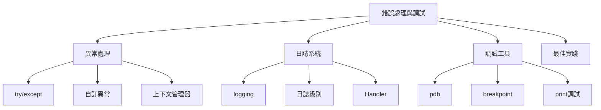

# 06-錯誤處理與調試

## 📖 核心概念

- **異常處理**: try/except/finally
- **自訂異常**: Exception 類繼承
- **日誌系統**: logging 模組
- **調試工具**: pdb, breakpoint()
- **類型檢查**: mypy



## 🔧 異常處理

### 基礎 try/except

```python
try:
    result = 10 / 0
except ZeroDivisionError as e:
    print(f"Error: {e}")
except ValueError:
    print("Value error occurred")
except (TypeError, KeyError) as e:
    print(f"Type or Key error: {e}")
except Exception as e:
    print(f"Unexpected error: {e}")
finally:
    print("Cleanup code")
```

### 自訂異常

```python
class ValidationError(Exception):
    def __init__(self, field: str, message: str):
        self.field = field
        self.message = message
        super().__init__(f"{field}: {message}")

class User:
    def __init__(self, email: str, age: int):
        if "@" not in email:
            raise ValidationError("email", "Invalid email format")
        if age < 0:
            raise ValidationError("age", "Age cannot be negative")
        self.email = email
        self.age = age

try:
    user = User("invalid-email", 25)
except ValidationError as e:
    print(f"Validation failed: {e}")
```

### 異常鏈

```python
class DatabaseError(Exception):
    pass

def connect_to_db():
    try:
        raise ConnectionError("Cannot connect to database")
    except ConnectionError as e:
        raise DatabaseError("Database operation failed") from e

try:
    connect_to_db()
except DatabaseError as e:
    print(f"Error: {e}")
    print(f"Caused by: {e.__cause__}")
```

## 🔧 日誌系統

### 基礎配置

```python
import logging

logging.basicConfig(
    level=logging.INFO,
    format='%(asctime)s - %(name)s - %(levelname)s - %(message)s',
    handlers=[
        logging.FileHandler('app.log'),
        logging.StreamHandler()
    ]
)

logger = logging.getLogger(__name__)

logger.debug("Debug message")
logger.info("Info message")
logger.warning("Warning message")
logger.error("Error message")
logger.critical("Critical message")
```

### 實戰配置

```python
import logging
from logging.handlers import RotatingFileHandler

def setup_logging():
    logger = logging.getLogger('myapp')
    logger.setLevel(logging.DEBUG)
    
    formatter = logging.Formatter(
        '%(asctime)s - %(name)s - %(levelname)s - %(message)s'
    )
    
    file_handler = RotatingFileHandler(
        'app.log',
        maxBytes=10485760,  # 10MB
        backupCount=5
    )
    file_handler.setLevel(logging.INFO)
    file_handler.setFormatter(formatter)
    
    console_handler = logging.StreamHandler()
    console_handler.setLevel(logging.DEBUG)
    console_handler.setFormatter(formatter)
    
    logger.addHandler(file_handler)
    logger.addHandler(console_handler)
    
    return logger

logger = setup_logging()
logger.info("Application started")
```

## 🔧 調試工具

### pdb 調試器

```python
import pdb

def calculate(x, y):
    result = x + y
    pdb.set_trace()  # 設置斷點
    return result * 2

calculate(5, 3)
```

### breakpoint() (Python 3.7+)

```python
def process_data(data):
    result = []
    for item in data:
        breakpoint()  # 更現代的斷點方式
        result.append(item * 2)
    return result

process_data([1, 2, 3])
```

## 💡 最佳實踐

```python
import logging
from typing import Optional

logger = logging.getLogger(__name__)

class DataProcessor:
    def process(self, data: list) -> Optional[list]:
        try:
            logger.info(f"Processing {len(data)} items")
            result = [self._transform(item) for item in data]
            logger.info("Processing completed successfully")
            return result
        except ValueError as e:
            logger.error(f"Validation error: {e}", exc_info=True)
            raise
        except Exception as e:
            logger.critical(f"Unexpected error: {e}", exc_info=True)
            return None
    
    def _transform(self, item):
        if item < 0:
            raise ValueError("Item must be non-negative")
        return item * 2
```

## ⚠️ 常見陷阱

```python
# ❌ 捕獲過於寬泛
try:
    do_something()
except:  # 會捕獲所有異常包括 KeyboardInterrupt
    pass

# ✅ 具體捕獲
try:
    do_something()
except ValueError:
    handle_value_error()
except Exception as e:
    logger.error(f"Error: {e}")
    raise

# ❌ 空的 except
try:
    risky_operation()
except:
    pass  # 錯誤被忽略

# ✅ 正確處理
try:
    risky_operation()
except Exception as e:
    logger.error(f"Operation failed: {e}")
    handle_error(e)
```
