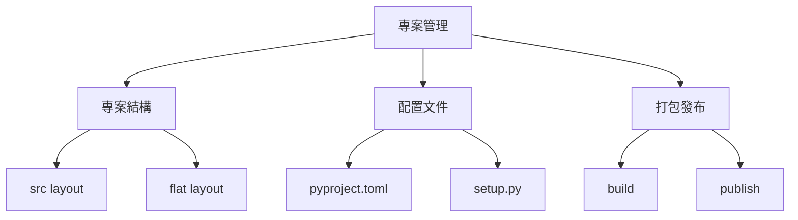

# 07-套件管理與專案結構

## 📖 核心概念

- **專案結構**: src layout, flat layout
- **pyproject.toml**: 專案配置
- **打包發布**: build, publish
- **依賴管理**: uv, poetry



## 🔧 專案結構

### Src Layout (推薦)

```
myproject/
├── .gitignore
├── .python-version
├── pyproject.toml
├── uv.lock
├── README.md
├── tests/
│   ├── __init__.py
│   ├── conftest.py
│   └── test_core.py
└── src/
    └── myproject/
        ├── __init__.py
        ├── __main__.py
        ├── core.py
        ├── api/
        │   ├── __init__.py
        │   └── routes.py
        └── models/
            ├── __init__.py
            └── user.py
```

### pyproject.toml

```toml
[project]
name = "myproject"
version = "0.1.0"
description = "A modern Python project"
readme = "README.md"
requires-python = ">=3.11"
authors = [
    {name = "Your Name", email = "you@example.com"}
]
dependencies = [
    "fastapi>=0.115.0",
    "uvicorn>=0.32.0",
]

[project.optional-dependencies]
dev = [
    "pytest>=8.0.0",
    "ruff>=0.7.0",
    "mypy>=1.13.0",
]

[project.scripts]
myproject = "myproject.__main__:main"

[build-system]
requires = ["hatchling"]
build-backend = "hatchling.build"

[tool.ruff]
line-length = 100
target-version = "py311"

[tool.ruff.lint]
select = ["E", "F", "I", "B", "UP"]

[tool.mypy]
python_version = "3.11"
strict = true

[tool.pytest.ini_options]
testpaths = ["tests"]
pythonpath = ["src"]
```

## 🔧 模組與套件

### __init__.py

```python
# src/myproject/__init__.py
__version__ = "0.1.0"

from .core import main_function
from .models.user import User

__all__ = ["main_function", "User"]
```

### __main__.py

```python
# src/myproject/__main__.py
def main():
    print("Running myproject")

if __name__ == "__main__":
    main()
```

運行：
```bash
python -m myproject
# 或使用 uv
uv run -m myproject
```

## 🔧 打包與發布

### 構建套件

```bash
# 使用 uv 構建
uv build

# 產生的文件
# dist/
# ├── myproject-0.1.0.tar.gz        # source distribution
# └── myproject-0.1.0-py3-none-any.whl  # wheel
```

### 發布到 PyPI

```bash
# 設置 PyPI token
export PYPI_TOKEN="pypi-..."

# 發布
uv publish --token $PYPI_TOKEN

# 測試發布到 TestPyPI
uv publish --token $TEST_PYPI_TOKEN --publish-url https://test.pypi.org/legacy/
```

## 💡 實戰案例：CLI 工具

```
mycli/
├── pyproject.toml
├── README.md
└── src/
    └── mycli/
        ├── __init__.py
        ├── __main__.py
        └── cli.py
```

```python
# src/mycli/cli.py
import argparse

def main():
    parser = argparse.ArgumentParser(description="My CLI tool")
    parser.add_argument("name", help="Your name")
    parser.add_argument("--greeting", default="Hello", help="Greeting message")
    
    args = parser.parse_args()
    print(f"{args.greeting}, {args.name}!")

if __name__ == "__main__":
    main()
```

```python
# src/mycli/__main__.py
from .cli import main

if __name__ == "__main__":
    main()
```

```toml
# pyproject.toml
[project]
name = "mycli"
version = "0.1.0"

[project.scripts]
mycli = "mycli.cli:main"
```

使用：
```bash
# 開發模式安裝
uv pip install -e .

# 使用 CLI
mycli Alice
mycli Bob --greeting "Hi"
```

## 💡 最佳實踐

1. **使用 src layout**
   - 避免意外導入本地模組
   - 強制安裝才能測試

2. **版本管理**
   ```python
   # src/myproject/__init__.py
   __version__ = "0.1.0"
   ```

3. **依賴固定**
   ```toml
   dependencies = [
       "fastapi>=0.115.0,<0.116.0",
       "pydantic>=2.9.0",
   ]
   ```

4. **文檔化**
   - README.md: 專案說明
   - CHANGELOG.md: 版本變更
   - docs/: 詳細文檔

5. **CI/CD**
   ```yaml
   # .github/workflows/test.yml
   name: Test
   on: [push, pull_request]
   jobs:
     test:
       runs-on: ubuntu-latest
       steps:
         - uses: actions/checkout@v4
         - uses: actions/setup-python@v5
         - run: uv sync
         - run: uv run pytest
   ```
