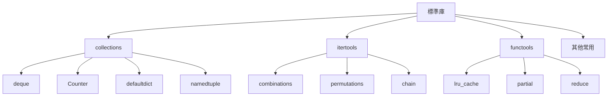

# 08-標準庫精選

## 📖 核心概念

Python 強大的標準庫：
- **collections**: 專業容器
- **itertools**: 迭代器工具
- **functools**: 函數式工具
- **pathlib**: 路徑操作
- **datetime**: 日期時間



## 🔧 collections

### deque - 雙端隊列

```python
from collections import deque

dq = deque([1, 2, 3])
dq.append(4)        # 右側添加
dq.appendleft(0)    # 左側添加
dq.pop()            # 右側移除
dq.popleft()        # 左側移除
dq.rotate(2)        # 旋轉

# 實際應用：滑動窗口
def moving_average(data, window_size):
    window = deque(maxlen=window_size)
    for value in data:
        window.append(value)
        yield sum(window) / len(window)

data = [1, 2, 3, 4, 5, 6, 7, 8, 9, 10]
print(list(moving_average(data, 3)))
```

### Counter - 計數器

```python
from collections import Counter

words = ['apple', 'banana', 'apple', 'cherry', 'banana', 'apple']
counter = Counter(words)

print(counter)              # Counter({'apple': 3, 'banana': 2, 'cherry': 1})
print(counter['apple'])     # 3
print(counter.most_common(2))  # [('apple', 3), ('banana', 2)]

counter.update(['apple', 'date'])
print(counter['apple'])     # 4

# 實際應用：字母頻率
text = "hello world"
char_freq = Counter(text)
print(char_freq.most_common(3))
```

### defaultdict - 預設字典

```python
from collections import defaultdict

# 分組
students = [
    ('Alice', 'A'),
    ('Bob', 'B'),
    ('Charlie', 'A'),
    ('David', 'B'),
]

grade_dict = defaultdict(list)
for name, grade in students:
    grade_dict[grade].append(name)

print(dict(grade_dict))  # {'A': ['Alice', 'Charlie'], 'B': ['Bob', 'David']}

# 計數
word_count = defaultdict(int)
for word in ['apple', 'banana', 'apple']:
    word_count[word] += 1
```

### namedtuple

```python
from collections import namedtuple

Point = namedtuple('Point', ['x', 'y'])
p = Point(3, 4)

print(p.x, p.y)     # 3 4
print(p[0], p[1])   # 3 4

# 實際應用
User = namedtuple('User', ['id', 'name', 'email'])
user = User(1, 'Alice', 'alice@example.com')
print(user.name)
```

## 🔧 itertools

### 組合工具

```python
from itertools import combinations, permutations, product

# 組合（無順序）
print(list(combinations([1, 2, 3], 2)))
# [(1, 2), (1, 3), (2, 3)]

# 排列（有順序）
print(list(permutations([1, 2, 3], 2)))
# [(1, 2), (1, 3), (2, 1), (2, 3), (3, 1), (3, 2)]

# 笛卡爾積
print(list(product([1, 2], ['a', 'b'])))
# [(1, 'a'), (1, 'b'), (2, 'a'), (2, 'b')]
```

### 無限迭代器

```python
from itertools import count, cycle, repeat

# 無限計數
for i in count(10, 2):  # 從 10 開始，步進 2
    if i > 20:
        break
    print(i)  # 10, 12, 14, 16, 18, 20

# 循環
counter = 0
for item in cycle([1, 2, 3]):
    counter += 1
    if counter > 7:
        break
    print(item)  # 1, 2, 3, 1, 2, 3, 1

# 重複
print(list(repeat(10, 3)))  # [10, 10, 10]
```

### 實用工具

```python
from itertools import chain, groupby, islice

# 連接多個迭代器
list1 = [1, 2, 3]
list2 = [4, 5, 6]
print(list(chain(list1, list2)))  # [1, 2, 3, 4, 5, 6]

# 分組
data = [
    ('A', 1), ('A', 2), ('B', 3), ('B', 4), ('C', 5)
]
for key, group in groupby(data, key=lambda x: x[0]):
    print(key, list(group))
# A [('A', 1), ('A', 2)]
# B [('B', 3), ('B', 4)]
# C [('C', 5)]

# 切片
print(list(islice(range(100), 10, 20, 2)))  # [10, 12, 14, 16, 18]
```

## 🔧 functools

### lru_cache

```python
from functools import lru_cache

@lru_cache(maxsize=128)
def fibonacci(n):
    if n <= 1:
        return n
    return fibonacci(n-1) + fibonacci(n-2)

print(fibonacci(100))
print(fibonacci.cache_info())
```

### partial

```python
from functools import partial

def power(base, exponent):
    return base ** exponent

square = partial(power, exponent=2)
cube = partial(power, exponent=3)

print(square(5))  # 25
print(cube(5))    # 125
```

### reduce

```python
from functools import reduce

numbers = [1, 2, 3, 4, 5]
total = reduce(lambda acc, x: acc + x, numbers, 0)
print(total)  # 15

product = reduce(lambda acc, x: acc * x, numbers, 1)
print(product)  # 120
```

## 🔧 pathlib

```python
from pathlib import Path

# 路徑操作
path = Path('/usr/local/bin')
home = Path.home()
cwd = Path.cwd()

# 路徑組合
config_file = Path.home() / '.config' / 'app' / 'config.json'

# 檔案操作
if config_file.exists():
    content = config_file.read_text()

# 目錄操作
config_file.parent.mkdir(parents=True, exist_ok=True)

# 遍歷
for py_file in Path('.').rglob('*.py'):
    print(py_file)
```

## 🔧 datetime

```python
from datetime import datetime, timedelta, timezone

# 當前時間
now = datetime.now()
utc_now = datetime.now(timezone.utc)

# 格式化
formatted = now.strftime('%Y-%m-%d %H:%M:%S')
parsed = datetime.strptime('2024-01-01 12:00:00', '%Y-%m-%d %H:%M:%S')

# 時間計算
tomorrow = now + timedelta(days=1)
week_ago = now - timedelta(weeks=1)

# 比較
if now > parsed:
    print("Now is later")
```

## 💡 實戰案例

```python
from collections import Counter, defaultdict
from itertools import groupby
from functools import lru_cache
from pathlib import Path

def analyze_logs(log_file: Path):
    error_count = Counter()
    errors_by_hour = defaultdict(list)
    
    for line in log_file.read_text().splitlines():
        if 'ERROR' in line:
            hour = line[:13]  # 假設格式為 "2024-01-01 12:00:00 ERROR ..."
            error_type = line.split('ERROR')[1].split(':')[0].strip()
            
            error_count[error_type] += 1
            errors_by_hour[hour].append(error_type)
    
    print("Top 5 errors:")
    for error, count in error_count.most_common(5):
        print(f"  {error}: {count}")
    
    print("\nErrors by hour:")
    for hour, errors in sorted(errors_by_hour.items()):
        print(f"  {hour}: {len(errors)} errors")

# analyze_logs(Path('app.log'))
```
