# 09-測試與品質保證

## 📖 核心概念

- **單元測試**: pytest, unittest
- **測試覆蓋率**: coverage
- **Mock**: unittest.mock
- **測試策略**: TDD, BDD

```mermaid
graph TD
    A[測試與品質] --> B[pytest]
    A --> C[Coverage]
    A --> D[Mock]
    A --> E[CI/CD]
    
    B --> B1[fixtures]
    B --> B2[parametrize]
    B --> B3[markers]
    
    C --> C1[覆蓋率報告]
    C --> C2[分支覆蓋]
    
    D --> D1[Mock對象]
    D --> D2[Patch]
```



## 🔧 pytest 基礎

### 簡單測試

```python
# test_calculator.py
def add(a: int, b: int) -> int:
    return a + b

def test_add():
    assert add(2, 3) == 5
    assert add(-1, 1) == 0
    assert add(0, 0) == 0

def test_add_negative():
    assert add(-5, -3) == -8

# 運行: pytest test_calculator.py
```

### Fixtures

```python
import pytest

@pytest.fixture
def sample_data():
    return [1, 2, 3, 4, 5]

def test_sum(sample_data):
    assert sum(sample_data) == 15

def test_length(sample_data):
    assert len(sample_data) == 5

@pytest.fixture
def database_connection():
    conn = setup_database()
    yield conn  # 提供給測試
    conn.close()  # 清理

def test_query(database_connection):
    result = database_connection.query("SELECT 1")
    assert result == 1
```

### Parametrize

```python
import pytest

@pytest.mark.parametrize("a,b,expected", [
    (2, 3, 5),
    (-1, 1, 0),
    (0, 0, 0),
    (100, 200, 300),
])
def test_add(a, b, expected):
    assert add(a, b) == expected
```

### 異常測試

```python
import pytest

def divide(a: int, b: int) -> float:
    if b == 0:
        raise ValueError("Cannot divide by zero")
    return a / b

def test_divide_by_zero():
    with pytest.raises(ValueError, match="Cannot divide by zero"):
        divide(10, 0)
```

## 🔧 Coverage

```bash
# 安裝
uv add --dev pytest-cov

# 運行測試並生成覆蓋率報告
pytest --cov=src --cov-report=html

# 查看報告
open htmlcov/index.html
```

## 🔧 Mock

```python
from unittest.mock import Mock, patch

# Mock 對象
def test_api_call():
    mock_response = Mock()
    mock_response.status_code = 200
    mock_response.json.return_value = {"data": "success"}
    
    assert mock_response.status_code == 200
    assert mock_response.json() == {"data": "success"}

# Patch
def fetch_user_data(user_id):
    import requests
    response = requests.get(f"https://api.example.com/users/{user_id}")
    return response.json()

@patch('requests.get')
def test_fetch_user_data(mock_get):
    mock_response = Mock()
    mock_response.json.return_value = {"id": 1, "name": "Alice"}
    mock_get.return_value = mock_response
    
    result = fetch_user_data(1)
    assert result["name"] == "Alice"
    mock_get.assert_called_once_with("https://api.example.com/users/1")
```

## 💡 實戰案例

```python
# src/user_service.py
class UserService:
    def __init__(self, db):
        self.db = db
    
    def create_user(self, name: str, email: str) -> dict:
        if not email or "@" not in email:
            raise ValueError("Invalid email")
        user = self.db.insert({"name": name, "email": email})
        return user

# tests/test_user_service.py
import pytest
from unittest.mock import Mock
from src.user_service import UserService

@pytest.fixture
def mock_db():
    db = Mock()
    db.insert.return_value = {"id": 1, "name": "Alice", "email": "alice@example.com"}
    return db

@pytest.fixture
def user_service(mock_db):
    return UserService(mock_db)

def test_create_user_success(user_service, mock_db):
    user = user_service.create_user("Alice", "alice@example.com")
    assert user["name"] == "Alice"
    mock_db.insert.assert_called_once()

def test_create_user_invalid_email(user_service):
    with pytest.raises(ValueError, match="Invalid email"):
        user_service.create_user("Bob", "invalid-email")

@pytest.mark.parametrize("email", ["", "no-at-sign", "@", "test@"])
def test_create_user_invalid_emails(user_service, email):
    with pytest.raises(ValueError):
        user_service.create_user("Test", email)
```

## 💡 最佳實踐

```python
# 1. 使用 fixtures 共享設置
@pytest.fixture(scope="module")
def expensive_resource():
    resource = setup_expensive_resource()
    yield resource
    resource.cleanup()

# 2. 測試命名清晰
def test_user_creation_with_valid_email_succeeds():
    pass

# 3. 一個測試一個斷言
def test_user_has_correct_name():
    user = create_user("Alice")
    assert user.name == "Alice"

def test_user_has_correct_email():
    user = create_user("Alice", "alice@example.com")
    assert user.email == "alice@example.com"

# 4. 使用 parametrize 減少重複
@pytest.mark.parametrize("input,expected", [
    ("valid@email.com", True),
    ("invalid", False),
    ("@test.com", False),
])
def test_email_validation(input, expected):
    assert validate_email(input) == expected
```
