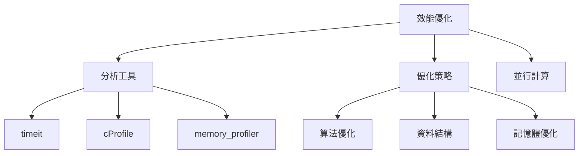

# 10-效能優化

## 📖 核心概念

- **效能分析**: timeit, cProfile
- **記憶體優化**: __slots__, generators
- **並行加速**: multiprocessing, numba
- **資料結構選擇**: list vs set vs dict



## 🔧 效能分析

### timeit

```python
import timeit

# 測試單行程式碼
result = timeit.timeit("sum(range(100))", number=10000)
print(f"Time: {result:.6f}s")

# 測試函數
def test_function():
    return sum(range(100))

result = timeit.timeit(test_function, number=10000)

# 比較不同實現
list_comp = timeit.timeit("[x**2 for x in range(100)]", number=10000)
map_func = timeit.timeit("list(map(lambda x: x**2, range(100)))", number=10000)

print(f"List comprehension: {list_comp:.6f}s")
print(f"Map: {map_func:.6f}s")
```

### cProfile

```python
import cProfile
import pstats

def slow_function():
    total = 0
    for i in range(1000000):
        total += i
    return total

# 分析
profiler = cProfile.Profile()
profiler.enable()
slow_function()
profiler.disable()

# 查看結果
stats = pstats.Stats(profiler)
stats.sort_stats('cumulative')
stats.print_stats(10)
```

## 🔧 優化策略

### 選擇正確的資料結構

```python
import timeit

# ❌ 慢：使用 list 查找
numbers_list = list(range(10000))
timeit.timeit("5000 in numbers_list", globals=globals(), number=10000)

# ✅ 快：使用 set 查找 (O(1))
numbers_set = set(range(10000))
timeit.timeit("5000 in numbers_set", globals=globals(), number=10000)
```

### 使用生成器節省記憶體

```python
# ❌ 記憶體消耗大
def get_numbers(n):
    return [i * 2 for i in range(n)]

numbers = get_numbers(1000000)  # 創建大列表

# ✅ 記憶體友好
def get_numbers_gen(n):
    for i in range(n):
        yield i * 2

numbers = get_numbers_gen(1000000)  # 惰性求值
```

### __slots__ 優化記憶體

```python
import sys

# ❌ 無 __slots__
class Point:
    def __init__(self, x, y):
        self.x = x
        self.y = y

# ✅ 使用 __slots__
class OptimizedPoint:
    __slots__ = ['x', 'y']
    
    def __init__(self, x, y):
        self.x = x
        self.y = y

p1 = Point(1, 2)
p2 = OptimizedPoint(1, 2)

print(f"Normal: {sys.getsizeof(p1.__dict__)} bytes")
print(f"Optimized: {sys.getsizeof(p2)} bytes")
```

### 字串拼接優化

```python
# ❌ 慢：使用 + 拼接
result = ""
for i in range(10000):
    result += str(i)

# ✅ 快：使用 join
result = "".join(str(i) for i in range(10000))

# ✅ 快：使用 f-string（少量拼接）
name = "Alice"
greeting = f"Hello, {name}!"
```

## 🔧 並行加速

### 使用 numba (JIT 編譯)

```python
from numba import jit
import numpy as np

# 普通 Python
def sum_python(arr):
    total = 0
    for i in arr:
        total += i
    return total

# Numba 加速
@jit(nopython=True)
def sum_numba(arr):
    total = 0
    for i in arr:
        total += i
    return total

arr = np.arange(1000000)

# sum_numba 會快 10-100 倍
```

### 使用 multiprocessing

```python
from multiprocessing import Pool

def cpu_intensive_task(n):
    return sum(i * i for i in range(n))

if __name__ == "__main__":
    # 單進程
    results = [cpu_intensive_task(1000000) for _ in range(4)]
    
    # 多進程
    with Pool(4) as pool:
        results = pool.map(cpu_intensive_task, [1000000] * 4)
```

## 💡 實戰案例

```python
from functools import lru_cache
from typing import List

# ❌ 未優化
def fibonacci(n: int) -> int:
    if n <= 1:
        return n
    return fibonacci(n-1) + fibonacci(n-2)

# ✅ 使用快取優化
@lru_cache(maxsize=None)
def fibonacci_cached(n: int) -> int:
    if n <= 1:
        return n
    return fibonacci_cached(n-1) + fibonacci_cached(n-2)

# ❌ 未優化查找
def find_duplicates(nums: List[int]) -> List[int]:
    duplicates = []
    for i in range(len(nums)):
        for j in range(i+1, len(nums)):
            if nums[i] == nums[j] and nums[i] not in duplicates:
                duplicates.append(nums[i])
    return duplicates

# ✅ 使用 set 優化
def find_duplicates_optimized(nums: List[int]) -> List[int]:
    seen = set()
    duplicates = set()
    for num in nums:
        if num in seen:
            duplicates.add(num)
        seen.add(num)
    return list(duplicates)
```

## 💡 最佳實踐

1. **先測量再優化**
   ```python
   import cProfile
   cProfile.run('your_function()')
   ```

2. **使用內建函數**
   ```python
   # ✅ 快
   sum(numbers)
   max(numbers)
   
   # ❌ 慢
   total = 0
   for n in numbers:
       total += n
   ```

3. **避免全局變數**
   ```python
   # ❌ 慢
   global_var = 0
   def increment():
       global global_var
       global_var += 1
   
   # ✅ 快
   def increment(value):
       return value + 1
   ```

4. **使用生成器表達式**
   ```python
   # ✅ 記憶體友好
   total = sum(x**2 for x in range(1000000))
   
   # ❌ 記憶體消耗大
   total = sum([x**2 for x in range(1000000)])
   ```

5. **選擇合適的資料結構**
   - 查找: set, dict (O(1))
   - 排序: list + sort (O(n log n))
   - 插入/刪除: deque (O(1))
   - 優先級: heapq (O(log n))
