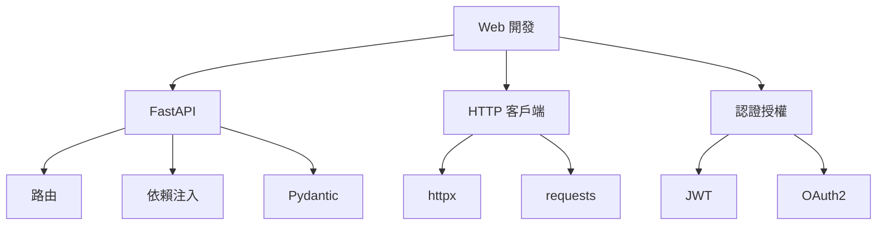

# 11-Web開發基礎

## 📖 核心概念

- **FastAPI**: 現代異步 Web 框架
- **Flask**: 輕量級 Web 框架
- **HTTP 客戶端**: httpx, requests
- **認證**: JWT, OAuth2



## 🔧 FastAPI

### 基礎應用

```python
from fastapi import FastAPI
from pydantic import BaseModel

app = FastAPI()

class User(BaseModel):
    name: str
    email: str
    age: int

@app.get("/")
def read_root():
    return {"message": "Hello World"}

@app.get("/users/{user_id}")
def read_user(user_id: int):
    return {"user_id": user_id}

@app.post("/users")
def create_user(user: User):
    return {"user": user, "message": "User created"}

# 運行: uvicorn main:app --reload
```

### 依賴注入

```python
from fastapi import Depends, HTTPException

def get_db():
    db = DatabaseConnection()
    try:
        yield db
    finally:
        db.close()

@app.get("/items")
def read_items(db = Depends(get_db)):
    return db.query("SELECT * FROM items")
```

### 異步路由

```python
import httpx

@app.get("/fetch/{url}")
async def fetch_url(url: str):
    async with httpx.AsyncClient() as client:
        response = await client.get(url)
        return {"status": response.status_code}
```

## 🔧 HTTP 客戶端

### httpx (異步)

```python
import httpx
import asyncio

async def fetch_users():
    async with httpx.AsyncClient() as client:
        response = await client.get("https://api.github.com/users")
        return response.json()

asyncio.run(fetch_users())
```

### requests (同步)

```python
import requests

response = requests.get("https://api.github.com/users")
print(response.status_code)
print(response.json())

# POST
data = {"name": "Alice", "email": "alice@example.com"}
response = requests.post("https://api.example.com/users", json=data)
```

## 💡 實戰案例：REST API

```python
from fastapi import FastAPI, HTTPException, Depends
from pydantic import BaseModel
from typing import List

app = FastAPI()

class UserCreate(BaseModel):
    name: str
    email: str

class User(BaseModel):
    id: int
    name: str
    email: str

users_db = []
user_id_counter = 1

@app.post("/users", response_model=User, status_code=201)
def create_user(user: UserCreate):
    global user_id_counter
    new_user = User(id=user_id_counter, name=user.name, email=user.email)
    users_db.append(new_user)
    user_id_counter += 1
    return new_user

@app.get("/users", response_model=List[User])
def list_users():
    return users_db

@app.get("/users/{user_id}", response_model=User)
def get_user(user_id: int):
    for user in users_db:
        if user.id == user_id:
            return user
    raise HTTPException(status_code=404, detail="User not found")

@app.delete("/users/{user_id}", status_code=204)
def delete_user(user_id: int):
    for i, user in enumerate(users_db):
        if user.id == user_id:
            users_db.pop(i)
            return
    raise HTTPException(status_code=404, detail="User not found")
```
