# 13-實戰開發模式

## 📖 核心概念

- **設計模式**: Singleton, Factory, Strategy
- **架構模式**: MVC, Repository, Service Layer
- **最佳實踐**: SOLID, DRY, KISS

```mermaid
graph TD
    A[開發模式] --> B[設計模式]
    A --> C[架構模式]
    A --> D[開發原則]
    
    B --> B1[Singleton]
    B --> B2[Factory]
    B --> B3[Strategy]
    
    C --> C1[Repository]
    C --> C2[Service Layer]
    
    D --> D1[SOLID]
    D --> D2[DRY]
```



## 🔧 設計模式

### Singleton

```python
class DatabaseConnection:
    _instance = None
    
    def __new__(cls):
        if cls._instance is None:
            cls._instance = super().__new__(cls)
            cls._instance._initialize()
        return cls._instance
    
    def _initialize(self):
        self.connection = "Connected to DB"

db1 = DatabaseConnection()
db2 = DatabaseConnection()
print(db1 is db2)  # True
```

### Factory

```python
from abc import ABC, abstractmethod

class Animal(ABC):
    @abstractmethod
    def speak(self) -> str:
        pass

class Dog(Animal):
    def speak(self) -> str:
        return "Woof!"

class Cat(Animal):
    def speak(self) -> str:
        return "Meow!"

class AnimalFactory:
    @staticmethod
    def create_animal(animal_type: str) -> Animal:
        if animal_type == "dog":
            return Dog()
        elif animal_type == "cat":
            return Cat()
        raise ValueError(f"Unknown animal type: {animal_type}")

dog = AnimalFactory.create_animal("dog")
print(dog.speak())  # "Woof!"
```

### Strategy

```python
from abc import ABC, abstractmethod

class PaymentStrategy(ABC):
    @abstractmethod
    def pay(self, amount: float) -> str:
        pass

class CreditCardPayment(PaymentStrategy):
    def pay(self, amount: float) -> str:
        return f"Paid ${amount} with credit card"

class PayPalPayment(PaymentStrategy):
    def pay(self, amount: float) -> str:
        return f"Paid ${amount} with PayPal"

class ShoppingCart:
    def __init__(self, payment_strategy: PaymentStrategy):
        self.payment_strategy = payment_strategy
    
    def checkout(self, amount: float) -> str:
        return self.payment_strategy.pay(amount)

cart = ShoppingCart(CreditCardPayment())
print(cart.checkout(100))  # "Paid $100 with credit card"
```

## 🔧 架構模式

### Repository Pattern

```python
from abc import ABC, abstractmethod
from dataclasses import dataclass
from typing import List, Optional

@dataclass
class User:
    id: int
    name: str
    email: str

class UserRepository(ABC):
    @abstractmethod
    def find_by_id(self, user_id: int) -> Optional[User]:
        pass
    
    @abstractmethod
    def find_all(self) -> List[User]:
        pass
    
    @abstractmethod
    def save(self, user: User) -> User:
        pass

class InMemoryUserRepository(UserRepository):
    def __init__(self):
        self._users: dict[int, User] = {}
        self._next_id = 1
    
    def find_by_id(self, user_id: int) -> Optional[User]:
        return self._users.get(user_id)
    
    def find_all(self) -> List[User]:
        return list(self._users.values())
    
    def save(self, user: User) -> User:
        if user.id == 0:
            user.id = self._next_id
            self._next_id += 1
        self._users[user.id] = user
        return user
```

### Service Layer

```python
class UserService:
    def __init__(self, user_repo: UserRepository):
        self.user_repo = user_repo
    
    def create_user(self, name: str, email: str) -> User:
        if not email or "@" not in email:
            raise ValueError("Invalid email")
        
        user = User(id=0, name=name, email=email)
        return self.user_repo.save(user)
    
    def get_user(self, user_id: int) -> Optional[User]:
        return self.user_repo.find_by_id(user_id)

# 使用
repo = InMemoryUserRepository()
service = UserService(repo)

user = service.create_user("Alice", "alice@example.com")
print(user)
```

## 💡 實戰案例：完整應用架構

```python
# models/user.py
from dataclasses import dataclass

@dataclass
class User:
    id: int
    name: str
    email: str

# repositories/user_repository.py
from abc import ABC, abstractmethod
from typing import List, Optional

class UserRepository(ABC):
    @abstractmethod
    def find_by_id(self, user_id: int) -> Optional[User]:
        pass
    
    @abstractmethod
    def save(self, user: User) -> User:
        pass

# services/user_service.py
class UserService:
    def __init__(self, user_repo: UserRepository):
        self.user_repo = user_repo
    
    def register_user(self, name: str, email: str) -> User:
        # 業務邏輯
        if not self._validate_email(email):
            raise ValueError("Invalid email")
        
        user = User(id=0, name=name, email=email)
        return self.user_repo.save(user)
    
    def _validate_email(self, email: str) -> bool:
        return "@" in email and "." in email

# api/routes.py (FastAPI)
from fastapi import FastAPI, Depends

app = FastAPI()

def get_user_service() -> UserService:
    repo = InMemoryUserRepository()
    return UserService(repo)

@app.post("/users")
def create_user(
    name: str,
    email: str,
    service: UserService = Depends(get_user_service)
):
    user = service.register_user(name, email)
    return {"user": user}
```

## 💡 SOLID 原則

### Single Responsibility Principle

```python
# ❌ 違反 SRP
class User:
    def __init__(self, name: str):
        self.name = name
    
    def save_to_db(self):
        # 資料庫操作不應在 User 類中
        pass

# ✅ 遵守 SRP
class User:
    def __init__(self, name: str):
        self.name = name

class UserRepository:
    def save(self, user: User):
        # 負責資料庫操作
        pass
```

### Dependency Inversion Principle

```python
# ❌ 高層模組依賴低層模組
class EmailService:
    def send(self, message: str):
        print(f"Sending: {message}")

class NotificationService:
    def __init__(self):
        self.email_service = EmailService()  # 硬編碼依賴
    
    def notify(self, message: str):
        self.email_service.send(message)

# ✅ 依賴抽象
from abc import ABC, abstractmethod

class MessageSender(ABC):
    @abstractmethod
    def send(self, message: str):
        pass

class EmailSender(MessageSender):
    def send(self, message: str):
        print(f"Email: {message}")

class NotificationService:
    def __init__(self, sender: MessageSender):
        self.sender = sender  # 依賴注入
    
    def notify(self, message: str):
        self.sender.send(message)
```

## 💡 最佳實踐

1. **使用依賴注入**
   ```python
   class Service:
       def __init__(self, repo: Repository):
           self.repo = repo
   ```

2. **面向介面編程**
   ```python
   from abc import ABC, abstractmethod
   
   class Repository(ABC):
       @abstractmethod
       def save(self, entity): pass
   ```

3. **保持函數簡短**
   ```python
   def process_user(user_data: dict):
       user = validate_user_data(user_data)
       user = enrich_user_data(user)
       return save_user(user)
   ```

4. **使用型別提示**
   ```python
   def get_user(user_id: int) -> Optional[User]:
       pass
   ```

5. **編寫可測試的程式碼**
   ```python
   # 使用依賴注入讓測試更容易
   class UserService:
       def __init__(self, repo: UserRepository):
           self.repo = repo
   
   # 測試時可以使用 mock
   def test_user_service():
       mock_repo = Mock(spec=UserRepository)
       service = UserService(mock_repo)
   ```
