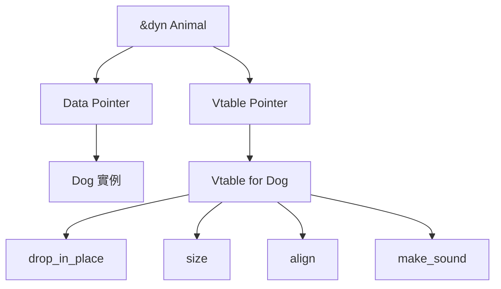

# 03 - Trait 系統深度解析

## 概述

Trait 是 Rust 的核心抽象機制,類似於其他語言的 interface,但功能更強大。Trait 定義共享行為,支持多態、泛型約束、運算符重載等功能。

### 核心特性

- **靜態分派 (Static Dispatch)**: `impl Trait` 編譯期確定具體類型,零成本抽象
- **動態分派 (Dynamic Dispatch)**: `dyn Trait` 運行期查表調用,靈活但有開銷
- **Coherence**: 孤兒規則保證 trait 實現的唯一性

---

## Trait 進階語法

### 關聯類型 (Associated Types)

關聯類型在 trait 中定義抽象類型,由實現者指定具體類型。

```rust
// 使用關聯類型
trait Iterator {
    type Item;
    
    fn next(&mut self) -> Option<Self::Item>;
}

struct Counter {
    count: u32,
}

impl Iterator for Counter {
    type Item = u32; // 指定關聯類型
    
    fn next(&mut self) -> Option<Self::Item> {
        self.count += 1;
        if self.count < 6 {
            Some(self.count)
        } else {
            None
        }
    }
}

fn main() {
    let mut counter = Counter { count: 0 };
    assert_eq!(counter.next(), Some(1));
    assert_eq!(counter.next(), Some(2));
}
```

#### 關聯類型 vs 泛型參數

```rust
// 使用泛型 (允許多個實現)
trait Graph<N, E> {
    fn edges(&self, node: &N) -> Vec<E>;
}

// 使用關聯類型 (每個類型只有一個實現)
trait BetterGraph {
    type Node;
    type Edge;
    
    fn edges(&self, node: &Self::Node) -> Vec<Self::Edge>;
}

// 使用關聯類型時,調用更簡潔
fn print_edges<G: BetterGraph>(graph: &G, node: &G::Node) {
    let edges = graph.edges(node);
    println!("邊數: {}", edges.len());
}
```

### 默認實現 (Default Implementations)

```rust
trait Summary {
    fn summarize_author(&self) -> String;
    
    // 默認實現
    fn summarize(&self) -> String {
        format!("(閱讀更多來自 {}...)", self.summarize_author())
    }
}

struct Tweet {
    username: String,
    content: String,
}

impl Summary for Tweet {
    fn summarize_author(&self) -> String {
        format!("@{}", self.username)
    }
    
    // 可以不實現 summarize,使用默認版本
}

fn main() {
    let tweet = Tweet {
        username: "horse_ebooks".to_string(),
        content: "of course".to_string(),
    };
    
    println!("{}", tweet.summarize());
}
```

### 父 Trait (Supertraits)

```rust
use std::fmt::Display;

// Display 是 PrintableAndComparable 的父 trait
trait PrintableAndComparable: Display + PartialOrd {
    fn print_comparison(&self, other: &Self) {
        if self < other {
            println!("{} < {}", self, other);
        } else {
            println!("{} >= {}", self, other);
        }
    }
}

impl PrintableAndComparable for i32 {}

fn main() {
    let a = 5;
    let b = 10;
    a.print_comparison(&b);
}
```

---

## `impl Trait` vs `dyn Trait`

### `impl Trait` - 靜態分派

編譯期確定具體類型,編譯器會為每個具體類型生成專門的代碼。

```rust
use std::fmt::Display;

// 返回實現 Display 的具體類型 (編譯期確定)
fn returns_impl_trait() -> impl Display {
    42 // 編譯器知道返回 i32
}

// 參數位置的 impl Trait
fn print_it(item: impl Display) {
    println!("{}", item);
}

// 等價於泛型寫法
fn print_it_generic<T: Display>(item: T) {
    println!("{}", item);
}

fn main() {
    let value = returns_impl_trait();
    print_it(value);
}
```

**優點**:
- 零運行時開銷 (內聯優化)
- 編譯器可進行激進優化
- 可返回不可命名的類型 (如閉包)

**限制**:
- 返回值類型必須唯一確定
- 不能有多個不同的具體類型

```rust
// ❌ 錯誤: 返回類型不一致
// fn bad_example(switch: bool) -> impl Display {
//     if switch {
//         42 // i32
//     } else {
//         "hello" // &str
//     }
// }
```

### `dyn Trait` - 動態分派

運行期通過虛表 (vtable) 調用方法,支持運行時多態。

```rust
trait Drawable {
    fn draw(&self);
}

struct Circle {
    radius: f64,
}

struct Rectangle {
    width: f64,
    height: f64,
}

impl Drawable for Circle {
    fn draw(&self) {
        println!("繪製半徑為 {} 的圓", self.radius);
    }
}

impl Drawable for Rectangle {
    fn draw(&self) {
        println!("繪製 {}x{} 的矩形", self.width, self.height);
    }
}

fn draw_all(shapes: &[Box<dyn Drawable>]) {
    for shape in shapes {
        shape.draw(); // 運行時動態調用
    }
}

fn main() {
    let shapes: Vec<Box<dyn Drawable>> = vec![
        Box::new(Circle { radius: 5.0 }),
        Box::new(Rectangle { width: 10.0, height: 20.0 }),
    ];
    
    draw_all(&shapes);
}
```

**優點**:
- 支持異構集合 (存儲不同類型)
- 運行時靈活性

**代價**:
- 虛函數調用開銷 (通常 ~10-20% 性能損失)
- 需要額外的指針間接
- 無法內聯優化

### Trait Objects 的 vtable 機制

```rust
trait Animal {
    fn make_sound(&self);
}

struct Dog;
impl Animal for Dog {
    fn make_sound(&self) {
        println!("Woof!");
    }
}

fn main() {
    let dog = Dog;
    let animal: &dyn Animal = &dog;
    
    // 內存佈局:
    // animal = (data_ptr, vtable_ptr)
    //          ↓          ↓
    //        Dog 實例   指向 Dog::make_sound 的指針
    
    animal.make_sound(); // 通過 vtable 查找函數地址
}
```

#### Vtable 結構圖



---

## Object Safety 規則

Trait object (`dyn Trait`) 要求 trait 必須是 **object-safe**。

### Object-Safe 的條件

1. **返回值不能是 `Self`**
2. **沒有泛型方法**

```rust
// ❌ 不是 object-safe
trait NotObjectSafe {
    fn returns_self() -> Self; // 返回 Self
    fn generic_method<T>(&self, value: T); // 泛型方法
}

// ✅ Object-safe
trait ObjectSafe {
    fn method(&self);
}

// 編譯錯誤
// let obj: Box<dyn NotObjectSafe> = ...;
```

### 使用 `where Self: Sized` 繞過限制

```rust
trait Cloneable {
    fn clone(&self) -> Self
    where
        Self: Sized; // 只在已知具體大小時可用
    
    fn clone_box(&self) -> Box<dyn Cloneable>;
}

impl Cloneable for i32 {
    fn clone(&self) -> Self {
        *self
    }
    
    fn clone_box(&self) -> Box<dyn Cloneable> {
        Box::new(*self)
    }
}
```

---

## Blanket Implementations (覆蓋實現)

為所有滿足條件的類型提供實現。

```rust
use std::fmt::Display;

trait MyTrait {
    fn print(&self);
}

// 為所有實現 Display 的類型實現 MyTrait
impl<T: Display> MyTrait for T {
    fn print(&self) {
        println!("{}", self);
    }
}

fn main() {
    42.print(); // i32 實現了 Display,自動獲得 MyTrait
    "hello".print(); // &str 同理
}
```

### 標準庫中的例子

```rust
// std::convert::From 的 blanket implementation
impl<T> From<T> for T {
    fn from(t: T) -> T {
        t
    }
}
```

---

## Marker Traits (標記 Trait)

沒有方法的 trait,用於向編譯器傳達類型的特定屬性。

### `Send` - 可跨線程傳遞所有權

```rust
fn send_to_thread<T: Send>(value: T) {
    std::thread::spawn(move || {
        println!("在新線程中使用值");
    });
}

// 大多數類型自動實現 Send
// Rc<T> 不實現 Send (引用計數不是線程安全的)
```

### `Sync` - 可跨線程共享引用

```rust
// T: Sync 意味著 &T 可以安全地在線程間共享
fn share_across_threads<T: Sync>(value: &T) {
    std::thread::scope(|s| {
        s.spawn(|| {
            println!("線程 1 訪問");
        });
        s.spawn(|| {
            println!("線程 2 訪問");
        });
    });
}
```

**關係**: `T: Sync` ⟺ `&T: Send`

### `Copy` - 值語義複製

```rust
#[derive(Copy, Clone)]
struct Point {
    x: i32,
    y: i32,
}

fn main() {
    let p1 = Point { x: 1, y: 2 };
    let p2 = p1; // 複製而非移動
    println!("p1: ({}, {})", p1.x, p1.y); // p1 仍然有效
}
```

**要求**: 所有字段必須實現 `Copy`

### `Sized` - 編譯期已知大小

```rust
// 大多數類型都是 Sized
fn generic<T: Sized>(value: T) {}

// ?Sized 允許動態大小類型
fn maybe_unsized<T: ?Sized>(value: &T) {}

fn main() {
    let s: &str = "hello"; // str 是 !Sized (動態大小)
    maybe_unsized(s); // ✅
    // generic(*s); // ❌ str 不是 Sized
}
```

---

## 孤兒規則與 Newtype 模式

### 孤兒規則 (Orphan Rule)

只有在以下情況才能為類型實現 trait:
1. Trait 在當前 crate 中定義,或
2. 類型在當前 crate 中定義

```rust
// ❌ 錯誤: 無法為外部類型實現外部 trait
// impl std::fmt::Display for Vec<i32> {
//     ...
// }
```

### Newtype 模式繞過限制

```rust
use std::fmt;

// 包裝外部類型
struct Wrapper(Vec<i32>);

// 現在可以為 Wrapper 實現外部 trait
impl fmt::Display for Wrapper {
    fn fmt(&self, f: &mut fmt::Formatter<'_>) -> fmt::Result {
        write!(f, "{:?}", self.0)
    }
}

fn main() {
    let w = Wrapper(vec![1, 2, 3]);
    println!("{}", w);
}
```

#### Newtype 的其他用途

```rust
// 型別安全
struct Meters(f64);
struct Kilometers(f64);

fn travel(distance: Kilometers) {
    println!("旅行 {} 公里", distance.0);
}

fn main() {
    let km = Kilometers(5.0);
    travel(km);
    
    // let m = Meters(5000.0);
    // travel(m); // ❌ 類型不匹配
}
```

---

## Trait 別名 (Rust 1.75+)

簡化複雜的 trait bounds。

```rust
// 定義 trait 別名
trait Printable = std::fmt::Display + std::fmt::Debug;

fn print_value<T: Printable>(value: T) {
    println!("Display: {}", value);
    println!("Debug: {:?}", value);
}

// 更複雜的例子
trait Service = Clone + Send + Sync + 'static;

fn start_service<T: Service>(service: T) {
    // ...
}
```

---

## 進階模式與技巧

### 1. Extension Trait 模式

為現有類型添加方法而不修改原類型。

```rust
trait StringExt {
    fn word_count(&self) -> usize;
}

impl StringExt for str {
    fn word_count(&self) -> usize {
        self.split_whitespace().count()
    }
}

fn main() {
    let text = "Hello world from Rust";
    println!("詞數: {}", text.word_count());
}
```

### 2. Builder 模式與 Trait

```rust
trait Builder {
    type Output;
    
    fn build(self) -> Self::Output;
}

struct ConfigBuilder {
    host: Option<String>,
    port: Option<u16>,
}

struct Config {
    host: String,
    port: u16,
}

impl ConfigBuilder {
    fn new() -> Self {
        ConfigBuilder {
            host: None,
            port: None,
        }
    }
    
    fn host(mut self, host: String) -> Self {
        self.host = Some(host);
        self
    }
    
    fn port(mut self, port: u16) -> Self {
        self.port = Some(port);
        self
    }
}

impl Builder for ConfigBuilder {
    type Output = Config;
    
    fn build(self) -> Config {
        Config {
            host: self.host.unwrap_or_else(|| "localhost".to_string()),
            port: self.port.unwrap_or(8080),
        }
    }
}

fn main() {
    let config = ConfigBuilder::new()
        .host("127.0.0.1".to_string())
        .port(3000)
        .build();
    
    println!("{}:{}", config.host, config.port);
}
```

### 3. Trait 作為類型約束

```rust
use std::ops::Add;

fn add_values<T>(a: T, b: T) -> T
where
    T: Add<Output = T>,
{
    a + b
}

fn main() {
    assert_eq!(add_values(5, 10), 15);
    assert_eq!(add_values(3.5, 2.5), 6.0);
}
```

### 4. 關聯常量

```rust
trait MathConstants {
    const PI: f64;
    const E: f64;
}

struct StandardMath;

impl MathConstants for StandardMath {
    const PI: f64 = 3.14159265359;
    const E: f64 = 2.71828182846;
}

fn main() {
    println!("π = {}", StandardMath::PI);
}
```

---

## GATs (Generic Associated Types, Rust 1.65+)

關聯類型可以擁有泛型參數。

```rust
trait LendingIterator {
    type Item<'a> where Self: 'a;
    
    fn next<'a>(&'a mut self) -> Option<Self::Item<'a>>;
}

struct WindowsMut<'data, T> {
    data: &'data mut [T],
    window_size: usize,
    current: usize,
}

impl<'data, T> LendingIterator for WindowsMut<'data, T> {
    type Item<'a> = &'a mut [T] where Self: 'a;
    
    fn next<'a>(&'a mut self) -> Option<Self::Item<'a>> {
        if self.current + self.window_size > self.data.len() {
            return None;
        }
        
        let start = self.current;
        self.current += 1;
        
        // 這裡需要 unsafe 或更複雜的實現
        // 簡化示例
        None
    }
}
```

### GATs 應用場景

- **生命期相關的抽象**
- **高階類型模式**
- **Stream 與 async trait**

```rust
trait AsyncIterator {
    type Item<'a> where Self: 'a;
    
    async fn next(&mut self) -> Option<Self::Item<'_>>;
}
```

---

## 性能考量

### 單態化 (Monomorphization)

泛型在編譯期展開為具體類型,每個類型生成獨立代碼。

```rust
fn print<T: std::fmt::Display>(value: T) {
    println!("{}", value);
}

fn main() {
    print(42);      // 生成 print::<i32>
    print("hello"); // 生成 print::<&str>
}
```

**優點**: 零運行時開銷  
**缺點**: 編譯產物大小增加

### 動態分派開銷測試

```rust
use std::time::Instant;

trait Compute {
    fn compute(&self, x: i32) -> i32;
}

struct Add(i32);
impl Compute for Add {
    fn compute(&self, x: i32) -> i32 {
        x + self.0
    }
}

fn static_dispatch<T: Compute>(c: &T, x: i32) -> i32 {
    c.compute(x)
}

fn dynamic_dispatch(c: &dyn Compute, x: i32) -> i32 {
    c.compute(x)
}

fn main() {
    let add = Add(10);
    let iterations = 100_000_000;
    
    // 靜態分派
    let start = Instant::now();
    let mut sum = 0;
    for i in 0..iterations {
        sum += static_dispatch(&add, i);
    }
    println!("靜態: {:?}", start.elapsed());
    
    // 動態分派
    let dyn_add: &dyn Compute = &add;
    let start = Instant::now();
    let mut sum = 0;
    for i in 0..iterations {
        sum += dynamic_dispatch(dyn_add, i);
    }
    println!("動態: {:?}", start.elapsed());
}
```

---

## 實戰案例: 實現通用的序列化框架

```rust
use std::collections::HashMap;

// 序列化 trait
trait Serialize {
    fn serialize(&self) -> String;
}

// 反序列化 trait
trait Deserialize: Sized {
    fn deserialize(data: &str) -> Option<Self>;
}

// 為基本類型實現
impl Serialize for i32 {
    fn serialize(&self) -> String {
        self.to_string()
    }
}

impl Deserialize for i32 {
    fn deserialize(data: &str) -> Option<Self> {
        data.parse().ok()
    }
}

impl Serialize for String {
    fn serialize(&self) -> String {
        format!("\"{}\"", self)
    }
}

// 為 Vec 實現 (blanket implementation)
impl<T: Serialize> Serialize for Vec<T> {
    fn serialize(&self) -> String {
        let items: Vec<String> = self.iter().map(|item| item.serialize()).collect();
        format!("[{}]", items.join(", "))
    }
}

// 自定義類型
struct User {
    id: i32,
    name: String,
}

impl Serialize for User {
    fn serialize(&self) -> String {
        format!(
            "{{\"id\": {}, \"name\": {}}}",
            self.id.serialize(),
            self.name.serialize()
        )
    }
}

fn main() {
    let user = User {
        id: 1,
        name: "Alice".to_string(),
    };
    
    println!("{}", user.serialize());
    
    let numbers = vec![1, 2, 3, 4, 5];
    println!("{}", numbers.serialize());
}

#[cfg(test)]
mod tests {
    use super::*;
    
    #[test]
    fn test_serialize() {
        assert_eq!(42.serialize(), "42");
        assert_eq!(String::from("test").serialize(), "\"test\"");
        assert_eq!(vec![1, 2, 3].serialize(), "[1, 2, 3]");
    }
}
```

---

## 常見陷阱與解決方案

### 1. Trait Object 生命期問題

```rust
// ❌ 錯誤: 生命期不明確
// fn create_trait_object() -> Box<dyn std::fmt::Display> {
//     let s = String::from("temp");
//     Box::new(&s) // s 在函數結束時被銷毀
// }

// ✅ 解決: 返回擁有的數據
fn create_trait_object() -> Box<dyn std::fmt::Display> {
    Box::new(String::from("owned"))
}
```

### 2. Coherence 衝突

```rust
trait MyTrait {}

// ❌ 可能與其他 crate 衝突
// impl<T> MyTrait for T {}

// ✅ 限制範圍
impl<T: Clone> MyTrait for T {}
```

---

## 參考資料

1. [The Rust Programming Language - Traits](https://doc.rust-lang.org/book/ch10-02-traits.html)
2. [Rust Reference - Traits](https://doc.rust-lang.org/reference/items/traits.html)
3. [Rustonomicon - Trait Objects](https://doc.rust-lang.org/nomicon/exotic-sizes.html#dynamically-sized-types-dsts)
4. [Object Safety](https://doc.rust-lang.org/reference/items/traits.html#object-safety)
5. [GATs Stabilization](https://blog.rust-lang.org/2022/10/28/gats-stabilization.html)
6. [Trait Aliases RFC](https://rust-lang.github.io/rfcs/1733-trait-alias.html)
7. [Effective Rust: Traits](https://www.lurklurk.org/effective-rust/traits.html)
