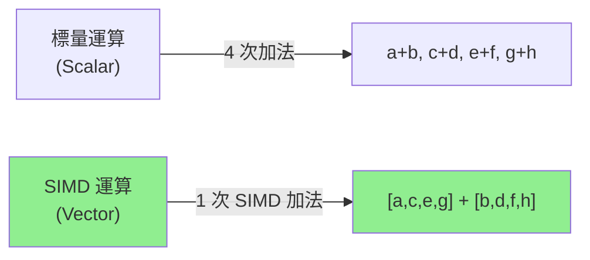

# SIMD 向量化編程 (SIMD Vectorization)

## 核心概念

### SIMD 簡介

**SIMD (Single Instruction Multiple Data)**: 單條指令同時處理多個數據，是現代 CPU 的並行計算能力。

**常見 SIMD 指令集**:
- **x86/x86_64**: SSE2 (128-bit), AVX2 (256-bit), AVX-512 (512-bit)
- **ARM**: NEON (128-bit), SVE (可變長度)
- **WebAssembly**: WASM SIMD (128-bit)

**性能提升**:
- 128-bit SIMD: 處理 4 個 `f32` 或 2 個 `f64` → **4x 加速**
- 256-bit SIMD: 處理 8 個 `f32` 或 4 個 `f64` → **8x 加速**



---

## Rust SIMD 生態

### 1. 標準庫 `std::simd` (Portable SIMD)

**狀態**: Nightly only (`#![feature(portable_simd)]`)

```rust
#![feature(portable_simd)]
use std::simd::{f32x4, SimdFloat};

fn add_vectors(a: &[f32], b: &[f32], result: &mut [f32]) {
    let (a_chunks, a_remainder) = a.as_chunks::<4>();
    let (b_chunks, b_remainder) = b.as_chunks::<4>();
    let (result_chunks, result_remainder) = result.as_chunks_mut::<4>();
    
    // SIMD 處理
    for ((a_chunk, b_chunk), result_chunk) in 
        a_chunks.iter().zip(b_chunks).zip(result_chunks) 
    {
        let va = f32x4::from_array(*a_chunk);
        let vb = f32x4::from_array(*b_chunk);
        let vr = va + vb;
        *result_chunk = vr.to_array();
    }
    
    // 處理剩餘元素
    for i in 0..a_remainder.len() {
        result_remainder[i] = a_remainder[i] + b_remainder[i];
    }
}
```

### 2. `packed_simd` Crate (已棄用，遷移至標準庫)

### 3. 平台特定內建函數 (Intrinsics)

```rust
#[cfg(target_arch = "x86_64")]
use std::arch::x86_64::*;

#[target_feature(enable = "avx2")]
unsafe fn dot_product_avx2(a: &[f32; 8], b: &[f32; 8]) -> f32 {
    let va = _mm256_loadu_ps(a.as_ptr());
    let vb = _mm256_loadu_ps(b.as_ptr());
    let product = _mm256_mul_ps(va, vb);
    
    // 水平相加
    let sum128 = _mm_add_ps(
        _mm256_castps256_ps128(product),
        _mm256_extractf128_ps::<1>(product)
    );
    let sum64 = _mm_add_ps(sum128, _mm_movehl_ps(sum128, sum128));
    let sum32 = _mm_add_ss(sum64, _mm_shuffle_ps::<0x1>(sum64, sum64));
    
    _mm_cvtss_f32(sum32)
}
```

---

## 使用 `std::simd` (推薦方式)

### 基本向量類型

```rust
#![feature(portable_simd)]
use std::simd::*;

// 整數向量
let vi32 = i32x4::from_array([1, 2, 3, 4]);
let vi64 = i64x2::from_array([100, 200]);

// 浮點向量
let vf32 = f32x8::splat(1.0);  // [1.0, 1.0, ..., 1.0]
let vf64 = f64x4::from_array([1.0, 2.0, 3.0, 4.0]);

// 向量運算
let sum = vi32 + i32x4::splat(10);  // [11, 12, 13, 14]
let product = vf32 * f32x8::splat(2.0);
```

### 常用操作

```rust
#![feature(portable_simd)]
use std::simd::*;

fn simd_operations() {
    let a = f32x4::from_array([1.0, 2.0, 3.0, 4.0]);
    let b = f32x4::from_array([5.0, 6.0, 7.0, 8.0]);
    
    // 算術運算
    let sum = a + b;
    let diff = a - b;
    let product = a * b;
    let quotient = a / b;
    
    // 比較運算 (返回 mask)
    let mask = a.simd_gt(f32x4::splat(2.5));
    
    // 條件選擇
    let result = mask.select(a, b);  // 如果 a[i] > 2.5 則選 a[i]，否則選 b[i]
    
    // 歸約運算
    let max_val = a.reduce_max();
    let min_val = a.reduce_min();
    let sum_val = a.reduce_sum();
}
```

---

## 實戰案例

### 案例 1：向量點積

```rust
#![feature(portable_simd)]
use std::simd::*;

/// 計算兩個向量的點積 (Dot Product)
fn dot_product_simd(a: &[f32], b: &[f32]) -> f32 {
    assert_eq!(a.len(), b.len());
    
    let (a_chunks, a_remainder) = a.as_chunks::<8>();
    let (b_chunks, b_remainder) = b.as_chunks::<8>();
    
    // SIMD 累加
    let mut sum_vec = f32x8::splat(0.0);
    for (a_chunk, b_chunk) in a_chunks.iter().zip(b_chunks) {
        let va = f32x8::from_array(*a_chunk);
        let vb = f32x8::from_array(*b_chunk);
        sum_vec += va * vb;
    }
    
    // 歸約為標量
    let mut result = sum_vec.reduce_sum();
    
    // 處理剩餘元素
    for i in 0..a_remainder.len() {
        result += a_remainder[i] * b_remainder[i];
    }
    
    result
}

// 性能對比
fn dot_product_scalar(a: &[f32], b: &[f32]) -> f32 {
    a.iter().zip(b).map(|(x, y)| x * y).sum()
}
```

### 案例 2：圖像處理 - 灰度轉換

```rust
#![feature(portable_simd)]
use std::simd::*;

/// RGB 轉灰度：Gray = 0.299*R + 0.587*G + 0.114*B
fn rgb_to_grayscale_simd(rgb: &[u8], grayscale: &mut [u8]) {
    assert_eq!(rgb.len() % 3, 0);
    assert_eq!(grayscale.len(), rgb.len() / 3);
    
    const COEF_R: f32 = 0.299;
    const COEF_G: f32 = 0.587;
    const COEF_B: f32 = 0.114;
    
    let coeffs_r = f32x8::splat(COEF_R);
    let coeffs_g = f32x8::splat(COEF_G);
    let coeffs_b = f32x8::splat(COEF_B);
    
    let mut rgb_idx = 0;
    let mut gray_idx = 0;
    
    // 每次處理 8 個像素
    while rgb_idx + 24 <= rgb.len() {
        // 載入 RGB 數據 (交錯格式)
        let r = f32x8::from_array([
            rgb[rgb_idx] as f32, rgb[rgb_idx+3] as f32,
            rgb[rgb_idx+6] as f32, rgb[rgb_idx+9] as f32,
            rgb[rgb_idx+12] as f32, rgb[rgb_idx+15] as f32,
            rgb[rgb_idx+18] as f32, rgb[rgb_idx+21] as f32,
        ]);
        let g = f32x8::from_array([
            rgb[rgb_idx+1] as f32, rgb[rgb_idx+4] as f32,
            rgb[rgb_idx+7] as f32, rgb[rgb_idx+10] as f32,
            rgb[rgb_idx+13] as f32, rgb[rgb_idx+16] as f32,
            rgb[rgb_idx+19] as f32, rgb[rgb_idx+22] as f32,
        ]);
        let b = f32x8::from_array([
            rgb[rgb_idx+2] as f32, rgb[rgb_idx+5] as f32,
            rgb[rgb_idx+8] as f32, rgb[rgb_idx+11] as f32,
            rgb[rgb_idx+14] as f32, rgb[rgb_idx+17] as f32,
            rgb[rgb_idx+20] as f32, rgb[rgb_idx+23] as f32,
        ]);
        
        // 計算灰度值
        let gray = coeffs_r * r + coeffs_g * g + coeffs_b * b;
        let gray_u8 = gray.cast::<u8>();
        
        // 寫入結果
        let gray_array = gray_u8.to_array();
        grayscale[gray_idx..gray_idx+8].copy_from_slice(&gray_array);
        
        rgb_idx += 24;
        gray_idx += 8;
    }
    
    // 處理剩餘像素
    while rgb_idx + 3 <= rgb.len() {
        let r = rgb[rgb_idx] as f32;
        let g = rgb[rgb_idx+1] as f32;
        let b = rgb[rgb_idx+2] as f32;
        grayscale[gray_idx] = (COEF_R * r + COEF_G * g + COEF_B * b) as u8;
        rgb_idx += 3;
        gray_idx += 1;
    }
}
```

### 案例 3：快速排序優化 (Bitonic Sort)

```rust
#![feature(portable_simd)]
use std::simd::*;

/// 對 8 個 i32 進行 SIMD 排序
#[inline]
fn sort_i32x8(v: i32x8) -> i32x8 {
    // Bitonic Sort 網絡 (8 個元素需要 6 個階段)
    let mut data = v;
    
    // 階段 1: 比較距離 1 的元素對
    data = compare_swap(data, [1, 0, 3, 2, 5, 4, 7, 6]);
    
    // 階段 2: 比較距離 2 和 1
    data = compare_swap(data, [2, 3, 0, 1, 6, 7, 4, 5]);
    data = compare_swap(data, [1, 0, 3, 2, 5, 4, 7, 6]);
    
    // 階段 3: 比較距離 4, 2, 1
    data = compare_swap(data, [4, 5, 6, 7, 0, 1, 2, 3]);
    data = compare_swap(data, [2, 3, 0, 1, 6, 7, 4, 5]);
    data = compare_swap(data, [1, 0, 3, 2, 5, 4, 7, 6]);
    
    data
}

#[inline]
fn compare_swap(v: i32x8, indices: [usize; 8]) -> i32x8 {
    let shuffled = v.swizzle_dyn(Simd::from_array(indices));
    v.simd_min(shuffled)
        .simd_max(v.simd_max(shuffled))
}
```

---

## 平台特定優化

### 運行時特性檢測

```rust
#[cfg(target_arch = "x86_64")]
fn process_data(data: &[f32]) -> f32 {
    if is_x86_feature_detected!("avx2") {
        unsafe { process_avx2(data) }
    } else if is_x86_feature_detected!("sse4.1") {
        unsafe { process_sse41(data) }
    } else {
        process_scalar(data)
    }
}

#[target_feature(enable = "avx2")]
#[cfg(target_arch = "x86_64")]
unsafe fn process_avx2(data: &[f32]) -> f32 {
    use std::arch::x86_64::*;
    // AVX2 實現...
    0.0
}

#[target_feature(enable = "sse4.1")]
#[cfg(target_arch = "x86_64")]
unsafe fn process_sse41(data: &[f32]) -> f32 {
    use std::arch::x86_64::*;
    // SSE4.1 實現...
    0.0
}

fn process_scalar(data: &[f32]) -> f32 {
    // 標量實現...
    0.0
}
```

### 編譯期指定 CPU 特性

```toml
# Cargo.toml
[profile.release]
# 為本地 CPU 優化
rustflags = ["-C", "target-cpu=native"]

# 或指定特定特性
rustflags = ["-C", "target-feature=+avx2,+fma"]
```

---

## 性能陷阱與最佳實踐

### 1. 對齊問題

```rust
// ❌ 不好：未對齊的載入/存儲較慢
let data = vec![1.0f32; 100];

// ✅ 好：使用對齊分配
#[repr(align(32))]  // AVX2 需要 32 字節對齊
struct Aligned32<T>(T);

let data = Aligned32(vec![1.0f32; 100]);
```

### 2. 數據依賴

```rust
// ❌ 不好：循環依賴阻止 SIMD
let mut sum = 0.0f32;
for &x in data {
    sum = sum * 0.9 + x;  // sum 依賴上一次迭代
}

// ✅ 好：分塊累加減少依賴
let mut sums = f32x4::splat(0.0);
for chunk in data.chunks_exact(4) {
    sums += f32x4::from_slice(chunk);
}
let sum = sums.reduce_sum();
```

### 3. 分支預測失敗

```rust
// ❌ 不好：條件分支破壞 SIMD
for i in 0..data.len() {
    if data[i] > threshold {
        result[i] = data[i] * 2.0;
    } else {
        result[i] = data[i];
    }
}

// ✅ 好：使用 SIMD mask
let threshold_vec = f32x4::splat(threshold);
for (chunk, result_chunk) in data.chunks_exact(4).zip(result.chunks_exact_mut(4)) {
    let v = f32x4::from_slice(chunk);
    let mask = v.simd_gt(threshold_vec);
    let doubled = v * f32x4::splat(2.0);
    let final_val = mask.select(doubled, v);
    result_chunk.copy_from_slice(&final_val.to_array());
}
```

---

## Benchmark 與驗證

```rust
use criterion::{black_box, criterion_group, criterion_main, Criterion};

fn benchmark_simd(c: &mut Criterion) {
    let a: Vec<f32> = (0..1024).map(|i| i as f32).collect();
    let b: Vec<f32> = (0..1024).map(|i| (i * 2) as f32).collect();
    
    c.bench_function("dot_product_scalar", |bench| {
        bench.iter(|| dot_product_scalar(black_box(&a), black_box(&b)))
    });
    
    c.bench_function("dot_product_simd", |bench| {
        bench.iter(|| dot_product_simd(black_box(&a), black_box(&b)))
    });
}

criterion_group!(benches, benchmark_simd);
criterion_main!(benches);
```

**典型性能提升**:
- 點積運算: **6-8x** 加速 (AVX2)
- 圖像處理: **4-6x** 加速
- 排序網絡: **3-5x** 加速

---

## 參考資料 (References)

1. [Rust Portable SIMD RFC](https://github.com/rust-lang/rfcs/blob/master/text/2366-portable-simd.md)
2. [std::simd Documentation](https://doc.rust-lang.org/std/simd/index.html)
3. [Intel Intrinsics Guide](https://www.intel.com/content/www/us/en/docs/intrinsics-guide/index.html)
4. [ARM NEON Intrinsics](https://developer.arm.com/architectures/instruction-sets/intrinsics/)
5. 《Computer Organization and Design》 (Patterson & Hennessy, 2020) - SIMD 架構章節
