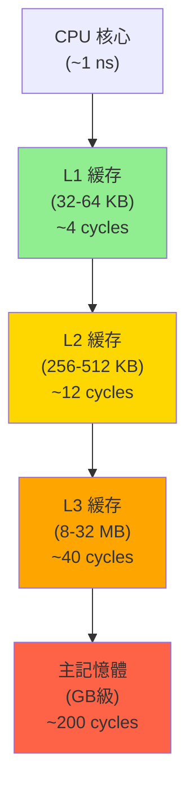

# 緩存友好與數據局部性 (Cache-Friendly & Data Locality)

## 核心概念

### CPU 緩存層級

**現代 CPU 緩存架構** (典型配置):



**關鍵數據**:
- **緩存行大小** (Cache Line): 通常 64 字節
- **L1 訪問**: ~4 cycles (~1-2 ns)
- **主記憶體訪問**: ~200 cycles (~100 ns) → **50x 慢**

### 數據局部性原理

1. **時間局部性 (Temporal Locality)**: 剛訪問的數據很快會再次訪問
2. **空間局部性 (Spatial Locality)**: 訪問某個數據後，其附近的數據也會被訪問

---

## 緩存行與對齊

### 偽共享問題 (False Sharing)

**問題**: 多個線程訪問不同變量，但位於同一緩存行

```rust
// ❌ 不好：偽共享
struct Counter {
    thread1: AtomicU64,  // 0-7 字節
    thread2: AtomicU64,  // 8-15 字節
    // 兩者在同一緩存行，導致緩存行乒乓 (Cache Line Bouncing)
}

// ✅ 好：緩存行填充
#[repr(align(64))]  // 強制 64 字節對齊
struct AlignedCounter {
    thread1: AtomicU64,
    _pad1: [u8; 56],    // 填充到 64 字節
    thread2: AtomicU64,
    _pad2: [u8; 56],
}

// ✅ 更好：使用專用類型
use std::sync::atomic::AtomicU64;

#[repr(align(64))]
struct CacheLinePadded<T>(T);

struct Counter {
    thread1: CacheLinePadded<AtomicU64>,
    thread2: CacheLinePadded<AtomicU64>,
}
```

### 數據結構對齊

```rust
use std::mem::{size_of, align_of};

// 查看對齊要求
assert_eq!(align_of::<u64>(), 8);
assert_eq!(size_of::<u64>(), 8);

// 手動對齊
#[repr(align(64))]
struct Aligned64 {
    data: [u8; 64],
}

// 動態分配對齊內存
use std::alloc::{alloc, dealloc, Layout};

unsafe {
    let layout = Layout::from_size_align(1024, 64).unwrap();
    let ptr = alloc(layout);
    
    // 使用 ptr...
    
    dealloc(ptr, layout);
}
```

---

## 數據布局優化

### 案例 1：結構體字段排序

```rust
// ❌ 不好：浪費內存，緩存效率低
struct BadLayout {
    a: u8,      // 0-0
    // padding: 7 字節
    b: u64,     // 8-15
    c: u8,      // 16-16
    // padding: 7 字節
    d: u64,     // 24-31
}
// 大小: 32 字節，浪費 14 字節

// ✅ 好：緊湊布局
struct GoodLayout {
    b: u64,     // 0-7
    d: u64,     // 8-15
    a: u8,      // 16-16
    c: u8,      // 17-17
    // padding: 6 字節
}
// 大小: 24 字節，浪費 6 字節

// ✅ 最佳：使用 repr(C) 或 repr(packed)
#[repr(C)]  // C 語言布局，字段順序固定
struct CLayout {
    b: u64,
    d: u64,
    a: u8,
    c: u8,
}
```

### 案例 2：AoS vs SoA (Array of Structs vs Struct of Arrays)

```rust
// ❌ AoS: 緩存效率低 (需要跳過無關字段)
struct Particle {
    position: [f32; 3],  // 12 字節
    velocity: [f32; 3],  // 12 字節
    mass: f32,           // 4 字節
}

struct ParticlesAoS {
    particles: Vec<Particle>,  // 每個元素 28 字節
}

// 計算所有粒子位置的平均值
fn compute_avg_position_aos(particles: &ParticlesAoS) -> [f32; 3] {
    let mut sum = [0.0; 3];
    for p in &particles.particles {
        // 每次迭代從緩存載入 28 字節，但只用 12 字節
        sum[0] += p.position[0];
        sum[1] += p.position[1];
        sum[2] += p.position[2];
    }
    sum
}

// ✅ SoA: 緩存友好 (連續訪問相關數據)
struct ParticlesSoA {
    positions_x: Vec<f32>,
    positions_y: Vec<f32>,
    positions_z: Vec<f32>,
    velocities_x: Vec<f32>,
    velocities_y: Vec<f32>,
    velocities_z: Vec<f32>,
    masses: Vec<f32>,
}

fn compute_avg_position_soa(particles: &ParticlesSoA) -> [f32; 3] {
    let mut sum = [0.0; 3];
    
    // 完美的空間局部性：連續訪問同一數組
    for &x in &particles.positions_x { sum[0] += x; }
    for &y in &particles.positions_y { sum[1] += y; }
    for &z in &particles.positions_z { sum[2] += z; }
    
    sum
}
```

**性能對比**:
- SoA 通常比 AoS 快 **2-5x** (取決於訪問模式)
- 適用場景: 只需部分字段的批量操作

---

## 預取與數據訪問模式

### 手動預取 (Prefetch)

```rust
use std::arch::x86_64::*;

/// 預取數據到 L1 緩存
#[inline]
unsafe fn prefetch_l1<T>(ptr: *const T) {
    _mm_prefetch(ptr as *const i8, _MM_HINT_T0);
}

/// 預取數據到 L2 緩存
#[inline]
unsafe fn prefetch_l2<T>(ptr: *const T) {
    _mm_prefetch(ptr as *const i8, _MM_HINT_T1);
}

// 使用範例
fn process_array(data: &[u64]) -> u64 {
    let mut sum = 0u64;
    
    for i in 0..data.len() {
        // 提前預取 8 個元素
        if i + 8 < data.len() {
            unsafe { prefetch_l1(data.as_ptr().add(i + 8)); }
        }
        
        sum = sum.wrapping_add(data[i]);
    }
    
    sum
}
```

### 順序訪問 vs 隨機訪問

```rust
use rand::Rng;

// ✅ 順序訪問：緩存友好
fn sum_sequential(data: &[u64]) -> u64 {
    data.iter().sum()  // 硬件預取器自動預取
}

// ❌ 隨機訪問：緩存未命中率高
fn sum_random(data: &[u64], indices: &[usize]) -> u64 {
    indices.iter().map(|&i| data[i]).sum()
}

// Benchmark 結果 (典型):
// - 順序訪問: ~0.3 ns/元素
// - 隨機訪問: ~50 ns/元素 (167x 慢)
```

---

## 循環優化

### 循環融合 (Loop Fusion)

```rust
// ❌ 不好：兩次循環，兩次緩存載入
fn process_separate(a: &mut [f32], b: &[f32], c: &[f32]) {
    for i in 0..a.len() {
        a[i] += b[i];
    }
    for i in 0..a.len() {
        a[i] *= c[i];
    }
}

// ✅ 好：融合循環，一次緩存載入
fn process_fused(a: &mut [f32], b: &[f32], c: &[f32]) {
    for i in 0..a.len() {
        a[i] = (a[i] + b[i]) * c[i];
    }
}
```

### 循環分塊 (Loop Tiling)

```rust
// ❌ 不好：大矩陣轉置導致緩存抖動
fn transpose_naive(src: &[f32], dst: &mut [f32], rows: usize, cols: usize) {
    for i in 0..rows {
        for j in 0..cols {
            dst[j * rows + i] = src[i * cols + j];
        }
    }
}

// ✅ 好：分塊訪問，提高緩存命中率
fn transpose_tiled(src: &[f32], dst: &mut [f32], rows: usize, cols: usize) {
    const TILE: usize = 16;  // 根據緩存大小調整
    
    for ii in (0..rows).step_by(TILE) {
        for jj in (0..cols).step_by(TILE) {
            // 處理一個 Tile
            let i_end = (ii + TILE).min(rows);
            let j_end = (jj + TILE).min(cols);
            
            for i in ii..i_end {
                for j in jj..j_end {
                    dst[j * rows + i] = src[i * cols + j];
                }
            }
        }
    }
}
```

---

## 實戰案例

### 案例 1：高性能哈希表

```rust
use std::collections::hash_map::DefaultHasher;
use std::hash::{Hash, Hasher};

/// 緩存友好的開放地址哈希表
pub struct CacheFriendlyHashMap<K, V> {
    // SoA 布局：分離鍵、值、元數據
    keys: Vec<Option<K>>,
    values: Vec<V>,
    metadata: Vec<u8>,  // 0 = empty, 1-255 = hash 低 8 位
}

impl<K: Hash + Eq, V: Default> CacheFriendlyHashMap<K, V> {
    pub fn new(capacity: usize) -> Self {
        Self {
            keys: (0..capacity).map(|_| None).collect(),
            values: (0..capacity).map(|_| V::default()).collect(),
            metadata: vec![0; capacity],
        }
    }
    
    pub fn insert(&mut self, key: K, value: V) {
        let hash = self.hash(&key);
        let mut index = (hash as usize) % self.metadata.len();
        
        // 線性探測，先檢查 metadata (緩存友好)
        loop {
            if self.metadata[index] == 0 {
                self.keys[index] = Some(key);
                self.values[index] = value;
                self.metadata[index] = (hash & 0xFF) as u8 | 1;
                break;
            }
            index = (index + 1) % self.metadata.len();
        }
    }
    
    pub fn get(&self, key: &K) -> Option<&V> {
        let hash = self.hash(key);
        let mut index = (hash as usize) % self.metadata.len();
        let target_meta = (hash & 0xFF) as u8 | 1;
        
        loop {
            // 快速路徑：檢查 metadata
            if self.metadata[index] == 0 {
                return None;
            }
            
            if self.metadata[index] == target_meta {
                // 慢速路徑：檢查實際鍵
                if let Some(ref k) = self.keys[index] {
                    if k == key {
                        return Some(&self.values[index]);
                    }
                }
            }
            
            index = (index + 1) % self.metadata.len();
        }
    }
    
    fn hash(&self, key: &K) -> u64 {
        let mut hasher = DefaultHasher::new();
        key.hash(&mut hasher);
        hasher.finish()
    }
}
```

### 案例 2：矩陣乘法優化

```rust
/// 標準矩陣乘法 (緩存不友好)
fn matmul_naive(a: &[f32], b: &[f32], c: &mut [f32], n: usize) {
    for i in 0..n {
        for j in 0..n {
            let mut sum = 0.0;
            for k in 0..n {
                sum += a[i * n + k] * b[k * n + j];  // b 訪問不連續
            }
            c[i * n + j] = sum;
        }
    }
}

/// 分塊 + 轉置矩陣 B (緩存友好)
fn matmul_optimized(a: &[f32], b: &[f32], c: &mut [f32], n: usize) {
    const TILE: usize = 32;
    
    // 轉置 B 以獲得連續訪問
    let mut bt = vec![0.0f32; n * n];
    for i in 0..n {
        for j in 0..n {
            bt[j * n + i] = b[i * n + j];
        }
    }
    
    // 分塊計算
    for ii in (0..n).step_by(TILE) {
        for jj in (0..n).step_by(TILE) {
            for kk in (0..n).step_by(TILE) {
                let i_end = (ii + TILE).min(n);
                let j_end = (jj + TILE).min(n);
                let k_end = (kk + TILE).min(n);
                
                for i in ii..i_end {
                    for j in jj..j_end {
                        let mut sum = c[i * n + j];
                        for k in kk..k_end {
                            sum += a[i * n + k] * bt[j * n + k];
                        }
                        c[i * n + j] = sum;
                    }
                }
            }
        }
    }
}

// 性能提升：10-50x (取決於矩陣大小)
```

---

## 性能分析工具

### 1. perf - Linux 性能分析器

```bash
# 統計緩存未命中
perf stat -e cache-references,cache-misses ./my_program

# 採樣緩存未命中
perf record -e cache-misses ./my_program
perf report

# 查看特定函數的緩存行為
perf annotate my_function
```

### 2. Cachegrind (Valgrind 工具)

```bash
# 運行 cachegrind
valgrind --tool=cachegrind ./my_program

# 查看緩存統計
cg_annotate cachegrind.out.<pid>
```

### 3. Rust 工具: cargo-asm

```bash
# 查看生成的彙編代碼
cargo asm --release my_crate::my_function
```

---

## 最佳實踐

### 1. 數據結構設計清單

- ✅ 將熱數據放在前面 (結構體前幾個字段)
- ✅ 按大小降序排列字段 (減少 padding)
- ✅ 使用 `#[repr(C)]` 固定布局
- ✅ 考慮 SoA 而非 AoS (批量操作場景)
- ✅ 對共享數據使用緩存行填充

### 2. 循環優化清單

- ✅ 順序訪問數組
- ✅ 融合相鄰循環
- ✅ 對大矩陣使用分塊
- ✅ 避免循環內部的分支

### 3. 內存訪問模式

```rust
// ✅ 好：連續訪問
for item in &data {
    process(item);
}

// ❌ 不好：跨步訪問
for i in (0..data.len()).step_by(1024) {
    process(&data[i]);
}

// ❌ 不好：指針追逐 (Pointer Chasing)
let mut node = head;
while let Some(ref next) = node {
    process(next);
    node = &next.next;  // 每次訪問都可能緩存未命中
}
```

---

## 參考資料 (References)

1. [What Every Programmer Should Know About Memory](https://people.freebsd.org/~lstewart/articles/cpumemory.pdf) (Ulrich Drepper, 2007)
2. [Gallery of Processor Cache Effects](http://igoro.com/archive/gallery-of-processor-cache-effects/)
3. [Agner Fog's Optimization Manuals](https://www.agner.org/optimize/)
4. 《Computer Architecture: A Quantitative Approach》 (Hennessy & Patterson, 2017)
5. [Linux perf Documentation](https://perf.wiki.kernel.org/index.php/Tutorial)
